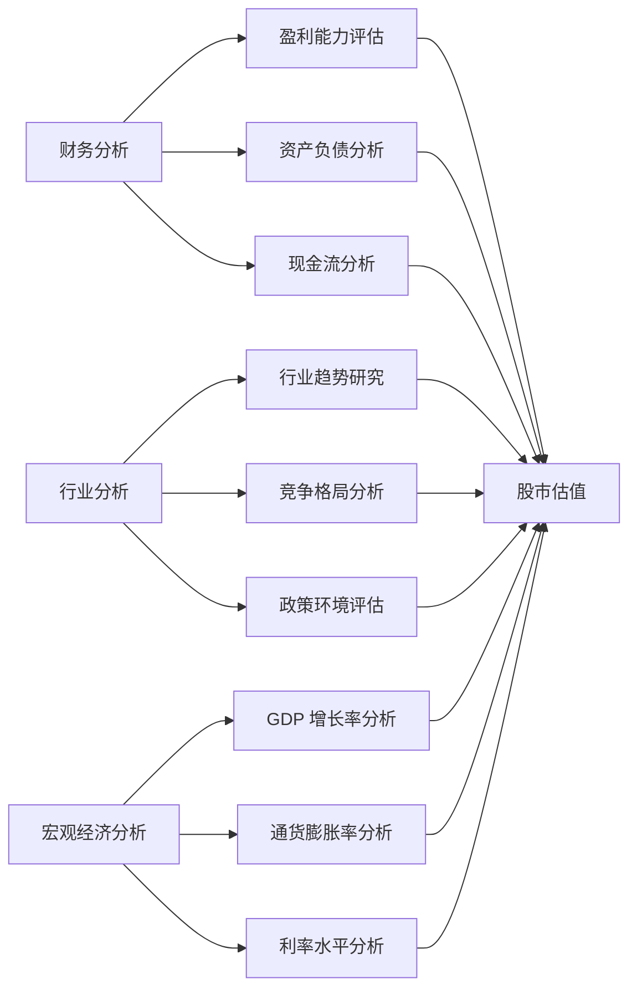
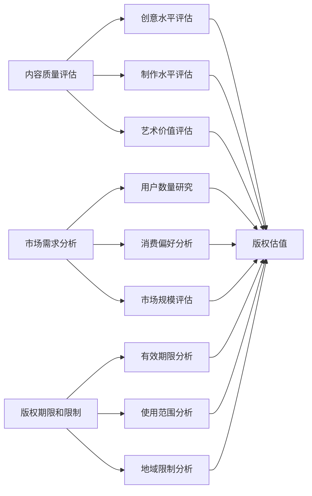
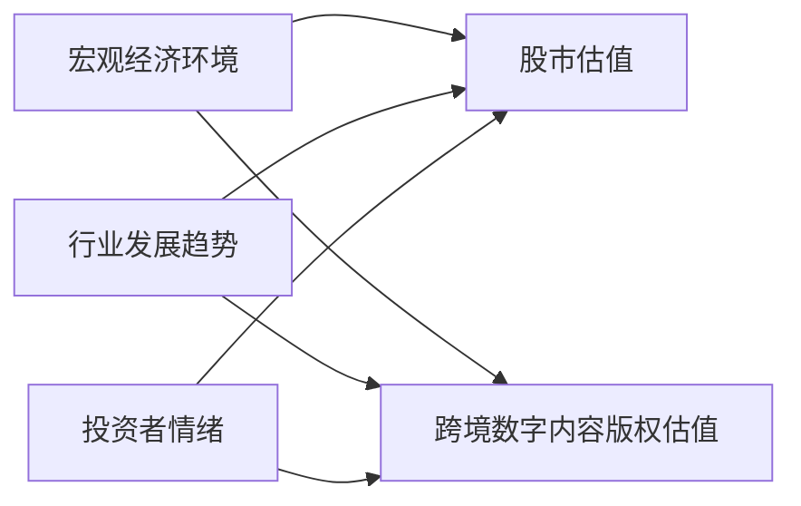

# 股市估值对跨境数字内容版权估值的影响

> 关键词：股市估值、跨境数字内容版权、估值影响、金融市场、版权价值评估

> 摘要：本文旨在深入探讨股市估值对跨境数字内容版权估值的影响。随着数字经济的快速发展，跨境数字内容版权交易日益频繁，其估值的准确性和合理性愈发重要。而股市作为金融市场的重要组成部分，其估值变化反映了宏观经济环境、行业发展趋势等多方面因素。通过研究股市估值与跨境数字内容版权估值之间的关系，有助于理解两者之间的内在联系和相互作用机制，为相关企业和投资者在版权交易、投资决策等方面提供理论支持和实践指导，以更好地把握市场动态，合理评估跨境数字内容版权的价值。

## 1. 背景介绍 
### 1.1 目的和范围
本研究的主要目的是系统分析股市估值对跨境数字内容版权估值的具体影响，揭示两者之间的关联机制。研究范围涵盖了全球主要金融市场的股市估值情况，以及不同类型的跨境数字内容版权，包括但不限于影视版权、音乐版权、游戏版权等。通过对这些内容的研究，旨在为跨境数字内容版权的估值提供更为全面和准确的参考依据，帮助相关市场参与者做出更合理的决策。

### 1.2 预期读者
本文预期读者包括从事跨境数字内容版权交易的企业管理人员、投资机构的分析师和投资者、版权评估机构的专业人员以及对金融市场和数字内容产业感兴趣的研究人员等。这些读者可以从本文中获取关于股市估值与跨境数字内容版权估值关系的深入分析，从而更好地应用于实际工作和研究中。

### 1.3 文档结构概述
本文首先介绍了研究的背景信息，包括目的、预期读者和文档结构概述等内容。接着阐述了股市估值和跨境数字内容版权估值的核心概念及其联系，并通过文本示意图和 Mermaid 流程图进行直观展示。然后详细讲解了相关的核心算法原理和具体操作步骤，同时给出了数学模型和公式，并举例说明。之后通过项目实战，展示了代码实际案例并进行详细解释说明。再探讨了股市估值对跨境数字内容版权估值影响的实际应用场景。随后推荐了相关的工具和资源，包括学习资源、开发工具框架以及论文著作等。最后对未来发展趋势与挑战进行总结，并提供了常见问题与解答以及扩展阅读和参考资料。

### 1.4 术语表
#### 1.4.1 核心术语定义
- **股市估值**：是指对股票市场中上市公司的价值进行评估的过程和结果。它通常基于公司的财务状况、盈利能力、市场前景等多种因素，通过不同的估值方法来确定股票的合理价格范围，反映了市场对上市公司价值的总体判断。
- **跨境数字内容版权**：指跨越不同国家或地区的数字形式的内容所拥有的版权，包括但不限于文字、图片、音频、视频、软件等数字内容的著作权。这些版权具有知识产权属性，受到相关法律法规的保护，并且在全球范围内可以进行交易和传播。
- **版权估值**：是对数字内容版权的经济价值进行评估的过程，通过综合考虑版权的类型、内容质量、市场需求、使用期限、竞争状况等因素，运用合适的估值方法来确定版权在特定时间点的价值。

#### 1.4.2 相关概念解释
- **金融市场**：是资金融通的市场，包括股票市场、债券市场、外汇市场等多个子市场。金融市场的运行状况反映了宏观经济的整体态势，其波动和变化会对企业的融资、投资等经济活动产生重要影响。
- **数字内容产业**：是以数字技术为基础，从事数字内容的创作、生产、传播和销售的产业。该产业涵盖了影视、音乐、游戏、出版等多个领域，随着互联网技术的发展，数字内容产业呈现出快速增长的趋势。
- **知识产权保护**：是指通过法律手段对知识产权所有者的合法权益进行保护的制度和措施。在跨境数字内容版权领域，知识产权保护尤为重要，它确保了版权所有者的利益，促进了数字内容产业的健康发展。

#### 1.4.3 缩略词列表
- **P/E**：市盈率（Price-to-Earnings Ratio），是股票市场中常用的估值指标，计算公式为股票价格除以每股收益，反映了市场对公司盈利预期的估值水平。
- **DCF**：现金流折现法（Discounted Cash Flow），是一种常用的估值方法，通过预测未来现金流量并将其折现到当前时间点来计算资产的价值。
- **NFT**：非同质化代币（Non-Fungible Token），是一种基于区块链技术的数字资产凭证，可用于表示数字内容的唯一性和所有权。

## 2. 核心概念与联系 

### 股市估值的原理和架构
股市估值的核心原理是基于对上市公司未来盈利能力和风险的预期。其架构主要包括以下几个方面：
- **财务分析**：通过对公司的财务报表进行分析，了解公司的资产负债状况、盈利能力、现金流等情况，常用的指标包括净利润、净资产收益率、资产负债率等。
- **行业分析**：研究公司所处的行业发展趋势、市场竞争格局、政策环境等因素，评估公司在行业中的地位和发展前景。
- **宏观经济分析**：考虑宏观经济环境的变化，如 GDP 增长率、通货膨胀率、利率水平等，这些因素会影响公司的经营业绩和市场估值。

以下是股市估值的 Mermaid 流程图：


### 跨境数字内容版权估值的原理和架构
跨境数字内容版权估值的原理是基于版权的未来收益能力和市场价值。其架构主要包括以下几个方面：
- **内容质量评估**：考虑数字内容的创意、制作水平、艺术价值等因素，评估内容的吸引力和竞争力。
- **市场需求分析**：研究目标市场对该数字内容的需求情况，包括用户数量、消费偏好、市场规模等因素。
- **版权期限和限制**：考虑版权的有效期限、使用范围、地域限制等因素，这些因素会影响版权的价值和收益能力。

以下是跨境数字内容版权估值的 Mermaid 流程图：


### 股市估值与跨境数字内容版权估值的联系
股市估值和跨境数字内容版权估值之间存在着多方面的联系：
- **宏观经济环境的共同影响**：宏观经济环境的变化会同时影响股市和跨境数字内容版权市场。例如，经济增长放缓可能导致股市下跌，同时也会影响消费者的消费能力和意愿，从而对跨境数字内容版权的市场需求和价值产生负面影响。
- **行业发展趋势的关联**：数字内容产业的发展趋势会影响相关上市公司的业绩和股市估值，同时也会影响跨境数字内容版权的价值。例如，随着数字内容产业的快速发展，相关上市公司的股价可能会上涨，同时跨境数字内容版权的市场需求也会增加，其价值也会相应提高。
- **投资者情绪的传导**：股市的波动会影响投资者的情绪和信心，这种情绪也会传导到跨境数字内容版权市场。例如，股市暴跌可能会导致投资者对整个市场的信心下降，从而减少对跨境数字内容版权的投资，降低其市场价值。

以下是两者联系的 Mermaid 流程图：


## 3. 核心算法原理 & 具体操作步骤 

### 股市估值的核心算法原理及 Python 实现
股市估值常用的方法之一是市盈率法（P/E 法）。其原理是通过比较公司的市盈率与同行业平均市盈率或市场整体市盈率，来评估公司股票的估值水平。计算公式为：

$$P = E \times P/E$$

其中，$P$ 表示股票价格，$E$ 表示每股收益，$P/E$ 表示市盈率。

以下是使用 Python 实现市盈率法进行股市估值的示例代码：
```python
# 定义每股收益和市盈率
earnings_per_share = 2.5
pe_ratio = 15

# 计算股票价格
stock_price = earnings_per_share * pe_ratio

print(f"股票价格为: {stock_price}")
```
### 跨境数字内容版权估值的核心算法原理及 Python 实现
跨境数字内容版权估值常用的方法之一是现金流折现法（DCF 法）。其原理是通过预测版权未来的现金流量，并将其折现到当前时间点，来计算版权的价值。计算公式为：

$$V = \sum_{t=1}^{n} \frac{CF_t}{(1 + r)^t}$$

其中，$V$ 表示版权价值，$CF_t$ 表示第 $t$ 期的现金流量，$r$ 表示折现率，$n$ 表示预测期数。

以下是使用 Python 实现现金流折现法进行跨境数字内容版权估值的示例代码：
```python
import numpy as np

# 定义现金流量、折现率和预测期数
cash_flows = [10000, 12000, 15000, 18000, 20000]
discount_rate = 0.1
n = len(cash_flows)

# 计算版权价值
copyright_value = np.sum([cash_flows[t] / (1 + discount_rate) ** (t + 1) for t in range(n)])

print(f"跨境数字内容版权价值为: {copyright_value}")
```

### 具体操作步骤
#### 股市估值操作步骤
1. **收集数据**：收集公司的财务报表、行业数据、宏观经济数据等相关信息。
2. **计算每股收益**：根据公司的净利润和总股本计算每股收益。
3. **确定市盈率**：参考同行业平均市盈率或市场整体市盈率，结合公司的具体情况确定合理的市盈率。
4. **计算股票价格**：使用市盈率法计算股票价格。

#### 跨境数字内容版权估值操作步骤
1. **预测现金流量**：分析数字内容的市场需求、竞争状况等因素，预测未来各期的现金流量。
2. **确定折现率**：考虑市场利率、风险水平等因素，确定合适的折现率。
3. **计算版权价值**：使用现金流折现法计算跨境数字内容版权的价值。

## 4. 数学模型和公式 & 详细讲解 & 举例说明 

### 股市估值的数学模型和公式
#### 市盈率法（P/E 法）
公式：$P = E \times P/E$

详细讲解：市盈率法是一种相对简单直观的股市估值方法。每股收益 $E$ 反映了公司的盈利能力，市盈率 $P/E$ 反映了市场对公司盈利预期的估值水平。通过两者的乘积可以得到股票的理论价格 $P$。

举例说明：假设某公司的每股收益为 3 元，同行业平均市盈率为 20 倍。则该公司股票的理论价格为：$P = 3 \times 20 = 60$（元）

#### 市净率法（P/B 法）
公式：$P = B \times P/B$

其中，$P$ 表示股票价格，$B$ 表示每股净资产，$P/B$ 表示市净率。

详细讲解：市净率法主要适用于资产较重的行业，如金融、制造业等。每股净资产 $B$ 反映了公司的账面价值，市净率 $P/B$ 反映了市场对公司净资产的估值水平。通过两者的乘积可以得到股票的理论价格 $P$。

举例说明：假设某公司的每股净资产为 5 元，市净率为 1.5 倍。则该公司股票的理论价格为：$P = 5 \times 1.5 = 7.5$（元）

### 跨境数字内容版权估值的数学模型和公式
#### 现金流折现法（DCF 法）
公式：$V = \sum_{t=1}^{n} \frac{CF_t}{(1 + r)^t}$

详细讲解：现金流折现法是一种基于未来收益的估值方法。$CF_t$ 表示第 $t$ 期的现金流量，反映了版权在未来各期的收益情况。$r$ 表示折现率，考虑了资金的时间价值和风险因素。通过将未来各期的现金流量折现到当前时间点并求和，可以得到版权的价值 $V$。

举例说明：假设某跨境数字内容版权未来 3 年的现金流量分别为 10000 元、12000 元、15000 元，折现率为 10%。则该版权的价值为：

$V = \frac{10000}{(1 + 0.1)^1} + \frac{12000}{(1 + 0.1)^2} + \frac{15000}{(1 + 0.1)^3}$

$V \approx 9090.91 + 9917.36 + 11269.72$

$V \approx 30277.99$（元）

#### 市场比较法
公式：$V = V_{ref} \times \frac{R}{R_{ref}}$

其中，$V$ 表示目标版权的价值，$V_{ref}$ 表示参考版权的价值，$R$ 表示目标版权的相关指标（如市场份额、用户数量等），$R_{ref}$ 表示参考版权的相关指标。

详细讲解：市场比较法是通过比较目标版权和参考版权的相关指标来确定目标版权的价值。参考版权的价值和相关指标是已知的，通过计算目标版权与参考版权相关指标的比例关系，可以得到目标版权的价值。

举例说明：假设参考版权的价值为 20000 元，参考版权的用户数量为 10000 人，目标版权的用户数量为 15000 人。则目标版权的价值为：

$V = 20000 \times \frac{15000}{10000} = 30000$（元）

## 5. 项目实战：代码实际案例和详细解释说明 

### 5.1  开发环境搭建
#### 操作系统
可以选择 Windows、Linux 或 macOS 等主流操作系统。

#### 编程语言和开发工具
- **编程语言**：Python 3.x
- **开发工具**：PyCharm、Jupyter Notebook 等

#### 安装必要的库
使用以下命令安装必要的 Python 库：
```sh
pip install numpy pandas matplotlib
```

### 5.2  源代码详细实现和代码解读
#### 股市估值项目实战
以下是一个使用 Python 实现的股市估值项目示例，通过收集某公司的财务数据，使用市盈率法进行估值：
```python
import pandas as pd

# 收集公司财务数据
data = {
    '净利润': [100000000],
    '总股本': [50000000],
    '同行业平均市盈率': [18]
}

df = pd.DataFrame(data)

# 计算每股收益
df['每股收益'] = df['净利润'] / df['总股本']

# 计算股票价格
df['股票价格'] = df['每股收益'] * df['同行业平均市盈率']

print(df)
```
代码解读：
1. **数据收集**：使用字典 `data` 存储公司的净利润、总股本和同行业平均市盈率等数据，并将其转换为 Pandas 数据框 `df`。
2. **计算每股收益**：通过净利润除以总股本计算每股收益，并将结果存储在数据框的新列 `每股收益` 中。
3. **计算股票价格**：使用每股收益乘以同行业平均市盈率计算股票价格，并将结果存储在数据框的新列 `股票价格` 中。
4. **输出结果**：打印数据框，显示计算结果。

#### 跨境数字内容版权估值项目实战
以下是一个使用 Python 实现的跨境数字内容版权估值项目示例，通过预测版权未来的现金流量，使用现金流折现法进行估值：
```python
import numpy as np

# 预测版权未来的现金流量
cash_flows = [8000, 10000, 12000, 15000, 18000]

# 确定折现率
discount_rate = 0.12

# 计算版权价值
n = len(cash_flows)
copyright_value = np.sum([cash_flows[t] / (1 + discount_rate) ** (t + 1) for t in range(n)])

print(f"跨境数字内容版权价值为: {copyright_value}")
```
代码解读：
1. **预测现金流量**：使用列表 `cash_flows` 存储版权未来各期的现金流量。
2. **确定折现率**：设定折现率为 0.12。
3. **计算版权价值**：使用现金流折现法的公式计算版权价值，并将结果存储在变量 `copyright_value` 中。
4. **输出结果**：打印版权价值。

### 5.3  代码解读与分析
#### 股市估值代码分析
- **数据处理**：使用 Pandas 库进行数据的存储和处理，方便进行数据的计算和分析。
- **估值方法**：使用市盈率法进行股市估值，该方法简单直观，但需要准确的财务数据和合理的市盈率取值。
- **局限性**：市盈率法忽略了公司的未来增长潜力和风险因素，可能导致估值结果不准确。

#### 跨境数字内容版权估值代码分析
- **现金流量预测**：现金流量的预测是跨境数字内容版权估值的关键，需要综合考虑市场需求、竞争状况等因素。
- **折现率确定**：折现率的确定需要考虑资金的时间价值和风险因素，不同的折现率会对估值结果产生较大影响。
- **局限性**：现金流折现法依赖于对未来现金流量的准确预测，而未来的不确定性较大，可能导致估值结果存在偏差。

## 6. 实际应用场景 
### 投资决策
在投资跨境数字内容版权相关的企业或直接投资版权时，股市估值可以作为一个重要的参考因素。如果股市整体估值较高，可能意味着市场对数字内容产业的预期较好，投资者可以适当增加对跨境数字内容版权的投资。反之，如果股市估值较低，投资者需要更加谨慎地评估版权的价值和投资风险。

### 版权交易定价
在跨境数字内容版权交易中，股市估值可以影响版权的定价。当股市估值上升时，版权所有者可能会提高版权的售价，因为他们认为市场对数字内容产业的需求增加，版权的价值也相应提高。而买家在参考股市估值的情况下，会对版权的价格进行合理的评估和谈判。

### 企业战略规划
对于从事跨境数字内容版权业务的企业来说，股市估值可以影响其战略规划。如果股市估值较高，企业可能会加大对版权的收购和开发力度，以扩大市场份额和提升竞争力。反之，如果股市估值较低，企业可能会采取保守的战略，减少投资和降低成本。

### 风险评估
股市估值的波动可以反映市场的风险状况。在评估跨境数字内容版权的风险时，可以参考股市估值的变化。如果股市估值大幅下跌，可能意味着市场风险增加，跨境数字内容版权的价值也可能受到影响。企业和投资者需要及时调整投资策略，降低风险。

## 7. 工具和资源推荐
### 7.1 学习资源推荐
#### 7.1.1 书籍推荐
- 《金融市场学》：全面介绍了金融市场的基本原理和运行机制，包括股票市场、债券市场等，对于理解股市估值有很大帮助。
- 《数字内容产业研究》：深入探讨了数字内容产业的发展现状、趋势和商业模式，有助于了解跨境数字内容版权的相关知识。
- 《资产评估学》：系统讲解了资产评估的方法和理论，包括企业估值、版权估值等内容，是学习估值知识的重要参考书籍。

#### 7.1.2 在线课程
- Coursera 上的“金融市场与投资”课程：由知名大学的教授授课，讲解了金融市场的基础知识和投资策略，包括股市估值的方法和应用。
- edX 上的“数字经济与数字内容产业”课程：介绍了数字经济的发展趋势和数字内容产业的商业模式，对于理解跨境数字内容版权的市场环境有很大帮助。
- 中国大学 MOOC 上的“资产评估理论与实务”课程：详细讲解了资产评估的理论和方法，包括版权估值的具体操作步骤。

#### 7.1.3 技术博客和网站
- 雪球网：是一个专注于股票投资的社区，提供了丰富的股市资讯和分析文章，对于了解股市估值和市场动态有很大帮助。
- 艾瑞咨询网：专注于互联网和数字经济领域的研究，发布了大量关于数字内容产业的研究报告和分析文章，有助于了解跨境数字内容版权的市场趋势。
- 中国资产评估协会官网：提供了资产评估的相关政策法规、行业标准和专业知识，是学习资产评估和版权估值的重要资源。

### 7.2 开发工具框架推荐
#### 7.2.1 IDE和编辑器
- PyCharm：是一款专业的 Python 集成开发环境，提供了丰富的代码编辑、调试和分析功能，适合开发股市估值和跨境数字内容版权估值相关的 Python 程序。
- Jupyter Notebook：是一个交互式的开发环境，支持多种编程语言，适合进行数据探索、分析和可视化，对于股市估值和版权估值的数据处理和分析非常方便。

#### 7.2.2 调试和性能分析工具
- PDB：是 Python 内置的调试工具，可以帮助开发者定位代码中的问题和错误。
- cProfile：是 Python 标准库中的性能分析工具，可以分析代码的运行时间和资源消耗情况，帮助开发者优化代码性能。

#### 7.2.3 相关框架和库
- Pandas：是一个强大的数据处理和分析库，提供了丰富的数据结构和函数，适合处理股市和版权估值相关的数据。
- NumPy：是一个用于科学计算的 Python 库，提供了高效的数组操作和数学函数，对于实现估值算法非常有用。
- Matplotlib：是一个用于数据可视化的 Python 库，可以将股市和版权估值的数据以图表的形式展示出来，方便分析和理解。

### 7.3 相关论文著作推荐
#### 7.3.1 经典论文
- Fama, E. F., & French, K. R. (1992). The cross-section of expected stock returns. Journal of Finance, 47(2), 427-465. 该论文提出了著名的 Fama-French 三因子模型，对于理解股市估值的影响因素有重要意义。
- Copeland, T. E., Koller, T., & Murrin, J. (2000). Valuation: Measuring and managing the value of companies. John Wiley & Sons. 这本书是企业估值领域的经典著作，详细介绍了各种估值方法和理论，包括现金流折现法、市场比较法等。

#### 7.3.2 最新研究成果
- 近年来，随着数字经济的快速发展，关于跨境数字内容版权估值的研究逐渐增多。可以关注国际知名学术期刊，如 Journal of Economic Perspectives、Management Science 等，获取最新的研究成果。

#### 7.3.3 应用案例分析
- 可以参考一些知名企业的跨境数字内容版权交易案例，如迪士尼收购 21 世纪福克斯的部分资产，分析其版权估值的方法和过程，以及股市估值对交易的影响。

## 8. 总结：未来发展趋势与挑战
### 未来发展趋势
#### 数字化和智能化
随着数字技术和人工智能的不断发展，跨境数字内容版权的创作、传播和交易将更加数字化和智能化。例如，利用人工智能技术可以实现版权内容的智能推荐和精准营销，提高版权的市场价值。同时，区块链技术的应用可以实现版权的数字化管理和交易，提高版权交易的效率和安全性。

#### 全球化和多元化
跨境数字内容版权市场将更加全球化和多元化。随着互联网的普及和全球文化交流的加强，不同国家和地区的数字内容版权将在全球范围内进行交易和传播。同时，数字内容的形式和类型也将更加多元化，除了传统的影视、音乐、游戏等，还将出现更多新兴的数字内容形式，如虚拟现实、增强现实等。

#### 金融化和证券化
跨境数字内容版权将逐渐实现金融化和证券化。版权所有者可以将版权进行资产证券化，通过发行债券或股票等方式融资，提高版权的流动性和价值。同时，金融机构也将开发更多与跨境数字内容版权相关的金融产品和服务，如版权质押贷款、版权保险等。

### 挑战
#### 估值方法的准确性和合理性
目前，跨境数字内容版权估值的方法还不够完善，存在一定的主观性和不确定性。例如，现金流折现法需要对未来现金流量进行准确预测，而未来的市场需求和竞争状况难以准确预测。因此，需要进一步研究和完善跨境数字内容版权估值的方法，提高估值的准确性和合理性。

#### 知识产权保护
跨境数字内容版权的知识产权保护是一个全球性的难题。不同国家和地区的法律法规和政策存在差异，版权侵权现象时有发生。因此，需要加强国际合作，建立统一的知识产权保护标准和机制，加强对跨境数字内容版权的保护。

#### 市场波动和风险
股市估值和跨境数字内容版权估值都受到市场波动和风险的影响。例如，宏观经济环境的变化、行业竞争的加剧、技术创新的不确定性等都可能导致股市和版权市场的波动。因此，需要加强市场监测和风险预警，提高企业和投资者的风险应对能力。

## 9. 附录：常见问题与解答
### 股市估值和跨境数字内容版权估值有什么本质区别？
股市估值主要是对上市公司的价值进行评估，考虑的因素包括公司的财务状况、盈利能力、市场前景等。而跨境数字内容版权估值主要是对数字内容版权的经济价值进行评估，考虑的因素包括内容质量、市场需求、版权期限等。两者的评估对象和侧重点不同。

### 如何确定跨境数字内容版权估值中的折现率？
折现率的确定需要考虑多个因素，包括市场利率、风险水平、行业平均收益率等。一般来说，可以参考同行业类似版权的折现率，结合版权的具体情况进行调整。同时，也可以使用资本资产定价模型（CAPM）等方法来计算折现率。

### 股市估值的变化会立即影响跨境数字内容版权估值吗？
股市估值的变化不一定会立即影响跨境数字内容版权估值。股市估值的变化反映了市场对上市公司的预期和信心，而跨境数字内容版权估值受到多种因素的影响，包括内容本身的质量、市场需求、版权期限等。股市估值的变化可能会通过影响投资者情绪、宏观经济环境等间接影响跨境数字内容版权估值，但这种影响需要一定的时间和过程。

### 跨境数字内容版权估值有哪些常用的方法？
跨境数字内容版权估值常用的方法包括现金流折现法、市场比较法、收益分成法等。现金流折现法是基于未来收益的估值方法，通过预测版权未来的现金流量并折现到当前时间点来计算版权的价值。市场比较法是通过比较目标版权和参考版权的相关指标来确定目标版权的价值。收益分成法是根据版权的收益分配比例来计算版权的价值。

## 10. 扩展阅读 & 参考资料
### 扩展阅读
- 《数字时代的版权保护与创新发展》：深入探讨了数字时代版权保护的重要性和面临的挑战，以及如何通过创新发展来推动版权产业的繁荣。
- 《金融科技与数字经济》：介绍了金融科技在数字经济中的应用和发展趋势，对于理解金融市场和数字内容产业的融合有很大帮助。

### 参考资料
- 中国证券监督管理委员会官网：提供了股市相关的政策法规、市场数据和监管信息。
- 国家版权局官网：提供了版权相关的政策法规、行业动态和版权登记信息。
- 国际知识产权组织（WIPO）官网：提供了全球知识产权保护的相关信息和研究报告。