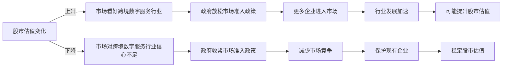

# 股市估值对跨境数字服务市场准入政策的影响

> 关键词：股市估值、跨境数字服务、市场准入政策、经济关联、政策效应

> 摘要：本文深入探讨了股市估值对跨境数字服务市场准入政策的影响。通过对股市估值和跨境数字服务市场准入政策的核心概念阐述，分析二者之间的内在联系。从经济原理和政策制定逻辑出发，研究股市估值变化如何传导至跨境数字服务市场准入政策的制定与调整。借助数学模型和实际案例，揭示这种影响的作用机制和实际效果。同时，探讨了该影响在实际应用场景中的表现，并推荐了相关的学习资源、开发工具及论文著作。最后，总结了未来发展趋势与挑战，旨在为相关领域的研究和实践提供全面且深入的参考。

## 1. 背景介绍 
### 1.1 目的和范围
本研究的目的在于全面且深入地探究股市估值对跨境数字服务市场准入政策的影响。具体范围涵盖了股市估值的形成机制、跨境数字服务市场准入政策的制定原则和实施情况，以及二者之间的相互作用关系。通过对不同国家和地区的案例分析，试图揭示这种影响在全球范围内的普遍性和特殊性，为政策制定者、投资者和企业提供有价值的参考。

### 1.2 预期读者
本文预期读者包括金融领域的研究人员、政策制定者、跨境数字服务企业的管理者和从业者、投资者以及对经济和政策相互关系感兴趣的学者和爱好者。

### 1.3 文档结构概述
本文首先介绍相关背景，包括目的、预期读者和文档结构概述。接着阐述核心概念与联系，分析股市估值和跨境数字服务市场准入政策的原理和架构。然后讲解核心算法原理和具体操作步骤，通过 Python 代码进行详细阐述。随后介绍数学模型和公式，并举例说明。再通过项目实战给出代码实际案例和详细解释。之后探讨实际应用场景。接着推荐相关的工具和资源。最后总结未来发展趋势与挑战，提供常见问题与解答以及扩展阅读和参考资料。

### 1.4 术语表
#### 1.4.1 核心术语定义
- **股市估值**：指对股票市场中上市公司的价值进行评估的过程和结果，通常通过各种估值方法和指标来衡量，如市盈率、市净率等。
- **跨境数字服务**：指通过互联网等数字技术手段，在不同国家和地区之间提供的服务，包括软件服务、在线教育、远程医疗等。
- **市场准入政策**：政府为了规范市场秩序、保护本国产业和消费者利益等目的，对企业进入特定市场所设定的条件和限制措施。

#### 1.4.2 相关概念解释
- **数字经济**：以数字化的知识和信息作为关键生产要素，以现代信息网络作为重要载体，以信息通信技术的有效使用作为效率提升和经济结构优化的重要推动力的一系列经济活动。跨境数字服务是数字经济的重要组成部分。
- **政策传导机制**：指政策从制定到实施，再到对经济主体和市场产生影响的一系列过程和途径。在本文中，主要研究股市估值变化如何通过各种渠道影响跨境数字服务市场准入政策的制定和调整。

#### 1.4.3 缩略词列表
- **GDP**：国内生产总值（Gross Domestic Product）
- **ICT**：信息通信技术（Information and Communication Technology）

## 2. 核心概念与联系 

### 2.1 股市估值原理
股市估值是对上市公司价值的评估，其原理基于公司的基本面和市场预期。基本面包括公司的盈利能力、资产状况、现金流等，市场预期则反映了投资者对公司未来发展的信心和预期。常见的估值方法有市盈率法（P/E）、市净率法（P/B）、现金流折现法（DCF）等。

市盈率法是最常用的估值方法之一，其计算公式为：$P/E=\frac{股价}{每股收益}$。该指标反映了投资者为获取公司每股收益所愿意支付的价格倍数。一般来说，市盈率越高，表明市场对公司的预期越高，但也可能意味着股票被高估。

市净率法的计算公式为：$P/B=\frac{股价}{每股净资产}$。该指标反映了股票价格与公司净资产的关系，市净率较低可能表示股票被低估，具有投资价值。

现金流折现法是通过预测公司未来的现金流，并将其折现到当前时刻，来计算公司的内在价值。其基本公式为：$V=\sum_{t=1}^{n}\frac{CF_t}{(1+r)^t}$，其中 $V$ 表示公司的内在价值，$CF_t$ 表示第 $t$ 期的现金流，$r$ 表示折现率，$n$ 表示预测期数。

### 2.2 跨境数字服务市场准入政策原理
跨境数字服务市场准入政策的制定旨在平衡国家利益、产业发展和消费者权益。一方面，政府希望通过开放市场，促进跨境数字服务的发展，提高本国数字经济的竞争力；另一方面，又要保护本国产业免受外来竞争的冲击，保障国家信息安全和消费者隐私。

市场准入政策的主要内容包括市场准入条件、限制措施和监管要求等。市场准入条件通常包括企业的资质要求、注册资本、技术能力等；限制措施可能包括股权比例限制、业务范围限制等；监管要求则涉及数据安全、知识产权保护、反垄断等方面。

### 2.3 股市估值与跨境数字服务市场准入政策的联系
股市估值的变化可以通过多种途径影响跨境数字服务市场准入政策。一方面，股市估值反映了市场对跨境数字服务企业的预期和信心。当股市估值上升时，表明市场对跨境数字服务行业的前景看好，政府可能会相应地放松市场准入政策，以鼓励更多的企业进入市场，促进产业发展。另一方面，股市估值的波动也可能引发金融风险，政府为了维护金融稳定和国家经济安全，可能会加强对跨境数字服务市场的监管，收紧市场准入政策。

此外，跨境数字服务市场准入政策的调整也会对股市估值产生影响。如果政府放宽市场准入政策，将吸引更多的企业进入市场，增加市场竞争，可能会对现有企业的股价产生一定的压力；但从长期来看，市场的扩大也可能为企业带来更多的发展机会，提升企业的估值。反之，如果政府收紧市场准入政策，可能会减少市场竞争，对现有企业的股价产生积极影响，但也可能限制行业的发展，影响企业的长期估值。

### 2.4 文本示意图
股市估值与跨境数字服务市场准入政策的关系可以用以下文本示意图表示：

股市估值上升 -> 市场对跨境数字服务行业前景看好 -> 政府可能放松市场准入政策 -> 更多企业进入市场 -> 行业发展加速 -> 可能进一步提升股市估值
股市估值下降 -> 市场对跨境数字服务行业信心不足 -> 政府可能收紧市场准入政策 -> 减少市场竞争 -> 保护现有企业 -> 稳定股市估值

### 2.5 Mermaid 流程图


## 3. 核心算法原理 & 具体操作步骤 

### 3.1 股市估值预测算法
为了研究股市估值对跨境数字服务市场准入政策的影响，我们首先需要对股市估值进行预测。这里我们使用简单的线性回归模型来预测股市估值。

线性回归模型的基本原理是通过找到一条直线，使得所有数据点到该直线的距离之和最小。假设我们有 $n$ 个数据点 $(x_i, y_i)$，其中 $x_i$ 是自变量，$y_i$ 是因变量，线性回归模型的表达式为：$y = \beta_0 + \beta_1x + \epsilon$，其中 $\beta_0$ 和 $\beta_1$ 是模型的参数，$\epsilon$ 是误差项。

我们的目标是找到最优的 $\beta_0$ 和 $\beta_1$，使得误差项的平方和最小。可以使用最小二乘法来求解参数。最小二乘法的目标函数为：$S(\beta_0, \beta_1)=\sum_{i=1}^{n}(y_i - (\beta_0 + \beta_1x_i))^2$。

对 $S(\beta_0, \beta_1)$ 分别求关于 $\beta_0$ 和 $\beta_1$ 的偏导数，并令其等于 0，得到以下方程组：

$\begin{cases}
\sum_{i=1}^{n}(y_i - (\beta_0 + \beta_1x_i)) = 0 \\
\sum_{i=1}^{n}x_i(y_i - (\beta_0 + \beta_1x_i)) = 0
\end{cases}$

解这个方程组可以得到 $\beta_0$ 和 $\beta_1$ 的最优解。

### 3.2 Python 代码实现
```python
import numpy as np

# 定义线性回归类
class LinearRegression:
    def __init__(self):
        self.beta_0 = 0
        self.beta_1 = 0

    def fit(self, X, y):
        n = len(X)
        # 计算 X 和 y 的均值
        x_mean = np.mean(X)
        y_mean = np.mean(y)

        # 计算分子和分母
        numerator = np.sum((X - x_mean) * (y - y_mean))
        denominator = np.sum((X - x_mean) ** 2)

        # 计算 beta_1 和 beta_0
        self.beta_1 = numerator / denominator
        self.beta_0 = y_mean - self.beta_1 * x_mean

    def predict(self, X):
        return self.beta_0 + self.beta_1 * X

# 示例数据
X = np.array([1, 2, 3, 4, 5])
y = np.array([2, 4, 6, 8, 10])

# 创建线性回归模型实例
model = LinearRegression()

# 训练模型
model.fit(X, y)

# 预测新数据
new_X = np.array([6])
prediction = model.predict(new_X)

print(f"预测值: {prediction}")
```

### 3.3 具体操作步骤
1. **数据收集**：收集与股市估值相关的数据，如公司的财务指标、市场指数等。
2. **数据预处理**：对收集到的数据进行清洗、整理和标准化处理，以提高模型的准确性。
3. **模型训练**：使用线性回归模型对预处理后的数据进行训练，得到模型的参数。
4. **模型评估**：使用评估指标（如均方误差、决定系数等）对模型的性能进行评估。
5. **预测**：使用训练好的模型对未来的股市估值进行预测。

## 4. 数学模型和公式 & 详细讲解 & 举例说明 

### 4.1 线性回归模型数学公式
线性回归模型的一般形式为：$y = \beta_0 + \beta_1x_1 + \beta_2x_2 + \cdots + \beta_nx_n + \epsilon$，其中 $y$ 是因变量，$x_1, x_2, \cdots, x_n$ 是自变量，$\beta_0, \beta_1, \cdots, \beta_n$ 是模型的参数，$\epsilon$ 是误差项。

在简单线性回归模型中，只有一个自变量，即 $y = \beta_0 + \beta_1x + \epsilon$。

### 4.2 最小二乘法原理
最小二乘法的目标是找到最优的参数 $\beta_0$ 和 $\beta_1$，使得误差项的平方和最小。误差项的平方和可以表示为：$S(\beta_0, \beta_1)=\sum_{i=1}^{n}(y_i - (\beta_0 + \beta_1x_i))^2$。

对 $S(\beta_0, \beta_1)$ 分别求关于 $\beta_0$ 和 $\beta_1$ 的偏导数，并令其等于 0，得到以下方程组：

$\begin{cases}
\sum_{i=1}^{n}(y_i - (\beta_0 + \beta_1x_i)) = 0 \\
\sum_{i=1}^{n}x_i(y_i - (\beta_0 + \beta_1x_i)) = 0
\end{cases}$

解这个方程组可以得到 $\beta_0$ 和 $\beta_1$ 的最优解：

$\beta_1 = \frac{\sum_{i=1}^{n}(x_i - \bar{x})(y_i - \bar{y})}{\sum_{i=1}^{n}(x_i - \bar{x})^2}$

$\beta_0 = \bar{y} - \beta_1\bar{x}$

其中 $\bar{x}$ 和 $\bar{y}$ 分别是 $x$ 和 $y$ 的均值。

### 4.3 举例说明
假设我们有以下数据：

| $x$ | $y$ |
| --- | --- |
| 1 | 2 |
| 2 | 4 |
| 3 | 6 |
| 4 | 8 |
| 5 | 10 |

首先计算 $x$ 和 $y$ 的均值：

$\bar{x} = \frac{1 + 2 + 3 + 4 + 5}{5} = 3$

$\bar{y} = \frac{2 + 4 + 6 + 8 + 10}{5} = 6$

然后计算分子和分母：

$\sum_{i=1}^{5}(x_i - \bar{x})(y_i - \bar{y}) = (1 - 3)(2 - 6) + (2 - 3)(4 - 6) + (3 - 3)(6 - 6) + (4 - 3)(8 - 6) + (5 - 3)(10 - 6) = 20$

$\sum_{i=1}^{5}(x_i - \bar{x})^2 = (1 - 3)^2 + (2 - 3)^2 + (3 - 3)^2 + (4 - 3)^2 + (5 - 3)^2 = 10$

最后计算 $\beta_1$ 和 $\beta_0$：

$\beta_1 = \frac{20}{10} = 2$

$\beta_0 = 6 - 2 \times 3 = 0$

所以线性回归模型为：$y = 2x$。

## 5. 项目实战：代码实际案例和详细解释说明 

### 5.1  开发环境搭建
1. **安装 Python**：从 Python 官方网站（https://www.python.org/downloads/）下载并安装 Python 3.x 版本。
2. **安装必要的库**：使用以下命令安装必要的库：
```sh
pip install numpy pandas matplotlib scikit-learn
```
3. **选择开发工具**：可以选择 PyCharm、Jupyter Notebook 等开发工具。

### 5.2  源代码详细实现和代码解读
```python
import numpy as np
import pandas as pd
import matplotlib.pyplot as plt
from sklearn.model_selection import train_test_split
from sklearn.linear_model import LinearRegression
from sklearn.metrics import mean_squared_error, r2_score

# 读取数据
data = pd.read_csv('stock_valuation_data.csv')

# 提取特征和目标变量
X = data[['feature1', 'feature2', 'feature3']]
y = data['stock_valuation']

# 划分训练集和测试集
X_train, X_test, y_train, y_test = train_test_split(X, y, test_size=0.2, random_state=42)

# 创建线性回归模型实例
model = LinearRegression()

# 训练模型
model.fit(X_train, y_train)

# 预测
y_pred = model.predict(X_test)

# 评估模型
mse = mean_squared_error(y_test, y_pred)
r2 = r2_score(y_test, y_pred)

print(f"均方误差: {mse}")
print(f"决定系数: {r2}")

# 可视化预测结果
plt.scatter(y_test, y_pred)
plt.xlabel('实际值')
plt.ylabel('预测值')
plt.title('实际值 vs 预测值')
plt.show()
```

### 5.3  代码解读与分析
1. **数据读取**：使用 `pandas` 库的 `read_csv` 函数读取存储股市估值数据的 CSV 文件。
2. **特征提取**：从数据中提取特征和目标变量，分别存储在 `X` 和 `y` 中。
3. **数据集划分**：使用 `sklearn` 库的 `train_test_split` 函数将数据集划分为训练集和测试集，测试集占比为 20%。
4. **模型创建和训练**：创建线性回归模型实例，并使用训练集数据对模型进行训练。
5. **预测**：使用训练好的模型对测试集数据进行预测。
6. **模型评估**：使用均方误差（MSE）和决定系数（$R^2$）对模型的性能进行评估。均方误差越小，说明模型的预测误差越小；决定系数越接近 1，说明模型的拟合效果越好。
7. **可视化**：使用 `matplotlib` 库绘制实际值和预测值的散点图，直观地展示模型的预测效果。

## 6. 实际应用场景 
### 6.1 政策制定
政府在制定跨境数字服务市场准入政策时，可以参考股市估值的变化情况。当股市估值上升，表明市场对跨境数字服务行业的前景看好，政府可以适当放宽市场准入政策，鼓励更多的企业进入市场，促进产业发展。例如，降低企业的注册资本要求、放宽股权比例限制等。反之，当股市估值下降，政府可能需要加强对市场的监管，收紧市场准入政策，以防范金融风险和保护本国产业。

### 6.2 企业决策
跨境数字服务企业在进行战略决策时，也需要关注股市估值的变化。如果股市估值上升，企业可以考虑扩大业务规模、进行海外投资或并购等。例如，一家在线教育企业在股市估值上升时，可以加大对海外市场的投入，拓展国际业务。反之，如果股市估值下降，企业可能需要调整战略，收缩业务范围，降低成本，以应对市场风险。

### 6.3 投资者决策
投资者在进行跨境数字服务相关的投资决策时，股市估值是一个重要的参考指标。当股市估值上升时，投资者可以考虑增加对跨境数字服务企业的投资，分享行业发展带来的红利。例如，购买跨境数字服务企业的股票或基金。反之，当股市估值下降时，投资者可能需要谨慎投资，或者减少对该行业的投资比例，以降低投资风险。

## 7. 工具和资源推荐
### 7.1 学习资源推荐
#### 7.1.1 书籍推荐
- 《金融市场学》：全面介绍了金融市场的基本原理和运行机制，包括股票市场、债券市场等。
- 《数字经济时代》：深入探讨了数字经济的发展趋势和影响，对跨境数字服务有详细的阐述。
- 《计量经济学》：讲解了计量经济学的基本理论和方法，对于研究股市估值和政策效应有重要的帮助。

#### 7.1.2 在线课程
- Coursera 上的“金融市场分析”课程：由知名教授授课，系统介绍了金融市场的分析方法和工具。
- edX 上的“数字经济与创新”课程：探讨了数字经济的发展模式和创新机制，以及跨境数字服务的相关问题。
- 中国大学 MOOC 上的“计量经济学基础”课程：适合初学者学习计量经济学的基本原理和应用。

#### 7.1.3 技术博客和网站
- 雪球网：提供股票市场的实时行情、分析报告和投资者交流平台。
- 艾瑞咨询网：专注于互联网和数字经济领域的研究，发布了大量关于跨境数字服务的研究报告和分析文章。
- 国家金融与发展实验室官网：提供金融领域的前沿研究成果和政策解读。

### 7.2 开发工具框架推荐
#### 7.2.1 IDE和编辑器
- PyCharm：功能强大的 Python 集成开发环境，适合开发数据处理和机器学习相关的项目。
- Jupyter Notebook：交互式的开发环境，方便进行数据探索和模型实验。
- Visual Studio Code：轻量级的代码编辑器，支持多种编程语言，具有丰富的插件生态系统。

#### 7.2.2 调试和性能分析工具
- pdb：Python 自带的调试工具，方便进行代码调试和问题排查。
- cProfile：Python 的性能分析工具，可以分析代码的运行时间和资源消耗情况。
- TensorBoard：用于可视化深度学习模型的训练过程和性能指标。

#### 7.2.3 相关框架和库
- NumPy：Python 的数值计算库，提供了高效的数组操作和数学函数。
- Pandas：用于数据处理和分析的库，提供了 DataFrame 等数据结构，方便进行数据清洗、整理和分析。
- Scikit-learn：机器学习库，提供了丰富的机器学习算法和工具，如线性回归、决策树、支持向量机等。

### 7.3 相关论文著作推荐
#### 7.3.1 经典论文
- Fama, E. F., & French, K. R. (1992). The cross-section of expected stock returns. The Journal of Finance, 47(2), 427-465. 该论文提出了著名的 Fama-French 三因子模型，对股票收益率的截面差异进行了深入研究。
- Grossman, S. J., & Stiglitz, J. E. (1980). On the impossibility of informationally efficient markets. The American Economic Review, 70(3), 393-408. 该论文探讨了信息效率市场的不可能性，对金融市场的信息传递和定价机制有重要的影响。

#### 7.3.2 最新研究成果
- 近年来，关于股市估值和跨境数字服务的研究不断涌现。可以通过 Google Scholar、Web of Science 等学术搜索引擎查找最新的研究论文。

#### 7.3.3 应用案例分析
- 一些国际组织和研究机构发布了关于跨境数字服务市场准入政策的应用案例分析报告，如世界贸易组织（WTO）、经济合作与发展组织（OECD）等。这些报告可以为我们提供实际案例和经验借鉴。

## 8. 总结：未来发展趋势与挑战
### 8.1 未来发展趋势
- **数字化加速**：随着数字技术的不断发展，跨境数字服务将呈现快速增长的趋势。股市估值也将更加关注数字服务企业的创新能力和发展潜力。
- **政策协调**：各国政府将加强在跨境数字服务市场准入政策方面的协调与合作，以促进全球数字经济的健康发展。
- **技术创新驱动**：人工智能、区块链、云计算等新兴技术将不断推动跨境数字服务的创新和发展，也将对股市估值和市场准入政策产生深远影响。

### 8.2 挑战
- **数据安全和隐私保护**：跨境数字服务涉及大量的数据传输和存储，数据安全和隐私保护成为重要的挑战。政府需要制定更加严格的监管政策，企业也需要加强技术防范措施。
- **国际竞争加剧**：随着跨境数字服务市场的开放，国际竞争将日益激烈。各国企业需要不断提升自身的竞争力，以应对来自全球的竞争压力。
- **政策不确定性**：不同国家和地区的政策差异较大，政策的不确定性增加了跨境数字服务企业的经营风险。企业需要密切关注政策变化，及时调整战略。

## 9. 附录：常见问题与解答
### 9.1 股市估值的准确性如何保证？
股市估值受到多种因素的影响，包括公司基本面、市场情绪、宏观经济环境等，因此很难完全准确地进行估值。可以采用多种估值方法进行综合评估，并结合市场实际情况进行调整。同时，不断更新和完善数据，提高模型的准确性。

### 9.2 跨境数字服务市场准入政策的调整频率是怎样的？
跨境数字服务市场准入政策的调整频率取决于多种因素，如国家经济发展战略、产业政策、国际形势等。一般来说，政策调整不会过于频繁，以保持政策的稳定性和连续性。但在市场环境发生重大变化时，政府可能会及时调整政策。

### 9.3 如何应对政策不确定性带来的风险？
企业可以采取以下措施应对政策不确定性带来的风险：一是加强对政策的研究和跟踪，及时了解政策变化趋势；二是多元化经营，降低对单一市场和政策的依赖；三是加强与政府的沟通和合作，积极参与政策制定过程，争取有利的政策环境。

## 10. 扩展阅读 & 参考资料
- [1] Brealey, R. A., Myers, S. C., & Allen, F. (2014). Principles of corporate finance. McGraw-Hill Education.
- [2] Shapiro, C., & Varian, H. R. (1999). Information rules: A strategic guide to the network economy. Harvard Business School Press.
- [3] World Trade Organization. (2020). World Trade Report 2020: Government policies and the digital economy.
- [4] 百度百科、维基百科等相关词条。