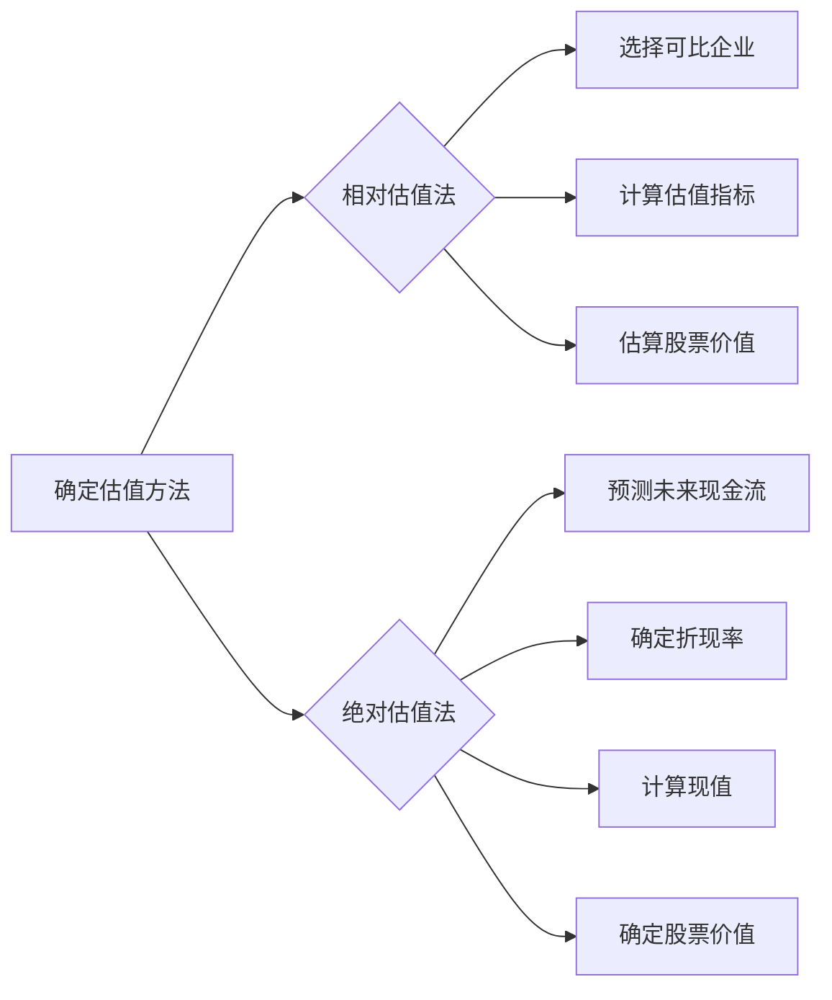
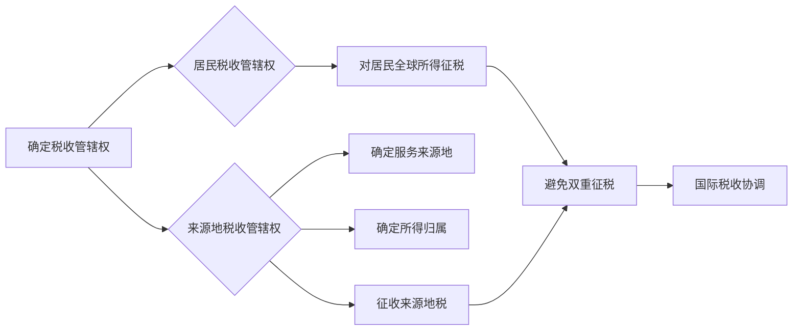

# 股市估值对跨境数字服务税收的影响

> 关键词：股市估值、跨境数字服务、税收、数字经济、国际税收规则

> 摘要：本文聚焦于股市估值对跨境数字服务税收的影响。在数字经济蓬勃发展的当下，跨境数字服务规模不断扩大，而股市估值作为反映企业市场价值和发展预期的重要指标，与跨境数字服务企业的税收状况存在着紧密联系。文章深入剖析了两者的核心概念及内在联系，阐述了相关算法原理和数学模型，通过项目实战案例展示了其在实际中的表现，探讨了具体应用场景，推荐了相关工具和资源，并对未来发展趋势与挑战进行了总结，旨在为理解和应对跨境数字服务税收问题提供全面且深入的参考。

## 1. 背景介绍 
### 1.1 目的和范围
本研究的主要目的在于深入探究股市估值与跨境数字服务税收之间的内在联系和相互影响机制。随着全球数字经济的迅猛发展，跨境数字服务的规模日益扩大，其税收问题成为国际税收领域的焦点。股市估值作为衡量企业市场价值和发展潜力的重要指标，对跨境数字服务企业的税收决策、税收征管以及国际税收规则的制定都具有重要影响。本研究的范围涵盖了股市估值的基本概念、跨境数字服务的特点和税收现状，以及两者之间相互作用的各个方面，包括对企业税收负担、税收管辖权划分和国际税收协调的影响。

### 1.2 预期读者
本文预期读者包括从事国际税收研究的学者、税务机关工作人员、跨境数字服务企业的管理人员和财务人员、关注数字经济发展的政策制定者以及对该领域感兴趣的投资者。这些读者群体可以从本文中获取关于股市估值和跨境数字服务税收的专业知识和深入分析，为其研究、决策和实践提供参考。

### 1.3 文档结构概述
本文共分为十个部分。第一部分为背景介绍，阐述了研究的目的、范围、预期读者和文档结构概述，并给出了相关术语的定义和解释。第二部分介绍了股市估值和跨境数字服务税收的核心概念及其联系，通过文本示意图和 Mermaid 流程图进行了直观展示。第三部分详细讲解了相关的核心算法原理，并给出了具体的操作步骤，同时使用 Python 源代码进行了阐述。第四部分介绍了数学模型和公式，并进行了详细讲解和举例说明。第五部分通过项目实战案例，展示了代码的实际实现和详细解释说明。第六部分探讨了股市估值对跨境数字服务税收的实际应用场景。第七部分推荐了相关的学习资源、开发工具框架和论文著作。第八部分总结了未来发展趋势与挑战。第九部分为附录，解答了常见问题。第十部分提供了扩展阅读和参考资料。

### 1.4 术语表
#### 1.4.1 核心术语定义
- **股市估值**：是指对股票的价值进行评估，通过各种方法和模型来确定股票的内在价值，以判断股票是否被高估或低估。常见的估值方法包括市盈率法、市净率法、现金流折现法等。
- **跨境数字服务**：是指通过互联网等数字技术手段，在不同国家或地区之间提供的服务。这些服务包括但不限于软件服务、在线广告、云计算服务、数字内容服务等。
- **税收管辖权**：是指一个国家或地区对税收征收的权力范围，包括居民税收管辖权和来源地税收管辖权。居民税收管辖权是指对本国居民的全球所得征税，来源地税收管辖权是指对来源于本国境内的所得征税。
- **国际税收协调**：是指各国之间通过协商和合作，解决跨境税收问题，避免双重征税和防止国际税收逃避的过程。国际税收协调的方式包括双边税收协定、多边税收公约和国际税收组织的协调等。

#### 1.4.2 相关概念解释
- **数字经济**：是指以数字化的知识和信息为关键生产要素，以数字技术创新为核心驱动力，以现代信息网络为重要载体，通过数字技术与实体经济深度融合，不断提高传统产业数字化、智能化水平，加速重构经济发展与政府治理模式的新型经济形态。
- **常设机构**：是指企业进行全部或部分营业的固定营业场所。在国际税收中，常设机构是确定来源地税收管辖权的重要依据之一。
- **利润归属原则**：是指确定跨国企业利润在不同国家或地区之间分配的原则。常见的利润归属原则包括独立交易原则、公式分配法等。

#### 1.4.3 缩略词列表
- **GDP**：国内生产总值（Gross Domestic Product）
- **OECD**：经济合作与发展组织（Organisation for Economic Co - operation and Development）
- **BEPS**：税基侵蚀和利润转移（Base Erosion and Profit Shifting）

## 2. 核心概念与联系 

### 股市估值的原理和架构
股市估值是一个复杂的过程，其核心目的是评估股票的内在价值，以便投资者做出合理的投资决策。常见的股市估值方法包括相对估值法和绝对估值法。

相对估值法是通过比较同行业或类似企业的估值指标，如市盈率（P/E）、市净率（P/B）等，来确定目标企业的价值。例如，市盈率法是用企业的每股收益乘以行业平均市盈率来估算企业的股票价值。

绝对估值法是通过预测企业未来的现金流，并将其折现到当前时刻来确定企业的价值。最常用的绝对估值法是现金流折现法（DCF），其基本原理是企业的价值等于其未来自由现金流的现值之和。

下面是股市估值的 Mermaid 流程图：


### 跨境数字服务税收的原理和架构
跨境数字服务税收涉及到多个国家或地区的税收管辖权和税收政策。其核心问题是如何确定跨境数字服务的来源地和所得归属，以及如何避免双重征税和防止国际税收逃避。

目前，国际上主要采用的税收原则包括居民税收管辖权和来源地税收管辖权。居民税收管辖权是指对本国居民的全球所得征税，来源地税收管辖权是指对来源于本国境内的所得征税。在跨境数字服务领域，由于数字服务的无形性和流动性，确定服务的来源地和所得归属变得更加困难。

为了解决跨境数字服务税收问题，国际社会正在推动一系列的税收改革和协调措施，如 OECD 的 BEPS 行动计划等。

下面是跨境数字服务税收的 Mermaid 流程图：


### 股市估值与跨境数字服务税收的联系
股市估值与跨境数字服务税收之间存在着密切的联系。一方面，跨境数字服务企业的股市估值会影响其税收负担。高估值的企业可能会面临更高的税收预期，因为其市场价值和盈利能力被市场看好，税务机关可能会对其进行更严格的税收征管。另一方面，税收政策的变化也会影响跨境数字服务企业的股市估值。例如，税收优惠政策可能会提高企业的盈利能力，从而提升其股市估值；而税收增加则可能会降低企业的盈利能力，导致其股市估值下降。

## 3. 核心算法原理 & 具体操作步骤 

### 股市估值算法原理及 Python 实现
#### 市盈率法
市盈率法是一种常见的相对估值法，其基本公式为：

股票价值 = 每股收益 × 行业平均市盈率

下面是使用 Python 实现市盈率法的代码示例：
```python
def pe_valuation(eps, industry_pe):
    """
    市盈率法估值
    :param eps: 每股收益
    :param industry_pe: 行业平均市盈率
    :return: 股票价值
    """
    return eps * industry_pe

# 示例数据
eps = 2.0
industry_pe = 15

# 计算股票价值
stock_value = pe_valuation(eps, industry_pe)
print(f"股票价值: {stock_value}")
```
#### 现金流折现法
现金流折现法是一种绝对估值法，其基本公式为：

$$V = \sum_{t=1}^{n} \frac{FCF_t}{(1 + r)^t}$$

其中，$V$ 表示企业的价值，$FCF_t$ 表示第 $t$ 期的自由现金流，$r$ 表示折现率，$n$ 表示预测期数。

下面是使用 Python 实现现金流折现法的代码示例：
```python
def dcf_valuation(fcf_list, discount_rate):
    """
    现金流折现法估值
    :param fcf_list: 自由现金流列表
    :param discount_rate: 折现率
    :return: 企业价值
    """
    value = 0
    for t, fcf in enumerate(fcf_list, start=1):
        value += fcf / (1 + discount_rate) ** t
    return value

# 示例数据
fcf_list = [100, 120, 140, 160, 180]
discount_rate = 0.1

# 计算企业价值
company_value = dcf_valuation(fcf_list, discount_rate)
print(f"企业价值: {company_value}")
```

### 跨境数字服务税收计算算法及 Python 实现
假设某跨境数字服务企业在不同国家或地区有业务，其税收计算需要考虑不同国家的税收政策和税收管辖权。下面是一个简单的示例，假设企业在两个国家有业务，分别按照不同的税率计算税收：
```python
def cross_border_tax_calculation(revenue_country1, revenue_country2, tax_rate_country1, tax_rate_country2):
    """
    跨境数字服务税收计算
    :param revenue_country1: 国家1的收入
    :param revenue_country2: 国家2的收入
    :param tax_rate_country1: 国家1的税率
    :param tax_rate_country2: 国家2的税率
    :return: 总税收
    """
    tax_country1 = revenue_country1 * tax_rate_country1
    tax_country2 = revenue_country2 * tax_rate_country2
    total_tax = tax_country1 + tax_country2
    return total_tax

# 示例数据
revenue_country1 = 1000
revenue_country2 = 2000
tax_rate_country1 = 0.2
tax_rate_country2 = 0.15

# 计算总税收
total_tax = cross_border_tax_calculation(revenue_country1, revenue_country2, tax_rate_country1, tax_rate_country2)
print(f"总税收: {total_tax}")
```

## 4. 数学模型和公式 & 详细讲解 & 举例说明 

### 股市估值数学模型
#### 市盈率法
市盈率法的数学模型为：

$V = EPS \times PE$

其中，$V$ 表示股票价值，$EPS$ 表示每股收益，$PE$ 表示行业平均市盈率。

举例说明：假设某跨境数字服务企业的每股收益为 $3$ 元，行业平均市盈率为 $20$，则该企业的股票价值为：

$V = 3 \times 20 = 60$（元）

#### 现金流折现法
现金流折现法的数学模型为：

$$V = \sum_{t=1}^{n} \frac{FCF_t}{(1 + r)^t}$$

其中，$V$ 表示企业的价值，$FCF_t$ 表示第 $t$ 期的自由现金流，$r$ 表示折现率，$n$ 表示预测期数。

举例说明：假设某跨境数字服务企业未来 $5$ 年的自由现金流分别为 $100$ 万元、$120$ 万元、$140$ 万元、$160$ 万元、$180$ 万元，折现率为 $10\%$，则该企业的价值为：

$$
\begin{align*}
V &= \frac{100}{(1 + 0.1)^1} + \frac{120}{(1 + 0.1)^2} + \frac{140}{(1 + 0.1)^3} + \frac{160}{(1 + 0.1)^4} + \frac{180}{(1 + 0.1)^5}\\
&= \frac{100}{1.1} + \frac{120}{1.21} + \frac{140}{1.331} + \frac{160}{1.4641} + \frac{180}{1.61051}\\
&\approx 90.91 + 99.17 + 105.18 + 109.29 + 111.76\\
&= 516.31
\end{align*}
$$

### 跨境数字服务税收数学模型
假设某跨境数字服务企业在 $m$ 个国家或地区有业务，每个国家或地区的收入为 $R_i$，税率为 $T_i$，则该企业的总税收 $T$ 为：

$$T = \sum_{i=1}^{m} R_i T_i$$

举例说明：假设某跨境数字服务企业在三个国家有业务，收入分别为 $500$ 万元、$800$ 万元、$1000$ 万元，税率分别为 $15\%$、$20\%$、$25\%$，则该企业的总税收为：

$$
\begin{align*}
T &= 500 \times 0.15 + 800 \times 0.2 + 1000 \times 0.25\\
&= 75 + 160 + 250\\
&= 485
\end{align*}
$$

## 5. 项目实战：代码实际案例和详细解释说明 

### 5.1  开发环境搭建
本项目实战使用 Python 语言进行开发，开发环境的搭建步骤如下：
1. **安装 Python**：从 Python 官方网站（https://www.python.org/downloads/）下载并安装 Python 3.x 版本。
2. **安装开发工具**：推荐使用 PyCharm 或 Visual Studio Code 作为开发工具。可以从官方网站下载并安装相应的开发工具。
3. **创建虚拟环境**：为了避免不同项目之间的依赖冲突，建议使用虚拟环境。可以使用 `venv` 模块创建虚拟环境，命令如下：
```sh
python -m venv myenv
```
4. **激活虚拟环境**：在 Windows 系统中，激活虚拟环境的命令为：
```sh
myenv\Scripts\activate
```
在 Linux 或 macOS 系统中，激活虚拟环境的命令为：
```sh
source myenv/bin/activate
```
5. **安装必要的库**：本项目需要使用 `numpy`、`pandas` 等库，可以使用 `pip` 命令进行安装，命令如下：
```sh
pip install numpy pandas
```

### 5.2  源代码详细实现和代码解读
下面是一个综合的项目实战代码示例，包括股市估值和跨境数字服务税收计算：
```python
import numpy as np

def pe_valuation(eps, industry_pe):
    """
    市盈率法估值
    :param eps: 每股收益
    :param industry_pe: 行业平均市盈率
    :return: 股票价值
    """
    return eps * industry_pe

def dcf_valuation(fcf_list, discount_rate):
    """
    现金流折现法估值
    :param fcf_list: 自由现金流列表
    :param discount_rate: 折现率
    :return: 企业价值
    """
    value = 0
    for t, fcf in enumerate(fcf_list, start=1):
        value += fcf / (1 + discount_rate) ** t
    return value

def cross_border_tax_calculation(revenue_list, tax_rate_list):
    """
    跨境数字服务税收计算
    :param revenue_list: 各国收入列表
    :param tax_rate_list: 各国税率列表
    :return: 总税收
    """
    revenue_array = np.array(revenue_list)
    tax_rate_array = np.array(tax_rate_list)
    tax_array = revenue_array * tax_rate_array
    total_tax = np.sum(tax_array)
    return total_tax

# 示例数据
eps = 2.5
industry_pe = 18
fcf_list = [120, 140, 160, 180, 200]
discount_rate = 0.1
revenue_list = [800, 1200, 1500]
tax_rate_list = [0.15, 0.2, 0.25]

# 计算股市估值
stock_value_pe = pe_valuation(eps, industry_pe)
company_value_dcf = dcf_valuation(fcf_list, discount_rate)

# 计算跨境数字服务税收
total_tax = cross_border_tax_calculation(revenue_list, tax_rate_list)

print(f"市盈率法股票价值: {stock_value_pe}")
print(f"现金流折现法企业价值: {company_value_dcf}")
print(f"跨境数字服务总税收: {total_tax}")
```
### 5.3  代码解读与分析
- **`pe_valuation` 函数**：该函数实现了市盈率法的股市估值。它接受每股收益和行业平均市盈率作为输入，返回股票价值。
- **`dcf_valuation` 函数**：该函数实现了现金流折现法的股市估值。它接受自由现金流列表和折现率作为输入，通过循环计算未来自由现金流的现值之和，返回企业价值。
- **`cross_border_tax_calculation` 函数**：该函数实现了跨境数字服务税收的计算。它接受各国收入列表和各国税率列表作为输入，使用 `numpy` 数组进行计算，返回总税收。
- **示例数据和计算**：代码中定义了示例数据，包括每股收益、行业平均市盈率、自由现金流列表、折现率、各国收入列表和各国税率列表。然后调用相应的函数进行股市估值和跨境数字服务税收计算，并打印结果。

## 6. 实际应用场景 
### 企业投资决策
对于投资者来说，股市估值是评估跨境数字服务企业投资价值的重要依据。通过对企业的股市估值，投资者可以判断企业的股票是否被高估或低估，从而做出合理的投资决策。同时，跨境数字服务企业的税收状况也会影响其盈利能力和发展前景，投资者在进行投资决策时需要考虑税收因素。

### 税务机关征管
税务机关可以通过分析跨境数字服务企业的股市估值，了解企业的市场价值和盈利能力，从而加强对企业的税收征管。高估值的企业可能具有更高的税收潜力，税务机关可以对其进行重点监管，防止税收流失。同时，税务机关也需要根据跨境数字服务的特点，制定合理的税收政策和征管措施，确保税收的公平和效率。

### 国际税收协调
股市估值和跨境数字服务税收问题涉及到不同国家或地区的利益，需要进行国际税收协调。各国可以通过协商和合作，制定统一的税收规则和标准，避免双重征税和防止国际税收逃避。例如，OECD 的 BEPS 行动计划就是为了应对数字经济带来的税收挑战，加强国际税收协调而制定的。

### 企业战略规划
跨境数字服务企业在进行战略规划时，需要考虑股市估值和税收因素。企业可以通过提高自身的盈利能力和市场价值，提升股市估值，从而吸引更多的投资者和资金。同时，企业也需要合理规划税收策略，降低税收负担，提高企业的竞争力。

## 7. 工具和资源推荐
### 7.1 学习资源推荐
#### 7.1.1 书籍推荐
- 《财务报表分析与股票估值》：本书详细介绍了财务报表分析和股票估值的方法和技巧，对于理解股市估值有很大帮助。
- 《国际税收》：系统阐述了国际税收的基本原理、税收管辖权、国际税收协定等内容，是学习跨境数字服务税收的重要参考书籍。
- 《数字经济与税收变革》：探讨了数字经济对税收制度的影响和挑战，以及相应的税收政策和改革措施。

#### 7.1.2 在线课程
- Coursera 平台上的“Financial Markets”课程：由耶鲁大学教授罗伯特·席勒（Robert Shiller）授课，讲解了金融市场的基本原理和股票估值方法。
- edX 平台上的“International Taxation”课程：介绍了国际税收的基本概念、税收协定和国际税收协调等内容。
- 中国大学 MOOC 上的“数字经济概论”课程：对数字经济的概念、发展趋势和相关政策进行了全面介绍。

#### 7.1.3 技术博客和网站
- 雪球网：是国内知名的财经社区，提供了丰富的股票估值分析和讨论内容。
- 国家税务总局官网：可以获取最新的税收政策和法规信息，对于了解跨境数字服务税收政策有重要参考价值。
- OECD 官网：提供了关于国际税收协调和数字经济税收研究的最新成果和报告。

### 7.2 开发工具框架推荐
#### 7.2.1 IDE和编辑器
- PyCharm：是一款专业的 Python 集成开发环境，具有代码编辑、调试、版本控制等功能，适合 Python 开发。
- Visual Studio Code：是一款轻量级的代码编辑器，支持多种编程语言，具有丰富的插件生态系统，可以方便地进行 Python 开发。

#### 7.2.2 调试和性能分析工具
- PDB：是 Python 自带的调试工具，可以帮助开发者定位代码中的问题。
- cProfile：是 Python 的性能分析工具，可以分析代码的执行时间和函数调用情况，帮助优化代码性能。

#### 7.2.3 相关框架和库
- `numpy`：是 Python 的科学计算库，提供了高效的数组操作和数学函数，在股市估值和税收计算中可以提高计算效率。
- `pandas`：是 Python 的数据处理库，提供了数据结构和数据分析工具，方便对财务数据和税收数据进行处理和分析。

### 7.3 相关论文著作推荐
#### 7.3.1 经典论文
- “The Theory of Stock Valuation”：该论文阐述了股票估值的基本理论和方法，对股市估值的研究具有重要的理论意义。
- “International Taxation in the Digital Economy”：探讨了数字经济对国际税收的影响和挑战，提出了相应的解决方案和政策建议。

#### 7.3.2 最新研究成果
- OECD 发布的关于数字经济税收的系列报告：反映了国际社会在数字经济税收领域的最新研究成果和政策动态。
- 国内学者发表的关于跨境数字服务税收的研究论文：关注了我国在跨境数字服务税收方面的问题和对策。

#### 7.3.3 应用案例分析
- 一些跨国数字服务企业的税收案例分析：通过实际案例可以更好地理解股市估值和跨境数字服务税收的相互影响和实际应用。

## 8. 总结：未来发展趋势与挑战
### 未来发展趋势
- **数字经济持续增长**：随着信息技术的不断发展和普及，数字经济将继续保持快速增长的态势，跨境数字服务的规模也将不断扩大。这将进一步推动股市估值和跨境数字服务税收问题的研究和实践。
- **国际税收规则不断完善**：为了应对数字经济带来的税收挑战，国际社会将继续加强国际税收协调，完善国际税收规则。例如，OECD 正在推进的数字经济税收改革方案，将对跨境数字服务税收产生深远影响。
- **税收征管数字化**：税务机关将越来越多地采用数字化手段进行税收征管，利用大数据、人工智能等技术提高税收征管的效率和精准度。这将对跨境数字服务企业的税收管理提出更高的要求。
- **企业税收筹划多元化**：跨境数字服务企业将更加注重税收筹划，通过合理的业务架构调整、税收协定利用等方式降低税收负担。同时，企业也需要更加关注税收合规，避免税收风险。

### 挑战
- **税收管辖权划分困难**：由于数字服务的无形性和流动性，确定跨境数字服务的来源地和所得归属变得更加困难，这给税收管辖权的划分带来了挑战。不同国家或地区对税收管辖权的主张可能存在差异，容易引发国际税收争议。
- **双重征税和税收逃避问题**：数字经济的发展使得跨国企业更容易进行利润转移和税收逃避，同时也增加了双重征税的风险。如何有效地防止双重征税和税收逃避，是国际税收领域面临的重要挑战。
- **数据隐私和安全问题**：在税收征管数字化的过程中，涉及大量的企业财务数据和个人信息，数据隐私和安全问题变得尤为重要。税务机关需要采取有效的措施保护数据的隐私和安全，防止数据泄露和滥用。
- **技术创新带来的挑战**：信息技术的快速发展和创新不断催生新的数字服务模式和业务形态，这给税收政策和征管带来了新的挑战。税务机关需要及时调整税收政策和征管措施，以适应技术创新的发展。

## 9. 附录：常见问题与解答
### 1. 股市估值方法有哪些局限性？
市盈率法的局限性在于它假设同行业企业具有相似的盈利能力和风险水平，而实际情况可能并非如此。此外，市盈率法没有考虑企业的未来增长潜力。现金流折现法的局限性在于需要对未来现金流和折现率进行预测，而预测的准确性往往受到多种因素的影响，如市场环境、行业竞争等。

### 2. 跨境数字服务税收政策有哪些变化趋势？
跨境数字服务税收政策的变化趋势主要包括加强国际税收协调、完善税收管辖权规则、对数字服务征收新的税种（如数字服务税）等。同时，税务机关也将加强对跨境数字服务企业的税收征管，防止税收流失。

### 3. 如何降低跨境数字服务企业的税收负担？
跨境数字服务企业可以通过合理的税收筹划降低税收负担，例如利用税收协定、优化业务架构、合理安排成本费用等。同时，企业也需要遵守各国的税收法规，确保税收筹划的合法性和合规性。

### 4. 股市估值与企业实际价值有何关系？
股市估值是对企业市场价值的一种评估，它受到多种因素的影响，如市场情绪、行业前景、企业财务状况等。股市估值并不一定等于企业的实际价值，两者可能存在一定的偏差。但股市估值可以反映市场对企业的预期和信心，对企业的融资和发展具有重要影响。

## 10. 扩展阅读 & 参考资料
### 扩展阅读
- 《金融炼金术》：乔治·索罗斯（George Soros）的著作，探讨了金融市场的运行规律和投资者的行为模式。
- 《税收征管数字化转型研究》：对税收征管数字化转型的理论和实践进行了深入研究。
- 《数字经济时代的国际税收竞争与协调》：分析了数字经济时代国际税收竞争的现状和趋势，以及国际税收协调的必要性和途径。

### 参考资料
- OECD 官方网站：https://www.oecd.org/
- 国家税务总局官方网站：https://www.chinatax.gov.cn/
- 雪球网：https://xueqiu.com/
- 《财务报表分析与股票估值》（第 3 版），斯蒂芬·H·佩因曼（Stephen H. Penman）著，刘力等译，中国人民大学出版社。
- 《国际税收》（第 6 版），朱青著，中国人民大学出版社。