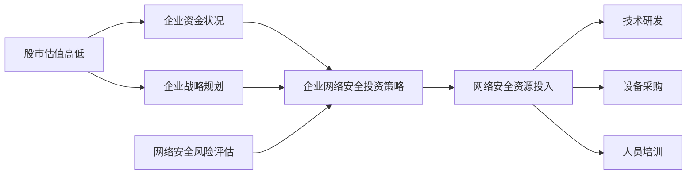

# 股市估值高低对企业网络安全投资策略的影响

> 关键词：股市估值、企业网络安全、投资策略、市场环境、风险评估

> 摘要：本文深入探讨了股市估值高低与企业网络安全投资策略之间的关联。首先介绍了研究的背景、目的、预期读者等内容，接着阐述了股市估值和企业网络安全投资的核心概念及联系。通过详细的算法原理、数学模型分析，揭示了两者之间的内在逻辑。结合项目实战案例，具体展示了不同股市估值情况下企业网络安全投资策略的制定与实施。同时，分析了该研究在实际应用中的场景，并推荐了相关的工具和资源。最后总结了未来的发展趋势与挑战，为企业在不同股市环境下制定合理的网络安全投资策略提供了全面而深入的参考。

## 1. 背景介绍 
### 1.1 目的和范围
本研究的主要目的在于深入探究股市估值高低对企业网络安全投资策略的具体影响。随着数字化时代的发展，企业面临的网络安全威胁日益严峻，网络安全投资成为企业运营管理中的重要环节。而股市估值作为企业市场价值的重要体现，其高低变化会影响企业的资金状况、战略规划等多个方面，进而对企业的网络安全投资决策产生作用。本研究的范围涵盖了不同行业、不同规模的企业，旨在全面分析股市估值与企业网络安全投资策略之间的关系，为企业制定合理的投资决策提供理论支持和实践指导。

### 1.2 预期读者
本文预期读者主要包括企业的高层管理人员，如CEO、CTO等，他们负责企业的战略规划和资源分配，需要了解股市估值对网络安全投资的影响，以便做出更科学的决策；金融分析师，他们关注企业的市场表现和财务状况，通过研究股市估值与网络安全投资的关系，可以更准确地评估企业的价值和发展潜力；网络安全专家，他们在制定网络安全方案时，需要考虑企业的资金投入能力和战略重点，了解股市估值的影响有助于优化投资策略；以及对金融和网络安全领域感兴趣的研究人员和学者，他们可以从本研究中获取相关的理论和实证依据，开展进一步的学术研究。

### 1.3 文档结构概述
本文将按照以下结构展开：首先介绍研究的背景信息，包括目的、预期读者和文档结构概述等；接着阐述股市估值和企业网络安全投资的核心概念及它们之间的联系，通过文本示意图和Mermaid流程图进行直观展示；然后详细讲解核心算法原理和具体操作步骤，并使用Python源代码进行说明；再介绍相关的数学模型和公式，结合具体例子进行详细讲解；之后通过项目实战案例，展示开发环境搭建、源代码实现和代码解读等内容；分析该研究在实际应用中的场景；推荐相关的工具和资源，包括学习资源、开发工具框架和相关论文著作；总结未来的发展趋势与挑战；最后设置附录，解答常见问题，并提供扩展阅读和参考资料。

### 1.4 术语表
#### 1.4.1 核心术语定义
- **股市估值**：指对企业在股票市场上的价值进行评估的过程和结果，通常通过市盈率、市净率等指标来衡量。它反映了市场对企业未来盈利能力和发展前景的预期。
- **企业网络安全投资策略**：企业为了保护自身的信息资产、网络系统和业务运营的安全，而制定的关于网络安全资源投入的计划和方案，包括投资的金额、方向、方式等方面的决策。
- **网络安全威胁**：指可能对企业网络系统和信息资产造成损害的各种因素，如黑客攻击、病毒感染、数据泄露等。
- **风险评估**：对企业面临的网络安全风险进行识别、分析和评估的过程，以确定风险的可能性和影响程度，为网络安全投资决策提供依据。

#### 1.4.2 相关概念解释
- **市场环境**：指企业所处的股票市场的整体状况，包括市场的供求关系、宏观经济形势、政策法规等因素，这些因素会影响股市估值的高低。
- **资金状况**：企业的财务状况，包括资金的来源、数量和流动性等方面，股市估值的高低会影响企业的融资能力和资金储备，进而影响网络安全投资的资金支持。
- **战略规划**：企业为了实现长期发展目标而制定的总体计划和部署，网络安全投资策略是企业战略规划的重要组成部分，股市估值会影响企业的战略重点和资源分配。

#### 1.4.3 缩略词列表
- **CEO**：Chief Executive Officer，首席执行官
- **CTO**：Chief Technology Officer，首席技术官
- **CIA**：Confidentiality, Integrity, Availability，保密性、完整性、可用性，是网络安全的三个核心原则

## 2. 核心概念与联系 

### 核心概念原理
#### 股市估值原理
股市估值是基于市场对企业未来盈利能力和发展前景的预期。常见的估值方法包括市盈率法（P/E）、市净率法（P/B）等。市盈率是指股票价格与每股收益的比率，反映了市场对企业盈利的预期。市净率是指股票价格与每股净资产的比率，反映了市场对企业资产价值的评估。股市估值受到多种因素的影响，如宏观经济形势、行业发展趋势、企业的财务状况和经营业绩等。当市场对企业的预期较好时，股市估值会升高；反之，股市估值会降低。

#### 企业网络安全投资策略原理
企业网络安全投资策略的制定是基于对网络安全风险的评估和企业的战略目标。企业需要识别自身面临的网络安全威胁，评估这些威胁可能造成的损失，然后根据自身的资金状况和战略重点，确定网络安全投资的金额和方向。网络安全投资的方向包括网络安全技术研发、安全设备采购、安全人员培训等方面。企业的网络安全投资策略应该与企业的整体战略相匹配，以保障企业的信息资产和业务运营的安全。

### 架构的文本示意图
```plaintext
股市估值高低
        |
        | 影响企业资金状况、战略规划
        |
        v
企业网络安全投资策略
        |
        | 依据网络安全风险评估
        |
        v
网络安全资源投入（技术研发、设备采购、人员培训等）
```

### Mermaid流程图


## 3. 核心算法原理 & 具体操作步骤 

### 核心算法原理
我们可以通过建立一个简单的模型来分析股市估值高低对企业网络安全投资策略的影响。假设企业的网络安全投资决策受到股市估值、企业的资金状况和网络安全风险评估的影响。我们可以使用线性回归模型来描述这种关系：

$$I = \beta_0 + \beta_1V + \beta_2F + \beta_3R + \epsilon$$

其中，$I$ 表示企业的网络安全投资金额，$V$ 表示股市估值，$F$ 表示企业的资金状况，$R$ 表示网络安全风险评估结果，$\beta_0$ 是截距项，$\beta_1$、$\beta_2$、$\beta_3$ 是回归系数，$\epsilon$ 是误差项。

### 具体操作步骤
1. **数据收集**：收集企业的股市估值数据、资金状况数据和网络安全风险评估数据。股市估值数据可以从股票市场数据库中获取，资金状况数据可以从企业的财务报表中获取，网络安全风险评估数据可以通过专业的网络安全评估机构或企业内部的安全团队进行评估得到。
2. **数据预处理**：对收集到的数据进行清洗和整理，去除缺失值和异常值，对数据进行标准化处理，以提高模型的准确性。
3. **模型训练**：使用收集到的数据对线性回归模型进行训练，估计回归系数 $\beta_0$、$\beta_1$、$\beta_2$、$\beta_3$。
4. **模型评估**：使用测试数据对训练好的模型进行评估，计算模型的准确率、召回率等指标，评估模型的性能。
5. **投资决策**：根据训练好的模型和企业的实际情况，预测企业在不同股市估值情况下的网络安全投资金额，为企业的投资决策提供参考。

### Python源代码实现
```python
import numpy as np
from sklearn.linear_model import LinearRegression
from sklearn.model_selection import train_test_split
from sklearn.preprocessing import StandardScaler
from sklearn.metrics import mean_squared_error

# 生成示例数据
np.random.seed(0)
n_samples = 100
# 股市估值数据
V = np.random.randn(n_samples)
# 企业资金状况数据
F = np.random.randn(n_samples)
# 网络安全风险评估数据
R = np.random.randn(n_samples)
# 生成网络安全投资金额数据
I = 2 * V + 1.5 * F + 3 * R + np.random.randn(n_samples)

# 合并特征数据
X = np.column_stack((V, F, R))

# 数据预处理
scaler = StandardScaler()
X_scaled = scaler.fit_transform(X)

# 划分训练集和测试集
X_train, X_test, y_train, y_test = train_test_split(X_scaled, I, test_size=0.2, random_state=0)

# 模型训练
model = LinearRegression()
model.fit(X_train, y_train)

# 模型评估
y_pred = model.predict(X_test)
mse = mean_squared_error(y_test, y_pred)
print(f"均方误差: {mse}")

# 预测示例
new_V = np.array([1.0])
new_F = np.array([2.0])
new_R = np.array([3.0])
new_X = np.column_stack((new_V, new_F, new_R))
new_X_scaled = scaler.transform(new_X)
predicted_I = model.predict(new_X_scaled)
print(f"预测的网络安全投资金额: {predicted_I[0]}")
```

## 4. 数学模型和公式 & 详细讲解 & 举例说明 

### 数学模型
我们使用的线性回归模型的一般形式为：

$$I = \beta_0 + \beta_1V + \beta_2F + \beta_3R + \epsilon$$

### 公式详细讲解
- $\beta_0$：截距项，表示当股市估值、企业资金状况和网络安全风险评估结果都为 0 时，企业的网络安全投资金额的估计值。
- $\beta_1$：表示股市估值对企业网络安全投资金额的影响系数。如果 $\beta_1$ 为正，说明股市估值越高，企业的网络安全投资金额越高；如果 $\beta_1$ 为负，说明股市估值越高，企业的网络安全投资金额越低。
- $\beta_2$：表示企业资金状况对企业网络安全投资金额的影响系数。一般来说，企业资金状况越好，网络安全投资金额越高，所以 $\beta_2$ 通常为正。
- $\beta_3$：表示网络安全风险评估结果对企业网络安全投资金额的影响系数。网络安全风险越高，企业需要投入的网络安全资金越多，所以 $\beta_3$ 通常为正。
- $\epsilon$：误差项，表示模型无法解释的随机因素对企业网络安全投资金额的影响。

### 举例说明
假设我们通过数据训练得到的线性回归模型为：

$$I = 10 + 2V + 1.5F + 3R + \epsilon$$

如果某企业的股市估值 $V = 5$，企业资金状况 $F = 3$，网络安全风险评估结果 $R = 2$，则该企业的网络安全投资金额的预测值为：

$$I = 10 + 2\times5 + 1.5\times3 + 3\times2 = 10 + 10 + 4.5 + 6 = 30.5$$

这意味着在给定的股市估值、企业资金状况和网络安全风险评估结果下，该企业的网络安全投资金额预计为 30.5 单位。

## 5. 项目实战：代码实际案例和详细解释说明 

### 5.1  开发环境搭建
- **操作系统**：可以选择 Windows、Linux 或 macOS 操作系统。
- **Python 环境**：安装 Python 3.6 及以上版本。可以从 Python 官方网站（https://www.python.org/downloads/） 下载安装包进行安装。
- **Python 库**：安装必要的 Python 库，如 numpy、pandas、scikit-learn 等。可以使用 pip 命令进行安装：
```sh
pip install numpy pandas scikit-learn
```

### 5.2  源代码详细实现和代码解读
```python
import numpy as np
import pandas as pd
from sklearn.linear_model import LinearRegression
from sklearn.model_selection import train_test_split
from sklearn.preprocessing import StandardScaler
from sklearn.metrics import mean_squared_error

# 读取数据
data = pd.read_csv('stock_valuation_and_security_investment.csv')

# 提取特征和目标变量
X = data[['stock_valuation', 'fund_status', 'security_risk']].values
y = data['security_investment'].values

# 数据预处理
scaler = StandardScaler()
X_scaled = scaler.fit_transform(X)

# 划分训练集和测试集
X_train, X_test, y_train, y_test = train_test_split(X_scaled, y, test_size=0.2, random_state=0)

# 模型训练
model = LinearRegression()
model.fit(X_train, y_train)

# 模型评估
y_pred = model.predict(X_test)
mse = mean_squared_error(y_test, y_pred)
print(f"均方误差: {mse}")

# 预测示例
new_data = np.array([[10, 5, 3]])
new_data_scaled = scaler.transform(new_data)
predicted_investment = model.predict(new_data_scaled)
print(f"预测的网络安全投资金额: {predicted_investment[0]}")
```

### 代码解读与分析
1. **数据读取**：使用 `pandas` 库的 `read_csv` 函数读取存储在 CSV 文件中的数据。
2. **特征提取**：从数据中提取股市估值、企业资金状况和网络安全风险评估结果作为特征变量，提取网络安全投资金额作为目标变量。
3. **数据预处理**：使用 `StandardScaler` 对特征数据进行标准化处理，以消除不同特征之间的量纲差异。
4. **数据集划分**：使用 `train_test_split` 函数将数据集划分为训练集和测试集，测试集占总数据集的 20%。
5. **模型训练**：使用 `LinearRegression` 类创建线性回归模型，并使用训练集数据对模型进行训练。
6. **模型评估**：使用测试集数据对训练好的模型进行评估，计算均方误差（MSE）来衡量模型的性能。
7. **预测示例**：使用训练好的模型对新的数据进行预测，输出预测的网络安全投资金额。

## 6. 实际应用场景 
### 高股市估值下的企业网络安全投资策略
当股市估值较高时，企业通常具有较好的市场形象和融资能力，资金相对充裕。此时，企业可能会加大对网络安全的投资，以提升自身的竞争力和抗风险能力。具体的投资策略可能包括：
- **加大技术研发投入**：企业可以投入更多的资金用于网络安全技术的研发，开发新的安全产品和解决方案，提高自身的网络安全防护水平。
- **采购高端安全设备**：购买更先进、更高级的网络安全设备，如防火墙、入侵检测系统、加密设备等，以增强网络安全防护能力。
- **加强安全人员培训**：组织员工参加网络安全培训课程，提高员工的安全意识和技能，培养专业的网络安全人才。

### 低股市估值下的企业网络安全投资策略
当股市估值较低时，企业的资金状况可能相对紧张，需要更加谨慎地进行网络安全投资。此时，企业的投资策略可能包括：
- **优化现有安全资源**：对现有的网络安全设备和系统进行优化和升级，提高其使用效率和性能，以降低成本。
- **采用外包服务**：将部分网络安全工作外包给专业的安全服务提供商，如安全运维、漏洞扫描、应急响应等，以降低企业的人力成本和技术门槛。
- **重点保障核心业务安全**：根据企业的业务重点和风险评估结果，优先保障核心业务的网络安全，集中资源投入到关键领域。

## 7. 工具和资源推荐
### 7.1 学习资源推荐
#### 7.1.1 书籍推荐
- 《网络安全技术与实践》：全面介绍了网络安全的基本概念、技术和实践方法，适合初学者学习。
- 《Python 数据分析实战》：详细讲解了使用 Python 进行数据分析的方法和技巧，对于处理股市估值和企业网络安全投资数据非常有帮助。
- 《金融市场与金融机构》：介绍了金融市场的基本原理和金融机构的运作方式，有助于理解股市估值的相关知识。

#### 7.1.2 在线课程
- Coursera 上的“网络安全基础”课程：由知名高校的教授授课，系统地介绍了网络安全的基础知识和技术。
- edX 上的“Python 数据分析”课程：提供了丰富的实践案例和教学资源，帮助学习者掌握 Python 数据分析的技能。
- Udemy 上的“金融市场分析”课程：深入讲解了金融市场的分析方法和工具，对理解股市估值有很大的帮助。

#### 7.1.3 技术博客和网站
- 安全客（https://www.anquanke.com/）：专注于网络安全领域的技术分享和资讯报道，提供了大量的网络安全技术文章和案例分析。
- 博客园（https://www.cnblogs.com/）：有许多技术博主分享关于数据分析、金融分析等方面的经验和技巧。
- 雪球网（https://xueqiu.com/）：提供了丰富的股市数据和分析工具，有助于了解股市估值的相关信息。

### 7.2 开发工具框架推荐
#### 7.2.1 IDE和编辑器
- PyCharm：一款专业的 Python 集成开发环境，提供了丰富的代码编辑、调试和项目管理功能。
- Visual Studio Code：一款轻量级的代码编辑器，支持多种编程语言，有丰富的插件可以扩展功能。
- Jupyter Notebook：一种交互式的开发环境，适合进行数据分析和模型训练，方便展示代码和结果。

#### 7.2.2 调试和性能分析工具
- pdb：Python 自带的调试工具，可以帮助开发者定位代码中的问题。
- cProfile：Python 标准库中的性能分析工具，可以分析代码的运行时间和资源占用情况。
- Py-Spy：一个轻量级的 Python 性能分析工具，可以实时监控 Python 程序的性能。

#### 7.2.3 相关框架和库
- scikit-learn：一个强大的机器学习库，提供了丰富的机器学习算法和工具，方便进行线性回归模型的训练和评估。
- pandas：一个用于数据处理和分析的库，提供了高效的数据结构和数据操作方法，适合处理股市估值和企业网络安全投资数据。
- numpy：一个用于科学计算的库，提供了高效的数组操作和数学函数，是数据分析和机器学习的基础库。

### 7.3 相关论文著作推荐
#### 7.3.1 经典论文
- "The Impact of Stock Market Valuation on Corporate Investment Decisions"：研究了股市估值对企业投资决策的影响，为本文的研究提供了理论基础。
- "A Framework for Network Security Investment Decision-Making"：提出了一种网络安全投资决策的框架，对企业制定网络安全投资策略有重要的参考价值。

#### 7.3.2 最新研究成果
- 关注国际顶级学术会议如 ACM SIGSAC、IEEE S&P 等上发表的关于网络安全投资和股市估值的最新研究成果，了解该领域的前沿动态。

#### 7.3.3 应用案例分析
- 参考一些知名企业的网络安全投资案例分析，如谷歌、亚马逊等公司的网络安全投资策略和实践经验，从中获取启示和借鉴。

## 8. 总结：未来发展趋势与挑战
### 未来发展趋势
- **智能化投资决策**：随着人工智能和机器学习技术的发展，企业将越来越多地利用智能算法来进行网络安全投资决策。通过对大量数据的分析和学习，智能算法可以更准确地预测股市估值的变化和网络安全风险的程度，为企业提供更科学的投资建议。
- **融合式安全投资**：企业将更加注重网络安全与业务的融合，将网络安全投资纳入企业的整体战略规划中。不仅关注技术层面的安全防护，还会考虑业务流程的安全优化，以实现安全与业务的协同发展。
- **行业协同与共享**：不同行业的企业将加强在网络安全领域的协同与共享。通过建立行业联盟、共享安全情报等方式，共同应对日益复杂的网络安全威胁，降低单个企业的安全投资成本。

### 挑战
- **数据质量和隐私问题**：准确的股市估值和网络安全风险评估数据是制定合理投资策略的基础。然而，数据的质量和隐私问题一直是困扰企业的难题。数据可能存在不准确、不完整的情况，同时，数据的隐私保护也面临着巨大的挑战。
- **技术更新换代快**：网络安全技术和股市环境都在不断变化，企业需要及时跟上技术发展的步伐，不断调整网络安全投资策略。这对企业的技术能力和决策能力提出了更高的要求。
- **市场不确定性**：股市估值受到多种因素的影响，市场的不确定性增加了企业预测股市估值变化的难度。这使得企业在制定网络安全投资策略时面临更大的风险，需要更加谨慎地进行决策。

## 9. 附录：常见问题与解答
### 问题 1：股市估值的高低是如何确定的？
股市估值的高低通常通过多种指标来衡量，如市盈率、市净率、市销率等。这些指标反映了市场对企业未来盈利能力和发展前景的预期。一般来说，市盈率较高、市净率较高的企业，其股市估值相对较高；反之，股市估值相对较低。此外，宏观经济形势、行业发展趋势、企业的财务状况和经营业绩等因素也会影响股市估值的高低。

### 问题 2：企业网络安全投资策略的制定需要考虑哪些因素？
企业网络安全投资策略的制定需要考虑多个因素，包括网络安全风险评估结果、企业的资金状况、战略规划、法律法规要求等。网络安全风险评估结果可以帮助企业确定面临的主要安全威胁和风险程度，从而确定投资的重点和方向。企业的资金状况决定了投资的规模和能力。战略规划则指导企业将网络安全投资与整体业务目标相结合。法律法规要求则规定了企业在网络安全方面的义务和责任。

### 问题 3：如何评估企业网络安全投资的效果？
评估企业网络安全投资的效果可以从多个方面进行，如安全事件的发生率、数据泄露的损失、业务系统的可用性等。安全事件的发生率降低、数据泄露的损失减少、业务系统的可用性提高等都表明网络安全投资取得了一定的效果。此外，还可以通过用户满意度调查、安全审计等方式来评估网络安全投资的效果。

### 问题 4：在股市估值波动较大的情况下，企业应该如何调整网络安全投资策略？
在股市估值波动较大的情况下，企业应该保持谨慎的态度，根据自身的实际情况调整网络安全投资策略。当股市估值上升时，企业可以适当加大网络安全投资，提升安全防护能力；当股市估值下降时，企业可以优化现有安全资源，降低成本，重点保障核心业务的安全。同时，企业还应该密切关注股市估值的变化趋势，及时调整投资策略，以应对市场的不确定性。

## 10. 扩展阅读 & 参考资料
### 扩展阅读
- 《数字化转型中的网络安全挑战与对策》：深入探讨了数字化转型过程中企业面临的网络安全挑战，并提出了相应的对策和建议。
- 《金融科技与网络安全》：介绍了金融科技的发展对网络安全的影响，以及如何保障金融领域的网络安全。
- 《企业风险管理与网络安全》：阐述了企业风险管理的理论和方法，以及如何将网络安全纳入企业风险管理体系中。

### 参考资料
- 股票市场相关数据库，如 Wind 资讯、东方财富网等，提供了股市估值的相关数据。
- 企业财务报表，如年度报告、季度报告等，提供了企业资金状况的相关信息。
- 网络安全评估机构的报告和研究成果，如 Gartner、IDC 等，提供了网络安全风险评估的相关数据和分析。