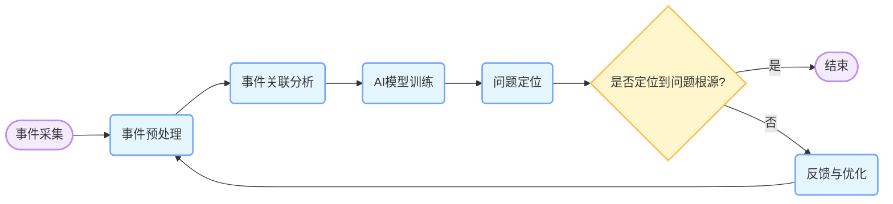

# 自动化事件溯源分析:AI辅助问题定位

> 关键词：自动化事件溯源、AI辅助、问题定位、事件分析、智能诊断

> 摘要：本文围绕自动化事件溯源分析中AI辅助问题定位展开深入探讨。首先介绍了该领域的背景，包括目的、预期读者、文档结构和相关术语。接着阐述了核心概念与联系，通过文本示意图和Mermaid流程图清晰展示其架构。详细讲解了核心算法原理并给出Python源代码，同时介绍了相关数学模型和公式。在项目实战部分，从开发环境搭建到源代码实现及解读进行了全面说明。探讨了实际应用场景，推荐了学习资源、开发工具框架和相关论文著作。最后总结了未来发展趋势与挑战，并给出常见问题解答和参考资料，旨在为相关领域的研究和实践提供全面而深入的指导。

## 1. 背景介绍 
### 1.1 目的和范围
在当今复杂的信息系统和网络环境中，各种事件频繁发生，如系统故障、安全漏洞、业务异常等。快速准确地定位问题根源对于保障系统的稳定运行、提高业务效率和确保信息安全至关重要。自动化事件溯源分析结合AI技术的目的在于利用人工智能的强大能力，实现对事件的自动化追踪和分析，辅助技术人员更高效地定位问题。

本文章的范围涵盖了自动化事件溯源分析的基本概念、核心算法、数学模型，以及如何利用AI技术实现问题定位的具体方法。同时，通过项目实战案例展示其在实际场景中的应用，还将探讨相关的工具和资源，以及未来的发展趋势和面临的挑战。

### 1.2 预期读者
本文预期读者包括从事信息系统运维、网络安全、软件开发等领域的技术人员，对人工智能在问题定位领域应用感兴趣的研究人员，以及相关专业的学生。对于希望深入了解自动化事件溯源分析和AI辅助问题定位技术的人士，本文将提供有价值的参考。

### 1.3 文档结构概述
本文将按照以下结构进行组织：首先介绍背景信息，包括目的、预期读者和文档结构等；接着阐述核心概念与联系，通过文本示意图和流程图展示其架构；详细讲解核心算法原理并给出Python源代码；介绍相关数学模型和公式；通过项目实战展示具体实现和代码解读；探讨实际应用场景；推荐学习资源、开发工具框架和相关论文著作；总结未来发展趋势与挑战；给出常见问题解答和参考资料。

### 1.4 术语表
#### 1.4.1 核心术语定义
- **自动化事件溯源分析**：指通过自动化的手段，对事件的发生过程进行追踪和分析，以确定事件的起源和发展路径。
- **AI辅助问题定位**：利用人工智能技术，如机器学习、深度学习等，辅助技术人员快速准确地定位问题的根源。
- **事件日志**：记录系统或应用程序中发生的各种事件的信息，是事件溯源分析的重要数据来源。
- **问题根源**：导致问题发生的根本原因，通过事件溯源分析和AI辅助定位的目标。

#### 1.4.2 相关概念解释
- **机器学习**：是一门多领域交叉学科，涉及概率论、统计学、逼近论、凸分析、算法复杂度理论等多门学科。它专门研究计算机怎样模拟或实现人类的学习行为，以获取新的知识或技能，重新组织已有的知识结构使之不断改善自身的性能。在事件溯源分析中，机器学习算法可用于对事件数据进行分类、聚类和预测，辅助问题定位。
- **深度学习**：是机器学习的一个分支领域，它是一种基于对数据进行表征学习的方法。深度学习通过构建具有很多层的神经网络模型，自动从大量数据中学习特征和模式。在事件溯源分析中，深度学习可用于处理复杂的事件数据，挖掘潜在的问题线索。

#### 1.4.3 缩略词列表
- **AI**：Artificial Intelligence，人工智能
- **ML**：Machine Learning，机器学习
- **DL**：Deep Learning，深度学习
- **NLP**：Natural Language Processing，自然语言处理

## 2. 核心概念与联系 
自动化事件溯源分析和AI辅助问题定位涉及多个核心概念，它们之间相互关联，共同构成了一个完整的技术体系。

### 核心概念原理
- **事件采集**：通过各种手段收集系统或应用程序中发生的事件信息，如系统日志、网络流量、用户操作记录等。这些事件信息是后续分析的基础。
- **事件预处理**：对采集到的原始事件数据进行清洗、转换和归一化等处理，去除噪声和冗余信息，将数据转换为适合分析的格式。
- **事件关联分析**：通过分析事件之间的时间、空间和逻辑关系，找出事件之间的关联，构建事件链。事件关联分析可以帮助我们了解事件的发展过程和因果关系。
- **AI模型训练**：利用机器学习或深度学习算法，对预处理后的事件数据进行训练，构建AI模型。这些模型可以用于对事件进行分类、聚类和预测，辅助问题定位。
- **问题定位**：根据AI模型的分析结果，结合事件关联分析的结果，确定问题的根源。问题定位是自动化事件溯源分析和AI辅助问题定位的最终目标。

### 架构的文本示意图
```plaintext
事件采集模块 --> 事件预处理模块 --> 事件关联分析模块 --> AI模型训练模块 --> 问题定位模块
|                                                             |
|                                                             |
|----------------------- 反馈与优化 ---------------------------|
```

### Mermaid流程图


## 3. 核心算法原理 & 具体操作步骤 
### 核心算法原理
在自动化事件溯源分析和AI辅助问题定位中，常用的算法包括决策树、支持向量机、神经网络等。这里以决策树算法为例进行详细讲解。

决策树是一种基于树结构进行决策的机器学习算法。它通过对数据的特征进行划分，构建一棵决策树，每个内部节点表示一个特征上的测试，每个分支表示一个测试输出，每个叶节点表示一个类别或值。决策树算法的核心思想是通过对数据的递归划分，找到最优的划分特征和划分点，使得划分后的子集纯度最高。

### 具体操作步骤
1. **数据准备**：收集事件数据，并进行预处理，将数据转换为适合决策树算法处理的格式。
2. **特征选择**：选择对问题定位有重要影响的特征，作为决策树的划分特征。
3. **决策树构建**：使用训练数据构建决策树，通过递归划分数据，找到最优的划分特征和划分点。
4. **决策树剪枝**：为了防止决策树过拟合，对构建好的决策树进行剪枝处理。
5. **问题定位**：使用构建好的决策树对新的事件数据进行分类，确定问题的根源。

### Python源代码实现
```python
import pandas as pd
from sklearn.tree import DecisionTreeClassifier
from sklearn.model_selection import train_test_split
from sklearn.metrics import accuracy_score

# 数据准备
data = pd.read_csv('event_data.csv')
X = data.drop('problem_root', axis=1)
y = data['problem_root']

# 划分训练集和测试集
X_train, X_test, y_train, y_test = train_test_split(X, y, test_size=0.2, random_state=42)

# 决策树模型训练
model = DecisionTreeClassifier()
model.fit(X_train, y_train)

# 模型预测
y_pred = model.predict(X_test)

# 模型评估
accuracy = accuracy_score(y_test, y_pred)
print(f"模型准确率: {accuracy}")
```

## 4. 数学模型和公式 & 详细讲解 & 举例说明 
### 信息熵
信息熵是衡量数据不确定性的一个指标，在决策树算法中用于选择最优的划分特征。信息熵的计算公式如下：
$$H(X)=-\sum_{i=1}^{n}p(x_i)\log_2p(x_i)$$
其中，$X$ 是一个随机变量，$p(x_i)$ 是 $X$ 取值为 $x_i$ 的概率，$n$ 是 $X$ 可能取值的个数。

### 信息增益
信息增益是指在划分数据前后，信息熵的减少量。信息增益越大，说明划分后数据的纯度越高。信息增益的计算公式如下：
$$IG(X,A)=H(X)-\sum_{v\in Values(A)}\frac{|S_v|}{|S|}H(S_v)$$
其中，$X$ 是原始数据集，$A$ 是划分特征，$Values(A)$ 是特征 $A$ 可能取值的集合，$S_v$ 是特征 $A$ 取值为 $v$ 的子集，$|S|$ 是原始数据集的样本数，$|S_v|$ 是子集 $S_v$ 的样本数。

### 举例说明
假设有一个事件数据集，包含两个特征 $A$ 和 $B$，以及一个类别标签 $C$。数据集的分布如下：

| A | B | C |
|---|---|---|
| 0 | 0 | 0 |
| 0 | 1 | 1 |
| 1 | 0 | 1 |
| 1 | 1 | 0 |

首先计算原始数据集的信息熵：
$$p(C=0)=\frac{2}{4}=0.5$$
$$p(C=1)=\frac{2}{4}=0.5$$
$$H(C)=-0.5\log_20.5 - 0.5\log_20.5 = 1$$

然后分别计算特征 $A$ 和 $B$ 的信息增益：
- **特征 $A$**：
  - 当 $A=0$ 时，$C$ 的分布为 $p(C=0)=\frac{1}{2}=0.5$，$p(C=1)=\frac{1}{2}=0.5$，$H(C|A=0)=-0.5\log_20.5 - 0.5\log_20.5 = 1$。
  - 当 $A=1$ 时，$C$ 的分布为 $p(C=0)=\frac{1}{2}=0.5$，$p(C=1)=\frac{1}{2}=0.5$，$H(C|A=1)=-0.5\log_20.5 - 0.5\log_20.5 = 1$。
  - $IG(C,A)=H(C)-\frac{2}{4}H(C|A=0)-\frac{2}{4}H(C|A=1)=1 - \frac{2}{4}\times1 - \frac{2}{4}\times1 = 0$。
- **特征 $B$**：
  - 当 $B=0$ 时，$C$ 的分布为 $p(C=0)=\frac{1}{2}=0.5$，$p(C=1)=\frac{1}{2}=0.5$，$H(C|B=0)=-0.5\log_20.5 - 0.5\log_20.5 = 1$。
  - 当 $B=1$ 时，$C$ 的分布为 $p(C=0)=\frac{1}{2}=0.5$，$p(C=1)=\frac{1}{2}=0.5$，$H(C|B=1)=-0.5\log_20.5 - 0.5\log_20.5 = 1$。
  - $IG(C,B)=H(C)-\frac{2}{4}H(C|B=0)-\frac{2}{4}H(C|B=1)=1 - \frac{2}{4}\times1 - \frac{2}{4}\times1 = 0$。

由于特征 $A$ 和 $B$ 的信息增益都为 0，说明这两个特征对分类没有帮助。

## 5. 项目实战：代码实际案例和详细解释说明 
### 5.1  开发环境搭建
1. **安装Python**：从Python官方网站（https://www.python.org/downloads/）下载并安装Python 3.x版本。
2. **安装必要的库**：使用pip命令安装所需的库，如pandas、scikit-learn等。
```sh
pip install pandas scikit-learn
```

### 5.2  源代码详细实现和代码解读
```python
import pandas as pd
from sklearn.tree import DecisionTreeClassifier
from sklearn.model_selection import train_test_split
from sklearn.metrics import accuracy_score

# 数据准备
data = pd.read_csv('event_data.csv')  # 读取事件数据文件
X = data.drop('problem_root', axis=1)  # 提取特征数据
y = data['problem_root']  # 提取标签数据

# 划分训练集和测试集
X_train, X_test, y_train, y_test = train_test_split(X, y, test_size=0.2, random_state=42)  # 将数据划分为训练集和测试集，测试集占比20%

# 决策树模型训练
model = DecisionTreeClassifier()  # 创建决策树分类器对象
model.fit(X_train, y_train)  # 使用训练集数据对模型进行训练

# 模型预测
y_pred = model.predict(X_test)  # 使用训练好的模型对测试集数据进行预测

# 模型评估
accuracy = accuracy_score(y_test, y_pred)  # 计算模型的准确率
print(f"模型准确率: {accuracy}")  # 输出模型的准确率
```

### 5.3  代码解读与分析
1. **数据准备**：使用pandas库的`read_csv`函数读取事件数据文件，并将数据分为特征数据`X`和标签数据`y`。
2. **划分训练集和测试集**：使用`train_test_split`函数将数据划分为训练集和测试集，测试集占比20%。
3. **决策树模型训练**：创建决策树分类器对象`DecisionTreeClassifier`，并使用训练集数据对模型进行训练。
4. **模型预测**：使用训练好的模型对测试集数据进行预测，得到预测结果`y_pred`。
5. **模型评估**：使用`accuracy_score`函数计算模型的准确率，并输出结果。

## 6. 实际应用场景 
### 系统故障定位
在大型信息系统中，当出现系统故障时，通过自动化事件溯源分析和AI辅助问题定位技术，可以快速收集系统日志、性能指标等事件信息，对事件进行关联分析和分类，确定故障的根源，如硬件故障、软件漏洞、配置错误等。

### 网络安全事件分析
在网络安全领域，当发生安全事件时，如网络攻击、数据泄露等，通过对网络流量、用户行为等事件数据进行分析，可以追踪攻击源、识别攻击手段，及时采取防范措施，保障网络安全。

### 业务异常诊断
在企业业务系统中，当出现业务异常时，如订单处理失败、库存异常等，通过对业务流程中的事件数据进行分析，可以找出导致异常的原因，如业务规则错误、数据冲突等，及时进行调整和优化。

## 7. 工具和资源推荐
### 7.1 学习资源推荐
#### 7.1.1 书籍推荐
- 《机器学习》（周志华著）：全面介绍了机器学习的基本概念、算法和应用，是机器学习领域的经典教材。
- 《深度学习》（Ian Goodfellow、Yoshua Bengio和Aaron Courville著）：深入探讨了深度学习的原理、算法和实践，是深度学习领域的权威著作。
- 《Python数据分析实战》（韦斯·麦金尼著）：介绍了使用Python进行数据分析的方法和技巧，包括数据处理、可视化和机器学习等方面。

#### 7.1.2 在线课程
- Coursera上的“机器学习”课程（Andrew Ng教授主讲）：是一门非常经典的机器学习课程，适合初学者学习。
- edX上的“深度学习基础”课程：由深度学习领域的专家授课，系统介绍了深度学习的基本概念和算法。
- 中国大学MOOC上的“Python语言程序设计”课程：帮助学习者快速掌握Python编程基础。

#### 7.1.3 技术博客和网站
- 机器之心（https://www.alienvan.com/）：提供人工智能领域的最新技术、研究成果和行业动态。
- 开源中国（https://www.oschina.net/）：提供开源技术的相关资讯、教程和代码示例。
- 博客园（https://www.cnblogs.com/）：汇聚了众多技术开发者的博客，分享了各种技术经验和心得。

### 7.2 开发工具框架推荐
#### 7.2.1 IDE和编辑器
- PyCharm：是一款专门为Python开发设计的集成开发环境，具有强大的代码编辑、调试和自动补全功能。
- Visual Studio Code：是一款轻量级的代码编辑器，支持多种编程语言，通过安装插件可以实现Python开发的各种功能。
- Jupyter Notebook：是一个交互式的开发环境，适合进行数据探索、模型训练和可视化等工作。

#### 7.2.2 调试和性能分析工具
- PDB：Python自带的调试工具，可以帮助开发者定位代码中的错误。
- cProfile：Python的性能分析工具，可以分析代码的运行时间和资源占用情况。
- TensorBoard：是TensorFlow的可视化工具，可以帮助开发者可视化模型的训练过程和性能指标。

#### 7.2.3 相关框架和库
- Scikit-learn：是一个简单易用的机器学习库，提供了各种机器学习算法和工具，如分类、回归、聚类等。
- TensorFlow：是一个开源的深度学习框架，由Google开发，广泛应用于图像识别、自然语言处理等领域。
- PyTorch：是另一个流行的深度学习框架，具有动态计算图和易于使用的特点，受到很多研究者的青睐。

### 7.3 相关论文著作推荐
#### 7.3.1 经典论文
- “A Decision-Theoretic Generalization of On-Line Learning and an Application to Boosting”（Yoav Freund和Robert E. Schapire著）：提出了Adaboost算法，是机器学习领域的经典论文。
- “Gradient-Based Learning Applied to Document Recognition”（Yann LeCun、Léon Bottou、Yoshua Bengio和Patrick Haffner著）：介绍了卷积神经网络（CNN）在文档识别中的应用，是深度学习领域的重要论文。
- “Attention Is All You Need”（Ashish Vaswani等著）：提出了Transformer模型，在自然语言处理领域取得了巨大成功。

#### 7.3.2 最新研究成果
- 关注顶级学术会议，如NeurIPS（神经信息处理系统大会）、ICML（国际机器学习会议）、CVPR（计算机视觉与模式识别会议）等，了解自动化事件溯源分析和AI辅助问题定位领域的最新研究成果。
- 阅读相关领域的学术期刊，如Journal of Artificial Intelligence Research（JAIR）、Artificial Intelligence（AI）等。

#### 7.3.3 应用案例分析
- 研究各大科技公司的技术博客，如Google AI Blog、Facebook AI Research等，了解他们在自动化事件溯源分析和AI辅助问题定位方面的应用案例和实践经验。
- 参考开源项目的文档和案例，如Elastic Stack（ELK）在日志分析和事件溯源中的应用。

## 8. 总结：未来发展趋势与挑战
### 未来发展趋势
- **智能化程度不断提高**：随着AI技术的不断发展，自动化事件溯源分析和AI辅助问题定位的智能化程度将不断提高，能够自动处理更复杂的事件数据，更准确地定位问题根源。
- **多技术融合**：将结合大数据、物联网、区块链等技术，实现更全面、更深入的事件溯源分析和问题定位。例如，通过物联网设备收集更多的事件数据，利用区块链技术保证数据的安全性和不可篡改。
- **应用场景不断拓展**：除了传统的系统故障定位、网络安全事件分析和业务异常诊断等领域，还将在医疗、交通、能源等领域得到广泛应用，为这些领域的安全和稳定运行提供保障。

### 挑战
- **数据质量问题**：事件数据的质量直接影响到问题定位的准确性。在实际应用中，数据可能存在噪声、缺失值和不一致性等问题，需要进行有效的数据预处理和清洗。
- **算法复杂度**：随着事件数据的不断增加和复杂度的提高，现有的算法可能无法满足需求，需要研究更高效、更准确的算法。
- **隐私和安全问题**：事件数据中可能包含敏感信息，如用户隐私、商业机密等。在进行事件溯源分析和问题定位时，需要确保数据的隐私和安全，防止数据泄露。

## 9. 附录：常见问题与解答
### 问题1：如何选择合适的特征进行事件溯源分析？
解答：选择合适的特征需要考虑特征的相关性、区分度和稳定性。可以通过特征选择算法，如信息增益、卡方检验等，对特征进行评估和筛选，选择对问题定位有重要影响的特征。

### 问题2：如何处理事件数据中的噪声和缺失值？
解答：处理噪声可以采用滤波、平滑等方法，去除数据中的异常值。处理缺失值可以采用填充法，如均值填充、中位数填充等，或者采用模型预测法，通过其他特征预测缺失值。

### 问题3：如何评估AI模型的性能？
解答：可以使用多种评估指标来评估AI模型的性能，如准确率、召回率、F1值、均方误差等。根据具体的应用场景和问题类型，选择合适的评估指标。

### 问题4：如何保证事件数据的隐私和安全？
解答：可以采用数据加密、访问控制、匿名化等技术手段，保证事件数据的隐私和安全。在数据处理和分析过程中，遵守相关的法律法规和隐私政策。

## 10. 扩展阅读 & 参考资料
- 周志华. 机器学习[M]. 清华大学出版社, 2016.
- Ian Goodfellow, Yoshua Bengio, Aaron Courville. 深度学习[M]. 人民邮电出版社, 2017.
- 韦斯·麦金尼. Python数据分析实战[M]. 机械工业出版社, 2018.
- Scikit-learn官方文档（https://scikit-learn.org/stable/）
- TensorFlow官方文档（https://www.tensorflow.org/）
- PyTorch官方文档（https://pytorch.org/）