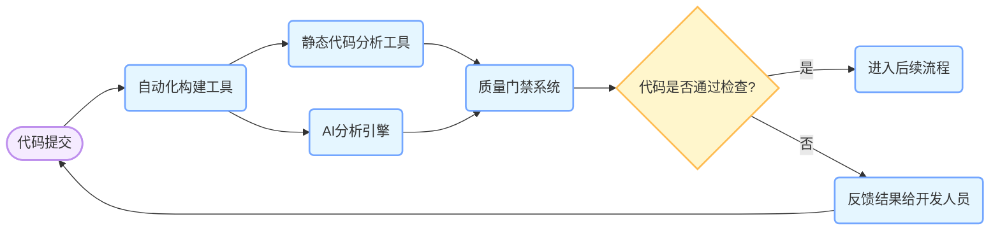

# 自动化代码质量门禁:AI辅助持续集成

> 关键词：自动化代码质量门禁、AI、持续集成、代码质量、软件开发、质量保障、代码审查

> 摘要：本文围绕自动化代码质量门禁与AI辅助持续集成展开深入探讨。在软件开发过程中，代码质量是确保软件系统稳定运行和可维护性的关键因素。传统的代码审查和质量保障方式效率较低且难以全面覆盖。而借助自动化代码质量门禁和AI技术，能够实现持续集成过程中的高效、精准的代码质量检查。文章将详细介绍相关核心概念、算法原理、数学模型，通过项目实战案例展示其具体实现，分析实际应用场景，推荐相关工具和资源，并对未来发展趋势与挑战进行总结，旨在为软件开发人员和相关从业者提供全面且深入的技术参考，以提升软件开发的质量和效率。

## 1. 背景介绍 
### 1.1 目的和范围
在当今快节奏的软件开发环境中，代码的快速迭代和交付成为常态。然而，代码质量的参差不齐可能导致软件出现各种问题，如功能缺陷、性能瓶颈、安全漏洞等。自动化代码质量门禁和AI辅助持续集成的目的在于提高代码质量，减少人为错误，确保软件系统的稳定性和可维护性。

本文章的范围涵盖了自动化代码质量门禁和AI辅助持续集成的基本概念、核心算法、数学模型、实际应用案例等方面。从理论到实践，全面阐述如何利用这些技术提升软件开发的质量和效率。

### 1.2 预期读者
本文预期读者包括软件开发人员、软件测试人员、软件项目管理人员、软件架构师等与软件开发过程相关的人员。同时，对人工智能在软件开发领域应用感兴趣的研究人员和学生也可以从本文中获取有价值的信息。

### 1.3 文档结构概述
本文将按照以下结构进行阐述：首先介绍相关的背景知识和术语，让读者对主题有初步的了解；接着深入讲解核心概念与联系，包括其原理和架构；然后详细阐述核心算法原理和具体操作步骤，并结合Python源代码进行说明；之后介绍相关的数学模型和公式，并举例说明；通过项目实战案例展示代码的实际实现和详细解释；分析实际应用场景；推荐相关的工具和资源；最后总结未来发展趋势与挑战，并提供常见问题与解答以及扩展阅读和参考资料。

### 1.4 术语表
#### 1.4.1 核心术语定义
- **自动化代码质量门禁**：在软件开发过程中，通过自动化工具和规则对代码进行检查，只有满足一定质量标准的代码才能进入后续的开发流程，如集成、测试等。
- **AI（人工智能）**：研究如何使计算机能够模拟人类的智能行为，包括学习、推理、判断等。在本文中，主要指利用AI技术辅助进行代码质量检查和分析。
- **持续集成（CI）**：软件开发过程中的一种实践，开发人员频繁地将代码集成到共享的代码库中，每次集成都会触发自动化构建和测试，以尽早发现集成问题。
- **代码审查**：对代码进行系统性的检查，以发现代码中的缺陷、潜在问题和不符合规范的地方。

#### 1.4.2 相关概念解释
- **静态代码分析**：在不运行代码的情况下，通过分析代码的结构、语法、逻辑等，发现潜在的问题和缺陷。
- **动态代码分析**：在代码运行过程中，对其行为和性能进行监测和分析，以发现运行时的问题。
- **机器学习**：AI的一个分支，通过让计算机从数据中学习模式和规律，从而实现对未知数据的预测和分类。

#### 1.4.3 缩略词列表
- **CI**：持续集成（Continuous Integration）
- **AI**：人工智能（Artificial Intelligence）
- **AST**：抽象语法树（Abstract Syntax Tree）

## 2. 核心概念与联系 

### 核心概念原理
自动化代码质量门禁的核心原理是通过预先定义的规则和标准，对代码进行自动化检查。这些规则可以包括代码风格规范、代码复杂度、安全漏洞等方面的检查。在持续集成过程中，每次代码提交都会触发自动化代码质量门禁的检查，如果代码不满足质量标准，则无法进入后续的开发流程，从而确保进入代码库的代码质量。

AI辅助持续集成则是利用人工智能技术，如机器学习、自然语言处理等，对代码进行更深入的分析和理解。例如，通过机器学习算法可以学习代码的模式和规律，预测代码中可能存在的缺陷；利用自然语言处理技术可以对代码注释和文档进行分析，检查其准确性和完整性。

### 架构的文本示意图
自动化代码质量门禁和AI辅助持续集成的架构可以分为以下几个部分：
1. **代码仓库**：存储开发人员的代码。
2. **自动化构建工具**：如Jenkins、GitLab CI/CD等，负责触发代码的构建和测试过程。
3. **静态代码分析工具**：如SonarQube、ESLint等，对代码进行静态分析，检查代码的质量。
4. **AI分析引擎**：利用人工智能技术对代码进行深入分析，如代码缺陷预测、代码相似度分析等。
5. **质量门禁系统**：根据静态代码分析和AI分析的结果，判断代码是否满足质量标准，如果不满足则阻止代码进入后续流程。
6. **反馈机制**：将代码质量检查的结果反馈给开发人员，帮助他们改进代码。

### Mermaid 流程图


## 3. 核心算法原理 & 具体操作步骤 

### 核心算法原理
在自动化代码质量门禁和AI辅助持续集成中，常用的算法包括机器学习算法和自然语言处理算法。

#### 机器学习算法 - 代码缺陷预测
以逻辑回归算法为例，逻辑回归是一种用于二分类问题的机器学习算法。在代码缺陷预测中，我们可以将代码的特征作为输入，将代码是否存在缺陷作为输出。

逻辑回归的基本原理是通过一个线性函数计算输入特征的加权和，然后通过一个逻辑函数将其转换为概率值。逻辑函数的公式为：

$$\sigma(z)=\frac{1}{1 + e^{-z}}$$

其中，$z$ 是线性函数的输出，$e$ 是自然常数。

#### 自然语言处理算法 - 代码注释分析
自然语言处理算法可以用于对代码注释进行分析，检查其准确性和完整性。例如，我们可以使用词法分析和句法分析技术，对代码注释的语法和语义进行分析。

### 具体操作步骤

#### 步骤1：数据收集
收集历史代码数据和对应的缺陷信息，作为机器学习算法的训练数据。

#### 步骤2：特征提取
从代码中提取相关的特征，如代码行数、函数复杂度、代码注释率等。

#### 步骤3：模型训练
使用收集到的数据和提取的特征，训练机器学习模型。以下是一个使用Python和Scikit-learn库实现逻辑回归模型训练的示例代码：

```python
import numpy as np
from sklearn.linear_model import LogisticRegression
from sklearn.model_selection import train_test_split
from sklearn.metrics import accuracy_score

# 假设我们已经提取了代码的特征和对应的标签
# X 是特征矩阵，y 是标签向量
X = np.array([[10, 2, 0.8], [20, 3, 0.7], [30, 4, 0.6], [40, 5, 0.5]])
y = np.array([0, 0, 1, 1])

# 划分训练集和测试集
X_train, X_test, y_train, y_test = train_test_split(X, y, test_size=0.2, random_state=42)

# 创建逻辑回归模型
model = LogisticRegression()

# 训练模型
model.fit(X_train, y_train)

# 预测测试集
y_pred = model.predict(X_test)

# 计算准确率
accuracy = accuracy_score(y_test, y_pred)
print(f"模型准确率: {accuracy}")
```

#### 步骤4：模型评估
使用测试数据对训练好的模型进行评估，检查模型的性能。

#### 步骤5：集成到持续集成流程
将训练好的模型集成到持续集成流程中，在每次代码提交时进行代码缺陷预测和代码注释分析。

## 4. 数学模型和公式 & 详细讲解 & 举例说明 

### 逻辑回归模型的数学模型和公式
逻辑回归模型的数学模型可以表示为：

$$P(y = 1|x)=\sigma(\theta^T x)$$

其中，$P(y = 1|x)$ 表示在输入特征 $x$ 的情况下，代码存在缺陷的概率；$\theta$ 是模型的参数向量；$\sigma$ 是逻辑函数。

逻辑回归模型的目标是找到最优的参数 $\theta$，使得模型的损失函数最小。常用的损失函数是对数损失函数，公式为：

$$J(\theta)=-\frac{1}{m}\sum_{i = 1}^{m}[y^{(i)}\log(P(y^{(i)} = 1|x^{(i)}))+(1 - y^{(i)})\log(1 - P(y^{(i)} = 1|x^{(i)}))]$$

其中，$m$ 是样本数量，$y^{(i)}$ 是第 $i$ 个样本的真实标签，$x^{(i)}$ 是第 $i$ 个样本的特征向量。

### 详细讲解
逻辑回归模型通过逻辑函数将线性函数的输出转换为概率值，从而实现对二分类问题的预测。对数损失函数的作用是衡量模型预测的概率值与真实标签之间的差异，通过最小化对数损失函数，可以得到最优的模型参数。

### 举例说明
假设我们有一个简单的代码缺陷预测问题，输入特征 $x$ 只有一个维度，即代码行数。我们有以下训练数据：

| 代码行数 | 是否存在缺陷 |
| ---- | ---- |
| 10 | 0 |
| 20 | 0 |
| 30 | 1 |
| 40 | 1 |

我们可以使用逻辑回归模型对这个问题进行建模。首先，我们需要将代码行数作为输入特征，是否存在缺陷作为标签。然后，我们可以使用上述的公式计算模型的损失函数，并通过优化算法（如梯度下降）找到最优的模型参数。

## 5. 项目实战：代码实际案例和详细解释说明 

### 5.1  开发环境搭建
在本项目实战中，我们将使用以下开发环境和工具：
- **编程语言**：Python
- **开发框架**：Flask（用于构建Web服务）
- **静态代码分析工具**：Pylint
- **持续集成工具**：Jenkins

#### 步骤1：安装Python和相关库
首先，确保你已经安装了Python 3.x。然后，使用以下命令安装Flask和Pylint：

```sh
pip install flask pylint
```

#### 步骤2：安装Jenkins
根据你的操作系统，选择合适的方式安装Jenkins。安装完成后，启动Jenkins服务，并在浏览器中访问Jenkins的管理界面。

### 5.2  源代码详细实现和代码解读
#### 示例代码 - Flask Web服务
以下是一个简单的Flask Web服务示例代码，用于处理代码提交和质量检查请求：

```python
from flask import Flask, request, jsonify
import subprocess

app = Flask(__name__)

@app.route('/submit_code', methods=['POST'])
def submit_code():
    # 获取提交的代码
    code = request.get_json().get('code')
    
    # 将代码保存到本地文件
    with open('temp_code.py', 'w') as f:
        f.write(code)
    
    # 执行静态代码分析
    try:
        result = subprocess.run(['pylint', 'temp_code.py'], capture_output=True, text=True)
        output = result.stdout
        return jsonify({'output': output})
    except Exception as e:
        return jsonify({'error': str(e)}), 500

if __name__ == '__main__':
    app.run(debug=True)
```

#### 代码解读
- **导入必要的库**：导入Flask和subprocess库，Flask用于构建Web服务，subprocess用于执行外部命令。
- **创建Flask应用**：使用`Flask(__name__)`创建一个Flask应用实例。
- **定义路由**：使用`@app.route`装饰器定义一个POST请求的路由`/submit_code`，用于处理代码提交请求。
- **获取代码**：从请求的JSON数据中获取提交的代码，并将其保存到本地文件`temp_code.py`中。
- **执行静态代码分析**：使用`subprocess.run`函数执行Pylint命令，对保存的代码文件进行静态代码分析，并获取分析结果。
- **返回结果**：将静态代码分析的结果以JSON格式返回给客户端。

### 5.3  代码解读与分析
#### 优点
- **简单易用**：使用Flask框架可以快速构建一个简单的Web服务，处理代码提交和质量检查请求。
- **可扩展性**：可以方便地集成其他静态代码分析工具或AI分析引擎，扩展代码质量检查的功能。

#### 缺点
- **性能问题**：每次处理代码提交请求时，都需要将代码保存到本地文件并执行外部命令，可能会影响性能。
- **安全性问题**：直接执行用户提交的代码可能存在安全风险，需要进行严格的输入验证和安全防护。

## 6. 实际应用场景 
### 软件开发团队
在软件开发团队中，自动化代码质量门禁和AI辅助持续集成可以帮助团队提高代码质量，减少人为错误。通过设置严格的代码质量标准，只有满足标准的代码才能进入代码库，从而确保整个软件系统的稳定性和可维护性。同时，AI技术可以对代码进行更深入的分析，帮助开发人员发现潜在的问题和优化建议。

### 开源项目
在开源项目中，由于参与的开发者众多，代码质量的参差不齐可能会影响项目的发展。自动化代码质量门禁和AI辅助持续集成可以对所有提交的代码进行统一的质量检查，确保开源项目的代码质量。此外，AI技术可以帮助开源项目团队更好地管理和维护代码库，提高项目的可维护性和可扩展性。

### 企业级应用开发
在企业级应用开发中，代码质量直接关系到企业的业务运营和数据安全。自动化代码质量门禁和AI辅助持续集成可以帮助企业确保应用程序的稳定性和安全性，减少因代码缺陷导致的业务中断和数据泄露风险。同时，通过持续集成和自动化测试，可以提高开发效率，缩短产品上线时间。

## 7. 工具和资源推荐
### 7.1 学习资源推荐
#### 7.1.1 书籍推荐
- 《Python机器学习》：详细介绍了Python在机器学习领域的应用，包括各种机器学习算法的原理和实现。
- 《人工智能：一种现代的方法》：经典的人工智能教材，涵盖了人工智能的各个方面，包括机器学习、自然语言处理等。
- 《代码大全》：软件开发的经典书籍，介绍了代码编写的最佳实践和方法，对提高代码质量有很大帮助。

#### 7.1.2 在线课程
- Coursera上的“机器学习”课程：由斯坦福大学教授Andrew Ng主讲，是学习机器学习的经典课程。
- edX上的“人工智能基础”课程：介绍了人工智能的基本概念和方法，适合初学者学习。
- Udemy上的“Python全栈开发”课程：涵盖了Python的各个方面，包括Web开发、数据处理、机器学习等。

#### 7.1.3 技术博客和网站
- Medium：有很多关于人工智能、软件开发的技术博客文章，可以获取最新的技术动态和实践经验。
- Stack Overflow：开发者社区，遇到问题可以在这里查找解决方案。
- GitHub：可以找到很多开源的代码质量检查工具和AI辅助开发的项目，学习他人的代码和实现思路。

### 7.2 开发工具框架推荐
#### 7.2.1 IDE和编辑器
- PyCharm：专业的Python集成开发环境，提供了丰富的代码编辑、调试和分析功能。
- Visual Studio Code：轻量级的代码编辑器，支持多种编程语言和插件扩展，适合快速开发和调试。

#### 7.2.2 调试和性能分析工具
- pdb：Python自带的调试器，可以帮助开发者定位代码中的问题。
- cProfile：Python的性能分析工具，可以分析代码的执行时间和性能瓶颈。

#### 7.2.3 相关框架和库
- Scikit-learn：Python的机器学习库，提供了各种机器学习算法的实现和工具。
- NLTK：Python的自然语言处理库，用于处理文本数据和进行自然语言处理任务。
- SonarQube：开源的代码质量分析平台，支持多种编程语言，提供了丰富的代码质量检查规则和报告。

### 7.3 相关论文著作推荐
#### 7.3.1 经典论文
- “A Survey on Software Defect Prediction Models”：对软件缺陷预测模型进行了全面的综述，介绍了各种模型的优缺点和应用场景。
- “Machine Learning Techniques for Software Defect Prediction: A Systematic Literature Review”：系统地回顾了机器学习技术在软件缺陷预测中的应用，为相关研究提供了重要的参考。

#### 7.3.2 最新研究成果
- 可以关注顶级计算机科学会议（如ACM SIGSOFT FSE、IEEE ICSE等）和期刊（如ACM Transactions on Software Engineering and Methodology、IEEE Transactions on Software Engineering等）上的最新研究成果，了解该领域的最新发展动态。

#### 7.3.3 应用案例分析
- 可以查找一些实际项目的应用案例分析，了解自动化代码质量门禁和AI辅助持续集成在实际项目中的应用效果和经验教训。

## 8. 总结：未来发展趋势与挑战
### 未来发展趋势
- **更智能化的代码质量检查**：随着AI技术的不断发展，未来的代码质量检查工具将更加智能化，能够自动学习和适应不同的代码风格和项目需求，提供更精准的代码质量分析和建议。
- **与DevOps的深度融合**：自动化代码质量门禁和AI辅助持续集成将与DevOps流程更加紧密地结合，实现从代码提交到部署的全流程自动化和质量保障。
- **跨语言和跨平台的支持**：未来的工具将支持更多的编程语言和开发平台，满足不同项目的需求。

### 挑战
- **数据隐私和安全问题**：在使用AI技术进行代码分析时，需要处理大量的代码数据，这些数据可能包含敏感信息，如何保护数据的隐私和安全是一个重要的挑战。
- **模型的可解释性**：机器学习模型通常是黑盒模型，其决策过程难以解释。在代码质量检查中，需要提供可解释的分析结果，以便开发人员理解和接受。
- **技术的复杂性**：自动化代码质量门禁和AI辅助持续集成涉及到多种技术，如机器学习、自然语言处理、持续集成等，如何掌握和应用这些技术是一个挑战。

## 9. 附录：常见问题与解答
### 问题1：自动化代码质量门禁是否可以完全替代人工代码审查？
答：不能。自动化代码质量门禁可以快速检查代码的基本质量问题，如代码风格、语法错误等，但对于一些复杂的逻辑问题和业务需求，仍然需要人工代码审查。人工代码审查可以结合开发人员的经验和业务知识，发现一些自动化工具难以发现的问题。

### 问题2：AI辅助持续集成需要多少训练数据？
答：训练数据的数量取决于具体的应用场景和模型复杂度。一般来说，训练数据越多，模型的性能越好。但在实际应用中，需要根据实际情况进行权衡，确保训练数据的质量和代表性。

### 问题3：如何选择合适的静态代码分析工具？
答：选择静态代码分析工具时，需要考虑以下因素：支持的编程语言、检查规则的丰富性、与开发环境的集成性、性能和可扩展性等。可以根据项目的需求和特点选择合适的工具。

## 10. 扩展阅读 & 参考资料
- 《Python数据分析实战》
- 《自然语言处理入门》
- 《持续集成与持续交付》
- ACM SIGSOFT FSE会议论文集
- IEEE ICSE会议论文集
- SonarQube官方文档
- Scikit-learn官方文档
- NLTK官方文档