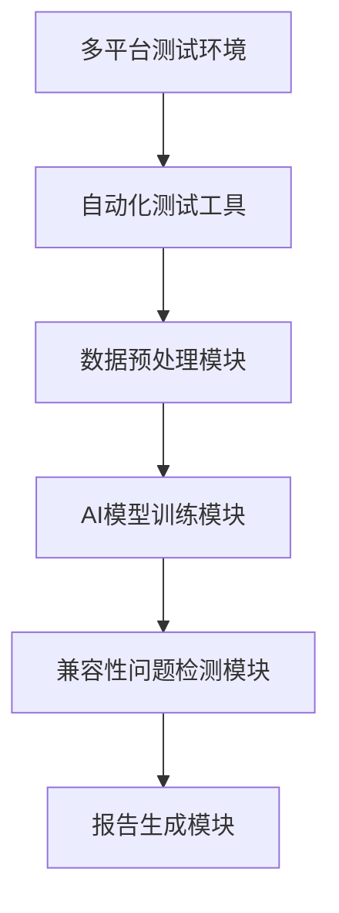

# 自动化兼容性问题检测:AI应对多平台挑战

> 关键词：自动化兼容性检测、AI、多平台挑战、软件测试、跨平台应用

> 摘要：随着软件应用在多平台环境下的广泛部署，兼容性问题成为了影响用户体验和软件质量的关键因素。传统的兼容性检测方法效率低下且容易遗漏问题。本文深入探讨了利用AI技术进行自动化兼容性问题检测以应对多平台挑战的相关内容。首先介绍了该领域的背景知识，包括目的、预期读者等；接着阐述了核心概念与联系，给出了原理和架构示意图；详细讲解了核心算法原理并结合Python代码示例；分析了相关的数学模型和公式；通过项目实战展示了代码实现和解读；探讨了实际应用场景；推荐了学习资源、开发工具框架和相关论文著作；最后总结了未来发展趋势与挑战，并提供了常见问题解答和参考资料，旨在为相关技术人员提供全面且深入的技术指导。

## 1. 背景介绍 
### 1.1 目的和范围
在当今数字化时代，软件应用需要在多种不同的平台上运行，如桌面端的Windows、Mac OS、Linux，移动端的iOS和Android等。不同平台在硬件特性、操作系统版本、浏览器类型和版本等方面存在差异，这些差异可能导致软件在某些平台上出现兼容性问题，如界面显示异常、功能无法正常使用等。本文章的目的在于介绍如何利用AI技术实现自动化兼容性问题检测，以提高检测效率和准确性，确保软件在多平台环境下的正常运行。范围涵盖了从核心概念的阐述、算法原理的讲解、实际项目的实现到应用场景的分析等多个方面。

### 1.2 预期读者
本文预期读者包括软件开发者、软件测试人员、人工智能研究人员、软件架构师以及对多平台兼容性问题检测和AI技术感兴趣的相关人员。对于软件开发者和测试人员，本文可以提供实际的技术指导和实现方案；对于人工智能研究人员，可从中获取在兼容性检测领域的应用思路；对于软件架构师，有助于其在设计软件架构时充分考虑多平台兼容性问题；对于普通技术爱好者，则可以帮助他们了解该领域的前沿技术和发展趋势。

### 1.3 文档结构概述
本文将按照以下结构进行阐述：首先介绍背景知识，包括目的、预期读者等；接着讲解核心概念与联系，给出相关的原理和架构示意图；详细介绍核心算法原理并结合Python代码示例进行说明；分析相关的数学模型和公式；通过项目实战展示代码的具体实现和解读；探讨实际应用场景；推荐学习资源、开发工具框架和相关论文著作；最后总结未来发展趋势与挑战，并提供常见问题解答和参考资料。

### 1.4 术语表
#### 1.4.1 核心术语定义
- **自动化兼容性检测**：利用自动化工具和技术，对软件在不同平台上的兼容性进行自动检测，以发现潜在的兼容性问题。
- **AI（人工智能）**：使计算机系统能够模拟人类智能的技术和方法，包括机器学习、深度学习等。
- **多平台**：指多种不同的操作系统、设备类型和软件环境，如桌面操作系统（Windows、Mac OS、Linux）、移动操作系统（iOS、Android）等。
- **兼容性问题**：软件在不同平台上运行时，由于平台差异导致的功能异常、界面显示问题等。

#### 1.4.2 相关概念解释
- **机器学习**：AI的一个重要分支，通过让计算机从数据中学习模式和规律，从而实现预测和决策。在兼容性检测中，机器学习算法可以用于分析大量的兼容性测试数据，以发现潜在的问题模式。
- **深度学习**：一种基于人工神经网络的机器学习方法，能够自动从数据中提取特征，在图像识别、自然语言处理等领域取得了显著的成果。在兼容性检测中，深度学习可以用于处理复杂的界面显示问题和功能异常检测。
- **跨平台应用**：能够在多个不同平台上运行的软件应用，需要特别关注兼容性问题。

#### 1.4.3 缩略词列表
- **AI**：Artificial Intelligence（人工智能）
- **ML**：Machine Learning（机器学习）
- **DL**：Deep Learning（深度学习）
- **OS**：Operating System（操作系统）

## 2. 核心概念与联系 

### 核心概念原理
自动化兼容性问题检测的核心原理是通过模拟软件在不同平台上的运行环境，收集软件运行过程中的各种数据，如界面截图、日志信息等，然后利用AI技术对这些数据进行分析，以发现潜在的兼容性问题。具体来说，首先需要建立一个多平台的测试环境，包括不同的操作系统、设备类型和软件版本等。然后，使用自动化测试工具对软件进行测试，记录软件在不同平台上的运行情况。接着，将收集到的数据输入到AI模型中进行训练和分析，AI模型可以学习到不同平台上软件正常运行和出现兼容性问题的模式和特征，从而能够自动识别新的兼容性问题。

### 架构的文本示意图
以下是自动化兼容性问题检测系统的架构示意图：

1. **多平台测试环境**：包括各种不同的操作系统（如Windows、Mac OS、Linux、iOS、Android等）、设备类型（如桌面电脑、笔记本电脑、手机、平板等）和软件版本。
2. **自动化测试工具**：用于自动执行软件测试任务，收集软件运行过程中的数据，如界面截图、日志信息、性能数据等。
3. **数据预处理模块**：对收集到的数据进行清洗、标注和特征提取等预处理操作，以便后续的AI模型能够更好地处理。
4. **AI模型训练模块**：使用预处理后的数据对AI模型进行训练，学习不同平台上软件正常运行和出现兼容性问题的模式和特征。
5. **兼容性问题检测模块**：使用训练好的AI模型对新的测试数据进行分析，自动识别潜在的兼容性问题。
6. **报告生成模块**：将检测到的兼容性问题生成详细的报告，包括问题描述、出现的平台、影响范围等，以便开发人员进行修复。

### Mermaid流程图


## 3. 核心算法原理 & 具体操作步骤 

### 核心算法原理
在自动化兼容性问题检测中，常用的AI算法包括机器学习算法（如决策树、随机森林、支持向量机等）和深度学习算法（如卷积神经网络、循环神经网络等）。这里以卷积神经网络（CNN）为例，介绍其在界面兼容性问题检测中的原理。

卷积神经网络是一种专门用于处理具有网格结构数据的深度学习模型，如图像数据。在界面兼容性问题检测中，可以将软件界面截图作为输入数据，CNN通过卷积层、池化层和全连接层等结构，自动提取图像的特征，然后根据这些特征判断界面是否存在兼容性问题。

### 具体操作步骤
1. **数据收集**：使用自动化测试工具在不同平台上运行软件，收集软件界面的截图。
2. **数据标注**：对收集到的截图进行标注，标记出存在兼容性问题的界面区域。
3. **数据预处理**：将标注好的截图进行归一化、裁剪等预处理操作，使其适合CNN模型的输入要求。
4. **模型构建**：构建CNN模型，包括卷积层、池化层和全连接层等。
5. **模型训练**：使用预处理后的数据对CNN模型进行训练，调整模型的参数，使其能够准确地识别兼容性问题。
6. **模型评估**：使用测试数据对训练好的模型进行评估，计算模型的准确率、召回率等指标。
7. **兼容性问题检测**：使用训练好的模型对新的软件界面截图进行检测，判断是否存在兼容性问题。

### Python源代码示例
```python
import tensorflow as tf
from tensorflow.keras import layers, models
import numpy as np
import os
from PIL import Image

# 数据加载和预处理
def load_data(data_dir):
    images = []
    labels = []
    for root, dirs, files in os.walk(data_dir):
        for file in files:
            if file.endswith('.png') or file.endswith('.jpg'):
                image_path = os.path.join(root, file)
                image = Image.open(image_path).convert('RGB')
                image = image.resize((224, 224))
                image = np.array(image) / 255.0
                images.append(image)
                if 'compatible' in root:
                    labels.append(0)
                else:
                    labels.append(1)
    images = np.array(images)
    labels = np.array(labels)
    return images, labels

# 构建CNN模型
def build_model():
    model = models.Sequential()
    model.add(layers.Conv2D(32, (3, 3), activation='relu', input_shape=(224, 224, 3)))
    model.add(layers.MaxPooling2D((2, 2)))
    model.add(layers.Conv2D(64, (3, 3), activation='relu'))
    model.add(layers.MaxPooling2D((2, 2)))
    model.add(layers.Conv2D(128, (3, 3), activation='relu'))
    model.add(layers.MaxPooling2D((2, 2)))
    model.add(layers.Flatten())
    model.add(layers.Dense(128, activation='relu'))
    model.add(layers.Dense(1, activation='sigmoid'))
    model.compile(optimizer='adam',
                  loss='binary_crossentropy',
                  metrics=['accuracy'])
    return model

# 数据加载
train_images, train_labels = load_data('train_data')
test_images, test_labels = load_data('test_data')

# 模型构建
model = build_model()

# 模型训练
model.fit(train_images, train_labels, epochs=10, batch_size=32)

# 模型评估
test_loss, test_acc = model.evaluate(test_images, test_labels)
print(f'Test accuracy: {test_acc}')

# 兼容性问题检测示例
new_image = Image.open('new_image.png').convert('RGB')
new_image = new_image.resize((224, 224))
new_image = np.array(new_image) / 255.0
new_image = np.expand_dims(new_image, axis=0)
prediction = model.predict(new_image)
if prediction[0][0] > 0.5:
    print('存在兼容性问题')
else:
    print('兼容性良好')
```

## 4. 数学模型和公式 & 详细讲解 & 举例说明 

### 卷积神经网络的数学模型和公式
#### 卷积层
卷积层是CNN的核心层，其主要作用是提取输入数据的特征。卷积层的数学模型可以表示为：

$$y_{ij}^k = \sum_{m=0}^{M-1} \sum_{n=0}^{N-1} x_{i+m, j+n}^l \cdot w_{mn}^k + b^k$$

其中，$y_{ij}^k$ 表示第 $k$ 个卷积核在位置 $(i, j)$ 处的输出，$x_{i+m, j+n}^l$ 表示输入数据在位置 $(i+m, j+n)$ 处的第 $l$ 个通道的值，$w_{mn}^k$ 表示第 $k$ 个卷积核在位置 $(m, n)$ 处的权重，$b^k$ 表示第 $k$ 个卷积核的偏置，$M$ 和 $N$ 分别表示卷积核的高度和宽度。

#### 激活函数
为了引入非线性因素，卷积层的输出通常会经过一个激活函数处理。常用的激活函数包括ReLU（Rectified Linear Unit）函数，其数学表达式为：

$$f(x) = \max(0, x)$$

#### 池化层
池化层的主要作用是对卷积层的输出进行下采样，减少数据的维度，同时保留重要的特征信息。常用的池化方法包括最大池化和平均池化。最大池化的数学表达式为：

$$y_{ij}^k = \max_{m=0}^{M-1} \max_{n=0}^{N-1} x_{iM+m, jN+n}^k$$

其中，$y_{ij}^k$ 表示第 $k$ 个通道在位置 $(i, j)$ 处的池化输出，$x_{iM+m, jN+n}^k$ 表示输入数据在位置 $(iM+m, jN+n)$ 处的第 $k$ 个通道的值，$M$ 和 $N$ 分别表示池化窗口的高度和宽度。

#### 全连接层
全连接层将卷积层和池化层提取的特征进行整合，输出最终的分类结果。全连接层的数学模型可以表示为：

$$y_j = \sum_{i=0}^{I-1} x_i \cdot w_{ij} + b_j$$

其中，$y_j$ 表示第 $j$ 个输出神经元的值，$x_i$ 表示输入神经元的值，$w_{ij}$ 表示输入神经元 $i$ 到输出神经元 $j$ 的权重，$b_j$ 表示输出神经元 $j$ 的偏置，$I$ 表示输入神经元的数量。

### 详细讲解
卷积层通过卷积核在输入数据上滑动，进行卷积操作，提取数据的局部特征。激活函数的作用是引入非线性因素，使得网络能够学习到更复杂的模式。池化层通过下采样减少数据的维度，降低计算量，同时增强模型的鲁棒性。全连接层将提取的特征进行整合，输出最终的分类结果。

### 举例说明
假设输入数据是一个 $28 \times 28$ 的图像，卷积核的大小为 $3 \times 3$，步长为 1，填充为 0。那么卷积层的输出大小为 $(28 - 3 + 1) \times (28 - 3 + 1) = 26 \times 26$。如果使用 $2 \times 2$ 的最大池化层，步长为 2，那么池化层的输出大小为 $(26 / 2) \times (26 / 2) = 13 \times 13$。

## 5. 项目实战：代码实际案例和详细解释说明 

### 5.1  开发环境搭建
1. **安装Python**：建议安装Python 3.7及以上版本，可以从Python官方网站（https://www.python.org/downloads/）下载安装。
2. **安装深度学习框架**：本文使用TensorFlow作为深度学习框架，可以使用以下命令进行安装：
```sh
pip install tensorflow
```
3. **安装其他依赖库**：还需要安装一些其他的依赖库，如NumPy、Pillow等，可以使用以下命令进行安装：
```sh
pip install numpy pillow
```

### 5.2  源代码详细实现和代码解读
```python
import tensorflow as tf
from tensorflow.keras import layers, models
import numpy as np
import os
from PIL import Image

# 数据加载和预处理
def load_data(data_dir):
    images = []
    labels = []
    for root, dirs, files in os.walk(data_dir):
        for file in files:
            if file.endswith('.png') or file.endswith('.jpg'):
                image_path = os.path.join(root, file)
                image = Image.open(image_path).convert('RGB')
                image = image.resize((224, 224))
                image = np.array(image) / 255.0
                images.append(image)
                if 'compatible' in root:
                    labels.append(0)
                else:
                    labels.append(1)
    images = np.array(images)
    labels = np.array(labels)
    return images, labels

# 构建CNN模型
def build_model():
    model = models.Sequential()
    model.add(layers.Conv2D(32, (3, 3), activation='relu', input_shape=(224, 224, 3)))
    model.add(layers.MaxPooling2D((2, 2)))
    model.add(layers.Conv2D(64, (3, 3), activation='relu'))
    model.add(layers.MaxPooling2D((2, 2)))
    model.add(layers.Conv2D(128, (3, 3), activation='relu'))
    model.add(layers.MaxPooling2D((2, 2)))
    model.add(layers.Flatten())
    model.add(layers.Dense(128, activation='relu'))
    model.add(layers.Dense(1, activation='sigmoid'))
    model.compile(optimizer='adam',
                  loss='binary_crossentropy',
                  metrics=['accuracy'])
    return model

# 数据加载
train_images, train_labels = load_data('train_data')
test_images, test_labels = load_data('test_data')

# 模型构建
model = build_model()

# 模型训练
model.fit(train_images, train_labels, epochs=10, batch_size=32)

# 模型评估
test_loss, test_acc = model.evaluate(test_images, test_labels)
print(f'Test accuracy: {test_acc}')

# 兼容性问题检测示例
new_image = Image.open('new_image.png').convert('RGB')
new_image = new_image.resize((224, 224))
new_image = np.array(new_image) / 255.0
new_image = np.expand_dims(new_image, axis=0)
prediction = model.predict(new_image)
if prediction[0][0] > 0.5:
    print('存在兼容性问题')
else:
    print('兼容性良好')
```

### 代码解读与分析
1. **数据加载和预处理**：`load_data` 函数用于加载图像数据，并进行预处理操作，包括将图像转换为RGB格式、调整图像大小、归一化处理等。同时，根据图像所在的文件夹名称，为图像标注标签（0表示兼容性良好，1表示存在兼容性问题）。
2. **模型构建**：`build_model` 函数构建了一个简单的CNN模型，包括卷积层、池化层、全连接层等。使用ReLU作为激活函数，sigmoid作为输出层的激活函数，适用于二分类问题。
3. **模型训练**：使用 `model.fit` 函数对模型进行训练，设置训练的轮数（epochs）和批次大小（batch_size）。
4. **模型评估**：使用 `model.evaluate` 函数对训练好的模型进行评估，计算模型在测试数据上的损失和准确率。
5. **兼容性问题检测**：加载新的图像数据，进行预处理后，使用 `model.predict` 函数进行预测，根据预测结果判断是否存在兼容性问题。

## 6. 实际应用场景 
### 软件开发商
软件开发商在开发跨平台应用时，需要确保软件在不同平台上的兼容性。利用自动化兼容性问题检测技术，可以在开发过程中及时发现和解决兼容性问题，提高软件的质量和用户体验。例如，一款移动应用需要在iOS和Android系统上运行，通过自动化兼容性检测，可以发现界面布局在不同系统上的显示差异、功能在不同系统上的可用性问题等，及时进行修复。

### 互联网企业
互联网企业的网站和Web应用需要在不同的浏览器和设备上正常显示和运行。自动化兼容性问题检测可以帮助企业快速发现和解决网站在不同浏览器（如Chrome、Firefox、Safari等）和设备（如桌面电脑、手机、平板等）上的兼容性问题，确保用户能够正常访问和使用网站。例如，一个电商网站在不同浏览器上的购物车功能可能会出现异常，通过自动化检测可以及时发现并修复这些问题。

### 游戏开发商
游戏通常需要在多种不同的硬件平台和操作系统上运行，兼容性问题可能会影响游戏的性能和用户体验。自动化兼容性问题检测可以帮助游戏开发商在游戏开发和测试过程中发现和解决兼容性问题，确保游戏在不同平台上的流畅运行。例如，一款大型3D游戏在不同显卡和处理器上可能会出现卡顿、画面显示异常等问题，通过自动化检测可以及时发现并优化这些问题。

## 7. 工具和资源推荐
### 7.1 学习资源推荐
#### 7.1.1 书籍推荐
- 《深度学习》（Deep Learning）：由Ian Goodfellow、Yoshua Bengio和Aaron Courville所著，是深度学习领域的经典教材，涵盖了深度学习的基本概念、算法和应用。
- 《Python机器学习》（Python Machine Learning）：由Sebastian Raschka所著，介绍了使用Python进行机器学习的方法和技巧，包括各种机器学习算法的实现和应用。
- 《计算机视觉：算法与应用》（Computer Vision: Algorithms and Applications）：由Richard Szeliski所著，全面介绍了计算机视觉的基本概念、算法和应用，对于理解图像识别和处理技术有很大帮助。

#### 7.1.2 在线课程
- Coursera上的“深度学习专项课程”（Deep Learning Specialization）：由Andrew Ng教授主讲，包括深度学习的基础、卷积神经网络、循环神经网络等内容，是学习深度学习的优质课程。
- edX上的“人工智能基础”（Introduction to Artificial Intelligence）：介绍了人工智能的基本概念、算法和应用，适合初学者入门。
- Udemy上的“Python数据科学和机器学习实战”（Python for Data Science and Machine Learning Bootcamp）：通过实际项目讲解Python在数据科学和机器学习中的应用，具有很强的实践性。

#### 7.1.3 技术博客和网站
- Medium：是一个技术博客平台，上面有很多关于人工智能、机器学习、深度学习等领域的优秀文章和教程。
- Towards Data Science：专注于数据科学和机器学习领域的技术博客，提供了很多实用的技术文章和案例分析。
- arXiv：是一个预印本数据库，上面有很多最新的学术论文和研究成果，对于了解人工智能领域的前沿技术有很大帮助。

### 7.2 开发工具框架推荐
#### 7.2.1 IDE和编辑器
- PyCharm：是一款专门为Python开发设计的集成开发环境（IDE），提供了丰富的功能和插件，适合开发Python项目。
- Jupyter Notebook：是一个交互式的开发环境，支持Python、R等多种编程语言，适合进行数据探索和模型训练。
- Visual Studio Code：是一款轻量级的代码编辑器，支持多种编程语言和插件，具有良好的扩展性和易用性。

#### 7.2.2 调试和性能分析工具
- TensorBoard：是TensorFlow的可视化工具，可以帮助用户可视化模型的训练过程、网络结构、性能指标等，方便进行调试和优化。
- PyTorch Profiler：是PyTorch的性能分析工具，可以帮助用户分析模型的性能瓶颈，优化模型的运行效率。
- cProfile：是Python的内置性能分析工具，可以帮助用户分析Python代码的性能瓶颈，找出耗时较长的函数和代码段。

#### 7.2.3 相关框架和库
- TensorFlow：是一个开源的深度学习框架，提供了丰富的工具和接口，支持多种深度学习模型的开发和训练。
- PyTorch：是另一个开源的深度学习框架，具有简洁易用的接口和高效的计算性能，受到了很多研究人员和开发者的喜爱。
- Scikit-learn：是一个用于机器学习的Python库，提供了各种机器学习算法和工具，适合进行数据预处理、模型选择和评估等任务。

### 7.3 相关论文著作推荐
#### 7.3.1 经典论文
- “ImageNet Classification with Deep Convolutional Neural Networks”：由Alex Krizhevsky、Ilya Sutskever和Geoffrey E. Hinton所著，介绍了AlexNet模型，开启了深度学习在计算机视觉领域的热潮。
- “Long Short-Term Memory”：由Sepp Hochreiter和Jürgen Schmidhuber所著，提出了长短期记忆网络（LSTM），解决了循环神经网络中的梯度消失问题。
- “Generative Adversarial Nets”：由Ian J. Goodfellow等人所著，提出了生成对抗网络（GAN），是一种强大的生成模型。

#### 7.3.2 最新研究成果
- 在arXiv等预印本数据库上可以找到很多关于自动化兼容性问题检测、人工智能在软件测试中的应用等方面的最新研究成果。例如，一些研究提出了基于强化学习的自动化兼容性检测方法，通过智能体的交互和学习，提高检测的效率和准确性。

#### 7.3.3 应用案例分析
- 一些技术博客和会议论文中会有关于自动化兼容性问题检测的应用案例分析。例如，某些公司分享了他们在实际项目中使用AI技术进行兼容性检测的经验和成果，包括遇到的问题、解决方案和取得的效果等。

## 8. 总结：未来发展趋势与挑战
### 未来发展趋势
1. **更智能的检测算法**：随着人工智能技术的不断发展，未来的自动化兼容性问题检测算法将更加智能和高效。例如，结合强化学习、迁移学习等技术，提高检测的准确性和效率，减少人工干预。
2. **多模态数据融合**：除了图像数据，未来的兼容性检测将融合更多的模态数据，如日志信息、性能数据、用户行为数据等，从多个角度全面检测兼容性问题。
3. **实时检测和预警**：实现实时的兼容性问题检测和预警功能，当软件在运行过程中出现兼容性问题时，能够及时通知开发人员进行处理，减少对用户的影响。
4. **与DevOps集成**：将自动化兼容性问题检测与DevOps流程集成，实现自动化的持续集成和持续部署，在软件开发的各个阶段及时发现和解决兼容性问题。

### 挑战
1. **数据标注困难**：在进行AI模型训练时，需要大量的标注数据。然而，兼容性问题的标注比较困难，需要专业的知识和经验，标注成本较高。
2. **模型泛化能力**：不同的软件应用和平台环境具有很大的差异，如何提高AI模型的泛化能力，使其能够在不同的场景下准确地检测兼容性问题，是一个挑战。
3. **计算资源需求**：深度学习模型的训练和推理需要大量的计算资源，对于一些小型企业和开发者来说，可能面临计算资源不足的问题。
4. **技术更新换代快**：人工智能技术发展迅速，新的算法和模型不断涌现。如何及时跟上技术的发展，采用最新的技术来提高兼容性检测的效果，是一个挑战。

## 9. 附录：常见问题与解答
### 1. 自动化兼容性检测能否完全替代人工测试？
不能。虽然自动化兼容性检测可以提高检测效率和准确性，但人工测试仍然具有不可替代的作用。人工测试可以发现一些自动化测试难以发现的问题，如用户体验方面的问题、一些复杂的功能逻辑问题等。自动化兼容性检测和人工测试应该相互结合，共同提高软件的质量。

### 2. 如何选择合适的AI算法进行兼容性检测？
选择合适的AI算法需要考虑多个因素，如数据类型、问题复杂度、计算资源等。如果数据是图像类型，可以考虑使用卷积神经网络；如果数据是序列类型，可以考虑使用循环神经网络。同时，还可以尝试多种算法，比较它们的性能，选择最优的算法。

### 3. 兼容性检测数据的质量对模型性能有多大影响？
兼容性检测数据的质量对模型性能有很大影响。如果数据存在噪声、标注错误等问题，会导致模型学习到错误的模式和特征，从而影响模型的准确性和泛化能力。因此，在进行数据收集和标注时，需要确保数据的质量。

### 4. 如何提高AI模型在兼容性检测中的泛化能力？
可以通过以下方法提高AI模型的泛化能力：增加训练数据的多样性，使用数据增强技术对数据进行扩充；采用正则化方法，如L1和L2正则化，防止模型过拟合；进行模型融合，将多个不同的模型进行组合，提高模型的稳定性和泛化能力。

## 10. 扩展阅读 & 参考资料
1. 《人工智能：现代方法》（Artificial Intelligence: A Modern Approach），作者：Stuart Russell、Peter Norvig
2. 《机器学习》（Machine Learning），作者：Tom M. Mitchell
3. 相关的学术期刊和会议论文，如《Journal of Artificial Intelligence Research》、《Conference on Neural Information Processing Systems》等
4. 各大技术公司的官方文档和博客，如Google AI Blog、Facebook AI Research等
5. 开源项目和代码库，如GitHub上的相关项目，可参考其实现思路和代码示例。