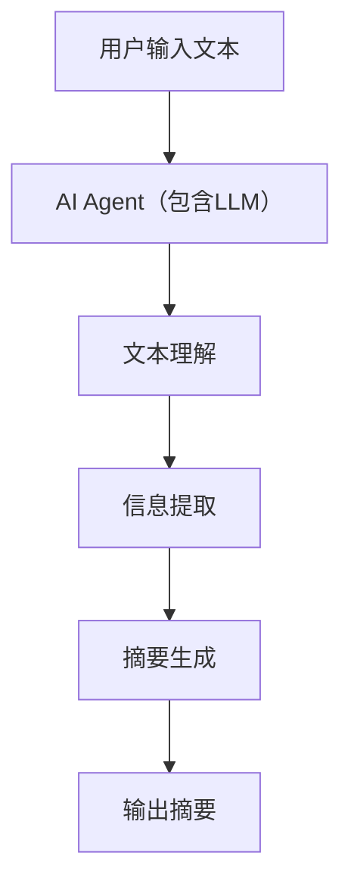

# 自动摘要AI Agent：LLM驱动的文本压缩与提炼

> 关键词：自动摘要、AI Agent、大语言模型（LLM）、文本压缩、文本提炼、自然语言处理、信息提取

> 摘要：本文围绕自动摘要AI Agent展开，深入探讨其基于大语言模型（LLM）实现文本压缩与提炼的原理、算法、实践应用等方面。首先介绍了自动摘要的背景，包括目的、预期读者、文档结构和相关术语。接着阐述核心概念与联系，给出原理和架构的示意图及流程图。详细讲解了核心算法原理并通过Python代码进行说明，还分析了相关数学模型和公式。通过项目实战展示代码的实现与解读，探讨了实际应用场景。最后推荐了学习资源、开发工具框架以及相关论文著作，总结未来发展趋势与挑战，解答常见问题并提供扩展阅读与参考资料，旨在为读者全面深入地了解自动摘要AI Agent提供指导。

## 1. 背景介绍 
### 1.1 目的和范围
在信息爆炸的时代，每天都有海量的文本信息产生，如新闻报道、学术论文、商业文档等。这些信息对于用户来说可能过于冗长和繁杂，难以快速获取关键信息。自动摘要技术的目的就是通过计算机程序对文本进行处理，生成简洁、准确的摘要，帮助用户快速了解文本的核心内容。

本文的范围主要聚焦于基于大语言模型（LLM）的自动摘要AI Agent。将深入探讨其实现文本压缩与提炼的原理、算法、实践应用等方面，旨在为读者提供全面且深入的技术知识和实践指导。

### 1.2 预期读者
本文预期读者包括自然语言处理领域的研究人员、人工智能开发者、对自动摘要技术感兴趣的程序员、相关专业的学生以及希望利用自动摘要技术提高信息处理效率的企业人员等。

### 1.3 文档结构概述
本文首先介绍自动摘要AI Agent的背景信息，包括目的、预期读者、文档结构和术语表。接着阐述核心概念与联系，通过文本示意图和Mermaid流程图展示其原理和架构。详细讲解核心算法原理并给出Python代码实现，分析相关数学模型和公式。通过项目实战展示代码的具体实现和解读，探讨实际应用场景。然后推荐学习资源、开发工具框架以及相关论文著作。最后总结未来发展趋势与挑战，解答常见问题并提供扩展阅读与参考资料。

### 1.4 术语表
#### 1.4.1 核心术语定义
- **自动摘要**：指利用计算机技术自动从原始文本中提取关键信息，生成简洁、准确的摘要的过程。
- **AI Agent**：即人工智能代理，是一种能够感知环境、做出决策并采取行动以实现特定目标的智能实体。在自动摘要领域，AI Agent可以根据用户需求和文本特征自动生成摘要。
- **大语言模型（LLM）**：是一种基于深度学习的自然语言处理模型，通过在大规模文本数据上进行训练，学习语言的模式和规律，能够生成高质量的自然语言文本。
- **文本压缩**：指减少文本的长度，去除冗余信息，同时保留关键信息的过程。
- **文本提炼**：指从文本中提取最核心、最重要的信息，突出文本的关键要点。

#### 1.4.2 相关概念解释
- **自然语言处理（NLP）**：是人工智能的一个重要领域，研究如何让计算机理解、处理和生成自然语言。自动摘要技术是自然语言处理的一个重要应用方向。
- **信息提取**：指从文本中提取特定类型的信息，如实体、关系、事件等。信息提取是自动摘要的重要基础，通过提取关键信息可以更好地生成摘要。

#### 1.4.3 缩略词列表
- **LLM**：大语言模型（Large Language Model）
- **NLP**：自然语言处理（Natural Language Processing）

## 2. 核心概念与联系 
### 核心概念原理
自动摘要AI Agent基于大语言模型（LLM）实现文本压缩与提炼的核心原理是利用LLM强大的语言理解和生成能力。LLM通过在大规模文本数据上进行预训练，学习到了丰富的语言知识和模式。当输入一篇文本时，AI Agent首先利用LLM对文本进行理解，分析文本的语义、句法和上下文信息。然后，根据用户的需求和摘要的目标，AI Agent从文本中提取关键信息，并利用LLM生成简洁、准确的摘要。

### 架构的文本示意图
```plaintext
用户输入文本 -> AI Agent（包含LLM）
                      |
                      | 文本理解（利用LLM分析语义、句法、上下文）
                      |
                      | 信息提取（提取关键信息）
                      |
                      | 摘要生成（利用LLM生成摘要）
                      |
输出摘要
```

### Mermaid流程图


## 3. 核心算法原理 & 具体操作步骤 
### 核心算法原理
基于大语言模型的自动摘要算法主要包括以下几个步骤：

1. **文本编码**：将输入的文本转换为LLM能够处理的向量表示。通常使用预训练的词嵌入模型将文本中的每个词转换为向量，然后通过循环神经网络（RNN）、长短期记忆网络（LSTM）或Transformer等模型将这些词向量组合成文本的向量表示。

2. **文本理解**：利用LLM对文本的向量表示进行处理，学习文本的语义、句法和上下文信息。LLM通过多层的Transformer架构对文本进行深度编码，捕捉文本中的复杂模式和关系。

3. **信息提取**：根据用户的需求和摘要的目标，从文本中提取关键信息。可以使用基于注意力机制的方法，通过计算每个词或句子的注意力权重，确定哪些部分是关键信息。

4. **摘要生成**：利用LLM根据提取的关键信息生成摘要。可以使用生成式方法，通过LLM的解码器生成新的文本作为摘要；也可以使用抽取式方法，直接从原文中选择关键句子作为摘要。

### Python源代码详细阐述
以下是一个简单的基于Hugging Face Transformers库的自动摘要示例代码：

```python
from transformers import pipeline

# 加载预训练的摘要模型
summarizer = pipeline("summarization", model="t5-small")

# 输入文本
text = """
The quick brown fox jumps over the lazy dog. This is a simple sentence.
The fox is very fast and the dog is very lazy. The fox likes to run in the forest.
"""

# 生成摘要
summary = summarizer(text, max_length=30, min_length=10, do_sample=False)

# 输出摘要
print(summary[0]['summary_text'])
```

### 具体操作步骤
1. **安装依赖库**：使用`pip install transformers`安装Hugging Face Transformers库。
2. **加载预训练模型**：使用`pipeline`函数加载预训练的摘要模型。这里选择了`t5-small`模型。
3. **输入文本**：定义要进行摘要的文本。
4. **生成摘要**：调用`summarizer`函数生成摘要，设置`max_length`和`min_length`参数控制摘要的长度。
5. **输出摘要**：打印生成的摘要。

## 4. 数学模型和公式 & 详细讲解 & 举例说明 
### 数学模型
基于大语言模型的自动摘要主要基于Transformer架构。Transformer架构的核心是多头自注意力机制（Multi-Head Self-Attention）。

### 多头自注意力机制公式
多头自注意力机制的计算公式如下：

$$\text{MultiHead}(Q, K, V) = \text{Concat}(\text{head}_1, \cdots, \text{head}_h)W^O$$

其中，$\text{head}_i = \text{Attention}(QW_i^Q, KW_i^K, VW_i^V)$，$\text{Attention}(Q, K, V) = \text{softmax}(\frac{QK^T}{\sqrt{d_k}})V$。

- $Q$、$K$、$V$ 分别是查询（Query）、键（Key）和值（Value）矩阵。
- $W_i^Q$、$W_i^K$、$W_i^V$ 是可学习的投影矩阵。
- $d_k$ 是键向量的维度。
- $W^O$ 是输出投影矩阵。

### 详细讲解
多头自注意力机制通过将输入的查询、键和值矩阵分别投影到多个低维子空间，在每个子空间中计算注意力权重，然后将这些注意力结果拼接起来并通过一个线性变换得到最终的输出。这样可以让模型在不同的表示子空间中捕捉文本的不同特征，提高模型的表达能力。

### 举例说明
假设输入的文本是一个句子，每个词都被转换为一个向量。在多头自注意力机制中，查询矩阵 $Q$、键矩阵 $K$ 和值矩阵 $V$ 由这些词向量组成。通过计算注意力权重，模型可以确定每个词与其他词之间的关联程度。例如，在句子 “The quick brown fox jumps over the lazy dog.” 中，“fox” 这个词可能与 “quick” 和 “jumps” 等词有较强的关联，通过注意力机制可以捕捉到这种关联信息，从而更好地理解文本的语义。

## 5. 项目实战：代码实际案例和详细解释说明 
### 5.1  开发环境搭建
1. **安装Python**：确保系统中安装了Python 3.6或以上版本。
2. **创建虚拟环境**：使用`venv`或`conda`创建虚拟环境，以隔离项目的依赖。例如，使用`venv`创建虚拟环境的命令为：`python -m venv myenv`。
3. **激活虚拟环境**：在Windows系统中，使用`myenv\Scripts\activate`激活虚拟环境；在Linux或Mac系统中，使用`source myenv/bin/activate`激活虚拟环境。
4. **安装依赖库**：使用`pip install transformers torch datasets`安装所需的依赖库。

### 5.2  源代码详细实现和代码解读
以下是一个更完整的自动摘要项目示例代码：

```python
from transformers import AutoTokenizer, AutoModelForSeq2SeqLM
import torch

# 加载预训练的模型和分词器
model_name = "t5-small"
tokenizer = AutoTokenizer.from_pretrained(model_name)
model = AutoModelForSeq2SeqLM.from_pretrained(model_name)

# 输入文本
text = """
This is a long and detailed description of a project. The project aims to develop a new software application
that can help users manage their tasks more efficiently. It will have features such as task scheduling,
reminders, and progress tracking. The development team consists of experienced software engineers and
designers. They have been working hard to ensure the quality and functionality of the application.
"""

# 对输入文本进行分词
inputs = tokenizer(text, return_tensors="pt", max_length=512, truncation=True)

# 生成摘要
outputs = model.generate(**inputs, max_length=100, min_length=30, num_beams=4, early_stopping=True)

# 解码生成的摘要
summary = tokenizer.decode(outputs[0], skip_special_tokens=True)

# 输出摘要
print(summary)
```

### 代码解读与分析
1. **加载预训练的模型和分词器**：使用`AutoTokenizer`和`AutoModelForSeq2SeqLM`从Hugging Face模型库中加载预训练的模型和分词器。这里选择了`t5-small`模型。
2. **输入文本**：定义要进行摘要的文本。
3. **对输入文本进行分词**：使用分词器将输入文本转换为模型可以处理的输入格式。设置`max_length`和`truncation`参数控制输入文本的长度。
4. **生成摘要**：调用模型的`generate`方法生成摘要。设置`max_length`、`min_length`、`num_beams`和`early_stopping`等参数控制摘要的长度和生成策略。
5. **解码生成的摘要**：使用分词器将模型生成的摘要解码为文本格式。
6. **输出摘要**：打印生成的摘要。

## 6. 实际应用场景 
### 新闻摘要
在新闻领域，每天都有大量的新闻报道发布。自动摘要技术可以帮助用户快速了解新闻的核心内容，节省阅读时间。例如，新闻网站可以使用自动摘要AI Agent为用户提供新闻的简短摘要，用户可以根据摘要决定是否要阅读全文。

### 学术论文摘要
学术论文通常篇幅较长，包含大量的专业知识和研究内容。自动摘要技术可以帮助研究人员快速了解论文的主要贡献和研究成果，提高信息获取效率。例如，学术数据库可以使用自动摘要AI Agent为用户提供论文的摘要，方便用户筛选和阅读。

### 商业文档摘要
在商业领域，企业需要处理大量的文档，如报告、合同、提案等。自动摘要技术可以帮助企业人员快速了解文档的关键信息，提高决策效率。例如，企业可以使用自动摘要AI Agent对合同进行摘要，快速了解合同的主要条款和风险。

### 社交媒体摘要
在社交媒体平台上，用户会发布大量的信息，如帖子、评论等。自动摘要技术可以帮助用户快速了解社交媒体上的热点话题和关键信息。例如，社交媒体平台可以使用自动摘要AI Agent为用户提供热门帖子的摘要，方便用户浏览和参与讨论。

## 7. 工具和资源推荐
### 7.1 学习资源推荐
#### 7.1.1 书籍推荐
- 《自然语言处理入门》：介绍自然语言处理的基本概念、算法和应用，适合初学者。
- 《深度学习》：深入讲解深度学习的原理和方法，对于理解大语言模型有很大帮助。
- 《基于深度学习的自然语言处理》：结合深度学习和自然语言处理的理论和实践，提供了丰富的案例和代码。

#### 7.1.2 在线课程
- Coursera上的“Natural Language Processing Specialization”：由知名教授授课，系统地介绍自然语言处理的各个方面。
- edX上的“Introduction to Artificial Intelligence”：涵盖人工智能的基本概念和方法，包括自然语言处理。
- 哔哩哔哩上的相关自然语言处理课程：有很多优秀的UP主分享自然语言处理的教学视频，内容生动易懂。

#### 7.1.3 技术博客和网站
- Hugging Face官方博客：提供最新的自然语言处理技术和模型介绍。
- Towards Data Science：发布大量关于数据科学和自然语言处理的技术文章。
- 机器之心：关注人工智能领域的最新动态和技术进展。

### 7.2 开发工具框架推荐
#### 7.2.1 IDE和编辑器
- PyCharm：功能强大的Python集成开发环境，提供代码编辑、调试、版本控制等功能。
- Visual Studio Code：轻量级的代码编辑器，支持多种编程语言和插件扩展。
- Jupyter Notebook：交互式的开发环境，适合数据探索和模型训练。

#### 7.2.2 调试和性能分析工具
- PyTorch Profiler：用于分析PyTorch模型的性能，找出性能瓶颈。
- TensorBoard：用于可视化深度学习模型的训练过程和性能指标。
- cProfile：Python内置的性能分析工具，用于分析Python代码的运行时间和调用关系。

#### 7.2.3 相关框架和库
- Hugging Face Transformers：提供了丰富的预训练模型和工具，方便进行自然语言处理任务。
- PyTorch：深度学习框架，广泛应用于自然语言处理领域。
- TensorFlow：另一个流行的深度学习框架，也有很多自然语言处理的应用案例。

### 7.3 相关论文著作推荐
#### 7.3.1 经典论文
- “Attention Is All You Need”：介绍了Transformer架构，是自然语言处理领域的经典论文。
- “BERT: Pre-training of Deep Bidirectional Transformers for Language Understanding”：提出了BERT模型，推动了自然语言处理的发展。
- “T5: Exploring the Limits of Transfer Learning with a Unified Text-to-Text Transformer”：介绍了T5模型，为自动摘要等任务提供了新的思路。

#### 7.3.2 最新研究成果
- 关注ACL（Association for Computational Linguistics）、EMNLP（Conference on Empirical Methods in Natural Language Processing）等自然语言处理领域的顶级会议，获取最新的研究成果。
- 查阅arXiv等预印本平台上的相关论文，了解最新的技术进展。

#### 7.3.3 应用案例分析
- 分析一些实际应用中的自动摘要案例，了解如何将技术应用到实际场景中。例如，一些新闻网站、学术数据库等的自动摘要实现方案。

## 8. 总结：未来发展趋势与挑战
### 未来发展趋势
1. **多模态融合**：未来的自动摘要技术将不仅仅局限于文本，还将融合图像、音频、视频等多模态信息，实现更全面、更准确的信息摘要。
2. **个性化摘要**：根据用户的兴趣、偏好和需求，生成个性化的摘要，提高用户的信息获取效率和满意度。
3. **跨语言摘要**：随着全球化的发展，跨语言信息的交流越来越频繁。自动摘要技术将支持更多的语言，实现跨语言的信息摘要。
4. **与知识图谱的结合**：将自动摘要技术与知识图谱相结合，利用知识图谱的丰富知识和语义信息，提高摘要的准确性和完整性。

### 挑战
1. **语义理解的准确性**：虽然大语言模型在语言理解方面取得了很大的进展，但对于一些复杂的语义和语境信息，仍然存在理解不准确的问题。
2. **摘要的质量评估**：目前还没有一个统一、客观的摘要质量评估标准，如何准确地评估摘要的质量是一个挑战。
3. **计算资源的需求**：大语言模型的训练和推理需要大量的计算资源，如何降低计算成本，提高效率是一个亟待解决的问题。
4. **数据隐私和安全**：在处理文本数据时，需要考虑数据的隐私和安全问题，防止数据泄露和滥用。

## 9. 附录：常见问题与解答
### 问题1：自动摘要技术能完全替代人工阅读吗？
解答：不能。自动摘要技术虽然可以帮助用户快速了解文本的核心内容，但它仍然存在一定的局限性，如对复杂语义的理解可能不准确，无法完全捕捉文本的细节和情感等。因此，在一些需要深入理解文本的场景中，人工阅读仍然是必不可少的。

### 问题2：如何选择合适的自动摘要模型？
解答：选择合适的自动摘要模型需要考虑多个因素，如模型的性能、计算资源的需求、应用场景等。一般来说，可以参考模型在公开数据集上的评估指标，如ROUGE分数等。同时，还需要根据自己的计算资源和应用场景选择合适的模型大小。

### 问题3：自动摘要技术在处理长文本时效果如何？
解答：自动摘要技术在处理长文本时可能会面临一些挑战，如信息过载、语义理解困难等。为了提高处理长文本的效果，可以采用分块处理、层次化摘要等方法。同时，选择合适的模型和调整模型的参数也可以提高处理长文本的性能。

### 问题4：如何评估自动摘要的质量？
解答：目前常用的评估指标包括ROUGE（Recall-Oriented Understudy for Gisting Evaluation）分数、BLEU（Bilingual Evaluation Understudy）分数等。这些指标通过比较生成的摘要与参考摘要之间的重叠程度来评估摘要的质量。此外，还可以通过人工评估的方式，让用户对摘要的质量进行主观评价。

## 10. 扩展阅读 & 参考资料
### 扩展阅读
- 《人工智能：现代方法》：全面介绍人工智能的各个领域，包括自然语言处理、机器学习等。
- 《自然语言处理综论》：深入探讨自然语言处理的理论和技术，提供了丰富的案例和代码。

### 参考资料
- Hugging Face官方文档：https://huggingface.co/docs
- PyTorch官方文档：https://pytorch.org/docs/stable/index.html
- TensorFlow官方文档：https://www.tensorflow.org/api_docs
- ACL Anthology：https://aclanthology.org/ 