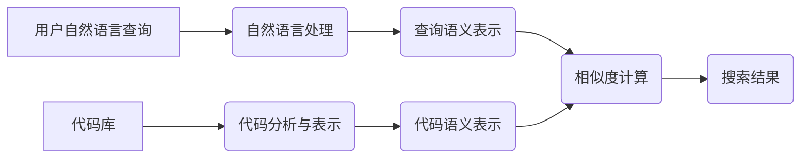

# 自然语言处理在代码搜索中的应用

> 关键词：自然语言处理、代码搜索、语义理解、信息检索、机器学习、深度学习、代码语义表示

> 摘要：本文深入探讨了自然语言处理（NLP）在代码搜索中的应用。首先介绍了相关背景，包括目的、预期读者等内容。接着阐述了自然语言处理和代码搜索的核心概念及其联系，通过文本示意图和 Mermaid 流程图进行直观展示。详细讲解了核心算法原理，结合 Python 源代码进行说明，还介绍了相关的数学模型和公式。通过项目实战，给出代码实际案例并详细解释。分析了自然语言处理在代码搜索中的实际应用场景，推荐了学习资源、开发工具框架以及相关论文著作。最后总结了未来发展趋势与挑战，提供常见问题解答和扩展阅读参考资料，旨在全面展现自然语言处理在代码搜索领域的重要作用和应用前景。

## 1. 背景介绍 
### 1.1 目的和范围
随着软件开发规模的不断扩大和开源代码库的日益丰富，代码量呈现爆炸式增长。开发人员在日常工作中需要频繁地查找和复用代码，传统的基于关键词匹配的代码搜索方式已难以满足需求，因为它无法理解代码的语义，常常导致搜索结果不准确、不相关。自然语言处理技术的发展为解决这一问题提供了新的思路和方法。

本文的目的在于深入探讨自然语言处理在代码搜索中的应用，涵盖自然语言处理和代码搜索的基本概念、核心算法原理、数学模型、项目实战、实际应用场景等多个方面，旨在为开发人员、研究人员和相关从业者提供全面、深入的技术指导和参考。

### 1.2 预期读者
本文的预期读者包括但不限于以下几类人群：
- **软件开发人员**：希望通过自然语言处理技术提高代码搜索效率，更好地复用代码，提升开发效率。
- **研究人员**：对自然语言处理和代码搜索的交叉领域感兴趣，希望深入了解相关理论和技术，开展进一步的研究工作。
- **技术管理者**：需要了解自然语言处理在代码搜索中的应用现状和发展趋势，以便在团队或企业中做出合理的技术决策。
- **学生**：学习计算机科学、软件工程、自然语言处理等相关专业的学生，希望通过本文了解相关领域的前沿知识和应用实践。

### 1.3 文档结构概述
本文的文档结构如下：
- **核心概念与联系**：介绍自然语言处理和代码搜索的核心概念，通过文本示意图和 Mermaid 流程图展示它们之间的联系。
- **核心算法原理 & 具体操作步骤**：详细讲解自然语言处理在代码搜索中应用的核心算法原理，结合 Python 源代码进行说明。
- **数学模型和公式 & 详细讲解 & 举例说明**：介绍相关的数学模型和公式，并通过具体例子进行详细讲解。
- **项目实战：代码实际案例和详细解释说明**：通过一个具体的项目实战，给出代码实际案例并详细解释，包括开发环境搭建、源代码实现和代码解读。
- **实际应用场景**：分析自然语言处理在代码搜索中的实际应用场景。
- **工具和资源推荐**：推荐学习资源、开发工具框架以及相关论文著作。
- **总结：未来发展趋势与挑战**：总结自然语言处理在代码搜索中的未来发展趋势和面临的挑战。
- **附录：常见问题与解答**：提供常见问题的解答。
- **扩展阅读 & 参考资料**：提供扩展阅读的内容和参考资料。

### 1.4 术语表
#### 1.4.1 核心术语定义
- **自然语言处理（Natural Language Processing，NLP）**：是计算机科学、人工智能和语言学的交叉领域，旨在让计算机能够理解、处理和生成人类语言。
- **代码搜索（Code Search）**：指在代码库中查找满足特定需求的代码片段的过程。
- **语义理解（Semantic Understanding）**：指计算机能够理解语言或代码的含义和语义信息。
- **信息检索（Information Retrieval）**：是指从大量信息中查找出满足用户需求的信息的过程。
- **代码语义表示（Code Semantic Representation）**：将代码的语义信息表示为计算机能够处理的形式，如向量、图等。

#### 1.4.2 相关概念解释
- **词法分析（Lexical Analysis）**：将自然语言或代码分解为一个个词法单元（如单词、符号等）的过程。
- **句法分析（Syntactic Analysis）**：分析语言或代码的语法结构，确定各个词法单元之间的关系。
- **语义分析（Semantic Analysis）**：理解语言或代码的语义信息，确定其含义和逻辑关系。
- **深度学习（Deep Learning）**：是一类基于人工神经网络的机器学习技术，能够自动从大量数据中学习特征和模式。
- **机器学习（Machine Learning）**：是一门多领域交叉学科，涉及概率论、统计学、逼近论、凸分析、算法复杂度理论等多门学科，它专门研究计算机怎样模拟或实现人类的学习行为，以获取新的知识或技能，重新组织已有的知识结构使之不断改善自身的性能。

#### 1.4.3 缩略词列表
- **NLP**：Natural Language Processing（自然语言处理）
- **IR**：Information Retrieval（信息检索）
- **DL**：Deep Learning（深度学习）
- **ML**：Machine Learning（机器学习）

## 2. 核心概念与联系 

### 自然语言处理核心概念
自然语言处理的主要任务包括词法分析、句法分析、语义分析、文本分类、情感分析、机器翻译等。其基本原理是将自然语言文本转换为计算机能够处理的形式，通过一系列的算法和模型对文本进行分析和处理，从而实现对自然语言的理解和生成。

### 代码搜索核心概念
代码搜索的目标是在代码库中快速、准确地找到满足用户需求的代码片段。传统的代码搜索主要基于关键词匹配，即通过在代码中查找与用户输入的关键词相同或相似的文本。然而，这种方法无法理解代码的语义，容易导致搜索结果不准确、不相关。

### 两者联系
自然语言处理与代码搜索的联系在于，通过自然语言处理技术可以理解用户的自然语言查询意图，并将其转换为与代码语义相关的表示形式，从而实现基于语义的代码搜索。具体来说，自然语言处理技术可以用于对用户的查询进行预处理，提取其中的关键信息；还可以用于对代码进行语义分析和表示，将代码的语义信息转换为计算机能够处理的形式。

### 文本示意图
```plaintext
用户自然语言查询 --(自然语言处理)--> 查询语义表示
代码库 --(代码分析与表示)--> 代码语义表示
查询语义表示与代码语义表示 --(相似度计算)--> 搜索结果
```

### Mermaid 流程图


## 3. 核心算法原理 & 具体操作步骤 

### 词嵌入算法原理
词嵌入是自然语言处理中常用的技术，它将单词映射到低维向量空间中，使得语义相似的单词在向量空间中距离较近。常见的词嵌入算法有 Word2Vec、GloVe 等。

以下是使用 Python 和 gensim 库实现 Word2Vec 词嵌入的示例代码：
```python
from gensim.models import Word2Vec

# 示例文本数据
sentences = [["I", "love", "natural", "language", "processing"],
             ["Code", "search", "is", "important"]]

# 训练 Word2Vec 模型
model = Word2Vec(sentences, min_count=1)

# 获取单词的向量表示
vector = model.wv['natural']
print(vector)
```
### 具体操作步骤
1. **数据预处理**：对用户的自然语言查询和代码库中的代码进行预处理，包括分词、去除停用词、词干提取等操作。
2. **词嵌入训练**：使用词嵌入算法（如 Word2Vec、GloVe 等）对预处理后的数据进行训练，得到单词的向量表示。
3. **查询和代码的语义表示**：将用户的查询和代码库中的代码转换为向量表示，例如可以通过对单词向量进行平均或加权平均得到句子或代码片段的向量表示。
4. **相似度计算**：计算查询向量和代码向量之间的相似度，常用的相似度计算方法有余弦相似度、欧几里得距离等。
5. **结果排序**：根据相似度得分对代码搜索结果进行排序，将相似度较高的代码片段排在前面。

以下是一个完整的代码搜索示例，结合了上述步骤：
```python
from gensim.models import Word2Vec
import numpy as np

# 示例文本数据
sentences = [["I", "love", "natural", "language", "processing"],
             ["Code", "search", "is", "important"],
             ["Python", "is", "a", "popular", "programming", "language"]]

# 训练 Word2Vec 模型
model = Word2Vec(sentences, min_count=1)

# 定义查询
query = "natural language processing"

# 数据预处理：分词
query_tokens = query.split()

# 查询的语义表示：计算单词向量的平均值
query_vector = np.mean([model.wv[token] for token in query_tokens], axis=0)

# 代码库中代码的语义表示和相似度计算
code_vectors = []
for sentence in sentences:
    code_vector = np.mean([model.wv[token] for token in sentence], axis=0)
    code_vectors.append(code_vector)

# 计算相似度得分
similarity_scores = []
for code_vector in code_vectors:
    similarity = np.dot(query_vector, code_vector) / (np.linalg.norm(query_vector) * np.linalg.norm(code_vector))
    similarity_scores.append(similarity)

# 结果排序
sorted_indices = np.argsort(similarity_scores)[::-1]
sorted_results = [sentences[i] for i in sorted_indices]

print("搜索结果：", sorted_results)
```

## 4. 数学模型和公式 & 详细讲解 & 举例说明 

### 词嵌入的数学模型
词嵌入的数学模型主要基于分布式假设，即上下文相似的单词具有相似的语义。以 Word2Vec 为例，其基本思想是通过预测单词的上下文或根据上下文预测单词来学习单词的向量表示。

Word2Vec 有两种主要的模型架构：连续词袋模型（Continuous Bag-of-Words，CBOW）和跳字模型（Skip-gram）。

#### 连续词袋模型（CBOW）
CBOW 模型的目标是根据上下文单词预测中心单词。假设我们有一个长度为 $C$ 的上下文窗口，中心单词为 $w_t$，上下文单词为 $w_{t - C}, \cdots, w_{t - 1}, w_{t + 1}, \cdots, w_{t + C}$。CBOW 模型的数学公式如下：

$$
\hat{w}_t = \text{argmax}_{w \in V} P(w | w_{t - C}, \cdots, w_{t - 1}, w_{t + 1}, \cdots, w_{t + C})
$$

其中，$V$ 是词汇表，$P(w | w_{t - C}, \cdots, w_{t - 1}, w_{t + 1}, \cdots, w_{t + C})$ 是在给定上下文单词的条件下，中心单词为 $w$ 的概率。

在 CBOW 模型中，通常使用 softmax 函数来计算这个概率：

$$
P(w | w_{t - C}, \cdots, w_{t - 1}, w_{t + 1}, \cdots, w_{t + C}) = \frac{\exp(\mathbf{v}_w^T \mathbf{h})}{\sum_{u \in V} \exp(\mathbf{v}_u^T \mathbf{h})}
$$

其中，$\mathbf{v}_w$ 是单词 $w$ 的输出向量，$\mathbf{h}$ 是上下文单词向量的平均值：

$$
\mathbf{h} = \frac{1}{2C} \sum_{i = -C, i \neq 0}^{C} \mathbf{v}_{w_{t + i}}
$$

#### 跳字模型（Skip-gram）
跳字模型的目标是根据中心单词预测上下文单词。跳字模型的数学公式如下：

$$
\hat{w}_{t + i} = \text{argmax}_{w \in V} P(w | w_t) \quad (-C \leq i \leq C, i \neq 0)
$$

其中，$P(w | w_t)$ 是在给定中心单词 $w_t$ 的条件下，上下文单词为 $w$ 的概率。同样使用 softmax 函数来计算这个概率：

$$
P(w | w_t) = \frac{\exp(\mathbf{v}_w^T \mathbf{v}_{w_t})}{\sum_{u \in V} \exp(\mathbf{v}_u^T \mathbf{v}_{w_t})}
$$

### 相似度计算的数学公式
在代码搜索中，常用的相似度计算方法是余弦相似度。余弦相似度衡量的是两个向量之间的夹角余弦值，取值范围在 $[-1, 1]$ 之间，值越接近 1 表示两个向量越相似。

假设有两个向量 $\mathbf{a}$ 和 $\mathbf{b}$，它们的余弦相似度计算公式如下：

$$
\text{cosine similarity}(\mathbf{a}, \mathbf{b}) = \frac{\mathbf{a} \cdot \mathbf{b}}{\|\mathbf{a}\| \|\mathbf{b}\|}
$$

其中，$\mathbf{a} \cdot \mathbf{b}$ 是向量 $\mathbf{a}$ 和 $\mathbf{b}$ 的点积，$\|\mathbf{a}\|$ 和 $\|\mathbf{b}\|$ 分别是向量 $\mathbf{a}$ 和 $\mathbf{b}$ 的模。

### 举例说明
假设我们有两个单词向量 $\mathbf{a} = [1, 2, 3]$ 和 $\mathbf{b} = [4, 5, 6]$，计算它们的余弦相似度：

1. 计算点积：$\mathbf{a} \cdot \mathbf{b} = 1 \times 4 + 2 \times 5 + 3 \times 6 = 4 + 10 + 18 = 32$
2. 计算模：$\|\mathbf{a}\| = \sqrt{1^2 + 2^2 + 3^2} = \sqrt{1 + 4 + 9} = \sqrt{14}$，$\|\mathbf{b}\| = \sqrt{4^2 + 5^2 + 6^2} = \sqrt{16 + 25 + 36} = \sqrt{77}$
3. 计算余弦相似度：$\text{cosine similarity}(\mathbf{a}, \mathbf{b}) = \frac{32}{\sqrt{14} \sqrt{77}} \approx 0.9747$

## 5. 项目实战：代码实际案例和详细解释说明 

### 5.1  开发环境搭建
本项目使用 Python 作为开发语言，需要安装以下库：
- **gensim**：用于词嵌入训练。
- **numpy**：用于数值计算。

可以使用以下命令安装这些库：
```sh
pip install gensim numpy
```

### 5.2  源代码详细实现和代码解读
以下是一个完整的代码搜索项目示例，实现了基于词嵌入和余弦相似度的代码搜索功能：
```python
from gensim.models import Word2Vec
import numpy as np

# 示例代码库
code_repository = [
    "def add(a, b): return a + b",
    "def subtract(a, b): return a - b",
    "def multiply(a, b): return a * b",
    "def divide(a, b): return a / b"
]

# 数据预处理：分词
def preprocess(code):
    tokens = code.split()
    return tokens

# 训练 Word2Vec 模型
sentences = [preprocess(code) for code in code_repository]
model = Word2Vec(sentences, min_count=1)

# 定义查询
query = "add two numbers"

# 数据预处理：分词
query_tokens = preprocess(query)

# 查询的语义表示：计算单词向量的平均值
query_vector = np.mean([model.wv[token] for token in query_tokens if token in model.wv], axis=0)

# 代码库中代码的语义表示和相似度计算
code_vectors = []
for code in code_repository:
    code_tokens = preprocess(code)
    code_vector = np.mean([model.wv[token] for token in code_tokens if token in model.wv], axis=0)
    code_vectors.append(code_vector)

# 计算相似度得分
similarity_scores = []
for code_vector in code_vectors:
    similarity = np.dot(query_vector, code_vector) / (np.linalg.norm(query_vector) * np.linalg.norm(code_vector))
    similarity_scores.append(similarity)

# 结果排序
sorted_indices = np.argsort(similarity_scores)[::-1]
sorted_results = [code_repository[i] for i in sorted_indices]

print("搜索结果：")
for result in sorted_results:
    print(result)
```
### 代码解读与分析
1. **数据预处理**：`preprocess` 函数将代码和查询进行分词处理，将其分解为一个个单词。
2. **词嵌入训练**：使用 `Word2Vec` 模型对代码库中的代码进行训练，得到单词的向量表示。
3. **查询和代码的语义表示**：通过对查询和代码中的单词向量进行平均，得到查询和代码的向量表示。
4. **相似度计算**：使用余弦相似度计算查询向量和代码向量之间的相似度。
5. **结果排序**：根据相似度得分对代码搜索结果进行排序，将相似度较高的代码片段排在前面。

通过这个项目实战，我们可以看到如何使用自然语言处理技术实现一个简单的代码搜索系统。

## 6. 实际应用场景 

### 软件开发过程中的代码复用
在软件开发过程中，开发人员经常需要复用已有的代码。通过自然语言处理技术，开发人员可以使用自然语言描述自己的需求，系统可以根据需求在代码库中搜索相关的代码片段，从而提高代码复用效率，减少开发时间和工作量。

### 开源代码库的搜索
随着开源软件的发展，开源代码库中的代码量越来越大。自然语言处理技术可以帮助开发人员更方便地在开源代码库中搜索到自己需要的代码，提高开发效率。

### 代码审查和维护
在代码审查和维护过程中，开发人员需要查找特定功能的代码。自然语言处理技术可以根据开发人员的自然语言查询，快速定位到相关的代码，提高代码审查和维护的效率。

### 智能编程助手
智能编程助手可以利用自然语言处理技术理解开发人员的自然语言指令，为开发人员提供相关的代码建议和帮助，提高开发效率和代码质量。

## 7. 工具和资源推荐
### 7.1 学习资源推荐
#### 7.1.1 书籍推荐
- 《自然语言处理入门》：作者何晗，本书系统地介绍了自然语言处理的基本概念、算法和技术，适合初学者入门。
- 《深度学习》：作者 Ian Goodfellow、Yoshua Bengio 和 Aaron Courville，本书是深度学习领域的经典著作，涵盖了深度学习的理论、算法和应用。
- 《Python 自然语言处理》：作者 Steven Bird、Ewan Klein 和 Edward Loper，本书介绍了如何使用 Python 进行自然语言处理，提供了丰富的代码示例和实践案例。

#### 7.1.2 在线课程
- **Coursera 上的“Natural Language Processing Specialization”**：由斯坦福大学的教授授课，系统地介绍了自然语言处理的各个方面，包括词法分析、句法分析、语义分析、文本分类、机器翻译等。
- **edX 上的“Introduction to Artificial Intelligence”**：介绍了人工智能的基本概念和技术，包括自然语言处理、机器学习、深度学习等。
- **中国大学 MOOC 上的“自然语言处理”**：由国内高校的教授授课，结合中国的语言特点，介绍了自然语言处理的理论和实践。

#### 7.1.3 技术博客和网站
- **Medium**：上面有很多关于自然语言处理和代码搜索的技术文章，作者来自不同的领域和背景，可以从中获取到最新的技术动态和实践经验。
- **Towards Data Science**：专注于数据科学和人工智能领域的技术博客，有很多关于自然语言处理的高质量文章。
- **Hugging Face Blog**：Hugging Face 是自然语言处理领域的知名组织，其博客上有很多关于自然语言处理模型、工具和应用的介绍和分享。

### 7.2 开发工具框架推荐
#### 7.2.1 IDE和编辑器
- **PyCharm**：是一款专门为 Python 开发设计的集成开发环境，提供了丰富的代码编辑、调试、版本控制等功能，适合开发自然语言处理和代码搜索相关的项目。
- **Visual Studio Code**：是一款轻量级的代码编辑器，支持多种编程语言和插件扩展，有很多自然语言处理和代码搜索相关的插件可供选择。

#### 7.2.2 调试和性能分析工具
- **pdb**：Python 自带的调试器，可以帮助开发人员调试代码，查找代码中的问题。
- **cProfile**：Python 自带的性能分析工具，可以分析代码的性能瓶颈，帮助开发人员优化代码。

#### 7.2.3 相关框架和库
- **NLTK**：Natural Language Toolkit，是 Python 中常用的自然语言处理库，提供了丰富的自然语言处理工具和数据集。
- **SpaCy**：是一款高效的自然语言处理库，支持多种语言，提供了快速的词法分析、句法分析、命名实体识别等功能。
- **Transformers**：Hugging Face 开发的自然语言处理库，提供了预训练的语言模型，如 BERT、GPT 等，可以方便地进行文本分类、情感分析、机器翻译等任务。

### 7.3 相关论文著作推荐
#### 7.3.1 经典论文
- **“Efficient Estimation of Word Representations in Vector Space”**：介绍了 Word2Vec 模型的原理和实现，是词嵌入领域的经典论文。
- **“GloVe: Global Vectors for Word Representation”**：提出了 GloVe 词嵌入模型，通过全局统计信息学习单词的向量表示。
- **“BERT: Pre-training of Deep Bidirectional Transformers for Language Understanding”**：介绍了 BERT 预训练语言模型，在自然语言处理领域取得了很好的效果。

#### 7.3.2 最新研究成果
- 关注 ACL（Association for Computational Linguistics）、EMNLP（Conference on Empirical Methods in Natural Language Processing）等自然语言处理领域的顶级会议，这些会议上会发布很多最新的研究成果。
- 关注 arXiv 等预印本平台，上面有很多关于自然语言处理和代码搜索的最新研究论文。

#### 7.3.3 应用案例分析
- 可以在 ACM SIGSOFT（ACM Special Interest Group on Software Engineering）等软件工程领域的会议和期刊上查找关于代码搜索应用案例的分析，了解自然语言处理在实际代码搜索中的应用效果和经验。

## 8. 总结：未来发展趋势与挑战
### 未来发展趋势
- **更强大的预训练语言模型**：随着深度学习技术的不断发展，预训练语言模型将变得更加庞大和强大，能够更好地理解自然语言的语义和上下文信息，从而提高代码搜索的准确性和效率。
- **多模态代码搜索**：未来的代码搜索可能会结合多种模态的信息，如代码的文本、结构、运行时信息等，以及用户的语音、图像等输入，实现更加智能和全面的代码搜索。
- **个性化代码搜索**：根据用户的编程习惯、历史搜索记录等信息，为用户提供个性化的代码搜索结果，提高搜索结果的相关性和实用性。
- **与开发工具的深度集成**：自然语言处理技术将与开发工具（如 IDE、版本控制系统等）深度集成，为开发人员提供更加便捷和智能的代码搜索体验。

### 挑战
- **语义理解的准确性**：尽管自然语言处理技术取得了很大的进展，但在语义理解方面仍然存在一定的局限性，特别是对于复杂的自然语言查询和代码语义，准确理解其含义仍然是一个挑战。
- **代码的多样性和复杂性**：不同的编程语言、编程风格和代码结构使得代码的语义表示和搜索变得更加困难，需要开发更加通用和有效的代码语义表示方法。
- **数据隐私和安全**：在代码搜索过程中，可能会涉及到用户的隐私和敏感信息，如何保证数据的隐私和安全是一个重要的挑战。
- **计算资源的需求**：训练和使用强大的自然语言处理模型需要大量的计算资源，如何在有限的计算资源下实现高效的代码搜索是一个需要解决的问题。

## 9. 附录：常见问题与解答
### 问题 1：自然语言处理在代码搜索中的应用有哪些局限性？
答：自然语言处理在代码搜索中的应用存在一些局限性，如语义理解的准确性有限，对于复杂的自然语言查询和代码语义可能无法准确理解；代码的多样性和复杂性使得代码的语义表示和搜索变得困难；数据隐私和安全问题需要关注；训练和使用模型需要大量的计算资源等。

### 问题 2：如何提高代码搜索的准确性？
答：可以通过以下方法提高代码搜索的准确性：使用更强大的自然语言处理模型，如预训练语言模型；对代码进行更深入的语义分析和表示；结合多种信息源，如代码的结构、运行时信息等；根据用户的反馈和历史搜索记录进行个性化搜索等。

### 问题 3：自然语言处理在代码搜索中需要处理哪些语言？
答：自然语言处理在代码搜索中需要处理自然语言（如英语、中文等）和编程语言（如 Python、Java、C++ 等）。对于自然语言，需要进行词法分析、句法分析、语义分析等处理；对于编程语言，需要进行代码解析、语义提取等处理。

### 问题 4：如何选择合适的词嵌入算法？
答：选择合适的词嵌入算法需要考虑以下因素：数据规模和特点、任务需求、计算资源等。如果数据规模较小，可以选择简单的词嵌入算法，如 Word2Vec；如果数据规模较大，可以考虑使用更复杂的算法，如 GloVe。此外，还可以根据任务需求选择不同的词嵌入算法，如在文本分类任务中可以选择能够捕捉语义信息的算法。

## 10. 扩展阅读 & 参考资料
### 扩展阅读
- 《人工智能：现代方法》：全面介绍了人工智能的基本概念、算法和技术，包括自然语言处理、机器学习、计算机视觉等领域。
- 《软件架构设计：方法与实践》：介绍了软件架构设计的方法和实践，对于理解代码搜索系统的架构设计有一定的帮助。
- 《深度学习实战》：通过实际案例介绍了深度学习的应用，包括自然语言处理、计算机视觉等领域。

### 参考资料
- [Natural Language Processing - Wikipedia](https://en.wikipedia.org/wiki/Natural_language_processing)
- [Code Search - Wikipedia](https://en.wikipedia.org/wiki/Code_search)
- [Gensim Documentation](https://radimrehurek.com/gensim/)
- [NumPy Documentation](https://numpy.org/doc/)
- [NLTK Documentation](https://www.nltk.org/)
- [SpaCy Documentation](https://spacy.io/)
- [Transformers Documentation](https://huggingface.co/transformers/)