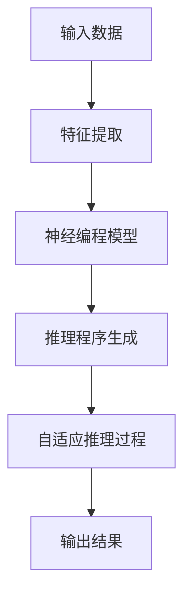

# 自适应推理算法中神经编程的突破性进展

> 关键词：自适应推理算法、神经编程、突破性进展、深度学习、人工智能、计算效率、模型优化

> 摘要：本文聚焦于自适应推理算法中神经编程的突破性进展。首先介绍了研究背景，包括目的、预期读者等内容。接着深入探讨核心概念与联系，呈现其原理和架构。详细阐述了核心算法原理，并用Python代码说明具体操作步骤。通过数学模型和公式进一步剖析其内在逻辑。结合项目实战给出代码案例及详细解释。分析了实际应用场景，推荐了相关工具和资源。最后总结未来发展趋势与挑战，解答常见问题并提供扩展阅读和参考资料，旨在全面展示自适应推理算法中神经编程的前沿成果和发展潜力。

## 1. 背景介绍 
### 1.1 目的和范围
自适应推理算法在当今人工智能领域具有至关重要的地位，它能够根据不同的输入数据和任务需求，动态地调整推理过程，从而提高模型的效率和性能。而神经编程作为一种新兴的技术手段，为自适应推理算法的发展带来了新的思路和方法。本文的目的在于全面探讨自适应推理算法中神经编程的突破性进展，深入分析其核心原理、算法实现以及实际应用场景，为相关领域的研究人员和开发者提供有价值的参考。本文的范围涵盖了神经编程在自适应推理算法中的基本概念、核心算法、数学模型、项目实战、应用场景以及未来发展趋势等多个方面。

### 1.2 预期读者
本文预期读者包括人工智能、机器学习、深度学习等相关领域的研究人员、工程师和开发者。对于正在从事自适应推理算法研究和开发的专业人士，本文将提供最新的技术进展和深入的技术分析；对于对人工智能领域感兴趣的初学者，本文将有助于他们了解自适应推理算法中神经编程的基本概念和应用场景，为进一步学习和研究打下基础。

### 1.3 文档结构概述
本文共分为十个部分。第一部分为背景介绍，阐述了文章的目的、预期读者和文档结构概述。第二部分介绍核心概念与联系，包括神经编程和自适应推理算法的基本概念、原理和架构，并通过文本示意图和Mermaid流程图进行直观展示。第三部分详细讲解核心算法原理，并使用Python源代码说明具体操作步骤。第四部分介绍数学模型和公式，通过详细讲解和举例说明帮助读者理解其内在逻辑。第五部分为项目实战，包括开发环境搭建、源代码详细实现和代码解读。第六部分分析实际应用场景。第七部分推荐相关工具和资源，包括学习资源、开发工具框架和相关论文著作。第八部分总结未来发展趋势与挑战。第九部分为附录，解答常见问题。第十部分提供扩展阅读和参考资料。

### 1.4 术语表
#### 1.4.1 核心术语定义
- **自适应推理算法**：一种能够根据输入数据和任务需求动态调整推理过程的算法，旨在提高模型的效率和性能。
- **神经编程**：将神经网络与编程概念相结合的一种技术，通过神经网络自动生成程序或优化程序的执行过程。
- **深度学习**：一种基于人工神经网络的机器学习方法，通过多层神经网络对数据进行学习和建模。
- **计算图**：一种用于表示计算过程的有向无环图，其中节点表示操作，边表示数据流动。
- **推理**：在训练好的模型上对新数据进行预测或分类的过程。

#### 1.4.2 相关概念解释
- **神经网络**：由大量神经元组成的计算模型，能够自动从数据中学习特征和模式。
- **模型优化**：通过调整模型的参数和结构，提高模型的性能和效率。
- **动态计算**：根据输入数据和任务需求动态调整计算过程的方法。

#### 1.4.3 缩略词列表
- **DNN**：深度神经网络（Deep Neural Network）
- **CNN**：卷积神经网络（Convolutional Neural Network）
- **RNN**：循环神经网络（Recurrent Neural Network）
- **GPU**：图形处理器（Graphics Processing Unit）
- **CPU**：中央处理器（Central Processing Unit）

## 2. 核心概念与联系 
### 2.1 自适应推理算法的基本概念
自适应推理算法的核心思想是根据输入数据的特点和任务需求，动态地调整推理过程。传统的推理算法通常采用固定的计算流程，对于不同的输入数据都进行相同的计算，这可能会导致计算资源的浪费。而自适应推理算法能够根据输入数据的难度、复杂度等因素，选择合适的计算路径和计算资源，从而提高推理效率和性能。

### 2.2 神经编程的基本概念
神经编程是将神经网络与编程概念相结合的一种技术。它通过神经网络自动生成程序或优化程序的执行过程。神经编程的核心在于利用神经网络的学习能力，从数据中学习到程序的结构和参数，从而实现自动化的编程过程。神经编程可以应用于多个领域，如代码生成、算法优化、自动化测试等。

### 2.3 自适应推理算法与神经编程的联系
自适应推理算法和神经编程之间存在着密切的联系。神经编程可以为自适应推理算法提供更灵活的计算策略和优化方法。通过神经编程，自适应推理算法可以根据输入数据和任务需求自动生成合适的推理程序，从而实现动态的计算过程。同时，自适应推理算法也可以为神经编程提供更多的反馈信息，帮助神经编程模型不断优化和改进。

### 2.4 核心概念原理和架构的文本示意图
自适应推理算法中神经编程的核心原理和架构可以用以下文本示意图表示：

输入数据 -> 特征提取 -> 神经编程模型 -> 推理程序生成 -> 自适应推理过程 -> 输出结果

在这个过程中，输入数据首先经过特征提取模块，提取出有用的特征信息。然后，这些特征信息被输入到神经编程模型中，神经编程模型根据这些特征信息生成相应的推理程序。最后，推理程序在自适应推理过程中对输入数据进行处理，得到输出结果。

### 2.5 Mermaid流程图


## 3. 核心算法原理 & 具体操作步骤 
### 3.1 核心算法原理
自适应推理算法中神经编程的核心算法原理主要包括两个方面：一是神经编程模型的训练，二是自适应推理过程的实现。

#### 3.1.1 神经编程模型的训练
神经编程模型的训练通常采用监督学习或强化学习的方法。在监督学习中，我们需要提供大量的输入数据和对应的目标程序，神经编程模型通过学习这些数据对之间的映射关系，来生成合适的程序。在强化学习中，神经编程模型通过与环境进行交互，根据奖励信号来优化自己的行为，从而生成更优的程序。

#### 3.1.2 自适应推理过程的实现
自适应推理过程的实现主要基于生成的推理程序。在推理过程中，根据输入数据的特点和任务需求，选择合适的推理程序进行计算。同时，根据推理结果的反馈信息，动态地调整推理过程，以提高推理效率和性能。

### 3.2 具体操作步骤
以下是自适应推理算法中神经编程的具体操作步骤：

#### 3.2.1 数据准备
收集和整理大量的输入数据和对应的目标程序，将其分为训练集、验证集和测试集。

#### 3.2.2 模型构建
选择合适的神经编程模型架构，如基于循环神经网络（RNN）或变换器（Transformer）的模型。

#### 3.2.3 模型训练
使用训练集对神经编程模型进行训练，根据选择的学习方法（监督学习或强化学习）设置相应的损失函数和优化器。

#### 3.2.4 模型评估
使用验证集和测试集对训练好的神经编程模型进行评估，计算模型的性能指标，如准确率、召回率等。

#### 3.2.5 推理程序生成
使用训练好的神经编程模型，根据输入数据生成相应的推理程序。

#### 3.2.6 自适应推理过程
在推理过程中，根据输入数据的特点和任务需求，选择合适的推理程序进行计算，并根据推理结果的反馈信息动态调整推理过程。

### 3.3 Python源代码详细阐述
以下是一个简单的基于Python和PyTorch的神经编程模型训练和推理的示例代码：

```python
import torch
import torch.nn as nn
import torch.optim as optim

# 定义神经编程模型
class NeuralProgrammingModel(nn.Module):
    def __init__(self, input_size, hidden_size, output_size):
        super(NeuralProgrammingModel, self).__init__()
        self.fc1 = nn.Linear(input_size, hidden_size)
        self.relu = nn.ReLU()
        self.fc2 = nn.Linear(hidden_size, output_size)

    def forward(self, x):
        out = self.fc1(x)
        out = self.relu(out)
        out = self.fc2(out)
        return out

# 数据准备
input_size = 10
hidden_size = 20
output_size = 5
num_samples = 100
x = torch.randn(num_samples, input_size)
y = torch.randn(num_samples, output_size)

# 模型构建
model = NeuralProgrammingModel(input_size, hidden_size, output_size)

# 定义损失函数和优化器
criterion = nn.MSELoss()
optimizer = optim.Adam(model.parameters(), lr=0.001)

# 模型训练
num_epochs = 100
for epoch in range(num_epochs):
    # 前向传播
    outputs = model(x)
    loss = criterion(outputs, y)

    # 反向传播和优化
    optimizer.zero_grad()
    loss.backward()
    optimizer.step()

    if (epoch + 1) % 10 == 0:
        print(f'Epoch [{epoch+1}/{num_epochs}], Loss: {loss.item():.4f}')

# 推理程序生成
test_input = torch.randn(1, input_size)
with torch.no_grad():
    test_output = model(test_input)
    print(f'Test output: {test_output}')
```

在这个示例代码中，我们首先定义了一个简单的神经编程模型，然后准备了一些随机数据。接着，我们使用均方误差损失函数和Adam优化器对模型进行训练。最后，我们使用训练好的模型对一个测试输入进行推理，得到输出结果。

## 4. 数学模型和公式 & 详细讲解 & 举例说明 
### 4.1 神经编程模型的数学模型
神经编程模型可以用一个函数 $f: X \rightarrow Y$ 来表示，其中 $X$ 是输入数据的空间，$Y$ 是输出程序的空间。在训练过程中，我们的目标是找到一个最优的函数 $f^*$，使得对于给定的输入数据 $x \in X$，输出的程序 $y = f^*(x)$ 能够尽可能地接近目标程序 $y_{target}$。

### 4.2 损失函数
在监督学习中，常用的损失函数是均方误差损失函数（MSE）和交叉熵损失函数（CE）。

#### 4.2.1 均方误差损失函数（MSE）
均方误差损失函数的定义如下：

$$
MSE(y, y_{target}) = \frac{1}{n} \sum_{i=1}^{n} (y_i - y_{target_i})^2
$$

其中 $n$ 是样本的数量，$y_i$ 是模型的输出，$y_{target_i}$ 是目标值。

#### 4.2.2 交叉熵损失函数（CE）
交叉熵损失函数的定义如下：

$$
CE(y, y_{target}) = - \sum_{i=1}^{n} y_{target_i} \log(y_i)
$$

其中 $n$ 是样本的数量，$y_i$ 是模型的输出，$y_{target_i}$ 是目标值。

### 4.3 优化算法
在模型训练过程中，我们需要使用优化算法来更新模型的参数，以最小化损失函数。常用的优化算法包括随机梯度下降（SGD）、Adam、Adagrad等。

#### 4.3.1 随机梯度下降（SGD）
随机梯度下降的更新公式如下：

$$
\theta_{t+1} = \theta_t - \alpha \nabla L(\theta_t)
$$

其中 $\theta_t$ 是第 $t$ 次迭代时的模型参数，$\alpha$ 是学习率，$\nabla L(\theta_t)$ 是损失函数 $L$ 关于 $\theta_t$ 的梯度。

#### 4.3.2 Adam
Adam是一种自适应学习率的优化算法，其更新公式如下：

$$
m_{t+1} = \beta_1 m_t + (1 - \beta_1) \nabla L(\theta_t)
$$

$$
v_{t+1} = \beta_2 v_t + (1 - \beta_2) (\nabla L(\theta_t))^2
$$

$$
\hat{m}_{t+1} = \frac{m_{t+1}}{1 - \beta_1^t}
$$

$$
\hat{v}_{t+1} = \frac{v_{t+1}}{1 - \beta_2^t}
$$

$$
\theta_{t+1} = \theta_t - \alpha \frac{\hat{m}_{t+1}}{\sqrt{\hat{v}_{t+1}} + \epsilon}
$$

其中 $m_t$ 和 $v_t$ 分别是梯度的一阶矩估计和二阶矩估计，$\beta_1$ 和 $\beta_2$ 是衰减率，$\epsilon$ 是一个很小的常数。

### 4.4 举例说明
假设我们有一个简单的线性回归问题，输入数据 $x$ 是一个一维向量，目标值 $y_{target}$ 是一个标量。我们可以使用一个简单的线性模型 $y = wx + b$ 来进行拟合，其中 $w$ 和 $b$ 是模型的参数。

损失函数可以选择均方误差损失函数：

$$
L(w, b) = \frac{1}{n} \sum_{i=1}^{n} (wx_i + b - y_{target_i})^2
$$

使用随机梯度下降算法更新参数：

$$
\frac{\partial L}{\partial w} = \frac{2}{n} \sum_{i=1}^{n} (wx_i + b - y_{target_i}) x_i
$$

$$
\frac{\partial L}{\partial b} = \frac{2}{n} \sum_{i=1}^{n} (wx_i + b - y_{target_i})
$$

$$
w_{t+1} = w_t - \alpha \frac{\partial L}{\partial w}
$$

$$
b_{t+1} = b_t - \alpha \frac{\partial L}{\partial b}
$$

通过不断迭代更新参数 $w$ 和 $b$，我们可以找到最优的模型参数，使得损失函数最小化。

## 5. 项目实战：代码实际案例和详细解释说明 
### 5.1 开发环境搭建
#### 5.1.1 安装Python
首先，我们需要安装Python。可以从Python官方网站（https://www.python.org/downloads/） 下载适合自己操作系统的Python版本，并按照安装向导进行安装。

#### 5.1.2 安装深度学习框架
我们选择使用PyTorch作为深度学习框架。可以使用以下命令安装PyTorch：

```bash
pip install torch torchvision
```

#### 5.1.3 安装其他依赖库
根据项目的需求，可能还需要安装其他依赖库，如NumPy、Matplotlib等。可以使用以下命令安装：

```bash
pip install numpy matplotlib
```

### 5.2 源代码详细实现和代码解读
以下是一个基于自适应推理算法中神经编程的项目实战代码示例，该示例实现了一个简单的图像分类任务：

```python
import torch
import torch.nn as nn
import torch.optim as optim
import torchvision
import torchvision.transforms as transforms

# 数据预处理
transform = transforms.Compose(
    [transforms.ToTensor(),
     transforms.Normalize((0.5, 0.5, 0.5), (0.5, 0.5, 0.5))])

# 加载数据集
trainset = torchvision.datasets.CIFAR10(root='./data', train=True,
                                        download=True, transform=transform)
trainloader = torch.utils.data.DataLoader(trainset, batch_size=4,
                                          shuffle=True, num_workers=2)

testset = torchvision.datasets.CIFAR10(root='./data', train=False,
                                       download=True, transform=transform)
testloader = torch.utils.data.DataLoader(testset, batch_size=4,
                                         shuffle=False, num_workers=2)

classes = ('plane', 'car', 'bird', 'cat',
           'deer', 'dog', 'frog', 'horse', 'ship', 'truck')

# 定义神经编程模型
class NeuralProgrammingModel(nn.Module):
    def __init__(self):
        super(NeuralProgrammingModel, self).__init__()
        self.conv1 = nn.Conv2d(3, 6, 5)
        self.pool = nn.MaxPool2d(2, 2)
        self.conv2 = nn.Conv2d(6, 16, 5)
        self.fc1 = nn.Linear(16 * 5 * 5, 120)
        self.fc2 = nn.Linear(120, 84)
        self.fc3 = nn.Linear(84, 10)

    def forward(self, x):
        x = self.pool(torch.relu(self.conv1(x)))
        x = self.pool(torch.relu(self.conv2(x)))
        x = x.view(-1, 16 * 5 * 5)
        x = torch.relu(self.fc1(x))
        x = torch.relu(self.fc2(x))
        x = self.fc3(x)
        return x

# 初始化模型
model = NeuralProgrammingModel()

# 定义损失函数和优化器
criterion = nn.CrossEntropyLoss()
optimizer = optim.SGD(model.parameters(), lr=0.001, momentum=0.9)

# 训练模型
for epoch in range(2):  # 训练2个epoch
    running_loss = 0.0
    for i, data in enumerate(trainloader, 0):
        # 获取输入数据
        inputs, labels = data

        # 梯度清零
        optimizer.zero_grad()

        # 前向传播 + 反向传播 + 优化
        outputs = model(inputs)
        loss = criterion(outputs, labels)
        loss.backward()
        optimizer.step()

        # 打印统计信息
        running_loss += loss.item()
        if i % 2000 == 1999:    # 每2000个小批量打印一次
            print(f'[{epoch + 1}, {i + 1:5d}] loss: {running_loss / 2000:.3f}')
            running_loss = 0.0

print('Finished Training')

# 测试模型
correct = 0
total = 0
with torch.no_grad():
    for data in testloader:
        images, labels = data
        outputs = model(images)
        _, predicted = torch.max(outputs.data, 1)
        total += labels.size(0)
        correct += (predicted == labels).sum().item()

print(f'Accuracy of the network on the 10000 test images: {100 * correct / total}%')
```

### 5.3 代码解读与分析
#### 5.3.1 数据预处理
使用 `transforms.Compose` 函数定义了一系列的数据预处理操作，包括将图像转换为张量和归一化处理。

#### 5.3.2 加载数据集
使用 `torchvision.datasets.CIFAR10` 加载CIFAR-10数据集，并使用 `torch.utils.data.DataLoader` 创建数据加载器，用于批量加载数据。

#### 5.3.3 定义神经编程模型
定义了一个简单的卷积神经网络模型 `NeuralProgrammingModel`，包含两个卷积层和三个全连接层。

#### 5.3.4 初始化模型、损失函数和优化器
初始化神经编程模型，选择交叉熵损失函数和随机梯度下降优化器。

#### 5.3.5 训练模型
使用训练集对模型进行训练，通过前向传播、反向传播和优化步骤更新模型的参数。

#### 5.3.6 测试模型
使用测试集对训练好的模型进行测试，计算模型的准确率。

## 6. 实际应用场景 
### 6.1 图像识别
在图像识别领域，自适应推理算法中神经编程可以根据输入图像的复杂度和任务需求，动态地调整推理过程。例如，对于简单的图像，可以使用轻量级的模型进行快速推理；对于复杂的图像，可以使用更强大的模型进行高精度的识别。这样可以在保证识别准确率的前提下，提高推理效率。

### 6.2 自然语言处理
在自然语言处理领域，神经编程可以用于生成自然语言处理任务的推理程序。例如，在机器翻译任务中，根据输入句子的长度和复杂度，生成合适的翻译模型和推理策略，从而提高翻译的质量和效率。

### 6.3 智能机器人
在智能机器人领域，自适应推理算法中神经编程可以帮助机器人根据不同的环境和任务需求，动态地调整自己的行为和决策过程。例如，在机器人导航任务中，根据地图信息和障碍物情况，生成合适的导航策略，从而实现高效、安全的导航。

### 6.4 医疗诊断
在医疗诊断领域，神经编程可以用于分析医学图像和病历数据，生成诊断报告和治疗建议。通过自适应推理算法，根据患者的病情和检查结果，选择合适的诊断模型和推理方法，从而提高诊断的准确性和效率。

## 7. 工具和资源推荐
### 7.1 学习资源推荐
#### 7.1.1 书籍推荐
- 《深度学习》（Deep Learning），作者：Ian Goodfellow、Yoshua Bengio和Aaron Courville，这本书是深度学习领域的经典教材，系统地介绍了深度学习的基本概念、算法和应用。
- 《Python深度学习》（Deep Learning with Python），作者：Francois Chollet，这本书结合Python和Keras框架，详细介绍了深度学习的实践方法和应用案例。
- 《动手学深度学习》（Dive into Deep Learning），作者： Aston Zhang、Zack C. Lipton、Mu Li和Alexander J. Smola，这本书提供了丰富的代码示例和实践项目，适合初学者学习深度学习。

#### 7.1.2 在线课程
- Coursera上的“深度学习专项课程”（Deep Learning Specialization），由Andrew Ng教授授课，包括神经网络和深度学习、改善深层神经网络、结构化机器学习项目、卷积神经网络、序列模型等多个课程模块。
- edX上的“强化学习基础”（Fundamentals of Reinforcement Learning），由Pieter Abbeel教授授课，系统地介绍了强化学习的基本概念、算法和应用。
- 哔哩哔哩（Bilibili）上的“吴恩达深度学习视频合集”，包含了吴恩达教授的深度学习课程视频，适合初学者学习。

#### 7.1.3 技术博客和网站
- Medium上的Towards Data Science，这是一个专注于数据科学和机器学习的技术博客平台，提供了大量的优质文章和教程。
- arXiv.org，这是一个开放获取的预印本平台，提供了大量的学术论文和研究成果，适合关注最新的技术进展。
- 机器之心（https://www.alldatasheet.com/），这是一个专注于人工智能领域的媒体平台，提供了丰富的行业资讯、技术文章和案例分析。

### 7.2 开发工具框架推荐
#### 7.2.1 IDE和编辑器
- PyCharm，这是一款专门为Python开发设计的集成开发环境（IDE），提供了丰富的代码编辑、调试和项目管理功能。
- Visual Studio Code，这是一款轻量级的代码编辑器，支持多种编程语言和插件扩展，适合快速开发和调试。
- Jupyter Notebook，这是一个交互式的开发环境，适合进行数据探索、模型训练和可视化展示。

#### 7.2.2 调试和性能分析工具
- TensorBoard，这是TensorFlow提供的一个可视化工具，用于监控模型的训练过程、分析模型的性能和可视化模型的结构。
- PyTorch Profiler，这是PyTorch提供的一个性能分析工具，用于分析模型的计算时间、内存使用情况和GPU利用率。
- cProfile，这是Python内置的一个性能分析工具，用于分析Python代码的执行时间和函数调用关系。

#### 7.2.3 相关框架和库
- PyTorch，这是一个开源的深度学习框架，提供了丰富的神经网络层和优化算法，支持GPU加速计算。
- TensorFlow，这是一个广泛使用的深度学习框架，提供了高级的模型构建和训练接口，支持分布式计算。
- Scikit-learn，这是一个用于机器学习的Python库，提供了丰富的机器学习算法和工具，适合进行数据预处理、模型选择和评估。

### 7.3 相关论文著作推荐
#### 7.3.1 经典论文
- “Attention Is All You Need”，作者：Ashish Vaswani等人，这篇论文提出了Transformer模型，为自然语言处理领域带来了革命性的变化。
- “Deep Residual Learning for Image Recognition”，作者：Kaiming He等人，这篇论文提出了残差网络（ResNet），解决了深度神经网络训练过程中的梯度消失和梯度爆炸问题。
- “Generative Adversarial Nets”，作者：Ian J. Goodfellow等人，这篇论文提出了生成对抗网络（GAN），开创了生成式模型的新纪元。

#### 7.3.2 最新研究成果
- 关注arXiv.org上关于自适应推理算法和神经编程的最新研究论文，了解该领域的最新技术进展。
- 参加国际顶级的人工智能学术会议，如NeurIPS、ICML、CVPR等，获取最新的研究成果和学术动态。

#### 7.3.3 应用案例分析
- 阅读相关的技术博客和行业报告，了解自适应推理算法和神经编程在实际应用中的案例和经验分享。
- 研究开源项目和实际产品，学习如何将自适应推理算法和神经编程应用到实际项目中。

## 8. 总结：未来发展趋势与挑战
### 8.1 未来发展趋势
#### 8.1.1 模型的轻量化和高效化
未来，自适应推理算法中神经编程将更加注重模型的轻量化和高效化。通过优化模型结构和算法，减少模型的参数数量和计算复杂度，提高模型的推理效率和性能。

#### 8.1.2 多模态融合
随着人工智能技术的发展，多模态数据的处理将变得越来越重要。自适应推理算法中神经编程将结合图像、语音、文本等多种模态的数据，实现更加智能和全面的推理过程。

#### 8.1.3 强化学习与神经编程的结合
强化学习可以为神经编程提供更强大的优化能力和决策能力。未来，强化学习与神经编程的结合将成为一个重要的研究方向，用于解决更加复杂和动态的问题。

#### 8.1.4 跨领域应用
自适应推理算法中神经编程将在更多的领域得到应用，如金融、交通、能源等。通过将神经编程技术与不同领域的知识和需求相结合，实现更加智能化和个性化的应用。

### 8.2 挑战
#### 8.2.1 计算资源的限制
自适应推理算法中神经编程通常需要大量的计算资源，特别是在处理大规模数据和复杂任务时。如何在有限的计算资源下实现高效的推理过程，是一个亟待解决的问题。

#### 8.2.2 数据的质量和隐私
神经编程模型的性能和效果很大程度上依赖于数据的质量和数量。如何获取高质量、标注准确的数据，以及如何保护数据的隐私和安全，是神经编程面临的重要挑战。

#### 8.2.3 模型的可解释性
深度学习模型通常是黑盒模型，其决策过程和推理机制难以解释。在一些对安全性和可靠性要求较高的应用场景中，模型的可解释性是一个关键问题。如何提高自适应推理算法中神经编程模型的可解释性，是未来研究的重点之一。

#### 8.2.4 算法的稳定性和鲁棒性
在实际应用中，自适应推理算法中神经编程模型可能会面临各种噪声和干扰。如何提高算法的稳定性和鲁棒性，确保模型在不同环境下都能正常工作，是一个需要解决的挑战。

## 9. 附录：常见问题与解答
### 9.1 什么是自适应推理算法？
自适应推理算法是一种能够根据输入数据和任务需求动态调整推理过程的算法，旨在提高模型的效率和性能。

### 9.2 什么是神经编程？
神经编程是将神经网络与编程概念相结合的一种技术，通过神经网络自动生成程序或优化程序的执行过程。

### 9.3 自适应推理算法和神经编程有什么联系？
神经编程可以为自适应推理算法提供更灵活的计算策略和优化方法。通过神经编程，自适应推理算法可以根据输入数据和任务需求自动生成合适的推理程序，从而实现动态的计算过程。

### 9.4 如何训练神经编程模型？
神经编程模型的训练通常采用监督学习或强化学习的方法。在监督学习中，需要提供大量的输入数据和对应的目标程序，神经编程模型通过学习这些数据对之间的映射关系，来生成合适的程序。在强化学习中，神经编程模型通过与环境进行交互，根据奖励信号来优化自己的行为，从而生成更优的程序。

### 9.5 自适应推理算法中神经编程有哪些应用场景？
自适应推理算法中神经编程的应用场景包括图像识别、自然语言处理、智能机器人、医疗诊断等领域。

## 10. 扩展阅读 & 参考资料
### 10.1 扩展阅读
- 《人工智能：一种现代的方法》（Artificial Intelligence: A Modern Approach），作者：Stuart Russell和Peter Norvig，这本书是人工智能领域的经典教材，系统地介绍了人工智能的基本概念、算法和应用。
- 《深度学习实战》（Deep Learning in Practice），作者：Antoine Bordes等人，这本书结合实际案例，详细介绍了深度学习的实践方法和应用技巧。

### 10.2 参考资料
- Goodfellow, I., Bengio, Y., & Courville, A. (2016). Deep Learning. MIT Press.
- Chollet, F. (2018). Deep Learning with Python. Manning Publications.
- Zhang, A., Lipton, Z. C., Li, M., & Smola, A. J. (2020). Dive into Deep Learning. https://d2l.ai/
- Vaswani, A., Shazeer, N., Parmar, N., Uszkoreit, J., Jones, L., Gomez, A. N., ... & Polosukhin, I. (2017). Attention is all you need. Advances in neural information processing systems, 5998-6008.
- He, K., Zhang, X., Ren, S., & Sun, J. (2016). Deep residual learning for image recognition. In Proceedings of the IEEE conference on computer vision and pattern recognition (pp. 770-778).
- Goodfellow, I. J., Pouget-Abadie, J., Mirza, M., Xu, B., Warde-Farley, D., Ozair, S., ... & Bengio, Y. (2014). Generative adversarial nets. Advances in neural information processing systems, 2672-2680.