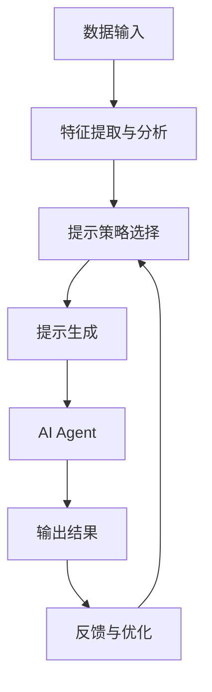

# 自适应提示工程：动态优化AI Agent输入

> 关键词：自适应提示工程、AI Agent、动态优化、输入调整、语言模型、提示策略、性能提升

> 摘要：本文围绕自适应提示工程展开，旨在深入探讨如何动态优化AI Agent的输入。首先介绍了自适应提示工程的背景，包括其目的、预期读者和文档结构等。接着阐述了核心概念与联系，通过文本示意图和Mermaid流程图清晰呈现其原理和架构。详细讲解了核心算法原理，并使用Python源代码进行具体操作步骤的说明。深入分析了数学模型和公式，通过举例加深理解。通过项目实战展示了代码实际案例及详细解释。探讨了实际应用场景，推荐了相关工具和资源，包括学习资源、开发工具框架和论文著作等。最后总结了未来发展趋势与挑战，提供常见问题解答和扩展阅读参考资料，为读者全面理解和应用自适应提示工程提供了系统而深入的知识体系。

## 1. 背景介绍 
### 1.1 目的和范围
自适应提示工程的主要目的是提高AI Agent在各种任务中的性能和适应性。传统的提示工程往往采用固定的提示策略，然而不同的任务场景、数据集特点以及用户需求都可能存在差异，固定提示难以在所有情况下都达到最优效果。自适应提示工程旨在根据不同的动态因素，如任务的难度、输入数据的特征、用户反馈等，实时调整AI Agent的输入提示，从而使AI Agent能够更好地理解任务要求，输出更准确、更符合预期的结果。

其范围涵盖了自然语言处理、计算机视觉、强化学习等多个领域的AI Agent应用。无论是聊天机器人、图像识别系统还是智能决策代理，都可以通过自适应提示工程来优化其输入，提升整体性能。

### 1.2 预期读者
本文预期读者包括对人工智能、机器学习、自然语言处理等领域感兴趣的研究人员、开发者和学生。对于正在从事AI Agent开发和优化的工程师，本文提供的自适应提示工程方法和技术可以帮助他们提升AI Agent的性能；对于研究人员，可作为深入研究自适应提示策略的参考；对于学生，有助于他们了解前沿的AI技术和工程实践。

### 1.3 文档结构概述
本文将按照以下结构展开：首先介绍自适应提示工程的背景知识，包括目的、读者对象和文档结构等；接着阐述核心概念与联系，通过文本示意图和Mermaid流程图展示其原理和架构；然后详细讲解核心算法原理，并给出Python源代码示例；再深入分析数学模型和公式，并举例说明；通过项目实战展示代码实现和详细解释；探讨实际应用场景；推荐相关的工具和资源；最后总结未来发展趋势与挑战，提供常见问题解答和扩展阅读参考资料。

### 1.4 术语表
#### 1.4.1 核心术语定义
- **自适应提示工程**：根据不同的动态因素，实时调整AI Agent输入提示的技术和方法，以提高AI Agent的性能和适应性。
- **AI Agent**：能够感知环境、做出决策并执行行动的人工智能实体，可以是聊天机器人、智能助手、自主系统等。
- **提示**：向AI Agent提供的输入信息，用于引导其生成相应的输出结果，通常以文本、图像等形式呈现。
- **动态优化**：在运行过程中，根据实时变化的因素对系统进行调整和优化，以达到更好的性能。

#### 1.4.2 相关概念解释
- **语言模型**：一种基于机器学习的模型，用于处理和生成自然语言。在自适应提示工程中，语言模型是AI Agent的核心组件之一，根据输入提示生成相应的语言输出。
- **强化学习**：一种通过智能体与环境进行交互，根据环境反馈的奖励信号来学习最优策略的机器学习方法。在自适应提示工程中，强化学习可以用于动态调整提示策略，以获得更高的奖励。
- **特征工程**：从原始数据中提取和选择有用特征的过程。在自适应提示工程中，特征工程可以用于分析输入数据的特点，为动态调整提示提供依据。

#### 1.4.3 缩略词列表
- **NLP**：Natural Language Processing，自然语言处理
- **CV**：Computer Vision，计算机视觉
- **RL**：Reinforcement Learning，强化学习
- **LLM**：Large Language Model，大语言模型

## 2. 核心概念与联系 
### 核心概念原理
自适应提示工程的核心原理是通过对任务、数据和用户反馈等动态因素的实时分析，调整输入到AI Agent的提示信息，从而优化AI Agent的输出结果。其基本流程包括：首先，对输入的数据进行特征提取和分析，了解数据的特点和任务需求；然后，根据分析结果选择合适的提示策略，生成相应的提示信息；最后，将提示信息输入到AI Agent中，获取输出结果，并根据输出结果和用户反馈对提示策略进行调整和优化。

### 架构的文本示意图
自适应提示工程的架构主要包括以下几个部分：
1. **数据输入模块**：负责接收原始数据，如文本、图像等，并将其传递给后续模块进行处理。
2. **特征提取与分析模块**：对输入的数据进行特征提取和分析，提取有用的信息，如文本的语义特征、图像的视觉特征等。
3. **提示策略选择模块**：根据特征提取与分析模块的结果，选择合适的提示策略，如固定提示、动态提示、基于强化学习的提示等。
4. **提示生成模块**：根据选择的提示策略，生成相应的提示信息。
5. **AI Agent模块**：接收提示信息，进行推理和决策，生成输出结果。
6. **反馈与优化模块**：根据AI Agent的输出结果和用户反馈，对提示策略进行调整和优化，以提高AI Agent的性能。

### Mermaid流程图


## 3. 核心算法原理 & 具体操作步骤 
### 核心算法原理
自适应提示工程的核心算法可以基于多种技术实现，如基于规则的方法、基于机器学习的方法和基于强化学习的方法等。这里我们以基于强化学习的方法为例进行讲解。

基于强化学习的自适应提示工程的基本思想是将提示策略的选择看作一个决策过程，通过智能体与环境的交互，根据环境反馈的奖励信号来学习最优的提示策略。具体来说，智能体在每个时间步根据当前的状态（如输入数据的特征、历史提示信息等）选择一个提示策略，然后将生成的提示信息输入到AI Agent中，获取输出结果。环境根据输出结果和用户反馈给出一个奖励信号，智能体根据奖励信号更新自己的策略，以提高未来获得更高奖励的概率。

### 具体操作步骤及Python源代码
以下是一个基于Python和OpenAI Gym库的简单示例，演示了如何使用强化学习来实现自适应提示工程。

```python
import gym
import numpy as np

# 定义一个简单的环境类
class AdaptivePromptEnv(gym.Env):
    def __init__(self):
        # 定义动作空间和状态空间
        self.action_space = gym.spaces.Discrete(3)  # 假设有3种提示策略
        self.observation_space = gym.spaces.Box(low=0, high=1, shape=(5,), dtype=np.float32)  # 假设有5个特征
        self.state = np.random.rand(5)  # 初始化状态

    def step(self, action):
        # 执行动作，根据动作生成提示信息并输入到AI Agent中，获取输出结果
        # 这里简单模拟输出结果和奖励信号
        if action == 0:
            reward = np.sum(self.state)
        elif action == 1:
            reward = np.prod(self.state)
        else:
            reward = np.max(self.state)

        # 更新状态
        self.state = np.random.rand(5)

        done = False  # 假设任务不会结束
        info = {}

        return self.state, reward, done, info

    def reset(self):
        # 重置环境状态
        self.state = np.random.rand(5)
        return self.state

# 定义一个简单的策略网络（这里使用随机策略作为示例）
def random_policy(env):
    return env.action_space.sample()

# 训练过程
env = AdaptivePromptEnv()
num_episodes = 100
total_rewards = []

for episode in range(num_episodes):
    state = env.reset()
    episode_reward = 0
    done = False

    while not done:
        action = random_policy(env)
        next_state, reward, done, info = env.step(action)
        episode_reward += reward
        state = next_state

    total_rewards.append(episode_reward)
    print(f"Episode {episode}: Reward = {episode_reward}")

# 输出平均奖励
average_reward = np.mean(total_rewards)
print(f"Average Reward: {average_reward}")
```

### 代码解释
1. **环境类 `AdaptivePromptEnv`**：定义了自适应提示工程的环境，包括动作空间、状态空间、`step` 方法和 `reset` 方法。`step` 方法根据选择的动作生成提示信息，模拟AI Agent的输出结果并给出奖励信号；`reset` 方法用于重置环境状态。
2. **策略网络 `random_policy`**：这里使用随机策略作为示例，实际应用中可以使用更复杂的策略网络，如深度神经网络。
3. **训练过程**：通过循环执行多个回合的训练，每个回合中智能体根据策略选择动作，与环境进行交互，获取奖励信号，直到任务结束。最后输出平均奖励。

## 4. 数学模型和公式 & 详细讲解 & 举例说明 
### 数学模型
基于强化学习的自适应提示工程可以用马尔可夫决策过程（MDP）来建模。一个MDP可以用一个五元组 $(S, A, P, R, \gamma)$ 表示，其中：
- $S$ 是状态空间，表示环境的所有可能状态。在自适应提示工程中，状态可以包括输入数据的特征、历史提示信息等。
- $A$ 是动作空间，表示智能体可以采取的所有可能动作。在自适应提示工程中，动作可以表示不同的提示策略。
- $P(s'|s, a)$ 是状态转移概率，表示在状态 $s$ 下采取动作 $a$ 后转移到状态 $s'$ 的概率。
- $R(s, a, s')$ 是奖励函数，表示在状态 $s$ 下采取动作 $a$ 后转移到状态 $s'$ 所获得的奖励。
- $\gamma \in [0, 1]$ 是折扣因子，用于平衡当前奖励和未来奖励的重要性。

### 公式
智能体的目标是学习一个最优策略 $\pi^*: S \to A$，使得长期累积折扣奖励最大化。长期累积折扣奖励可以表示为：
$$G_t = \sum_{k=0}^{\infty} \gamma^k R_{t+k+1}$$
其中 $R_{t+k+1}$ 是在时间步 $t + k + 1$ 获得的奖励。

策略 $\pi$ 的价值函数 $V^{\pi}(s)$ 表示在状态 $s$ 下遵循策略 $\pi$ 所能获得的长期累积折扣奖励的期望：
$$V^{\pi}(s) = \mathbb{E}_{\pi} [G_t | S_t = s]$$
动作价值函数 $Q^{\pi}(s, a)$ 表示在状态 $s$ 下采取动作 $a$ 并遵循策略 $\pi$ 所能获得的长期累积折扣奖励的期望：
$$Q^{\pi}(s, a) = \mathbb{E}_{\pi} [G_t | S_t = s, A_t = a]$$

最优价值函数 $V^*(s)$ 和最优动作价值函数 $Q^*(s, a)$ 分别表示在所有可能策略中能获得的最大长期累积折扣奖励的期望：
$$V^*(s) = \max_{\pi} V^{\pi}(s)$$
$$Q^*(s, a) = \max_{\pi} Q^{\pi}(s, a)$$

### 详细讲解
价值函数和动作价值函数是强化学习中的重要概念，用于评估策略的好坏。通过不断更新价值函数和动作价值函数，智能体可以学习到最优策略。常用的算法如Q学习、深度Q网络（DQN）等都是基于动作价值函数的优化来实现的。

### 举例说明
假设我们有一个简单的自适应提示工程任务，状态空间 $S = \{s_1, s_2\}$，动作空间 $A = \{a_1, a_2\}$，状态转移概率 $P(s_1|s_1, a_1) = 0.8$，$P(s_2|s_1, a_1) = 0.2$，$P(s_1|s_1, a_2) = 0.3$，$P(s_2|s_1, a_2) = 0.7$ 等，奖励函数 $R(s_1, a_1, s_1) = 1$，$R(s_1, a_1, s_2) = -1$ 等。折扣因子 $\gamma = 0.9$。

我们可以使用Q学习算法来学习最优策略。Q学习算法的更新公式为：
$$Q(S_t, A_t) \leftarrow Q(S_t, A_t) + \alpha [R_{t+1} + \gamma \max_{a} Q(S_{t+1}, a) - Q(S_t, A_t)]$$
其中 $\alpha$ 是学习率。

通过不断迭代更新Q值，智能体可以逐渐找到最优策略。

## 5. 项目实战：代码实际案例和详细解释说明 
### 5.1  开发环境搭建
1. **安装Python**：确保你的系统中安装了Python 3.6或更高版本。可以从Python官方网站（https://www.python.org/downloads/） 下载并安装。
2. **安装必要的库**：使用以下命令安装必要的库：
```sh
pip install gym numpy
```
如果你使用的是基于深度强化学习的方法，还需要安装深度学习框架，如PyTorch或TensorFlow。例如，安装PyTorch：
```sh
pip install torch torchvision
```

### 5.2  源代码详细实现和代码解读
以下是一个更完整的基于深度Q网络（DQN）的自适应提示工程示例代码：

```python
import gym
import numpy as np
import torch
import torch.nn as nn
import torch.optim as optim

# 定义DQN网络
class DQN(nn.Module):
    def __init__(self, input_dim, output_dim):
        super(DQN, self).__init__()
        self.fc1 = nn.Linear(input_dim, 64)
        self.fc2 = nn.Linear(64, 64)
        self.fc3 = nn.Linear(64, output_dim)

    def forward(self, x):
        x = torch.relu(self.fc1(x))
        x = torch.relu(self.fc2(x))
        return self.fc3(x)

# 定义自适应提示工程环境
class AdaptivePromptEnv(gym.Env):
    def __init__(self):
        self.action_space = gym.spaces.Discrete(3)
        self.observation_space = gym.spaces.Box(low=0, high=1, shape=(5,), dtype=np.float32)
        self.state = np.random.rand(5)

    def step(self, action):
        if action == 0:
            reward = np.sum(self.state)
        elif action == 1:
            reward = np.prod(self.state)
        else:
            reward = np.max(self.state)

        self.state = np.random.rand(5)
        done = False
        info = {}

        return self.state, reward, done, info

    def reset(self):
        self.state = np.random.rand(5)
        return self.state

# 训练DQN
def train_dqn(env, num_episodes=1000, gamma=0.99, epsilon=0.1, lr=0.001):
    input_dim = env.observation_space.shape[0]
    output_dim = env.action_space.n

    dqn = DQN(input_dim, output_dim)
    optimizer = optim.Adam(dqn.parameters(), lr=lr)
    criterion = nn.MSELoss()

    total_rewards = []

    for episode in range(num_episodes):
        state = env.reset()
        state = torch.FloatTensor(state).unsqueeze(0)
        episode_reward = 0
        done = False

        while not done:
            if np.random.rand() < epsilon:
                action = env.action_space.sample()
            else:
                q_values = dqn(state)
                action = torch.argmax(q_values).item()

            next_state, reward, done, info = env.step(action)
            next_state = torch.FloatTensor(next_state).unsqueeze(0)
            episode_reward += reward

            target_q = reward
            if not done:
                next_q_values = dqn(next_state)
                max_next_q = torch.max(next_q_values).item()
                target_q += gamma * max_next_q

            q_values = dqn(state)
            current_q = q_values[0][action]

            loss = criterion(current_q.unsqueeze(0), torch.FloatTensor([target_q]))
            optimizer.zero_grad()
            loss.backward()
            optimizer.step()

            state = next_state

        total_rewards.append(episode_reward)
        if episode % 100 == 0:
            print(f"Episode {episode}: Reward = {episode_reward}")

    return total_rewards

# 主函数
if __name__ == "__main__":
    env = AdaptivePromptEnv()
    total_rewards = train_dqn(env)
    average_reward = np.mean(total_rewards)
    print(f"Average Reward: {average_reward}")
```

### 5.3  代码解读与分析
1. **DQN网络 `DQN`**：定义了一个简单的三层全连接神经网络，用于近似动作价值函数。输入维度为状态空间的维度，输出维度为动作空间的维度。
2. **自适应提示工程环境 `AdaptivePromptEnv`**：与前面的示例类似，定义了环境的动作空间、状态空间、`step` 方法和 `reset` 方法。
3. **训练函数 `train_dqn`**：实现了DQN的训练过程。在每个回合中，智能体根据当前状态选择动作，与环境进行交互，获取奖励信号。然后根据DQN的更新公式更新网络参数，以提高动作价值函数的估计准确性。
4. **主函数**：创建环境，调用训练函数进行训练，并输出平均奖励。

通过这个示例，我们可以看到如何使用深度强化学习来实现自适应提示工程，动态优化AI Agent的输入提示。

## 6. 实际应用场景 
### 自然语言处理领域
- **聊天机器人**：自适应提示工程可以根据用户的输入、对话历史和用户的情感状态等动态因素，调整提示信息，使聊天机器人的回复更加自然、准确和个性化。例如，当用户情绪低落时，提示聊天机器人使用更温暖、安慰的语言进行回复。
- **文本生成**：在文本生成任务中，如文章写作、故事创作等，自适应提示工程可以根据生成的文本内容和用户的需求，动态调整提示信息，引导生成更符合要求的文本。例如，在生成新闻报道时，根据新闻的主题和风格，调整提示信息，使生成的报道更具专业性和可读性。

### 计算机视觉领域
- **图像识别**：在图像识别任务中，自适应提示工程可以根据图像的特征、识别的难度和用户的反馈等因素，调整输入到图像识别模型的提示信息，提高识别的准确率。例如，当图像模糊或存在噪声时，提示模型使用更鲁棒的特征提取方法。
- **图像生成**：在图像生成任务中，如艺术创作、动漫设计等，自适应提示工程可以根据用户的需求和生成的图像效果，动态调整提示信息，生成更符合用户期望的图像。例如，根据用户输入的主题和风格，提示生成器生成相应风格的图像。

### 强化学习领域
- **智能决策代理**：在智能决策代理中，如自动驾驶、机器人控制等，自适应提示工程可以根据环境的变化、任务的要求和代理的性能等因素，调整输入到决策模型的提示信息，使代理能够做出更合理、更安全的决策。例如，在自动驾驶中，根据路况和交通信号，提示自动驾驶系统采取相应的驾驶策略。

## 7. 工具和资源推荐
### 7.1 学习资源推荐
#### 7.1.1 书籍推荐
- 《强化学习：原理与Python实现》：全面介绍了强化学习的基本原理、算法和应用，通过Python代码示例帮助读者理解和实现强化学习算法。
- 《自然语言处理入门》：系统地介绍了自然语言处理的基本概念、技术和方法，适合初学者入门。
- 《深度学习》：深度学习领域的经典著作，详细介绍了深度学习的理论和实践，对理解基于深度学习的自适应提示工程有很大帮助。

#### 7.1.2 在线课程
- Coursera上的“强化学习专项课程”：由知名学者授课，内容涵盖了强化学习的各个方面，包括马尔可夫决策过程、Q学习、深度Q网络等。
- edX上的“自然语言处理基础”：介绍了自然语言处理的基本技术和算法，通过实践项目帮助学生掌握自然语言处理的应用。
- 吴恩达的“深度学习专项课程”：深入讲解了深度学习的原理和应用，对理解和应用深度学习模型在自适应提示工程中的作用有很大帮助。

#### 7.1.3 技术博客和网站
- Medium：有很多关于人工智能、机器学习和自然语言处理的技术博客，其中不乏关于自适应提示工程的最新研究和实践经验分享。
- arXiv：提供了大量的学术论文，包括自适应提示工程领域的最新研究成果。
- Hugging Face：专注于自然语言处理和深度学习，提供了丰富的预训练模型、工具和教程，对自适应提示工程的研究和实践有很大的帮助。

### 7.2 开发工具框架推荐
#### 7.2.1 IDE和编辑器
- PyCharm：一款专业的Python集成开发环境，提供了丰富的代码编辑、调试和分析功能，适合Python开发。
- Visual Studio Code：一款轻量级的代码编辑器，支持多种编程语言，通过安装插件可以方便地进行Python开发。
- Jupyter Notebook：一种交互式的开发环境，适合进行数据探索、模型训练和实验验证，方便展示代码和结果。

#### 7.2.2 调试和性能分析工具
- TensorBoard：TensorFlow提供的可视化工具，可以帮助用户可视化模型的训练过程、性能指标和网络结构等。
- PyTorch Profiler：PyTorch提供的性能分析工具，可以帮助用户分析模型的性能瓶颈，优化代码性能。
- cProfile：Python自带的性能分析工具，可以帮助用户分析Python代码的性能，找出性能瓶颈。

#### 7.2.3 相关框架和库
- Gym：OpenAI开发的强化学习环境库，提供了丰富的环境和工具，方便用户进行强化学习算法的开发和测试。
- PyTorch：一个开源的深度学习框架，提供了丰富的神经网络模块和优化算法，适合进行深度学习模型的开发和训练。
- Hugging Face Transformers：一个用于自然语言处理的开源库，提供了大量的预训练语言模型和工具，方便用户进行自然语言处理任务的开发。

### 7.3 相关论文著作推荐
#### 7.3.1 经典论文
- “Human-level control through deep reinforcement learning”：介绍了深度Q网络（DQN）算法，开启了深度强化学习的新时代。
- “Attention Is All You Need”：提出了Transformer架构，在自然语言处理领域取得了巨大的成功。
- “BERT: Pre-training of Deep Bidirectional Transformers for Language Understanding”：介绍了BERT模型，在自然语言处理任务中取得了优异的性能。

#### 7.3.2 最新研究成果
- 关注arXiv等学术平台上关于自适应提示工程、强化学习和自然语言处理的最新研究论文，了解该领域的最新发展动态。

#### 7.3.3 应用案例分析
- 一些知名的科技公司和研究机构会发布关于自适应提示工程在实际应用中的案例分析，如Google、OpenAI等。通过学习这些案例，可以了解自适应提示工程在实际应用中的挑战和解决方案。

## 8. 总结：未来发展趋势与挑战
### 未来发展趋势
- **多模态融合**：未来的自适应提示工程将不仅仅局限于文本提示，还将融合图像、语音等多模态信息，实现更全面、更智能的提示策略。例如，在智能助手应用中，结合用户的语音指令、面部表情和环境图像等多模态信息，动态调整提示信息，提供更个性化的服务。
- **与领域知识的深度融合**：自适应提示工程将与不同领域的专业知识进行深度融合，提高AI Agent在特定领域的性能和应用效果。例如，在医疗领域，结合医学知识和临床经验，为医生提供更准确、更有用的诊断提示和治疗建议。
- **自动化提示工程**：随着技术的发展，自适应提示工程将逐渐实现自动化，减少人工干预。通过自动化的特征提取、策略选择和提示生成等过程，提高自适应提示工程的效率和准确性。

### 挑战
- **数据隐私和安全**：自适应提示工程需要大量的数据来训练和优化模型，这些数据可能包含用户的隐私信息。因此，如何保护数据的隐私和安全是一个重要的挑战。
- **可解释性和透明度**：由于自适应提示工程通常使用复杂的机器学习和深度学习模型，模型的决策过程往往难以解释。如何提高模型的可解释性和透明度，让用户理解模型的决策依据，是一个亟待解决的问题。
- **性能和效率**：在实际应用中，自适应提示工程需要在短时间内生成有效的提示信息，以满足用户的实时需求。因此，如何提高模型的性能和效率，降低计算成本，是一个重要的挑战。

## 9. 附录：常见问题与解答
### 问题1：自适应提示工程与传统提示工程有什么区别？
答：传统提示工程通常采用固定的提示策略，在不同的任务场景和数据条件下难以达到最优效果。而自适应提示工程根据动态因素，如任务难度、输入数据特征和用户反馈等，实时调整提示信息，使AI Agent能够更好地适应不同的情况，提高性能和适应性。

### 问题2：如何选择合适的提示策略？
答：选择合适的提示策略需要考虑多个因素，如任务类型、数据特点、用户需求等。可以通过实验和评估不同的提示策略，选择在特定任务和数据集上表现最优的策略。此外，还可以使用强化学习等方法，让智能体自动学习最优的提示策略。

### 问题3：自适应提示工程在实际应用中需要注意哪些问题？
答：在实际应用中，需要注意数据隐私和安全问题，确保用户数据不被泄露。同时，要关注模型的可解释性和透明度，让用户理解模型的决策依据。另外，还需要优化模型的性能和效率，以满足实时应用的需求。

### 问题4：如何评估自适应提示工程的效果？
答：可以使用多种指标来评估自适应提示工程的效果，如准确率、召回率、F1值等。对于自然语言处理任务，还可以使用语言模型的困惑度、BLEU分数等指标。此外，还可以通过用户反馈和人工评估等方式来综合评估自适应提示工程的效果。

## 10. 扩展阅读 & 参考资料
### 扩展阅读
- 《AI未来进行式》：探讨了人工智能的未来发展趋势和应用前景，对理解自适应提示工程在未来AI发展中的作用有一定的启发。
- 《智能时代》：介绍了智能时代的技术变革和社会影响，让读者了解自适应提示工程在智能时代的重要性。

### 参考资料
- OpenAI官方文档：https://openai.com/
- Gym官方文档：https://gym.openai.com/
- PyTorch官方文档：https://pytorch.org/
- Hugging Face官方文档：https://huggingface.co/