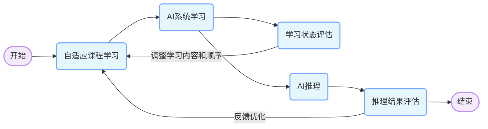

# 自适应课程学习优化AI推理的知识获取效率

> 关键词：自适应课程学习、AI推理、知识获取效率、机器学习、优化算法、课程策略、智能教育

> 摘要：本文围绕自适应课程学习优化AI推理的知识获取效率展开深入探讨。首先介绍了相关背景，包括目的范围、预期读者等内容。接着阐述了自适应课程学习和AI推理的核心概念及联系，通过文本示意图和Mermaid流程图进行清晰展示。详细讲解了核心算法原理，结合Python代码进行说明，并给出了相应的数学模型和公式。在项目实战部分，通过实际案例展示了开发环境搭建、源代码实现及解读分析。探讨了该技术的实际应用场景，推荐了相关的工具和资源，最后总结了未来发展趋势与挑战，提供了常见问题解答和扩展阅读参考资料，旨在全面深入地研究如何利用自适应课程学习提升AI推理的知识获取效率。

## 1. 背景介绍 
### 1.1 目的和范围
在当今人工智能快速发展的时代，AI推理在各个领域都发挥着至关重要的作用。然而，AI系统在知识获取过程中往往面临效率低下的问题，例如在学习复杂任务时，传统的学习方法可能导致学习时间过长、资源浪费等。自适应课程学习作为一种新兴的学习策略，旨在根据AI系统的当前状态和能力，动态地调整学习内容和顺序，从而提高知识获取的效率。

本文的范围主要聚焦于自适应课程学习如何优化AI推理的知识获取效率。我们将研究自适应课程学习的原理、算法，以及如何将其应用于实际的AI推理任务中。同时，通过实际案例和实验分析，验证自适应课程学习在提高知识获取效率方面的有效性。

### 1.2 预期读者
本文预期读者包括人工智能领域的研究人员、开发者、学生以及对AI技术感兴趣的专业人士。对于研究人员来说，本文可以提供关于自适应课程学习和AI推理的最新研究进展和思路；对于开发者而言，能获取实际的算法实现和项目实战经验；对于学生，有助于加深对相关概念和技术的理解；对于对AI技术感兴趣的专业人士，可以作为了解该领域前沿知识的参考资料。

### 1.3 文档结构概述
本文将按照以下结构进行阐述：首先介绍背景知识，包括目的范围、预期读者等；接着深入探讨自适应课程学习和AI推理的核心概念及联系，通过示意图和流程图进行清晰展示；详细讲解核心算法原理，并结合Python代码进行说明；给出相应的数学模型和公式，并进行详细讲解和举例；在项目实战部分，通过实际案例展示开发环境搭建、源代码实现及解读分析；探讨该技术的实际应用场景；推荐相关的工具和资源；最后总结未来发展趋势与挑战，提供常见问题解答和扩展阅读参考资料。

### 1.4 术语表
#### 1.4.1 核心术语定义
- **自适应课程学习（Adaptive Curriculum Learning）**：一种学习策略，根据学习者（如AI系统）的当前状态和能力，动态地选择和安排学习内容和顺序，以提高学习效率。
- **AI推理（AI Inference）**：指AI系统根据已学习的知识和模型，对新的输入数据进行分析和预测的过程。
- **知识获取效率（Knowledge Acquisition Efficiency）**：衡量AI系统在学习过程中获取知识的速度和质量的指标。

#### 1.4.2 相关概念解释
- **课程策略（Curriculum Strategy）**：在自适应课程学习中，用于确定学习内容和顺序的规则和方法。
- **学习状态（Learning State）**：描述AI系统在学习过程中的当前能力和知识水平的一组特征。

#### 1.4.3 缩略词列表
- **AI**：Artificial Intelligence（人工智能）
- **ML**：Machine Learning（机器学习）

## 2. 核心概念与联系 

### 自适应课程学习原理
自适应课程学习的核心思想是模仿人类学习的过程，从简单到复杂逐步学习。在AI推理中，通过动态调整学习内容和顺序，使AI系统能够更快地掌握关键知识，提高知识获取效率。

假设我们有一个AI系统要学习图像分类任务。传统的学习方法可能会随机地向系统提供大量的图像数据进行学习。而自适应课程学习会首先让系统学习一些简单的图像分类任务，例如区分猫和狗的图像，当系统在这些简单任务上达到一定的准确率后，再逐渐引入更复杂的图像分类任务，如区分不同品种的猫和狗。

### AI推理原理
AI推理是基于已学习的模型对新数据进行预测和分析的过程。以图像分类为例，AI系统在学习阶段通过大量的图像数据训练一个分类模型，在推理阶段，将新的图像输入到这个模型中，模型会输出该图像所属的类别。

### 两者的联系
自适应课程学习可以优化AI推理的知识获取效率。通过合理的课程策略，AI系统能够更快地学习到有效的知识，从而在推理阶段能够更准确、更快速地对新数据进行分析和预测。例如，在自适应课程学习的指导下，AI系统能够更好地理解图像的特征，提高图像分类的准确率和效率。

### 文本示意图
自适应课程学习与AI推理的关系可以用以下文本描述：自适应课程学习作为一种学习策略，作用于AI系统的学习阶段。在学习过程中，根据AI系统的学习状态动态调整学习内容和顺序。当AI系统学习到足够的知识后，进入推理阶段，利用所学知识对新数据进行推理。推理结果又可以反馈给自适应课程学习，进一步优化学习策略。

### Mermaid流程图


## 3. 核心算法原理 & 具体操作步骤 

### 自适应课程学习算法原理
自适应课程学习的核心算法是根据AI系统的学习状态动态选择学习任务。一种常见的方法是基于任务难度和系统当前能力的匹配度来选择任务。

假设我们有一个任务集合 $T = \{t_1, t_2, \cdots, t_n\}$，每个任务 $t_i$ 有一个难度值 $d_i$。AI系统的当前能力用一个能力值 $c$ 表示。我们的目标是选择一个任务 $t_j$，使得 $|d_j - c|$ 最小。

### Python代码实现
```python
# 定义任务集合及其难度值
tasks = [
    {"id": 1, "difficulty": 10},
    {"id": 2, "difficulty": 20},
    {"id": 3, "difficulty": 30},
    {"id": 4, "difficulty": 40},
    {"id": 5, "difficulty": 50}
]

# 定义AI系统的当前能力值
current_ability = 25

# 选择任务的函数
def select_task(tasks, current_ability):
    min_diff = float('inf')
    selected_task = None
    for task in tasks:
        diff = abs(task["difficulty"] - current_ability)
        if diff < min_diff:
            min_diff = diff
            selected_task = task
    return selected_task

# 选择任务
selected_task = select_task(tasks, current_ability)
print(f"选择的任务ID: {selected_task['id']}, 难度值: {selected_task['difficulty']}")
```

### 具体操作步骤
1. **初始化任务集合和AI系统的当前能力值**：确定所有的学习任务及其难度值，同时设定AI系统的初始能力值。
2. **选择任务**：根据上述算法，选择与AI系统当前能力最匹配的任务。
3. **学习任务**：让AI系统学习所选的任务。
4. **评估学习状态**：学习完成后，评估AI系统的学习状态，更新其能力值。
5. **重复步骤2 - 4**：不断选择新的任务进行学习，直到达到学习目标。

## 4. 数学模型和公式 & 详细讲解 & 举例说明 

### 数学模型
我们可以用一个简单的数学模型来描述自适应课程学习。设 $T$ 为任务集合，$t_i \in T$ 表示第 $i$ 个任务，$d_i$ 为任务 $t_i$ 的难度值，$c$ 为AI系统的当前能力值。我们的目标是选择一个任务 $t_j$，使得损失函数 $L$ 最小：

$$L = |d_j - c|$$

### 详细讲解
这个损失函数表示任务难度与AI系统当前能力的差异。我们希望选择的任务难度与AI系统的当前能力尽可能接近，这样AI系统在学习过程中既不会因为任务太简单而浪费时间，也不会因为任务太难而无法学习。

### 举例说明
假设任务集合 $T = \{t_1, t_2, t_3\}$，其中 $d_1 = 10$，$d_2 = 20$，$d_3 = 30$，AI系统的当前能力值 $c = 22$。

- 对于任务 $t_1$，$L_1 = |10 - 22| = 12$
- 对于任务 $t_2$，$L_2 = |20 - 22| = 2$
- 对于任务 $t_3$，$L_3 = |30 - 22| = 8$

因为 $L_2$ 最小，所以选择任务 $t_2$ 进行学习。

## 5. 项目实战：代码实际案例和详细解释说明 

### 5.1  开发环境搭建
#### 安装Python
首先，确保你已经安装了Python 3.x版本。你可以从Python官方网站（https://www.python.org/downloads/）下载并安装。

#### 安装必要的库
在本项目中，我们将使用一些常见的机器学习库，如 `numpy` 和 `scikit-learn`。可以使用以下命令进行安装：
```sh
pip install numpy scikit-learn
```

### 5.2  源代码详细实现和代码解读
以下是一个基于自适应课程学习的图像分类项目的示例代码：

```python
import numpy as np
from sklearn.datasets import load_digits
from sklearn.model_selection import train_test_split
from sklearn.svm import SVC

# 加载手写数字数据集
digits = load_digits()
X = digits.data
y = digits.target

# 定义任务集合，每个任务对应不同数量的样本
tasks = [
    {"id": 1, "num_samples": 100},
    {"id": 2, "num_samples": 200},
    {"id": 3, "num_samples": 300},
    {"id": 4, "num_samples": 400},
    {"id": 5, "num_samples": 500}
]

# 定义AI系统的当前能力值，初始化为1
current_ability = 1

# 选择任务的函数
def select_task(tasks, current_ability):
    task_index = min(current_ability - 1, len(tasks) - 1)
    return tasks[task_index]

# 学习任务的函数
def learn_task(X, y, num_samples):
    X_train, X_test, y_train, y_test = train_test_split(X, y, train_size=num_samples, random_state=42)
    model = SVC()
    model.fit(X_train, y_train)
    accuracy = model.score(X_test, y_test)
    return accuracy

# 自适应课程学习过程
for _ in range(len(tasks)):
    selected_task = select_task(tasks, current_ability)
    num_samples = selected_task["num_samples"]
    accuracy = learn_task(X, y, num_samples)
    print(f"任务ID: {selected_task['id']}, 样本数量: {num_samples}, 准确率: {accuracy}")
    # 更新AI系统的能力值
    current_ability += 1
```

### 5.3  代码解读与分析
1. **数据加载**：使用 `sklearn.datasets.load_digits` 加载手写数字数据集。
2. **任务定义**：定义了一个任务集合，每个任务对应不同数量的样本，样本数量越多，任务难度越大。
3. **任务选择**：`select_task` 函数根据AI系统的当前能力值选择相应的任务。
4. **学习任务**：`learn_task` 函数根据所选任务的样本数量，划分训练集和测试集，训练一个支持向量机模型，并计算模型的准确率。
5. **自适应课程学习过程**：通过循环不断选择新的任务进行学习，并更新AI系统的能力值。

通过这个项目实战，我们可以看到自适应课程学习如何动态地选择学习任务，提高AI系统的知识获取效率。

## 6. 实际应用场景 

### 智能教育
在智能教育领域，自适应课程学习可以根据学生的学习状态和能力，为学生提供个性化的学习内容和顺序。例如，在在线学习平台中，系统可以根据学生的作业完成情况、考试成绩等信息，动态调整学习课程，让学生从简单的知识点开始学习，逐步掌握更复杂的知识，提高学习效率。

### 机器人学习
在机器人学习中，自适应课程学习可以帮助机器人更快地掌握各种技能。例如，机器人在学习抓取物体时，可以先从简单的形状和大小的物体开始学习，当掌握了基本的抓取技能后，再逐渐学习抓取更复杂的物体，提高机器人的学习效率和操作能力。

### 自动驾驶
在自动驾驶领域，自适应课程学习可以优化自动驾驶系统的学习过程。自动驾驶系统可以先在简单的路况和环境中进行学习，如空旷的道路、低流量的交通环境，当系统在这些环境中达到一定的性能后，再逐渐学习在复杂的路况和环境中行驶，提高自动驾驶系统的安全性和可靠性。

## 7. 工具和资源推荐
### 7.1 学习资源推荐
#### 7.1.1 书籍推荐
- 《机器学习》（周志华）：全面介绍了机器学习的基本概念、算法和应用，是学习机器学习的经典教材。
- 《深度学习》（Ian Goodfellow、Yoshua Bengio和Aaron Courville）：详细介绍了深度学习的原理、算法和应用，是深度学习领域的权威著作。

#### 7.1.2 在线课程
- Coursera上的“机器学习”课程（Andrew Ng教授）：由机器学习领域的知名专家授课，内容丰富，适合初学者。
- edX上的“深度学习”课程：提供了深度学习的深入讲解和实践案例。

#### 7.1.3 技术博客和网站
- Medium上的机器学习和人工智能相关博客：有很多专业人士分享的最新研究成果和实践经验。
- arXiv.org：提供了大量的学术论文，包括自适应课程学习和AI推理领域的最新研究。

### 7.2 开发工具框架推荐
#### 7.2.1 IDE和编辑器
- PyCharm：一款功能强大的Python集成开发环境，提供了代码编辑、调试、版本控制等功能。
- Jupyter Notebook：适合进行数据探索和实验，支持Python、R等多种编程语言。

#### 7.2.2 调试和性能分析工具
- pdb：Python自带的调试工具，可以帮助开发者快速定位和解决代码中的问题。
- cProfile：Python的性能分析工具，可以分析代码的运行时间和函数调用次数。

#### 7.2.3 相关框架和库
- TensorFlow：一个开源的机器学习框架，提供了丰富的深度学习模型和工具。
- PyTorch：另一个流行的深度学习框架，具有简洁易用的接口和高效的计算性能。

### 7.3 相关论文著作推荐
#### 7.3.1 经典论文
- “Curriculum Learning”（Yoshua Bengio等人）：提出了课程学习的概念，为自适应课程学习的研究奠定了基础。
- “Adaptive Curriculum Learning for Neural Networks”：详细介绍了自适应课程学习在神经网络中的应用。

#### 7.3.2 最新研究成果
- 关注顶级学术会议如NeurIPS、ICML等，这些会议上会有很多关于自适应课程学习和AI推理的最新研究成果。

#### 7.3.3 应用案例分析
- 可以在ACM Digital Library、IEEE Xplore等数据库中查找自适应课程学习在各个领域的应用案例分析。

## 8. 总结：未来发展趋势与挑战

### 未来发展趋势
- **与强化学习的结合**：自适应课程学习与强化学习的结合将是未来的一个重要发展方向。通过强化学习的方法，可以更有效地动态调整学习任务和策略，提高AI系统的学习效率和性能。
- **跨领域应用**：自适应课程学习将在更多的领域得到应用，如医疗、金融、交通等。通过在不同领域的应用，可以进一步验证和完善自适应课程学习的理论和方法。
- **个性化学习的深化**：在智能教育领域，自适应课程学习将更加注重个性化学习的深化。根据学生的学习风格、兴趣爱好等因素，提供更加个性化的学习内容和顺序，提高学生的学习效果。

### 挑战
- **任务难度评估的准确性**：准确评估任务的难度是自适应课程学习的关键。然而，任务难度的评估往往受到多种因素的影响，如数据的复杂性、模型的能力等，如何准确评估任务难度是一个挑战。
- **计算资源的需求**：自适应课程学习需要不断地评估学习状态和选择任务，这会增加计算资源的需求。如何在有限的计算资源下实现高效的自适应课程学习是一个需要解决的问题。
- **泛化能力的提升**：自适应课程学习在某些特定任务上可能取得了较好的效果，但如何提高其泛化能力，使其在不同的任务和领域中都能有效应用，是一个有待研究的问题。

## 9. 附录：常见问题与解答

### 问题1：自适应课程学习与传统学习方法有什么区别？
答：传统学习方法通常是随机地提供学习数据，而自适应课程学习根据学习者的当前状态和能力，动态地选择和安排学习内容和顺序，能够更快地让学习者掌握关键知识，提高学习效率。

### 问题2：如何确定任务的难度值？
答：任务的难度值可以根据多种因素来确定，如数据的复杂性、任务的目标难度、所需的计算资源等。可以通过实验和经验来确定合适的难度值。

### 问题3：自适应课程学习适用于所有的AI任务吗？
答：自适应课程学习并不适用于所有的AI任务。对于一些简单的任务，传统的学习方法可能已经足够。自适应课程学习更适用于复杂的、具有一定难度层次的AI任务。

## 10. 扩展阅读 & 参考资料
- [1] Bengio, Y., Louradour, J., Collobert, R., & Weston, J. (2009). Curriculum learning. In Proceedings of the 26th annual international conference on machine learning (pp. 41-48).
- [2] Goodfellow, I. J., Bengio, Y., & Courville, A. (2016). Deep learning. MIT press.
- [3] Zhou, Z. H. (2016). Machine learning. Tsinghua University Press.
- [4] 相关学术论文和技术博客文章，如arXiv.org、Medium等平台上的相关内容。