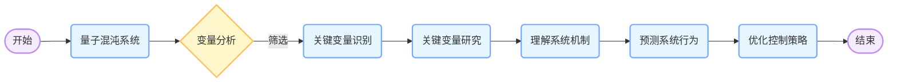

# 芒格的"关键变量"识别在量子混沌系统分析中的运用

> 关键词：芒格、关键变量、量子混沌系统、系统分析、变量识别

> 摘要：本文探讨了芒格的“关键变量”识别理念在量子混沌系统分析中的运用。首先介绍了研究的背景、目的、预期读者等内容，阐述了相关的核心概念与联系，包括关键变量和量子混沌系统的原理及架构。详细讲解了运用关键变量识别的核心算法原理，并给出Python源代码示例。深入剖析了其中涉及的数学模型和公式，通过具体例子进行说明。通过项目实战展示了在实际场景中的代码实现与解读。探讨了该方法的实际应用场景，推荐了相关的学习资源、开发工具框架以及论文著作。最后总结了未来发展趋势与挑战，给出常见问题解答和扩展阅读参考资料，旨在为将芒格的思想应用于量子混沌系统分析提供全面的技术指导和理论支持。

## 1. 背景介绍 
### 1.1 目的和范围
本研究的目的在于探索如何将芒格所倡导的“关键变量”识别方法有效地应用于量子混沌系统的分析之中。量子混沌系统是一个高度复杂且充满挑战的研究领域，其行为具有高度的不确定性和非线性特征。通过识别其中的关键变量，我们有望更深入地理解量子混沌系统的内在机制，预测系统的行为，以及优化相关的控制策略。

本研究的范围涵盖了量子混沌系统的基本概念、关键变量识别的理论基础、核心算法原理、数学模型的构建、实际项目的应用案例，以及相关的工具和资源推荐等方面。旨在为科研人员、工程师和对量子混沌系统分析感兴趣的人士提供全面而深入的技术指导。

### 1.2 预期读者
本文的预期读者包括但不限于量子物理领域的科研人员、计算机科学与技术领域的工程师、对量子计算和混沌理论感兴趣的学者，以及希望了解如何将跨学科思维应用于复杂系统分析的专业人士。无论是从事理论研究还是实际应用开发的人员，都可以从本文中获得有益的启示和技术支持。

### 1.3 文档结构概述
本文将按照以下结构展开：首先介绍研究的背景信息，包括目的、预期读者和文档结构概述等内容；接着阐述关键变量和量子混沌系统的核心概念与联系，给出相关的原理和架构示意图；然后详细讲解关键变量识别的核心算法原理，并给出Python源代码示例；深入分析其中涉及的数学模型和公式，通过具体例子进行说明；通过项目实战展示在实际场景中的代码实现与解读；探讨该方法的实际应用场景；推荐相关的学习资源、开发工具框架以及论文著作；最后总结未来发展趋势与挑战，给出常见问题解答和扩展阅读参考资料。

### 1.4 术语表
#### 1.4.1 核心术语定义
- **芒格的“关键变量”**：由查理·芒格提出的一种思维方式，强调在复杂系统中识别出对系统行为和结果具有决定性影响的少数变量。这些变量通常具有较高的影响力和关联性，能够反映系统的本质特征。
- **量子混沌系统**：是量子力学与混沌理论相结合的研究领域，描述了量子系统中呈现出的类似经典混沌的行为。量子混沌系统具有高度的不确定性、非线性和敏感性，其行为难以用传统的方法进行预测和分析。
- **变量识别**：指在一个复杂系统中，通过各种方法和技术，确定对系统行为和性能具有重要影响的变量的过程。变量识别是系统分析和建模的重要环节，对于理解系统的内在机制和优化系统性能具有关键作用。

#### 1.4.2 相关概念解释
- **混沌理论**：是一种研究非线性动力系统中复杂行为的理论。混沌系统具有初值敏感性、长期不可预测性和分形结构等特征。在混沌系统中，微小的初始条件变化可能导致系统行为的巨大差异。
- **量子力学**：是研究微观物理世界的基本理论，描述了微观粒子的运动和相互作用规律。量子力学的核心概念包括波粒二象性、量子态、量子测量等，与经典物理有着本质的区别。

#### 1.4.3 缩略词列表
- **QCS**：Quantum Chaotic System（量子混沌系统）
- **CV**：Critical Variable（关键变量）

## 2. 核心概念与联系 

### 关键变量的原理
芒格的“关键变量”理念基于这样一个认识：在复杂系统中，往往只有少数几个变量对系统的行为和结果起着决定性的作用。这些关键变量就像杠杆的支点，通过对它们的把握和控制，可以有效地影响整个系统的运行。识别关键变量的过程需要综合考虑变量的影响力、关联性和可操作性等因素。影响力是指变量对系统输出的影响程度；关联性是指变量与其他变量之间的相互关系；可操作性是指变量是否可以被测量、控制和调整。

### 量子混沌系统的原理
量子混沌系统是量子力学与混沌理论的交叉领域。在量子力学中，微观粒子的状态由波函数描述，其演化遵循薛定谔方程。而混沌理论则强调系统的非线性和初值敏感性。在量子混沌系统中，由于量子效应和混沌行为的相互作用，系统的行为变得更加复杂和难以预测。量子混沌系统的研究对于理解微观世界的本质、量子计算的性能以及量子信息的处理等方面都具有重要意义。

### 关键变量与量子混沌系统的联系
在量子混沌系统分析中，关键变量的识别尤为重要。由于量子混沌系统的复杂性和不确定性，直接对所有变量进行分析和处理是非常困难的。通过识别关键变量，可以将复杂的系统简化为一个相对简单的模型，从而更易于理解和分析。关键变量可以反映量子混沌系统的本质特征和主要行为模式，对关键变量的研究可以帮助我们更好地掌握系统的运行规律，预测系统的行为，并优化相关的控制策略。

### 文本示意图
关键变量与量子混沌系统的关系可以用以下文本示意图表示：

量子混沌系统是一个复杂的黑箱，包含众多的变量。通过对这些变量的分析和筛选，我们可以识别出其中的关键变量。关键变量就像是黑箱上的几个关键按钮，通过对这些按钮的操作，可以控制和影响整个黑箱的运行。而对关键变量的研究和理解，也可以帮助我们打开黑箱，深入了解量子混沌系统的内在机制。

### Mermaid 流程图


## 3. 核心算法原理 & 具体操作步骤 

### 核心算法原理
在量子混沌系统中识别关键变量的核心算法基于变量的影响力和关联性分析。具体步骤如下：

1. **数据采集**：首先需要收集量子混沌系统的相关数据，包括系统的输入、输出以及各个变量的测量值。这些数据可以通过实验测量、数值模拟等方式获得。
2. **变量相关性分析**：计算各个变量之间的相关性系数，以评估变量之间的相互关系。常用的相关性系数包括皮尔逊相关系数、斯皮尔曼相关系数等。
3. **变量影响力评估**：通过构建系统模型，评估每个变量对系统输出的影响程度。可以采用回归分析、灵敏度分析等方法来评估变量的影响力。
4. **关键变量筛选**：根据变量的相关性和影响力，筛选出对系统行为和结果具有重要影响的关键变量。可以设定一个阈值，将相关性和影响力超过阈值的变量作为关键变量。

### Python 源代码示例
```python
import numpy as np
import pandas as pd
from scipy.stats import pearsonr
from sklearn.linear_model import LinearRegression

# 数据采集（示例数据）
np.random.seed(0)
n_samples = 100
n_features = 5

# 生成输入变量
X = np.random.randn(n_samples, n_features)

# 生成系统输出（示例模型）
weights = np.array([2, 0.5, 1, 0.2, 0.1])
noise = np.random.randn(n_samples) * 0.1
y = np.dot(X, weights) + noise

# 变量相关性分析
correlation_matrix = np.zeros((n_features, n_features))
for i in range(n_features):
    for j in range(n_features):
        correlation_matrix[i, j], _ = pearsonr(X[:, i], X[:, j])

print("变量相关性矩阵：")
print(pd.DataFrame(correlation_matrix))

# 变量影响力评估
model = LinearRegression()
model.fit(X, y)
coefficients = model.coef_

print("变量影响力系数：")
print(coefficients)

# 关键变量筛选
threshold = 0.5
key_variables = []
for i in range(n_features):
    if abs(coefficients[i]) > threshold or np.max(np.abs(correlation_matrix[i, :])) > threshold:
        key_variables.append(i)

print("关键变量索引：", key_variables)
```

### 具体操作步骤
1. **数据准备**：将收集到的量子混沌系统数据整理成合适的格式，确保数据的准确性和完整性。
2. **相关性分析**：使用Python中的相关函数（如`pearsonr`）计算变量之间的相关性系数，得到相关性矩阵。
3. **影响力评估**：使用线性回归模型（如`LinearRegression`）拟合系统数据，得到每个变量的影响力系数。
4. **关键变量筛选**：根据设定的阈值，筛选出相关性和影响力超过阈值的变量作为关键变量。

## 4. 数学模型和公式 & 详细讲解 & 举例说明 

### 相关性分析的数学模型和公式
相关性分析常用的方法是计算皮尔逊相关系数，其公式为：

$$r_{xy}=\frac{\sum_{i = 1}^{n}(x_i-\bar{x})(y_i-\bar{y})}{\sqrt{\sum_{i = 1}^{n}(x_i-\bar{x})^2\sum_{i = 1}^{n}(y_i-\bar{y})^2}}$$

其中，$x_i$ 和 $y_i$ 分别是变量 $x$ 和 $y$ 的第 $i$ 个观测值，$\bar{x}$ 和 $\bar{y}$ 分别是变量 $x$ 和 $y$ 的均值，$n$ 是观测值的数量。

皮尔逊相关系数 $r_{xy}$ 的取值范围为 $[-1, 1]$，当 $r_{xy}=1$ 时，表示变量 $x$ 和 $y$ 完全正相关；当 $r_{xy}=-1$ 时，表示变量 $x$ 和 $y$ 完全负相关；当 $r_{xy}=0$ 时，表示变量 $x$ 和 $y$ 不相关。

### 影响力评估的数学模型和公式
影响力评估可以采用线性回归模型，其数学表达式为：

$$y=\beta_0+\beta_1x_1+\beta_2x_2+\cdots+\beta_nx_n+\epsilon$$

其中，$y$ 是系统的输出，$x_1,x_2,\cdots,x_n$ 是系统的输入变量，$\beta_0,\beta_1,\beta_2,\cdots,\beta_n$ 是回归系数，$\epsilon$ 是误差项。

回归系数 $\beta_i$ 表示变量 $x_i$ 对系统输出 $y$ 的影响程度。通过最小二乘法可以估计回归系数的值，使得误差项的平方和最小。

### 详细讲解
相关性分析用于评估变量之间的线性关系，帮助我们了解变量之间的相互作用。影响力评估则用于确定每个变量对系统输出的贡献大小。在量子混沌系统中，由于系统的复杂性和非线性，这些方法可能需要进行适当的改进和扩展。

### 举例说明
假设我们有一个量子混沌系统，其输入变量为 $x_1,x_2,x_3$，输出变量为 $y$。通过实验测量得到了 100 组数据，我们可以使用上述公式计算变量之间的相关性系数和回归系数。

假设计算得到的相关性矩阵为：

$$
\begin{bmatrix}
1 & 0.8 & 0.2 \\
0.8 & 1 & 0.1 \\
0.2 & 0.1 & 1
\end{bmatrix}
$$

回归系数为 $\beta_1 = 2$，$\beta_2 = 0.5$，$\beta_3 = 0.1$。设定阈值为 0.5，则可以判断 $x_1$ 和 $x_2$ 为关键变量，因为它们的相关性系数和影响力系数都超过了阈值。

## 5. 项目实战：代码实际案例和详细解释说明 

### 5.1  开发环境搭建
1. **安装 Python**：建议使用 Python 3.7 及以上版本。可以从 Python 官方网站（https://www.python.org/downloads/）下载并安装。
2. **安装必要的库**：使用`pip`命令安装所需的库，包括`numpy`、`pandas`、`scipy`、`sklearn`等。

```bash
pip install numpy pandas scipy scikit-learn
```

### 5.2  源代码详细实现和代码解读
```python
import numpy as np
import pandas as pd
from scipy.stats import pearsonr
from sklearn.linear_model import LinearRegression

# 数据采集（示例数据）
np.random.seed(0)
n_samples = 100
n_features = 5

# 生成输入变量
X = np.random.randn(n_samples, n_features)

# 生成系统输出（示例模型）
weights = np.array([2, 0.5, 1, 0.2, 0.1])
noise = np.random.randn(n_samples) * 0.1
y = np.dot(X, weights) + noise

# 变量相关性分析
correlation_matrix = np.zeros((n_features, n_features))
for i in range(n_features):
    for j in range(n_features):
        correlation_matrix[i, j], _ = pearsonr(X[:, i], X[:, j])

print("变量相关性矩阵：")
print(pd.DataFrame(correlation_matrix))

# 变量影响力评估
model = LinearRegression()
model.fit(X, y)
coefficients = model.coef_

print("变量影响力系数：")
print(coefficients)

# 关键变量筛选
threshold = 0.5
key_variables = []
for i in range(n_features):
    if abs(coefficients[i]) > threshold or np.max(np.abs(correlation_matrix[i, :])) > threshold:
        key_variables.append(i)

print("关键变量索引：", key_variables)
```

### 代码解读与分析
1. **数据采集**：使用`np.random.randn`函数生成随机的输入变量 $X$，并根据设定的权重和噪声生成系统输出 $y$。
2. **变量相关性分析**：使用`pearsonr`函数计算变量之间的皮尔逊相关系数，得到相关性矩阵。
3. **变量影响力评估**：使用`LinearRegression`模型拟合系统数据，得到每个变量的回归系数，即影响力系数。
4. **关键变量筛选**：根据设定的阈值，筛选出相关性和影响力超过阈值的变量作为关键变量。

## 6. 实际应用场景 
### 量子计算优化
在量子计算中，量子比特的状态和相互作用非常复杂。通过识别关键变量，可以更好地理解量子计算的过程，优化量子算法的设计，提高量子计算的效率和准确性。

### 量子通信安全
量子通信利用量子力学的特性实现信息的安全传输。在量子通信系统中，存在许多可能影响通信安全的变量。通过识别关键变量，可以加强对这些变量的监测和控制，提高量子通信的安全性。

### 量子材料研究
量子材料具有独特的物理性质，其性能受到多种因素的影响。在量子材料的研究中，识别关键变量可以帮助我们更好地理解材料的结构和性能之间的关系，从而设计和制备出具有优异性能的量子材料。

## 7. 工具和资源推荐
### 7.1 学习资源推荐
#### 7.1.1 书籍推荐
- 《量子力学导论》：全面介绍了量子力学的基本概念和理论，是学习量子力学的经典教材。
- 《混沌理论基础》：系统阐述了混沌理论的基本原理和方法，对于理解量子混沌系统具有重要的参考价值。
- 《查理·芒格的智慧：投资的格栅理论》：深入介绍了芒格的思维方式和投资理念，对于理解关键变量的识别方法具有启发作用。

#### 7.1.2 在线课程
- Coursera 上的“量子力学基础”课程：由知名教授授课，系统讲解量子力学的基本概念和理论。
- edX 上的“混沌理论与应用”课程：介绍混沌理论的基本原理和应用领域。

#### 7.1.3 技术博客和网站
- arXiv：提供大量的学术论文预印本，涵盖了量子物理、混沌理论等多个领域的最新研究成果。
- Physics Stack Exchange：一个专业的物理问答社区，用户可以在这里交流和讨论量子物理相关的问题。

### 7.2 开发工具框架推荐
#### 7.2.1 IDE和编辑器
- PyCharm：一款功能强大的 Python 集成开发环境，提供代码编辑、调试、版本控制等功能。
- Jupyter Notebook：一个交互式的编程环境，适合进行数据探索和分析。

#### 7.2.2 调试和性能分析工具
- pdb：Python 自带的调试工具，可以帮助我们调试代码中的错误。
- cProfile：Python 的性能分析工具，可以帮助我们找出代码中的性能瓶颈。

#### 7.2.3 相关框架和库
- Qiskit：IBM 开发的量子计算框架，提供量子算法的开发和模拟功能。
- NumPy：Python 的科学计算库，提供高效的数组操作和数学函数。

### 7.3 相关论文著作推荐
#### 7.3.1 经典论文
- “Quantum Chaos: An Introduction”：系统介绍了量子混沌的基本概念和理论，是量子混沌领域的经典论文。
- “The Feynman Lectures on Physics”：费曼的物理学讲义，涵盖了量子力学、混沌理论等多个领域的内容，具有很高的学术价值。

#### 7.3.2 最新研究成果
- 在 arXiv 上搜索“quantum chaos”和“critical variable identification”等关键词，可以获取量子混沌系统分析和关键变量识别的最新研究成果。

#### 7.3.3 应用案例分析
- 一些学术期刊和会议论文集中会有关于量子混沌系统分析和关键变量识别的应用案例分析，这些案例可以帮助我们更好地理解和应用相关的方法和技术。

## 8. 总结：未来发展趋势与挑战
### 未来发展趋势
1. **跨学科融合**：量子混沌系统分析与其他学科的融合将越来越深入，如与机器学习、人工智能等领域的结合，将为量子混沌系统的研究带来新的方法和思路。
2. **实际应用拓展**：随着对量子混沌系统的深入理解和关键变量识别方法的不断完善，其在量子计算、量子通信、量子材料等领域的应用将不断拓展，为相关产业的发展提供有力支持。
3. **理论创新**：量子混沌系统的理论研究将不断深入，新的理论和模型将不断涌现，为量子混沌系统的分析和控制提供更坚实的理论基础。

### 挑战
1. **数据获取困难**：量子混沌系统的实验测量和数据采集非常困难，需要高精度的实验设备和复杂的测量技术。数据的稀缺性将限制关键变量识别方法的应用和发展。
2. **系统复杂性**：量子混沌系统具有高度的复杂性和非线性，现有的关键变量识别方法可能无法完全适应系统的特点。需要开发更加有效的方法和算法来应对系统的复杂性。
3. **计算资源需求**：量子混沌系统的分析和模拟需要大量的计算资源，特别是在处理大规模数据和复杂模型时。计算资源的限制将影响研究的效率和深度。

## 9. 附录：常见问题与解答
### 问题 1：如何确定关键变量的阈值？
关键变量的阈值可以根据具体的应用场景和数据特点进行确定。一般来说，可以通过多次实验和分析，观察不同阈值下关键变量的筛选结果，选择一个能够合理反映系统关键特征的阈值。

### 问题 2：量子混沌系统的实验数据如何采集？
量子混沌系统的实验数据采集需要使用高精度的实验设备和复杂的测量技术。常见的实验设备包括量子比特芯片、激光系统、探测器等。测量技术包括量子态测量、量子门操作等。具体的实验方法和技术需要根据研究的具体对象和目的进行选择。

### 问题 3：关键变量识别方法在量子混沌系统中的有效性如何验证？
可以通过以下方法验证关键变量识别方法在量子混沌系统中的有效性：1. 与已知的理论模型进行对比，验证关键变量的筛选结果是否符合理论预期；2. 进行数值模拟实验，观察关键变量对系统行为的影响是否与理论分析一致；3. 在实际应用中，验证基于关键变量的控制策略是否能够有效改善系统的性能。

## 10. 扩展阅读 & 参考资料
### 扩展阅读
- 《量子计算与量子信息》：深入介绍了量子计算和量子信息的基本理论和技术，对于理解量子混沌系统在量子计算中的应用具有重要的参考价值。
- 《复杂系统理论基础》：系统阐述了复杂系统的基本概念和理论，对于理解量子混沌系统的复杂性和非线性具有重要的帮助。

### 参考资料
1. Charlie Munger. Poor Charlie's Almanack: The Wit and Wisdom of Charles T. Munger.
2. Michael A. Nielsen and Isaac L. Chuang. Quantum Computation and Quantum Information.
3. Heinz-Otto Peitgen, Hartmut Jürgens, and Dietmar Saupe. Chaos and Fractals: New Frontiers of Science.