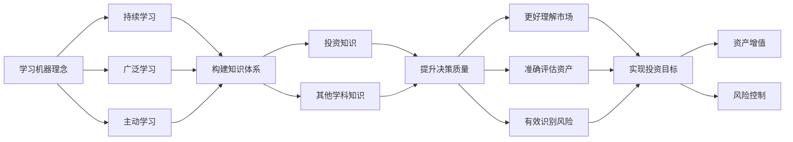

# 芒格的"学习机器"理念：终身学习在投资中的重要性

> 关键词：芒格、学习机器、终身学习、投资、知识体系、复利效应、决策质量

> 摘要：本文深入探讨了芒格的“学习机器”理念，阐述了终身学习在投资领域的关键重要性。从背景介绍出发，剖析核心概念与联系，通过算法原理和数学模型来揭示学习与投资的内在逻辑。结合项目实战案例，分析终身学习在实际投资中的应用，介绍相关工具和资源，最后总结未来发展趋势与挑战，并解答常见问题。旨在帮助投资者理解终身学习如何提升投资决策质量，实现投资目标。

## 1. 背景介绍 
### 1.1 目的和范围
本文的目的在于全面解析芒格的“学习机器”理念，并深入探讨终身学习在投资中的重要性。通过理论分析、案例研究和实际应用场景的介绍，为投资者提供一套系统的学习方法和投资思路。范围涵盖了从芒格理念的起源到终身学习对投资决策、资产配置、风险控制等方面的影响，以及如何在实际投资中践行终身学习。

### 1.2 预期读者
本文预期读者包括广大投资者，无论是初涉投资领域的新手，还是具有一定经验的专业投资者；也包括对投资理论和学习方法感兴趣的学者、研究人员；同时，对于希望提升自我认知和决策能力的个人也具有一定的参考价值。

### 1.3 文档结构概述
本文首先介绍背景信息，包括目的、预期读者和文档结构。接着阐述核心概念与联系，分析“学习机器”理念和终身学习的原理及其与投资的关系。然后讲解核心算法原理和具体操作步骤，通过数学模型和公式进一步说明学习与投资的逻辑。之后通过项目实战案例详细展示终身学习在投资中的应用。再介绍实际应用场景、工具和资源推荐。最后总结未来发展趋势与挑战，解答常见问题，并提供扩展阅读和参考资料。

### 1.4 术语表
#### 1.4.1 核心术语定义
- **学习机器**：芒格提出的一种比喻，指像机器一样持续、高效地学习新知识、新技能，不断更新和完善自己的知识体系。
- **终身学习**：贯穿一生的学习过程，强调个体在不同阶段都积极主动地获取知识和技能，以适应社会发展和个人成长的需要。
- **投资**：为了获取未来收益而投入资金或其他资源的行为，包括股票、债券、基金、房地产等多种资产类别。

#### 1.4.2 相关概念解释
- **知识体系**：由一系列相互关联的知识组成的系统，涵盖不同领域和层次的知识，是个人认知和决策的基础。
- **复利效应**：在投资中，指资产的收益不仅基于本金，还基于之前的收益进行累积增长的现象；在学习中，指知识和技能的积累会随着时间产生加速增长的效果。
- **决策质量**：指投资决策的合理性、准确性和有效性，直接影响投资的收益和风险。

#### 1.4.3 缩略词列表
- **ROI**：Return on Investment，投资回报率。
- **P/E**：Price-to-Earnings Ratio，市盈率。

## 2. 核心概念与联系 

### 芒格的“学习机器”理念
芒格认为，一个成功的投资者应该像一台学习机器，不断地学习和进步。他自己就是这一理念的践行者，通过广泛阅读、与各行各业的人交流等方式，不断拓展自己的知识边界。“学习机器”理念强调学习的持续性、主动性和广泛性，不仅仅局限于投资领域的知识，还包括其他学科的知识，如心理学、生物学、物理学等。

### 终身学习的原理
终身学习基于人类认知和社会发展的规律。人类的知识是不断更新和发展的，社会环境也在不断变化。为了适应这种变化，个体需要持续学习，不断提升自己的能力和素质。终身学习包括正式学习（如学校教育、培训课程）和非正式学习（如阅读、实践、交流），通过多种途径获取知识和技能。

### 学习与投资的联系
学习与投资之间存在着紧密的联系。一方面，学习可以提升投资者的知识水平和分析能力，帮助他们更好地理解市场、评估资产价值、识别投资机会和风险。另一方面，投资实践也可以为学习提供反馈和动力，促使投资者不断改进自己的学习方法和投资策略。学习和投资相互促进，形成一个良性循环。

### 文本示意图
```plaintext
学习机器理念
|
|-- 持续学习
|-- 广泛学习
|-- 主动学习
|
|-- 构建知识体系
|   |
|   |-- 投资知识
|   |-- 其他学科知识
|
|-- 提升决策质量
|   |
|   |-- 更好理解市场
|   |-- 准确评估资产
|   |-- 有效识别风险
|
|-- 实现投资目标
|   |
|   |-- 资产增值
|   |-- 风险控制
```

### Mermaid 流程图


## 3. 核心算法原理 & 具体操作步骤 

### 学习的复利效应算法原理
在学习中，复利效应体现为知识和技能的积累会随着时间产生加速增长的效果。可以用以下 Python 代码来模拟学习的复利效应：

```python
def learning_compound_effect(initial_knowledge, learning_rate, years):
    """
    模拟学习的复利效应
    :param initial_knowledge: 初始知识水平
    :param learning_rate: 学习率，表示每年知识增长的比例
    :param years: 学习的年数
    :return: 最终的知识水平
    """
    knowledge = initial_knowledge
    for _ in range(years):
        knowledge = knowledge * (1 + learning_rate)
    return knowledge

# 示例
initial_knowledge = 100
learning_rate = 0.1
years = 10
final_knowledge = learning_compound_effect(initial_knowledge, learning_rate, years)
print(f"经过 {years} 年的学习，知识水平从 {initial_knowledge} 增长到 {final_knowledge}")
```

### 具体操作步骤
1. **设定学习目标**：明确自己在投资领域以及其他相关领域想要学习的内容和达到的水平。例如，学习财务报表分析、行业研究方法等。
2. **制定学习计划**：根据学习目标，制定详细的学习计划，包括学习内容、学习时间、学习方式等。可以将学习计划分解为短期、中期和长期目标，逐步推进。
3. **选择学习资源**：根据学习计划，选择合适的学习资源，如书籍、在线课程、研究报告、行业论坛等。确保学习资源的质量和相关性。
4. **学习和实践**：按照学习计划进行学习，并将所学知识应用到实际投资中。通过实践来加深对知识的理解和掌握，同时检验学习效果。
5. **反馈和改进**：定期对学习效果进行评估和反馈，总结经验教训，发现问题及时调整学习计划和方法。不断改进自己的学习过程，提高学习效率和质量。

## 4. 数学模型和公式 & 详细讲解 & 举例说明 

### 学习的复利模型
学习的复利模型可以用以下公式表示：

$$K_t = K_0(1 + r)^t$$

其中，$K_t$ 表示第 $t$ 年的知识水平，$K_0$ 表示初始知识水平，$r$ 表示学习率，$t$ 表示学习的年数。

这个公式表明，知识水平随着时间的增长呈现指数增长的趋势。学习率 $r$ 越大，知识增长的速度就越快；学习的时间 $t$ 越长，知识积累的效果就越明显。

### 举例说明
假设一个投资者的初始知识水平 $K_0 = 100$，学习率 $r = 0.1$（即每年知识增长 10%），学习时间 $t = 10$ 年。根据上述公式，计算得到第 10 年的知识水平为：

$$K_{10} = 100(1 + 0.1)^{10} \approx 259.37$$

这意味着经过 10 年的持续学习，投资者的知识水平将从 100 增长到约 259.37，增长了约 1.59 倍。

### 投资决策的数学模型
在投资决策中，可以用期望收益和风险来评估投资项目。期望收益可以用以下公式表示：

$$E(R) = \sum_{i = 1}^{n} p_i R_i$$

其中，$E(R)$ 表示期望收益，$p_i$ 表示第 $i$ 种情况发生的概率，$R_i$ 表示第 $i$ 种情况的收益。

风险可以用标准差来衡量，公式为：

$$\sigma = \sqrt{\sum_{i = 1}^{n} p_i (R_i - E(R))^2}$$

### 举例说明
假设有一个投资项目，有三种可能的情况：情况 1 发生的概率 $p_1 = 0.3$，收益 $R_1 = 20\%$；情况 2 发生的概率 $p_2 = 0.5$，收益 $R_2 = 10\%$；情况 3 发生的概率 $p_3 = 0.2$，收益 $R_3 = -5\%$。

首先计算期望收益：

$$E(R) = 0.3 \times 0.2 + 0.5 \times 0.1 + 0.2 \times (-0.05) = 0.06 + 0.05 - 0.01 = 0.1$$

即期望收益为 10%。

然后计算标准差：

$$\sigma = \sqrt{0.3 \times (0.2 - 0.1)^2 + 0.5 \times (0.1 - 0.1)^2 + 0.2 \times (-0.05 - 0.1)^2}$$
$$= \sqrt{0.3 \times 0.01 + 0 + 0.2 \times 0.0225}$$
$$= \sqrt{0.003 + 0.0045}$$
$$= \sqrt{0.0075} \approx 0.0866$$

即风险约为 8.66%。

通过这些数学模型和公式，投资者可以更科学地评估投资项目，做出更合理的决策。

## 5. 项目实战：代码实际案例和详细解释说明 

### 5.1  开发环境搭建
- **操作系统**：Windows、Linux 或 macOS 均可。
- **编程语言**：Python 3.x。
- **开发工具**：推荐使用 PyCharm 或 Jupyter Notebook。
- **相关库**：需要安装 `pandas`、`numpy`、`matplotlib` 等库，用于数据处理、计算和可视化。可以使用以下命令进行安装：

```sh
pip install pandas numpy matplotlib
```

### 5.2  源代码详细实现和代码解读
以下是一个简单的股票投资分析案例，通过计算股票的收益率和波动率来评估股票的表现。

```python
import pandas as pd
import numpy as np
import matplotlib.pyplot as plt

# 读取股票数据
def read_stock_data(file_path):
    """
    读取股票数据
    :param file_path: 数据文件路径
    :return: 股票数据 DataFrame
    """
    data = pd.read_csv(file_path)
    data['Date'] = pd.to_datetime(data['Date'])
    data.set_index('Date', inplace=True)
    return data

# 计算股票收益率
def calculate_returns(data):
    """
    计算股票收益率
    :param data: 股票数据 DataFrame
    :return: 收益率 Series
    """
    returns = data['Close'].pct_change()
    return returns.dropna()

# 计算股票波动率
def calculate_volatility(returns):
    """
    计算股票波动率
    :param returns: 收益率 Series
    :return: 波动率
    """
    volatility = returns.std() * np.sqrt(252)
    return volatility

# 绘制收益率曲线
def plot_returns(returns):
    """
    绘制收益率曲线
    :param returns: 收益率 Series
    """
    plt.figure(figsize=(10, 6))
    returns.plot()
    plt.title('Stock Returns')
    plt.xlabel('Date')
    plt.ylabel('Returns')
    plt.show()

# 主函数
def main():
    file_path = 'stock_data.csv'  # 替换为实际的数据文件路径
    data = read_stock_data(file_path)
    returns = calculate_returns(data)
    volatility = calculate_volatility(returns)
    print(f"股票的年化波动率为: {volatility * 100:.2f}%")
    plot_returns(returns)

if __name__ == "__main__":
    main()
```

### 5.3  代码解读与分析
1. **读取股票数据**：`read_stock_data` 函数用于读取股票数据文件，并将日期列转换为日期时间类型，设置为索引。
2. **计算股票收益率**：`calculate_returns` 函数使用 `pct_change` 方法计算股票的每日收益率，并去除缺失值。
3. **计算股票波动率**：`calculate_volatility` 函数计算股票收益率的标准差，并乘以 $\sqrt{252}$ 得到年化波动率。
4. **绘制收益率曲线**：`plot_returns` 函数使用 `matplotlib` 库绘制股票收益率曲线，直观展示股票的收益情况。
5. **主函数**：`main` 函数调用上述函数，读取数据、计算收益率和波动率，并绘制收益率曲线。

通过这个案例，投资者可以学习如何使用 Python 进行股票数据的分析和可视化，更好地了解股票的表现和风险。

## 6. 实际应用场景 
### 基本面分析
在基本面分析中，终身学习可以帮助投资者深入了解公司的财务状况、行业竞争格局、管理层能力等。通过学习财务报表分析方法、行业研究理论等知识，投资者可以更准确地评估公司的价值，发现被低估或高估的股票。例如，学习如何解读资产负债表、利润表和现金流量表，能够帮助投资者判断公司的盈利能力、偿债能力和运营效率。

### 技术分析
技术分析需要投资者掌握各种技术指标和图表分析方法。终身学习可以让投资者不断更新和完善自己的技术分析体系，适应市场的变化。例如，学习新的技术指标（如布林带、相对强弱指标等）和分析方法（如波浪理论、趋势线分析等），可以提高投资者对市场趋势和价格走势的判断能力。

### 资产配置
资产配置是投资组合管理的重要环节。终身学习可以帮助投资者了解不同资产类别的特点和风险收益特征，根据市场环境和自身的投资目标、风险承受能力进行合理的资产配置。例如，学习宏观经济知识和资产定价理论，能够帮助投资者判断不同资产类别的投资价值，优化投资组合。

### 风险管理
风险管理是投资成功的关键。终身学习可以让投资者学习各种风险管理方法和工具，如止损、对冲、分散投资等。通过不断学习和实践，投资者可以提高自己的风险意识和风险管理能力，降低投资损失。例如，学习期权、期货等衍生品的知识，能够帮助投资者进行有效的风险对冲。

## 7. 工具和资源推荐
### 7.1 学习资源推荐
#### 7.1.1 书籍推荐
- 《穷查理宝典：查理·芒格的智慧箴言录》：全面介绍了芒格的投资理念、学习方法和人生智慧。
- 《聪明的投资者》：本杰明·格雷厄姆的经典著作，阐述了价值投资的基本原理和方法。
- 《金融炼金术》：乔治·索罗斯的著作，介绍了他的反身性理论和投资实践。
- 《原则》：瑞·达利欧的著作，分享了他的生活和工作原则，对投资和人生都有很大的启示。
- 《漫步华尔街》：伯顿·马尔基尔的著作，介绍了各种投资理论和方法，适合初学者阅读。

#### 7.1.2 在线课程
- Coursera 上的“投资学原理”课程：由知名大学教授授课，系统介绍投资学的基本原理和方法。
- edX 上的“金融市场”课程：提供金融市场的全面知识，包括股票、债券、衍生品等。
- 网易云课堂上的“财务报表分析”课程：帮助学习者掌握财务报表分析的方法和技巧。

#### 7.1.3 技术博客和网站
- 雪球网：提供股票、基金等投资产品的资讯、分析和讨论平台。
- 东方财富网：国内知名的金融资讯网站，提供丰富的财经新闻、数据和分析工具。
- Seeking Alpha：国外知名的投资研究网站，提供专业的投资分析和观点。

### 7.2 开发工具框架推荐
#### 7.2.1 IDE和编辑器
- PyCharm：专业的 Python 集成开发环境，提供丰富的代码编辑、调试和管理功能。
- Jupyter Notebook：交互式的开发环境，适合数据探索和分析，方便代码的展示和分享。

#### 7.2.2 调试和性能分析工具
- pdb：Python 内置的调试工具，用于调试 Python 代码。
- cProfile：Python 内置的性能分析工具，用于分析代码的性能瓶颈。

#### 7.2.3 相关框架和库
- pandas：用于数据处理和分析的 Python 库，提供高效的数据结构和数据操作方法。
- numpy：用于科学计算的 Python 库，提供多维数组和数学函数。
- matplotlib：用于数据可视化的 Python 库，提供丰富的绘图功能。

### 7.3 相关论文著作推荐
#### 7.3.1 经典论文
- Eugene F. Fama 的《有效资本市场：理论与实证研究回顾》：提出了有效市场假说，对投资理论和实践产生了深远影响。
- Harry Markowitz 的《资产组合选择》：奠定了现代投资组合理论的基础，提出了均值 - 方差模型。

#### 7.3.2 最新研究成果
- 关注顶级金融学术期刊，如《Journal of Finance》、《Review of Financial Studies》等，了解最新的投资研究成果。

#### 7.3.3 应用案例分析
- 一些知名投资机构的研究报告和案例分析，如巴菲特的致股东信、桥水基金的研究报告等，提供了实际投资中的经验和教训。

## 8. 总结：未来发展趋势与挑战
### 未来发展趋势
- **知识融合**：未来的投资需要投资者具备跨学科的知识，将金融、经济、科技、社会等多领域的知识融合起来，以更好地理解市场和企业的发展趋势。
- **数字化学习**：随着互联网和信息技术的发展，数字化学习将成为主要的学习方式。投资者可以通过在线课程、视频、社交媒体等渠道获取更多的学习资源，提高学习效率。
- **人工智能与投资**：人工智能技术将在投资领域得到更广泛的应用，如智能投顾、量化投资等。投资者需要学习人工智能相关的知识，以适应市场的变化。

### 挑战
- **知识更新速度快**：金融市场和科技发展日新月异，知识更新速度加快。投资者需要不断学习和更新自己的知识，以跟上市场的变化。
- **信息过载**：互联网上的信息海量且繁杂，投资者需要具备筛选和甄别信息的能力，避免被无用信息淹没。
- **心理压力**：终身学习需要投资者付出大量的时间和精力，同时投资过程中也会面临各种压力和挑战。投资者需要具备良好的心理素质，保持学习的热情和动力。

## 9. 附录：常见问题与解答
### 问题 1：终身学习需要花费大量时间，如何平衡学习和投资实践？
解答：可以制定合理的学习计划，将学习时间和投资实践时间进行合理分配。例如，每天安排固定的时间进行学习，同时在投资实践中及时应用所学知识，将学习和实践相结合。另外，可以利用碎片化时间进行学习，如在上下班途中听音频课程等。

### 问题 2：学习了很多知识，但在投资中无法应用，怎么办？
解答：这可能是因为知识没有真正理解和掌握，或者缺乏实践经验。可以通过做练习题、案例分析等方式加深对知识的理解和掌握。同时，积极参与投资实践，将所学知识应用到实际投资中，不断总结经验教训，提高应用能力。

### 问题 3：如何选择适合自己的学习资源？
解答：首先要明确自己的学习目标和需求，根据目标和需求选择相关的学习资源。可以参考他人的推荐和评价，选择质量较高、口碑较好的学习资源。另外，要根据自己的学习能力和水平选择适合自己的学习资源，避免选择过于困难或简单的资源。

## 10. 扩展阅读 & 参考资料
### 扩展阅读
- 《人类简史：从动物到上帝》：尤瓦尔·赫拉利的著作，从宏观角度介绍人类的发展历程，对投资者的思维方式有很大的启发。
- 《思考，快与慢》：丹尼尔·卡尼曼的著作，介绍了人类的两种思维模式，帮助投资者了解自己的决策过程和心理偏差。

### 参考资料
- 查理·芒格的演讲和访谈记录。
- 相关金融学术期刊和研究报告。
- 互联网上的投资资讯和分析文章。