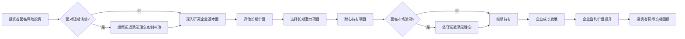

# 芒格的"延迟满足"理念在风险投资中的应用

> 关键词：芒格、延迟满足、风险投资、长期价值、投资策略

> 摘要：本文深入探讨了芒格的“延迟满足”理念在风险投资领域的应用。首先介绍了“延迟满足”理念的背景及其与风险投资结合的意义，接着阐述了该理念的核心概念及与风险投资的联系。通过对核心算法原理的分析，以数学模型和公式进行详细讲解并举例说明，还结合项目实战展示代码案例及解释。探讨了该理念在实际风险投资场景中的应用，推荐了相关的学习工具和资源，最后总结其未来发展趋势与挑战，并提供常见问题解答及参考资料，旨在帮助投资者更好地理解和运用“延迟满足”理念进行风险投资。

## 1. 背景介绍 
### 1.1 目的和范围
本研究的目的在于深入剖析芒格的“延迟满足”理念在风险投资中的具体应用，为风险投资从业者和投资者提供理论支持与实践指导。范围涵盖“延迟满足”理念的基本内涵、其在风险投资决策、投资组合管理等方面的应用，以及如何通过该理念实现长期稳定的投资回报。通过对理论和实践案例的分析，探讨该理念在不同市场环境下的适应性和有效性。

### 1.2 预期读者
本文预期读者包括风险投资行业的专业人士，如风险投资家、基金经理等，他们可以从文中获取新的投资思路和策略；对风险投资感兴趣的个人投资者，帮助他们更好地理解投资的本质和长期价值；以及相关领域的学者和研究人员，为他们的学术研究提供参考。

### 1.3 文档结构概述
本文首先介绍“延迟满足”理念的背景和相关概念，包括其来源、核心思想以及与风险投资的联系。接着阐述核心算法原理和具体操作步骤，通过数学模型和公式详细讲解其在风险投资中的应用逻辑。然后通过项目实战展示实际代码案例和详细解释。之后探讨该理念在实际风险投资场景中的应用。推荐相关的学习工具和资源，包括书籍、在线课程、开发工具等。最后总结其未来发展趋势与挑战，提供常见问题解答和参考资料。

### 1.4 术语表
#### 1.4.1 核心术语定义
- **延迟满足**：指一种甘愿为更有价值的长远结果而放弃即时满足的抉择取向， 以及在等待期中展示的自我控制能力。
- **风险投资**：由职业金融家投入到新兴的、迅速发展的、具有巨大竞争潜力的企业中的一种权益资本。
- **长期价值**：指企业或资产在较长时间跨度内所具有的价值，它不仅考虑当前的盈利情况，还关注企业的未来发展潜力和可持续性。

#### 1.4.2 相关概念解释
- **投资组合**：由投资人或金融机构所持有的股票、债券、金融衍生产品等组成的集合，目的是分散风险、实现收益最大化。
- **价值投资**：一种常见的投资方式，专门寻找价格低估的证券，注重企业的内在价值和长期发展潜力。

#### 1.4.3 缩略词列表
- **VC**：Venture Capital，风险投资。
- **IRR**：Internal Rate of Return，内部收益率。

## 2. 核心概念与联系 

### 2.1 “延迟满足”理念的原理
“延迟满足”理念最早源于斯坦福大学的棉花糖实验。在实验中，孩子们面临一个选择：可以立即吃掉一颗棉花糖，或者等待一段时间后获得两颗棉花糖。那些能够等待的孩子在未来的学业、社交等方面表现出更好的能力和成就。这一实验揭示了人类在面对短期诱惑时，能够克制自己、等待更有价值的回报的重要性。

在芒格的投资哲学中，“延迟满足”体现为不被短期的市场波动和眼前的利益所迷惑，而是着眼于企业的长期发展和内在价值。他认为，真正优秀的企业需要时间来成长和展现其价值，投资者应该有足够的耐心等待企业的价值逐渐显现。

### 2.2 “延迟满足”与风险投资的联系
风险投资通常面临着高风险和不确定性，投资项目的成功往往需要较长的时间周期。“延迟满足”理念与风险投资的结合体现在以下几个方面：
- **投资决策**：在选择投资项目时，投资者需要运用“延迟满足”理念，不被短期的市场热点和炒作所影响，而是深入研究企业的基本面、商业模式、团队素质等因素，评估其长期发展潜力。例如，一些新兴的科技企业在创业初期可能面临亏损，但如果其技术具有创新性和前瞻性，市场前景广阔，投资者应该有耐心等待其成长和盈利。
- **投资组合管理**：在构建投资组合时，投资者应该保持一定的耐心和定力，不轻易因为短期的市场波动而调整投资组合。通过长期持有优质的投资项目，可以实现资产的稳健增值。例如，巴菲特和芒格长期持有可口可乐等优质企业的股票，获得了丰厚的回报。
- **投资回报**：风险投资的回报往往具有滞后性，投资者需要等待企业发展成熟并实现盈利后才能获得回报。“延迟满足”理念要求投资者能够忍受投资过程中的不确定性和波动，等待最终的投资回报。

### 2.3 文本示意图
“延迟满足”理念在风险投资中的应用可以用以下文本示意图表示：

投资者在风险投资过程中，面临短期市场波动和各种诱惑（如短期热点、投机机会等）。运用“延迟满足”理念，投资者克制短期冲动，深入研究企业基本面，评估其长期价值。选择具有长期潜力的投资项目后，耐心持有，等待企业成长和发展。在这个过程中，投资者忍受市场波动和不确定性，不被短期因素影响。最终，企业实现盈利和价值提升，投资者获得长期稳定的投资回报。

### 2.4 Mermaid 流程图


## 3. 核心算法原理 & 具体操作步骤 

### 3.1 核心算法原理
在风险投资中，“延迟满足”理念的核心算法原理可以基于价值评估和时间价值的概念。我们可以通过以下步骤来实现：
1. **企业价值评估**：运用财务分析、行业研究等方法，评估企业的内在价值。常用的方法包括现金流折现法（DCF）、相对估值法等。
2. **时间价值计算**：考虑资金的时间价值，将未来的现金流折现到当前时刻。通过计算净现值（NPV）和内部收益率（IRR）等指标，评估投资项目的盈利能力和吸引力。
3. **风险调整**：考虑投资项目的风险因素，对预期回报进行风险调整。可以运用风险系数、风险溢价等方法，降低高风险项目的预期回报。

### 3.2 具体操作步骤
以下是运用“延迟满足”理念进行风险投资的具体操作步骤：

#### 3.2.1 研究阶段
- **行业分析**：了解目标行业的发展趋势、市场规模、竞争格局等因素，确定具有潜力的行业。
- **企业筛选**：在选定的行业中，筛选出具有创新性、竞争力和成长潜力的企业。
- **基本面分析**：深入研究企业的财务状况、商业模式、管理团队等基本面因素，评估其内在价值。

#### 3.2.2 决策阶段
- **价值评估**：运用现金流折现法、相对估值法等方法，对企业的内在价值进行评估。
- **风险评估**：考虑投资项目的风险因素，如市场风险、技术风险、管理风险等，对预期回报进行风险调整。
- **投资决策**：根据价值评估和风险评估的结果，做出投资决策。选择具有长期潜力和合理风险回报比的项目进行投资。

#### 3.2.3 持有阶段
- **耐心持有**：在投资项目后，保持耐心，不被短期的市场波动和噪音所影响。相信企业的长期发展潜力，等待其价值逐渐显现。
- **跟踪监测**：定期跟踪监测投资项目的进展情况，了解企业的经营状况、市场竞争态势等因素。及时调整投资策略，确保投资项目的风险可控。

#### 3.2.4 退出阶段
- **时机选择**：当投资项目达到预期的目标或出现更好的投资机会时，选择合适的时机退出投资。可以通过上市、并购、股权转让等方式实现退出。
- **回报计算**：计算投资项目的实际回报，评估投资决策的正确性和有效性。总结经验教训，为未来的投资决策提供参考。

### 3.3 Python 源代码阐述
以下是一个简单的 Python 代码示例，用于演示如何运用现金流折现法评估企业的内在价值：

```python
import numpy as np

def dcf_valuation(cash_flows, discount_rate):
    """
    现金流折现法评估企业内在价值
    :param cash_flows: 未来各期的现金流列表
    :param discount_rate: 折现率
    :return: 企业的内在价值
    """
    n = len(cash_flows)
    present_values = []
    for i in range(n):
        present_value = cash_flows[i] / (1 + discount_rate) ** (i + 1)
        present_values.append(present_value)
    intrinsic_value = np.sum(present_values)
    return intrinsic_value

# 示例数据
cash_flows = [100, 120, 150, 180, 200]  # 未来 5 年的现金流
discount_rate = 0.1  # 折现率为 10%

# 计算企业内在价值
intrinsic_value = dcf_valuation(cash_flows, discount_rate)
print(f"企业的内在价值为: {intrinsic_value}")
```

在上述代码中，我们定义了一个 `dcf_valuation` 函数，用于计算企业的内在价值。该函数接受未来各期的现金流列表和折现率作为输入，通过现金流折现法计算企业的内在价值。最后，我们使用示例数据调用该函数，并打印出企业的内在价值。

## 4. 数学模型和公式 & 详细讲解 & 举例说明 

### 4.1 现金流折现法（DCF）
现金流折现法是一种常用的企业价值评估方法，其基本原理是将企业未来的现金流折现到当前时刻，以确定企业的内在价值。数学公式如下：

$$
V = \sum_{t=1}^{n} \frac{CF_t}{(1 + r)^t}
$$

其中：
- $V$ 表示企业的内在价值
- $CF_t$ 表示第 $t$ 期的现金流
- $r$ 表示折现率
- $n$ 表示预测期数

### 4.2 详细讲解
现金流折现法的核心思想是考虑资金的时间价值。由于未来的现金流具有不确定性，我们需要将其折现到当前时刻，以反映其真实价值。折现率 $r$ 反映了投资者对资金时间价值和风险的要求。一般来说，折现率越高，未来现金流的现值越低，企业的内在价值也越低。

预测期数 $n$ 表示我们对企业未来现金流的预测期限。在实际应用中，我们通常会预测企业未来 5 - 10 年的现金流，并假设企业在预测期结束后进入稳定增长阶段。

### 4.3 举例说明
假设我们要评估一家企业的内在价值，预测该企业未来 5 年的现金流分别为 100 万元、120 万元、150 万元、180 万元和 200 万元，折现率为 10%。根据现金流折现法的公式，我们可以计算该企业的内在价值：

$$
\begin{align*}
V &= \frac{100}{(1 + 0.1)^1} + \frac{120}{(1 + 0.1)^2} + \frac{150}{(1 + 0.1)^3} + \frac{180}{(1 + 0.1)^4} + \frac{200}{(1 + 0.1)^5} \\
&= \frac{100}{1.1} + \frac{120}{1.21} + \frac{150}{1.331} + \frac{180}{1.4641} + \frac{200}{1.61051} \\
&\approx 90.91 + 99.17 + 112.69 + 122.94 + 124.18 \\
&\approx 549.89 \text{（万元）}
\end{align*}
$$

因此，该企业的内在价值约为 549.89 万元。

### 4.4 内部收益率（IRR）
内部收益率是指使投资项目的净现值等于零的折现率。数学公式如下：

$$
\sum_{t=0}^{n} \frac{CF_t}{(1 + IRR)^t} = 0
$$

其中：
- $CF_t$ 表示第 $t$ 期的现金流
- $IRR$ 表示内部收益率
- $n$ 表示投资项目的期限

### 4.5 详细讲解
内部收益率反映了投资项目的实际盈利能力。如果内部收益率高于投资者的预期收益率，则投资项目具有吸引力；反之，则不具有吸引力。在实际应用中，我们通常使用迭代法或数值计算方法来求解内部收益率。

### 4.6 举例说明
假设我们投资一个项目，初始投资为 1000 万元，未来 3 年的现金流分别为 300 万元、400 万元和 500 万元。我们可以使用 Python 的 `numpy` 库来计算该项目的内部收益率：

```python
import numpy as np

cash_flows = [-1000, 300, 400, 500]  # 初始投资为负，后续现金流为正
irr = np.irr(cash_flows)
print(f"项目的内部收益率为: {irr * 100:.2f}%")
```

运行上述代码，我们可以得到该项目的内部收益率约为 7.71%。

## 5. 项目实战：代码实际案例和详细解释说明 

### 5.1  开发环境搭建
在进行风险投资项目实战时，我们可以使用 Python 作为开发语言，借助一些常用的数据分析和科学计算库，如 `numpy`、`pandas`、`matplotlib` 等。以下是搭建开发环境的步骤：

1. **安装 Python**：从 Python 官方网站（https://www.python.org/downloads/） 下载并安装 Python 3.x 版本。
2. **安装虚拟环境**：为了避免不同项目之间的依赖冲突，建议使用虚拟环境。可以使用 `venv` 或 `conda` 来创建虚拟环境。例如，使用 `venv` 创建虚拟环境的命令如下：
```sh
python -m venv myenv
```
3. **激活虚拟环境**：在 Windows 系统中，激活虚拟环境的命令如下：
```sh
myenv\Scripts\activate
```
在 Linux 或 macOS 系统中，激活虚拟环境的命令如下：
```sh
source myenv/bin/activate
```
4. **安装依赖库**：在激活虚拟环境后，使用 `pip` 安装所需的依赖库。例如，安装 `numpy`、`pandas`、`matplotlib` 的命令如下：
```sh
pip install numpy pandas matplotlib
```

### 5.2  源代码详细实现和代码解读
以下是一个完整的风险投资项目实战代码示例，用于演示如何运用“延迟满足”理念进行投资决策：

```python
import numpy as np
import pandas as pd
import matplotlib.pyplot as plt

# 定义企业类
class Company:
    def __init__(self, name, cash_flows, discount_rate):
        self.name = name
        self.cash_flows = cash_flows
        self.discount_rate = discount_rate

    def dcf_valuation(self):
        """
        现金流折现法评估企业内在价值
        :return: 企业的内在价值
        """
        n = len(self.cash_flows)
        present_values = []
        for i in range(n):
            present_value = self.cash_flows[i] / (1 + self.discount_rate) ** (i + 1)
            present_values.append(present_value)
        intrinsic_value = np.sum(present_values)
        return intrinsic_value

# 定义投资组合类
class Portfolio:
    def __init__(self):
        self.companies = []

    def add_company(self, company):
        """
        向投资组合中添加企业
        :param company: 企业对象
        """
        self.companies.append(company)

    def calculate_portfolio_value(self):
        """
        计算投资组合的总价值
        :return: 投资组合的总价值
        """
        portfolio_value = 0
        for company in self.companies:
            portfolio_value += company.dcf_valuation()
        return portfolio_value

# 创建企业对象
company1 = Company("Company A", [100, 120, 150, 180, 200], 0.1)
company2 = Company("Company B", [80, 100, 130, 160, 190], 0.1)

# 创建投资组合对象
portfolio = Portfolio()
portfolio.add_company(company1)
portfolio.add_company(company2)

# 计算投资组合的总价值
portfolio_value = portfolio.calculate_portfolio_value()
print(f"投资组合的总价值为: {portfolio_value}")

# 绘制现金流图表
cash_flows1 = company1.cash_flows
cash_flows2 = company2.cash_flows
years = np.arange(1, len(cash_flows1) + 1)

plt.plot(years, cash_flows1, label="Company A")
plt.plot(years, cash_flows2, label="Company B")
plt.xlabel("Year")
plt.ylabel("Cash Flow")
plt.title("Cash Flows of Companies")
plt.legend()
plt.show()
```

### 5.3  代码解读与分析
- **企业类（`Company`）**：该类用于表示一个企业，包含企业的名称、未来各期的现金流和折现率。`dcf_valuation` 方法用于计算企业的内在价值，使用现金流折现法进行评估。
- **投资组合类（`Portfolio`）**：该类用于表示一个投资组合，包含多个企业对象。`add_company` 方法用于向投资组合中添加企业，`calculate_portfolio_value` 方法用于计算投资组合的总价值。
- **主程序**：创建两个企业对象 `company1` 和 `company2`，并将它们添加到投资组合对象 `portfolio` 中。调用 `calculate_portfolio_value` 方法计算投资组合的总价值，并打印结果。最后，使用 `matplotlib` 库绘制两个企业的现金流图表，直观展示现金流的变化趋势。

通过这个代码示例，我们可以看到如何运用“延迟满足”理念进行投资决策。在选择投资项目时，我们通过评估企业的内在价值，选择具有长期潜力的企业进行投资。在投资过程中，我们保持耐心，不被短期的市场波动所影响，等待企业的价值逐渐显现。

## 6. 实际应用场景 
### 6.1 新兴科技企业投资
在新兴科技领域，如人工智能、生物医药、新能源等，企业的发展往往需要较长的时间和大量的资金投入。这些企业在创业初期可能面临亏损，但如果其技术具有创新性和前瞻性，市场前景广阔，投资者可以运用“延迟满足”理念，耐心等待企业的成长和发展。例如，特斯拉在成立后的很长一段时间内都处于亏损状态，但马斯克和他的团队坚持研发和创新，不断提升产品性能和市场份额。最终，特斯拉成为全球知名的电动汽车制造商，投资者也获得了丰厚的回报。

### 6.2 传统行业转型升级投资
传统行业在面临市场竞争和技术变革的压力下，需要进行转型升级。投资者可以运用“延迟满足”理念，关注那些具有转型升级潜力的传统企业，帮助它们实现技术创新、管理创新和商业模式创新。例如，一些传统制造业企业通过引入智能制造技术，提高生产效率和产品质量，实现了转型升级。投资者在投资这些企业时，需要有耐心等待企业的转型升级效果逐渐显现，获得长期稳定的投资回报。

### 6.3 早期创业项目投资
早期创业项目通常具有较高的风险和不确定性，但也具有较大的发展潜力。投资者在投资早期创业项目时，需要运用“延迟满足”理念，深入了解创业团队的背景和能力，评估项目的商业模式和市场前景。由于早期创业项目的发展需要时间和资源，投资者需要有足够的耐心等待项目的成长和发展。例如，谷歌在成立初期只是一个小型的搜索引擎公司，但投资者看到了其技术的创新性和市场潜力，给予了长期的支持和投资。最终，谷歌成为全球最大的搜索引擎公司之一，投资者也获得了巨大的回报。

## 7. 工具和资源推荐
### 7.1 学习资源推荐
#### 7.1.1 书籍推荐
- 《穷查理宝典：查理·芒格的智慧箴言录》：这本书收录了芒格的演讲、文章和访谈，全面介绍了他的投资理念、生活哲学和人生智慧。
- 《聪明的投资者》：作者是本杰明·格雷厄姆，这本书是价值投资的经典之作，对芒格的投资理念产生了深远的影响。
- 《投资中最简单的事》：作者是邱国鹭，这本书结合中国市场的实际情况，介绍了价值投资的基本原理和方法，具有很强的实践指导意义。

#### 7.1.2 在线课程
- Coursera 上的“投资学原理”：该课程由宾夕法尼亚大学的教授授课，系统介绍了投资学的基本原理和方法，包括资产定价、投资组合管理、风险投资等内容。
- 网易云课堂上的“价值投资实战课程”：该课程由国内知名的价值投资专家授课，结合实际案例，介绍了价值投资的实践方法和技巧。

#### 7.1.3 技术博客和网站
- 雪球网：国内知名的投资交流社区，汇聚了大量的投资者和投资专家，提供了丰富的投资资讯和交流平台。
- 东方财富网：国内知名的财经网站，提供了全面的财经资讯、股票行情、基金数据等信息。
- Seeking Alpha：国外知名的投资分析网站，提供了大量的股票分析、投资策略、市场评论等内容。

### 7.2 开发工具框架推荐
#### 7.2.1 IDE和编辑器
- PyCharm：一款专业的 Python 集成开发环境，提供了丰富的代码编辑、调试、版本控制等功能，适合开发复杂的 Python 项目。
- Visual Studio Code：一款轻量级的代码编辑器，支持多种编程语言和插件扩展，具有良好的代码编辑和调试功能。

#### 7.2.2 调试和性能分析工具
- PDB：Python 内置的调试器，用于调试 Python 代码，定位和解决代码中的问题。
- cProfile：Python 内置的性能分析工具，用于分析 Python 代码的性能瓶颈，优化代码性能。

#### 7.2.3 相关框架和库
- NumPy：Python 中用于科学计算的基础库，提供了高效的数组操作和数学函数。
- Pandas：Python 中用于数据处理和分析的库，提供了丰富的数据结构和数据处理方法。
- Matplotlib：Python 中用于数据可视化的库，提供了多种绘图功能，用于展示数据的分布和变化趋势。

### 7.3 相关论文著作推荐
#### 7.3.1 经典论文
- Eugene F. Fama, Kenneth R. French, "The Cross - Section of Expected Stock Returns", Journal of Finance, 1992. 这篇论文提出了著名的 Fama - French 三因子模型，对资产定价理论产生了深远的影响。
- Burton G. Malkiel, "Random Walks in Stock Market Prices", The American Economic Review, 1973. 这篇论文阐述了有效市场假说的基本思想，对股票市场的定价机制进行了深入的研究。

#### 7.3.2 最新研究成果
- 在 SSRN（社会科学研究网）、arXiv 等学术平台上，可以搜索到关于风险投资、价值投资、行为金融学等领域的最新研究成果。

#### 7.3.3 应用案例分析
- Harvard Business School Publishing 上有大量的商业案例分析，包括风险投资案例、企业并购案例等，可以帮助读者深入了解实际的商业运作和投资决策过程。

## 8. 总结：未来发展趋势与挑战
### 8.1 未来发展趋势
- **科技驱动投资**：随着科技的不断发展，新兴科技领域如人工智能、区块链、量子计算等将成为风险投资的热点。投资者需要运用“延迟满足”理念，关注这些领域的长期发展潜力，耐心等待科技成果的商业化应用。
- **绿色投资兴起**：在全球气候变化和可持续发展的背景下，绿色投资将成为未来的发展趋势。投资者可以关注新能源、环保、可持续农业等领域的投资机会，通过长期投资实现经济利益和社会利益的双赢。
- **全球投资一体化**：随着经济全球化的深入发展，投资者将更加注重全球范围内的投资机会。“延迟满足”理念将在跨国投资中发挥重要作用，投资者需要考虑不同国家和地区的政治、经济、文化等因素，耐心等待投资项目的成长和发展。

### 8.2 挑战
- **市场不确定性增加**：全球经济形势的复杂性和不确定性增加，市场波动加剧，给风险投资带来了更大的挑战。投资者需要运用“延迟满足”理念，保持冷静和耐心，不被短期的市场波动所影响。
- **科技更新换代加快**：科技领域的发展日新月异，技术更新换代的速度越来越快。投资者需要不断学习和更新知识，准确把握科技发展的趋势，避免投资过时的技术和项目。
- **监管政策变化**：不同国家和地区的监管政策不断变化，给风险投资带来了一定的不确定性。投资者需要密切关注监管政策的变化，合规进行投资，降低政策风险。

## 9. 附录：常见问题与解答
### 9.1 什么是“延迟满足”理念？
“延迟满足”指一种甘愿为更有价值的长远结果而放弃即时满足的抉择取向， 以及在等待期中展示的自我控制能力。在风险投资中，体现为不被短期的市场波动和眼前的利益所迷惑，而是着眼于企业的长期发展和内在价值。

### 9.2 如何在风险投资中运用“延迟满足”理念？
在风险投资中运用“延迟满足”理念，需要在投资决策阶段深入研究企业的基本面，评估其长期价值，选择具有潜力的项目进行投资。在投资持有阶段，保持耐心，不被短期的市场波动所影响，等待企业的价值逐渐显现。在投资退出阶段，选择合适的时机退出，实现投资回报。

### 9.3 “延迟满足”理念在风险投资中一定能获得成功吗？
“延迟满足”理念可以帮助投资者更好地把握投资机会，降低短期市场波动的影响，但并不能保证一定能获得成功。风险投资本身具有较高的风险和不确定性，投资结果受到多种因素的影响，如市场环境、企业经营管理、技术创新等。投资者需要综合考虑各种因素，做出合理的投资决策。

### 9.4 如何评估企业的长期价值？
评估企业的长期价值可以从多个方面入手，如企业的财务状况、商业模式、管理团队、技术创新能力、市场竞争力等。常用的评估方法包括现金流折现法、相对估值法、行业比较法等。投资者需要综合运用这些方法，全面评估企业的长期价值。

## 10. 扩展阅读 & 参考资料
1. 《查理·芒格传》，珍妮特·洛尔著，中信出版社。
2. 《金融市场与金融机构基础》，弗兰克·J·法博齐、弗朗哥·莫迪利亚尼等著，机械工业出版社。
3. 雪球网相关投资文章和讨论。
4. Coursera 平台上的投资学相关课程资料。
5. SSRN 上关于风险投资和价值投资的研究论文。