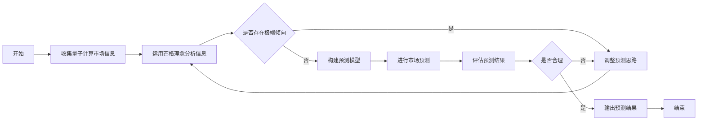

# 芒格的"避免极端预测"在量子计算市场预测中的应用

> 关键词：芒格、避免极端预测、量子计算、市场预测、风险评估

> 摘要：本文探讨了芒格提出的“避免极端预测”理念在量子计算市场预测中的应用。量子计算作为极具潜力但又充满不确定性的前沿领域，市场预测往往容易走向极端。通过深入分析芒格这一理念的内涵，阐述其在量子计算市场预测中的重要性，并结合相关原理、算法、数学模型等进行探讨，同时给出项目实战案例、实际应用场景等内容，旨在为量子计算市场预测提供更合理、稳健的思路和方法，降低预测的误差和风险。

## 1. 背景介绍 
### 1.1 目的和范围
本文章的主要目的是研究芒格的“避免极端预测”理念如何应用于量子计算市场预测。量子计算作为新兴技术，其市场发展具有高度的不确定性，传统的预测方法可能存在局限性。我们将通过分析该理念的内涵和量子计算市场的特点，探索更科学、合理的预测方法。研究范围涵盖量子计算市场的各个方面，包括技术发展趋势、市场规模、应用领域等。

### 1.2 预期读者
本文预期读者包括从事量子计算研究的科研人员、关注量子计算市场的投资者、相关行业的从业者以及对技术市场预测感兴趣的学者和爱好者。这些读者希望通过了解芒格的理念在量子计算市场预测中的应用，获得更深入的市场洞察和决策依据。

### 1.3 文档结构概述
本文首先介绍背景信息，包括目的、预期读者和文档结构概述等。接着阐述核心概念，包括芒格“避免极端预测”的原理和量子计算市场的相关概念。然后详细讲解核心算法原理、数学模型和公式，并给出具体操作步骤。通过项目实战案例展示该理念在实际中的应用，分析实际应用场景。最后推荐相关的工具和资源，总结未来发展趋势与挑战，解答常见问题，并提供扩展阅读和参考资料。

### 1.4 术语表
#### 1.4.1 核心术语定义
- **芒格的“避免极端预测”**：指在进行预测时，避免过于乐观或过于悲观的估计，保持理性和客观，充分考虑各种不确定性因素。
- **量子计算**：基于量子力学原理进行信息处理的计算模式，具有强大的计算能力和潜力。
- **市场预测**：对市场未来发展趋势、规模、需求等方面进行的预测和分析。

#### 1.4.2 相关概念解释
- **不确定性**：在量子计算市场中，由于技术发展的复杂性、竞争环境的变化等因素，导致市场未来发展存在多种可能性，难以准确预测。
- **风险评估**：对量子计算市场预测中可能存在的风险进行评估和分析，包括技术风险、市场风险、竞争风险等。

#### 1.4.3 缩略词列表
- **QC**：量子计算（Quantum Computing）
- **AI**：人工智能（Artificial Intelligence）

## 2. 核心概念与联系 
### 2.1 芒格的“避免极端预测”原理
芒格认为，在进行预测时，人们往往容易受到情绪、偏见和短期信息的影响，从而做出极端的预测。极端预测可能会导致过度乐观或过度悲观的决策，增加风险。为了避免这种情况，需要保持理性和客观，充分收集和分析各种信息，考虑到各种可能的情况和不确定性因素。

例如，在股票市场中，投资者可能会因为某只股票短期内的表现而过度乐观或悲观，做出不理性的投资决策。而芒格的理念提醒我们要从更长远、更全面的角度去看待问题，避免被短期的波动所左右。

### 2.2 量子计算市场的特点
量子计算市场具有以下特点：
- **技术前沿性**：量子计算是一种新兴的计算技术，其原理和应用还在不断探索和发展中，技术突破具有不确定性。
- **高投入和高风险**：量子计算的研发需要大量的资金和人力投入，而且研发周期长，失败的风险较高。
- **潜在市场规模巨大**：一旦量子计算技术取得重大突破，其在密码学、人工智能、药物研发等领域的应用将带来巨大的市场价值。

### 2.3 两者的联系
由于量子计算市场的不确定性和高风险性，传统的预测方法可能容易走向极端。芒格的“避免极端预测”理念可以为量子计算市场预测提供指导，帮助预测者保持理性和客观，充分考虑到技术发展的不确定性、市场竞争的变化等因素，从而做出更合理、更稳健的预测。

### 2.4 文本示意图
芒格的“避免极端预测”理念就像一个稳定的锚，在量子计算市场这个充满不确定性的海洋中，为市场预测提供稳定的方向。预测者可以以该理念为基础，综合考虑量子计算技术的发展趋势、市场需求、竞争环境等因素，构建合理的预测模型，避免因过度乐观或悲观而导致的错误决策。

### 2.5 Mermaid 流程图


## 3. 核心算法原理 & 具体操作步骤 
### 3.1 算法原理
我们可以采用贝叶斯推理算法结合芒格的“避免极端预测”理念进行量子计算市场预测。贝叶斯推理是一种基于概率的推理方法，它可以根据新的信息不断更新我们对某个事件的概率估计。

在量子计算市场预测中，我们可以先根据已有的信息和经验设定一个初始的预测概率分布，然后随着新的信息（如技术突破、市场动态等）的出现，利用贝叶斯公式更新这个概率分布，从而得到更准确的预测结果。

### 3.2 Python 源代码实现
```python
import numpy as np

# 初始的预测概率分布
prior_distribution = np.array([0.2, 0.3, 0.5])  # 假设分为低、中、高三种市场发展情况

# 新的信息（似然函数）
new_information = np.array([0.1, 0.6, 0.3])  # 新信息对不同情况的支持程度

# 计算后验概率分布
posterior_distribution = prior_distribution * new_information
posterior_distribution = posterior_distribution / np.sum(posterior_distribution)

print("后验概率分布:", posterior_distribution)
```

### 3.3 具体操作步骤
1. **收集信息**：收集量子计算市场的相关信息，包括技术发展趋势、市场需求、竞争情况等。
2. **设定初始概率分布**：根据已有的信息和经验，设定一个初始的预测概率分布，反映不同市场发展情况的可能性。
3. **获取新信息**：随着时间的推移，不断获取新的信息，如技术突破、市场动态等。
4. **计算似然函数**：根据新的信息，计算似然函数，反映新信息对不同市场发展情况的支持程度。
5. **更新概率分布**：利用贝叶斯公式，将初始概率分布和似然函数相乘，然后归一化，得到后验概率分布。
6. **评估预测结果**：根据后验概率分布，评估预测结果的合理性，如果存在极端倾向，调整预测思路，重复上述步骤。

## 4. 数学模型和公式 & 详细讲解 & 举例说明 
### 4.1 贝叶斯公式
贝叶斯公式是贝叶斯推理的核心公式，其数学表达式为：

$$P(A|B)=\frac{P(B|A)P(A)}{P(B)}$$

其中，$P(A|B)$ 表示在事件 $B$ 发生的条件下事件 $A$ 发生的概率，称为后验概率；$P(B|A)$ 表示在事件 $A$ 发生的条件下事件 $B$ 发生的概率，称为似然概率；$P(A)$ 表示事件 $A$ 发生的先验概率；$P(B)$ 表示事件 $B$ 发生的概率，称为证据概率。

### 4.2 详细讲解
在量子计算市场预测中，我们可以将不同的市场发展情况看作事件 $A$，新的信息看作事件 $B$。先验概率 $P(A)$ 是我们根据已有的信息和经验设定的初始概率分布，似然概率 $P(B|A)$ 是新信息对不同市场发展情况的支持程度，证据概率 $P(B)$ 可以通过对所有可能情况的 $P(B|A)P(A)$ 求和得到。

通过贝叶斯公式，我们可以根据新的信息不断更新后验概率 $P(A|B)$，从而得到更准确的市场预测。

### 4.3 举例说明
假设我们预测量子计算市场在未来一年内的发展情况，分为低增长、中增长、高增长三种情况，初始的概率分布为 $P(低增长)=0.2$，$P(中增长)=0.3$，$P(高增长)=0.5$。

现在我们得到了一个新的信息，该信息对低增长、中增长、高增长的支持程度分别为 $P(新信息|低增长)=0.1$，$P(新信息|中增长)=0.6$，$P(新信息|高增长)=0.3$。

首先，计算证据概率 $P(新信息)$：

$$P(新信息)=P(新信息|低增长)P(低增长)+P(新信息|中增长)P(中增长)+P(新信息|高增长)P(高增长)$$

$$=0.1\times0.2 + 0.6\times0.3 + 0.3\times0.5$$

$$=0.02 + 0.18 + 0.15 = 0.35$$

然后，根据贝叶斯公式计算后验概率：

$$P(低增长|新信息)=\frac{P(新信息|低增长)P(低增长)}{P(新信息)}=\frac{0.1\times0.2}{0.35}\approx0.057$$

$$P(中增长|新信息)=\frac{P(新信息|中增长)P(中增长)}{P(新信息)}=\frac{0.6\times0.3}{0.35}\approx0.514$$

$$P(高增长|新信息)=\frac{P(新信息|高增长)P(高增长)}{P(新信息)}=\frac{0.3\times0.5}{0.35}\approx0.429$$

通过这个例子可以看出，新的信息对市场预测的概率分布产生了影响，我们可以根据更新后的概率分布做出更合理的决策。

## 5. 项目实战：代码实际案例和详细解释说明 
### 5.1 开发环境搭建
- **操作系统**：推荐使用 Windows、Linux 或 macOS 操作系统。
- **编程语言**：Python 3.x。
- **开发工具**：可以使用 PyCharm、Jupyter Notebook 等开发工具。
- **安装必要的库**：使用以下命令安装必要的库：
```sh
pip install numpy
```

### 5.2 源代码详细实现和代码解读
```python
import numpy as np

# 定义初始的预测概率分布
def set_prior_distribution():
    """
    设定初始的预测概率分布，这里假设分为低、中、高三种市场发展情况
    :return: 初始概率分布数组
    """
    return np.array([0.2, 0.3, 0.5])

# 定义新的信息（似然函数）
def get_new_information():
    """
    获取新的信息，这里假设新信息对不同情况的支持程度
    :return: 似然函数数组
    """
    return np.array([0.1, 0.6, 0.3])

# 计算后验概率分布
def calculate_posterior_distribution(prior_distribution, new_information):
    """
    根据贝叶斯公式计算后验概率分布
    :param prior_distribution: 初始概率分布数组
    :param new_information: 似然函数数组
    :return: 后验概率分布数组
    """
    posterior_distribution = prior_distribution * new_information
    posterior_distribution = posterior_distribution / np.sum(posterior_distribution)
    return posterior_distribution

# 主函数
def main():
    # 设定初始概率分布
    prior_distribution = set_prior_distribution()
    print("初始概率分布:", prior_distribution)

    # 获取新的信息
    new_information = get_new_information()
    print("新的信息（似然函数）:", new_information)

    # 计算后验概率分布
    posterior_distribution = calculate_posterior_distribution(prior_distribution, new_information)
    print("后验概率分布:", posterior_distribution)

if __name__ == "__main__":
    main()
```

### 5.3 代码解读与分析
- **`set_prior_distribution` 函数**：该函数用于设定初始的预测概率分布，这里我们假设分为低、中、高三种市场发展情况，并返回一个包含这三种情况概率的数组。
- **`get_new_information` 函数**：该函数用于获取新的信息，即似然函数，这里我们假设新信息对不同情况的支持程度，并返回一个包含这些支持程度的数组。
- **`calculate_posterior_distribution` 函数**：该函数根据贝叶斯公式计算后验概率分布，首先将初始概率分布和似然函数相乘，然后归一化得到后验概率分布。
- **`main` 函数**：主函数，依次调用上述函数，输出初始概率分布、新的信息和后验概率分布。

通过这个代码案例，我们可以看到如何利用贝叶斯推理算法结合芒格的“避免极端预测”理念进行量子计算市场预测。在实际应用中，我们可以根据具体情况调整初始概率分布和似然函数，以得到更准确的预测结果。

## 6. 实际应用场景 
### 6.1 投资者决策
对于投资者来说，量子计算市场的预测结果可以帮助他们做出更合理的投资决策。通过避免极端预测，投资者可以更客观地评估量子计算企业的发展前景和风险，避免盲目跟风或过度谨慎。例如，在决定是否投资一家量子计算初创企业时，投资者可以根据综合的市场预测结果，结合企业的技术实力、团队背景等因素，做出更明智的投资决策。

### 6.2 企业战略规划
量子计算企业可以利用市场预测结果制定更合理的战略规划。避免极端预测可以帮助企业更好地把握市场趋势，合理安排研发资源和市场推广策略。例如，企业可以根据市场预测结果，确定在不同阶段的研发重点和市场拓展方向，避免过度投入或错失市场机会。

### 6.3 政策制定
政府部门在制定相关政策时，也可以参考量子计算市场的预测结果。通过避免极端预测，政府可以更准确地评估量子计算技术对经济、社会的影响，制定出更符合实际情况的政策，促进量子计算产业的健康发展。例如，政府可以根据市场预测结果，确定对量子计算研发的资金支持力度和政策优惠措施。

## 7. 工具和资源推荐
### 7.1 学习资源推荐
#### 7.1.1 书籍推荐
- 《穷查理宝典：查理·芒格的智慧箴言录》：详细介绍了芒格的投资理念和思维方式，对于理解“避免极端预测”理念具有重要参考价值。
- 《量子计算与量子信息》：全面介绍了量子计算的基本原理、算法和应用，是学习量子计算的经典教材。

#### 7.1.2 在线课程
- Coursera 上的“Quantum Computing for Everyone”：适合初学者了解量子计算的基本概念和原理。
- edX 上的“Introduction to Quantum Computing”：提供了更深入的量子计算知识和技术讲解。

#### 7.1.3 技术博客和网站
- arXiv.org：一个预印本服务器，提供了大量关于量子计算的最新研究成果和论文。
- Quantum Computing Report：专注于量子计算领域的新闻和分析，提供了丰富的市场信息和行业动态。

### 7.2 开发工具框架推荐
#### 7.2.1 IDE和编辑器
- PyCharm：功能强大的 Python 集成开发环境，提供了代码编辑、调试、版本控制等功能。
- Jupyter Notebook：交互式的开发环境，适合进行数据分析和算法实验。

#### 7.2.2 调试和性能分析工具
- PDB：Python 自带的调试工具，可以帮助开发者定位和解决代码中的问题。
- cProfile：Python 标准库中的性能分析工具，可以分析代码的执行时间和资源消耗情况。

#### 7.2.3 相关框架和库
- Qiskit：IBM 开发的开源量子计算框架，提供了量子算法的实现和模拟工具。
- Cirq：Google 开发的量子计算框架，支持量子电路的设计和模拟。

### 7.3 相关论文著作推荐
#### 7.3.1 经典论文
- “The Physical Implementation of Quantum Computation”：详细介绍了量子计算的物理实现方法和技术挑战。
- “Quantum Algorithms and Complexity”：对量子算法的复杂度和性能进行了深入分析。

#### 7.3.2 最新研究成果
- 关注 arXiv.org 上的最新预印本论文，了解量子计算领域的最新研究进展。

#### 7.3.3 应用案例分析
- 一些行业报告和研究机构的分析报告，提供了量子计算在不同领域的应用案例和市场分析。

## 8. 总结：未来发展趋势与挑战
### 8.1 未来发展趋势
- **技术突破加速**：随着研究的不断深入和技术的不断进步，量子计算技术有望在未来取得更多的突破，计算能力将不断提高。
- **应用领域拓展**：量子计算将在更多的领域得到应用，如密码学、人工智能、药物研发、金融等，为这些领域带来革命性的变化。
- **产业生态完善**：量子计算产业将逐渐形成完善的生态系统，包括硬件制造商、软件开发商、服务提供商等，促进产业的快速发展。

### 8.2 挑战
- **技术难题**：量子计算技术还面临着许多技术难题，如量子比特的稳定性、量子纠错等，需要进一步的研究和突破。
- **市场不确定性**：量子计算市场的发展仍然存在很大的不确定性，技术的发展速度、市场需求的变化等因素都难以准确预测。
- **人才短缺**：量子计算领域的专业人才相对短缺，需要加强人才培养和引进，以满足产业发展的需求。

在未来的量子计算市场预测中，我们需要继续应用芒格的“避免极端预测”理念，充分考虑这些发展趋势和挑战，不断调整和完善预测方法，以提高预测的准确性和可靠性。

## 9. 附录：常见问题与解答
### 9.1 为什么要避免极端预测？
极端预测可能会导致过度乐观或过度悲观的决策，增加风险。在量子计算市场这样充满不确定性的领域，极端预测更容易偏离实际情况，从而给投资者、企业和政策制定者带来损失。因此，避免极端预测可以帮助我们做出更合理、更稳健的决策。

### 9.2 如何判断预测是否存在极端倾向？
可以通过分析预测结果是否过于偏离历史数据、行业平均水平或其他合理的参考标准来判断。同时，要考虑预测所依据的信息是否全面、客观，是否受到情绪、偏见等因素的影响。如果预测结果过于乐观或悲观，且缺乏合理的依据，就可能存在极端倾向。

### 9.3 贝叶斯推理算法在量子计算市场预测中的局限性是什么？
贝叶斯推理算法依赖于先验概率和似然函数的设定，而这些设定往往具有一定的主观性。在量子计算市场中，由于信息的不确定性和不完整性，先验概率和似然函数的确定可能存在困难。此外，贝叶斯推理算法假设数据是独立同分布的，而在实际的市场预测中，数据之间可能存在复杂的相关性，这也会影响算法的准确性。

## 10. 扩展阅读 & 参考资料
### 10.1 扩展阅读
- 《思考，快与慢》：探讨了人类思维的两种模式，以及在决策过程中可能出现的认知偏差，对于理解预测中的极端倾向具有参考价值。
- 《创新者的窘境》：分析了新兴技术对传统产业的冲击和挑战，对于理解量子计算市场的发展和变化具有启示意义。

### 10.2 参考资料
- 相关的学术论文、研究报告和行业数据。
- 各大科技公司和研究机构发布的关于量子计算的新闻和公告。
- 政府部门发布的相关政策文件和统计数据。