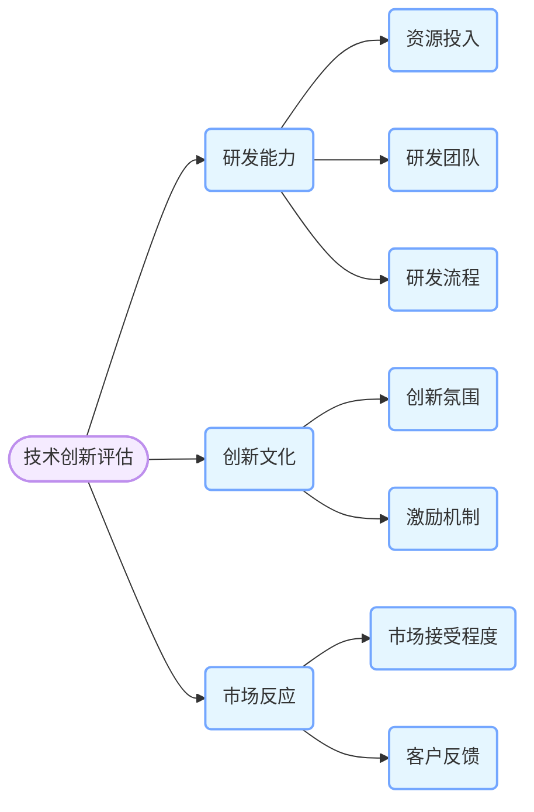

# 菲利普·费雪的技术创新评估方法

> 关键词：菲利普·费雪、技术创新评估、投资分析、企业评估、成长型企业、创新能力、评估方法

> 摘要：本文深入探讨了菲利普·费雪的技术创新评估方法。费雪作为投资领域的传奇人物，其对技术创新的评估方法对于投资者判断企业的长期投资价值以及企业自身评估创新能力有着重要的指导意义。文章首先介绍了该评估方法的背景，包括目的、预期读者等内容。接着阐述核心概念与联系，通过示意图和流程图直观展示。详细讲解核心算法原理与操作步骤，结合Python代码示例。用数学模型和公式进一步剖析其内在逻辑，并举例说明。通过项目实战案例展示代码实现与解读。分析该评估方法的实际应用场景，推荐相关的学习资源、开发工具框架以及论文著作。最后总结未来发展趋势与挑战，解答常见问题并提供扩展阅读和参考资料，旨在全面深入地呈现菲利普·费雪的技术创新评估方法。

## 1. 背景介绍 
### 1.1 目的和范围
菲利普·费雪的技术创新评估方法旨在帮助投资者识别具有长期成长潜力的企业，尤其是那些在技术创新方面表现突出的企业。通过对企业技术创新能力的全面评估，投资者可以更准确地判断企业的投资价值，做出更明智的投资决策。同时，该方法也可为企业自身提供评估其创新能力的框架，有助于企业发现自身优势与不足，从而制定更有效的创新战略。

本方法的范围涵盖了多个行业，包括但不限于科技、医疗、制造等领域。它主要关注企业的研发能力、创新文化、市场反应等与技术创新相关的关键因素，通过对这些因素的综合分析来评估企业的技术创新水平。

### 1.2 预期读者
本文的预期读者包括投资者，无论是个人投资者还是机构投资者，都可以从菲利普·费雪的技术创新评估方法中获取有价值的投资决策依据。企业管理者也能从中受益，通过了解该评估方法，他们可以更好地评估企业的创新能力，制定相应的发展战略。此外，对技术创新和投资领域感兴趣的研究人员和学者也可以将本文作为研究参考。

### 1.3 文档结构概述
本文首先介绍菲利普·费雪的技术创新评估方法的背景，包括目的、预期读者和文档结构概述等内容。接着阐述核心概念与联系，通过文本示意图和Mermaid流程图展示该评估方法的原理和架构。然后详细讲解核心算法原理与具体操作步骤，并结合Python代码进行说明。再用数学模型和公式进一步剖析其内在逻辑，并举例说明。通过项目实战案例展示代码实现与解读。分析该评估方法的实际应用场景，推荐相关的学习资源、开发工具框架以及论文著作。最后总结未来发展趋势与挑战，解答常见问题并提供扩展阅读和参考资料。

### 1.4 术语表
#### 1.4.1 核心术语定义
- **技术创新**：指企业通过引入新的技术、产品、工艺或商业模式，创造出更高的价值，提升企业的竞争力。
- **创新文化**：企业内部鼓励创新、容忍失败、支持员工发挥创造力的文化氛围。
- **研发能力**：企业在研究和开发方面的资源投入、技术实力和创新效率。
- **市场反应**：市场对企业创新产品或服务的接受程度和反馈。

#### 1.4.2 相关概念解释
- **成长型企业**：指那些具有高于行业平均增长速度，通过技术创新、市场拓展等方式不断扩大规模和提升竞争力的企业。
- **投资价值**：指企业对于投资者的吸引力和潜在回报，取决于企业的盈利能力、成长潜力、创新能力等因素。

#### 1.4.3 缩略词列表
- **R&D**：Research and Development，即研究与开发。

## 2. 核心概念与联系 

### 核心概念原理
菲利普·费雪的技术创新评估方法基于对企业多个关键因素的综合分析，以评估企业的技术创新能力和投资价值。核心概念包括研发能力、创新文化、市场反应等。

研发能力是企业进行技术创新的基础，它涉及到企业的研发资源投入、研发团队的专业水平、研发流程的效率等方面。创新文化则为企业的技术创新提供了良好的环境和氛围，鼓励员工积极参与创新活动，容忍失败，激发员工的创造力。市场反应是衡量企业创新成果是否成功的重要指标，它反映了市场对企业创新产品或服务的接受程度和需求状况。

这些核心概念相互关联、相互影响。研发能力的强弱直接影响企业的创新成果；创新文化能够促进研发能力的提升和创新成果的产生；而市场反应则会反馈给企业，影响企业的研发方向和创新策略。

### 架构的文本示意图
```plaintext
             技术创新评估
                |
       +--------+--------+
       |        |        |
  研发能力  创新文化  市场反应
       |        |        |
  +-----+     +-----+  +-----+
  | 资源 |     | 氛围 |  | 接受 |
  | 投入 |     | 激励 |  | 程度 |
  +-----+     +-----+  +-----+
```

### Mermaid 流程图


## 3. 核心算法原理 & 具体操作步骤 

### 核心算法原理
菲利普·费雪的技术创新评估方法可以通过综合评估研发能力、创新文化和市场反应等因素来实现。我们可以为每个因素设定相应的权重，然后根据各项指标的得分计算出企业的技术创新评估得分。

假设研发能力的权重为 $w_1$，创新文化的权重为 $w_2$，市场反应的权重为 $w_3$，且 $w_1 + w_2 + w_3 = 1$。各项因素的得分分别为 $s_1$、$s_2$、$s_3$，则企业的技术创新评估得分 $S$ 可以通过以下公式计算：

$$S = w_1 \times s_1 + w_2 \times s_2 + w_3 \times s_3$$

### 具体操作步骤
1. **确定评估因素和权重**：根据企业所处的行业特点和发展阶段，确定研发能力、创新文化和市场反应等评估因素，并为每个因素设定相应的权重。例如，对于科技型企业，研发能力的权重可能相对较高；对于服务型企业，市场反应的权重可能更为重要。
2. **制定评估指标体系**：为每个评估因素制定具体的评估指标。例如，对于研发能力，可以包括研发投入占比、研发人员数量、专利数量等指标；对于创新文化，可以包括员工创新提案数量、创新奖励制度等指标；对于市场反应，可以包括新产品销售额占比、客户满意度等指标。
3. **收集数据并计算得分**：收集企业各项评估指标的数据，并根据预先设定的评分标准计算每个指标的得分。然后，将各项指标的得分汇总，得到每个评估因素的得分。
4. **计算技术创新评估得分**：根据上述公式，将每个评估因素的得分乘以相应的权重，然后相加，得到企业的技术创新评估得分。

### Python 源代码示例
```python
# 定义评估因素的权重
w1 = 0.4  # 研发能力权重
w2 = 0.3  # 创新文化权重
w3 = 0.3  # 市场反应权重

# 定义各项评估因素的得分
s1 = 80  # 研发能力得分
s2 = 70  # 创新文化得分
s3 = 75  # 市场反应得分

# 计算技术创新评估得分
S = w1 * s1 + w2 * s2 + w3 * s3

print(f"企业的技术创新评估得分: {S}")
```

## 4. 数学模型和公式 & 详细讲解 & 举例说明 

### 数学模型和公式
如前文所述，菲利普·费雪的技术创新评估方法的数学模型可以表示为：

$$S = w_1 \times s_1 + w_2 \times s_2 + w_3 \times s_3$$

其中，$S$ 表示企业的技术创新评估得分，$w_1$、$w_2$、$w_3$ 分别表示研发能力、创新文化和市场反应的权重，$s_1$、$s_2$、$s_3$ 分别表示研发能力、创新文化和市场反应的得分。

### 详细讲解
这个数学模型的核心思想是通过加权平均的方法，综合考虑研发能力、创新文化和市场反应等多个因素对企业技术创新能力的影响。权重的设定反映了每个因素在评估中的相对重要性，得分则反映了企业在每个因素方面的表现。

通过这种方式，我们可以得到一个综合的评估得分，用于比较不同企业的技术创新能力，或者评估企业在不同时期的技术创新能力变化。

### 举例说明
假设我们要评估两家企业 A 和 B 的技术创新能力。我们设定研发能力的权重 $w_1 = 0.4$，创新文化的权重 $w_2 = 0.3$，市场反应的权重 $w_3 = 0.3$。

企业 A 的研发能力得分 $s_{1A} = 85$，创新文化得分 $s_{2A} = 75$，市场反应得分 $s_{3A} = 80$。则企业 A 的技术创新评估得分 $S_A$ 为：

$$S_A = 0.4 \times 85 + 0.3 \times 75 + 0.3 \times 80$$
$$S_A = 34 + 22.5 + 24$$
$$S_A = 80.5$$

企业 B 的研发能力得分 $s_{1B} = 80$，创新文化得分 $s_{2B} = 85$，市场反应得分 $s_{3B} = 70$。则企业 B 的技术创新评估得分 $S_B$ 为：

$$S_B = 0.4 \times 80 + 0.3 \times 85 + 0.3 \times 70$$
$$S_B = 32 + 25.5 + 21$$
$$S_B = 78.5$$

通过比较 $S_A$ 和 $S_B$，我们可以得出企业 A 的技术创新能力相对较强。

## 5. 项目实战：代码实际案例和详细解释说明 

### 5.1  开发环境搭建
在进行项目实战之前，我们需要搭建相应的开发环境。以下是具体步骤：

1. **安装 Python**：从 Python 官方网站（https://www.python.org/downloads/）下载并安装适合你操作系统的 Python 版本。建议安装 Python 3.7 及以上版本。
2. **安装开发工具**：可以选择安装 PyCharm、Visual Studio Code 等集成开发环境（IDE），或者使用 Jupyter Notebook 进行交互式开发。
3. **安装必要的库**：在本项目中，我们主要使用 Python 的基本库，无需额外安装其他库。

### 5.2  源代码详细实现和代码解读
以下是一个完整的 Python 代码示例，用于实现菲利普·费雪的技术创新评估方法：

```python
# 定义评估因素的权重
weights = {
    "研发能力": 0.4,
    "创新文化": 0.3,
    "市场反应": 0.3
}

# 定义企业列表
companies = [
    {
        "名称": "企业 A",
        "研发能力得分": 85,
        "创新文化得分": 75,
        "市场反应得分": 80
    },
    {
        "名称": "企业 B",
        "研发能力得分": 80,
        "创新文化得分": 85,
        "市场反应得分": 70
    }
]

# 计算每个企业的技术创新评估得分
for company in companies:
    score = (
        weights["研发能力"] * company["研发能力得分"] +
        weights["创新文化"] * company["创新文化得分"] +
        weights["市场反应"] * company["市场反应得分"]
    )
    company["技术创新评估得分"] = score

# 输出每个企业的技术创新评估得分
for company in companies:
    print(f"{company['名称']} 的技术创新评估得分: {company['技术创新评估得分']}")
```

### 代码解读与分析
1. **定义评估因素的权重**：使用字典 `weights` 来存储研发能力、创新文化和市场反应的权重。
2. **定义企业列表**：使用列表 `companies` 来存储要评估的企业信息，每个企业信息用字典表示，包含企业名称、研发能力得分、创新文化得分和市场反应得分。
3. **计算每个企业的技术创新评估得分**：使用循环遍历企业列表，根据加权平均公式计算每个企业的技术创新评估得分，并将得分添加到企业信息字典中。
4. **输出每个企业的技术创新评估得分**：使用循环遍历企业列表，输出每个企业的技术创新评估得分。

通过这个代码示例，我们可以方便地对多个企业进行技术创新评估，并比较它们的评估得分。

## 6. 实际应用场景 
### 投资决策
在投资领域，菲利普·费雪的技术创新评估方法可以帮助投资者筛选具有长期成长潜力的企业。投资者可以使用该方法对不同企业的技术创新能力进行评估，选择技术创新能力较强的企业进行投资。例如，在科技行业，投资者可以通过评估企业的研发能力、创新文化和市场反应等因素，判断企业是否具有推出具有竞争力的新产品或服务的能力，从而决定是否投资该企业。

### 企业战略规划
企业管理者可以使用该评估方法来评估企业的技术创新能力，发现企业的优势和不足，从而制定更有效的创新战略。例如，如果企业在研发能力方面得分较低，管理者可以考虑增加研发投入，引进高端研发人才；如果企业在创新文化方面存在问题，管理者可以采取措施营造良好的创新氛围，建立激励机制，鼓励员工创新。

### 行业分析
研究人员和学者可以使用该方法对整个行业的技术创新水平进行评估和分析，了解行业的发展趋势和竞争格局。通过比较不同企业的技术创新评估得分，研究人员可以发现行业中的领先企业和创新驱动因素，为行业的发展提供参考和建议。

## 7. 工具和资源推荐
### 7.1 学习资源推荐
#### 7.1.1 书籍推荐
- 《怎样选择成长股》（菲利普·费雪著）：这是菲利普·费雪的经典著作，书中详细阐述了他的投资理念和方法，包括对企业成长潜力的评估和技术创新的关注。
- 《创新者的窘境》（克莱顿·克里斯坦森著）：该书探讨了企业在创新过程中面临的挑战和机遇，对于理解技术创新的本质和规律具有重要的参考价值。

#### 7.1.2 在线课程
- Coursera 平台上的“创新管理”课程：该课程由知名教授授课，系统地介绍了创新管理的理论和方法，包括技术创新评估、创新战略制定等内容。
- edX 平台上的“技术创新与创业”课程：该课程结合实际案例，讲解了技术创新的过程和创业的方法，对于提升创新能力和创业技能具有很大的帮助。

#### 7.1.3 技术博客和网站
- 36氪：专注于科技、创新领域的资讯平台，提供最新的技术创新动态、企业创新案例和行业分析报告。
- 虎嗅网：汇聚了众多创新领域的专家和创业者，分享他们的观点和经验，对于了解创新趋势和行业发展具有重要的参考价值。

### 7.2 开发工具框架推荐
#### 7.2.1 IDE和编辑器
- PyCharm：一款专业的 Python 集成开发环境，具有强大的代码编辑、调试和项目管理功能，适合 Python 开发者使用。
- Visual Studio Code：一款轻量级的代码编辑器，支持多种编程语言，具有丰富的插件扩展功能，可用于快速开发和调试代码。

#### 7.2.2 调试和性能分析工具
- Py-Spy：一款用于分析 Python 程序性能的工具，可以帮助开发者找出程序中的性能瓶颈，提高程序的运行效率。
- PDB：Python 内置的调试器，可以帮助开发者在程序运行过程中进行调试，找出程序中的错误和问题。

#### 7.2.3 相关框架和库
- Pandas：一个强大的数据处理和分析库，可用于数据的读取、清洗、转换和分析，在技术创新评估中可用于处理和分析企业的各项指标数据。
- Matplotlib：一个用于数据可视化的库，可以将评估结果以图表的形式直观地展示出来，方便用户进行分析和比较。

### 7.3 相关论文著作推荐
#### 7.3.1 经典论文
- “The Sources of Innovation”（Eric von Hippel 著）：该论文探讨了创新的来源和机制，对于理解技术创新的本质和规律具有重要的参考价值。
- “A Dynamic Model of Process and Product Innovation”（William J. Abernathy 和 James M. Utterback 著）：该论文提出了一个关于过程创新和产品创新的动态模型，对于企业的创新战略制定具有重要的指导意义。

#### 7.3.2 最新研究成果
- 关注顶级学术期刊如《Management Science》、《Strategic Management Journal》等，这些期刊上发表了许多关于技术创新和企业战略的最新研究成果。

#### 7.3.3 应用案例分析
- 《哈佛商业评论》上的案例研究：该杂志经常发表关于企业创新和战略的案例分析，通过实际案例展示了企业在技术创新方面的成功经验和失败教训，对于理解和应用菲利普·费雪的技术创新评估方法具有重要的参考价值。

## 8. 总结：未来发展趋势与挑战
### 未来发展趋势
1. **数字化和智能化**：随着信息技术的快速发展，企业的技术创新将越来越依赖于数字化和智能化技术。例如，人工智能、大数据、物联网等技术将在企业的研发、生产、营销等各个环节得到广泛应用，提高企业的创新效率和竞争力。
2. **开放式创新**：未来企业将更加注重与外部合作伙伴的合作，通过开放式创新模式整合外部资源，加速技术创新的进程。例如，企业可以与高校、科研机构、供应商、客户等建立合作关系，共同开展研发项目，共享创新成果。
3. **可持续创新**：随着社会对可持续发展的关注度不断提高，企业的技术创新将更加注重环境友好、社会责任等因素。例如，企业将加大在清洁能源、环保技术、绿色产品等领域的研发投入，推动可持续创新的发展。

### 挑战
1. **技术变革快速**：技术的快速变革使得企业面临着更大的创新压力。企业需要不断投入资源进行研发，以跟上技术发展的步伐，否则就可能被市场淘汰。
2. **人才短缺**：技术创新需要大量的高素质人才，包括研发人才、创新管理人才等。然而，目前市场上这类人才相对短缺，企业在吸引和留住人才方面面临着挑战。
3. **知识产权保护**：在技术创新过程中，知识产权保护至关重要。然而，随着技术的快速传播和复制，企业的知识产权面临着更大的风险。如何有效地保护企业的知识产权，是企业面临的一个重要挑战。

## 9. 附录：常见问题与解答
### 1. 如何确定评估因素的权重？
评估因素的权重应根据企业所处的行业特点、发展阶段和战略目标等因素来确定。例如，对于科技型企业，研发能力的权重可能相对较高；对于服务型企业，市场反应的权重可能更为重要。可以通过专家咨询、历史数据分析等方法来确定合理的权重。

### 2. 评估指标的得分如何计算？
评估指标的得分可以根据预先设定的评分标准来计算。评分标准可以根据指标的性质和要求进行设定，例如，对于研发投入占比指标，可以根据行业平均水平和企业的实际情况设定不同的得分区间。

### 3. 该评估方法是否适用于所有行业？
该评估方法具有一定的通用性，但不同行业的技术创新特点和重点可能有所不同。在应用该评估方法时，需要根据行业特点对评估因素和指标进行适当调整，以确保评估结果的准确性和有效性。

### 4. 如何提高企业的技术创新评估得分？
企业可以通过加强研发能力建设、营造良好的创新文化、提高市场反应速度等方式来提高技术创新评估得分。例如，增加研发投入、引进高端研发人才、建立创新激励机制、加强市场调研等。

## 10. 扩展阅读 & 参考资料
### 扩展阅读
- 《竞争战略》（迈克尔·波特著）：该书阐述了企业竞争战略的基本理论和方法，对于理解企业的市场竞争和技术创新具有重要的参考价值。
- 《从0到1》（彼得·蒂尔著）：该书探讨了创业和创新的本质和方法，对于创业者和创新者具有重要的启示作用。

### 参考资料
- 菲利普·费雪的相关著作和论文。
- 相关学术期刊和研究报告，如《管理世界》、《中国工业经济》等。
- 企业的年报、招股说明书等公开信息。