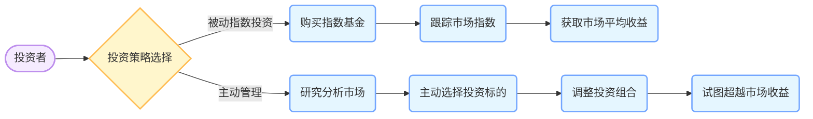

# 被动指数投资vs主动管理：哪种更适合当前市场环境

> 关键词：被动指数投资、主动管理、市场环境、投资策略、风险收益

> 摘要：本文深入探讨了被动指数投资和主动管理这两种投资方式，通过对其核心概念、算法原理、数学模型的详细分析，结合项目实战案例和实际应用场景，比较了它们在不同市场环境下的表现。旨在帮助投资者更好地理解这两种投资方式的特点和优劣，从而在当前市场环境中做出更合适的投资决策。同时，文章还推荐了相关的学习资源、开发工具和研究论文，最后对未来投资领域的发展趋势与挑战进行了总结，并解答了常见问题。

## 1. 背景介绍 
### 1.1 目的和范围
在当今复杂多变的金融市场中，投资者面临着众多的投资选择，而被动指数投资和主动管理是两种备受关注的投资策略。本文章的目的在于全面、深入地分析这两种投资策略，比较它们在不同市场环境下的适用性，为投资者提供决策依据。文章的范围涵盖了这两种投资策略的基本概念、原理、实际应用以及相关的工具和资源推荐等方面。

### 1.2 预期读者
本文预期读者包括对金融投资领域感兴趣的初学者，希望通过学习不同投资策略来优化投资组合的中级投资者，以及从事金融研究和投资咨询工作的专业人士。无论您是刚刚接触投资领域，还是已经有一定投资经验，都能从本文中获取有价值的信息。

### 1.3 文档结构概述
本文将按照以下结构进行阐述：首先介绍被动指数投资和主动管理的背景信息，包括目的、预期读者和文档结构概述等。接着详细讲解这两种投资策略的核心概念与联系，通过文本示意图和 Mermaid 流程图展示其原理和架构。然后阐述核心算法原理和具体操作步骤，并给出 Python 源代码进行详细说明。再通过数学模型和公式对其进行分析，并举例说明。之后通过项目实战案例，包括开发环境搭建、源代码实现和代码解读，深入分析这两种投资策略的实际应用。随后探讨它们在不同实际应用场景中的表现。接着推荐相关的学习资源、开发工具和研究论文。最后对未来投资领域的发展趋势与挑战进行总结，并解答常见问题，提供扩展阅读和参考资料。

### 1.4 术语表
#### 1.4.1 核心术语定义
- **被动指数投资**：一种复制特定市场指数表现的投资策略，投资者通过购买指数基金等工具，以获取与市场指数相近的收益。
- **主动管理**：基金经理或投资者通过对市场的研究和分析，主动选择投资标的，试图超越市场平均收益的投资策略。
- **市场指数**：反映某一特定市场或行业整体表现的统计指标，如沪深 300 指数、标普 500 指数等。
- **跟踪误差**：被动指数投资组合的收益率与目标指数收益率之间的差异，反映了被动指数投资对指数的跟踪程度。
- **阿尔法（α）**：衡量主动管理投资组合超越市场基准收益的能力指标。

#### 1.4.2 相关概念解释
- **有效市场假说**：该假说认为在有效市场中，资产价格已经反映了所有可用的信息，因此很难通过主动管理持续获得超额收益。
- **分散投资**：通过投资多种不同的资产来降低单一资产波动对投资组合的影响，提高投资组合的稳定性。
- **风险调整后收益**：考虑了投资风险因素后的收益指标，常见的有夏普比率等，用于评估投资组合在承担一定风险下的收益表现。

#### 1.4.3 缩略词列表
- **ETF**：交易型开放式指数基金（Exchange Traded Fund）
- **CAPM**：资本资产定价模型（Capital Asset Pricing Model）
- **Sharpe Ratio**：夏普比率

## 2. 核心概念与联系 

### 被动指数投资
被动指数投资的核心原理是通过构建一个与特定市场指数成分股相同或相似的投资组合，来跟踪该指数的表现。其目标是获取市场平均收益，而不是试图超越市场。这种投资方式的优点在于成本低、透明度高、分散风险等。例如，投资者购买沪深 300 指数基金，就相当于投资了沪深两市中规模大、流动性好的 300 只股票，能够分享整个市场的发展成果。

### 主动管理
主动管理则强调基金经理或投资者的主观判断和决策能力。他们通过对宏观经济、行业发展、公司基本面等多方面的研究和分析，主动选择投资标的，调整投资组合的结构，试图在市场中发现被低估或具有潜力的资产，从而获得超越市场平均水平的收益。主动管理的优点在于能够根据市场变化及时调整投资策略，但同时也面临着更高的管理成本和投资风险。

### 两者的联系
被动指数投资和主动管理并不是完全对立的，它们在投资组合中可以相互补充。例如，投资者可以将一部分资金用于被动指数投资，以获取市场平均收益，降低投资风险；另一部分资金用于主动管理，试图获取超额收益。此外，主动管理的投资策略也可以参考市场指数的表现，以评估自己的投资绩效。

### 文本示意图
```plaintext
被动指数投资：
投资者 -> 购买指数基金 -> 跟踪市场指数 -> 获取市场平均收益

主动管理：
投资者/基金经理 -> 研究分析市场 -> 主动选择投资标的 -> 调整投资组合 -> 试图超越市场收益
```

### Mermaid 流程图


## 3. 核心算法原理 & 具体操作步骤 

### 被动指数投资算法原理及 Python 实现
被动指数投资的核心算法是按照指数成分股的权重来构建投资组合。以下是一个简单的 Python 示例，用于模拟根据沪深 300 指数成分股权重构建投资组合的过程。

```python
import pandas as pd

# 假设已经获取到沪深 300 指数成分股的代码和权重数据
# 这里简单模拟一些数据
stock_codes = ['000001', '000002', '000003']
weights = [0.3, 0.4, 0.3]

# 创建一个 DataFrame 来存储成分股信息
index_components = pd.DataFrame({
    'stock_code': stock_codes,
    'weight': weights
})

# 假设投资者有 100000 元资金
total_funds = 100000

# 计算每只股票的投资金额
index_components['investment_amount'] = index_components['weight'] * total_funds

print(index_components)
```

### 代码解释
1. 首先，我们导入了 `pandas` 库，用于数据处理和分析。
2. 然后，我们模拟了沪深 300 指数成分股的代码和权重数据，并将其存储在一个 `DataFrame` 中。
3. 接着，我们设定了投资者的总资金为 100000 元。
4. 最后，我们根据成分股的权重计算出每只股票的投资金额，并将结果打印输出。

### 主动管理算法原理及 Python 实现
主动管理的算法原理相对复杂，通常涉及到对市场数据的分析和预测。以下是一个简单的示例，用于模拟根据股票的基本面数据（如市盈率、市净率等）来选择投资标的的过程。

```python
import pandas as pd

# 假设已经获取到一些股票的基本面数据
# 这里简单模拟一些数据
stock_data = {
    'stock_code': ['000001', '000002', '000003'],
    'pe_ratio': [10, 20, 15],
    'pb_ratio': [2, 3, 2.5]
}

# 创建一个 DataFrame 来存储股票数据
df = pd.DataFrame(stock_data)

# 设定筛选条件：市盈率小于 18 且市净率小于 3
selected_stocks = df[(df['pe_ratio'] < 18) & (df['pb_ratio'] < 3)]

print(selected_stocks)
```

### 代码解释
1. 同样，我们导入了 `pandas` 库。
2. 然后，我们模拟了一些股票的基本面数据，并将其存储在一个 `DataFrame` 中。
3. 接着，我们设定了筛选条件，即市盈率小于 18 且市净率小于 3。
4. 最后，我们根据筛选条件选择出符合要求的股票，并将结果打印输出。

## 4. 数学模型和公式 & 详细讲解 & 举例说明 

### 被动指数投资数学模型
被动指数投资的核心目标是跟踪市场指数，其跟踪误差可以用以下公式表示：

$$
TE = \sqrt{\frac{1}{T}\sum_{t=1}^{T}(R_{p,t} - R_{b,t})^2}
$$

其中，$TE$ 表示跟踪误差，$T$ 表示时间周期数，$R_{p,t}$ 表示投资组合在第 $t$ 期的收益率，$R_{b,t}$ 表示基准指数在第 $t$ 期的收益率。

### 举例说明
假设我们有一个跟踪沪深 300 指数的被动指数投资组合，在过去 5 个周期的收益率分别为 0.02、0.03、0.01、0.04、0.02，而沪深 300 指数在这 5 个周期的收益率分别为 0.025、0.032、0.008、0.042、0.018。则跟踪误差的计算过程如下：

1. 计算每期的收益率差值：
   - 第 1 期：$0.02 - 0.025 = -0.005$
   - 第 2 期：$0.03 - 0.032 = -0.002$
   - 第 3 期：$0.01 - 0.008 = 0.002$
   - 第 4 期：$0.04 - 0.042 = -0.002$
   - 第 5 期：$0.02 - 0.018 = 0.002$

2. 计算差值的平方：
   - 第 1 期：$(-0.005)^2 = 0.000025$
   - 第 2 期：$(-0.002)^2 = 0.000004$
   - 第 3 期：$(0.002)^2 = 0.000004$
   - 第 4 期：$(-0.002)^2 = 0.000004$
   - 第 5 期：$(0.002)^2 = 0.000004$

3. 计算平方和的平均值：
   - $\frac{0.000025 + 0.000004 + 0.000004 + 0.000004 + 0.000004}{5} = 0.0000082$

4. 计算跟踪误差：
   - $TE = \sqrt{0.0000082} \approx 0.0029$

### 主动管理数学模型
主动管理的核心目标是获取超额收益，常用的评估指标是阿尔法（α），其计算公式基于资本资产定价模型（CAPM）：

$$
R_i = R_f + \beta_i(R_m - R_f) + \alpha_i
$$

其中，$R_i$ 表示投资组合的实际收益率，$R_f$ 表示无风险收益率，$\beta_i$ 表示投资组合的贝塔系数，$R_m$ 表示市场收益率，$\alpha_i$ 表示阿尔法。

### 举例说明
假设无风险收益率为 0.03，市场收益率为 0.08，某投资组合的贝塔系数为 1.2，实际收益率为 0.1。则该投资组合的阿尔法计算如下：

1. 计算根据 CAPM 模型预测的收益率：
   - $R_{predicted} = 0.03 + 1.2\times(0.08 - 0.03) = 0.03 + 0.06 = 0.09$

2. 计算阿尔法：
   - $\alpha = 0.1 - 0.09 = 0.01$

这表明该投资组合在承担一定风险的情况下，获得了比 CAPM 模型预测更高的收益，具有一定的主动管理能力。

## 5. 项目实战：代码实际案例和详细解释说明 

### 5.1  开发环境搭建
为了实现被动指数投资和主动管理的相关代码，我们需要搭建以下开发环境：
1. **Python 环境**：建议安装 Python 3.7 及以上版本。可以从 Python 官方网站（https://www.python.org/downloads/）下载并安装。
2. **开发工具**：推荐使用 PyCharm 或 Jupyter Notebook。PyCharm 是一款功能强大的 Python 集成开发环境，适合大型项目的开发；Jupyter Notebook 则更适合交互式的代码编写和数据分析。
3. **相关库的安装**：我们需要安装 `pandas`、`numpy` 等常用的数据处理和分析库。可以使用以下命令进行安装：
```sh
pip install pandas numpy
```

### 5.2  源代码详细实现和代码解读
#### 被动指数投资项目实战
以下是一个更完整的被动指数投资项目实战代码示例，用于模拟根据指数成分股权重进行投资组合的构建和收益计算。

```python
import pandas as pd
import numpy as np

# 模拟获取沪深 300 指数成分股的代码、权重和初始价格数据
stock_codes = ['000001', '000002', '000003']
weights = [0.3, 0.4, 0.3]
initial_prices = [10, 20, 15]

# 创建一个 DataFrame 来存储成分股信息
index_components = pd.DataFrame({
    'stock_code': stock_codes,
    'weight': weights,
    'initial_price': initial_prices
})

# 假设投资者有 100000 元资金
total_funds = 100000

# 计算每只股票的投资金额
index_components['investment_amount'] = index_components['weight'] * total_funds

# 计算每只股票的购买数量
index_components['quantity'] = index_components['investment_amount'] / index_components['initial_price']

# 模拟一段时间后的股票价格
final_prices = [12, 22, 16]
index_components['final_price'] = final_prices

# 计算每只股票的期末价值
index_components['final_value'] = index_components['quantity'] * index_components['final_price']

# 计算投资组合的总期末价值
total_final_value = index_components['final_value'].sum()

# 计算投资组合的收益率
portfolio_return = (total_final_value - total_funds) / total_funds

print("投资组合的期末价值：", total_final_value)
print("投资组合的收益率：", portfolio_return)
```

### 代码解读
1. 首先，我们导入了 `pandas` 和 `numpy` 库，用于数据处理和数值计算。
2. 然后，我们模拟了沪深 300 指数成分股的代码、权重和初始价格数据，并将其存储在一个 `DataFrame` 中。
3. 接着，我们设定了投资者的总资金为 100000 元，并根据成分股的权重计算出每只股票的投资金额和购买数量。
4. 之后，我们模拟了一段时间后的股票价格，并计算出每只股票的期末价值。
5. 最后，我们计算出投资组合的总期末价值和收益率，并将结果打印输出。

#### 主动管理项目实战
以下是一个简单的主动管理项目实战代码示例，用于模拟根据股票的基本面数据和技术指标进行投资决策的过程。

```python
import pandas as pd
import numpy as np

# 模拟获取一些股票的基本面数据和技术指标数据
stock_data = {
    'stock_code': ['000001', '000002', '000003'],
    'pe_ratio': [10, 20, 15],
    'pb_ratio': [2, 3, 2.5],
    'ma_5': [11, 21, 16],  # 5 日移动平均线
    'ma_10': [10.5, 20.5, 15.5]  # 10 日移动平均线
}

# 创建一个 DataFrame 来存储股票数据
df = pd.DataFrame(stock_data)

# 设定筛选条件：市盈率小于 18 且市净率小于 3 且 5 日移动平均线大于 10 日移动平均线
selected_stocks = df[(df['pe_ratio'] < 18) & (df['pb_ratio'] < 3) & (df['ma_5'] > df['ma_10'])]

print("筛选出的股票：")
print(selected_stocks)
```

### 代码解读
1. 同样，我们导入了 `pandas` 和 `numpy` 库。
2. 然后，我们模拟了一些股票的基本面数据和技术指标数据，并将其存储在一个 `DataFrame` 中。
3. 接着，我们设定了筛选条件，即市盈率小于 18 且市净率小于 3 且 5 日移动平均线大于 10 日移动平均线。
4. 最后，我们根据筛选条件选择出符合要求的股票，并将结果打印输出。

### 5.3  代码解读与分析
#### 被动指数投资代码分析
在被动指数投资的代码中，我们通过模拟指数成分股的权重和价格数据，构建了一个简单的投资组合，并计算了其收益率。这种方法的优点在于简单直观，能够较好地跟踪市场指数的表现。但同时也存在一定的局限性，例如无法考虑到市场的动态变化和成分股的调整等因素。

#### 主动管理代码分析
在主动管理的代码中，我们通过设定筛选条件，根据股票的基本面数据和技术指标进行投资决策。这种方法的优点在于能够根据市场情况灵活调整投资组合，但同时也需要投资者具备较强的分析能力和市场判断能力。如果筛选条件设置不合理，可能会导致投资决策失误。

## 6. 实际应用场景 
### 市场趋势明确时
当市场处于明显的上升或下降趋势时，被动指数投资可能是一个较好的选择。在市场上升趋势中，指数基金能够随着市场的上涨而获得收益，且成本较低；在市场下降趋势中，指数基金的表现也会与市场整体表现相近，能够避免因主动管理的失误而导致更大的损失。例如，在 2007 年的牛市行情中，许多投资者通过投资指数基金获得了丰厚的收益。

### 市场波动较大时
在市场波动较大的情况下，主动管理可能更具优势。基金经理可以通过对市场的深入研究和分析，及时调整投资组合的结构，降低风险，甚至在市场波动中寻找投资机会。例如，在 2008 年的金融危机中，一些优秀的主动管理型基金通过提前减持股票、增加债券等避险资产的配置，成功地降低了损失。

### 长期投资时
对于长期投资者来说，被动指数投资是一种较为稳健的选择。由于长期来看，市场整体是呈上升趋势的，通过投资指数基金，投资者可以分享市场的长期增长收益，同时避免了频繁交易带来的成本和风险。例如，巴菲特就多次推荐普通投资者长期投资指数基金。

### 特定行业或主题投资时
当投资者对某个特定行业或主题有深入的研究和了解时，主动管理可能更适合。基金经理可以通过对该行业或主题的深入分析，选择具有潜力的投资标的，从而获得超额收益。例如，在科技行业快速发展的时期，一些专注于科技股投资的主动管理型基金表现优异。

## 7. 工具和资源推荐
### 7.1 学习资源推荐
#### 7.1.1 书籍推荐
- 《聪明的投资者》（本杰明·格雷厄姆著）：被誉为投资界的圣经，详细介绍了价值投资的理念和方法。
- 《漫步华尔街》（伯顿·马尔基尔著）：对有效市场假说和被动指数投资进行了深入探讨，是投资者了解市场和投资策略的经典读物。
- 《彼得·林奇的成功投资》（彼得·林奇著）：分享了彼得·林奇的投资经验和选股技巧，对主动管理型投资者具有重要的参考价值。

#### 7.1.2 在线课程
- Coursera 上的“投资学原理”课程：由知名大学教授授课，系统地介绍了投资学的基本原理和方法。
- 网易云课堂上的“金融投资实战技巧”课程：结合实际案例，讲解了投资实战中的各种技巧和策略。
- 中国大学 MOOC 上的“证券投资学”课程：全面介绍了证券投资的相关知识，包括股票、债券、基金等投资工具的分析和选择。

#### 7.1.3 技术博客和网站
- 雪球网：国内知名的投资交流社区，投资者可以在这里分享投资经验、交流投资心得，获取最新的市场信息。
- 东方财富网：提供丰富的金融资讯和数据，包括股票行情、基金净值、财经新闻等，是投资者获取信息的重要渠道。
- Seeking Alpha：国外知名的投资研究网站，提供专业的投资分析和研究报告，对全球市场的分析和解读具有较高的参考价值。

### 7.2 开发工具框架推荐
#### 7.2.1 IDE和编辑器
- PyCharm：功能强大的 Python 集成开发环境，提供代码编辑、调试、版本控制等一系列功能，适合专业开发者使用。
- Jupyter Notebook：交互式的代码编写和数据分析工具，支持多种编程语言，方便用户进行数据探索和可视化展示。
- Visual Studio Code：轻量级的代码编辑器，支持多种编程语言和插件扩展，具有良好的用户体验和社区支持。

#### 7.2.2 调试和性能分析工具
- PDB：Python 内置的调试器，能够帮助开发者逐行调试代码，定位问题所在。
- cProfile：Python 标准库中的性能分析工具，用于分析代码的运行时间和性能瓶颈。
- Py-Spy：一个用于分析 Python 程序性能的工具，能够实时监控程序的运行状态，提供详细的性能分析报告。

#### 7.2.3 相关框架和库
- Pandas：用于数据处理和分析的 Python 库，提供了高效的数据结构和数据操作方法，是金融数据分析的常用工具。
- NumPy：用于科学计算的 Python 库，提供了高效的多维数组对象和数学函数，为金融计算提供了强大的支持。
- Scikit-learn：用于机器学习的 Python 库，提供了丰富的机器学习算法和工具，可用于投资策略的优化和预测分析。

### 7.3 相关论文著作推荐
#### 7.3.1 经典论文
- 《资本资产定价模型：风险条件下的市场均衡理论》（威廉·夏普著）：提出了资本资产定价模型（CAPM），为投资组合理论和资产定价提供了重要的理论基础。
- 《有效资本市场：理论与实证研究回顾》（尤金·法玛著）：对有效市场假说进行了系统的阐述和实证研究，是金融领域的经典论文之一。
- 《证券分析》（本杰明·格雷厄姆、戴维·多德著）：奠定了价值投资的理论基础，对投资分析和证券估值方法进行了深入探讨。

#### 7.3.2 最新研究成果
- 《行为金融学与投资决策》：探讨了投资者的心理和行为对投资决策的影响，为投资策略的制定提供了新的视角。
- 《量化投资策略与实践》：介绍了量化投资的最新技术和方法，以及在实际投资中的应用案例。
- 《人工智能在金融投资中的应用》：研究了人工智能技术在金融投资领域的应用，包括机器学习、深度学习等算法在投资分析和预测中的应用。

#### 7.3.3 应用案例分析
- 《基金投资案例分析与策略优化》：通过对不同类型基金的投资案例进行分析，总结了投资策略的优化方法和经验教训。
- 《股票投资实战案例剖析》：结合实际股票投资案例，分析了投资者在不同市场环境下的投资决策过程和应对策略。
- 《资产配置案例研究》：探讨了不同资产配置方案在实际投资中的应用效果，为投资者提供了资产配置的参考依据。

## 8. 总结：未来发展趋势与挑战
### 未来发展趋势
- **被动指数投资的持续增长**：随着投资者对成本和风险的关注度不断提高，被动指数投资的规模有望继续扩大。同时，指数基金的种类也将不断丰富，涵盖更多的市场和行业。
- **主动管理与量化投资的结合**：主动管理型基金将越来越多地运用量化投资技术，通过大数据分析、机器学习等手段，提高投资决策的科学性和准确性。
- **智能投顾的兴起**：智能投顾利用人工智能技术为投资者提供个性化的投资建议和资产配置方案，将成为未来投资领域的重要发展方向。

### 挑战
- **市场环境的复杂性**：未来市场环境将更加复杂多变，投资者需要面对宏观经济波动、政策变化、地缘政治风险等多种因素的影响，这对投资策略的制定和调整提出了更高的要求。
- **技术创新的压力**：随着科技的不断进步，投资领域也面临着技术创新的压力。投资者需要不断学习和掌握新的技术和方法，以适应市场的变化。
- **投资者教育的不足**：目前，我国投资者教育还存在一定的不足，许多投资者缺乏基本的投资知识和风险意识。这需要加强投资者教育，提高投资者的素质和能力。

## 9. 附录：常见问题与解答
### 被动指数投资和主动管理哪个风险更低？
一般来说，被动指数投资的风险相对较低。因为它是跟踪市场指数的表现，能够分散风险，避免因个别股票的波动而对投资组合造成较大影响。而主动管理型投资由于依赖基金经理的主观判断和决策，存在一定的人为因素，风险相对较高。

### 如何选择适合自己的投资策略？
投资者可以根据自己的投资目标、风险承受能力、投资期限等因素来选择适合自己的投资策略。如果投资者追求市场平均收益，风险承受能力较低，且投资期限较长，那么被动指数投资可能是一个较好的选择；如果投资者希望获得超额收益，风险承受能力较高，且具备一定的投资知识和经验，那么主动管理可能更适合。

### 被动指数投资和主动管理可以同时进行吗？
可以。投资者可以将一部分资金用于被动指数投资，以获取市场平均收益，降低投资风险；另一部分资金用于主动管理，试图获取超额收益。这样可以在一定程度上平衡风险和收益。

### 主动管理型基金的业绩一定比被动指数基金好吗？
不一定。虽然主动管理型基金的目标是超越市场平均收益，但由于市场的不确定性和基金经理的能力差异，并不是所有的主动管理型基金都能取得优异的业绩。在某些市场环境下，被动指数基金的表现可能会优于主动管理型基金。

## 10. 扩展阅读 & 参考资料
- 《金融市场学》，张亦春、郑振龙著，高等教育出版社。
- 《投资学》，滋维·博迪、亚历克斯·凯恩、艾伦·马库斯著，机械工业出版社。
- 中国证券监督管理委员会官方网站（https://www.csrc.gov.cn/）。
- 美国证券交易委员会官方网站（https://www.sec.gov/）。
- 国际货币基金组织官方网站（https://www.imf.org/）。