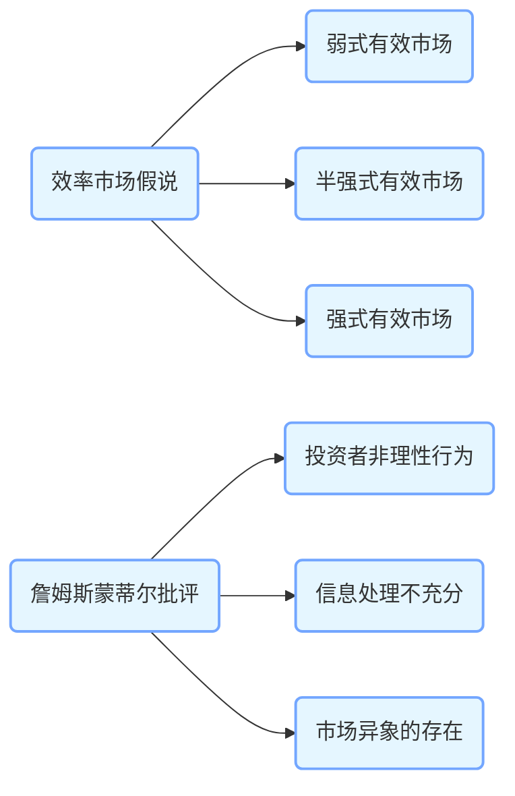

# 詹姆斯蒙蒂尔的效率市场假说批评

> 关键词：詹姆斯蒙蒂尔、效率市场假说、批评、金融理论、行为金融学

> 摘要：本文深入探讨詹姆斯蒙蒂尔对效率市场假说的批评。效率市场假说是现代金融理论的核心基石之一，长期以来在学术界和金融市场实践中占据重要地位。然而，詹姆斯蒙蒂尔基于行为金融学等多方面的研究成果，对这一假说提出了诸多有力的批评。文章将详细介绍效率市场假说的背景，阐述詹姆斯蒙蒂尔批评的核心要点，分析其批评所依据的理论和实证依据，通过实际案例展示这些批评在金融市场中的体现，探讨其对金融理论和实践的影响，最后对相关的学习资源、开发工具等进行推荐，并对未来金融理论发展趋势与挑战进行总结。

## 1. 背景介绍 
### 1.1 目的和范围
本文旨在全面梳理詹姆斯蒙蒂尔对效率市场假说的批评，深入剖析其批评的逻辑和依据，不仅要介绍批评的具体内容，还要探讨其背后的理论根源和现实意义。范围涵盖效率市场假说的基本概念、詹姆斯蒙蒂尔的主要观点、相关的实证研究以及这些批评对金融市场理论和实践的影响。通过对这些内容的研究，帮助读者更深入地理解效率市场假说的局限性以及行为金融学在金融领域的重要性。

### 1.2 预期读者
本文预期读者包括金融专业的学生、研究人员、金融市场从业者以及对金融理论和市场行为感兴趣的普通读者。对于金融专业的学生和研究人员，本文可以为他们的学术研究提供新的视角和参考资料；对于金融市场从业者，有助于他们在实际操作中更好地理解市场行为，做出更合理的决策；对于普通读者，能够帮助他们了解金融市场的复杂性和理论的发展脉络。

### 1.3 文档结构概述
本文首先介绍效率市场假说的背景知识，包括其定义、发展历程和在金融领域的重要地位。接着阐述詹姆斯蒙蒂尔对效率市场假说的核心批评观点，分析其批评的理论基础和实证依据。然后通过数学模型和公式进一步说明效率市场假说的局限性以及詹姆斯蒙蒂尔观点的合理性。再通过项目实战，以实际案例展示这些批评在金融市场中的体现。之后探讨效率市场假说批评的实际应用场景，推荐相关的学习资源、开发工具和论文著作。最后总结未来金融理论发展的趋势与挑战，并对常见问题进行解答，提供扩展阅读和参考资料。

### 1.4 术语表
#### 1.4.1 核心术语定义
- **效率市场假说（Efficient Market Hypothesis，EMH）**：该假说认为在有效市场中，资产价格能够及时、准确地反映所有可用信息。根据信息的不同层次，可分为弱式有效市场、半强式有效市场和强式有效市场。
- **行为金融学（Behavioral Finance）**：是将心理学、行为科学等理论融入金融学的交叉学科，主要研究投资者在金融市场中的认知偏差、情绪和行为对资产定价和市场效率的影响。
- **认知偏差（Cognitive Bias）**：指人们在认识和判断事物时，由于心理因素的影响而产生的偏离理性的偏差，如过度自信、损失厌恶等。

#### 1.4.2 相关概念解释
- **市场效率**：指市场将信息融入资产价格的速度和准确性。在有效市场中，资产价格能够迅速调整以反映新的信息，投资者无法通过分析公开信息获得超额收益。
- **超额收益**：指投资者获得的超过市场平均收益的部分，通常被认为是投资者通过独特的信息或投资策略所获得的额外回报。

#### 1.4.3 缩略词列表
- **EMH**：Efficient Market Hypothesis（效率市场假说）

## 2. 核心概念与联系 

### 2.1 效率市场假说的原理和架构
效率市场假说由美国经济学家尤金·法玛（Eugene F. Fama）在 1970 年提出，其核心思想是市场参与者的理性行为和信息的充分传播使得资产价格能够反映所有可用信息。根据信息的不同层次，效率市场假说可分为以下三种形式：
- **弱式有效市场（Weak - form Efficiency）**：资产价格已经反映了所有历史价格信息。在弱式有效市场中，技术分析是无效的，因为过去的价格信息已经完全包含在当前的价格中，投资者无法通过分析历史价格走势来预测未来价格的变化。
- **半强式有效市场（Semi - strong - form Efficiency）**：资产价格不仅反映了所有历史价格信息，还反映了所有公开可用的信息，如公司财务报表、宏观经济数据等。在半强式有效市场中，基本面分析也是无效的，因为所有公开信息已经被市场迅速消化并反映在资产价格中。
- **强式有效市场（Strong - form Efficiency）**：资产价格反映了所有信息，包括公开信息和内幕信息。在强式有效市场中，即使是拥有内幕信息的投资者也无法获得超额收益，因为市场能够迅速将所有信息反映在价格中。

效率市场假说的架构可以用以下文本示意图表示：

| 有效市场形式 | 信息包含范围 | 投资分析方法有效性 |
| --- | --- | --- |
| 弱式有效市场 | 历史价格信息 | 技术分析无效 |
| 半强式有效市场 | 历史价格信息 + 公开信息 | 技术分析、基本面分析无效 |
| 强式有效市场 | 历史价格信息 + 公开信息 + 内幕信息 | 所有分析方法无效 |

### 2.2 詹姆斯蒙蒂尔批评的核心要点
詹姆斯蒙蒂尔对效率市场假说提出了多方面的批评，其核心要点主要基于行为金融学的观点，认为市场参与者并非完全理性，存在各种认知偏差和情绪因素，这些因素会导致市场价格偏离其内在价值，从而使效率市场假说不成立。具体来说，他的批评包括以下几个方面：
- **投资者非理性行为**：蒙蒂尔认为投资者在决策过程中往往受到情绪和认知偏差的影响，如过度自信、羊群效应、损失厌恶等。这些非理性行为会导致投资者做出错误的决策，进而影响资产价格的形成，使市场价格不能准确反映资产的内在价值。
- **信息处理不充分**：虽然效率市场假说认为市场能够迅速、准确地处理所有信息，但蒙蒂尔指出，实际上市场参与者在处理信息时存在局限性。例如，投资者可能无法全面、准确地理解复杂的信息，或者在信息传播过程中存在延迟和失真，导致资产价格不能及时反映所有信息。
- **市场异象的存在**：蒙蒂尔列举了许多市场异象，如价值效应、动量效应等，这些现象无法用效率市场假说来解释。价值效应是指低市盈率、低市净率的股票往往能够获得更高的收益，而动量效应是指过去表现好的股票在未来一段时间内仍有较高的概率继续表现良好。这些市场异象表明市场并非完全有效，存在可以被利用的投资机会。

### 2.3 Mermaid 流程图


## 3. 核心算法原理 & 具体操作步骤 

### 3.1 效率市场假说的理论基础与算法原理
效率市场假说的理论基础主要基于随机游走模型。随机游走模型认为资产价格的变化是随机的，无法预测。在弱式有效市场中，资产价格的变化可以用以下公式表示：

$$P_{t}=P_{t - 1}+\epsilon_{t}$$

其中，$P_{t}$ 表示 $t$ 时刻的资产价格，$P_{t - 1}$ 表示 $t - 1$ 时刻的资产价格，$\epsilon_{t}$ 是一个随机误差项，服从均值为 0、方差为 $\sigma^{2}$ 的正态分布。这意味着资产价格的变化是由随机因素决定的，与过去的价格无关。

以下是用 Python 实现简单随机游走模型的代码示例：
```python
import numpy as np
import matplotlib.pyplot as plt

# 初始价格
initial_price = 100
# 时间步数
num_steps = 100
# 随机误差项的标准差
sigma = 1

# 生成随机误差项
epsilon = np.random.normal(0, sigma, num_steps)

# 计算价格序列
prices = np.zeros(num_steps)
prices[0] = initial_price
for i in range(1, num_steps):
    prices[i] = prices[i - 1] + epsilon[i]

# 绘制价格走势图
plt.plot(prices)
plt.xlabel('Time Step')
plt.ylabel('Asset Price')
plt.title('Random Walk Model of Asset Price')
plt.show()
```

### 3.2 詹姆斯蒙蒂尔批评的算法体现
詹姆斯蒙蒂尔的批评主要基于行为金融学的理论，虽然没有直接对应的算法，但可以通过模拟投资者的非理性行为来体现其观点。例如，我们可以模拟投资者的过度自信行为，即投资者高估自己对资产价格的预测能力。

以下是一个简单的 Python 代码示例，模拟投资者过度自信导致的资产价格偏离：
```python
import numpy as np
import matplotlib.pyplot as plt

# 真实的资产价格变化遵循随机游走模型
initial_price = 100
num_steps = 100
sigma = 1
epsilon = np.random.normal(0, sigma, num_steps)
true_prices = np.zeros(num_steps)
true_prices[0] = initial_price
for i in range(1, num_steps):
    true_prices[i] = true_prices[i - 1] + epsilon[i]

# 模拟投资者过度自信的行为
overconfidence_factor = 1.5  # 过度自信系数
perceived_prices = np.zeros(num_steps)
perceived_prices[0] = initial_price
for i in range(1, num_steps):
    # 投资者高估自己的预测能力，对价格变化的估计偏差
    perceived_epsilon = epsilon[i] * overconfidence_factor
    perceived_prices[i] = perceived_prices[i - 1] + perceived_epsilon

# 绘制真实价格和投资者感知价格的走势图
plt.plot(true_prices, label='True Price')
plt.plot(perceived_prices, label='Perceived Price (Overconfidence)')
plt.xlabel('Time Step')
plt.ylabel('Asset Price')
plt.title('Effect of Investor Overconfidence on Asset Price')
plt.legend()
plt.show()
```

在这个代码示例中，我们通过设置一个过度自信系数 `overconfidence_factor` 来模拟投资者的过度自信行为。投资者对价格变化的估计偏差导致其感知的价格与真实价格产生偏离，从而体现了投资者非理性行为对资产价格的影响。

## 4. 数学模型和公式 & 详细讲解 & 举例说明 

### 4.1 效率市场假说的数学模型
效率市场假说的核心数学模型是随机游走模型，其基本公式为：

$$P_{t}=P_{t - 1}+\epsilon_{t}$$

其中，$P_{t}$ 表示 $t$ 时刻的资产价格，$P_{t - 1}$ 表示 $t - 1$ 时刻的资产价格，$\epsilon_{t}$ 是一个随机误差项，服从均值为 0、方差为 $\sigma^{2}$ 的正态分布，即 $\epsilon_{t}\sim N(0,\sigma^{2})$。

这个公式的含义是，资产价格的变化是由随机因素决定的，与过去的价格无关。在有效市场中，新的信息会随机地影响资产价格，导致价格的变化呈现出随机游走的特征。

例如，假设一只股票在 $t - 1$ 时刻的价格为 $P_{t - 1}=100$ 元，随机误差项 $\epsilon_{t}$ 服从均值为 0、方差为 1 的正态分布。在 $t$ 时刻，股票的价格 $P_{t}$ 可以通过以下方式计算：

$$P_{t}=100+\epsilon_{t}$$

如果 $\epsilon_{t}=0.5$，则 $P_{t}=100 + 0.5 = 100.5$ 元；如果 $\epsilon_{t}=-0.3$，则 $P_{t}=100 - 0.3 = 99.7$ 元。

### 4.2 詹姆斯蒙蒂尔批评的数学分析
詹姆斯蒙蒂尔的批评主要基于行为金融学的理论，从投资者的非理性行为和市场异象的角度对效率市场假说进行了挑战。虽然没有统一的数学模型，但可以通过一些具体的例子来进行数学分析。

#### 4.2.1 投资者过度自信的数学分析
假设投资者对资产价格的预期收益率存在过度自信的偏差。设真实的预期收益率为 $\mu$，投资者过度自信的预期收益率为 $\mu^{*}$，且 $\mu^{*}=\alpha\mu$，其中 $\alpha>1$ 表示过度自信系数。

资产价格的定价公式通常可以表示为：

$$P=\frac{D}{r - g}$$

其中，$P$ 表示资产价格，$D$ 表示股息，$r$ 表示贴现率，$g$ 表示股息增长率。

由于投资者过度自信，他们使用的贴现率 $r^{*}$ 会低于真实的贴现率 $r$，导致资产价格被高估。假设投资者使用的贴现率 $r^{*}=r-\Delta r$，其中 $\Delta r>0$ 表示贴现率的偏差。

则投资者高估的资产价格 $P^{*}$ 为：

$$P^{*}=\frac{D}{r^{*}-g}=\frac{D}{(r - \Delta r)-g}>\frac{D}{r - g}=P$$

例如，假设一只股票的股息 $D = 5$ 元，真实的贴现率 $r = 0.1$，股息增长率 $g = 0.05$，则真实的资产价格 $P$ 为：

$$P=\frac{5}{0.1 - 0.05}=\frac{5}{0.05}=100$$

如果投资者过度自信，使用的贴现率 $r^{*}=0.08$，则投资者高估的资产价格 $P^{*}$ 为：

$$P^{*}=\frac{5}{0.08 - 0.05}=\frac{5}{0.03}\approx166.67$$

#### 4.2.2 市场异象的数学分析
以价值效应为例，价值效应是指低市盈率、低市净率的股票往往能够获得更高的收益。设高市盈率股票的预期收益率为 $r_{h}$，低市盈率股票的预期收益率为 $r_{l}$，且 $r_{l}>r_{h}$。

假设市场上有两只股票 $A$ 和 $B$，股票 $A$ 是高市盈率股票，股票 $B$ 是低市盈率股票。股票 $A$ 的初始价格为 $P_{A0}$，股票 $B$ 的初始价格为 $P_{B0}$。经过一段时间 $T$ 后，股票 $A$ 的价格为 $P_{A1}=P_{A0}(1 + r_{h})^{T}$，股票 $B$ 的价格为 $P_{B1}=P_{B0}(1 + r_{l})^{T}$。

由于 $r_{l}>r_{h}$，在相同的时间 $T$ 内，股票 $B$ 的价格增长幅度会大于股票 $A$ 的价格增长幅度，即 $P_{B1}/P_{B0}>P_{A1}/P_{A0}$。

例如，假设股票 $A$ 的初始价格 $P_{A0}=100$ 元，预期收益率 $r_{h}=0.05$，股票 $B$ 的初始价格 $P_{B0}=100$ 元，预期收益率 $r_{l}=0.1$。经过 5 年后，股票 $A$ 的价格为：

$$P_{A1}=100\times(1 + 0.05)^{5}\approx127.63$$

股票 $B$ 的价格为：

$$P_{B1}=100\times(1 + 0.1)^{5}\approx161.05$$

可以看出，低市盈率股票 $B$ 的价格增长幅度明显大于高市盈率股票 $A$ 的价格增长幅度，这与效率市场假说中所有股票的预期收益率应该相同的观点相矛盾，体现了市场异象的存在。

## 5. 项目实战：代码实际案例和详细解释说明 

### 5.1  开发环境搭建
在进行项目实战之前，需要搭建相应的开发环境。以下是具体的步骤：

#### 5.1.1 安装 Python
首先，需要安装 Python 编程语言。可以从 Python 官方网站（https://www.python.org/downloads/） 下载适合自己操作系统的 Python 安装包，并按照安装向导进行安装。建议安装 Python 3.x 版本。

#### 5.1.2 安装必要的库
在本项目中，需要使用一些 Python 库来进行数据处理、分析和可视化。可以使用以下命令来安装这些库：

```sh
pip install numpy pandas matplotlib yfinance
```

- **numpy**：用于进行数值计算和数组操作。
- **pandas**：用于数据处理和分析。
- **matplotlib**：用于数据可视化。
- **yfinance**：用于获取金融市场数据。

### 5.2  源代码详细实现和代码解读
以下是一个完整的 Python 代码示例，用于验证詹姆斯蒙蒂尔提出的市场异象（价值效应）：

```python
import yfinance as yf
import pandas as pd
import numpy as np
import matplotlib.pyplot as plt

# 定义股票列表，包含高市盈率和低市盈率股票
high_pe_stocks = ['AAPL', 'MSFT']
low_pe_stocks = ['JPM', 'WFC']

# 定义时间范围
start_date = '2010-01-01'
end_date = '2020-12-31'

# 获取股票数据
def get_stock_data(tickers, start, end):
    data = yf.download(tickers, start=start, end=end)
    return data['AdjClose']

high_pe_data = get_stock_data(high_pe_stocks, start_date, end_date)
low_pe_data = get_stock_data(low_pe_stocks, start_date, end_date)

# 计算收益率
def calculate_returns(data):
    returns = data.pct_change().dropna()
    return returns

high_pe_returns = calculate_returns(high_pe_data)
low_pe_returns = calculate_returns(low_pe_data)

# 计算累计收益率
def calculate_cumulative_returns(returns):
    cumulative_returns = (1 + returns).cumprod()
    return cumulative_returns

high_pe_cumulative_returns = calculate_cumulative_returns(high_pe_returns)
low_pe_cumulative_returns = calculate_cumulative_returns(low_pe_returns)

# 绘制累计收益率走势图
plt.figure(figsize=(12, 6))
for stock in high_pe_stocks:
    plt.plot(high_pe_cumulative_returns[stock], label=f'{stock} (High PE)')
for stock in low_pe_stocks:
    plt.plot(low_pe_cumulative_returns[stock], label=f'{stock} (Low PE)')
plt.xlabel('Date')
plt.ylabel('Cumulative Returns')
plt.title('Cumulative Returns of High PE and Low PE Stocks')
plt.legend()
plt.show()

# 计算平均年化收益率
def calculate_avg_annual_returns(returns):
    num_years = (pd.to_datetime(end_date) - pd.to_datetime(start_date)).days / 365
    avg_annual_returns = (1 + returns.mean()) ** (1 / num_years) - 1
    return avg_annual_returns

high_pe_avg_annual_returns = calculate_avg_annual_returns(high_pe_returns)
low_pe_avg_annual_returns = calculate_avg_annual_returns(low_pe_returns)

print('High PE Stocks Average Annual Returns:')
print(high_pe_avg_annual_returns)
print('Low PE Stocks Average Annual Returns:')
print(low_pe_avg_annual_returns)
```

### 5.3  代码解读与分析
#### 5.3.1 数据获取
使用 `yfinance` 库从雅虎财经获取高市盈率和低市盈率股票的历史调整收盘价数据。通过 `get_stock_data` 函数实现数据的下载，该函数接受股票代码列表、开始日期和结束日期作为参数。

#### 5.3.2 收益率计算
使用 `pct_change` 方法计算股票的每日收益率，并使用 `dropna` 方法去除缺失值。通过 `calculate_returns` 函数实现收益率的计算。

#### 5.3.3 累计收益率计算
使用 `(1 + returns).cumprod()` 方法计算股票的累计收益率。通过 `calculate_cumulative_returns` 函数实现累计收益率的计算。

#### 5.3.4 可视化
使用 `matplotlib` 库绘制高市盈率和低市盈率股票的累计收益率走势图，直观地展示不同类型股票的收益情况。

#### 5.3.5 平均年化收益率计算
通过计算每日收益率的平均值，并将其转换为年化收益率，使用 `calculate_avg_annual_returns` 函数实现平均年化收益率的计算。

#### 5.3.6 结果分析
通过比较高市盈率和低市盈率股票的平均年化收益率，如果低市盈率股票的平均年化收益率高于高市盈率股票，则验证了价值效应的存在，与詹姆斯蒙蒂尔提出的市场异象观点相符，对效率市场假说提出了挑战。

## 6. 实际应用场景 
### 6.1 投资决策
詹姆斯蒙蒂尔对效率市场假说的批评为投资者提供了新的投资思路。在传统的效率市场假说框架下，投资者认为市场是有效的，无法通过分析信息获得超额收益，因此更倾向于采用被动投资策略，如投资指数基金。然而，根据詹姆斯蒙蒂尔的观点，市场存在非理性行为和市场异象，投资者可以通过分析这些因素来寻找被低估或高估的资产，从而制定主动投资策略。

例如，投资者可以关注低市盈率、低市净率的股票，这些股票可能由于市场的非理性行为而被低估，具有较高的投资价值。此外，投资者还可以关注市场中的动量效应，即过去表现好的股票在未来一段时间内仍有较高的概率继续表现良好，通过跟随市场趋势进行投资。

### 6.2 风险管理
在风险管理方面，詹姆斯蒙蒂尔的观点提醒投资者要认识到市场的不确定性和非理性因素。传统的风险管理模型往往基于效率市场假说，假设市场是理性的，资产价格的波动是随机的。然而，实际市场中存在投资者的非理性行为和市场异象，这些因素可能导致资产价格的大幅波动，增加投资风险。

因此，投资者在进行风险管理时，不能仅仅依赖传统的风险度量方法，如方差、标准差等，还需要考虑市场的非理性因素。例如，可以采用压力测试和情景分析等方法，模拟不同市场情况下资产价格的变化，评估投资组合的风险承受能力。

### 6.3 金融监管
詹姆斯蒙蒂尔对效率市场假说的批评也对金融监管具有重要意义。在效率市场假说的影响下，金融监管机构往往认为市场能够自我调节，因此对市场的干预较少。然而，根据詹姆斯蒙蒂尔的观点，市场存在非理性行为和市场异象，这些因素可能导致市场失灵，需要金融监管机构进行适当的干预。

例如，金融监管机构可以加强对投资者的教育，提高投资者的理性水平，减少投资者的非理性行为。此外，金融监管机构还可以加强对市场操纵、内幕交易等违法行为的打击，维护市场的公平、公正和透明。

## 7. 工具和资源推荐
### 7.1 学习资源推荐
#### 7.1.1 书籍推荐
- 《漫步华尔街》（A Random Walk Down Wall Street）：作者是伯顿·马尔基尔（Burton G. Malkiel），这本书是投资领域的经典著作，详细介绍了效率市场假说及其应用，同时也对市场的非理性行为进行了探讨。
- 《金融心理学》（The Psychology of Finance）：作者是拉斯·特维德（Lars Tvede），这本书从心理学的角度分析了金融市场中的投资者行为，为理解詹姆斯蒙蒂尔的观点提供了理论基础。
- 《行为金融学新进展》（Advances in Behavioral Finance）：由理查德·泰勒（Richard H. Thaler）主编，这本书汇集了行为金融学领域的最新研究成果，对效率市场假说的批评进行了深入探讨。

#### 7.1.2 在线课程
- Coursera 上的 “Behavioral Finance” 课程：由知名教授授课，系统地介绍了行为金融学的基本理论和应用，帮助学习者理解投资者的非理性行为和市场异象。
- edX 上的 “Financial Markets” 课程：该课程涵盖了金融市场的基本原理和效率市场假说的相关内容，同时也对市场的局限性进行了讨论。

#### 7.1.3 技术博客和网站
- Seeking Alpha（https://seekingalpha.com/）：这是一个专业的金融投资网站，提供了大量的金融市场分析和投资策略文章，其中不乏对效率市场假说和行为金融学的讨论。
- AQR Capital Management（https://www.aqr.com/Insights）：AQR 是一家知名的量化投资公司，其网站上发布了许多关于金融市场研究和投资策略的文章，对理解詹姆斯蒙蒂尔的观点有很大帮助。

### 7.2 开发工具框架推荐
#### 7.2.1 IDE和编辑器
- PyCharm：是一款专业的 Python 集成开发环境，具有代码自动补全、调试、版本控制等功能，适合进行金融数据分析和编程。
- Jupyter Notebook：是一个交互式的开发环境，支持 Python、R 等多种编程语言，适合进行数据探索和可视化分析。

#### 7.2.2 调试和性能分析工具
- pdb：是 Python 内置的调试工具，可以帮助开发者定位和解决代码中的问题。
- cProfile：是 Python 内置的性能分析工具，可以分析代码的运行时间和函数调用情况，帮助开发者优化代码性能。

#### 7.2.3 相关框架和库
- Pandas：是一个强大的数据处理和分析库，提供了丰富的数据结构和函数，适合进行金融数据的清洗、处理和分析。
- Numpy：是一个用于科学计算的 Python 库，提供了高效的数组操作和数学函数，适合进行金融数据的数值计算。
- Matplotlib：是一个用于数据可视化的 Python 库，提供了丰富的绘图函数，适合绘制金融数据的图表和图形。

### 7.3 相关论文著作推荐
#### 7.3.1 经典论文
- Fama, E. F. (1970). “Efficient Capital Markets: A Review of Theory and Empirical Work.” The Journal of Finance, 25(2), 383 - 417. 这是效率市场假说的经典论文，由尤金·法玛（Eugene F. Fama）撰写，系统地阐述了效率市场假说的理论和实证研究。
- Thaler, R. H. (1985). “The Disposition to Sell Winners Too Early and Ride Losers Too Long: Theory and Evidence.” The Journal of Finance, 40(3), 777 - 790. 这篇论文由理查德·泰勒（Richard H. Thaler）撰写，研究了投资者的处置效应，即投资者倾向于过早卖出盈利的股票，而长期持有亏损的股票，对效率市场假说提出了挑战。

#### 7.3.2 最新研究成果
- Barberis, N., & Thaler, R. H. (2003). “A Survey of Behavioral Finance.” In G. M. Constantinides, M. Harris, & R. M. Stulz (Eds.), Handbook of the Economics of Finance (Vol. 1, pp. 1053 - 1128). Elsevier. 这篇综述文章总结了行为金融学领域的最新研究成果，对效率市场假说的批评进行了全面的分析。
- Shiller, R. J. (2015). “Irrational Exuberance” (3rd ed.). Princeton University Press. 作者罗伯特·席勒（Robert J. Shiller）在书中探讨了金融市场中的非理性行为和泡沫现象，对效率市场假说提出了质疑。

#### 7.3.3 应用案例分析
- Greenblatt, J. (2005). “The Little Book That Beats the Market.” Wiley. 作者乔尔·格林布拉特（Joel Greenblatt）在书中介绍了一种基于价值投资的投资策略，通过实证研究证明了该策略能够战胜市场，为詹姆斯蒙蒂尔的观点提供了实践案例。

## 8. 总结：未来发展趋势与挑战
### 8.1 未来发展趋势
#### 8.1.1 行为金融学的发展
随着对效率市场假说批评的不断深入，行为金融学将在未来得到更广泛的发展。行为金融学将进一步融合心理学、行为科学等多学科的理论和方法，深入研究投资者的非理性行为和市场异象的形成机制，为金融理论和实践提供更有力的支持。

#### 8.1.2 量化投资的发展
詹姆斯蒙蒂尔的观点为量化投资提供了新的思路。未来，量化投资将更加注重对投资者行为和市场异象的研究，开发出更加有效的量化投资策略。例如，通过分析投资者的情绪指标、行为数据等，构建基于行为金融学的量化投资模型。

#### 8.1.3 金融科技的应用
金融科技的发展将为金融市场的研究和实践带来新的机遇。例如，人工智能、大数据等技术可以帮助投资者更全面、准确地分析市场信息，识别投资者的非理性行为和市场异象。同时，区块链技术可以提高金融市场的透明度和公正性，减少市场操纵和内幕交易等违法行为。

### 8.2 挑战
#### 8.2.1 理论完善的挑战
虽然行为金融学对效率市场假说提出了有力的批评，但行为金融学本身的理论体系还不够完善。目前，行为金融学的许多理论和模型还处于探索阶段，需要进一步的实证研究和理论验证。如何构建一个更加完善、统一的行为金融学理论体系，是未来面临的一个重要挑战。

#### 8.2.2 实践应用的挑战
将行为金融学的理论和方法应用到实际投资和风险管理中，还面临着许多实际问题。例如，如何准确地度量投资者的非理性行为和市场异象，如何将这些因素纳入到投资决策和风险管理模型中，都是需要解决的问题。此外，投资者的行为和市场情况是不断变化的，如何及时、有效地调整投资策略和风险管理措施，也是实践中面临的挑战。

#### 8.2.3 监管和政策的挑战
随着金融市场的不断发展和变化，金融监管和政策也需要不断调整和完善。如何在行为金融学的框架下制定更加有效的金融监管政策，防范金融风险，维护金融市场的稳定和健康发展，是监管机构面临的重要挑战。

## 9. 附录：常见问题与解答
### 9.1 效率市场假说与行为金融学的关系是什么？
效率市场假说认为市场是有效的，资产价格能够及时、准确地反映所有可用信息，投资者无法通过分析信息获得超额收益。而行为金融学则认为投资者在决策过程中存在非理性行为，这些行为会导致市场价格偏离其内在价值，市场并非完全有效。行为金融学是对效率市场假说的一种挑战和补充，它从投资者的心理和行为角度出发，解释了市场中存在的一些异象和非理性现象。

### 9.2 詹姆斯蒙蒂尔的批评是否意味着效率市场假说完全错误？
詹姆斯蒙蒂尔的批评并不意味着效率市场假说完全错误。效率市场假说在一定程度上反映了市场的运行规律，在某些情况下，市场确实能够迅速、准确地反映信息。然而，詹姆斯蒙蒂尔的批评指出了效率市场假说的局限性，即市场参与者并非完全理性，存在各种认知偏差和情绪因素，这些因素会导致市场价格偏离其内在价值。因此，效率市场假说需要在行为金融学的框架下进行修正和完善。

### 9.3 如何在投资中应用詹姆斯蒙蒂尔的观点？
在投资中，可以应用詹姆斯蒙蒂尔的观点来寻找被低估或高估的资产。例如，可以关注低市盈率、低市净率的股票，这些股票可能由于市场的非理性行为而被低估，具有较高的投资价值。此外，还可以关注市场中的动量效应，通过跟随市场趋势进行投资。同时，要认识到市场的不确定性和非理性因素，采用适当的风险管理方法，如分散投资、定期调整投资组合等，降低投资风险。

### 9.4 行为金融学的研究方法有哪些？
行为金融学的研究方法主要包括实验研究、实证研究和案例分析等。实验研究通过设计实验场景，观察投资者在不同情况下的决策行为，研究投资者的认知偏差和情绪因素。实证研究通过对金融市场数据的分析，验证行为金融学的理论和假说，如研究市场异象的存在和成因。案例分析则通过具体的案例，分析投资者的行为和决策过程，总结行为金融学的应用经验。

## 10. 扩展阅读 & 参考资料
### 10.1 扩展阅读
- Kahneman, D., & Tversky, A. (1979). “Prospect Theory: An Analysis of Decision under Risk.” Econometrica, 47(2), 263 - 291. 这篇论文提出了前景理论，是行为金融学的重要理论基础之一。
- Shleifer, A. (2000). “Inefficient Markets: An Introduction to Behavioral Finance.” Oxford University Press. 这本书系统地介绍了行为金融学的理论和方法，对效率市场假说进行了深入的批判。

### 10.2 参考资料
- Fama, E. F. (1991). “Efficient Capital Markets: II.” The Journal of Finance, 46(5), 1575 - 1617.
- Thaler, R. H. (2015). “Misbehaving: The Making of Behavioral Economics.” W. W. Norton & Company.
- Shiller, R. J. (2000). “Irrational Exuberance” (1st ed.). Princeton University Press.