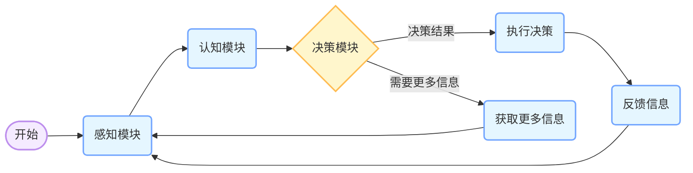

# 认知计算模型:模拟人类决策过程

> 关键词：认知计算模型、人类决策过程、人工智能、机器学习、神经科学、决策模拟、计算智能

> 摘要：本文围绕认知计算模型模拟人类决策过程展开深入探讨。首先介绍了认知计算模型的背景，包括目的范围、预期读者等内容。接着阐述核心概念与联系，剖析其原理和架构。通过Python代码详细讲解核心算法原理及操作步骤，并给出相关数学模型和公式。在项目实战部分，提供开发环境搭建的方法，对源代码进行实现和解读。分析了认知计算模型的实际应用场景，推荐了学习资源、开发工具框架以及相关论文著作。最后总结其未来发展趋势与挑战，解答常见问题并提供扩展阅读和参考资料，旨在全面深入地呈现认知计算模型模拟人类决策过程的相关知识和技术。

## 1. 背景介绍 
### 1.1 目的和范围
认知计算模型模拟人类决策过程的研究目的在于深入理解人类复杂的决策机制，并将其以计算模型的形式进行抽象和实现。通过构建这样的模型，能够在多个领域实现智能化的决策支持，例如金融领域的投资决策、医疗领域的疾病诊断决策、交通领域的路径规划决策等。其范围涵盖了从基础的神经科学研究到计算机科学中的人工智能算法实现，涉及多学科的交叉融合，旨在为各个行业提供更智能、更贴近人类思维的决策解决方案。

### 1.2 预期读者
本文预期读者包括对人工智能、认知科学、机器学习等领域感兴趣的研究人员、学者，他们希望通过本文深入了解认知计算模型的原理和实现方法，为自己的研究提供参考和思路。同时，也适合相关领域的工程师和开发者，帮助他们在实际项目中应用认知计算模型来解决决策相关的问题。此外，对于对人类决策机制好奇的普通读者，也能通过本文初步了解认知计算模型的基本概念和作用。

### 1.3 文档结构概述
本文首先介绍认知计算模型模拟人类决策过程的背景信息，包括目的范围、预期读者和文档结构概述等。接着阐述核心概念与联系，通过文本示意图和Mermaid流程图展示其原理和架构。然后详细讲解核心算法原理及具体操作步骤，结合Python源代码进行说明。给出相关的数学模型和公式，并举例说明。在项目实战部分，介绍开发环境搭建、源代码实现和代码解读。分析实际应用场景，推荐学习资源、开发工具框架以及相关论文著作。最后总结未来发展趋势与挑战，解答常见问题并提供扩展阅读和参考资料。

### 1.4 术语表
#### 1.4.1 核心术语定义
- **认知计算模型**：是一种试图模拟人类认知过程的计算模型，通过结合人工智能、机器学习、神经科学等多学科知识，对人类的感知、思考、学习和决策等过程进行建模和实现。
- **人类决策过程**：指人类在面对各种情况和问题时，通过收集信息、分析评估、权衡利弊等一系列心理和认知活动，最终做出选择和判断的过程。
- **人工智能**：研究如何使计算机系统能够表现出类似人类智能的能力，包括学习、推理、问题解决、决策等。
- **机器学习**：是人工智能的一个分支，致力于开发算法和模型，使计算机能够从数据中自动学习模式和规律，从而进行预测和决策。
- **神经科学**：研究神经系统的结构、功能、发育、病理等方面的科学，为认知计算模型提供关于人类大脑和神经系统的生物学基础。

#### 1.4.2 相关概念解释
- **决策树**：是一种基于树结构进行决策的模型，每个内部节点表示一个属性上的测试，每个分支表示一个测试输出，每个叶节点表示一个类别或值。决策树可以用于模拟人类在决策过程中根据不同条件进行逐步判断的过程。
- **神经网络**：是一种模仿人类神经系统的计算模型，由大量的神经元组成，通过神经元之间的连接和信号传递来进行信息处理和学习。神经网络可以学习复杂的非线性关系，在模拟人类认知和决策方面具有强大的能力。
- **强化学习**：是一种机器学习方法，智能体通过与环境进行交互，根据环境反馈的奖励信号来学习最优的行为策略，以实现特定的目标。强化学习可以用于模拟人类在决策过程中通过不断尝试和学习来优化决策的过程。

#### 1.4.3 缩略词列表
- **AI**：Artificial Intelligence，人工智能
- **ML**：Machine Learning，机器学习
- **NN**：Neural Network，神经网络
- **RL**：Reinforcement Learning，强化学习

## 2. 核心概念与联系 

认知计算模型模拟人类决策过程的核心在于将人类的认知和决策机制以计算的方式进行建模和实现。其基本原理是通过整合多学科的知识和方法，从人类大脑的生物学基础出发，结合人工智能和机器学习的算法，构建出能够模拟人类感知、思考、学习和决策的计算模型。

### 文本示意图
认知计算模型主要由感知模块、认知模块和决策模块组成。感知模块负责接收外部环境的信息，如视觉、听觉、触觉等信息，并将其转化为计算机能够处理的形式。认知模块对感知到的信息进行分析、理解和处理，通过学习和推理等过程提取有用的知识和模式。决策模块根据认知模块的输出，结合目标和约束条件，做出最终的决策。各个模块之间相互协作，形成一个闭环的系统，不断地与外部环境进行交互和学习，以优化决策过程。

### Mermaid 流程图


## 3. 核心算法原理 & 具体操作步骤 

### 核心算法原理
在认知计算模型模拟人类决策过程中，常用的算法包括决策树、神经网络和强化学习等。下面以决策树算法为例进行详细讲解。

决策树算法的基本思想是通过对数据集的递归划分，构建一棵决策树。每个内部节点表示一个属性上的测试，每个分支表示一个测试输出，每个叶节点表示一个类别或值。在决策过程中，从根节点开始，根据输入数据的属性值进行测试，沿着相应的分支向下移动，直到到达叶节点，叶节点所表示的类别或值即为决策结果。

### 具体操作步骤
1. **数据准备**：收集和整理与决策相关的数据集，包括输入特征和对应的决策结果。
2. **特征选择**：选择对决策结果影响较大的特征作为决策树的划分属性。常用的特征选择方法有信息增益、信息增益比、基尼指数等。
3. **构建决策树**：从根节点开始，根据选择的特征对数据集进行划分，递归地构建决策树的各个节点，直到满足终止条件，如所有样本属于同一类别或没有更多特征可供划分。
4. **决策过程**：对于新的输入数据，从决策树的根节点开始，根据其特征值进行测试，沿着相应的分支向下移动，直到到达叶节点，叶节点所表示的类别或值即为决策结果。

### Python源代码实现
```python
import numpy as np
from sklearn.datasets import load_iris
from sklearn.model_selection import train_test_split
from sklearn.tree import DecisionTreeClassifier
from sklearn.metrics import accuracy_score

# 加载数据集
iris = load_iris()
X = iris.data
y = iris.target

# 划分训练集和测试集
X_train, X_test, y_train, y_test = train_test_split(X, y, test_size=0.3, random_state=42)

# 创建决策树分类器
clf = DecisionTreeClassifier()

# 训练模型
clf.fit(X_train, y_train)

# 预测
y_pred = clf.predict(X_test)

# 计算准确率
accuracy = accuracy_score(y_test, y_pred)
print(f"Accuracy: {accuracy}")
```

### 代码解释
1. **数据加载**：使用`load_iris`函数加载鸢尾花数据集，将特征数据存储在`X`中，标签数据存储在`y`中。
2. **数据划分**：使用`train_test_split`函数将数据集划分为训练集和测试集，测试集占比为30%。
3. **模型创建**：创建一个决策树分类器`DecisionTreeClassifier`。
4. **模型训练**：使用训练集数据对决策树分类器进行训练。
5. **预测**：使用训练好的模型对测试集数据进行预测。
6. **准确率计算**：使用`accuracy_score`函数计算预测结果的准确率。

## 4. 数学模型和公式 & 详细讲解 & 举例说明 

### 信息增益
信息增益是决策树算法中常用的特征选择方法之一。信息增益的计算基于信息熵的概念。

#### 信息熵
信息熵是衡量数据集不确定性的指标，其计算公式为：
$$H(D)=-\sum_{k=1}^{K}p_{k}\log_{2}p_{k}$$
其中，$D$ 表示数据集，$K$ 表示数据集的类别数，$p_{k}$ 表示第 $k$ 类样本在数据集中所占的比例。

#### 条件熵
条件熵是在给定某个特征 $A$ 的条件下，数据集的不确定性。其计算公式为：
$$H(D|A)=\sum_{i=1}^{n}\frac{|D_{i}|}{|D|}H(D_{i})$$
其中，$n$ 表示特征 $A$ 的取值个数，$D_{i}$ 表示特征 $A$ 取值为第 $i$ 个值的样本子集，$|D|$ 表示数据集 $D$ 的样本总数，$|D_{i}|$ 表示样本子集 $D_{i}$ 的样本数。

#### 信息增益
信息增益是信息熵与条件熵的差值，其计算公式为：
$$g(D,A)=H(D)-H(D|A)$$
信息增益越大，说明使用特征 $A$ 进行划分后，数据集的不确定性降低得越多，该特征对分类的贡献越大。

### 举例说明
假设有一个数据集 $D$ 包含 10 个样本，分为 2 类，其中 6 个样本属于类别 1，4 个样本属于类别 2。则数据集 $D$ 的信息熵为：
$$H(D)=-\frac{6}{10}\log_{2}\frac{6}{10}-\frac{4}{10}\log_{2}\frac{4}{10}\approx0.971$$
假设存在一个特征 $A$，其取值有 2 个，分别为 $A_{1}$ 和 $A_{2}$。$A_{1}$ 对应的样本子集 $D_{1}$ 包含 4 个样本，其中 3 个属于类别 1，1 个属于类别 2；$A_{2}$ 对应的样本子集 $D_{2}$ 包含 6 个样本，其中 3 个属于类别 1，3 个属于类别 2。则条件熵为：
$$H(D|A)=\frac{4}{10}(-\frac{3}{4}\log_{2}\frac{3}{4}-\frac{1}{4}\log_{2}\frac{1}{4})+\frac{6}{10}(-\frac{3}{6}\log_{2}\frac{3}{6}-\frac{3}{6}\log_{2}\frac{3}{6})\approx0.871$$
信息增益为：
$$g(D,A)=H(D)-H(D|A)=0.971 - 0.871 = 0.1$$

## 5. 项目实战：代码实际案例和详细解释说明 

### 5.1  开发环境搭建
#### 安装Python
首先需要安装Python环境，建议使用Python 3.7及以上版本。可以从Python官方网站（https://www.python.org/downloads/） 下载并安装适合自己操作系统的Python版本。

#### 安装必要的库
使用`pip`命令安装必要的库，如`numpy`、`scikit-learn`等。
```bash
pip install numpy scikit-learn
```

### 5.2  源代码详细实现和代码解读
以下是一个基于决策树算法的贷款审批决策模型的代码示例：
```python
import numpy as np
import pandas as pd
from sklearn.model_selection import train_test_split
from sklearn.tree import DecisionTreeClassifier
from sklearn.metrics import accuracy_score

# 加载数据集
data = pd.read_csv('loan_data.csv')

# 数据预处理
X = data.drop('Loan_Status', axis=1)
y = data['Loan_Status']

# 处理缺失值
X = X.fillna(X.mean())

# 划分训练集和测试集
X_train, X_test, y_train, y_test = train_test_split(X, y, test_size=0.3, random_state=42)

# 创建决策树分类器
clf = DecisionTreeClassifier()

# 训练模型
clf.fit(X_train, y_train)

# 预测
y_pred = clf.predict(X_test)

# 计算准确率
accuracy = accuracy_score(y_test, y_pred)
print(f"Accuracy: {accuracy}")
```

### 5.3  代码解读与分析
1. **数据加载**：使用`pandas`库的`read_csv`函数加载贷款数据集，存储在`data`变量中。
2. **数据预处理**：将特征数据存储在`X`中，标签数据存储在`y`中。使用`fillna`函数处理缺失值，将缺失值填充为该特征的均值。
3. **数据划分**：使用`train_test_split`函数将数据集划分为训练集和测试集，测试集占比为30%。
4. **模型创建**：创建一个决策树分类器`DecisionTreeClassifier`。
5. **模型训练**：使用训练集数据对决策树分类器进行训练。
6. **预测**：使用训练好的模型对测试集数据进行预测。
7. **准确率计算**：使用`accuracy_score`函数计算预测结果的准确率。

## 6. 实际应用场景 
### 金融领域
在金融领域，认知计算模型可以用于投资决策、风险评估、贷款审批等方面。例如，通过模拟人类的决策过程，分析市场趋势、公司财务状况等信息，帮助投资者做出更明智的投资决策；评估借款人的信用风险，决定是否给予贷款以及贷款的额度和利率。

### 医疗领域
在医疗领域，认知计算模型可以辅助医生进行疾病诊断、治疗方案选择等决策。例如，通过分析患者的症状、病史、检查结果等信息，结合医学知识和临床经验，为医生提供诊断建议和治疗方案推荐，提高诊断的准确性和治疗的效果。

### 交通领域
在交通领域，认知计算模型可以用于交通流量预测、路径规划、智能驾驶决策等方面。例如，通过分析历史交通数据、实时路况信息等，预测交通流量的变化，为驾驶员提供最佳的路径规划；在智能驾驶中，模拟人类驾驶员的决策过程，根据周围环境信息做出加速、减速、转弯等决策，提高驾驶的安全性和效率。

### 教育领域
在教育领域，认知计算模型可以用于个性化学习方案制定、学生学习效果评估等方面。例如，通过分析学生的学习行为、成绩数据等，了解学生的学习特点和需求，为学生制定个性化的学习计划；评估学生的学习效果，及时发现学生的学习问题并提供针对性的辅导。

## 7. 工具和资源推荐
### 7.1 学习资源推荐
#### 7.1.1 书籍推荐
- 《人工智能：一种现代的方法》：全面介绍了人工智能的基本概念、算法和应用，是人工智能领域的经典教材。
- 《机器学习》：详细讲解了机器学习的各种算法和模型，包括决策树、神经网络、支持向量机等，是机器学习领域的权威著作。
- 《深度学习》：深入探讨了深度学习的原理和应用，包括卷积神经网络、循环神经网络等，是深度学习领域的重要参考书籍。

#### 7.1.2 在线课程
- Coursera上的“机器学习”课程：由斯坦福大学教授Andrew Ng授课，系统地介绍了机器学习的基本概念和算法，是学习机器学习的经典课程。
- edX上的“人工智能基础”课程：由麻省理工学院教授讲授，介绍了人工智能的基本原理和应用，适合初学者学习。
- Udemy上的“深度学习实战”课程：通过实际项目讲解深度学习的应用，帮助学习者掌握深度学习的实践技能。

#### 7.1.3 技术博客和网站
- Medium：上面有很多关于人工智能、机器学习的技术文章和案例分享，是获取最新技术动态的好地方。
- Towards Data Science：专注于数据科学和机器学习领域，提供了大量的技术文章和教程。
- arXiv：是一个预印本平台，上面有很多最新的学术论文，包括人工智能、认知科学等领域的研究成果。

### 7.2 开发工具框架推荐
#### 7.2.1 IDE和编辑器
- PyCharm：是一款专门为Python开发设计的集成开发环境，具有强大的代码编辑、调试、版本控制等功能。
- Jupyter Notebook：是一个交互式的开发环境，适合进行数据探索、模型训练和实验，方便代码的展示和分享。
- Visual Studio Code：是一款轻量级的代码编辑器，支持多种编程语言，具有丰富的插件生态系统，可以方便地进行Python开发。

#### 7.2.2 调试和性能分析工具
- PDB：是Python自带的调试器，可以帮助开发者定位和解决代码中的问题。
- cProfile：是Python的性能分析工具，可以分析代码的执行时间和函数调用情况，帮助开发者优化代码性能。
- TensorBoard：是TensorFlow的可视化工具，可以用于可视化模型的训练过程、网络结构等信息，帮助开发者理解和优化模型。

#### 7.2.3 相关框架和库
- Scikit-learn：是一个简单易用的机器学习库，提供了各种机器学习算法和工具，包括分类、回归、聚类等。
- TensorFlow：是一个开源的深度学习框架，由Google开发，具有强大的计算能力和丰富的工具集，广泛应用于深度学习领域。
- PyTorch：是一个基于Python的深度学习框架，具有动态图机制，易于使用和调试，受到了很多研究者和开发者的喜爱。

### 7.3 相关论文著作推荐
#### 7.3.1 经典论文
- “A Logical Calculus of the Ideas Immanent in Nervous Activity”：由Warren McCulloch和Walter Pitts于1943年发表，提出了第一个神经元模型，为神经网络的发展奠定了基础。
- “Learning Representations by Back-propagating Errors”：由David Rumelhart、Geoffrey Hinton和Ronald Williams于1986年发表，介绍了反向传播算法，使得神经网络的训练变得更加高效。
- “Playing Atari with Deep Reinforcement Learning”：由Volodymyr Mnih等人于2013年发表，提出了深度强化学习算法，在Atari游戏中取得了很好的效果。

#### 7.3.2 最新研究成果
- 关注NeurIPS、ICML、CVPR等顶级学术会议，上面有很多关于认知计算模型、人工智能等领域的最新研究成果。
- 查阅《Journal of Artificial Intelligence Research》、《Artificial Intelligence》等学术期刊，获取相关领域的前沿研究论文。

#### 7.3.3 应用案例分析
- 参考一些实际应用案例的研究报告和论文，了解认知计算模型在不同领域的应用方法和效果，如金融领域的风险评估、医疗领域的疾病诊断等。

## 8. 总结：未来发展趋势与挑战
### 未来发展趋势
- **多学科融合**：认知计算模型将与神经科学、心理学、社会学等多学科进行更深入的融合，从多个角度模拟人类的决策过程，提高模型的准确性和可靠性。
- **深度学习与强化学习的结合**：深度学习在特征提取和表示方面具有强大的能力，强化学习在决策优化方面表现出色。未来，两者的结合将成为认知计算模型发展的重要方向，用于解决更复杂的决策问题。
- **边缘计算与认知计算的融合**：随着物联网和边缘计算的发展，认知计算模型将与边缘计算相结合，实现实时、高效的决策，应用于智能交通、智能家居等领域。
- **可解释性和透明度的提升**：为了提高认知计算模型的可信度和可接受性，未来的研究将更加注重模型的可解释性和透明度，使人们能够理解模型的决策过程和依据。

### 挑战
- **数据质量和隐私问题**：认知计算模型需要大量的数据进行训练，但数据的质量和隐私问题是一个挑战。如何获取高质量、可靠的数据，同时保护数据的隐私和安全，是需要解决的重要问题。
- **模型的复杂性和计算资源需求**：随着认知计算模型的不断发展，模型的复杂性越来越高，对计算资源的需求也越来越大。如何在有限的计算资源下实现高效的模型训练和推理，是一个挑战。
- **人类认知的复杂性**：人类的认知和决策过程非常复杂，受到多种因素的影响，如情感、经验、文化等。如何全面、准确地模拟人类的认知和决策过程，是认知计算模型面临的最大挑战之一。
- **伦理和法律问题**：认知计算模型的应用可能会带来一些伦理和法律问题，如决策的公正性、责任的界定等。如何制定相应的伦理和法律规范，确保模型的合理应用，是需要解决的重要问题。

## 9. 附录：常见问题与解答
### 问题1：认知计算模型与传统机器学习模型有什么区别？
解答：认知计算模型更加注重模拟人类的认知过程，结合了多学科的知识和方法，试图从更全面的角度理解和解决问题。而传统机器学习模型主要关注数据的模式和规律，通过对数据的学习来进行预测和决策。认知计算模型通常具有更高的智能水平和更复杂的结构。

### 问题2：如何评估认知计算模型的性能？
解答：可以使用多种指标来评估认知计算模型的性能，如准确率、召回率、F1值等。对于决策模型，还可以考虑决策的合理性、稳定性等因素。此外，还可以通过用户反馈和实际应用效果来评估模型的性能。

### 问题3：认知计算模型在实际应用中存在哪些局限性？
解答：认知计算模型在实际应用中可能存在数据质量和隐私问题、模型的复杂性和计算资源需求大、对人类认知的模拟不够全面准确等局限性。此外，模型的可解释性和透明度也是一个问题，可能会影响用户对模型的信任和接受程度。

### 问题4：如何提高认知计算模型的可解释性？
解答：可以采用一些方法来提高认知计算模型的可解释性，如使用可解释的模型结构（如决策树）、提供决策的依据和解释、可视化模型的决策过程等。此外，还可以结合人类专家的知识和经验，对模型的决策进行解释和验证。

## 10. 扩展阅读 & 参考资料
### 扩展阅读
- 《思考，快与慢》：作者丹尼尔·卡尼曼是行为经济学领域的先驱，书中介绍了人类的两种思维模式：快思考和慢思考，对理解人类的决策过程有很大的帮助。
- 《人工智能时代与人类未来》：探讨了人工智能对人类社会的影响和挑战，以及人类如何应对这些挑战，适合对人工智能的发展和影响感兴趣的读者阅读。

### 参考资料
- 《人工智能：一种现代的方法》（第3版），Stuart J. Russell、Peter Norvig著
- 《机器学习》，周志华著
- 《深度学习》，Ian Goodfellow、Yoshua Bengio、Aaron Courville著
- Scikit-learn官方文档：https://scikit-learn.org/stable/
- TensorFlow官方文档：https://www.tensorflow.org/
- PyTorch官方文档：https://pytorch.org/