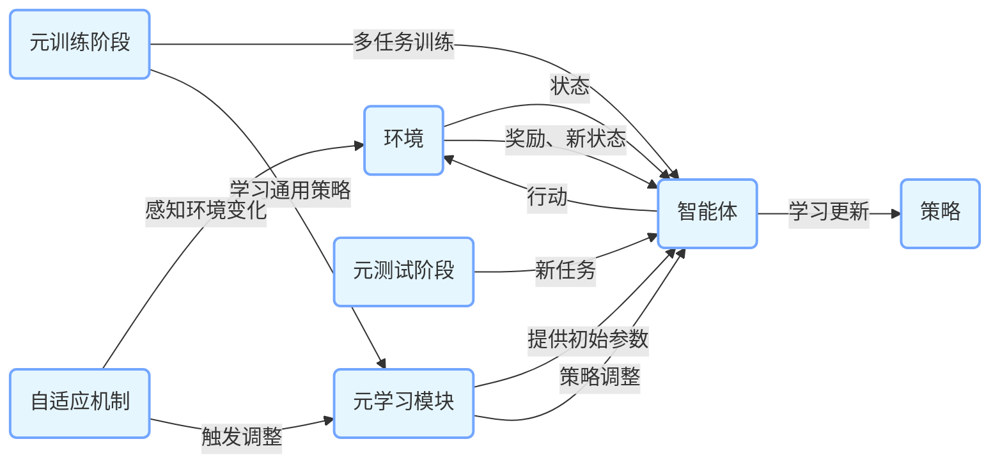

# 设计AI Agent的自适应元强化学习框架

> 关键词：AI Agent、自适应、元强化学习、框架设计、智能决策、策略优化、环境适应

> 摘要：本文聚焦于设计AI Agent的自适应元强化学习框架。在人工智能快速发展的当下，传统强化学习方法在面对复杂多变的环境时存在一定局限性。元强化学习作为一种新兴技术，能使AI Agent具备快速学习和适应新环境的能力。文章首先介绍了相关背景知识，包括目的范围、预期读者等内容；接着阐述核心概念与联系，展示其原理和架构；详细讲解核心算法原理并给出Python代码示例；深入探讨数学模型和公式；通过项目实战展示代码实现和解读；分析实际应用场景；推荐相关工具和资源；最后总结未来发展趋势与挑战，提供常见问题解答和扩展阅读参考资料，旨在为构建高效的AI Agent自适应元强化学习框架提供全面的技术指导。

## 1. 背景介绍 
### 1.1 目的和范围
随着人工智能应用场景的日益复杂和多样化，传统强化学习算法在面对新环境或任务变化时，往往需要大量的样本和时间来学习新的策略，效率较低。设计AI Agent的自适应元强化学习框架的目的在于使AI Agent能够快速适应不同的环境和任务，通过元学习机制在有限的样本下快速调整策略，提高学习效率和泛化能力。

本框架的范围涵盖了从理论算法到实际应用的多个层面。理论上，深入研究元强化学习的核心概念、算法原理和数学模型；实践中，通过具体的项目实战展示如何搭建和实现该框架，以及在不同应用场景中的应用效果。

### 1.2 预期读者
本文预期读者包括对人工智能、机器学习、强化学习领域感兴趣的研究人员、开发者和学生。对于研究人员，希望本文能为其在元强化学习领域的深入研究提供新的思路和参考；对于开发者，能帮助他们掌握设计和实现自适应元强化学习框架的技术和方法；对于学生，可作为学习相关知识的系统性资料，加深对元强化学习的理解。

### 1.3 文档结构概述
本文将按照以下结构展开：首先介绍相关背景知识，包括目的范围、预期读者等；接着阐述核心概念与联系，包括元强化学习的原理和架构；详细讲解核心算法原理并给出Python代码示例；深入探讨数学模型和公式；通过项目实战展示代码实现和解读；分析实际应用场景；推荐相关工具和资源；最后总结未来发展趋势与挑战，提供常见问题解答和扩展阅读参考资料。

### 1.4 术语表
#### 1.4.1 核心术语定义
- **AI Agent（智能体）**：在环境中能够感知信息、做出决策并采取行动的智能实体。
- **元强化学习（Meta-Reinforcement Learning）**：一种让智能体能够在多个任务或环境中学习如何学习的强化学习方法，通过元学习机制快速适应新的任务或环境。
- **自适应（Adaptive）**：指智能体能够根据环境的变化自动调整自身的策略和行为，以达到最优的性能。
- **策略（Policy）**：智能体在给定状态下选择行动的规则。
- **环境（Environment）**：智能体所处的外部世界，智能体与环境进行交互，根据环境的反馈调整自己的行为。

#### 1.4.2 相关概念解释
- **强化学习（Reinforcement Learning）**：一种通过智能体与环境进行交互，根据环境给予的奖励信号来学习最优策略的机器学习方法。智能体在环境中采取行动，环境返回奖励和新的状态，智能体的目标是最大化累积奖励。
- **元学习（Meta-Learning）**：也称为“学习如何学习”，其目标是在多个任务上学习一个通用的学习策略，使得智能体能够在面对新的任务时快速学习和适应。元学习通常通过在元训练阶段学习一个初始模型或学习算法，然后在元测试阶段快速调整该模型以适应新任务。
- **模型无关元学习（Model-Agnostic Meta-Learning，MAML）**：一种经典的元学习算法，通过在多个任务上进行快速的梯度更新，学习一个初始的模型参数，使得该参数在新任务上能够通过少量的梯度更新快速收敛到较好的性能。

#### 1.4.3 缩略词列表
- **MAML**：Model-Agnostic Meta-Learning（模型无关元学习）
- **RL**：Reinforcement Learning（强化学习）
- **MRRL**：Meta-Reinforcement Learning（元强化学习）

## 2. 核心概念与联系 
### 2.1 元强化学习的基本原理
元强化学习结合了元学习和强化学习的思想，旨在让智能体能够在多个任务或环境中学习如何学习，从而快速适应新的任务或环境。其基本原理是通过元训练阶段在多个任务上学习一个通用的策略或学习算法，使得智能体在面对新任务时能够利用已学习的知识快速调整策略。

在元训练阶段，智能体在多个不同的任务上进行训练，通过与环境的交互获取奖励信号，并使用强化学习算法更新策略。同时，元学习机制会学习如何调整策略以适应不同的任务，例如学习一个初始的策略参数或学习算法，使得在新任务上能够通过少量的更新快速收敛到较好的性能。

在元测试阶段，智能体面对一个新的任务，利用元训练阶段学习到的知识，通过少量的与环境交互和策略更新，快速适应新任务并获得较好的性能。

### 2.2 自适应机制的作用
自适应机制是元强化学习框架的核心组成部分，它使得智能体能够根据环境的变化自动调整自身的策略和行为。在复杂多变的环境中，环境的动态性和不确定性会导致传统强化学习算法的性能下降。而自适应机制通过实时感知环境的变化，利用元学习机制快速调整策略，使得智能体能够在不同的环境条件下保持良好的性能。

自适应机制的实现通常涉及到对环境状态的感知、对环境变化的检测和对策略的动态调整。例如，智能体可以通过观察环境的特征和奖励信号来感知环境的变化，当检测到环境发生变化时，利用元学习机制快速更新策略以适应新的环境。

### 2.3 核心概念的联系
AI Agent、元强化学习和自适应机制之间存在着紧密的联系。AI Agent是整个框架的执行主体，它在环境中进行交互和决策。元强化学习为AI Agent提供了一种学习如何学习的方法，使得AI Agent能够在多个任务或环境中快速适应。自适应机制则是元强化学习的具体实现方式，通过实时感知环境变化并动态调整策略，保证AI Agent在不同环境下的性能。

### 2.4 原理和架构的文本示意图
以下是自适应元强化学习框架的原理和架构的文本描述：

智能体（AI Agent）与环境（Environment）进行交互，在每个时间步，智能体观察环境的状态（State），根据当前的策略（Policy）选择一个行动（Action）并执行。环境根据智能体的行动返回一个新的状态和一个奖励（Reward）。智能体利用这些信息进行学习和策略更新。

在元训练阶段，智能体在多个不同的任务或环境上进行训练，通过强化学习算法更新策略。同时，元学习模块会学习一个通用的学习策略或初始参数，使得智能体在面对新任务时能够快速适应。

在元测试阶段，智能体面对一个新的任务，利用元训练阶段学习到的知识，通过少量的与环境交互和策略更新，快速调整策略以适应新任务。

自适应机制贯穿整个过程，实时感知环境的变化，当检测到环境变化时，触发元学习机制进行策略调整。

### 2.5 Mermaid流程图


## 3. 核心算法原理 & 具体操作步骤 
### 3.1 基于MAML的元强化学习算法原理
模型无关元学习（MAML）是一种经典的元学习算法，其核心思想是通过在多个任务上进行快速的梯度更新，学习一个初始的模型参数，使得该参数在新任务上能够通过少量的梯度更新快速收敛到较好的性能。

在元强化学习中，我们可以将MAML应用到策略网络的训练中。具体来说，我们的目标是学习一个初始的策略网络参数 $\theta$，使得在新任务上，通过少量的梯度更新能够快速得到一个适应新任务的策略。

### 3.2 具体操作步骤
#### 3.2.1 元训练阶段
1. **任务采样**：从任务分布 $\mathcal{T}$ 中采样一组任务 $\{T_1, T_2, \cdots, T_n\}$。
2. **内循环更新**：对于每个任务 $T_i$，初始化策略网络参数为 $\theta$，然后在任务 $T_i$ 上进行 $k$ 步的强化学习更新，得到更新后的参数 $\theta_{i}'$。具体来说，对于每一步 $j$，计算策略网络在任务 $T_i$ 上的损失 $L(\theta_{i}^{j})$，并使用梯度下降法更新参数：
   \[\theta_{i}^{j + 1} = \theta_{i}^{j} - \alpha \nabla_{\theta_{i}^{j}} L(\theta_{i}^{j})\]
   其中，$\alpha$ 是内循环的学习率。
3. **外循环更新**：计算所有任务上更新后的参数 $\theta_{i}'$ 的平均损失 $\bar{L}(\theta_{i}')$，并使用梯度下降法更新初始参数 $\theta$：
   \[\theta = \theta - \beta \nabla_{\theta} \bar{L}(\theta_{i}')\]
   其中，$\beta$ 是外循环的学习率。

#### 3.2.2 元测试阶段
1. **新任务采样**：从任务分布 $\mathcal{T}$ 中采样一个新的任务 $T_{new}$。
2. **快速适应**：初始化策略网络参数为 $\theta$，然后在任务 $T_{new}$ 上进行少量的强化学习更新，得到适应新任务的策略。

### 3.3 Python源代码实现
```python
import torch
import torch.nn as nn
import torch.optim as optim

# 定义策略网络
class PolicyNetwork(nn.Module):
    def __init__(self, input_dim, output_dim):
        super(PolicyNetwork, self).__init__()
        self.fc1 = nn.Linear(input_dim, 64)
        self.fc2 = nn.Linear(64, output_dim)

    def forward(self, x):
        x = torch.relu(self.fc1(x))
        x = self.fc2(x)
        return x

# 定义强化学习损失函数
def rl_loss(policy, states, actions, rewards):
    log_probs = torch.log_softmax(policy(states), dim=1)
    action_log_probs = log_probs.gather(1, actions.unsqueeze(1)).squeeze(1)
    loss = - (action_log_probs * rewards).mean()
    return loss

# 元训练函数
def meta_train(policy, meta_optimizer, tasks, inner_lr, inner_steps, outer_steps):
    for outer_step in range(outer_steps):
        meta_grads = []
        for task in tasks:
            states, actions, rewards = task
            # 内循环更新
            fast_weights = list(policy.parameters())
            for inner_step in range(inner_steps):
                loss = rl_loss(policy, states, actions, rewards)
                grads = torch.autograd.grad(loss, fast_weights)
                fast_weights = [w - inner_lr * g for w, g in zip(fast_weights, grads)]

            # 计算外循环损失
            outer_loss = rl_loss(policy, states, actions, rewards)
            outer_grads = torch.autograd.grad(outer_loss, policy.parameters())
            meta_grads.append(outer_grads)

        # 外循环更新
        avg_meta_grads = [torch.mean(torch.stack([g[i] for g in meta_grads]), dim=0) for i in range(len(meta_grads[0]))]
        for param, grad in zip(policy.parameters(), avg_meta_grads):
            param.grad = grad
        meta_optimizer.step()
        meta_optimizer.zero_grad()

# 元测试函数
def meta_test(policy, new_task, inner_lr, inner_steps):
    states, actions, rewards = new_task
    fast_weights = list(policy.parameters())
    for inner_step in range(inner_steps):
        loss = rl_loss(policy, states, actions, rewards)
        grads = torch.autograd.grad(loss, fast_weights)
        fast_weights = [w - inner_lr * g for w, g in zip(fast_weights, grads)]

    # 计算测试损失
    test_loss = rl_loss(policy, states, actions, rewards)
    return test_loss

# 示例使用
input_dim = 10
output_dim = 5
policy = PolicyNetwork(input_dim, output_dim)
meta_optimizer = optim.Adam(policy.parameters(), lr=0.001)

# 模拟任务数据
tasks = []
for _ in range(10):
    states = torch.randn(100, input_dim)
    actions = torch.randint(0, output_dim, (100,))
    rewards = torch.randn(100)
    tasks.append((states, actions, rewards))

new_task = (torch.randn(100, input_dim), torch.randint(0, output_dim, (100,)), torch.randn(100))

# 元训练
meta_train(policy, meta_optimizer, tasks, inner_lr=0.01, inner_steps=5, outer_steps=100)

# 元测试
test_loss = meta_test(policy, new_task, inner_lr=0.01, inner_steps=5)
print(f"Test Loss: {test_loss.item()}")
```

### 3.4 代码解释
1. **PolicyNetwork类**：定义了一个简单的策略网络，包含两个全连接层。
2. **rl_loss函数**：计算强化学习的损失函数，使用对数概率和奖励的乘积的平均值。
3. **meta_train函数**：实现了元训练阶段的算法，包括内循环更新和外循环更新。
4. **meta_test函数**：实现了元测试阶段的算法，通过少量的内循环更新得到适应新任务的策略，并计算测试损失。
5. **示例使用**：创建策略网络和元优化器，模拟任务数据，进行元训练和元测试。

## 4. 数学模型和公式 & 详细讲解 & 举例说明 
### 4.1 强化学习的基本数学模型
强化学习可以用马尔可夫决策过程（Markov Decision Process，MDP）来描述。一个MDP由一个五元组 $\langle \mathcal{S}, \mathcal{A}, \mathcal{P}, \mathcal{R}, \gamma \rangle$ 组成，其中：
- $\mathcal{S}$ 是状态空间，表示智能体可能处于的所有状态的集合。
- $\mathcal{A}$ 是动作空间，表示智能体可以采取的所有动作的集合。
- $\mathcal{P}: \mathcal{S} \times \mathcal{A} \times \mathcal{S} \to [0, 1]$ 是状态转移概率函数，表示在状态 $s \in \mathcal{S}$ 采取动作 $a \in \mathcal{A}$ 后转移到状态 $s' \in \mathcal{S}$ 的概率。
- $\mathcal{R}: \mathcal{S} \times \mathcal{A} \to \mathbb{R}$ 是奖励函数，表示在状态 $s \in \mathcal{S}$ 采取动作 $a \in \mathcal{A}$ 后获得的奖励。
- $\gamma \in [0, 1]$ 是折扣因子，用于衡量未来奖励的重要性。

智能体的目标是学习一个策略 $\pi: \mathcal{S} \to \mathcal{A}$，使得在每个状态 $s$ 下选择的动作能够最大化累积折扣奖励：
\[G_t = \sum_{k = 0}^{\infty} \gamma^{k} r_{t + k + 1}\]
其中，$r_{t}$ 是在时间步 $t$ 获得的奖励。

### 4.2 元强化学习的数学模型
在元强化学习中，我们考虑多个任务的情况。每个任务可以用一个独立的MDP来描述，任务分布 $\mathcal{T}$ 表示所有可能任务的概率分布。

元强化学习的目标是学习一个初始的策略网络参数 $\theta$，使得在新任务上，通过少量的梯度更新能够快速得到一个适应新任务的策略。具体来说，我们定义元训练损失函数为：
\[\mathcal{L}_{meta}(\theta) = \sum_{T \in \mathcal{T}} \mathbb{E}_{\tau \sim \pi_{\theta_{T}'}} [R(\tau)]\]
其中，$\theta_{T}'$ 是在任务 $T$ 上经过少量梯度更新后的策略网络参数，$\tau$ 是智能体在任务 $T$ 上的轨迹，$R(\tau)$ 是轨迹 $\tau$ 的累积奖励。

### 4.3 MAML的数学公式
在MAML中，内循环更新的公式为：
\[\theta_{i}^{j + 1} = \theta_{i}^{j} - \alpha \nabla_{\theta_{i}^{j}} L(\theta_{i}^{j})\]
其中，$\theta_{i}^{j}$ 是在任务 $T_i$ 上第 $j$ 步的策略网络参数，$\alpha$ 是内循环的学习率，$L(\theta_{i}^{j})$ 是在任务 $T_i$ 上第 $j$ 步的损失函数。

外循环更新的公式为：
\[\theta = \theta - \beta \nabla_{\theta} \bar{L}(\theta_{i}')\]
其中，$\theta$ 是初始的策略网络参数，$\beta$ 是外循环的学习率，$\bar{L}(\theta_{i}')$ 是所有任务上更新后的参数 $\theta_{i}'$ 的平均损失。

### 4.4 举例说明
假设我们有一个简单的强化学习任务，智能体在一个二维网格世界中移动，目标是到达一个特定的位置。状态空间 $\mathcal{S}$ 是网格世界中所有可能的位置，动作空间 $\mathcal{A}$ 是上下左右四个方向。奖励函数 $\mathcal{R}$ 定义为：当智能体到达目标位置时获得正奖励，否则获得负奖励。

在元强化学习中，我们可以考虑多个不同的网格世界任务，每个任务的目标位置不同。通过MAML算法，我们可以学习一个初始的策略网络参数 $\theta$，使得在新的网格世界任务上，智能体能够通过少量的梯度更新快速找到到达目标位置的策略。

## 5. 项目实战：代码实际案例和详细解释说明 
### 5.1 开发环境搭建
#### 5.1.1 操作系统
建议使用Linux或macOS操作系统，因为它们对深度学习开发的支持更好。Windows系统也可以使用，但可能会遇到一些兼容性问题。

#### 5.1.2 Python环境
安装Python 3.6及以上版本。可以使用Anaconda来管理Python环境，创建一个新的虚拟环境：
```bash
conda create -n meta_rl python=3.8
conda activate meta_rl
```

#### 5.1.3 深度学习框架
安装PyTorch深度学习框架。可以根据自己的显卡情况选择合适的版本，例如使用GPU加速：
```bash
pip install torch torchvision torchaudio --extra-index-url https://download.pytorch.org/whl/cu113
```

#### 5.1.4 其他依赖库
安装其他必要的依赖库，如`numpy`、`matplotlib`等：
```bash
pip install numpy matplotlib
```

### 5.2 源代码详细实现和代码解读
#### 5.2.1 环境定义
我们使用OpenAI Gym来定义一个简单的强化学习环境，例如`CartPole-v1`。
```python
import gym

# 创建环境
env = gym.make('CartPole-v1')
```

#### 5.2.2 策略网络定义
定义一个简单的策略网络，使用全连接层。
```python
import torch
import torch.nn as nn

class PolicyNetwork(nn.Module):
    def __init__(self, input_dim, output_dim):
        super(PolicyNetwork, self).__init__()
        self.fc1 = nn.Linear(input_dim, 64)
        self.fc2 = nn.Linear(64, output_dim)

    def forward(self, x):
        x = torch.relu(self.fc1(x))
        x = self.fc2(x)
        return x
```

#### 5.2.3 强化学习训练函数
定义一个强化学习训练函数，使用策略梯度算法。
```python
import torch.optim as optim
import numpy as np

def train_policy(policy, env, optimizer, episodes, gamma=0.99):
    for episode in range(episodes):
        states = []
        actions = []
        rewards = []

        state = env.reset()
        done = False
        while not done:
            state_tensor = torch.FloatTensor(state).unsqueeze(0)
            action_probs = torch.softmax(policy(state_tensor), dim=1)
            action = torch.multinomial(action_probs, 1).item()

            next_state, reward, done, _ = env.step(action)

            states.append(state)
            actions.append(action)
            rewards.append(reward)

            state = next_state

        # 计算折扣奖励
        discounted_rewards = []
        running_reward = 0
        for r in reversed(rewards):
            running_reward = r + gamma * running_reward
            discounted_rewards.insert(0, running_reward)
        discounted_rewards = np.array(discounted_rewards)
        discounted_rewards = (discounted_rewards - np.mean(discounted_rewards)) / (np.std(discounted_rewards) + 1e-9)

        # 计算损失
        states_tensor = torch.FloatTensor(states)
        actions_tensor = torch.LongTensor(actions)
        discounted_rewards_tensor = torch.FloatTensor(discounted_rewards)

        log_probs = torch.log_softmax(policy(states_tensor), dim=1)
        action_log_probs = log_probs.gather(1, actions_tensor.unsqueeze(1)).squeeze(1)
        loss = - (action_log_probs * discounted_rewards_tensor).mean()

        # 更新策略网络
        optimizer.zero_grad()
        loss.backward()
        optimizer.step()

        if episode % 10 == 0:
            print(f"Episode {episode}: Loss = {loss.item()}")
```

#### 5.2.4 元训练函数
定义一个元训练函数，使用MAML算法。
```python
def meta_train(policy, meta_optimizer, tasks, inner_lr, inner_steps, outer_steps):
    for outer_step in range(outer_steps):
        meta_grads = []
        for task in tasks:
            states, actions, rewards = task
            # 内循环更新
            fast_weights = list(policy.parameters())
            for inner_step in range(inner_steps):
                loss = rl_loss(policy, states, actions, rewards)
                grads = torch.autograd.grad(loss, fast_weights)
                fast_weights = [w - inner_lr * g for w, g in zip(fast_weights, grads)]

            # 计算外循环损失
            outer_loss = rl_loss(policy, states, actions, rewards)
            outer_grads = torch.autograd.grad(outer_loss, policy.parameters())
            meta_grads.append(outer_grads)

        # 外循环更新
        avg_meta_grads = [torch.mean(torch.stack([g[i] for g in meta_grads]), dim=0) for i in range(len(meta_grads[0]))]
        for param, grad in zip(policy.parameters(), avg_meta_grads):
            param.grad = grad
        meta_optimizer.step()
        meta_optimizer.zero_grad()
```

#### 5.2.5 主函数
```python
if __name__ == "__main__":
    input_dim = env.observation_space.shape[0]
    output_dim = env.action_space.n

    policy = PolicyNetwork(input_dim, output_dim)
    meta_optimizer = optim.Adam(policy.parameters(), lr=0.001)

    # 模拟任务数据
    tasks = []
    for _ in range(10):
        states = []
        actions = []
        rewards = []

        state = env.reset()
        done = False
        while not done:
            state_tensor = torch.FloatTensor(state).unsqueeze(0)
            action_probs = torch.softmax(policy(state_tensor), dim=1)
            action = torch.multinomial(action_probs, 1).item()

            next_state, reward, done, _ = env.step(action)

            states.append(state)
            actions.append(action)
            rewards.append(reward)

            state = next_state

        states = np.array(states)
        actions = np.array(actions)
        rewards = np.array(rewards)

        tasks.append((torch.FloatTensor(states), torch.LongTensor(actions), torch.FloatTensor(rewards)))

    # 元训练
    meta_train(policy, meta_optimizer, tasks, inner_lr=0.01, inner_steps=5, outer_steps=100)

    # 测试
    state = env.reset()
    done = False
    total_reward = 0
    while not done:
        state_tensor = torch.FloatTensor(state).unsqueeze(0)
        action_probs = torch.softmax(policy(state_tensor), dim=1)
        action = torch.multinomial(action_probs, 1).item()

        next_state, reward, done, _ = env.step(action)
        total_reward += reward
        state = next_state

    print(f"Total Reward: {total_reward}")
```

### 5.3 代码解读与分析
#### 5.3.1 环境定义
使用OpenAI Gym创建一个`CartPole-v1`环境，该环境是一个经典的强化学习环境，智能体需要控制一个杆子保持平衡。

#### 5.3.2 策略网络定义
定义一个简单的策略网络，包含两个全连接层。输入是环境的状态，输出是每个动作的概率。

#### 5.3.3 强化学习训练函数
`train_policy`函数实现了一个简单的策略梯度算法，通过与环境交互收集轨迹数据，计算折扣奖励，然后更新策略网络。

#### 5.3.4 元训练函数
`meta_train`函数实现了MAML算法，包括内循环更新和外循环更新。内循环在每个任务上进行少量的梯度更新，外循环根据所有任务的平均损失更新初始参数。

#### 5.3.5 主函数
主函数中创建策略网络和元优化器，模拟任务数据，进行元训练，最后测试训练好的策略网络在环境中的性能。

## 6. 实际应用场景 
### 6.1 机器人控制
在机器人控制领域，机器人需要在不同的环境中执行各种任务，如导航、抓取等。传统的强化学习方法需要为每个任务和环境单独训练一个策略，效率较低。而自适应元强化学习框架可以使机器人在多个任务和环境中学习如何学习，快速适应新的任务和环境。例如，在一个仓库环境中，机器人需要学习如何在不同的货架布局下导航和抓取物品。通过元强化学习，机器人可以在有限的样本下快速调整策略，提高工作效率。

### 6.2 游戏AI
在游戏领域，游戏环境和任务通常具有很高的动态性和不确定性。自适应元强化学习框架可以使游戏AI在不同的游戏关卡和场景中快速适应，提高游戏的趣味性和挑战性。例如，在一款角色扮演游戏中，游戏AI需要在不同的地图和任务中做出决策，通过元强化学习，游戏AI可以快速学习到不同场景下的最优策略，提高游戏的智能水平。

### 6.3 自动驾驶
在自动驾驶领域，车辆需要在不同的道路和交通条件下行驶。自适应元强化学习框架可以使自动驾驶车辆在面对新的道路环境和交通规则时快速调整策略，提高行驶的安全性和效率。例如，当车辆进入一个陌生的城市时，通过元强化学习，车辆可以快速学习到当地的交通规则和驾驶习惯，做出合理的决策。

### 6.4 资源管理
在资源管理领域，如云计算、数据中心等，需要根据不同的工作负载和资源需求进行动态的资源分配。自适应元强化学习框架可以使资源管理系统在不同的工作负载和资源条件下快速调整分配策略，提高资源利用率和系统性能。例如，在一个云计算平台中，根据不同用户的请求和资源使用情况，通过元强化学习，系统可以快速学习到最优的资源分配策略，提高平台的效率和稳定性。

## 7. 工具和资源推荐
### 7.1 学习资源推荐
#### 7.1.1 书籍推荐
- 《Reinforcement Learning: An Introduction》（《强化学习：原理与Python实现》）：这本书是强化学习领域的经典教材，全面介绍了强化学习的基本概念、算法和应用。
- 《Deep Learning》（《深度学习》）：由Ian Goodfellow、Yoshua Bengio和Aaron Courville合著，是深度学习领域的权威书籍，涵盖了深度学习的各个方面，包括神经网络、优化算法等。
- 《Meta-Learning: Theory and Practice》：这本书专门介绍了元学习的理论和实践，对于深入理解元强化学习有很大的帮助。

#### 7.1.2 在线课程
- Coursera上的“Reinforcement Learning Specialization”：由University of Alberta提供，是一个系统的强化学习课程，包括多个模块，从基础的强化学习概念到高级的算法和应用都有涉及。
- edX上的“Deep Learning for Self-Driving Cars”：介绍了深度学习在自动驾驶领域的应用，其中也涉及到一些强化学习和元学习的内容。
- OpenAI的Spinning Up in Deep RL：提供了一系列的教程和代码示例，帮助初学者快速上手深度强化学习。

#### 7.1.3 技术博客和网站
- OpenAI Blog：OpenAI发布的关于人工智能和强化学习的最新研究成果和技术文章。
- DeepMind Blog：DeepMind发布的关于人工智能和机器学习的最新研究成果和技术文章。
- Towards Data Science：一个专注于数据科学和机器学习的技术博客，有很多关于强化学习和元学习的优质文章。

### 7.2 开发工具框架推荐
#### 7.2.1 IDE和编辑器
- PyCharm：一款专业的Python集成开发环境，提供了丰富的代码编辑、调试和分析功能，适合开发复杂的机器学习和深度学习项目。
- Visual Studio Code：一款轻量级的代码编辑器，支持多种编程语言和插件，对于快速开发和调试Python代码非常方便。

#### 7.2.2 调试和性能分析工具
- TensorBoard：TensorFlow提供的一个可视化工具，可以用于查看训练过程中的损失曲线、模型结构等信息，帮助调试和优化模型。
- PyTorch Profiler：PyTorch提供的性能分析工具，可以帮助分析模型的计算性能，找出性能瓶颈。

#### 7.2.3 相关框架和库
- PyTorch：一个开源的深度学习框架，提供了丰富的神经网络模块和优化算法，对于实现元强化学习算法非常方便。
- OpenAI Gym：一个开源的强化学习环境库，提供了多种经典的强化学习环境，方便进行算法测试和验证。
- Stable Baselines3：一个基于PyTorch的强化学习库，提供了多种预训练的强化学习算法和工具，方便快速实现和测试强化学习模型。

### 7.3 相关论文著作推荐
#### 7.3.1 经典论文
- “Model-Agnostic Meta-Learning for Fast Adaptation of Deep Networks”：提出了模型无关元学习（MAML）算法，是元学习领域的经典论文。
- “Proximal Policy Optimization Algorithms”：提出了近端策略优化（PPO）算法，是一种高效的强化学习算法。
- “Deep Reinforcement Learning with Double Q-learning”：提出了双Q学习算法，解决了传统Q学习算法中的高估问题。

#### 7.3.2 最新研究成果
- 关注顶级学术会议如NeurIPS、ICML、AAAI等上发表的关于元强化学习的最新研究论文，了解该领域的最新进展和趋势。

#### 7.3.3 应用案例分析
- 一些实际应用领域的研究论文，如机器人控制、游戏AI、自动驾驶等，会介绍元强化学习在这些领域的具体应用案例和效果分析，可以从中学习到实际应用中的经验和技巧。

## 8. 总结：未来发展趋势与挑战
### 8.1 未来发展趋势
#### 8.1.1 与其他技术的融合
自适应元强化学习框架将与其他技术如计算机视觉、自然语言处理等进行更深入的融合。例如，在机器人控制中，结合计算机视觉技术可以使机器人更好地感知环境，结合自然语言处理技术可以使机器人更好地理解人类的指令。在游戏AI中，结合计算机视觉技术可以使游戏AI更好地理解游戏画面，结合自然语言处理技术可以使游戏AI与玩家进行更自然的交互。

#### 8.1.2 大规模应用
随着计算能力的提升和算法的优化，自适应元强化学习框架将在更多的领域得到大规模应用。例如，在工业自动化、医疗保健、金融等领域，元强化学习可以帮助解决复杂的决策和优化问题，提高生产效率和服务质量。

#### 8.1.3 理论和算法的创新
未来将有更多的理论和算法创新，进一步提高自适应元强化学习框架的性能和效率。例如，研究更高效的元学习算法、更有效的自适应机制等，使智能体能够在更复杂的环境和任务中快速学习和适应。

### 8.2 挑战
#### 8.2.1 计算资源需求
自适应元强化学习框架通常需要大量的计算资源来进行训练和推理。特别是在处理复杂的环境和任务时，计算资源的需求会更加显著。如何降低计算资源的需求，提高算法的效率，是一个亟待解决的问题。

#### 8.2.2 数据收集和标注
在元强化学习中，需要大量的任务数据来进行训练。数据的收集和标注是一个耗时耗力的过程，特别是在一些实际应用场景中，如机器人控制、自动驾驶等，数据的收集和标注更加困难。如何高效地收集和标注数据，是一个挑战。

#### 8.2.3 可解释性和安全性
自适应元强化学习框架的决策过程往往是黑盒的，缺乏可解释性。在一些关键应用领域，如医疗保健、自动驾驶等，可解释性和安全性是非常重要的。如何提高元强化学习框架的可解释性和安全性，是一个需要解决的问题。

## 9. 附录：常见问题与解答
### 9.1 元强化学习和传统强化学习有什么区别？
传统强化学习通常是在一个固定的环境或任务上进行训练，需要大量的样本和时间来学习最优策略。而元强化学习是在多个任务或环境上进行训练，学习如何学习，使得智能体能够在面对新的任务或环境时快速适应，通过少量的样本和时间就可以学习到较好的策略。

### 9.2 自适应机制是如何实现的？
自适应机制通常通过实时感知环境的变化，当检测到环境变化时，触发元学习机制进行策略调整。具体实现方式包括对环境状态的感知、对环境变化的检测和对策略的动态调整。例如，智能体可以通过观察环境的特征和奖励信号来感知环境的变化，当检测到环境发生变化时，利用元学习机制快速更新策略以适应新的环境。

### 9.3 元强化学习框架的训练时间长吗？
元强化学习框架的训练时间通常比传统强化学习框架长，因为它需要在多个任务或环境上进行训练。但是，在面对新的任务或环境时，元强化学习框架可以通过少量的样本和时间就可以学习到较好的策略，因此在整体上可以提高学习效率。

### 9.4 如何选择合适的元学习算法？
选择合适的元学习算法需要考虑多个因素，如任务的复杂度、数据的规模、计算资源等。不同的元学习算法有不同的优缺点和适用场景。例如，MAML算法适用于模型无关的元学习任务，对于快速适应新任务有较好的效果；而基于梯度的元学习算法则适用于需要对模型参数进行快速更新的任务。在实际应用中，可以根据具体情况选择合适的元学习算法。

## 10. 扩展阅读 & 参考资料
### 10.1 扩展阅读
- Sutton, Richard S., and Andrew G. Barto. Reinforcement Learning: An Introduction. MIT press, 2018.
- Goodfellow, Ian, Yoshua Bengio, and Aaron Courville. Deep Learning. MIT press, 2016.
- Finn, Chelsea, Pieter Abbeel, and Sergey Levine. "Model-agnostic meta-learning for fast adaptation of deep networks." Proceedings of the 34th International Conference on Machine Learning-Volume 70. JMLR. org, 2017.

### 10.2 参考资料
- OpenAI Gym官方文档：https://gym.openai.com/
- PyTorch官方文档：https://pytorch.org/docs/stable/index.html
- Stable Baselines3官方文档：https://stable-baselines3.readthedocs.io/en/master/