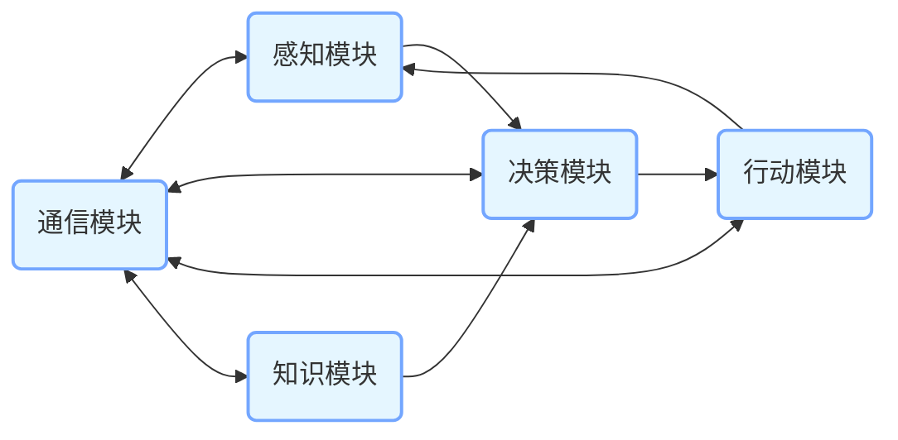

# 设计可扩展的AI Agent架构

> 关键词：AI Agent、可扩展架构、智能体设计、模块化、AI系统

> 摘要：本文聚焦于设计可扩展的AI Agent架构。随着人工智能技术的飞速发展，AI Agent在各个领域的应用日益广泛，对其架构的可扩展性要求也越来越高。文章将从背景介绍出发，深入阐述AI Agent的核心概念与联系，详细讲解核心算法原理及具体操作步骤，探讨相关数学模型和公式，通过项目实战展示代码实现与解读，分析实际应用场景，推荐相关工具和资源，最后总结未来发展趋势与挑战，并提供常见问题解答和扩展阅读参考资料，旨在为读者全面呈现可扩展AI Agent架构的设计思路和方法。

## 1. 背景介绍 
### 1.1 目的和范围
随着人工智能的广泛应用，AI Agent逐渐成为解决复杂任务的关键工具。设计可扩展的AI Agent架构的目的在于使AI Agent能够灵活适应不同的任务需求、不断变化的环境以及日益增长的数据量。本文章的范围涵盖了从AI Agent架构的基本概念到具体设计实现的各个方面，包括核心算法、数学模型、项目实战等，旨在为读者提供全面且深入的技术指导。

### 1.2 预期读者
本文预期读者包括人工智能领域的研究人员、开发者、软件架构师、CTO等专业人士，以及对AI Agent技术感兴趣的学生和爱好者。希望通过本文的内容，帮助读者深入理解可扩展AI Agent架构的设计原理和方法，提升相关技术能力。

### 1.3 文档结构概述
本文将按照以下结构展开：首先介绍背景信息，包括目的、预期读者和文档结构概述等；接着阐述AI Agent的核心概念与联系，通过文本示意图和Mermaid流程图进行说明；然后详细讲解核心算法原理和具体操作步骤，使用Python源代码进行阐述；之后探讨数学模型和公式，并举例说明；通过项目实战展示代码实现和详细解释；分析实际应用场景；推荐相关工具和资源；总结未来发展趋势与挑战；提供常见问题解答和扩展阅读参考资料。

### 1.4 术语表
#### 1.4.1 核心术语定义
- **AI Agent（人工智能智能体）**：能够感知环境、做出决策并采取行动以实现特定目标的智能实体。
- **可扩展架构**：具有良好的扩展性，能够在不进行大规模重构的情况下适应功能、数据量和用户数量增长的架构。
- **模块化设计**：将系统分解为多个独立的模块，每个模块具有特定的功能，模块之间通过接口进行交互。

#### 1.4.2 相关概念解释
- **感知**：AI Agent通过传感器或其他手段获取环境信息的过程。
- **决策**：根据感知到的信息，AI Agent运用算法和模型选择合适的行动方案的过程。
- **行动**：AI Agent根据决策结果在环境中执行相应操作的过程。

#### 1.4.3 缩略词列表
- **AI**：Artificial Intelligence（人工智能）
- **ML**：Machine Learning（机器学习）
- **RL**：Reinforcement Learning（强化学习）

## 2. 核心概念与联系 

### 核心概念原理
AI Agent的核心概念基于感知 - 决策 - 行动的循环过程。AI Agent通过各种传感器感知环境信息，将这些信息输入到决策模块中。决策模块运用机器学习、强化学习等算法和模型，根据感知信息和预设目标进行决策，选择合适的行动方案。最后，AI Agent将决策结果转化为具体的行动，作用于环境中。这个循环过程不断重复，使AI Agent能够不断适应环境变化，实现目标。

### 架构的文本示意图
AI Agent架构可以分为以下几个主要部分：
- **感知模块**：负责收集环境信息，包括图像、声音、文本等。
- **决策模块**：根据感知信息进行分析和推理，做出决策。
- **行动模块**：将决策结果转化为具体的行动，与环境进行交互。
- **知识模块**：存储和管理AI Agent的知识和经验，为决策提供支持。
- **通信模块**：实现AI Agent与其他智能体或系统之间的通信和协作。

这些模块之间通过接口进行交互，形成一个有机的整体。感知模块将环境信息传递给决策模块，决策模块根据知识模块中的知识进行决策，将决策结果发送给行动模块，行动模块执行相应的行动。同时，通信模块负责与外部进行信息交流，知识模块不断更新和优化知识。

### Mermaid流程图


这个流程图展示了AI Agent架构中各个模块之间的关系。感知模块将信息传递给决策模块，决策模块结合知识模块的知识进行决策，将决策结果发送给行动模块。行动模块的执行结果又可以反馈给感知模块，形成一个闭环。通信模块与其他模块进行信息交互，实现与外部的通信和协作。

## 3. 核心算法原理 & 具体操作步骤 

### 核心算法原理
在AI Agent的决策模块中，常用的算法包括机器学习算法和强化学习算法。下面以强化学习算法为例进行详细讲解。

强化学习是一种通过智能体与环境进行交互，不断尝试不同的行动，根据环境反馈的奖励信号来学习最优策略的算法。其核心思想是智能体在每个时间步根据当前状态选择一个行动，环境根据该行动给出一个奖励和下一个状态，智能体的目标是最大化长期累积奖励。

### 具体操作步骤
以下是使用Python实现一个简单的强化学习算法（Q - learning）的示例代码：

```python
import numpy as np

# 定义环境参数
num_states = 5
num_actions = 2
gamma = 0.9  # 折扣因子
alpha = 0.1  # 学习率

# 初始化Q表
Q = np.zeros((num_states, num_actions))

# 定义环境的状态转移和奖励函数
def get_next_state_and_reward(state, action):
    if state == 0 and action == 1:
        next_state = 1
        reward = 1
    elif state == 1 and action == 0:
        next_state = 0
        reward = -1
    else:
        next_state = state
        reward = 0
    return next_state, reward

# Q - learning算法
def q_learning(num_episodes):
    for episode in range(num_episodes):
        state = np.random.randint(0, num_states)  # 随机初始化状态
        done = False
        while not done:
            # 选择行动（epsilon - greedy策略）
            epsilon = 0.1
            if np.random.uniform(0, 1) < epsilon:
                action = np.random.randint(0, num_actions)
            else:
                action = np.argmax(Q[state, :])
            
            # 执行行动，获取下一个状态和奖励
            next_state, reward = get_next_state_and_reward(state, action)
            
            # 更新Q表
            Q[state, action] = Q[state, action] + alpha * (reward + gamma * np.max(Q[next_state, :]) - Q[state, action])
            
            # 判断是否结束
            if next_state == num_states - 1:
                done = True
            else:
                state = next_state
    
    return Q

# 训练Q表
num_episodes = 1000
Q = q_learning(num_episodes)
print("训练后的Q表：")
print(Q)
```

### 代码解释
1. **初始化**：定义环境的状态数、行动数、折扣因子和学习率，初始化Q表为全零矩阵。
2. **状态转移和奖励函数**：定义了环境的状态转移规则和奖励函数，根据当前状态和行动返回下一个状态和奖励。
3. **Q - learning算法**：在每个训练回合中，随机初始化状态，使用epsilon - greedy策略选择行动，执行行动并获取下一个状态和奖励，更新Q表。如果到达终止状态，则结束当前回合。
4. **训练**：运行多个训练回合，最终得到训练好的Q表。

通过这个示例，我们可以看到强化学习算法是如何在AI Agent的决策模块中工作的，智能体通过不断与环境交互，学习到最优的行动策略。

## 4. 数学模型和公式 & 详细讲解 & 举例说明 

### 数学模型
在强化学习中，常用的数学模型是马尔可夫决策过程（Markov Decision Process，MDP）。MDP可以用一个五元组 $<S, A, P, R, \gamma>$ 来表示，其中：
- $S$ 是状态集合，表示环境的所有可能状态。
- $A$ 是行动集合，表示智能体可以采取的所有行动。
- $P(s'|s, a)$ 是状态转移概率，表示在状态 $s$ 采取行动 $a$ 后转移到状态 $s'$ 的概率。
- $R(s, a, s')$ 是奖励函数，表示在状态 $s$ 采取行动 $a$ 转移到状态 $s'$ 后获得的奖励。
- $\gamma$ 是折扣因子，用于权衡当前奖励和未来奖励的重要性，取值范围为 $[0, 1]$。

### 公式
Q - learning算法的核心更新公式为：

$$Q(s, a) \leftarrow Q(s, a) + \alpha [R(s, a) + \gamma \max_{a'} Q(s', a') - Q(s, a)]$$

其中：
- $Q(s, a)$ 表示在状态 $s$ 采取行动 $a$ 的Q值。
- $\alpha$ 是学习率，控制每次更新的步长。
- $R(s, a)$ 是在状态 $s$ 采取行动 $a$ 后获得的即时奖励。
- $\gamma$ 是折扣因子。
- $s'$ 是执行行动 $a$ 后转移到的下一个状态。
- $\max_{a'} Q(s', a')$ 表示在下一个状态 $s'$ 下所有可能行动中最大的Q值。

### 详细讲解
Q - learning算法的目标是通过不断更新Q表，使得Q值能够逼近最优的行动价值函数。在每个时间步，智能体根据当前状态和Q表选择一个行动，执行该行动后获得即时奖励和下一个状态。然后，根据上述更新公式更新当前状态和行动的Q值。通过多次迭代，Q表逐渐收敛到最优值，智能体也就学习到了最优的行动策略。

### 举例说明
假设一个简单的环境，状态集合 $S = \{s_1, s_2\}$，行动集合 $A = \{a_1, a_2\}$。初始时，Q表 $Q$ 为：

$$
Q = \begin{bmatrix}
0 & 0 \\
0 & 0
\end{bmatrix}
$$

当前状态 $s = s_1$，选择行动 $a = a_1$，执行该行动后获得奖励 $R(s_1, a_1) = 1$，转移到下一个状态 $s' = s_2$。假设 $\alpha = 0.1$，$\gamma = 0.9$，下一个状态 $s_2$ 下 $Q(s_2, a_1) = 0$，$Q(s_2, a_2) = 0$。则根据Q - learning更新公式：

$$
Q(s_1, a_1) \leftarrow Q(s_1, a_1) + 0.1 [1 + 0.9 \max(0, 0) - Q(s_1, a_1)] = 0 + 0.1(1 + 0 - 0) = 0.1
$$

更新后的Q表为：

$$
Q = \begin{bmatrix}
0.1 & 0 \\
0 & 0
\end{bmatrix}
$$

通过不断重复这个过程，Q表会不断更新，智能体也会学习到更优的行动策略。

## 5. 项目实战：代码实际案例和详细解释说明 

### 5.1  开发环境搭建
在进行项目实战之前，需要搭建相应的开发环境。以下是具体步骤：
1. **安装Python**：建议安装Python 3.7及以上版本。可以从Python官方网站（https://www.python.org/downloads/） 下载并安装。
2. **安装必要的库**：在命令行中使用以下命令安装所需的库：
```bash
pip install numpy
```
3. **选择开发工具**：可以使用PyCharm、Jupyter Notebook等开发工具。这里以Jupyter Notebook为例，安装命令如下：
```bash
pip install jupyter
```
安装完成后，在命令行中输入 `jupyter notebook` 启动Jupyter Notebook。

### 5.2  源代码详细实现和代码解读
以下是一个简单的AI Agent项目实战代码，模拟一个智能机器人在迷宫中寻找出口的过程。

```python
import numpy as np
import random

# 定义迷宫环境
maze = np.array([
    [0, 1, 0, 0],
    [0, 1, 0, 1],
    [0, 0, 0, 0],
    [0, 1, 1, 0]
])

start_state = (0, 0)
goal_state = (3, 3)

# 定义行动集合
actions = [(0, 1), (0, -1), (1, 0), (-1, 0)]  # 右，左，下，上

# 初始化Q表
num_states = maze.size
num_actions = len(actions)
Q = np.zeros((num_states, num_actions))

# 定义状态转换函数
def state_to_index(state):
    return state[0] * maze.shape[1] + state[1]

def index_to_state(index):
    row = index // maze.shape[1]
    col = index % maze.shape[1]
    return (row, col)

# 定义奖励函数
def get_reward(state, action):
    next_state = (state[0] + action[0], state[1] + action[1])
    if next_state[0] < 0 or next_state[0] >= maze.shape[0] or next_state[1] < 0 or next_state[1] >= maze.shape[1]:
        return -10, state  # 越界
    if maze[next_state[0], next_state[1]] == 1:
        return -10, state  # 撞到墙
    if next_state == goal_state:
        return 100, next_state  # 到达目标
    return -1, next_state  # 正常移动

# Q - learning算法
def q_learning(num_episodes):
    gamma = 0.9
    alpha = 0.1
    epsilon = 0.1
    for episode in range(num_episodes):
        state = start_state
        done = False
        while not done:
            state_index = state_to_index(state)
            if random.uniform(0, 1) < epsilon:
                action_index = random.randint(0, num_actions - 1)
            else:
                action_index = np.argmax(Q[state_index, :])
            action = actions[action_index]
            reward, next_state = get_reward(state, action)
            next_state_index = state_to_index(next_state)
            Q[state_index, action_index] = Q[state_index, action_index] + alpha * (reward + gamma * np.max(Q[next_state_index, :]) - Q[state_index, action_index])
            if next_state == goal_state:
                done = True
            state = next_state
    return Q

# 训练Q表
num_episodes = 1000
Q = q_learning(num_episodes)

# 测试智能体
state = start_state
path = [state]
done = False
while not done:
    state_index = state_to_index(state)
    action_index = np.argmax(Q[state_index, :])
    action = actions[action_index]
    _, next_state = get_reward(state, action)
    path.append(next_state)
    if next_state == goal_state:
        done = True
    state = next_state

print("找到的路径：", path)
```

### 5.3  代码解读与分析
1. **迷宫环境定义**：使用二维数组 `maze` 表示迷宫，0表示通路，1表示墙。定义了起点 `start_state` 和终点 `goal_state`。
2. **行动集合**：定义了四个行动，分别是右、左、下、上。
3. **Q表初始化**：根据迷宫的状态数和行动数初始化Q表为全零矩阵。
4. **状态转换函数**：`state_to_index` 和 `index_to_state` 函数用于在状态和状态索引之间进行转换。
5. **奖励函数**：`get_reward` 函数根据当前状态和行动返回奖励和下一个状态。越界或撞到墙会得到负奖励，到达目标会得到正奖励，正常移动会得到小的负奖励。
6. **Q - learning算法**：在每个训练回合中，使用epsilon - greedy策略选择行动，执行行动并获取奖励和下一个状态，更新Q表。如果到达目标状态，则结束当前回合。
7. **测试智能体**：使用训练好的Q表，从起点开始，每次选择Q值最大的行动，直到到达目标状态，记录路径。

通过这个项目实战，我们可以看到如何将强化学习算法应用到实际的AI Agent项目中，实现智能体在迷宫中寻找出口的功能。

## 6. 实际应用场景 
### 游戏领域
在游戏中，AI Agent可以作为游戏角色的智能控制模块。例如，在策略游戏中，AI Agent可以根据游戏局势做出决策，如选择建造建筑、训练部队、发动攻击等。在动作游戏中，AI Agent可以控制游戏角色的移动、攻击、躲避等行为，提高游戏的趣味性和挑战性。

### 自动驾驶领域
自动驾驶汽车中的AI Agent可以感知周围环境，包括道路、车辆、行人等信息，根据这些信息做出决策，如加速、减速、转弯、停车等。AI Agent需要不断学习和适应不同的驾驶场景，确保自动驾驶的安全性和可靠性。

### 智能客服领域
智能客服系统中的AI Agent可以理解用户的问题，根据知识库和机器学习模型给出相应的回答。AI Agent可以通过自然语言处理技术与用户进行交互，提供个性化的服务，提高用户满意度。

### 工业自动化领域
在工业生产中，AI Agent可以控制机器人的操作，如物料搬运、零件装配等。AI Agent可以根据生产任务和环境信息，优化机器人的行动路径和操作方式，提高生产效率和质量。

## 7. 工具和资源推荐
### 7.1 学习资源推荐
#### 7.1.1 书籍推荐
- 《人工智能：一种现代的方法》：这是一本经典的人工智能教材，全面介绍了人工智能的各个领域，包括搜索算法、知识表示、机器学习、自然语言处理等。
- 《强化学习：原理与Python实现》：详细介绍了强化学习的基本原理和算法，通过Python代码示例帮助读者理解和实现强化学习算法。
- 《深度学习》：由深度学习领域的三位领军人物编写，深入介绍了深度学习的理论和实践，是深度学习领域的权威著作。

#### 7.1.2 在线课程
- Coursera上的“机器学习”课程：由Andrew Ng教授主讲，是机器学习领域的经典课程，涵盖了机器学习的基本概念、算法和应用。
- edX上的“强化学习基础”课程：系统介绍了强化学习的基本原理和算法，通过实践项目帮助学生掌握强化学习的应用。
- Udemy上的“人工智能实战课程”：结合实际项目，介绍了人工智能的各个领域的应用，包括计算机视觉、自然语言处理、强化学习等。

#### 7.1.3 技术博客和网站
- Medium：上面有很多人工智能领域的技术博客和文章，涵盖了最新的研究成果和实践经验。
- arXiv：是一个预印本数据库，提供了大量的人工智能领域的研究论文。
- OpenAI博客：OpenAI发布的关于人工智能的最新研究成果和技术动态。

### 7.2 开发工具框架推荐
#### 7.2.1 IDE和编辑器
- PyCharm：是一款专业的Python集成开发环境，提供了丰富的代码编辑、调试、测试等功能，适合开发大型Python项目。
- Jupyter Notebook：是一个交互式的开发环境，支持Python、R等多种编程语言，适合进行数据分析、机器学习等实验和研究。
- Visual Studio Code：是一款轻量级的代码编辑器，支持多种编程语言和插件，具有丰富的扩展功能。

#### 7.2.2 调试和性能分析工具
- PySnooper：是一个简单易用的Python调试工具，可以自动记录函数的调用过程和变量的值，方便调试代码。
- cProfile：是Python内置的性能分析工具，可以分析代码的执行时间和函数调用次数，帮助优化代码性能。
- TensorBoard：是TensorFlow的可视化工具，可以用于可视化训练过程、模型结构、数据分布等，方便调试和优化深度学习模型。

#### 7.2.3 相关框架和库
- TensorFlow：是一个开源的深度学习框架，提供了丰富的深度学习模型和工具，支持GPU加速，广泛应用于计算机视觉、自然语言处理等领域。
- PyTorch：是另一个流行的深度学习框架，具有动态计算图的特点，易于使用和调试，受到很多研究人员和开发者的喜爱。
- Stable Baselines3：是一个基于PyTorch的强化学习库，提供了多种强化学习算法的实现，方便用户快速开发和测试强化学习模型。

### 7.3 相关论文著作推荐
#### 7.3.1 经典论文
- “Q - learning”：由Watkins和Dayan发表的经典论文，首次提出了Q - learning算法，为强化学习的发展奠定了基础。
- “Playing Atari with Deep Reinforcement Learning”：由DeepMind团队发表的论文，介绍了使用深度强化学习算法在Atari游戏中取得了超越人类水平的成绩，展示了深度强化学习的强大能力。
- “Attention Is All You Need”：提出了Transformer架构，在自然语言处理领域取得了巨大的成功，是深度学习领域的重要突破。

#### 7.3.2 最新研究成果
- 关注顶级学术会议如NeurIPS、ICML、CVPR等的最新论文，了解人工智能领域的最新研究动态和技术趋势。
- 关注知名研究机构和学者的研究成果，如OpenAI、DeepMind、Facebook AI Research等。

#### 7.3.3 应用案例分析
- 分析一些实际应用案例的论文，如自动驾驶、智能医疗、金融风控等领域的AI Agent应用案例，了解如何将AI Agent技术应用到实际场景中，解决实际问题。

## 8. 总结：未来发展趋势与挑战
### 未来发展趋势
- **多智能体协作**：未来的AI Agent将不再是孤立的个体，而是多个智能体之间进行协作，共同完成复杂的任务。例如，在自动驾驶领域，多辆自动驾驶汽车之间可以进行协作，提高交通效率和安全性。
- **与人类的深度融合**：AI Agent将与人类进行更加深度的融合，实现人机协作。例如，在医疗领域，AI Agent可以辅助医生进行诊断和治疗，提高医疗水平。
- **可解释性和可靠性**：随着AI Agent在关键领域的应用越来越广泛，对其可解释性和可靠性的要求也越来越高。未来的研究将致力于提高AI Agent的可解释性和可靠性，让人们更加信任和依赖AI Agent。
- **跨领域应用**：AI Agent将在更多的领域得到应用，如教育、文化、艺术等。通过与不同领域的知识和技术相结合，AI Agent将创造出更多的价值。

### 挑战
- **数据隐私和安全**：AI Agent的训练和运行需要大量的数据，这些数据可能包含用户的隐私信息。如何保证数据的隐私和安全是一个重要的挑战。
- **算法复杂度和计算资源**：随着AI Agent的功能越来越复杂，其算法复杂度也越来越高，需要大量的计算资源。如何优化算法，提高计算效率是一个亟待解决的问题。
- **伦理和法律问题**：AI Agent的决策和行为可能会对人类产生影响，涉及到伦理和法律问题。例如，自动驾驶汽车在遇到紧急情况时的决策可能会涉及到道德和法律责任。如何制定相应的伦理和法律规范是一个重要的挑战。

## 9. 附录：常见问题与解答
### 问题1：如何选择合适的AI Agent架构？
解答：选择合适的AI Agent架构需要考虑多个因素，如任务需求、数据量、计算资源等。对于简单的任务，可以选择较为简单的架构；对于复杂的任务，可能需要采用模块化、分层的架构。同时，还需要考虑架构的可扩展性和灵活性，以便能够适应未来的变化。

### 问题2：如何提高AI Agent的性能？
解答：可以从以下几个方面提高AI Agent的性能：选择合适的算法和模型，优化算法的参数；增加训练数据的数量和质量，提高模型的泛化能力；采用并行计算和分布式计算技术，提高计算效率；对模型进行优化和调优，如剪枝、量化等。

### 问题3：AI Agent的可解释性有什么重要性？
解答：AI Agent的可解释性对于其在关键领域的应用非常重要。在医疗、金融等领域，人们需要了解AI Agent的决策依据，以便做出正确的判断和决策。同时，可解释性也有助于发现模型中的问题和偏差，提高模型的可靠性和安全性。

### 问题4：如何处理AI Agent中的伦理和法律问题？
解答：处理AI Agent中的伦理和法律问题需要多方面的努力。一方面，需要制定相应的伦理和法律规范，明确AI Agent的责任和义务；另一方面，需要在技术层面上提高AI Agent的可解释性和可控性，确保其决策和行为符合伦理和法律要求。此外，还需要加强公众的教育和宣传，提高人们对AI Agent伦理和法律问题的认识。

## 10. 扩展阅读 & 参考资料
### 扩展阅读
- 《AI 未来进行式》：李开复和王咏刚所著，探讨了人工智能的未来发展趋势和对社会的影响。
- 《智能时代》：吴军所著，介绍了大数据和人工智能对各个领域的变革和影响。

### 参考资料
- 相关学术论文和研究报告，如NeurIPS、ICML、CVPR等会议的论文。
- 开源项目和代码库，如GitHub上的相关项目。
- 人工智能领域的官方文档和技术博客，如TensorFlow、PyTorch等官方文档。