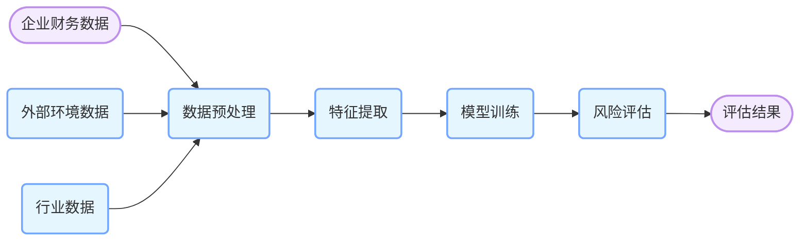

# 设计智能化的企业财务风险量化评估模型

> 关键词：企业财务风险、量化评估模型、智能化、数据挖掘、机器学习

> 摘要：本文聚焦于设计智能化的企业财务风险量化评估模型。首先介绍了该模型设计的背景，包括目的、预期读者等内容。接着阐述了核心概念与联系，详细解释了企业财务风险相关原理并给出架构示意图和流程图。深入探讨了核心算法原理，用 Python 代码进行了详细说明，同时介绍了相关数学模型和公式并举例。通过项目实战，展示了开发环境搭建、源代码实现与解读。分析了该模型的实际应用场景，推荐了学习、开发等相关工具和资源。最后总结了未来发展趋势与挑战，提供了常见问题解答和扩展阅读参考资料，旨在为企业提供有效的财务风险评估手段，助力企业稳健发展。

## 1. 背景介绍 
### 1.1 目的和范围
企业在经营过程中面临着各种各样的财务风险，如市场波动、信用风险、资金链断裂等。准确评估企业的财务风险对于企业的管理者、投资者、债权人等利益相关者都具有重要意义。本模型的目的在于设计一个智能化的企业财务风险量化评估模型，通过对企业财务数据的分析和挖掘，为利益相关者提供准确、客观的财务风险评估结果。

本模型的范围涵盖了企业的主要财务指标，如资产负债率、流动比率、利润率等，同时考虑了宏观经济环境、行业竞争等外部因素对企业财务风险的影响。通过综合分析这些因素，模型能够全面、准确地评估企业的财务风险水平。

### 1.2 预期读者
本模型的预期读者包括企业的管理者、财务人员、投资者、债权人、金融分析师以及对企业财务风险评估感兴趣的研究人员。企业管理者可以利用本模型了解企业的财务风险状况，制定合理的风险管理策略；投资者和债权人可以通过模型评估企业的信用风险，做出投资和信贷决策；金融分析师可以借助模型进行行业研究和企业比较；研究人员可以将本模型作为研究企业财务风险的工具。

### 1.3 文档结构概述
本文将按照以下结构进行阐述：首先介绍核心概念与联系，包括企业财务风险的定义、相关理论和模型架构；接着详细讲解核心算法原理和具体操作步骤，并用 Python 代码进行实现；然后介绍数学模型和公式，通过举例说明其应用；再通过项目实战展示模型的开发和应用过程；之后分析模型的实际应用场景；推荐相关的工具和资源；最后总结未来发展趋势与挑战，提供常见问题解答和扩展阅读参考资料。

### 1.4 术语表
#### 1.4.1 核心术语定义
- **企业财务风险**：指企业在各项财务活动中，由于各种难以预料或无法控制的因素作用，使企业的实际收益与预期收益发生背离，从而蒙受经济损失的可能性。
- **量化评估模型**：是一种通过数学方法和统计技术，对企业财务风险进行定量分析和评估的模型。
- **智能化**：指模型能够利用人工智能技术，如机器学习、深度学习等，自动学习和优化，提高评估的准确性和效率。

#### 1.4.2 相关概念解释
- **财务指标**：是指企业在一定时期内的财务状况和经营成果的量化表现，如资产、负债、收入、利润等。
- **风险预警**：是指通过对企业财务指标和相关数据的监测和分析，提前发现潜在的财务风险，并发出警报。
- **风险管理**：是指企业通过识别、评估、控制和应对财务风险，降低风险损失，实现企业目标的过程。

#### 1.4.3 缩略词列表
- **PCA**：主成分分析（Principal Component Analysis）
- **SVM**：支持向量机（Support Vector Machine）
- **LR**：逻辑回归（Logistic Regression）
- **ANN**：人工神经网络（Artificial Neural Network）

## 2. 核心概念与联系 
### 企业财务风险的概念与分类
企业财务风险是企业经营过程中不可避免的问题，它贯穿于企业生产经营的各个环节。从不同的角度可以对企业财务风险进行分类，常见的分类方法有以下几种：
- **筹资风险**：指企业在筹集资金过程中，由于资金来源渠道、筹资方式、筹资成本等因素的变化，导致企业无法按时足额偿还债务的风险。
- **投资风险**：指企业在投资过程中，由于投资项目的选择、投资决策的失误、投资环境的变化等因素，导致投资收益无法达到预期目标的风险。
- **资金营运风险**：指企业在日常生产经营过程中，由于资金周转不畅、存货积压、应收账款回收困难等因素，导致企业资金链断裂的风险。
- **收益分配风险**：指企业在利润分配过程中，由于利润分配政策的不合理、股利支付水平的过高或过低等因素，导致企业股东利益受损的风险。

### 量化评估模型的原理
量化评估模型的基本原理是通过对企业财务数据和相关信息的收集、整理和分析，建立数学模型，对企业的财务风险进行定量评估。常用的量化评估模型包括统计模型、机器学习模型和深度学习模型等。

统计模型是基于统计学原理，通过对历史数据的分析和拟合，建立回归方程或判别函数，对企业的财务风险进行评估。常见的统计模型有多元线性回归模型、逻辑回归模型、判别分析模型等。

机器学习模型是基于机器学习算法，通过对大量数据的学习和训练，建立分类器或预测模型，对企业的财务风险进行评估。常见的机器学习模型有支持向量机、决策树、随机森林、神经网络等。

深度学习模型是基于深度学习算法，通过对大量数据的深度挖掘和学习，建立深度神经网络模型，对企业的财务风险进行评估。常见的深度学习模型有卷积神经网络、循环神经网络、长短时记忆网络等。

### 智能化的实现方式
智能化的企业财务风险量化评估模型主要通过以下几种方式实现：
- **数据挖掘技术**：利用数据挖掘技术对企业的财务数据和相关信息进行挖掘和分析，发现潜在的风险因素和规律。
- **机器学习算法**：利用机器学习算法对企业的财务数据进行学习和训练，建立分类器或预测模型，对企业的财务风险进行评估。
- **深度学习算法**：利用深度学习算法对企业的财务数据进行深度挖掘和学习，建立深度神经网络模型，对企业的财务风险进行评估。
- **智能决策系统**：利用智能决策系统对企业的财务风险进行实时监测和预警，为企业的管理者提供决策支持。

### 核心概念架构示意图


## 3. 核心算法原理 & 具体操作步骤 
### 主成分分析（PCA）算法原理
主成分分析（PCA）是一种常用的数据降维技术，它通过对原始数据进行线性变换，将高维数据转换为低维数据，同时保留原始数据的主要信息。PCA 的基本思想是找到一组正交的坐标轴，使得数据在这些坐标轴上的投影方差最大。

PCA 的具体步骤如下：
1. **数据标准化**：对原始数据进行标准化处理，使得每个变量的均值为 0，标准差为 1。
2. **计算协方差矩阵**：计算标准化后数据的协方差矩阵。
3. **计算特征值和特征向量**：对协方差矩阵进行特征值分解，得到特征值和特征向量。
4. **选择主成分**：根据特征值的大小，选择前 k 个特征值对应的特征向量作为主成分。
5. **数据投影**：将原始数据投影到主成分上，得到降维后的数据。

### Python 代码实现
```python
import numpy as np

def pca(X, k):
    # 数据标准化
    X_mean = np.mean(X, axis=0)
    X_std = np.std(X, axis=0)
    X_normalized = (X - X_mean) / X_std
    
    # 计算协方差矩阵
    cov_matrix = np.cov(X_normalized.T)
    
    # 计算特征值和特征向量
    eigenvalues, eigenvectors = np.linalg.eig(cov_matrix)
    
    # 选择前 k 个特征值对应的特征向量
    indices = np.argsort(eigenvalues)[::-1]
    top_k_eigenvectors = eigenvectors[:, indices[:k]]
    
    # 数据投影
    X_pca = np.dot(X_normalized, top_k_eigenvectors)
    
    return X_pca
```

### 逻辑回归（LR）算法原理
逻辑回归（LR）是一种常用的分类算法，它通过对输入数据进行线性组合，然后通过逻辑函数将线性组合的结果映射到 0 到 1 之间的概率值，从而实现分类任务。逻辑回归的基本模型可以表示为：

$$P(y=1|x)=\frac{1}{1 + e^{-(w^T x + b)}}$$

其中，$x$ 是输入特征向量，$w$ 是权重向量，$b$ 是偏置项，$P(y=1|x)$ 是样本属于正类的概率。

逻辑回归的目标是找到一组最优的权重向量 $w$ 和偏置项 $b$，使得模型的预测结果与真实标签之间的误差最小。通常使用最大似然估计来求解最优参数。

### Python 代码实现
```python
import numpy as np

class LogisticRegression:
    def __init__(self, learning_rate=0.01, num_iterations=1000):
        self.learning_rate = learning_rate
        self.num_iterations = num_iterations
        self.weights = None
        self.bias = None

    def sigmoid(self, z):
        return 1 / (1 + np.exp(-z))

    def fit(self, X, y):
        num_samples, num_features = X.shape
        self.weights = np.zeros(num_features)
        self.bias = 0

        for _ in range(self.num_iterations):
            linear_model = np.dot(X, self.weights) + self.bias
            y_pred = self.sigmoid(linear_model)

            dw = (1 / num_samples) * np.dot(X.T, (y_pred - y))
            db = (1 / num_samples) * np.sum(y_pred - y)

            self.weights -= self.learning_rate * dw
            self.bias -= self.learning_rate * db

    def predict(self, X):
        linear_model = np.dot(X, self.weights) + self.bias
        y_pred = self.sigmoid(linear_model)
        y_pred_cls = [1 if i > 0.5 else 0 for i in y_pred]
        return np.array(y_pred_cls)
```

### 具体操作步骤
1. **数据收集**：收集企业的财务数据和相关信息，包括资产负债表、利润表、现金流量表等。
2. **数据预处理**：对收集到的数据进行清洗、缺失值处理、异常值处理等操作，确保数据的质量。
3. **特征提取**：从预处理后的数据中提取与企业财务风险相关的特征，如财务比率、经营指标等。
4. **数据降维**：使用 PCA 等方法对提取的特征进行降维处理，减少数据的维度，提高模型的训练效率。
5. **模型训练**：使用逻辑回归等机器学习算法对降维后的数据进行训练，建立企业财务风险量化评估模型。
6. **模型评估**：使用测试数据对训练好的模型进行评估，计算模型的准确率、召回率、F1 值等指标，评估模型的性能。
7. **模型优化**：根据模型评估的结果，对模型进行优化，调整模型的参数，提高模型的性能。
8. **风险评估**：使用优化后的模型对企业的财务风险进行评估，得到企业的财务风险评估结果。

## 4. 数学模型和公式 & 详细讲解 & 举例说明 
### 主成分分析（PCA）的数学模型和公式
#### 协方差矩阵的计算
设 $X$ 是一个 $n\times m$ 的数据矩阵，其中 $n$ 是样本数量，$m$ 是特征数量。协方差矩阵 $S$ 的计算公式为：

$$S=\frac{1}{n - 1}(X - \bar{X})^T(X - \bar{X})$$

其中，$\bar{X}$ 是数据矩阵 $X$ 的均值矩阵。

#### 特征值和特征向量的计算
对协方差矩阵 $S$ 进行特征值分解，得到特征值 $\lambda_i$ 和特征向量 $v_i$，满足：

$$Sv_i=\lambda_iv_i$$

#### 主成分的选择
根据特征值的大小，选择前 $k$ 个特征值对应的特征向量作为主成分。主成分的贡献率计算公式为：

$$贡献率=\frac{\lambda_i}{\sum_{j = 1}^{m}\lambda_j}$$

累计贡献率计算公式为：

$$累计贡献率=\frac{\sum_{i = 1}^{k}\lambda_i}{\sum_{j = 1}^{m}\lambda_j}$$

通常选择累计贡献率达到 80% - 90% 的前 $k$ 个主成分。

#### 举例说明
假设有一个包含 5 个样本，3 个特征的数据矩阵 $X$：

$$X=\begin{bmatrix}
1 & 2 & 3\\
4 & 5 & 6\\
7 & 8 & 9\\
10 & 11 & 12\\
13 & 14 & 15
\end{bmatrix}$$

首先计算数据矩阵 $X$ 的均值矩阵 $\bar{X}$：

$$\bar{X}=\begin{bmatrix}
7 & 8 & 9
\end{bmatrix}$$

然后计算协方差矩阵 $S$：

$$S=\frac{1}{4}(X - \bar{X})^T(X - \bar{X})=\begin{bmatrix}
30 & 30 & 30\\
30 & 30 & 30\\
30 & 30 & 30
\end{bmatrix}$$

对协方差矩阵 $S$ 进行特征值分解，得到特征值 $\lambda_1 = 90$，$\lambda_2 = 0$，$\lambda_3 = 0$，对应的特征向量分别为：

$$v_1=\begin{bmatrix}
0.5774\\
0.5774\\
0.5774
\end{bmatrix}$$

$$v_2=\begin{bmatrix}
-0.8165\\
0.4082\\
0.4082
\end{bmatrix}$$

$$v_3=\begin{bmatrix}
0\\
-0.7071\\
0.7071
\end{bmatrix}$$

由于第一个特征值的贡献率为 100%，因此选择第一个特征向量作为主成分。将原始数据矩阵 $X$ 投影到主成分上，得到降维后的数据矩阵 $X_{pca}$：

$$X_{pca}=Xv_1=\begin{bmatrix}
3.4641\\
10.3923\\
17.3205\\
24.2487\\
31.1769
\end{bmatrix}$$

### 逻辑回归（LR）的数学模型和公式
#### 逻辑函数
逻辑函数（也称为 sigmoid 函数）的计算公式为：

$$\sigma(z)=\frac{1}{1 + e^{-z}}$$

其中，$z$ 是输入变量。逻辑函数的取值范围是 $(0, 1)$，可以将任意实数映射到 $(0, 1)$ 之间的概率值。

#### 损失函数
逻辑回归的损失函数通常使用对数损失函数（也称为交叉熵损失函数），其计算公式为：

$$L(y, \hat{y})=-[y\log(\hat{y})+(1 - y)\log(1 - \hat{y})]$$

其中，$y$ 是真实标签，$\hat{y}$ 是模型的预测概率。

#### 梯度下降法
为了求解逻辑回归的最优参数，通常使用梯度下降法。梯度下降法的更新公式为：

$$w_{i+1}=w_i-\alpha\frac{\partial L}{\partial w_i}$$

$$b_{i+1}=b_i-\alpha\frac{\partial L}{\partial b}$$

其中，$w$ 是权重向量，$b$ 是偏置项，$\alpha$ 是学习率。

#### 举例说明
假设有一个二分类问题，样本数量为 100，特征数量为 2。真实标签 $y$ 是一个长度为 100 的向量，取值为 0 或 1。输入特征矩阵 $X$ 是一个 $100\times 2$ 的矩阵。

首先初始化权重向量 $w$ 和偏置项 $b$ 为 0：

$$w=\begin{bmatrix}
0\\
0
\end{bmatrix}$$

$$b = 0$$

然后使用梯度下降法进行迭代更新，每次迭代计算损失函数的梯度，并更新权重向量和偏置项：

```python
import numpy as np

# 生成随机数据
np.random.seed(0)
X = np.random.randn(100, 2)
y = np.random.randint(0, 2, 100)

# 初始化参数
w = np.zeros(2)
b = 0
learning_rate = 0.01
num_iterations = 1000

for _ in range(num_iterations):
    linear_model = np.dot(X, w) + b
    y_pred = 1 / (1 + np.exp(-linear_model))

    dw = (1 / 100) * np.dot(X.T, (y_pred - y))
    db = (1 / 100) * np.sum(y_pred - y)

    w -= learning_rate * dw
    b -= learning_rate * db

# 预测
linear_model = np.dot(X, w) + b
y_pred = 1 / (1 + np.exp(-linear_model))
y_pred_cls = [1 if i > 0.5 else 0 for i in y_pred]
```

## 5. 项目实战：代码实际案例和详细解释说明 
### 5.1  开发环境搭建
#### 操作系统
本项目可以在 Windows、Linux 或 macOS 操作系统上进行开发。建议使用 Linux 或 macOS 操作系统，因为它们对 Python 开发环境的支持更好。

#### Python 环境
本项目使用 Python 3.x 版本进行开发。可以从 Python 官方网站（https://www.python.org/downloads/） 下载并安装 Python 3.x 版本。

#### 虚拟环境
为了避免不同项目之间的依赖冲突，建议使用虚拟环境进行开发。可以使用 `venv` 或 `conda` 来创建虚拟环境。

使用 `venv` 创建虚拟环境的命令如下：

```sh
python -m venv myenv
```

激活虚拟环境的命令如下：

- Windows：

```sh
myenv\Scripts\activate
```

- Linux 或 macOS：

```sh
source myenv/bin/activate
```

#### 安装依赖库
本项目需要安装以下依赖库：
- `numpy`：用于数值计算。
- `pandas`：用于数据处理和分析。
- `scikit-learn`：用于机器学习算法的实现。
- `matplotlib`：用于数据可视化。

可以使用 `pip` 来安装这些依赖库：

```sh
pip install numpy pandas scikit-learn matplotlib
```

### 5.2  源代码详细实现和代码解读
#### 数据加载和预处理
```python
import pandas as pd
from sklearn.preprocessing import StandardScaler
from sklearn.model_selection import train_test_split

# 加载数据
data = pd.read_csv('financial_data.csv')

# 分离特征和标签
X = data.drop('risk_label', axis=1)
y = data['risk_label']

# 数据标准化
scaler = StandardScaler()
X_scaled = scaler.fit_transform(X)

# 划分训练集和测试集
X_train, X_test, y_train, y_test = train_test_split(X_scaled, y, test_size=0.2, random_state=42)
```
代码解读：
- 首先使用 `pandas` 库的 `read_csv` 函数加载包含企业财务数据的 CSV 文件。
- 然后使用 `drop` 方法分离特征和标签，将 `risk_label` 列作为标签，其余列作为特征。
- 接着使用 `StandardScaler` 对特征数据进行标准化处理，使得每个特征的均值为 0，标准差为 1。
- 最后使用 `train_test_split` 函数将数据划分为训练集和测试集，测试集占总数据的 20%。

#### 特征提取和降维
```python
from sklearn.decomposition import PCA

# 特征提取和降维
pca = PCA(n_components=0.9)
X_train_pca = pca.fit_transform(X_train)
X_test_pca = pca.transform(X_test)
```
代码解读：
- 使用 `PCA` 类进行主成分分析，设置 `n_components=0.9` 表示保留 90% 的方差。
- 对训练集进行 `fit_transform` 操作，计算主成分并将训练集数据进行降维。
- 对测试集进行 `transform` 操作，使用训练集计算的主成分将测试集数据进行降维。

#### 模型训练和评估
```python
from sklearn.linear_model import LogisticRegression
from sklearn.metrics import accuracy_score, recall_score, f1_score

# 模型训练
model = LogisticRegression()
model.fit(X_train_pca, y_train)

# 模型预测
y_pred = model.predict(X_test_pca)

# 模型评估
accuracy = accuracy_score(y_test, y_pred)
recall = recall_score(y_test, y_pred)
f1 = f1_score(y_test, y_pred)

print(f"Accuracy: {accuracy}")
print(f"Recall: {recall}")
print(f"F1-score: {f1}")
```
代码解读：
- 使用 `LogisticRegression` 类创建逻辑回归模型。
- 使用 `fit` 方法对训练集数据进行训练。
- 使用 `predict` 方法对测试集数据进行预测。
- 使用 `accuracy_score`、`recall_score` 和 `f1_score` 函数计算模型的准确率、召回率和 F1 值，并打印输出。

### 5.3  代码解读与分析
#### 数据预处理的重要性
数据预处理是机器学习项目中非常重要的一步，它可以提高数据的质量，减少噪声和异常值的影响，从而提高模型的性能。在本项目中，我们使用了标准化处理来消除特征之间的量纲差异，使得每个特征对模型的影响是同等重要的。

#### 特征提取和降维的作用
特征提取和降维可以减少数据的维度，降低模型的复杂度，提高模型的训练效率和泛化能力。在本项目中，我们使用了主成分分析（PCA）来进行特征提取和降维，保留了 90% 的方差，既减少了数据的维度，又保留了原始数据的主要信息。

#### 模型评估指标的选择
在评估模型性能时，我们选择了准确率、召回率和 F1 值作为评估指标。准确率表示模型预测正确的样本占总样本的比例，召回率表示模型正确预测的正样本占实际正样本的比例，F1 值是准确率和召回率的调和平均数。选择这些指标可以全面地评估模型的性能。

## 6. 实际应用场景 
### 企业内部风险管理
企业管理者可以利用智能化的企业财务风险量化评估模型，对企业的财务状况进行实时监测和评估，及时发现潜在的财务风险，并采取相应的措施进行防范和控制。例如，当模型检测到企业的资产负债率过高时，管理者可以采取增加股权融资、减少债务融资等措施来降低财务风险。

### 投资者决策支持
投资者可以使用该模型对投资对象的财务风险进行评估，为投资决策提供参考。例如，在选择股票投资时，投资者可以通过模型评估企业的财务风险水平，选择财务风险较低的企业进行投资，降低投资风险。

### 金融机构信贷审批
金融机构在进行信贷审批时，可以利用该模型对借款人的财务风险进行评估，判断借款人的还款能力和信用风险。例如，银行在审批企业贷款时，可以通过模型评估企业的财务状况，决定是否给予贷款以及贷款的额度和利率。

### 监管机构监督管理
监管机构可以使用该模型对企业的财务风险进行监测和评估，加强对企业的监管力度。例如，证券监管机构可以通过模型对上市公司的财务风险进行监测，及时发现和处理财务造假、内幕交易等违法违规行为。

## 7. 工具和资源推荐
### 7.1 学习资源推荐
#### 7.1.1 书籍推荐
- 《Python 数据分析实战》：本书介绍了使用 Python 进行数据分析的基本方法和技巧，包括数据清洗、数据可视化、机器学习等内容，适合初学者学习。
- 《机器学习》：周志华著，本书系统地介绍了机器学习的基本概念、算法和应用，是机器学习领域的经典教材。
- 《深度学习》：Ian Goodfellow、Yoshua Bengio 和 Aaron Courville 著，本书全面地介绍了深度学习的基本原理、算法和应用，是深度学习领域的权威著作。

#### 7.1.2 在线课程
- Coursera 上的 “机器学习” 课程：由 Andrew Ng 教授授课，是机器学习领域的经典课程，适合初学者学习。
- edX 上的 “深度学习” 课程：由 Berkeley 大学的教授授课，系统地介绍了深度学习的基本原理和算法。
- 中国大学 MOOC 上的 “Python 数据分析与挖掘实战” 课程：由国内高校的教授授课，介绍了使用 Python 进行数据分析和挖掘的方法和技巧。

#### 7.1.3 技术博客和网站
- Medium：一个技术博客平台，上面有很多关于机器学习、数据分析等领域的优秀文章。
- Kaggle：一个数据科学竞赛平台，上面有很多数据科学项目和代码示例，可以学习和参考。
- 开源中国：一个国内的开源技术社区，上面有很多关于 Python 开发、机器学习等领域的技术文章和教程。

### 7.2 开发工具框架推荐
#### 7.2.1 IDE和编辑器
- PyCharm：一款专业的 Python 集成开发环境，提供了代码编辑、调试、版本控制等功能，适合开发大型 Python 项目。
- Jupyter Notebook：一个交互式的笔记本环境，适合进行数据探索、模型训练和可视化等工作。
- Visual Studio Code：一款轻量级的代码编辑器，支持多种编程语言，安装相应的插件后可以进行 Python 开发。

#### 7.2.2 调试和性能分析工具
- pdb：Python 自带的调试工具，可以在代码中设置断点，逐步执行代码，查看变量的值。
- cProfile：Python 自带的性能分析工具，可以分析代码的执行时间和函数调用次数，找出性能瓶颈。
- Py-Spy：一个轻量级的 Python 性能分析工具，可以实时分析 Python 程序的性能，找出性能瓶颈。

#### 7.2.3 相关框架和库
- NumPy：用于数值计算的 Python 库，提供了高效的数组操作和数学函数。
- Pandas：用于数据处理和分析的 Python 库，提供了 DataFrame 和 Series 等数据结构，方便进行数据清洗、转换和分析。
- Scikit-learn：用于机器学习的 Python 库，提供了各种机器学习算法和工具，如分类、回归、聚类等。
- TensorFlow：一个开源的深度学习框架，由 Google 开发，提供了高效的深度学习模型训练和部署工具。
- PyTorch：一个开源的深度学习框架，由 Facebook 开发，提供了动态图机制，方便进行深度学习模型的开发和调试。

### 7.3 相关论文著作推荐
#### 7.3.1 经典论文
- “A Decision-Theoretic Generalization of On-Line Learning and an Application to Boosting”：由 Yoav Freund 和 Robert E. Schapire 发表，介绍了 AdaBoost 算法的基本原理和应用。
- “Support-Vector Networks”：由 Corinna Cortes 和 Vladimir Vapnik 发表，介绍了支持向量机（SVM）的基本原理和应用。
- “Gradient-Based Learning Applied to Document Recognition”：由 Yann LeCun、Léon Bottou、Yoshua Bengio 和 Patrick Haffner 发表，介绍了卷积神经网络（CNN）的基本原理和应用。

#### 7.3.2 最新研究成果
- 在 arXiv 预印本平台上搜索 “企业财务风险量化评估”、“机器学习在财务风险评估中的应用” 等关键词，可以找到最新的研究成果。
- 在顶级学术期刊如《Journal of Financial Economics》、《Review of Financial Studies》等上搜索相关论文，可以了解该领域的最新研究动态。

#### 7.3.3 应用案例分析
- 《哈佛商业评论》上有很多关于企业风险管理和财务决策的案例分析，可以学习和参考。
- 各大咨询公司的研究报告中也有很多关于企业财务风险评估和管理的案例分析，可以了解实际应用中的经验和教训。

## 8. 总结：未来发展趋势与挑战
### 未来发展趋势
#### 多源数据融合
未来的企业财务风险量化评估模型将不仅仅依赖于企业的财务数据，还将融合更多的外部数据，如宏观经济数据、行业数据、社交媒体数据等。通过多源数据的融合，可以更全面、准确地评估企业的财务风险。

#### 深度学习技术的应用
深度学习技术在图像识别、自然语言处理等领域取得了巨大的成功，未来将在企业财务风险量化评估领域得到更广泛的应用。深度学习模型可以自动学习数据中的复杂模式和特征，提高评估的准确性和效率。

#### 实时监测和预警
随着信息技术的不断发展，企业财务数据的实时性将得到提高。未来的企业财务风险量化评估模型将实现实时监测和预警功能，及时发现潜在的财务风险，并发出警报，为企业的管理者提供决策支持。

#### 智能化决策支持系统
未来的企业财务风险量化评估模型将与智能化决策支持系统相结合，根据评估结果自动生成风险管理策略和决策建议。智能化决策支持系统可以利用人工智能技术，对大量的历史数据和实时数据进行分析和挖掘，为企业的管理者提供更加科学、合理的决策支持。

### 挑战
#### 数据质量问题
企业财务数据的质量直接影响到评估模型的准确性和可靠性。然而，企业财务数据往往存在缺失值、异常值、错误值等问题，需要进行复杂的数据清洗和预处理工作。此外，外部数据的质量也难以保证，如何获取高质量的多源数据是一个挑战。

#### 模型可解释性问题
深度学习模型虽然在评估准确性方面具有优势，但往往是一个黑箱模型，难以解释模型的决策过程和结果。在企业财务风险评估领域，模型的可解释性非常重要，因为企业的管理者和投资者需要了解模型的评估依据和风险来源。如何提高模型的可解释性是一个亟待解决的问题。

#### 数据安全和隐私问题
企业财务数据涉及到企业的核心机密和商业隐私，如何保证数据的安全和隐私是一个重要的挑战。在多源数据融合的背景下，数据的安全和隐私问题更加突出。需要采用先进的技术手段，如加密技术、访问控制技术等，来保障数据的安全和隐私。

#### 技术更新换代快
信息技术的发展日新月异，机器学习、深度学习等技术不断更新换代。企业需要不断学习和掌握新的技术，及时更新评估模型，以适应不断变化的市场环境和企业需求。这对企业的技术能力和人才储备提出了更高的要求。

## 9. 附录：常见问题与解答
### 1. 如何选择合适的特征进行企业财务风险评估？
选择合适的特征需要考虑以下几个方面：
- **相关性**：特征与企业财务风险之间应该具有较高的相关性，可以通过计算相关系数等方法来筛选。
- **可解释性**：特征应该具有明确的经济含义，便于理解和解释。
- **稳定性**：特征应该具有较好的稳定性，不受短期波动的影响。
- **数据可用性**：特征的数据应该容易获取和收集。

### 2. 如何处理数据中的缺失值和异常值？
处理数据中的缺失值和异常值可以采用以下方法：
- **缺失值处理**：可以采用删除缺失值、填充缺失值（如均值填充、中位数填充、插值法等）的方法。
- **异常值处理**：可以采用删除异常值、替换异常值（如用中位数替换、用上下限替换等）、转换数据（如对数转换、标准化转换等）的方法。

### 3. 如何评估模型的性能？
评估模型的性能可以采用以下指标：
- **准确率**：表示模型预测正确的样本占总样本的比例。
- **召回率**：表示模型正确预测的正样本占实际正样本的比例。
- **F1 值**：是准确率和召回率的调和平均数，综合考虑了准确率和召回率。
- **ROC 曲线和 AUC 值**：ROC 曲线是描述模型在不同阈值下的真阳性率和假阳性率之间的关系，AUC 值是 ROC 曲线下的面积，反映了模型的整体性能。

### 4. 如何提高模型的性能？
提高模型的性能可以从以下几个方面入手：
- **数据方面**：增加数据量、提高数据质量、进行数据预处理和特征工程。
- **模型方面**：选择合适的模型、调整模型的参数、进行模型融合。
- **评估方面**：采用交叉验证、网格搜索等方法进行模型评估和调优。

### 5. 如何保证模型的可解释性？
保证模型的可解释性可以采用以下方法：
- **选择可解释的模型**：如逻辑回归、决策树等模型具有较好的可解释性。
- **特征重要性分析**：分析模型中各个特征的重要性，了解模型的决策依据。
- **局部解释方法**：如 LIME、SHAP 等方法可以对模型的单个预测结果进行解释。

## 10. 扩展阅读 & 参考资料
### 扩展阅读
- 《财务风险管理》：介绍了企业财务风险管理的基本理论、方法和实践，适合深入学习企业财务风险管理的读者阅读。
- 《数据挖掘：概念与技术》：介绍了数据挖掘的基本概念、算法和应用，适合对数据挖掘技术感兴趣的读者阅读。
- 《人工智能：一种现代的方法》：介绍了人工智能的基本概念、算法和应用，适合对人工智能技术感兴趣的读者阅读。

### 参考资料
- [Scikit-learn 官方文档](https://scikit-learn.org/stable/)
- [TensorFlow 官方文档](https://www.tensorflow.org/)
- [PyTorch 官方文档](https://pytorch.org/)
- [Pandas 官方文档](https://pandas.pydata.org/)
- [NumPy 官方文档](https://numpy.org/)