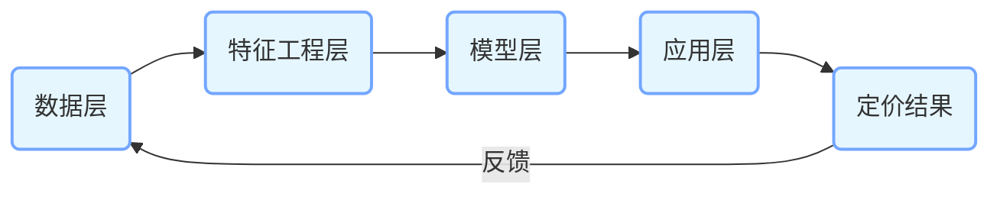

# 设计智能化的资产定价模型

> 关键词：智能化、资产定价模型、机器学习、金融科技、数据驱动、风险评估、量化分析

> 摘要：本文聚焦于智能化资产定价模型的设计，旨在深入探讨如何运用先进的技术手段提升资产定价的准确性和效率。通过对核心概念、算法原理、数学模型的详细剖析，结合项目实战案例，全面展示智能化资产定价模型的构建过程。同时，分析其在不同实际应用场景中的价值，推荐相关的学习资源、开发工具和研究论文，最后对该领域的未来发展趋势与挑战进行总结，为金融领域的研究者和从业者提供全面且深入的参考。

## 1. 背景介绍 
### 1.1 目的和范围
在金融市场中，准确的资产定价至关重要。传统的资产定价方法往往基于一些简化的假设和固定的模型，难以适应复杂多变的市场环境。随着信息技术的飞速发展，智能化的资产定价模型应运而生。本文章的目的在于系统地介绍智能化资产定价模型的设计方法，涵盖从核心概念到实际应用的各个方面。范围包括对常见机器学习算法在资产定价中的应用、数学模型的构建、项目实战案例的分析等，旨在为读者提供一个全面且深入的了解。

### 1.2 预期读者
本文预期读者包括金融领域的从业者，如投资经理、风险分析师、量化交易员等，他们可以从中获取新的资产定价思路和方法，提升工作效率和决策准确性。同时，也适合计算机科学和人工智能领域的研究者和开发者，为他们在金融领域的应用研究提供参考。此外，对金融科技感兴趣的学生和爱好者也能通过本文了解智能化资产定价的基本原理和实现方法。

### 1.3 文档结构概述
本文首先介绍智能化资产定价模型的背景知识，包括目的、预期读者和文档结构概述等内容。接着阐述核心概念与联系，通过文本示意图和 Mermaid 流程图展示其原理和架构。然后详细讲解核心算法原理和具体操作步骤，并使用 Python 源代码进行阐述。随后介绍数学模型和公式，结合举例说明其应用。再通过项目实战案例，包括开发环境搭建、源代码实现和代码解读，展示模型的实际应用。之后分析实际应用场景，推荐相关的工具和资源。最后总结未来发展趋势与挑战，提供常见问题与解答和扩展阅读参考资料。

### 1.4 术语表
#### 1.4.1 核心术语定义
- **资产定价模型**：用于确定资产价值的数学模型，通过考虑各种因素来估计资产的合理价格。
- **智能化**：指利用人工智能技术，如机器学习、深度学习等，使模型能够自动学习和适应数据的变化，提高定价的准确性和效率。
- **机器学习**：是一门多领域交叉学科，涉及概率论、统计学、逼近论、凸分析、算法复杂度理论等多门学科。它专门研究计算机怎样模拟或实现人类的学习行为，以获取新的知识或技能，重新组织已有的知识结构使之不断改善自身的性能。
- **数据驱动**：指决策和行动主要基于数据的分析和挖掘，而不是基于经验或直觉。

#### 1.4.2 相关概念解释
- **风险评估**：对资产可能面临的风险进行评估和量化，是资产定价的重要考虑因素之一。不同的风险水平会影响资产的预期收益，从而影响其定价。
- **量化分析**：运用数学和统计学方法对金融数据进行分析，以揭示市场规律和资产的内在价值。量化分析可以帮助投资者做出更科学的决策。

#### 1.4.3 缩略词列表
- **AI**：Artificial Intelligence，人工智能
- **ML**：Machine Learning，机器学习
- **DL**：Deep Learning，深度学习
- **MSE**：Mean Squared Error，均方误差

## 2. 核心概念与联系 

### 核心概念原理
智能化资产定价模型的核心在于利用人工智能技术对大量的金融数据进行分析和学习，从而挖掘出数据中隐藏的规律和模式，以实现准确的资产定价。传统的资产定价模型，如资本资产定价模型（CAPM），主要基于一些理论假设和线性关系来确定资产的预期收益和价格。然而，金融市场是复杂多变的，存在大量的非线性关系和不确定性因素，传统模型难以准确捕捉这些信息。

智能化资产定价模型则通过引入机器学习和深度学习算法，能够自动处理复杂的非线性关系，对数据进行自适应的学习和建模。例如，神经网络模型可以通过多层神经元的连接和非线性激活函数，模拟复杂的市场行为和资产价格的变化。

### 架构的文本示意图
智能化资产定价模型的架构主要包括数据层、特征工程层、模型层和应用层。

- **数据层**：负责收集和存储各种与资产定价相关的数据，包括市场数据（如股票价格、利率、汇率等）、公司财务数据（如营收、利润、资产负债表等）、宏观经济数据（如 GDP、通货膨胀率等）。
- **特征工程层**：对数据层的数据进行清洗、预处理和特征提取。清洗数据是为了去除噪声和异常值，预处理包括数据标准化、归一化等操作，特征提取则是从原始数据中提取出对资产定价有重要影响的特征。
- **模型层**：选择合适的机器学习或深度学习模型进行训练和优化。常见的模型包括线性回归模型、决策树模型、支持向量机模型、神经网络模型等。
- **应用层**：将训练好的模型应用于实际的资产定价中，为投资者提供决策支持。

### Mermaid 流程图


这个流程图展示了智能化资产定价模型的基本流程。数据从数据层开始，经过特征工程层的处理后进入模型层进行训练和优化，得到的模型在应用层进行资产定价，定价结果又可以反馈到数据层，用于进一步的数据收集和模型优化。

## 3. 核心算法原理 & 具体操作步骤 

### 线性回归模型原理
线性回归是一种基本的机器学习算法，用于建立自变量和因变量之间的线性关系。在资产定价中，我们可以将资产价格作为因变量，将各种影响因素（如市场指数、公司财务指标等）作为自变量。

线性回归模型的一般形式为：

$$y = \theta_0 + \theta_1x_1 + \theta_2x_2 + \cdots + \theta_nx_n + \epsilon$$

其中，$y$ 是因变量（资产价格），$x_1, x_2, \cdots, x_n$ 是自变量，$\theta_0, \theta_1, \cdots, \theta_n$ 是模型的参数，$\epsilon$ 是误差项。

### 具体操作步骤
1. **数据收集**：收集与资产定价相关的数据，包括自变量和因变量的数据。
2. **数据预处理**：对数据进行清洗、标准化等操作，以提高模型的训练效果。
3. **模型训练**：使用训练数据对线性回归模型进行训练，估计模型的参数。
4. **模型评估**：使用测试数据对训练好的模型进行评估，计算评估指标（如均方误差、决定系数等）。
5. **模型应用**：将训练好的模型应用于实际的资产定价中。

### Python 源代码实现
```python
import numpy as np
from sklearn.linear_model import LinearRegression
from sklearn.model_selection import train_test_split
from sklearn.metrics import mean_squared_error

# 生成示例数据
np.random.seed(0)
X = np.random.rand(100, 5)  # 自变量
y = 2 * X[:, 0] + 3 * X[:, 1] + 0.5 * X[:, 2] + np.random.randn(100)  # 因变量

# 划分训练集和测试集
X_train, X_test, y_train, y_test = train_test_split(X, y, test_size=0.2, random_state=42)

# 创建线性回归模型
model = LinearRegression()

# 模型训练
model.fit(X_train, y_train)

# 模型预测
y_pred = model.predict(X_test)

# 模型评估
mse = mean_squared_error(y_test, y_pred)
print(f"均方误差: {mse}")
```

### 代码解释
1. **数据生成**：使用 `np.random.rand` 生成 100 个样本，每个样本有 5 个特征作为自变量 `X`，因变量 `y` 是根据线性关系生成的，并添加了一些噪声。
2. **数据划分**：使用 `train_test_split` 函数将数据划分为训练集和测试集，测试集占比为 20%。
3. **模型创建**：使用 `LinearRegression` 类创建线性回归模型。
4. **模型训练**：使用 `fit` 方法对模型进行训练，传入训练集的自变量和因变量。
5. **模型预测**：使用 `predict` 方法对测试集进行预测，得到预测结果 `y_pred`。
6. **模型评估**：使用 `mean_squared_error` 函数计算预测结果和真实结果之间的均方误差。

## 4. 数学模型和公式 & 详细讲解 & 举例说明 

### 线性回归模型的数学原理
线性回归模型的目标是找到一组参数 $\theta_0, \theta_1, \cdots, \theta_n$，使得预测值 $\hat{y}$ 与真实值 $y$ 之间的误差最小。常用的误差度量方法是均方误差（MSE），其公式为：

$$MSE = \frac{1}{m} \sum_{i=1}^{m} (y^{(i)} - \hat{y}^{(i)})^2$$

其中，$m$ 是样本数量，$y^{(i)}$ 是第 $i$ 个样本的真实值，$\hat{y}^{(i)}$ 是第 $i$ 个样本的预测值。

为了最小化均方误差，我们可以使用最小二乘法。最小二乘法的原理是通过求解以下正规方程来得到最优的参数 $\theta$：

$$\theta = (X^T X)^{-1} X^T y$$

其中，$X$ 是自变量矩阵，$y$ 是因变量向量。

### 详细讲解
最小二乘法的推导过程基于对均方误差函数的求导。对均方误差函数 $MSE$ 关于 $\theta$ 求偏导数，并令其等于 0，得到正规方程。通过求解正规方程，可以得到最优的参数 $\theta$。

### 举例说明
假设我们有一个简单的线性回归问题，自变量 $x$ 和因变量 $y$ 的数据如下：

| $x$ | $y$ |
|---|---|
| 1 | 3 |
| 2 | 5 |
| 3 | 7 |

我们可以将数据表示为矩阵形式：

$$X = \begin{bmatrix} 1 & 1 \\ 1 & 2 \\ 1 & 3 \end{bmatrix}, y = \begin{bmatrix} 3 \\ 5 \\ 7 \end{bmatrix}$$

首先计算 $X^T X$ 和 $X^T y$：

$$X^T X = \begin{bmatrix} 1 & 1 & 1 \\ 1 & 2 & 3 \end{bmatrix} \begin{bmatrix} 1 & 1 \\ 1 & 2 \\ 1 & 3 \end{bmatrix} = \begin{bmatrix} 3 & 6 \\ 6 & 14 \end{bmatrix}$$

$$X^T y = \begin{bmatrix} 1 & 1 & 1 \\ 1 & 2 & 3 \end{bmatrix} \begin{bmatrix} 3 \\ 5 \\ 7 \end{bmatrix} = \begin{bmatrix} 15 \\ 34 \end{bmatrix}$$

然后求 $(X^T X)^{-1}$：

$$(X^T X)^{-1} = \frac{1}{3 \times 14 - 6 \times 6} \begin{bmatrix} 14 & -6 \\ -6 & 3 \end{bmatrix} = \begin{bmatrix} \frac{7}{3} & -1 \\ -1 & \frac{1}{2} \end{bmatrix}$$

最后计算 $\theta$：

$$\theta = (X^T X)^{-1} X^T y = \begin{bmatrix} \frac{7}{3} & -1 \\ -1 & \frac{1}{2} \end{bmatrix} \begin{bmatrix} 15 \\ 34 \end{bmatrix} = \begin{bmatrix} 1 \\ 2 \end{bmatrix}$$

所以，线性回归模型的方程为 $y = 1 + 2x$。

## 5. 项目实战：代码实际案例和详细解释说明 

### 5.1  开发环境搭建
1. **安装 Python**：推荐使用 Python 3.7 及以上版本，可以从 Python 官方网站（https://www.python.org/downloads/）下载安装。
2. **安装必要的库**：使用 `pip` 命令安装所需的库，包括 `numpy`、`pandas`、`scikit-learn`、`matplotlib` 等。

```sh
pip install numpy pandas scikit-learn matplotlib
```

3. **选择开发工具**：可以使用 Jupyter Notebook、PyCharm 等开发工具。Jupyter Notebook 适合交互式开发和数据分析，PyCharm 适合大型项目的开发和调试。

### 5.2  源代码详细实现和代码解读
以下是一个使用线性回归模型进行股票价格预测的实际案例。

```python
import pandas as pd
import numpy as np
from sklearn.linear_model import LinearRegression
from sklearn.model_selection import train_test_split
from sklearn.metrics import mean_squared_error
import matplotlib.pyplot as plt

# 读取数据
data = pd.read_csv('stock_prices.csv')

# 提取特征和目标变量
X = data[['Open', 'High', 'Low', 'Volume']].values
y = data['Close'].values

# 划分训练集和测试集
X_train, X_test, y_train, y_test = train_test_split(X, y, test_size=0.2, random_state=42)

# 创建线性回归模型
model = LinearRegression()

# 模型训练
model.fit(X_train, y_train)

# 模型预测
y_pred = model.predict(X_test)

# 模型评估
mse = mean_squared_error(y_test, y_pred)
print(f"均方误差: {mse}")

# 可视化预测结果
plt.figure(figsize=(10, 6))
plt.plot(y_test, label='真实值')
plt.plot(y_pred, label='预测值')
plt.xlabel('样本序号')
plt.ylabel('股票收盘价')
plt.title('股票价格预测结果')
plt.legend()
plt.show()
```

### 代码解读与分析
1. **数据读取**：使用 `pandas` 库的 `read_csv` 函数读取股票价格数据文件 `stock_prices.csv`。
2. **特征提取**：从数据中提取 `Open`、`High`、`Low`、`Volume` 作为特征变量 `X`，`Close` 作为目标变量 `y`。
3. **数据划分**：使用 `train_test_split` 函数将数据划分为训练集和测试集，测试集占比为 20%。
4. **模型创建**：使用 `LinearRegression` 类创建线性回归模型。
5. **模型训练**：使用 `fit` 方法对模型进行训练，传入训练集的特征变量和目标变量。
6. **模型预测**：使用 `predict` 方法对测试集进行预测，得到预测结果 `y_pred`。
7. **模型评估**：使用 `mean_squared_error` 函数计算预测结果和真实结果之间的均方误差。
8. **可视化**：使用 `matplotlib` 库绘制真实值和预测值的折线图，直观展示预测结果。

## 6. 实际应用场景 
### 股票投资
智能化资产定价模型可以帮助投资者更准确地评估股票的价值，从而做出更明智的投资决策。通过分析股票的历史数据、公司财务指标、宏观经济数据等多方面因素，模型可以预测股票的未来价格走势，为投资者提供参考。例如，投资者可以根据模型的预测结果，选择被低估的股票进行买入，或者对被高估的股票进行卖出。

### 债券定价
债券的价格受到多种因素的影响，如利率、信用风险、市场流动性等。智能化资产定价模型可以综合考虑这些因素，对债券的价格进行准确的评估。在债券发行时，发行人可以使用模型来确定合理的发行价格；投资者在购买债券时，也可以参考模型的定价结果，判断债券是否具有投资价值。

### 房地产评估
房地产的价值评估是一个复杂的过程，涉及到地理位置、房屋面积、房龄、周边配套设施等多个因素。智能化资产定价模型可以通过对大量房地产数据的分析和学习，建立房地产价格的预测模型。房地产开发商可以使用模型来确定合理的房价，购房者可以参考模型的评估结果，判断房屋的价格是否合理。

### 风险管理
金融机构在进行风险管理时，需要对资产的价值和风险进行准确的评估。智能化资产定价模型可以帮助金融机构更好地理解资产的风险特征，通过对资产价格的预测，提前发现潜在的风险。例如，银行在发放贷款时，可以使用模型评估抵押物的价值，降低信贷风险；保险公司在进行保险定价时，也可以参考模型的结果，合理确定保险费率。

## 7. 工具和资源推荐
### 7.1 学习资源推荐
#### 7.1.1 书籍推荐
- 《机器学习》（周志华著）：这本书是机器学习领域的经典教材，系统地介绍了机器学习的基本概念、算法和应用。
- 《Python 数据分析实战》（韦斯·麦金尼著）：详细介绍了使用 Python 进行数据分析的方法和技巧，包括数据处理、数据可视化等内容。
- 《金融计量学：从基础到前沿》（鲁晓东著）：结合金融领域的实际问题，介绍了金融计量学的基本理论和方法，对于理解资产定价模型有很大的帮助。

#### 7.1.2 在线课程
- Coursera 上的“机器学习”课程（由 Andrew Ng 教授授课）：这是一门非常经典的机器学习入门课程，通过视频讲解、编程作业等方式，帮助学习者掌握机器学习的基本概念和算法。
- edX 上的“金融科技”课程：介绍了金融科技的最新发展和应用，包括智能化资产定价模型的相关内容。
- 中国大学 MOOC 上的“金融数据分析与挖掘”课程：结合 Python 编程，介绍了金融数据分析和挖掘的方法和技术。

#### 7.1.3 技术博客和网站
- 机器之心（https://www.alienhub.org/）：提供人工智能、机器学习等领域的最新技术资讯和深度分析文章。
- 数据派（https://datapi.cn/）：专注于数据分析和数据挖掘领域，有很多关于金融数据分析和资产定价模型的案例和技术分享。
- Kaggle（https://www.kaggle.com/）：一个数据科学竞赛平台，上面有很多关于金融数据的竞赛和数据集，可以学习到其他选手的优秀解决方案。

### 7.2 开发工具框架推荐
#### 7.2.1 IDE和编辑器
- PyCharm：一款专业的 Python 集成开发环境，具有代码编辑、调试、版本控制等功能，适合大型项目的开发。
- Jupyter Notebook：一个交互式的开发环境，支持多种编程语言，适合数据分析和模型实验。
- Visual Studio Code：一款轻量级的代码编辑器，支持多种编程语言和插件，具有丰富的扩展功能。

#### 7.2.2 调试和性能分析工具
- `pdb`：Python 自带的调试器，可以帮助开发者在代码中设置断点、查看变量值等，进行代码调试。
- `cProfile`：Python 的性能分析工具，可以分析代码的运行时间和函数调用情况，帮助开发者优化代码性能。
- `scikit-learn` 中的 `GridSearchCV`：用于模型调优的工具，可以通过网格搜索的方式找到最优的模型参数。

#### 7.2.3 相关框架和库
- `scikit-learn`：一个简单易用的机器学习库，提供了各种机器学习算法和工具，如分类、回归、聚类等。
- `TensorFlow`：一个开源的深度学习框架，由 Google 开发，广泛应用于图像识别、自然语言处理等领域。
- `PyTorch`：另一个流行的深度学习框架，具有动态图的特点，易于使用和调试。

### 7.3 相关论文著作推荐
#### 7.3.1 经典论文
- Fama, E. F., & French, K. R. (1992). The cross-section of expected stock returns. The Journal of Finance, 47(2), 427-465. 这篇论文提出了著名的 Fama-French 三因子模型，对资产定价理论的发展产生了深远的影响。
- Sharpe, W. F. (1964). Capital asset prices: A theory of market equilibrium under conditions of risk. The Journal of Finance, 19(3), 425-442. 该论文提出了资本资产定价模型（CAPM），是现代金融理论的重要基础之一。

#### 7.3.2 最新研究成果
- 可以关注顶级金融期刊，如 The Journal of Finance、The Review of Financial Studies 等，以及人工智能领域的顶级会议，如 NeurIPS、ICML 等，获取关于智能化资产定价模型的最新研究成果。

#### 7.3.3 应用案例分析
- 可以参考一些金融科技公司的研究报告和案例分析，了解智能化资产定价模型在实际应用中的效果和经验。例如，蚂蚁金服、京东金融等公司在金融风险管理和资产定价方面有很多实践经验。

## 8. 总结：未来发展趋势与挑战
### 未来发展趋势
1. **融合多学科知识**：智能化资产定价模型将越来越多地融合金融、数学、统计学、计算机科学等多学科的知识。例如，结合量子计算技术，可以提高模型的计算效率和处理复杂问题的能力；引入心理学和行为金融学的理论，可以更好地解释市场参与者的行为和资产价格的波动。
2. **强化学习的应用**：强化学习是一种通过智能体与环境进行交互来学习最优策略的机器学习方法。在资产定价中，强化学习可以用于动态资产配置和交易策略的优化。例如，智能体可以根据市场环境的变化，自动调整投资组合，以实现最大化收益的目标。
3. **实时定价和预测**：随着金融市场的快速变化和信息技术的发展，实时定价和预测将成为智能化资产定价模型的重要发展方向。模型需要能够实时处理大量的市场数据，及时调整资产价格的预测结果，为投资者提供更及时的决策支持。
4. **个性化定价**：不同的投资者具有不同的风险偏好和投资目标，未来的智能化资产定价模型将更加注重个性化定价。模型可以根据投资者的个人信息和历史交易数据，为其提供个性化的资产定价和投资建议。

### 挑战
1. **数据质量和隐私问题**：智能化资产定价模型依赖于大量的金融数据，数据的质量和准确性直接影响模型的性能。同时，金融数据涉及到用户的隐私和商业机密，如何在保证数据质量的前提下，保护数据的隐私和安全是一个重要的挑战。
2. **模型可解释性**：一些复杂的机器学习和深度学习模型，如神经网络模型，虽然在预测性能上表现出色，但模型的可解释性较差。在金融领域，模型的可解释性非常重要，因为投资者需要理解模型的决策过程和依据。如何提高模型的可解释性是一个亟待解决的问题。
3. **市场不确定性**：金融市场是复杂多变的，存在大量的不确定性因素，如政策变化、突发事件等。这些因素很难用模型进行准确的预测和建模，给智能化资产定价模型带来了很大的挑战。
4. **技术更新换代快**：信息技术发展迅速，新的算法和技术不断涌现。智能化资产定价模型需要不断更新和改进，以适应技术的发展和市场的变化。这对开发者的技术水平和学习能力提出了很高的要求。

## 9. 附录：常见问题与解答
### 1. 智能化资产定价模型一定比传统模型更准确吗？
不一定。智能化资产定价模型虽然能够处理复杂的非线性关系和大量的数据，但它也存在一定的局限性。传统模型基于一些理论假设，在某些特定的情况下可能具有较好的解释性和准确性。智能化资产定价模型的准确性还受到数据质量、模型选择和参数调优等因素的影响。在实际应用中，需要根据具体情况选择合适的模型。

### 2. 如何选择合适的特征用于资产定价模型？
选择合适的特征需要综合考虑多个因素。首先，要考虑特征与资产价格的相关性，选择与资产价格有较强关联的特征。其次，要考虑特征的可解释性，选择具有明确经济意义的特征。此外，还可以使用特征选择算法，如相关性分析、方差分析、递归特征消除等，来筛选出对模型性能影响较大的特征。

### 3. 智能化资产定价模型在实际应用中存在哪些风险？
智能化资产定价模型在实际应用中存在多种风险。一是模型风险，如模型选择不当、参数估计不准确等，可能导致模型的预测结果偏差较大。二是数据风险，如数据缺失、数据错误、数据泄露等，会影响模型的性能和数据的安全性。三是市场风险，金融市场的不确定性和变化可能导致模型的预测失效。此外，还存在技术风险，如算法漏洞、系统故障等。

### 4. 如何评估智能化资产定价模型的性能？
可以使用多种指标来评估智能化资产定价模型的性能。对于回归模型，常用的评估指标包括均方误差（MSE）、均方根误差（RMSE）、平均绝对误差（MAE）、决定系数（$R^2$）等。这些指标可以衡量模型的预测误差和拟合程度。此外，还可以使用交叉验证、留出法等方法来评估模型的泛化能力。

## 10. 扩展阅读 & 参考资料
1. 《人工智能：一种现代的方法》（Stuart Russell、Peter Norvig 著）
2. 《深度学习》（Ian Goodfellow、Yoshua Bengio、Aaron Courville 著）
3. 《金融市场学》（张亦春、郑振龙、林海 编著）
4. 相关金融和人工智能领域的学术期刊和会议论文
5. 各大金融机构和科技公司的研究报告和白皮书