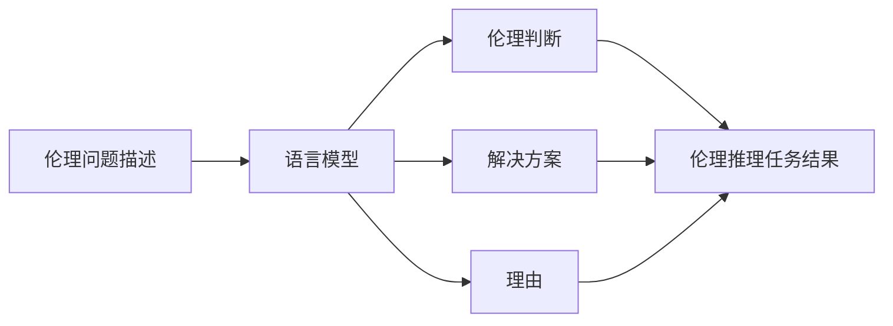

# 语言模型在伦理推理任务中的表现研究

> 关键词：语言模型、伦理推理任务、自然语言处理、人工智能伦理、模型评估

> 摘要：本文围绕语言模型在伦理推理任务中的表现展开深入研究。首先介绍了研究的背景、目的和相关术语，接着阐述语言模型及伦理推理任务的核心概念与联系，详细讲解相关核心算法原理和具体操作步骤，借助数学模型和公式进行理论分析并举例说明。通过项目实战给出代码案例及详细解释，探讨语言模型在伦理推理任务中的实际应用场景，推荐了相关的学习资源、开发工具框架和论文著作。最后总结语言模型在伦理推理任务中的未来发展趋势与挑战，并对常见问题进行解答，为后续研究和应用提供全面的参考。

## 1. 背景介绍 
### 1.1 目的和范围
随着人工智能技术的飞速发展，语言模型在自然语言处理领域取得了显著成就。然而，语言模型在伦理推理任务中的表现却鲜有关注。本研究的目的在于深入探究语言模型在伦理推理任务中的性能，评估其在处理复杂伦理问题时的准确性、合理性和一致性。研究范围涵盖了多种类型的语言模型，包括基于深度学习的预训练语言模型，以及不同类型的伦理推理任务，如道德困境判断、伦理原则应用等。

### 1.2 预期读者
本文预期读者包括自然语言处理领域的研究人员、人工智能伦理专家、软件开发人员以及对语言模型和伦理推理感兴趣的相关人士。研究成果有助于研究人员进一步改进语言模型的伦理推理能力，为伦理专家提供新的技术视角，也为软件开发人员在实际应用中更好地运用语言模型处理伦理问题提供参考。

### 1.3 文档结构概述
本文首先介绍研究的背景和相关术语，为后续内容奠定基础。接着阐述语言模型和伦理推理任务的核心概念及联系，让读者对研究对象有清晰的认识。然后详细讲解核心算法原理和具体操作步骤，通过数学模型和公式进行理论分析。项目实战部分给出实际代码案例和详细解释，展示语言模型在伦理推理任务中的具体应用。之后探讨实际应用场景，推荐相关的学习资源、开发工具框架和论文著作。最后总结未来发展趋势与挑战，解答常见问题，并提供扩展阅读和参考资料。

### 1.4 术语表
#### 1.4.1 核心术语定义
- **语言模型**：是一种对自然语言进行建模的概率模型，用于预测文本序列中下一个词的概率分布。常见的语言模型包括基于规则的模型、统计语言模型和深度学习语言模型。
- **伦理推理任务**：指涉及到道德判断、伦理原则应用和伦理困境解决的自然语言处理任务。例如，判断一个行为是否符合道德规范，在不同的道德原则之间进行权衡等。
- **预训练语言模型**：通过在大规模无监督文本数据上进行预训练得到的语言模型，具有强大的语言理解和生成能力。常见的预训练语言模型有 BERT、GPT 等。

#### 1.4.2 相关概念解释
- **道德困境**：是指在道德决策过程中面临的冲突情况，即不同的道德原则或价值观相互矛盾，使得决策者难以做出单一的、明确的道德选择。
- **伦理原则**：是指在伦理学中被普遍接受的、用于指导道德行为和决策的基本准则，如功利主义原则、义务论原则等。

#### 1.4.3 缩略词列表
- **NLP**：自然语言处理（Natural Language Processing）
- **LM**：语言模型（Language Model）
- **PLM**：预训练语言模型（Pre - trained Language Model）

## 2. 核心概念与联系 

### 语言模型原理
语言模型的核心目标是对自然语言文本的概率分布进行建模。给定一个文本序列 $w_1, w_2, \cdots, w_n$，语言模型的任务是计算该序列出现的概率 $P(w_1, w_2, \cdots, w_n)$。根据链式法则，这个概率可以分解为：

$$P(w_1, w_2, \cdots, w_n)=\prod_{i = 1}^{n}P(w_i|w_1, w_2, \cdots, w_{i - 1})$$

早期的语言模型，如 $n$ - 元语法模型，通过统计语料库中 $n$ 个连续词出现的频率来估计条件概率 $P(w_i|w_1, w_2, \cdots, w_{i - 1})$。例如，二元语法模型（$n = 2$）假设当前词只依赖于前一个词，即：

$$P(w_i|w_1, w_2, \cdots, w_{i - 1})\approx P(w_i|w_{i - 1})$$

随着深度学习的发展，基于神经网络的语言模型逐渐成为主流。例如，循环神经网络（RNN）及其变体（如 LSTM、GRU）可以处理变长的文本序列，并通过递归的方式计算条件概率。

### 伦理推理任务概述
伦理推理任务主要包括以下几个方面：
- **道德判断**：判断一个行为、决策或事件是否符合道德规范。例如，判断“在紧急情况下闯红灯去救病人”是否道德。
- **伦理原则应用**：根据给定的伦理原则，对具体的情境进行分析和判断。例如，根据功利主义原则，判断一个政策是否能最大化总体利益。
- **伦理困境解决**：在面临道德冲突的情况下，找到合适的解决方案。例如，在“救一人还是救五人”的困境中做出决策。

### 语言模型与伦理推理任务的联系
语言模型可以为伦理推理任务提供自然语言处理的基础能力。例如，语言模型可以用于理解伦理问题的描述，提取相关的信息和特征；可以生成可能的解决方案或理由；还可以对不同的伦理判断进行评估和排序。然而，语言模型本身并不具备内在的伦理意识，需要通过合适的训练和引导来使其在伦理推理任务中表现良好。

### 文本示意图
```plaintext
语言模型
|
|-- 输入：伦理问题描述
|
|-- 处理：语言理解、信息提取、特征生成
|
|-- 输出：伦理判断、解决方案、理由
|
伦理推理任务
```

### Mermaid 流程图


## 3. 核心算法原理 & 具体操作步骤 

### 基于预训练语言模型的伦理推理算法原理
预训练语言模型（如 BERT）在大规模无监督文本数据上进行预训练，学习到了丰富的语言知识和语义表示。在伦理推理任务中，可以在预训练模型的基础上进行微调。具体步骤如下：

1. **数据准备**：收集伦理推理任务的数据集，包括伦理问题描述、对应的伦理判断标签（如“道德”、“不道德”）等。
2. **模型加载**：加载预训练语言模型，如 BERT 的预训练权重。
3. **模型微调**：在伦理推理数据集上对预训练模型进行微调，通过调整模型的参数，使其适应伦理推理任务。
4. **模型评估**：使用测试集对微调后的模型进行评估，计算评估指标（如准确率、召回率等）。

### Python 源代码实现
```python
import torch
from torch.utils.data import Dataset, DataLoader
from transformers import BertTokenizer, BertForSequenceClassification, AdamW
from sklearn.model_selection import train_test_split
import pandas as pd

# 定义伦理推理数据集类
class EthicsDataset(Dataset):
    def __init__(self, texts, labels, tokenizer, max_length):
        self.texts = texts
        self.labels = labels
        self.tokenizer = tokenizer
        self.max_length = max_length

    def __len__(self):
        return len(self.texts)

    def __getitem__(self, idx):
        text = self.texts[idx]
        label = self.labels[idx]
        encoding = self.tokenizer.encode_plus(
            text,
            add_special_tokens=True,
            max_length=self.max_length,
            padding='max_length',
            truncation=True,
            return_tensors='pt'
        )
        return {
            'input_ids': encoding['input_ids'].flatten(),
            'attention_mask': encoding['attention_mask'].flatten(),
            'labels': torch.tensor(label, dtype=torch.long)
        }

# 数据加载和预处理
def load_data(file_path):
    df = pd.read_csv(file_path)
    texts = df['text'].tolist()
    labels = df['label'].tolist()
    train_texts, test_texts, train_labels, test_labels = train_test_split(texts, labels, test_size=0.2, random_state=42)
    return train_texts, test_texts, train_labels, test_labels

# 训练模型
def train_model(train_dataloader, model, optimizer, device, epochs):
    model.train()
    for epoch in range(epochs):
        total_loss = 0
        for batch in train_dataloader:
            input_ids = batch['input_ids'].to(device)
            attention_mask = batch['attention_mask'].to(device)
            labels = batch['labels'].to(device)

            optimizer.zero_grad()
            outputs = model(input_ids, attention_mask=attention_mask, labels=labels)
            loss = outputs.loss
            loss.backward()
            optimizer.step()
            total_loss += loss.item()
        print(f'Epoch {epoch + 1}, Loss: {total_loss / len(train_dataloader)}')

# 评估模型
def evaluate_model(test_dataloader, model, device):
    model.eval()
    correct_predictions = 0
    total_predictions = 0
    with torch.no_grad():
        for batch in test_dataloader:
            input_ids = batch['input_ids'].to(device)
            attention_mask = batch['attention_mask'].to(device)
            labels = batch['labels'].to(device)

            outputs = model(input_ids, attention_mask=attention_mask)
            logits = outputs.logits
            predictions = torch.argmax(logits, dim=1)
            correct_predictions += (predictions == labels).sum().item()
            total_predictions += labels.size(0)
    accuracy = correct_predictions / total_predictions
    print(f'Accuracy: {accuracy}')

# 主函数
def main():
    file_path = 'ethics_data.csv'
    train_texts, test_texts, train_labels, test_labels = load_data(file_path)

    tokenizer = BertTokenizer.from_pretrained('bert-base-uncased')
    max_length = 128
    train_dataset = EthicsDataset(train_texts, train_labels, tokenizer, max_length)
    test_dataset = EthicsDataset(test_texts, test_labels, tokenizer, max_length)

    batch_size = 16
    train_dataloader = DataLoader(train_dataset, batch_size=batch_size, shuffle=True)
    test_dataloader = DataLoader(test_dataset, batch_size=batch_size, shuffle=False)

    model = BertForSequenceClassification.from_pretrained('bert-base-uncased', num_labels=2)
    device = torch.device('cuda' if torch.cuda.is_available() else 'cpu')
    model.to(device)

    optimizer = AdamW(model.parameters(), lr=2e-5)
    epochs = 3

    train_model(train_dataloader, model, optimizer, device, epochs)
    evaluate_model(test_dataloader, model, device)

if __name__ == '__main__':
    main()
```

### 具体操作步骤
1. **数据准备**：将伦理推理任务的数据集保存为 CSV 文件，包含两列：`text`（伦理问题描述）和 `label`（对应的伦理判断标签）。
2. **环境安装**：安装所需的 Python 库，如 `torch`、`transformers`、`pandas`、`sklearn` 等。
3. **运行代码**：将上述代码保存为 Python 文件，运行该文件即可完成模型的训练和评估。

## 4. 数学模型和公式 & 详细讲解 & 举例说明 

### 交叉熵损失函数
在伦理推理任务中，通常使用交叉熵损失函数来训练语言模型。交叉熵损失函数用于衡量模型预测的概率分布与真实标签的概率分布之间的差异。对于二分类问题，交叉熵损失函数的定义如下：

$$L = -\frac{1}{N}\sum_{i = 1}^{N}[y_i\log(p_i)+(1 - y_i)\log(1 - p_i)]$$

其中，$N$ 是样本数量，$y_i$ 是第 $i$ 个样本的真实标签（$y_i\in\{0, 1\}$），$p_i$ 是模型对第 $i$ 个样本预测为正类的概率。

### 详细讲解
交叉熵损失函数的目标是最小化模型预测的概率分布与真实标签的概率分布之间的差异。当真实标签 $y_i = 1$ 时，损失函数的第一项 $y_i\log(p_i)=\log(p_i)$，要使损失最小，就需要 $p_i$ 尽可能接近 1；当真实标签 $y_i = 0$ 时，损失函数的第二项 $(1 - y_i)\log(1 - p_i)=\log(1 - p_i)$，要使损失最小，就需要 $p_i$ 尽可能接近 0。

### 举例说明
假设有一个二分类的伦理推理任务，有 3 个样本，真实标签分别为 $y_1 = 1$，$y_2 = 0$，$y_3 = 1$，模型预测的概率分别为 $p_1 = 0.8$，$p_2 = 0.2$，$p_3 = 0.6$。则交叉熵损失为：

$$L=-\frac{1}{3}[\log(0.8)+\log(1 - 0.2)+\log(0.6)]$$

```python
import numpy as np

y = np.array([1, 0, 1])
p = np.array([0.8, 0.2, 0.6])

loss = -np.mean(y * np.log(p)+(1 - y) * np.log(1 - p))
print(f'Cross - entropy loss: {loss}')
```

## 5. 项目实战：代码实际案例和详细解释说明 

### 5.1  开发环境搭建
- **操作系统**：推荐使用 Linux 或 macOS 系统，也可以使用 Windows 系统。
- **Python 版本**：建议使用 Python 3.7 及以上版本。
- **库安装**：使用以下命令安装所需的库：
```bash
pip install torch transformers pandas scikit-learn
```

### 5.2  源代码详细实现和代码解读
#### 数据集类 `EthicsDataset`
```python
class EthicsDataset(Dataset):
    def __init__(self, texts, labels, tokenizer, max_length):
        self.texts = texts
        self.labels = labels
        self.tokenizer = tokenizer
        self.max_length = max_length

    def __len__(self):
        return len(self.texts)

    def __getitem__(self, idx):
        text = self.texts[idx]
        label = self.labels[idx]
        encoding = self.tokenizer.encode_plus(
            text,
            add_special_tokens=True,
            max_length=self.max_length,
            padding='max_length',
            truncation=True,
            return_tensors='pt'
        )
        return {
            'input_ids': encoding['input_ids'].flatten(),
            'attention_mask': encoding['attention_mask'].flatten(),
            'labels': torch.tensor(label, dtype=torch.long)
        }
```
- **功能**：该类用于封装伦理推理任务的数据集，将文本数据转换为模型可以接受的输入格式。
- **参数**：
  - `texts`：伦理问题描述的列表。
  - `labels`：对应的伦理判断标签的列表。
  - `tokenizer`：用于将文本转换为词元（tokens）的分词器。
  - `max_length`：输入文本的最大长度。
- **方法**：
  - `__len__`：返回数据集的样本数量。
  - `__getitem__`：根据索引返回一个样本，包括输入词元的 ID、注意力掩码和标签。

#### 数据加载和预处理函数 `load_data`
```python
def load_data(file_path):
    df = pd.read_csv(file_path)
    texts = df['text'].tolist()
    labels = df['label'].tolist()
    train_texts, test_texts, train_labels, test_labels = train_test_split(texts, labels, test_size=0.2, random_state=42)
    return train_texts, test_texts, train_labels, test_labels
```
- **功能**：从 CSV 文件中加载伦理推理数据集，并将其划分为训练集和测试集。
- **参数**：
  - `file_path`：CSV 文件的路径。
- **返回值**：训练集的文本、测试集的文本、训练集的标签和测试集的标签。

#### 训练模型函数 `train_model`
```python
def train_model(train_dataloader, model, optimizer, device, epochs):
    model.train()
    for epoch in range(epochs):
        total_loss = 0
        for batch in train_dataloader:
            input_ids = batch['input_ids'].to(device)
            attention_mask = batch['attention_mask'].to(device)
            labels = batch['labels'].to(device)

            optimizer.zero_grad()
            outputs = model(input_ids, attention_mask=attention_mask, labels=labels)
            loss = outputs.loss
            loss.backward()
            optimizer.step()
            total_loss += loss.item()
        print(f'Epoch {epoch + 1}, Loss: {total_loss / len(train_dataloader)}')
```
- **功能**：对模型进行训练，通过多次迭代训练数据来更新模型的参数。
- **参数**：
  - `train_dataloader`：训练数据的数据加载器。
  - `model`：待训练的模型。
  - `optimizer`：优化器，用于更新模型的参数。
  - `device`：训练设备（如 GPU 或 CPU）。
  - `epochs`：训练的轮数。

#### 评估模型函数 `evaluate_model`
```python
def evaluate_model(test_dataloader, model, device):
    model.eval()
    correct_predictions = 0
    total_predictions = 0
    with torch.no_grad():
        for batch in test_dataloader:
            input_ids = batch['input_ids'].to(device)
            attention_mask = batch['attention_mask'].to(device)
            labels = batch['labels'].to(device)

            outputs = model(input_ids, attention_mask=attention_mask)
            logits = outputs.logits
            predictions = torch.argmax(logits, dim=1)
            correct_predictions += (predictions == labels).sum().item()
            total_predictions += labels.size(0)
    accuracy = correct_predictions / total_predictions
    print(f'Accuracy: {accuracy}')
```
- **功能**：对训练好的模型进行评估，计算模型在测试集上的准确率。
- **参数**：
  - `test_dataloader`：测试数据的数据加载器。
  - `model`：待评估的模型。
  - `device`：评估设备（如 GPU 或 CPU）。

#### 主函数 `main`
```python
def main():
    file_path = 'ethics_data.csv'
    train_texts, test_texts, train_labels, test_labels = load_data(file_path)

    tokenizer = BertTokenizer.from_pretrained('bert-base-uncased')
    max_length = 128
    train_dataset = EthicsDataset(train_texts, train_labels, tokenizer, max_length)
    test_dataset = EthicsDataset(test_texts, test_labels, tokenizer, max_length)

    batch_size = 16
    train_dataloader = DataLoader(train_dataset, batch_size=batch_size, shuffle=True)
    test_dataloader = DataLoader(test_dataset, batch_size=batch_size, shuffle=False)

    model = BertForSequenceClassification.from_pretrained('bert-base-uncased', num_labels=2)
    device = torch.device('cuda' if torch.cuda.is_available() else 'cpu')
    model.to(device)

    optimizer = AdamW(model.parameters(), lr=2e-5)
    epochs = 3

    train_model(train_dataloader, model, optimizer, device, epochs)
    evaluate_model(test_dataloader, model, device)

if __name__ == '__main__':
    main()
```
- **功能**：主函数，负责整个项目的流程控制，包括数据加载、模型加载、训练和评估。

### 5.3  代码解读与分析
- **数据处理**：通过 `EthicsDataset` 类和 `load_data` 函数将伦理推理数据集进行处理，转换为模型可以接受的输入格式，并划分为训练集和测试集。
- **模型训练**：使用 `train_model` 函数对预训练的 BERT 模型进行微调，通过交叉熵损失函数和 AdamW 优化器更新模型的参数。
- **模型评估**：使用 `evaluate_model` 函数对训练好的模型进行评估，计算模型在测试集上的准确率。

## 6. 实际应用场景 
### 医疗伦理决策
在医疗领域，医生经常面临复杂的伦理决策问题，如是否对绝症患者进行过度治疗、如何分配有限的医疗资源等。语言模型可以帮助医生分析不同决策的伦理影响，提供相关的伦理原则和案例参考，辅助医生做出更合理的决策。

### 自动驾驶伦理
自动驾驶汽车在面临突发情况时，需要做出伦理决策，如是保护车内乘客还是保护行人。语言模型可以对不同的场景进行伦理分析，为自动驾驶系统的决策提供伦理指导。

### 人工智能系统伦理审查
在开发人工智能系统时，需要对系统的设计和行为进行伦理审查，以确保系统不会产生不道德的行为。语言模型可以对系统的文档、代码和输出进行伦理分析，发现潜在的伦理问题，并提供改进建议。

### 教育领域的伦理教育
在教育领域，语言模型可以作为伦理教育的工具，通过提供伦理案例和问题，引导学生进行伦理思考和讨论，培养学生的伦理意识和推理能力。

## 7. 工具和资源推荐
### 7.1 学习资源推荐
#### 7.1.1 书籍推荐
- 《人工智能伦理》：全面介绍了人工智能领域的伦理问题和相关理论，为理解语言模型在伦理推理任务中的应用提供了理论基础。
- 《自然语言处理入门》：详细介绍了自然语言处理的基本概念、算法和技术，有助于深入理解语言模型的原理和实现。

#### 7.1.2 在线课程
- Coursera 上的“Natural Language Processing Specialization”：由顶尖大学的教授授课，系统地介绍了自然语言处理的各个方面，包括语言模型的应用。
- edX 上的“Artificial Intelligence Ethics”：专门探讨人工智能伦理问题，为语言模型在伦理推理任务中的研究提供了伦理视角。

#### 7.1.3 技术博客和网站
- Hugging Face Blog：提供了关于语言模型的最新研究成果和应用案例，对语言模型的开发和应用有很大的帮助。
- Towards Data Science：发表了大量关于自然语言处理和人工智能的技术文章，包括语言模型在伦理推理任务中的相关研究。

### 7.2 开发工具框架推荐
#### 7.2.1 IDE和编辑器
- PyCharm：功能强大的 Python 集成开发环境，提供了代码编辑、调试、版本控制等功能，适合开发基于 Python 的语言模型项目。
- Visual Studio Code：轻量级的代码编辑器，支持多种编程语言和插件，方便快捷地进行代码开发。

#### 7.2.2 调试和性能分析工具
- PyTorch Profiler：用于分析 PyTorch 模型的性能，帮助开发者找出性能瓶颈，优化模型的训练和推理速度。
- TensorBoard：用于可视化深度学习模型的训练过程和结果，方便开发者监控模型的性能和收敛情况。

#### 7.2.3 相关框架和库
- Transformers：Hugging Face 开发的自然语言处理框架，提供了丰富的预训练语言模型和工具，方便开发者进行语言模型的开发和应用。
- Scikit - learn：Python 中的机器学习库，提供了多种机器学习算法和工具，可用于数据预处理、模型评估等任务。

### 7.3 相关论文著作推荐
#### 7.3.1 经典论文
- “Attention Is All You Need”：介绍了 Transformer 架构，为现代语言模型的发展奠定了基础。
- “BERT: Pre - training of Deep Bidirectional Transformers for Language Understanding”：提出了 BERT 预训练语言模型，开创了预训练语言模型的新时代。

#### 7.3.2 最新研究成果
- 关于语言模型在伦理推理任务中的最新研究论文，如“Ethical Reasoning in Language Models: A Survey”，对语言模型在伦理推理任务中的研究现状进行了综述。

#### 7.3.3 应用案例分析
- 分析语言模型在医疗、自动驾驶等领域的伦理应用案例的论文，为实际应用提供了参考和借鉴。

## 8. 总结：未来发展趋势与挑战
### 未来发展趋势
- **多模态融合**：将语言模型与视觉、音频等多模态信息融合，提高伦理推理任务的准确性和可靠性。例如，在医疗伦理决策中，结合患者的病历、影像等多模态信息进行综合分析。
- **强化学习与伦理推理**：利用强化学习技术，让语言模型在与环境的交互中不断学习和优化伦理决策能力，提高模型的适应性和灵活性。
- **跨语言和跨文化的伦理推理**：开发能够处理不同语言和文化背景下伦理问题的语言模型，满足全球化的需求。

### 挑战
- **伦理数据的稀缺性**：伦理问题具有复杂性和主观性，难以收集到大规模、高质量的伦理推理数据集，限制了语言模型的训练和性能提升。
- **伦理标准的多样性**：不同的文化、宗教和价值观下，伦理标准存在差异，如何让语言模型适应这种多样性是一个挑战。
- **模型的可解释性**：语言模型通常是黑盒模型，其决策过程难以解释，在伦理推理任务中，需要提高模型的可解释性，以便用户理解和信任模型的决策结果。

## 9. 附录：常见问题与解答
### 问题 1：语言模型在伦理推理任务中的准确率能达到多高？
答：语言模型在伦理推理任务中的准确率受到多种因素的影响，如数据集的质量、模型的架构和训练方法等。目前，不同的研究和实验中准确率有所差异，一般在 60% - 80% 左右，但具体数值会因任务的复杂程度和数据集的特点而有所不同。

### 问题 2：如何解决语言模型在伦理推理任务中的偏见问题？
答：可以通过以下方法解决偏见问题：
- **数据清洗**：对训练数据进行清洗，去除含有偏见的文本。
- **公平性训练**：在训练过程中引入公平性约束，使模型对不同群体的伦理判断更加公平。
- **人工审核**：对模型的输出进行人工审核，及时发现和纠正偏见。

### 问题 3：语言模型在伦理推理任务中的可解释性如何提高？
答：可以采用以下方法提高可解释性：
- **特征重要性分析**：分析模型在决策过程中对不同特征的依赖程度，解释模型的决策依据。
- **规则提取**：从模型中提取可理解的规则，将模型的决策过程转化为人类可理解的规则。
- **示例解释**：通过提供具体的示例和案例，解释模型的决策结果。

## 10. 扩展阅读 & 参考资料
- 《自然语言处理综论》（第三版），Daniel Jurafsky 和 James H. Martin 著
- 《深度学习》，Ian Goodfellow、Yoshua Bengio 和 Aaron Courville 著
- Hugging Face 官方文档：https://huggingface.co/docs
- ArXiv 上关于语言模型和伦理推理的相关论文：https://arxiv.org/