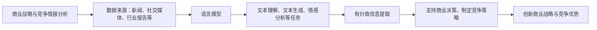

# 语言模型在创新商业战略与竞争情报分析中的多维度应用

> 关键词：语言模型、商业战略、竞争情报分析、多维度应用、自然语言处理

> 摘要：本文深入探讨了语言模型在创新商业战略与竞争情报分析中的多维度应用。随着自然语言处理技术的飞速发展，语言模型展现出了强大的文本理解和生成能力。在商业领域，合理运用语言模型可以为企业制定创新商业战略提供有力支持，同时在竞争情报分析方面发挥关键作用。文章首先介绍了相关背景知识，包括目的范围、预期读者等；接着阐述了语言模型的核心概念与联系，分析其原理和架构；详细讲解了核心算法原理和具体操作步骤，并结合数学模型和公式进行说明；通过项目实战展示了语言模型在实际中的应用；探讨了其在不同商业场景中的实际应用；推荐了相关的学习资源、开发工具和论文著作；最后总结了语言模型的未来发展趋势与挑战，并提供了常见问题的解答和扩展阅读参考资料。

## 1. 背景介绍 
### 1.1 目的和范围
在当今竞争激烈的商业环境中，企业需要不断创新商业战略以保持竞争优势，同时及时、准确地获取竞争情报至关重要。语言模型作为自然语言处理领域的重要技术，具有理解和生成自然语言的能力，能够帮助企业从海量的文本数据中提取有价值的信息。本文的目的在于全面探讨语言模型在创新商业战略与竞争情报分析中的应用，范围涵盖语言模型的基本原理、算法实现、实际应用场景以及相关的工具和资源等方面。

### 1.2 预期读者
本文预期读者包括企业的战略规划人员、市场研究人员、竞争情报分析人员、数据分析师以及对自然语言处理和商业应用感兴趣的技术人员和研究人员。通过阅读本文，读者可以了解语言模型在商业领域的应用价值，掌握相关技术和方法，为实际工作提供参考。

### 1.3 文档结构概述
本文将按照以下结构进行阐述：首先介绍背景知识，包括目的范围、预期读者等；接着讲解语言模型的核心概念与联系，包括原理和架构；然后详细分析核心算法原理和具体操作步骤，并结合数学模型和公式进行说明；通过项目实战展示语言模型在实际中的应用；探讨其在不同商业场景中的实际应用；推荐相关的学习资源、开发工具和论文著作；最后总结语言模型的未来发展趋势与挑战，并提供常见问题的解答和扩展阅读参考资料。

### 1.4 术语表
#### 1.4.1 核心术语定义
- **语言模型**：是一种对自然语言进行建模的概率模型，用于预测给定上下文下下一个词出现的概率。
- **商业战略**：企业为实现长期目标而制定的一系列决策和行动计划，包括市场定位、产品策略、竞争策略等。
- **竞争情报分析**：对竞争对手和竞争环境的信息进行收集、分析和评估，以支持企业的决策制定。
- **自然语言处理**：计算机科学与语言学的交叉领域，旨在让计算机理解、处理和生成自然语言。

#### 1.4.2 相关概念解释
- **深度学习**：一种基于人工神经网络的机器学习方法，通过多层神经网络对数据进行建模和学习，在自然语言处理中取得了显著的成果。
- **文本挖掘**：从大量文本数据中提取有价值的信息和知识，包括文本分类、信息提取、情感分析等任务。
- **知识图谱**：一种语义网络，用于表示实体之间的关系和知识，能够帮助计算机更好地理解文本中的语义信息。

#### 1.4.3 缩略词列表
- **NLP**：自然语言处理（Natural Language Processing）
- **AI**：人工智能（Artificial Intelligence）
- **RNN**：循环神经网络（Recurrent Neural Network）
- **LSTM**：长短期记忆网络（Long Short-Term Memory）
- **Transformer**：一种基于注意力机制的深度学习模型

## 2. 核心概念与联系 

### 语言模型的原理
语言模型的基本原理是对自然语言的概率分布进行建模。给定一个文本序列 $w_1, w_2, \cdots, w_n$，语言模型的目标是计算该序列出现的概率 $P(w_1, w_2, \cdots, w_n)$。根据链式法则，该概率可以表示为：

$$P(w_1, w_2, \cdots, w_n) = \prod_{i=1}^{n} P(w_i | w_1, w_2, \cdots, w_{i-1})$$

其中，$P(w_i | w_1, w_2, \cdots, w_{i-1})$ 表示在已知前面 $i-1$ 个词的情况下，第 $i$ 个词出现的条件概率。

### 语言模型的架构
语言模型的架构经历了多个发展阶段，从早期的统计语言模型到基于神经网络的语言模型，如循环神经网络（RNN）、长短期记忆网络（LSTM），再到近年来的 Transformer 架构。

#### 统计语言模型
统计语言模型基于概率论和统计学原理，通过对大规模语料库的统计分析来估计词的概率。常见的统计语言模型包括 $n$-gram 模型，其中 $n$ 表示上下文的长度。例如，二元模型（$n=2$）计算 $P(w_i | w_{i-1})$，三元模型（$n=3$）计算 $P(w_i | w_{i-1}, w_{i-2})$。

#### 基于神经网络的语言模型
- **RNN**：循环神经网络是一种能够处理序列数据的神经网络，通过在网络中引入循环结构，使得网络能够捕捉序列中的上下文信息。然而，RNN 存在梯度消失和梯度爆炸的问题，难以处理长序列数据。
- **LSTM**：长短期记忆网络是 RNN 的一种改进，通过引入门控机制，能够有效地解决梯度消失和梯度爆炸的问题，更好地处理长序列数据。
- **Transformer**：Transformer 是一种基于注意力机制的深度学习模型，摒弃了传统的循环结构，能够并行处理序列数据，具有更高的计算效率和更好的性能。

### 语言模型与商业战略和竞争情报分析的联系
语言模型在商业战略和竞争情报分析中具有重要的应用价值。通过对大量文本数据的分析，语言模型可以帮助企业了解市场趋势、消费者需求、竞争对手动态等信息，为企业制定创新商业战略提供支持。同时，语言模型还可以用于竞争情报分析，帮助企业收集和分析竞争对手的信息，评估竞争对手的优势和劣势，制定相应的竞争策略。

### 文本示意图
```plaintext
商业战略与竞争情报分析
        |
        | 数据来源：新闻、社交媒体、行业报告等
        |
        v
语言模型
        |
        | 文本理解、文本生成、情感分析等任务
        |
        v
有价值信息提取
        |
        | 支持商业决策、制定竞争策略
        |
        v
创新商业战略与竞争优势
```

### Mermaid 流程图


## 3. 核心算法原理 & 具体操作步骤 

### 基于 Transformer 的语言模型原理
Transformer 模型主要由编码器和解码器两部分组成，其中编码器用于对输入序列进行编码，解码器用于生成输出序列。Transformer 模型的核心是注意力机制，通过注意力机制，模型能够自动地关注输入序列中的不同部分，从而更好地捕捉序列中的语义信息。

#### 注意力机制
注意力机制的基本思想是计算输入序列中每个位置与其他位置之间的相关性，然后根据相关性对输入序列进行加权求和。具体来说，给定输入序列 $X = [x_1, x_2, \cdots, x_n]$，注意力机制的计算过程如下：

1. 计算查询向量 $Q$、键向量 $K$ 和值向量 $V$：
$$Q = XW_Q$$
$$K = XW_K$$
$$V = XW_V$$
其中，$W_Q$、$W_K$ 和 $W_V$ 是可学习的权重矩阵。

2. 计算注意力分数：
$$\text{scores} = \text{softmax}\left(\frac{QK^T}{\sqrt{d_k}}\right)$$
其中，$d_k$ 是键向量的维度。

3. 计算注意力输出：
$$\text{output} = \text{scores}V$$

#### 多头注意力机制
为了增强模型的表达能力，Transformer 模型采用了多头注意力机制，即将注意力机制重复多次，每次使用不同的权重矩阵，然后将多个注意力输出拼接起来。

### Python 源代码实现
以下是一个简单的基于 PyTorch 的 Transformer 语言模型的实现示例：

```python
import torch
import torch.nn as nn
import torch.nn.functional as F

class MultiHeadAttention(nn.Module):
    def __init__(self, d_model, num_heads):
        super(MultiHeadAttention, self).__init__()
        self.d_model = d_model
        self.num_heads = num_heads
        self.d_k = d_model // num_heads

        self.W_q = nn.Linear(d_model, d_model)
        self.W_k = nn.Linear(d_model, d_model)
        self.W_v = nn.Linear(d_model, d_model)
        self.W_o = nn.Linear(d_model, d_model)

    def forward(self, Q, K, V, mask=None):
        batch_size = Q.size(0)

        # 线性变换
        Q = self.W_q(Q).view(batch_size, -1, self.num_heads, self.d_k).transpose(1, 2)
        K = self.W_k(K).view(batch_size, -1, self.num_heads, self.d_k).transpose(1, 2)
        V = self.W_v(V).view(batch_size, -1, self.num_heads, self.d_k).transpose(1, 2)

        # 计算注意力分数
        scores = torch.matmul(Q, K.transpose(-2, -1)) / torch.sqrt(torch.tensor(self.d_k, dtype=torch.float32))
        if mask is not None:
            scores = scores.masked_fill(mask == 0, -1e9)
        attention = F.softmax(scores, dim=-1)

        # 计算注意力输出
        output = torch.matmul(attention, V).transpose(1, 2).contiguous().view(batch_size, -1, self.d_model)
        output = self.W_o(output)

        return output

class TransformerEncoderLayer(nn.Module):
    def __init__(self, d_model, num_heads, d_ff, dropout):
        super(TransformerEncoderLayer, self).__init__()
        self.self_attn = MultiHeadAttention(d_model, num_heads)
        self.feed_forward = nn.Sequential(
            nn.Linear(d_model, d_ff),
            nn.ReLU(),
            nn.Linear(d_ff, d_model)
        )
        self.norm1 = nn.LayerNorm(d_model)
        self.norm2 = nn.LayerNorm(d_model)
        self.dropout = nn.Dropout(dropout)

    def forward(self, x, mask=None):
        # 自注意力层
        attn_output = self.self_attn(x, x, x, mask)
        x = self.norm1(x + self.dropout(attn_output))

        # 前馈层
        ff_output = self.feed_forward(x)
        x = self.norm2(x + self.dropout(ff_output))

        return x

class TransformerLanguageModel(nn.Module):
    def __init__(self, vocab_size, d_model, num_heads, d_ff, num_layers, dropout):
        super(TransformerLanguageModel, self).__init__()
        self.embedding = nn.Embedding(vocab_size, d_model)
        self.positional_encoding = PositionalEncoding(d_model, dropout)
        self.encoder_layers = nn.ModuleList([TransformerEncoderLayer(d_model, num_heads, d_ff, dropout) for _ in range(num_layers)])
        self.decoder = nn.Linear(d_model, vocab_size)

    def forward(self, x, mask=None):
        # 嵌入层
        x = self.embedding(x)
        x = self.positional_encoding(x)

        # 编码器层
        for layer in self.encoder_layers:
            x = layer(x, mask)

        # 解码器层
        output = self.decoder(x)

        return output

class PositionalEncoding(nn.Module):
    def __init__(self, d_model, dropout, max_len=5000):
        super(PositionalEncoding, self).__init__()
        self.dropout = nn.Dropout(dropout)

        pe = torch.zeros(max_len, d_model)
        position = torch.arange(0, max_len, dtype=torch.float).unsqueeze(1)
        div_term = torch.exp(torch.arange(0, d_model, 2).float() * (-torch.log(torch.tensor(10000.0)) / d_model))
        pe[:, 0::2] = torch.sin(position * div_term)
        pe[:, 1::2] = torch.cos(position * div_term)
        pe = pe.unsqueeze(0).transpose(0, 1)
        self.register_buffer('pe', pe)

    def forward(self, x):
        x = x + self.pe[:x.size(0), :]
        return self.dropout(x)
```

### 具体操作步骤
1. **数据预处理**：将文本数据进行分词、编码等处理，将其转换为模型可以接受的输入格式。
2. **模型训练**：使用大规模的文本数据对语言模型进行训练，调整模型的参数，使其能够学习到自然语言的概率分布。
3. **模型评估**：使用验证集对训练好的模型进行评估，计算模型的损失函数和准确率等指标，评估模型的性能。
4. **模型应用**：将训练好的模型应用到商业战略和竞争情报分析中，对文本数据进行分析和处理，提取有价值的信息。

## 4. 数学模型和公式 & 详细讲解 & 举例说明 

### 语言模型的数学模型
语言模型的数学模型可以用概率分布来表示。给定一个文本序列 $w_1, w_2, \cdots, w_n$，语言模型的目标是计算该序列出现的概率 $P(w_1, w_2, \cdots, w_n)$。根据链式法则，该概率可以表示为：

$$P(w_1, w_2, \cdots, w_n) = \prod_{i=1}^{n} P(w_i | w_1, w_2, \cdots, w_{i-1})$$

### 基于 $n$-gram 模型的概率估计
$n$-gram 模型是一种简单的统计语言模型，通过对大规模语料库的统计分析来估计词的概率。对于 $n$-gram 模型，$P(w_i | w_1, w_2, \cdots, w_{i-1})$ 可以近似表示为 $P(w_i | w_{i-n+1}, w_{i-n+2}, \cdots, w_{i-1})$。

具体来说，对于二元模型（$n=2$），$P(w_i | w_{i-1})$ 可以通过以下公式估计：

$$P(w_i | w_{i-1}) = \frac{C(w_{i-1}, w_i)}{C(w_{i-1})}$$

其中，$C(w_{i-1}, w_i)$ 表示词对 $(w_{i-1}, w_i)$ 在语料库中出现的次数，$C(w_{i-1})$ 表示词 $w_{i-1}$ 在语料库中出现的次数。

### 举例说明
假设我们有一个语料库，其中包含以下文本：

```
I like to eat apples.
I like to drink coffee.
```

我们可以统计词和词对的出现次数：

| 词 | 出现次数 |
|---|---|
| I | 2 |
| like | 2 |
| to | 2 |
| eat | 1 |
| apples | 1 |
| drink | 1 |
| coffee | 1 |

| 词对 | 出现次数 |
|---|---|
| I like | 2 |
| like to | 2 |
| to eat | 1 |
| eat apples | 1 |
| to drink | 1 |
| drink coffee | 1 |

现在我们要计算 $P(eat | to)$，根据二元模型的公式：

$$P(eat | to) = \frac{C(to, eat)}{C(to)} = \frac{1}{2} = 0.5$$

### 基于神经网络的语言模型的损失函数
基于神经网络的语言模型通常使用交叉熵损失函数来进行训练。交叉熵损失函数的定义如下：

$$L = -\frac{1}{N} \sum_{i=1}^{N} \sum_{j=1}^{V} y_{ij} \log(p_{ij})$$

其中，$N$ 是样本数量，$V$ 是词汇表的大小，$y_{ij}$ 是第 $i$ 个样本中第 $j$ 个词的真实标签（通常是一个 one-hot 向量），$p_{ij}$ 是模型预测的第 $i$ 个样本中第 $j$ 个词的概率。

## 5. 项目实战：代码实际案例和详细解释说明 

### 5.1  开发环境搭建
在进行项目实战之前，我们需要搭建开发环境。以下是所需的环境和工具：

- **Python**：建议使用 Python 3.7 及以上版本。
- **PyTorch**：深度学习框架，用于构建和训练语言模型。
- **NLTK**：自然语言处理工具包，用于文本预处理。
- **Scikit-learn**：机器学习工具包，用于数据处理和模型评估。

可以使用以下命令安装所需的库：

```bash
pip install torch nltk scikit-learn
```

### 5.2  源代码详细实现和代码解读
以下是一个基于 Transformer 语言模型的文本生成项目的完整代码示例：

```python
import torch
import torch.nn as nn
import torch.optim as optim
from torch.utils.data import Dataset, DataLoader
import nltk
from nltk.tokenize import word_tokenize
import numpy as np
import random

# 数据预处理
nltk.download('punkt')

class TextDataset(Dataset):
    def __init__(self, text, vocab, max_length):
        self.text = text
        self.vocab = vocab
        self.max_length = max_length
        self.tokens = word_tokenize(text)
        self.input_sequences = []
        self.target_sequences = []

        for i in range(len(self.tokens) - max_length):
            input_seq = self.tokens[i:i+max_length]
            target_seq = self.tokens[i+max_length]
            input_ids = [vocab.get(token, vocab['<unk>']) for token in input_seq]
            target_id = vocab.get(target_seq, vocab['<unk>'])
            self.input_sequences.append(input_ids)
            self.target_sequences.append(target_id)

    def __len__(self):
        return len(self.input_sequences)

    def __getitem__(self, idx):
        input_seq = torch.tensor(self.input_sequences[idx], dtype=torch.long)
        target_seq = torch.tensor(self.target_sequences[idx], dtype=torch.long)
        return input_seq, target_seq

# 定义语言模型
class TransformerLanguageModel(nn.Module):
    def __init__(self, vocab_size, d_model, num_heads, d_ff, num_layers, dropout):
        super(TransformerLanguageModel, self).__init__()
        self.embedding = nn.Embedding(vocab_size, d_model)
        self.positional_encoding = PositionalEncoding(d_model, dropout)
        self.encoder_layers = nn.ModuleList([TransformerEncoderLayer(d_model, num_heads, d_ff, dropout) for _ in range(num_layers)])
        self.decoder = nn.Linear(d_model, vocab_size)

    def forward(self, x, mask=None):
        x = self.embedding(x)
        x = self.positional_encoding(x)
        for layer in self.encoder_layers:
            x = layer(x, mask)
        output = self.decoder(x)
        return output

class PositionalEncoding(nn.Module):
    def __init__(self, d_model, dropout, max_len=5000):
        super(PositionalEncoding, self).__init__()
        self.dropout = nn.Dropout(dropout)

        pe = torch.zeros(max_len, d_model)
        position = torch.arange(0, max_len, dtype=torch.float).unsqueeze(1)
        div_term = torch.exp(torch.arange(0, d_model, 2).float() * (-torch.log(torch.tensor(10000.0)) / d_model))
        pe[:, 0::2] = torch.sin(position * div_term)
        pe[:, 1::2] = torch.cos(position * div_term)
        pe = pe.unsqueeze(0).transpose(0, 1)
        self.register_buffer('pe', pe)

    def forward(self, x):
        x = x + self.pe[:x.size(0), :]
        return self.dropout(x)

class TransformerEncoderLayer(nn.Module):
    def __init__(self, d_model, num_heads, d_ff, dropout):
        super(TransformerEncoderLayer, self).__init__()
        self.self_attn = MultiHeadAttention(d_model, num_heads)
        self.feed_forward = nn.Sequential(
            nn.Linear(d_model, d_ff),
            nn.ReLU(),
            nn.Linear(d_ff, d_model)
        )
        self.norm1 = nn.LayerNorm(d_model)
        self.norm2 = nn.LayerNorm(d_model)
        self.dropout = nn.Dropout(dropout)

    def forward(self, x, mask=None):
        attn_output = self.self_attn(x, x, x, mask)
        x = self.norm1(x + self.dropout(attn_output))
        ff_output = self.feed_forward(x)
        x = self.norm2(x + self.dropout(ff_output))
        return x

class MultiHeadAttention(nn.Module):
    def __init__(self, d_model, num_heads):
        super(MultiHeadAttention, self).__init__()
        self.d_model = d_model
        self.num_heads = num_heads
        self.d_k = d_model // num_heads

        self.W_q = nn.Linear(d_model, d_model)
        self.W_k = nn.Linear(d_model, d_model)
        self.W_v = nn.Linear(d_model, d_model)
        self.W_o = nn.Linear(d_model, d_model)

    def forward(self, Q, K, V, mask=None):
        batch_size = Q.size(0)

        Q = self.W_q(Q).view(batch_size, -1, self.num_heads, self.d_k).transpose(1, 2)
        K = self.W_k(K).view(batch_size, -1, self.num_heads, self.d_k).transpose(1, 2)
        V = self.W_v(V).view(batch_size, -1, self.num_heads, self.d_k).transpose(1, 2)

        scores = torch.matmul(Q, K.transpose(-2, -1)) / torch.sqrt(torch.tensor(self.d_k, dtype=torch.float32))
        if mask is not None:
            scores = scores.masked_fill(mask == 0, -1e9)
        attention = nn.functional.softmax(scores, dim=-1)

        output = torch.matmul(attention, V).transpose(1, 2).contiguous().view(batch_size, -1, self.d_model)
        output = self.W_o(output)

        return output

# 训练模型
def train_model(model, dataloader, criterion, optimizer, device, epochs):
    model.train()
    for epoch in range(epochs):
        total_loss = 0
        for input_seq, target_seq in dataloader:
            input_seq = input_seq.to(device)
            target_seq = target_seq.to(device)

            optimizer.zero_grad()
            output = model(input_seq)
            output = output[:, -1, :]  # 取最后一个时间步的输出
            loss = criterion(output, target_seq)
            loss.backward()
            optimizer.step()

            total_loss += loss.item()

        print(f'Epoch {epoch+1}/{epochs}, Loss: {total_loss/len(dataloader)}')

# 生成文本
def generate_text(model, vocab, input_text, max_length, device):
    model.eval()
    input_tokens = word_tokenize(input_text)
    input_ids = [vocab.get(token, vocab['<unk>']) for token in input_tokens]
    input_tensor = torch.tensor(input_ids, dtype=torch.long).unsqueeze(0).to(device)

    generated_text = input_text
    for _ in range(max_length):
        output = model(input_tensor)
        output = output[:, -1, :]  # 取最后一个时间步的输出
        probs = nn.functional.softmax(output, dim=-1)
        next_token_id = torch.multinomial(probs, num_samples=1).item()
        next_token = list(vocab.keys())[list(vocab.values()).index(next_token_id)]

        generated_text += ' ' + next_token
        input_ids.append(next_token_id)
        input_tensor = torch.tensor(input_ids, dtype=torch.long).unsqueeze(0).to(device)

    return generated_text

# 主函数
if __name__ == '__main__':
    # 读取文本数据
    with open('text.txt', 'r', encoding='utf-8') as f:
        text = f.read()

    # 构建词汇表
    tokens = word_tokenize(text)
    vocab = {token: idx for idx, token in enumerate(set(tokens))}
    vocab['<unk>'] = len(vocab)

    # 数据集和数据加载器
    dataset = TextDataset(text, vocab, max_length=10)
    dataloader = DataLoader(dataset, batch_size=32, shuffle=True)

    # 模型参数
    vocab_size = len(vocab)
    d_model = 128
    num_heads = 8
    d_ff = 512
    num_layers = 2
    dropout = 0.1

    # 模型、损失函数和优化器
    device = torch.device('cuda' if torch.cuda.is_available() else 'cpu')
    model = TransformerLanguageModel(vocab_size, d_model, num_heads, d_ff, num_layers, dropout).to(device)
    criterion = nn.CrossEntropyLoss()
    optimizer = optim.Adam(model.parameters(), lr=0.001)

    # 训练模型
    train_model(model, dataloader, criterion, optimizer, device, epochs=10)

    # 生成文本
    input_text = 'I like'
    generated_text = generate_text(model, vocab, input_text, max_length=20, device=device)
    print('Generated Text:', generated_text)
```

### 5.3  代码解读与分析
1. **数据预处理**：
    - `TextDataset` 类用于将文本数据转换为模型可以接受的输入格式。它将文本进行分词，然后将分词后的文本转换为词索引序列。
    - `word_tokenize` 函数用于将文本分词。
    - `vocab` 字典用于将词映射到唯一的索引。

2. **模型定义**：
    - `TransformerLanguageModel` 类定义了基于 Transformer 的语言模型，包括嵌入层、位置编码层、编码器层和解码器层。
    - `PositionalEncoding` 类用于为输入序列添加位置编码。
    - `TransformerEncoderLayer` 类定义了 Transformer 编码器层，包括自注意力层和前馈层。
    - `MultiHeadAttention` 类实现了多头注意力机制。

3. **训练模型**：
    - `train_model` 函数用于训练语言模型。它使用交叉熵损失函数和 Adam 优化器进行训练。
    - 在每个训练周期中，模型对输入序列进行预测，计算损失并进行反向传播更新模型参数。

4. **生成文本**：
    - `generate_text` 函数用于根据输入文本生成新的文本。它通过不断预测下一个词，直到达到最大长度。

## 6. 实际应用场景 

### 市场趋势分析
语言模型可以对新闻、社交媒体、行业报告等文本数据进行分析，提取市场趋势相关的信息。例如，通过分析消费者的评论和反馈，了解消费者对产品的需求和偏好；通过分析行业新闻，了解行业的发展动态和趋势。企业可以根据这些信息调整产品策略和市场定位，制定创新的商业战略。

### 竞争对手分析
语言模型可以帮助企业收集和分析竞争对手的信息，包括竞争对手的产品特点、市场份额、营销策略等。通过对竞争对手的宣传资料、新闻报道、社交媒体言论等文本数据的分析，企业可以了解竞争对手的优势和劣势，制定相应的竞争策略。例如，发现竞争对手的产品缺陷，企业可以针对性地推出更具优势的产品；发现竞争对手的营销策略效果不佳，企业可以调整自己的营销策略，抢占市场份额。

### 客户需求挖掘
语言模型可以对客户的咨询、投诉、反馈等文本数据进行分析，挖掘客户的需求和痛点。通过对客户文本的情感分析，了解客户对产品和服务的满意度；通过对客户需求的提取和分类，企业可以针对性地开发新产品、改进现有产品和服务，提高客户满意度和忠诚度。

### 商业智能决策支持
语言模型可以对大量的文本数据进行分析和处理，提取有价值的信息和知识，为企业的商业智能决策提供支持。例如，通过对市场数据、销售数据、客户数据等文本信息的分析，企业可以进行市场预测、销售预测、风险评估等，制定科学合理的商业决策。

## 7. 工具和资源推荐
### 7.1 学习资源推荐
#### 7.1.1 书籍推荐
- 《深度学习》（Deep Learning）：由 Ian Goodfellow、Yoshua Bengio 和 Aaron Courville 所著，是深度学习领域的经典教材，涵盖了深度学习的基本概念、算法和应用。
- 《自然语言处理入门》（Natural Language Processing in Action）：由 Hobson Lane、Cole Howard 和 Hannes Hapke 所著，介绍了自然语言处理的基本概念、算法和应用，适合初学者。
- 《动手学深度学习》（Dive into Deep Learning）：由 Aston Zhang、Zack C. Lipton、Mu Li 和 Alexander J. Smola 所著，提供了丰富的代码示例和实践项目，帮助读者快速上手深度学习。

#### 7.1.2 在线课程
- Coursera 上的“自然语言处理专项课程”（Natural Language Processing Specialization）：由深度学习领域的知名学者授课，涵盖了自然语言处理的各个方面。
- edX 上的“深度学习基础”（Deep Learning Fundamentals）：介绍了深度学习的基本概念、算法和应用，适合初学者。
- 哔哩哔哩上的“李宏毅机器学习课程”：由台湾大学的李宏毅教授授课，课程内容生动有趣，适合初学者。

#### 7.1.3 技术博客和网站
- arXiv：一个预印本服务器，提供了大量的学术论文，包括自然语言处理和深度学习领域的最新研究成果。
- Medium：一个技术博客平台，有许多自然语言处理和深度学习领域的专家分享他们的经验和见解。
- Hugging Face：一个专注于自然语言处理的开源社区，提供了大量的预训练模型和工具。

### 7.2 开发工具框架推荐
#### 7.2.1 IDE和编辑器
- PyCharm：一款专业的 Python 集成开发环境，提供了丰富的代码编辑、调试和分析功能。
- Jupyter Notebook：一个交互式的开发环境，适合进行数据分析和模型训练。
- Visual Studio Code：一款轻量级的代码编辑器，支持多种编程语言，有丰富的插件扩展功能。

#### 7.2.2 调试和性能分析工具
- PyTorch Profiler：PyTorch 提供的性能分析工具，用于分析模型的训练和推理性能。
- TensorBoard：TensorFlow 提供的可视化工具，用于可视化模型的训练过程和性能指标。
- cProfile：Python 内置的性能分析工具，用于分析 Python 代码的性能。

#### 7.2.3 相关框架和库
- PyTorch：一个开源的深度学习框架，提供了丰富的神经网络层和优化算法，广泛应用于自然语言处理和深度学习领域。
- TensorFlow：另一个开源的深度学习框架，具有强大的分布式训练和部署能力。
- NLTK：自然语言处理工具包，提供了丰富的文本处理功能，如分词、词性标注、命名实体识别等。
- SpaCy：一个高效的自然语言处理库，提供了快速的文本处理和分析功能。

### 7.3 相关论文著作推荐
#### 7.3.1 经典论文
- “Attention Is All You Need”：介绍了 Transformer 模型的原理和架构，是自然语言处理领域的经典论文。
- “Long Short-Term Memory”：介绍了长短期记忆网络（LSTM）的原理和应用，解决了传统循环神经网络的梯度消失和梯度爆炸问题。
- “Efficient Estimation of Word Representations in Vector Space”：介绍了词向量的训练方法，如 Word2Vec，为自然语言处理中的文本表示提供了重要的方法。

#### 7.3.2 最新研究成果
- 关注 arXiv 上的最新论文，了解自然语言处理和深度学习领域的最新研究成果，如新型语言模型的提出、新的训练方法和应用场景等。

#### 7.3.3 应用案例分析
- 阅读相关的商业案例和研究报告，了解语言模型在商业战略和竞争情报分析中的实际应用案例，学习他人的经验和做法。

## 8. 总结：未来发展趋势与挑战

### 未来发展趋势
- **模型性能不断提升**：随着深度学习技术的不断发展，语言模型的性能将不断提升，能够处理更加复杂和多样化的自然语言任务。例如，语言模型的理解能力将更加深入，生成的文本将更加自然和准确。
- **多模态融合**：未来的语言模型将不仅仅局限于文本处理，还将与图像、音频等多模态数据进行融合，实现更加丰富和全面的信息处理。例如，结合图像和文本信息进行商品推荐、智能客服等应用。
- **个性化和定制化**：为了满足不同用户的需求，语言模型将向个性化和定制化方向发展。企业可以根据自身的业务需求和数据特点，定制适合自己的语言模型，提高商业决策的准确性和效率。
- **产业应用深化**：语言模型将在更多的商业领域得到应用，如金融、医疗、教育等。通过与行业知识的结合，语言模型将为这些领域带来更多的创新和价值。

### 挑战
- **数据隐私和安全**：语言模型的训练需要大量的文本数据，这些数据可能包含用户的隐私信息。如何保护数据的隐私和安全，防止数据泄露和滥用，是语言模型发展面临的重要挑战。
- **模型可解释性**：深度学习模型通常是黑盒模型，其决策过程难以解释。在商业决策中，需要对模型的决策结果进行解释和验证，以确保决策的可靠性和合理性。因此，提高语言模型的可解释性是一个亟待解决的问题。
- **计算资源需求**：训练和部署大规模的语言模型需要大量的计算资源，如 GPU 等。这不仅增加了成本，还限制了语言模型的应用范围。如何降低计算资源需求，提高模型的效率，是语言模型发展的关键挑战之一。
- **语言多样性和文化差异**：不同的语言和文化具有不同的表达方式和语义理解。语言模型需要能够处理多种语言和文化的文本数据，以满足全球用户的需求。然而，目前的语言模型在处理语言多样性和文化差异方面还存在一定的不足。

## 9. 附录：常见问题与解答

### 语言模型的训练数据从哪里获取？
语言模型的训练数据可以从多个渠道获取，如新闻网站、社交媒体平台、行业报告、学术论文等。此外，还可以使用公开的语料库，如 Wikipedia、Common Crawl 等。在获取数据时，需要注意数据的质量和版权问题。

### 如何选择合适的语言模型？
选择合适的语言模型需要考虑多个因素，如任务需求、数据规模、计算资源等。如果任务比较简单，数据规模较小，可以选择一些轻量级的语言模型；如果任务比较复杂，数据规模较大，需要选择性能较强的语言模型。此外，还可以参考相关的研究论文和开源项目，了解不同语言模型的优缺点和适用场景。

### 语言模型的训练时间和计算资源需求如何？
语言模型的训练时间和计算资源需求取决于模型的规模、数据的规模和复杂度等因素。一般来说，大规模的语言模型需要较长的训练时间和大量的计算资源，如 GPU 集群。在训练语言模型时，可以采用分布式训练、模型量化等技术来提高训练效率，降低计算资源需求。

### 如何评估语言模型的性能？
评估语言模型的性能可以使用多种指标，如困惑度（Perplexity）、准确率（Accuracy）、召回率（Recall）、F1 值等。不同的任务和应用场景可能需要使用不同的评估指标。此外，还可以通过人工评估的方式，对语言模型生成的文本进行质量评估。

## 10. 扩展阅读 & 参考资料
- Goodfellow, I., Bengio, Y., & Courville, A. (2016). Deep Learning. MIT Press.
- Lane, H., Howard, C., & Hapke, H. (2019). Natural Language Processing in Action. Manning Publications.
- Zhang, A., Lipton, Z. C., Li, M., & Smola, A. J. (2020). Dive into Deep Learning.
- Vaswani, A., Shazeer, N., Parmar, N., Uszkoreit, J., Jones, L., Gomez, A. N., ... & Polosukhin, I. (2017). Attention is all you need. Advances in neural information processing systems, 5998-6008.
- Hochreiter, S., & Schmidhuber, J. (1997). Long short-term memory. Neural computation, 9(8), 1735-1780.
- Mikolov, T., Chen, K., Corrado, G., & Dean, J. (2013). Efficient estimation of word representations in vector space. arXiv preprint arXiv:1301.3781.
- Hugging Face 官方文档：https://huggingface.co/docs
- PyTorch 官方文档：https://pytorch.org/docs/stable/index.html
- TensorFlow 官方文档：https://www.tensorflow.org/api_docs