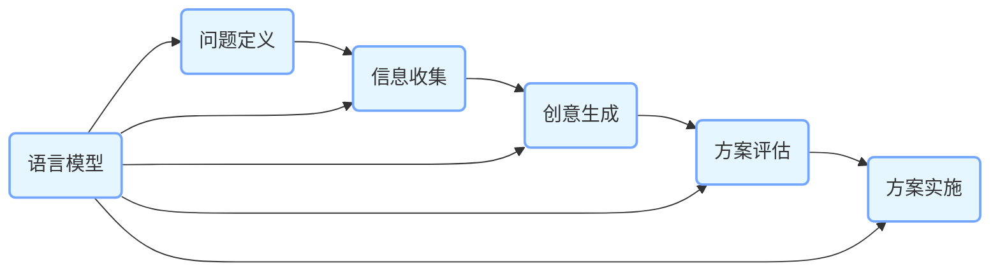

# 语言模型在创造性问题解决中的应用

> 关键词：语言模型、创造性问题解决、自然语言处理、知识推理、创新思维

> 摘要：本文围绕语言模型在创造性问题解决中的应用展开深入探讨。首先介绍了相关背景知识，包括研究目的、预期读者、文档结构等内容。接着阐述了语言模型和创造性问题解决的核心概念及其联系，详细讲解了核心算法原理与具体操作步骤，并通过数学模型和公式进行理论支撑。然后通过项目实战案例，展示了语言模型在实际问题解决中的代码实现与分析。之后探讨了语言模型在不同领域的实际应用场景，推荐了相关的学习资源、开发工具框架以及论文著作。最后总结了语言模型在创造性问题解决中的未来发展趋势与挑战，并对常见问题进行解答，还提供了扩展阅读和参考资料，旨在全面深入地剖析语言模型在创造性问题解决方面的应用价值和潜力。

## 1. 背景介绍 
### 1.1 目的和范围
随着科技的不断进步，语言模型在自然语言处理领域取得了显著的发展。语言模型具有强大的文本生成、知识推理等能力，这使得它在创造性问题解决方面具有巨大的应用潜力。本文章的目的在于深入探讨语言模型如何应用于创造性问题解决，分析其原理、方法和实际应用效果。范围涵盖了语言模型的基本概念、核心算法、数学模型，以及在不同领域的实际应用案例等方面，旨在为读者全面展示语言模型在创造性问题解决中的全貌。

### 1.2 预期读者
本文预期读者包括对自然语言处理、人工智能领域感兴趣的研究人员、工程师、学生等。对于希望了解语言模型技术以及如何将其应用于实际问题解决的专业人士，本文提供了详细的技术讲解和实际案例分析。对于初学者，文章从基础概念入手，逐步深入，有助于他们快速了解语言模型在创造性问题解决中的应用原理和方法。

### 1.3 文档结构概述
本文共分为十个部分。第一部分为背景介绍，阐述了文章的目的、预期读者和文档结构等内容。第二部分介绍语言模型和创造性问题解决的核心概念及其联系，并通过文本示意图和 Mermaid 流程图进行展示。第三部分详细讲解语言模型的核心算法原理和具体操作步骤，同时使用 Python 源代码进行阐述。第四部分介绍语言模型的数学模型和公式，并通过举例进行详细说明。第五部分是项目实战，包括开发环境搭建、源代码实现和代码解读分析。第六部分探讨语言模型在实际应用中的场景。第七部分推荐相关的学习资源、开发工具框架和论文著作。第八部分总结语言模型在创造性问题解决中的未来发展趋势与挑战。第九部分是附录，解答常见问题。第十部分提供扩展阅读和参考资料。

### 1.4 术语表
#### 1.4.1 核心术语定义
- **语言模型**：是一种对自然语言文本进行概率建模的模型，用于预测文本中每个词出现的概率。它可以学习语言的模式和规律，从而生成自然流畅的文本。
- **创造性问题解决**：指的是在面对复杂、新颖的问题时，通过创新的思维和方法来找到解决方案的过程。
- **自然语言处理**：是计算机科学与人工智能领域中的一个重要方向，旨在让计算机能够理解、处理和生成自然语言。

#### 1.4.2 相关概念解释
- **知识推理**：是指从已知的知识中推导出新的知识的过程。在语言模型中，知识推理可以通过对文本的理解和分析来实现。
- **文本生成**：是语言模型的一个重要应用，指的是根据给定的输入文本，生成相关的文本内容。

#### 1.4.3 缩略词列表
- **NLP**：Natural Language Processing，自然语言处理
- **GPT**：Generative Pretrained Transformer，生成式预训练变换器

## 2. 核心概念与联系 
### 2.1 语言模型的原理和架构
语言模型的目标是学习语言的概率分布，即给定一个文本序列，预测下一个词出现的概率。常见的语言模型架构包括循环神经网络（RNN）、长短期记忆网络（LSTM）和变换器（Transformer）等。其中，Transformer 架构由于其强大的并行计算能力和长序列处理能力，成为了当前语言模型的主流架构。

Transformer 架构主要由编码器和解码器组成。编码器负责对输入的文本进行特征提取和编码，解码器则根据编码器的输出和之前生成的词来生成下一个词。其核心机制是注意力机制，通过注意力机制，模型可以动态地关注输入文本的不同部分，从而更好地捕捉文本中的语义信息。

以下是 Transformer 架构的文本示意图：

```plaintext
输入文本 --> 嵌入层 --> 编码器（多头注意力机制、前馈神经网络） --> 解码器（多头注意力机制、前馈神经网络） --> 输出文本
```

### 2.2 创造性问题解决的过程
创造性问题解决通常包括以下几个阶段：
1. **问题定义**：明确问题的本质和范围，理解问题的背景和目标。
2. **信息收集**：收集与问题相关的各种信息，包括数据、知识、经验等。
3. **创意生成**：通过各种思维方法和技巧，生成多个可能的解决方案。
4. **方案评估**：对生成的解决方案进行评估和筛选，选择最优的方案。
5. **方案实施**：将选择的方案付诸实践，并对实施过程进行监控和调整。

### 2.3 语言模型与创造性问题解决的联系
语言模型可以在创造性问题解决的各个阶段发挥重要作用。在问题定义阶段，语言模型可以帮助理解问题的描述，提取关键信息。在信息收集阶段，语言模型可以通过文本检索和知识推理，获取相关的信息和知识。在创意生成阶段，语言模型可以通过文本生成，提供多个可能的解决方案。在方案评估阶段，语言模型可以对生成的方案进行语义分析和评估。在方案实施阶段，语言模型可以用于与用户进行交互，提供实时的指导和反馈。

以下是语言模型在创造性问题解决中的 Mermaid 流程图：



## 3. 核心算法原理 & 具体操作步骤 
### 3.1 语言模型的核心算法原理
Transformer 架构的核心算法是自注意力机制（Self-Attention）。自注意力机制可以让模型在处理每个词时，动态地关注输入序列中的其他词，从而捕捉到词与词之间的依赖关系。

自注意力机制的计算步骤如下：
1. 对于输入序列中的每个词，将其嵌入向量分别乘以三个不同的权重矩阵，得到查询向量（Query）、键向量（Key）和值向量（Value）。
2. 计算查询向量与所有键向量的点积，得到注意力分数。
3. 对注意力分数进行缩放和归一化处理，得到注意力权重。
4. 将注意力权重与值向量相乘并求和，得到每个词的上下文表示。

以下是自注意力机制的 Python 代码实现：

```python
import torch
import torch.nn as nn

class SelfAttention(nn.Module):
    def __init__(self, input_dim, output_dim):
        super(SelfAttention, self).__init__()
        self.query = nn.Linear(input_dim, output_dim)
        self.key = nn.Linear(input_dim, output_dim)
        self.value = nn.Linear(input_dim, output_dim)
        self.softmax = nn.Softmax(dim=-1)

    def forward(self, x):
        Q = self.query(x)
        K = self.key(x)
        V = self.value(x)
        attention_scores = torch.matmul(Q, K.transpose(-2, -1))
        attention_scores = attention_scores / (Q.size(-1) ** 0.5)
        attention_weights = self.softmax(attention_scores)
        output = torch.matmul(attention_weights, V)
        return output
```

### 3.2 具体操作步骤
1. **数据预处理**：将输入的文本数据进行分词、词嵌入等预处理操作，将其转换为模型可以处理的向量表示。
2. **模型训练**：使用大规模的文本数据对语言模型进行训练，优化模型的参数，使其能够学习到语言的模式和规律。
3. **问题输入**：将需要解决的问题以文本的形式输入到语言模型中。
4. **创意生成**：语言模型根据输入的问题，生成多个可能的解决方案。
5. **方案评估**：对生成的解决方案进行评估和筛选，选择最优的方案。
6. **方案输出**：将选择的最优方案输出给用户。

## 4. 数学模型和公式 & 详细讲解 & 举例说明 
### 4.1 自注意力机制的数学模型和公式
自注意力机制的数学模型可以用以下公式表示：

$$
\text{Attention}(Q, K, V) = \text{softmax}\left(\frac{QK^T}{\sqrt{d_k}}\right)V
$$

其中，$Q$ 是查询矩阵，$K$ 是键矩阵，$V$ 是值矩阵，$d_k$ 是查询向量的维度。

### 4.2 详细讲解
- **查询、键和值矩阵**：对于输入序列中的每个词，将其嵌入向量分别乘以三个不同的权重矩阵，得到查询向量、键向量和值向量。这些向量构成了查询矩阵 $Q$、键矩阵 $K$ 和值矩阵 $V$。
- **注意力分数**：计算查询矩阵 $Q$ 与键矩阵 $K$ 的转置的点积，得到注意力分数。注意力分数表示每个词与其他词之间的相关性。
- **缩放**：为了避免点积结果过大，将注意力分数除以 $\sqrt{d_k}$。
- **归一化**：使用 softmax 函数对注意力分数进行归一化处理，得到注意力权重。注意力权重表示每个词在生成当前词的上下文表示时的重要性。
- **上下文表示**：将注意力权重与值矩阵 $V$ 相乘并求和，得到每个词的上下文表示。

### 4.3 举例说明
假设输入序列为 $[x_1, x_2, x_3]$，每个词的嵌入向量维度为 $d$。首先，将每个词的嵌入向量分别乘以三个不同的权重矩阵，得到查询向量、键向量和值向量。然后，计算查询向量与所有键向量的点积，得到注意力分数。接着，对注意力分数进行缩放和归一化处理，得到注意力权重。最后，将注意力权重与值向量相乘并求和，得到每个词的上下文表示。

例如，对于词 $x_1$，其查询向量为 $q_1$，键向量为 $k_1, k_2, k_3$，值向量为 $v_1, v_2, v_3$。注意力分数为 $s_{11} = q_1 \cdot k_1$，$s_{12} = q_1 \cdot k_2$，$s_{13} = q_1 \cdot k_3$。缩放后的注意力分数为 $\hat{s}_{1i} = \frac{s_{1i}}{\sqrt{d_k}}$。注意力权重为 $a_{1i} = \text{softmax}(\hat{s}_{1i})$。上下文表示为 $c_1 = a_{11}v_1 + a_{12}v_2 + a_{13}v_3$。

## 5. 项目实战：代码实际案例和详细解释说明 
### 5.1  开发环境搭建
1. **安装 Python**：建议使用 Python 3.7 及以上版本。
2. **安装 PyTorch**：根据自己的系统和 CUDA 版本选择合适的 PyTorch 版本进行安装。可以使用以下命令进行安装：
```sh
pip install torch torchvision
```
3. **安装其他依赖库**：安装必要的依赖库，如 `transformers`、`numpy`、`pandas` 等。可以使用以下命令进行安装：
```sh
pip install transformers numpy pandas
```

### 5.2  源代码详细实现和代码解读
以下是一个使用 `transformers` 库中的 GPT-2 模型进行创意生成的示例代码：

```python
from transformers import GPT2LMHeadModel, GPT2Tokenizer

# 加载预训练的 GPT-2 模型和分词器
model = GPT2LMHeadModel.from_pretrained('gpt2')
tokenizer = GPT2Tokenizer.from_pretrained('gpt2')

# 定义问题
problem = "如何提高团队的协作效率？"

# 对问题进行编码
input_ids = tokenizer.encode(problem, return_tensors='pt')

# 生成创意
output = model.generate(input_ids, max_length=100, num_return_sequences=3)

# 解码生成的创意
for i in range(len(output)):
    generated_text = tokenizer.decode(output[i], skip_special_tokens=True)
    print(f"创意 {i+1}: {generated_text}")
```

### 5.3  代码解读与分析
1. **加载预训练的模型和分词器**：使用 `transformers` 库中的 `GPT2LMHeadModel` 和 `GPT2Tokenizer` 类加载预训练的 GPT-2 模型和分词器。
2. **定义问题**：将需要解决的问题以文本的形式定义为 `problem` 变量。
3. **对问题进行编码**：使用分词器将问题文本编码为模型可以处理的输入 ID。
4. **生成创意**：使用模型的 `generate` 方法生成创意。`max_length` 参数指定生成文本的最大长度，`num_return_sequences` 参数指定生成的创意数量。
5. **解码生成的创意**：使用分词器将生成的输入 ID 解码为文本，并打印输出。

## 6. 实际应用场景 
### 6.1 教育领域
在教育领域，语言模型可以帮助教师设计更有创意的教学方案。例如，教师可以输入教学目标和学生的特点，语言模型可以生成多种教学活动和教学资源的建议，帮助教师提高教学效果。同时，语言模型还可以用于辅助学生写作，提供创意和语法检查等功能。

### 6.2 商业领域
在商业领域，语言模型可以用于市场调研和产品创新。例如，企业可以输入市场需求和竞争情况，语言模型可以生成产品创意和营销策略的建议。此外，语言模型还可以用于客户服务，自动回答客户的问题，提高客户满意度。

### 6.3 艺术领域
在艺术领域，语言模型可以帮助艺术家创作更有创意的作品。例如，画家可以输入绘画主题和风格要求，语言模型可以生成绘画灵感和构图建议。作家可以输入故事背景和人物设定，语言模型可以生成故事情节和对话内容。

### 6.4 科研领域
在科研领域，语言模型可以帮助科研人员进行文献调研和论文写作。例如，科研人员可以输入研究主题和关键词，语言模型可以推荐相关的文献和研究成果。同时，语言模型还可以用于论文的润色和语法检查，提高论文的质量。

## 7. 工具和资源推荐
### 7.1 学习资源推荐
#### 7.1.1 书籍推荐
- 《自然语言处理入门》：这本书详细介绍了自然语言处理的基本概念、算法和应用，适合初学者入门。
- 《深度学习》：这本书是深度学习领域的经典著作，涵盖了深度学习的基本原理、模型架构和训练方法等内容。
- 《Python 自然语言处理》：这本书结合 Python 语言，介绍了自然语言处理的常用工具和技术，具有很强的实践性。

#### 7.1.2 在线课程
- Coursera 上的“Natural Language Processing Specialization”：这是一门由顶尖大学教授授课的自然语言处理专项课程，内容丰富，适合系统学习。
- edX 上的“Deep Learning for Natural Language Processing”：这门课程深入介绍了深度学习在自然语言处理中的应用，适合有一定基础的学习者。
- 哔哩哔哩上的相关自然语言处理教程：哔哩哔哩上有很多优秀的自然语言处理教程，由不同的博主分享，内容生动有趣，适合快速学习。

#### 7.1.3 技术博客和网站
- 博客园：博客园上有很多自然语言处理领域的技术博客，作者分享了自己的研究成果和实践经验，对学习和研究有很大的帮助。
- Medium：Medium 上有很多关于人工智能和自然语言处理的优质文章，涵盖了最新的研究成果和技术趋势。
- arXiv：arXiv 是一个预印本论文库，提供了大量的自然语言处理领域的研究论文，是获取最新研究成果的重要渠道。

### 7.2 开发工具框架推荐
#### 7.2.1 IDE和编辑器
- PyCharm：PyCharm 是一款专门为 Python 开发设计的集成开发环境，具有强大的代码编辑、调试和项目管理功能。
- Visual Studio Code：Visual Studio Code 是一款轻量级的代码编辑器，支持多种编程语言，具有丰富的插件和扩展功能。
- Jupyter Notebook：Jupyter Notebook 是一个交互式的开发环境，适合进行数据分析和模型训练，方便代码的展示和分享。

#### 7.2.2 调试和性能分析工具
- TensorBoard：TensorBoard 是 TensorFlow 提供的一个可视化工具，可以用于可视化模型的训练过程、损失函数和评估指标等。
- PyTorch Profiler：PyTorch Profiler 是 PyTorch 提供的一个性能分析工具，可以帮助用户分析模型的性能瓶颈，优化模型的运行效率。
- cProfile：cProfile 是 Python 标准库中的一个性能分析工具，可以用于分析 Python 代码的性能，找出耗时较长的函数和代码段。

#### 7.2.3 相关框架和库
- Transformers：Transformers 是 Hugging Face 开发的一个自然语言处理库，提供了多种预训练的语言模型和工具，方便用户进行文本生成、文本分类等任务。
- NLTK：NLTK 是一个自然语言处理工具包，提供了多种自然语言处理的工具和数据集，适合进行自然语言处理的基础研究和实践。
- SpaCy：SpaCy 是一个高效的自然语言处理库，提供了快速的文本处理和分析功能，适合进行大规模的自然语言处理任务。

### 7.3 相关论文著作推荐
#### 7.3.1 经典论文
- “Attention Is All You Need”：这篇论文介绍了 Transformer 架构，提出了自注意力机制，是自然语言处理领域的经典论文。
- “BERT: Pre-training of Deep Bidirectional Transformers for Language Understanding”：这篇论文介绍了 BERT 模型，提出了预训练 - 微调的自然语言处理范式，对自然语言处理的发展产生了深远的影响。
- “Generative Adversarial Nets”：这篇论文介绍了生成对抗网络（GAN），为自然语言生成领域提供了新的思路和方法。

#### 7.3.2 最新研究成果
- 关注 arXiv 上的最新论文，了解自然语言处理领域的最新研究成果和技术趋势。
- 参加自然语言处理领域的国际会议，如 ACL、EMNLP 等，获取最新的研究动态和学术交流机会。

#### 7.3.3 应用案例分析
- 《自然语言处理实战》：这本书结合实际案例，介绍了自然语言处理在不同领域的应用，包括文本分类、情感分析、机器翻译等，具有很强的实践性和参考价值。
- 相关的学术期刊和会议论文集：如《Journal of Artificial Intelligence Research》、《Proceedings of the Annual Meeting of the Association for Computational Linguistics》等，收录了大量的自然语言处理应用案例和研究成果。

## 8. 总结：未来发展趋势与挑战
### 8.1 未来发展趋势
- **多模态融合**：未来的语言模型将不仅仅局限于文本处理，还将与图像、音频等多种模态的数据进行融合，实现更加丰富和全面的信息处理和理解。
- **个性化和定制化**：语言模型将能够根据用户的个性化需求和偏好，提供更加定制化的服务和解决方案。
- **跨领域应用**：语言模型将在更多的领域得到应用，如医疗、金融、交通等，为各个领域的发展带来新的机遇和挑战。

### 8.2 挑战
- **数据隐私和安全**：语言模型的训练和应用需要大量的数据，如何保护数据的隐私和安全是一个重要的挑战。
- **模型可解释性**：目前的语言模型大多是黑盒模型，缺乏可解释性，如何提高模型的可解释性是一个亟待解决的问题。
- **伦理和道德问题**：语言模型的应用可能会带来一些伦理和道德问题，如虚假信息传播、偏见和歧视等，需要制定相应的规范和准则来加以约束。

## 9. 附录：常见问题与解答
### 9.1 语言模型生成的创意是否具有创新性？
语言模型生成的创意具有一定的创新性，但它的创新性是基于已有的知识和模式。语言模型通过学习大量的文本数据，能够生成一些新颖的组合和表达方式，但它的创意仍然受到训练数据的限制。为了提高创意的创新性，可以结合人类的创造力和专业知识，对语言模型生成的创意进行进一步的筛选和优化。

### 9.2 如何选择合适的语言模型？
选择合适的语言模型需要考虑多个因素，如任务类型、数据规模、计算资源等。对于文本生成任务，可以选择 GPT-2、GPT-3 等生成式语言模型；对于文本分类任务，可以选择 BERT、RoBERTa 等预训练语言模型。同时，还需要根据数据规模和计算资源选择合适的模型大小和版本。

### 9.3 语言模型在实际应用中存在哪些局限性？
语言模型在实际应用中存在一些局限性，如对语义的理解不够深入、缺乏常识和推理能力、容易生成虚假信息等。此外，语言模型的训练和应用需要大量的计算资源和数据，成本较高。为了克服这些局限性，需要不断改进模型的算法和架构，提高模型的性能和可靠性。

## 10. 扩展阅读 & 参考资料
### 10.1 扩展阅读
- 《人工智能时代的语言与智能》：这本书探讨了人工智能时代语言与智能的关系，对语言模型的发展和应用具有一定的启示作用。
- 《智能时代》：这本书介绍了智能时代的发展趋势和影响，对语言模型在智能时代的应用前景进行了展望。

### 10.2 参考资料
- Hugging Face 官方文档：https://huggingface.co/docs
- PyTorch 官方文档：https://pytorch.org/docs/stable/index.html
- NLTK 官方文档：https://www.nltk.org/