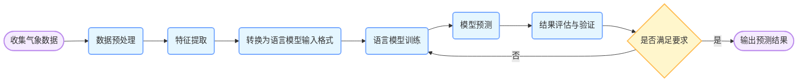

# 语言模型在复杂气候变化预测中的应用分析

> 关键词：语言模型、气候变化预测、数据处理、特征提取、深度学习、气象数据、应用分析

> 摘要：本文聚焦于语言模型在复杂气候变化预测中的应用。首先介绍了研究的背景、目的、预期读者等内容。详细阐述了语言模型和气候变化预测的核心概念及其联系，包括原理和架构。深入讲解了相关核心算法原理，结合Python代码展示具体操作步骤，同时给出数学模型和公式并举例说明。通过项目实战，展示了代码实际案例并进行详细解释。探讨了语言模型在气候变化预测中的实际应用场景，推荐了相关学习资源、开发工具框架以及论文著作。最后总结了未来发展趋势与挑战，解答常见问题并提供扩展阅读和参考资料，旨在全面分析语言模型在复杂气候变化预测领域的应用价值和潜力。

## 1. 背景介绍 
### 1.1 目的和范围
气候变化是当今全球面临的重大挑战之一，准确的气候变化预测对于制定应对策略、保障人类社会的可持续发展至关重要。传统的气候变化预测方法在处理复杂的气象数据和捕捉数据中的潜在规律方面存在一定的局限性。语言模型作为人工智能领域的重要技术，在自然语言处理等领域取得了显著的成果。本研究的目的在于探索语言模型在复杂气候变化预测中的应用，分析其可行性和有效性，尝试为气候变化预测提供新的思路和方法。研究范围涵盖了语言模型的基本原理、在气候变化预测中的数据处理、特征提取、模型训练和预测等方面。

### 1.2 预期读者
本文预期读者包括从事气象学、气候学研究的科研人员，对人工智能技术在气象领域应用感兴趣的工程师和开发者，以及相关专业的学生。希望通过本文的介绍，能够为他们在气候变化预测和语言模型应用方面提供有益的参考和启发。

### 1.3 文档结构概述
本文首先介绍了研究的背景信息，包括目的、预期读者和文档结构。接着阐述了语言模型和气候变化预测的核心概念及其联系，展示了相关的原理和架构。然后深入讲解了核心算法原理，结合Python代码说明具体操作步骤。之后给出了数学模型和公式，并进行详细讲解和举例。通过项目实战，展示了代码实际案例并进行详细分析。探讨了语言模型在气候变化预测中的实际应用场景，推荐了相关的学习资源、开发工具框架和论文著作。最后总结了未来发展趋势与挑战，解答常见问题并提供扩展阅读和参考资料。

### 1.4 术语表
#### 1.4.1 核心术语定义
- **语言模型**：是一种基于概率统计的模型，用于描述语言的概率分布，能够根据给定的上下文预测下一个词或字符出现的概率。在深度学习中，通常指基于神经网络的语言模型，如循环神经网络（RNN）、长短时记忆网络（LSTM）、门控循环单元（GRU）等，以及Transformer架构的语言模型，如GPT、BERT等。
- **气候变化预测**：是指通过对气象数据、环境数据等多源数据的分析和处理，运用数学模型和算法，对未来一段时间内的气候变化趋势进行预测，包括温度、降水、风速等气象要素的变化。
- **气象数据**：是指与大气状态和天气现象相关的数据，包括地面气象观测数据、高空探测数据、卫星遥感数据等，这些数据反映了大气的物理和化学特性。

#### 1.4.2 相关概念解释
- **深度学习**：是机器学习的一个分支领域，它基于人工神经网络，通过构建多层的神经网络模型，自动从大量数据中学习特征和模式，具有强大的非线性拟合能力。
- **特征提取**：是指从原始数据中提取出能够反映数据本质特征的信息，以便于后续的分析和处理。在气候变化预测中，特征提取可以从气象数据中提取出与气候变化相关的关键信息。
- **模型训练**：是指通过将训练数据输入到模型中，调整模型的参数，使得模型能够对输入数据进行准确的预测或分类。在语言模型应用于气候变化预测中，模型训练的目标是让模型能够根据历史气象数据预测未来的气候变化。

#### 1.4.3 缩略词列表
- **RNN**：Recurrent Neural Network，循环神经网络
- **LSTM**：Long Short-Term Memory，长短时记忆网络
- **GRU**：Gated Recurrent Unit，门控循环单元
- **GPT**：Generative Pretrained Transformer，生成式预训练变换器
- **BERT**：Bidirectional Encoder Representations from Transformers，基于Transformer的双向编码器表示

## 2. 核心概念与联系 

### 2.1 语言模型原理
语言模型的核心目标是计算给定词序列的概率分布。传统的统计语言模型基于n-gram的方法，通过统计语料库中n个连续词出现的频率来估计概率。例如，对于一个三元语法模型（n = 3），计算 $P(w_i|w_{i - 1}, w_{i - 2})$，即给定前两个词 $w_{i - 1}$ 和 $w_{i - 2}$ 时，词 $w_i$ 出现的概率。

在深度学习中，基于神经网络的语言模型得到了广泛应用。以LSTM为例，它是一种特殊的RNN，能够解决传统RNN的梯度消失问题，更好地处理长序列数据。LSTM通过门控机制来控制信息的流动，包括输入门、遗忘门和输出门。输入门决定了新输入信息的哪些部分可以进入细胞状态，遗忘门决定了细胞状态中哪些信息需要被遗忘，输出门决定了细胞状态的哪些部分将作为输出。

### 2.2 气候变化预测原理
气候变化预测主要基于对历史气象数据的分析和建模。气象数据包含了大量的信息，如温度、降水、气压等，这些数据反映了大气的状态和变化规律。通过对这些数据进行预处理、特征提取和模型训练，可以建立起能够预测未来气候变化的模型。常见的气候变化预测模型包括物理模型、统计模型和机器学习模型。物理模型基于大气动力学和热力学原理，通过数值模拟来预测气候变化；统计模型则基于历史数据的统计规律进行预测；机器学习模型则通过学习数据中的模式和规律来进行预测。

### 2.3 语言模型与气候变化预测的联系
语言模型和气候变化预测看似是两个不同的领域，但它们之间存在着一定的联系。气象数据可以看作是一种特殊的“语言”，其中每个气象要素的观测值可以看作是一个“词”，而不同时间和空间的气象数据序列可以看作是一个“句子”。语言模型的强大之处在于能够学习序列数据中的模式和规律，这与气候变化预测中需要从历史气象数据中学习变化规律的需求是一致的。因此，可以将语言模型应用于气候变化预测中，通过学习气象数据序列的模式来预测未来的气候变化。

### 2.4 架构的文本示意图
语言模型在气候变化预测中的应用架构可以描述如下：首先，收集多源的气象数据，包括地面观测数据、卫星遥感数据等。然后对这些数据进行预处理，如数据清洗、归一化等。接着，从预处理后的数据中提取特征，将其转换为适合语言模型输入的格式。之后，使用语言模型对特征数据进行训练，调整模型的参数。最后，使用训练好的模型对未来的气候变化进行预测，并对预测结果进行评估和验证。

### 2.5 Mermaid 流程图


## 3. 核心算法原理 & 具体操作步骤 

### 3.1 核心算法原理
这里以LSTM语言模型为例，介绍其在气候变化预测中的核心算法原理。LSTM的基本单元包含细胞状态 $C_t$、输入门 $i_t$、遗忘门 $f_t$ 和输出门 $o_t$。其计算公式如下：

遗忘门：
$$f_t = \sigma(W_f[h_{t - 1}, x_t] + b_f)$$

输入门：
$$i_t = \sigma(W_i[h_{t - 1}, x_t] + b_i)$$

候选细胞状态：
$$\tilde{C}_t = \tanh(W_C[h_{t - 1}, x_t] + b_C)$$

细胞状态更新：
$$C_t = f_t \odot C_{t - 1} + i_t \odot \tilde{C}_t$$

输出门：
$$o_t = \sigma(W_o[h_{t - 1}, x_t] + b_o)$$

隐藏状态：
$$h_t = o_t \odot \tanh(C_t)$$

其中，$\sigma$ 是 sigmoid 函数，$\tanh$ 是双曲正切函数，$W$ 是权重矩阵，$b$ 是偏置向量，$h_{t - 1}$ 是上一时刻的隐藏状态，$x_t$ 是当前时刻的输入。

### 3.2 具体操作步骤
#### 3.2.1 数据准备
首先，收集气象数据，如温度、降水、气压等时间序列数据。然后对数据进行预处理，包括数据清洗、去除缺失值、归一化等操作。以下是一个简单的数据归一化的Python代码示例：
```python
import numpy as np

def normalize_data(data):
    min_val = np.min(data)
    max_val = np.max(data)
    normalized_data = (data - min_val) / (max_val - min_val)
    return normalized_data
```

#### 3.2.2 数据集划分
将预处理后的数据划分为训练集、验证集和测试集。一般来说，可以按照 70%、15%、15% 的比例进行划分。以下是一个简单的数据集划分的Python代码示例：
```python
def split_dataset(data, train_ratio=0.7, val_ratio=0.15):
    train_size = int(len(data) * train_ratio)
    val_size = int(len(data) * val_ratio)
    train_data = data[:train_size]
    val_data = data[train_size:train_size + val_size]
    test_data = data[train_size + val_size:]
    return train_data, val_data, test_data
```

#### 3.2.3 构建LSTM模型
使用Keras库构建LSTM模型。以下是一个简单的LSTM模型构建的Python代码示例：
```python
from tensorflow.keras.models import Sequential
from tensorflow.keras.layers import LSTM, Dense

def build_lstm_model(input_shape):
    model = Sequential()
    model.add(LSTM(50, input_shape=input_shape))
    model.add(Dense(1))
    model.compile(optimizer='adam', loss='mse')
    return model
```

#### 3.2.4 模型训练
将训练数据输入到模型中进行训练。以下是一个简单的模型训练的Python代码示例：
```python
def train_model(model, train_data, val_data, epochs=100, batch_size=32):
    history = model.fit(train_data[0], train_data[1], epochs=epochs, batch_size=batch_size, validation_data=val_data)
    return history
```

#### 3.2.5 模型预测
使用训练好的模型对测试数据进行预测。以下是一个简单的模型预测的Python代码示例：
```python
def predict(model, test_data):
    predictions = model.predict(test_data)
    return predictions
```

## 4. 数学模型和公式 & 详细讲解 & 举例说明 

### 4.1 损失函数
在语言模型应用于气候变化预测中，常用的损失函数是均方误差（MSE）。均方误差的计算公式为：
$$MSE = \frac{1}{n} \sum_{i = 1}^{n} (y_i - \hat{y}_i)^2$$

其中，$n$ 是样本数量，$y_i$ 是真实值，$\hat{y}_i$ 是预测值。均方误差衡量了预测值与真实值之间的平均平方误差，误差越小，说明模型的预测效果越好。

### 4.2 优化算法
常用的优化算法是随机梯度下降（SGD）及其变种，如Adam。Adam算法结合了Adagrad和RMSProp的优点，能够自适应地调整学习率。其更新公式如下：

计算一阶矩估计：
$$m_t = \beta_1 m_{t - 1} + (1 - \beta_1)g_t$$

计算二阶矩估计：
$$v_t = \beta_2 v_{t - 1} + (1 - \beta_2)g_t^2$$

修正一阶矩估计偏差：
$$\hat{m}_t = \frac{m_t}{1 - \beta_1^t}$$

修正二阶矩估计偏差：
$$\hat{v}_t = \frac{v_t}{1 - \beta_2^t}$$

更新参数：
$$\theta_{t + 1} = \theta_t - \frac{\alpha}{\sqrt{\hat{v}_t} + \epsilon} \hat{m}_t$$

其中，$g_t$ 是当前时刻的梯度，$\beta_1$ 和 $\beta_2$ 是超参数，通常分别设置为 0.9 和 0.999，$\alpha$ 是学习率，$\epsilon$ 是一个很小的常数，用于防止分母为零。

### 4.3 举例说明
假设我们有一组气象数据，包含100个样本，真实值 $y$ 和预测值 $\hat{y}$ 如下：
```python
import numpy as np

y = np.array([1, 2, 3, 4, 5])
y_hat = np.array([1.1, 1.9, 3.2, 3.8, 5.1])
```

计算均方误差：
```python
mse = np.mean((y - y_hat) ** 2)
print("均方误差:", mse)
```

## 5. 项目实战：代码实际案例和详细解释说明 

### 5.1  开发环境搭建
#### 5.1.1 安装Python
首先，需要安装Python环境。可以从Python官方网站（https://www.python.org/downloads/） 下载适合自己操作系统的Python版本进行安装。

#### 5.1.2 安装必要的库
使用pip命令安装必要的库，如TensorFlow、Keras、NumPy、Pandas等。以下是安装命令：
```bash
pip install tensorflow keras numpy pandas
```

### 5.2  源代码详细实现和代码解读
#### 5.2.1 数据加载和预处理
```python
import numpy as np
import pandas as pd

# 加载数据
data = pd.read_csv('weather_data.csv')

# 提取需要的特征
features = data[['temperature', 'precipitation', 'pressure']].values

# 数据归一化
def normalize_data(data):
    min_val = np.min(data, axis=0)
    max_val = np.max(data, axis=0)
    normalized_data = (data - min_val) / (max_val - min_val)
    return normalized_data, min_val, max_val

normalized_features, min_val, max_val = normalize_data(features)

# 划分数据集
train_size = int(len(normalized_features) * 0.7)
val_size = int(len(normalized_features) * 0.15)
train_data = normalized_features[:train_size]
val_data = normalized_features[train_size:train_size + val_size]
test_data = normalized_features[train_size + val_size:]

# 准备训练数据和标签
def create_sequences(data, seq_length):
    sequences = []
    labels = []
    for i in range(len(data) - seq_length):
        seq = data[i:i + seq_length]
        label = data[i + seq_length, 0]  # 预测温度
        sequences.append(seq)
        labels.append(label)
    return np.array(sequences), np.array(labels)

seq_length = 10
train_sequences, train_labels = create_sequences(train_data, seq_length)
val_sequences, val_labels = create_sequences(val_data, seq_length)
test_sequences, test_labels = create_sequences(test_data, seq_length)
```
代码解读：首先，使用Pandas库加载气象数据。然后提取需要的特征，如温度、降水和气压。接着对数据进行归一化处理，将数据缩放到 [0, 1] 范围内。之后，将数据集划分为训练集、验证集和测试集。最后，使用 `create_sequences` 函数将数据转换为适合LSTM模型输入的序列数据和对应的标签。

#### 5.2.2 构建和训练模型
```python
from tensorflow.keras.models import Sequential
from tensorflow.keras.layers import LSTM, Dense

# 构建LSTM模型
model = Sequential()
model.add(LSTM(50, input_shape=(seq_length, train_sequences.shape[2])))
model.add(Dense(1))
model.compile(optimizer='adam', loss='mse')

# 训练模型
history = model.fit(train_sequences, train_labels, epochs=100, batch_size=32, validation_data=(val_sequences, val_labels))
```
代码解读：使用Keras库构建一个简单的LSTM模型，包含一个LSTM层和一个全连接层。使用 `compile` 方法编译模型，指定优化器为Adam，损失函数为均方误差。然后使用 `fit` 方法对模型进行训练，同时传入验证集数据进行验证。

#### 5.2.3 模型预测和结果评估
```python
# 模型预测
predictions = model.predict(test_sequences)

# 反归一化
predictions = predictions * (max_val[0] - min_val[0]) + min_val[0]
test_labels = test_labels * (max_val[0] - min_val[0]) + min_val[0]

# 计算均方误差
mse = np.mean((predictions - test_labels) ** 2)
print("均方误差:", mse)
```
代码解读：使用训练好的模型对测试数据进行预测。然后将预测结果和真实标签进行反归一化处理，恢复到原始数据的尺度。最后计算均方误差，评估模型的预测效果。

### 5.3  代码解读与分析
通过上述代码，我们完成了一个简单的语言模型（LSTM）在气候变化预测中的应用。数据预处理步骤确保了数据的质量和一致性，将数据转换为适合模型输入的格式。LSTM模型能够学习气象数据序列中的模式和规律，通过训练不断调整模型的参数，以提高预测的准确性。最后，通过计算均方误差评估模型的性能，均方误差越小，说明模型的预测效果越好。

## 6. 实际应用场景 
### 6.1 农业生产
语言模型在气候变化预测中的应用可以为农业生产提供重要的决策依据。通过准确预测未来的气候变化，如温度、降水等气象要素的变化，农民可以合理安排种植时间、选择合适的农作物品种，采取有效的灌溉和施肥措施，从而提高农作物的产量和质量。例如，在干旱地区，如果能够提前预测到降水的减少，农民可以提前采取节水灌溉措施，减少水资源的浪费。

### 6.2 能源管理
能源管理部门可以根据气候变化预测结果合理安排能源的生产和分配。例如，在高温天气下，人们对空调等制冷设备的需求会增加，电力负荷也会相应增大。通过准确预测高温天气的出现时间和强度，电力公司可以提前做好发电计划，增加电力供应，避免电力短缺。同时，对于可再生能源，如太阳能和风能，气候变化预测可以帮助预测其发电能力，合理安排能源存储和调度。

### 6.3 灾害预警
语言模型在气候变化预测中的应用可以提高灾害预警的准确性和及时性。例如，通过预测暴雨、洪水、台风等极端天气事件的发生时间和强度，相关部门可以提前做好防范措施，疏散人员，减少灾害造成的损失。在洪水预警方面，准确的降水预测可以帮助水利部门提前调整水库水位，做好防洪准备。

### 6.4 生态保护
气候变化对生态系统的影响巨大，语言模型在气候变化预测中的应用可以为生态保护提供支持。通过预测气候变化对生物多样性、生态系统功能等方面的影响，生态保护部门可以采取相应的保护措施，如建立自然保护区、开展生态修复工程等，维护生态系统的平衡和稳定。

## 7. 工具和资源推荐
### 7.1 学习资源推荐
#### 7.1.1 书籍推荐
- 《深度学习》（Deep Learning）：由Ian Goodfellow、Yoshua Bengio和Aaron Courville所著，是深度学习领域的经典教材，全面介绍了深度学习的基本原理、算法和应用。
- 《Python深度学习》（Deep Learning with Python）：由Francois Chollet所著，结合Python和Keras库，详细介绍了深度学习的实践方法和应用案例。
- 《气象学与气候学》：系统介绍了气象学和气候学的基本概念、原理和方法，对于理解气候变化预测的背景知识非常有帮助。

#### 7.1.2 在线课程
- Coursera上的“深度学习专项课程”（Deep Learning Specialization）：由Andrew Ng教授授课，涵盖了深度学习的各个方面，包括神经网络、卷积神经网络、循环神经网络等。
- edX上的“应用气象学与气候学”（Applied Meteorology and Climatology）：介绍了气象学和气候学的基本原理和应用，以及如何使用数据和模型进行气候变化预测。
- 中国大学MOOC上的“人工智能基础”：讲解了人工智能的基本概念、算法和应用，包括语言模型的相关知识。

#### 7.1.3 技术博客和网站
- Medium：是一个技术博客平台，上面有很多关于深度学习、人工智能和气候变化预测的文章和分享。
- arXiv：是一个预印本数据库，提供了大量的学术论文，包括最新的研究成果和技术进展。
- 中国气象数据网：提供了丰富的气象数据和相关的研究报告，对于了解气候变化预测的实际应用和数据资源非常有帮助。

### 7.2 开发工具框架推荐
#### 7.2.1 IDE和编辑器
- PyCharm：是一款专业的Python集成开发环境，提供了丰富的功能和工具，如代码编辑、调试、版本控制等，非常适合Python开发。
- Jupyter Notebook：是一个交互式的开发环境，支持Python、R等多种编程语言，方便进行数据分析和模型训练。
- Visual Studio Code：是一款轻量级的代码编辑器，支持多种编程语言和插件，具有良好的扩展性和用户体验。

#### 7.2.2 调试和性能分析工具
- TensorBoard：是TensorFlow提供的可视化工具，用于监控模型训练过程中的损失函数、准确率等指标，帮助分析模型的性能和调试问题。
- PyTorch Profiler：是PyTorch提供的性能分析工具，用于分析模型的计算性能和内存使用情况，帮助优化模型的性能。
- NVIDIA Nsight Systems：是NVIDIA提供的性能分析工具，用于分析GPU加速的深度学习模型的性能，帮助优化GPU资源的使用。

#### 7.2.3 相关框架和库
- TensorFlow：是一个开源的深度学习框架，提供了丰富的工具和库，支持各种深度学习模型的构建和训练。
- Keras：是一个高级神经网络API，基于TensorFlow、Theano等后端，简化了深度学习模型的构建和训练过程。
- PyTorch：是一个开源的深度学习框架，具有动态图机制，方便进行模型的调试和开发。

### 7.3 相关论文著作推荐
#### 7.3.1 经典论文
- “Attention Is All You Need”：介绍了Transformer架构，为语言模型的发展带来了重大突破。
- “Long Short-Term Memory”：提出了长短时记忆网络（LSTM），解决了传统RNN的梯度消失问题。
- “A Neural Probabilistic Language Model”：提出了基于神经网络的语言模型，开创了语言模型的深度学习时代。

#### 7.3.2 最新研究成果
- 关于将语言模型应用于气候变化预测的最新研究论文，如使用Transformer架构改进气候变化预测的精度等。
- 关于多模态数据融合在气候变化预测中的应用研究，结合气象数据、卫星遥感数据等多源数据提高预测的准确性。

#### 7.3.3 应用案例分析
- 分析语言模型在不同地区和不同气候条件下的应用案例，如在热带地区的暴雨预测、在寒带地区的气温变化预测等。
- 探讨语言模型在实际灾害预警中的应用效果和挑战，如在台风、洪水等灾害预警中的应用案例分析。

## 8. 总结：未来发展趋势与挑战
### 8.1 未来发展趋势
#### 8.1.1 多模态数据融合
未来，语言模型在气候变化预测中将更多地融合多模态数据，如气象数据、卫星遥感数据、地理信息数据等。通过融合不同类型的数据，可以更全面地了解气候变化的特征和规律，提高预测的准确性。

#### 8.1.2 模型优化和创新
随着深度学习技术的不断发展，语言模型将不断优化和创新。例如，采用更先进的架构，如Transformer的变体，提高模型的性能和效率。同时，结合强化学习等技术，让模型能够自动学习和调整预测策略。

#### 8.1.3 跨领域合作
气候变化预测是一个复杂的问题，需要跨领域的合作。未来，语言模型的开发者将与气象学家、气候学家等领域的专家密切合作，共同推动气候变化预测技术的发展。

### 8.2 挑战
#### 8.2.1 数据质量和数量
气象数据的质量和数量对气候变化预测的准确性至关重要。目前，气象数据存在数据缺失、误差较大等问题，同时数据的数量也有限。如何提高数据的质量和获取更多的数据是一个挑战。

#### 8.2.2 模型解释性
语言模型通常是黑盒模型，其预测结果的解释性较差。在气候变化预测中，需要了解模型做出预测的依据和原因，以便更好地应用预测结果。如何提高模型的解释性是一个亟待解决的问题。

#### 8.2.3 计算资源需求
语言模型的训练和预测需要大量的计算资源，特别是对于大规模的气象数据和复杂的模型。如何在有限的计算资源下提高模型的性能和效率是一个挑战。

## 9. 附录：常见问题与解答
### 9.1 语言模型在气候变化预测中的准确性如何？
语言模型在气候变化预测中的准确性受到多种因素的影响，如数据质量、模型架构、训练方法等。目前，语言模型在气候变化预测中的准确性还在不断提高，与传统的预测方法相比，具有一定的优势，但仍存在一些挑战。

### 9.2 如何选择适合的语言模型用于气候变化预测？
选择适合的语言模型需要考虑多个因素，如数据的特点、预测的任务、计算资源等。一般来说，对于序列数据的处理，LSTM、GRU等循环神经网络模型和Transformer架构的模型都可以考虑。可以通过实验比较不同模型的性能，选择最适合的模型。

### 9.3 语言模型在气候变化预测中的应用是否受到地域限制？
语言模型在气候变化预测中的应用可能会受到地域限制。不同地区的气候特征和数据特点可能不同，需要根据具体情况对模型进行调整和优化。同时，不同地区的数据质量和数量也可能存在差异，会影响模型的性能。

### 9.4 如何处理气象数据中的缺失值？
处理气象数据中的缺失值可以采用多种方法，如删除缺失值、插值法、使用机器学习模型进行预测等。删除缺失值可能会导致数据量减少，影响模型的性能；插值法可以根据相邻数据的值来估计缺失值；使用机器学习模型进行预测可以根据其他特征来预测缺失值。

## 10. 扩展阅读 & 参考资料
### 10.1 扩展阅读
- 《人工智能时代的气象学》：探讨了人工智能技术在气象学中的应用和发展趋势。
- 《气候变化经济学》：介绍了气候变化对经济的影响以及应对策略，与气候变化预测密切相关。

### 10.2 参考资料
- 相关的气象学和气候学教材和文献，如《大气科学概论》《气候系统与气候变化》等。
- 深度学习领域的研究论文和开源代码，如TensorFlow、Keras、PyTorch等框架的官方文档和示例代码。
- 国际气象组织和相关研究机构发布的报告和数据，如世界气象组织（WMO）的报告、美国国家海洋和大气管理局（NOAA）的数据等。