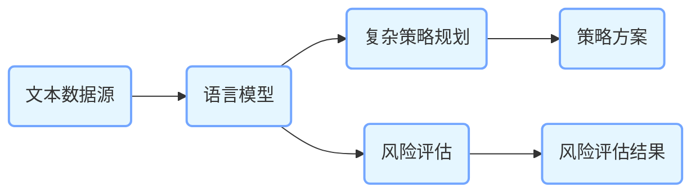

# 语言模型在复杂策略规划与风险评估中的应用

> 关键词：语言模型、复杂策略规划、风险评估、自然语言处理、决策支持

> 摘要：本文深入探讨了语言模型在复杂策略规划与风险评估领域的应用。首先介绍了相关背景，包括研究目的、预期读者等内容。接着阐述了语言模型及复杂策略规划、风险评估的核心概念与联系，通过文本示意图和 Mermaid 流程图展示其架构关系。详细讲解了语言模型的核心算法原理，并给出 Python 代码示例。同时介绍了相关数学模型和公式，辅以举例说明。在项目实战部分，通过具体代码案例详细解释了开发环境搭建、源代码实现及代码解读。分析了语言模型在实际应用场景中的表现，推荐了相关学习资源、开发工具框架以及论文著作。最后总结了未来发展趋势与挑战，解答常见问题并提供扩展阅读与参考资料，旨在全面剖析语言模型在复杂策略规划与风险评估中的应用，为相关领域的研究和实践提供有价值的参考。

## 1. 背景介绍 
### 1.1 目的和范围
在当今复杂多变的社会经济环境中，无论是企业的战略决策、政府的政策制定，还是金融机构的投资规划，都面临着复杂的策略规划和风险评估任务。传统的方法往往难以应对海量、非结构化的信息以及复杂的情境分析。语言模型作为自然语言处理领域的重要技术，具有强大的语言理解和生成能力，能够对文本信息进行深度挖掘和分析，为复杂策略规划与风险评估提供新的思路和方法。

本文的范围涵盖了语言模型的基本原理、在复杂策略规划与风险评估中的应用机制、相关算法实现、数学模型以及实际项目案例等方面。旨在全面深入地探讨语言模型在该领域的应用，为研究人员和从业者提供理论支持和实践指导。

### 1.2 预期读者
本文预期读者包括自然语言处理领域的研究人员、对复杂决策和风险评估感兴趣的学者、企业战略规划师、金融分析师、数据科学家以及相关专业的学生等。无论是希望深入了解语言模型技术原理的专业人士，还是想要借助语言模型提升决策效率和准确性的从业者，都能从本文中获取有价值的信息。

### 1.3 文档结构概述
本文将按照以下结构进行阐述：首先介绍背景信息，包括目的、预期读者和文档结构概述等；接着详细讲解语言模型、复杂策略规划与风险评估的核心概念与联系，通过文本示意图和流程图展示其架构关系；然后阐述语言模型的核心算法原理，并给出 Python 代码示例；介绍相关数学模型和公式，辅以举例说明；通过项目实战部分展示语言模型在实际应用中的代码实现和解读；分析语言模型在实际应用场景中的表现；推荐相关学习资源、开发工具框架以及论文著作；最后总结未来发展趋势与挑战，解答常见问题并提供扩展阅读与参考资料。

### 1.4 术语表
#### 1.4.1 核心术语定义
- **语言模型**：是一种对语言进行建模的概率模型，用于计算一个句子或一段文本出现的概率，也可以根据给定的上下文生成下一个词或文本。
- **复杂策略规划**：指在复杂的环境和条件下，为实现特定目标而制定的一系列相互关联的行动方案和决策过程。
- **风险评估**：对可能影响目标实现的不确定性因素进行识别、分析和评价的过程，以确定风险的可能性和影响程度。
- **自然语言处理（NLP）**：计算机科学与人工智能领域的一个重要方向，旨在让计算机理解、处理和生成人类语言。

#### 1.4.2 相关概念解释
- **预训练语言模型**：通过在大规模文本数据上进行无监督学习训练得到的语言模型，具有强大的语言理解能力，可以作为后续任务的基础模型。
- **微调**：在预训练语言模型的基础上，针对特定的任务，使用少量的标注数据对模型进行进一步训练，以适应具体任务的需求。
- **上下文**：在语言处理中，指当前词或句子周围的文本信息，用于帮助理解其含义。

#### 1.4.3 缩略词列表
- **NLP**：自然语言处理（Natural Language Processing）
- **GPT**：生成式预训练变压器（Generative Pretrained Transformer）
- **BERT**：双向编码器表示来自变压器（Bidirectional Encoder Representations from Transformers）

## 2. 核心概念与联系 
### 语言模型
语言模型的核心目标是对语言的概率分布进行建模，即计算一个词序列 $w_1, w_2, \cdots, w_n$ 出现的概率 $P(w_1, w_2, \cdots, w_n)$。传统的语言模型如 n - 元语法模型，基于马尔可夫假设，假设当前词的出现只依赖于前面的 $n - 1$ 个词。例如，二元语法模型（$n = 2$）中，$P(w_i|w_1, w_2, \cdots, w_{i - 1}) \approx P(w_i|w_{i - 1})$。

现代的预训练语言模型如 BERT、GPT 等，基于深度学习中的变压器（Transformer）架构。变压器架构通过自注意力机制（Self - Attention Mechanism）能够捕捉文本中不同位置之间的长距离依赖关系，从而更准确地建模语言的语义信息。

### 复杂策略规划
复杂策略规划涉及到多个方面的因素，包括目标设定、环境分析、资源分配、行动方案制定等。在实际应用中，需要考虑大量的文本信息，如市场调研报告、行业动态、政策法规等。语言模型可以帮助对这些文本信息进行理解和分析，提取关键信息，为策略规划提供依据。

### 风险评估
风险评估需要识别潜在的风险因素，分析其发生的可能性和影响程度。文本数据中包含了大量关于风险的信息，如新闻报道、企业年报、专家意见等。语言模型可以对这些文本进行情感分析、事件提取、实体识别等任务，帮助发现潜在的风险，并评估其严重程度。

### 核心概念的联系
语言模型为复杂策略规划和风险评估提供了强大的文本处理能力。在复杂策略规划中，语言模型可以帮助理解市场趋势、竞争对手信息等，从而制定更合理的策略。在风险评估中，语言模型可以通过分析文本中的风险信号，及时发现潜在风险，为决策提供支持。

以下是核心概念联系的文本示意图：

语言模型作为文本处理的核心技术，与复杂策略规划和风险评估紧密相连。语言模型从各种文本数据源中提取信息，经过处理和分析后，为复杂策略规划提供决策依据，帮助制定合理的策略方案；同时，为风险评估提供风险识别和分析的支持，评估风险的可能性和影响程度。

Mermaid 流程图如下：


## 3. 核心算法原理 & 具体操作步骤 
### 语言模型核心算法原理 - 变压器架构
变压器架构主要由编码器（Encoder）和解码器（Decoder）组成。在预训练语言模型中，BERT 主要使用编码器部分，而 GPT 主要使用解码器部分。

编码器由多个相同的编码层堆叠而成，每个编码层包含多头自注意力（Multi - Head Self - Attention）和前馈神经网络（Feed - Forward Neural Network）两个子层。

多头自注意力机制允许模型在不同的表示子空间中并行地关注输入序列的不同部分。给定输入序列 $X = [x_1, x_2, \cdots, x_n]$，首先通过线性变换将输入映射到查询（Query）、键（Key）和值（Value）三个向量空间，分别得到 $Q$、$K$ 和 $V$。然后计算注意力分数：

$$Attention(Q, K, V) = softmax(\frac{QK^T}{\sqrt{d_k}})V$$

其中 $d_k$ 是查询和键向量的维度。多头自注意力是将多个单头注意力的结果拼接起来，再经过一个线性变换得到最终的输出。

前馈神经网络是一个简单的两层全连接神经网络，对多头自注意力的输出进行非线性变换。

### 具体操作步骤 - 基于 BERT 进行文本分类（以风险评估中的风险等级分类为例）
以下是使用 Python 和 PyTorch 实现基于 BERT 进行文本分类的代码示例：

```python
import torch
from torch.utils.data import Dataset, DataLoader
from transformers import BertTokenizer, BertForSequenceClassification, AdamW
import pandas as pd
from sklearn.model_selection import train_test_split

# 定义数据集类
class RiskDataset(Dataset):
    def __init__(self, texts, labels, tokenizer, max_length):
        self.texts = texts
        self.labels = labels
        self.tokenizer = tokenizer
        self.max_length = max_length

    def __len__(self):
        return len(self.texts)

    def __getitem__(self, idx):
        text = str(self.texts[idx])
        label = self.labels[idx]
        encoding = self.tokenizer.encode_plus(
            text,
            add_special_tokens=True,
            max_length=self.max_length,
            padding='max_length',
            truncation=True,
            return_tensors='pt'
        )
        return {
            'input_ids': encoding['input_ids'].flatten(),
            'attention_mask': encoding['attention_mask'].flatten(),
            'labels': torch.tensor(label, dtype=torch.long)
        }

# 加载数据
data = pd.read_csv('risk_data.csv')
texts = data['text'].tolist()
labels = data['label'].tolist()

# 划分训练集和测试集
train_texts, test_texts, train_labels, test_labels = train_test_split(texts, labels, test_size=0.2, random_state=42)

# 加载预训练的 BERT 模型和分词器
tokenizer = BertTokenizer.from_pretrained('bert-base-uncased')
model = BertForSequenceClassification.from_pretrained('bert-base-uncased', num_labels=3)

# 定义数据集和数据加载器
train_dataset = RiskDataset(train_texts, train_labels, tokenizer, max_length=128)
test_dataset = RiskDataset(test_texts, test_labels, tokenizer, max_length=128)

train_dataloader = DataLoader(train_dataset, batch_size=16, shuffle=True)
test_dataloader = DataLoader(test_dataset, batch_size=16, shuffle=False)

# 定义优化器和训练参数
optimizer = AdamW(model.parameters(), lr=2e-5)
device = torch.device('cuda' if torch.cuda.is_available() else 'cpu')
model.to(device)

# 训练模型
num_epochs = 3
for epoch in range(num_epochs):
    model.train()
    total_loss = 0
    for batch in train_dataloader:
        input_ids = batch['input_ids'].to(device)
        attention_mask = batch['attention_mask'].to(device)
        labels = batch['labels'].to(device)

        model.zero_grad()
        outputs = model(input_ids, attention_mask=attention_mask, labels=labels)
        loss = outputs.loss
        loss.backward()
        optimizer.step()
        total_loss += loss.item()
    print(f'Epoch {epoch + 1}, Loss: {total_loss / len(train_dataloader)}')

# 评估模型
model.eval()
correct_predictions = 0
total_predictions = 0
with torch.no_grad():
    for batch in test_dataloader:
        input_ids = batch['input_ids'].to(device)
        attention_mask = batch['attention_mask'].to(device)
        labels = batch['labels'].to(device)

        outputs = model(input_ids, attention_mask=attention_mask)
        logits = outputs.logits
        predictions = torch.argmax(logits, dim=1)
        correct_predictions += (predictions == labels).sum().item()
        total_predictions += labels.size(0)

accuracy = correct_predictions / total_predictions
print(f'Accuracy: {accuracy}')
```

### 代码解释
1. **数据集类定义**：`RiskDataset` 类用于封装文本数据和标签，并进行分词和编码处理，将文本转换为适合 BERT 模型输入的格式。
2. **数据加载**：使用 `pandas` 读取 CSV 文件中的数据，并将其划分为训练集和测试集。
3. **模型和分词器加载**：使用 `transformers` 库加载预训练的 BERT 模型和分词器。
4. **数据加载器创建**：使用 `DataLoader` 类创建训练集和测试集的数据加载器，方便批量处理数据。
5. **训练过程**：在每个训练周期中，模型前向传播计算损失，反向传播更新模型参数。
6. **评估过程**：在测试集上进行评估，计算模型的准确率。

## 4. 数学模型和公式 & 详细讲解 & 举例说明 
### 语言模型的概率模型
语言模型的核心是计算一个词序列的概率。对于一个长度为 $n$ 的词序列 $w_1, w_2, \cdots, w_n$，其概率可以表示为：

$$P(w_1, w_2, \cdots, w_n) = \prod_{i = 1}^{n} P(w_i|w_1, w_2, \cdots, w_{i - 1})$$

例如，对于句子 “The cat is on the mat”，其概率为：

$$P(\text{The}, \text{cat}, \text{is}, \text{on}, \text{the}, \text{mat}) = P(\text{The})P(\text{cat}|\text{The})P(\text{is}|\text{The}, \text{cat})P(\text{on}|\text{The}, \text{cat}, \text{is})P(\text{the}|\text{The}, \text{cat}, \text{is}, \text{on})P(\text{mat}|\text{The}, \text{cat}, \text{is}, \text{on}, \text{the})$$

### n - 元语法模型
n - 元语法模型基于马尔可夫假设，简化了上述概率的计算。对于 $n$ 元语法模型，$P(w_i|w_1, w_2, \cdots, w_{i - 1}) \approx P(w_i|w_{i - n + 1}, \cdots, w_{i - 1})$。

例如，二元语法模型（$n = 2$）中，$P(\text{cat}|\text{The}) = \frac{C(\text{The cat})}{C(\text{The})}$，其中 $C(\text{The cat})$ 是 “The cat” 这个二元组在训练数据中出现的次数，$C(\text{The})$ 是 “The” 这个词在训练数据中出现的次数。

### 变压器架构中的注意力机制
如前面所述，注意力机制的核心公式为：

$$Attention(Q, K, V) = softmax(\frac{QK^T}{\sqrt{d_k}})V$$

其中，$Q$、$K$ 和 $V$ 分别是查询、键和值矩阵，$d_k$ 是查询和键向量的维度。$softmax$ 函数用于将注意力分数归一化，使得所有分数之和为 1。

例如，假设输入序列为 $[x_1, x_2, x_3]$，经过线性变换得到 $Q$、$K$ 和 $V$ 矩阵。计算注意力分数时，首先计算 $QK^T$，得到一个分数矩阵，然后将其除以 $\sqrt{d_k}$ 进行缩放，最后通过 $softmax$ 函数得到注意力权重矩阵。将注意力权重矩阵与 $V$ 矩阵相乘，得到最终的注意力输出。

### 交叉熵损失函数
在文本分类任务中，通常使用交叉熵损失函数来衡量模型预测结果与真实标签之间的差异。对于一个样本，其交叉熵损失为：

$$L = - \sum_{i = 1}^{C} y_i \log(p_i)$$

其中 $C$ 是类别数，$y_i$ 是真实标签的 one - hot 编码，$p_i$ 是模型预测的第 $i$ 类的概率。

例如，对于一个三分类任务，真实标签为 $[0, 1, 0]$，模型预测的概率为 $[0.1, 0.8, 0.1]$，则交叉熵损失为：

$$L = - (0 \times \log(0.1) + 1 \times \log(0.8) + 0 \times \log(0.1)) = - \log(0.8) \approx 0.223$$

## 5. 项目实战：代码实际案例和详细解释说明 
### 5.1  开发环境搭建
#### 安装 Python
首先需要安装 Python 环境，建议使用 Python 3.7 及以上版本。可以从 Python 官方网站（https://www.python.org/downloads/） 下载并安装。

#### 安装依赖库
使用 `pip` 安装所需的依赖库，包括 `torch`、`transformers`、`pandas`、`sklearn` 等。

```bash
pip install torch transformers pandas scikit-learn
```

### 5.2  源代码详细实现和代码解读
以下是一个完整的项目实战代码，用于基于语言模型进行复杂策略规划中的文本分析和风险评估。

```python
import torch
from torch.utils.data import Dataset, DataLoader
from transformers import BertTokenizer, BertForSequenceClassification, AdamW
import pandas as pd
from sklearn.model_selection import train_test_split
import numpy as np

# 定义数据集类
class StrategyRiskDataset(Dataset):
    def __init__(self, texts, labels, tokenizer, max_length):
        self.texts = texts
        self.labels = labels
        self.tokenizer = tokenizer
        self.max_length = max_length

    def __len__(self):
        return len(self.texts)

    def __getitem__(self, idx):
        text = str(self.texts[idx])
        label = self.labels[idx]
        encoding = self.tokenizer.encode_plus(
            text,
            add_special_tokens=True,
            max_length=self.max_length,
            padding='max_length',
            truncation=True,
            return_tensors='pt'
        )
        return {
            'input_ids': encoding['input_ids'].flatten(),
            'attention_mask': encoding['attention_mask'].flatten(),
            'labels': torch.tensor(label, dtype=torch.long)
        }

# 加载数据
def load_data(file_path):
    data = pd.read_csv(file_path)
    texts = data['text'].tolist()
    labels = data['label'].tolist()
    return texts, labels

# 划分训练集和测试集
def split_data(texts, labels, test_size=0.2, random_state=42):
    train_texts, test_texts, train_labels, test_labels = train_test_split(texts, labels, test_size=test_size, random_state=random_state)
    return train_texts, test_texts, train_labels, test_labels

# 训练模型
def train_model(model, train_dataloader, optimizer, device, num_epochs):
    model.train()
    for epoch in range(num_epochs):
        total_loss = 0
        for batch in train_dataloader:
            input_ids = batch['input_ids'].to(device)
            attention_mask = batch['attention_mask'].to(device)
            labels = batch['labels'].to(device)

            model.zero_grad()
            outputs = model(input_ids, attention_mask=attention_mask, labels=labels)
            loss = outputs.loss
            loss.backward()
            optimizer.step()
            total_loss += loss.item()
        print(f'Epoch {epoch + 1}, Loss: {total_loss / len(train_dataloader)}')
    return model

# 评估模型
def evaluate_model(model, test_dataloader, device):
    model.eval()
    correct_predictions = 0
    total_predictions = 0
    with torch.no_grad():
        for batch in test_dataloader:
            input_ids = batch['input_ids'].to(device)
            attention_mask = batch['attention_mask'].to(device)
            labels = batch['labels'].to(device)

            outputs = model(input_ids, attention_mask=attention_mask)
            logits = outputs.logits
            predictions = torch.argmax(logits, dim=1)
            correct_predictions += (predictions == labels).sum().item()
            total_predictions += labels.size(0)
    accuracy = correct_predictions / total_predictions
    print(f'Accuracy: {accuracy}')
    return accuracy

# 主函数
def main():
    # 加载数据
    file_path = 'strategy_risk_data.csv'
    texts, labels = load_data(file_path)

    # 划分训练集和测试集
    train_texts, test_texts, train_labels, test_labels = split_data(texts, labels)

    # 加载预训练的 BERT 模型和分词器
    tokenizer = BertTokenizer.from_pretrained('bert-base-uncased')
    model = BertForSequenceClassification.from_pretrained('bert-base-uncased', num_labels=3)

    # 定义数据集和数据加载器
    train_dataset = StrategyRiskDataset(train_texts, train_labels, tokenizer, max_length=128)
    test_dataset = StrategyRiskDataset(test_texts, test_labels, tokenizer, max_length=128)

    train_dataloader = DataLoader(train_dataset, batch_size=16, shuffle=True)
    test_dataloader = DataLoader(test_dataset, batch_size=16, shuffle=False)

    # 定义优化器和训练参数
    optimizer = AdamW(model.parameters(), lr=2e-5)
    device = torch.device('cuda' if torch.cuda.is_available() else 'cpu')
    model.to(device)

    # 训练模型
    num_epochs = 3
    trained_model = train_model(model, train_dataloader, optimizer, device, num_epochs)

    # 评估模型
    evaluate_model(trained_model, test_dataloader, device)

if __name__ == '__main__':
    main()
```

### 5.3  代码解读与分析
1. **数据集类 `StrategyRiskDataset`**：继承自 `torch.utils.data.Dataset` 类，用于封装文本数据和标签。在 `__getitem__` 方法中，使用 `BertTokenizer` 对文本进行分词和编码处理，将其转换为适合 BERT 模型输入的格式。
2. **数据加载函数 `load_data`**：使用 `pandas` 读取 CSV 文件中的数据，并将文本和标签分别存储在列表中。
3. **数据划分函数 `split_data`**：使用 `sklearn.model_selection.train_test_split` 函数将数据划分为训练集和测试集。
4. **训练函数 `train_model`**：在每个训练周期中，模型前向传播计算损失，反向传播更新模型参数。使用 `AdamW` 优化器进行参数更新。
5. **评估函数 `evaluate_model`**：在测试集上进行评估，计算模型的准确率。
6. **主函数 `main`**：调用上述函数完成数据加载、划分、模型加载、训练和评估的整个流程。

通过这个项目实战，我们可以看到如何使用语言模型进行复杂策略规划和风险评估中的文本分类任务。可以根据实际需求对代码进行扩展，例如添加更多的特征工程、调整模型参数等。

## 6. 实际应用场景 
### 金融领域
在金融领域，语言模型可以用于风险评估和投资策略规划。例如，对新闻报道、企业财报、研报等文本信息进行分析，识别潜在的风险因素，如市场波动、信用风险、流动性风险等。通过对大量文本的情感分析和事件提取，评估企业的财务状况和发展前景，为投资决策提供支持。

### 企业战略规划
企业在制定战略规划时，需要考虑市场趋势、竞争对手动态、政策法规等多方面的信息。语言模型可以帮助企业对海量的文本数据进行分析，提取关键信息，发现市场机会和潜在威胁。例如，通过对行业新闻、社交媒体数据的分析，了解消费者需求和市场趋势，为产品研发和市场推广策略提供依据。

### 政府决策
政府在制定政策时，需要综合考虑社会、经济、环境等多方面的因素。语言模型可以对公众意见、专家建议、政策文本等进行分析，帮助政府更好地了解民意和社会需求，制定更加科学合理的政策。例如，对社交媒体上的公众言论进行分析，了解公众对某项政策的看法和关注点，为政策调整提供参考。

### 医疗领域
在医疗领域，语言模型可以用于医疗风险评估和治疗策略规划。例如，对病历、医学文献、临床指南等文本信息进行分析，帮助医生更好地了解患者的病情和治疗方案。通过对大量医疗数据的挖掘和分析，发现潜在的医疗风险，为医疗决策提供支持。

## 7. 工具和资源推荐
### 7.1 学习资源推荐
#### 7.1.1 书籍推荐
- 《自然语言处理入门》：作者何晗，本书系统地介绍了自然语言处理的基本概念、算法和应用，适合初学者入门。
- 《深度学习》：作者 Ian Goodfellow、Yoshua Bengio 和 Aaron Courville，本书是深度学习领域的经典教材，对变压器架构等深度学习模型有详细的介绍。
- 《Python 自然语言处理》：作者 Steven Bird、Ewan Klein 和 Edward Loper，本书通过 Python 代码示例介绍自然语言处理的各种技术和应用。

#### 7.1.2 在线课程
- Coursera 上的 “Natural Language Processing Specialization”：由深度学习领域的知名学者授课，涵盖了自然语言处理的多个方面，包括语言模型、文本分类、机器翻译等。
- edX 上的 “Introduction to Artificial Intelligence”：介绍了人工智能的基本概念和技术，包括自然语言处理的相关内容。
- 哔哩哔哩上的一些自然语言处理相关的教学视频，如 “李宏毅机器学习” 系列课程中包含了自然语言处理的讲解。

#### 7.1.3 技术博客和网站
- Hugging Face 博客（https://huggingface.co/blog）：提供了关于预训练语言模型的最新研究成果和应用案例，以及使用 Hugging Face 库的教程和技巧。
- Medium 上的自然语言处理相关博客：有很多研究人员和从业者分享自然语言处理的技术文章和实践经验。
- 开源中国（https://www.oschina.net/）：提供了丰富的技术资讯和开源项目，其中包含了很多自然语言处理相关的内容。

### 7.2 开发工具框架推荐
#### 7.2.1 IDE和编辑器
- PyCharm：是一款专门为 Python 开发设计的集成开发环境，具有代码自动补全、调试、版本控制等功能，适合开发大规模的 Python 项目。
- Visual Studio Code：是一款轻量级的代码编辑器，支持多种编程语言和插件扩展，通过安装 Python 相关插件可以方便地进行 Python 开发。

#### 7.2.2 调试和性能分析工具
- PyTorch Profiler：是 PyTorch 提供的性能分析工具，可以帮助开发者分析模型训练和推理过程中的性能瓶颈，优化代码性能。
- TensorBoard：是 TensorFlow 提供的可视化工具，也可以与 PyTorch 结合使用，用于可视化模型训练过程中的损失、准确率等指标，帮助开发者监控模型的训练状态。

#### 7.2.3 相关框架和库
- Hugging Face Transformers：是一个强大的自然语言处理库，提供了多种预训练语言模型的接口，方便开发者快速使用和微调这些模型。
- AllenNLP：是一个用于自然语言处理的深度学习框架，提供了一系列的工具和模型，帮助开发者快速构建和训练自然语言处理模型。
- NLTK（Natural Language Toolkit）：是一个经典的自然语言处理库，提供了丰富的语料库和工具，适合初学者学习和实践自然语言处理技术。

### 7.3 相关论文著作推荐
#### 7.3.1 经典论文
- “Attention Is All You Need”：介绍了变压器（Transformer）架构，是现代预训练语言模型的基础。
- “BERT: Pre-training of Deep Bidirectional Transformers for Language Understanding”：提出了 BERT 模型，开创了预训练 - 微调的自然语言处理范式。
- “Improving Language Understanding by Generative Pre-Training”：介绍了 GPT 模型的预训练方法和应用。

#### 7.3.2 最新研究成果
- 关注 ACL（Association for Computational Linguistics）、EMNLP（Conference on Empirical Methods in Natural Language Processing）等自然语言处理领域的顶级会议，获取最新的研究成果和技术进展。
- 阅读 arXiv 上的自然语言处理相关论文，了解最新的研究动态。

#### 7.3.3 应用案例分析
- 研究一些实际应用中使用语言模型进行复杂策略规划和风险评估的案例，如金融机构使用语言模型进行信用风险评估、企业使用语言模型进行市场趋势分析等。可以参考相关企业的技术博客和研究报告，学习他们的实践经验和方法。

## 8. 总结：未来发展趋势与挑战
### 未来发展趋势
#### 多模态融合
未来的语言模型将不仅仅局限于文本处理，而是与图像、音频、视频等多种模态的数据进行融合。例如，在风险评估中，结合图像数据可以更直观地了解企业的生产设施、市场情况等；结合音频数据可以分析会议录音、客户反馈等。通过多模态融合，语言模型可以获取更丰富的信息，提高复杂策略规划和风险评估的准确性。

#### 个性化与定制化
随着用户需求的多样化，语言模型将更加注重个性化和定制化。不同的企业、行业和用户对复杂策略规划和风险评估的需求不同，语言模型可以根据用户的特定需求进行定制化训练和优化。例如，为金融机构定制专门的风险评估模型，为企业定制个性化的战略规划辅助系统。

#### 强化学习与语言模型的结合
强化学习可以通过智能体与环境的交互不断优化决策策略。将强化学习与语言模型相结合，可以使语言模型在复杂策略规划中更好地进行决策和优化。例如，在投资策略规划中，语言模型可以根据市场环境的变化，通过强化学习不断调整投资策略，提高投资收益。

### 挑战
#### 数据质量与隐私问题
语言模型的性能高度依赖于数据的质量和数量。在复杂策略规划和风险评估中，数据往往涉及到企业的商业机密、用户的隐私等敏感信息。如何在保证数据质量的前提下，保护数据的隐私和安全是一个重要的挑战。

#### 可解释性问题
语言模型通常是一个黑盒模型，其决策过程和输出结果难以解释。在复杂策略规划和风险评估中，决策者需要了解模型的决策依据，以便做出合理的决策。因此，提高语言模型的可解释性是一个亟待解决的问题。

#### 计算资源需求
训练和使用大规模的语言模型需要大量的计算资源，包括高性能的 GPU、TPU 等。对于一些资源有限的企业和机构来说，如何在有限的计算资源下实现语言模型的高效应用是一个挑战。

## 9. 附录：常见问题与解答
### 问题 1：如何选择适合的预训练语言模型？
解答：选择适合的预训练语言模型需要考虑多个因素，如任务类型、数据规模、计算资源等。如果是文本分类、情感分析等任务，BERT 系列模型通常表现较好；如果是文本生成任务，GPT 系列模型可能更合适。同时，需要根据数据规模和计算资源选择合适的模型大小，如 `bert-base-uncased` 相对较小，计算资源需求较低，而 `bert-large-uncased` 模型更大，性能可能更好，但计算资源需求也更高。

### 问题 2：如何处理数据不平衡问题？
解答：数据不平衡是指不同类别的样本数量差异较大的问题。在处理数据不平衡问题时，可以采用以下方法：
- 过采样：对少数类样本进行复制或生成新的样本，增加少数类样本的数量。
- 欠采样：对多数类样本进行随机删除，减少多数类样本的数量。
- 调整损失函数：通过调整损失函数的权重，增加少数类样本的损失权重，使模型更加关注少数类样本。

### 问题 3：如何提高模型的性能？
解答：可以从以下几个方面提高模型的性能：
- 数据增强：通过对训练数据进行变换、扩充等操作，增加数据的多样性，提高模型的泛化能力。
- 调整模型参数：如学习率、批量大小、训练轮数等，通过实验找到最优的参数组合。
- 特征工程：提取更多有用的特征，如词向量、词性标注、命名实体识别等，帮助模型更好地理解文本信息。
- 模型融合：将多个不同的模型进行融合，综合各个模型的优势，提高模型的性能。

## 10. 扩展阅读 & 参考资料
### 扩展阅读
- 《人工智能：现代方法》：全面介绍了人工智能的基本概念、算法和应用，对自然语言处理和决策支持系统等相关内容有深入的讲解。
- 《机器学习实战》：通过实际案例介绍了机器学习的各种算法和应用，帮助读者更好地理解和应用机器学习技术。

### 参考资料
- Hugging Face 官方文档（https://huggingface.co/docs/transformers/index）：提供了关于 Hugging Face Transformers 库的详细文档和使用教程。
- PyTorch 官方文档（https://pytorch.org/docs/stable/index.html）：是 PyTorch 框架的官方文档，包含了 PyTorch 的各种功能和使用方法。
- 相关学术论文和研究报告，如 ACL、EMNLP 等会议的论文集，以及企业和机构发布的研究报告。