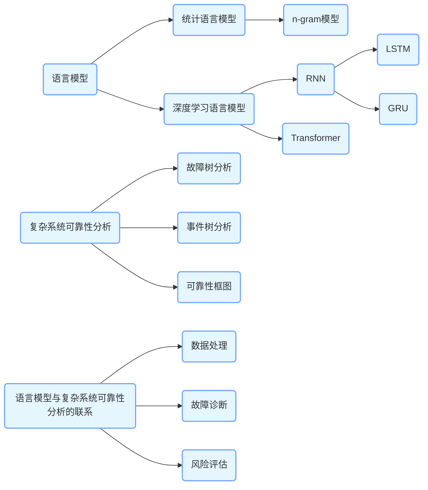

# 语言模型在复杂系统可靠性分析中的应用研究

> 关键词：语言模型、复杂系统、可靠性分析、应用研究、人工智能

> 摘要：本文围绕语言模型在复杂系统可靠性分析中的应用展开深入研究。首先介绍了研究的背景、目的、预期读者等相关内容，阐述了核心概念及联系，包括语言模型和复杂系统可靠性分析的原理与架构。详细讲解了核心算法原理及具体操作步骤，借助 Python 代码进行说明，同时给出了相关的数学模型和公式并举例。通过项目实战，展示了代码实际案例及详细解释。探讨了语言模型在复杂系统可靠性分析中的实际应用场景，推荐了学习资源、开发工具框架及相关论文著作。最后总结了未来发展趋势与挑战，提供了常见问题与解答及扩展阅读参考资料，旨在全面深入地探讨语言模型在该领域的应用，为相关研究和实践提供参考。

## 1. 背景介绍 
### 1.1 目的和范围
复杂系统通常由多个相互关联、相互作用的组件构成，其可靠性分析对于保障系统的正常运行、提高安全性和经济效益具有至关重要的意义。传统的复杂系统可靠性分析方法往往依赖于精确的数学模型和大量的实验数据，在面对一些具有高度不确定性、复杂的交互关系以及难以量化的因素时，存在一定的局限性。

语言模型作为人工智能领域的重要成果，具有强大的自然语言处理能力、知识表示和推理能力。本研究的目的在于探索语言模型在复杂系统可靠性分析中的应用，充分发挥语言模型的优势，弥补传统方法的不足，提高复杂系统可靠性分析的准确性、效率和全面性。

研究范围涵盖了多种类型的复杂系统，如航空航天系统、电力系统、交通系统等。同时，涉及不同类型的语言模型，包括基于规则的语言模型、统计语言模型以及深度学习语言模型等，研究其在复杂系统可靠性数据处理、故障诊断、风险评估等方面的应用。

### 1.2 预期读者
本文预期读者主要包括以下几类人群：
- **科研人员**：从事复杂系统可靠性分析、人工智能、自然语言处理等相关领域研究的科研人员，他们可以从本文中获取语言模型在复杂系统可靠性分析中应用的最新研究成果和思路，为进一步的研究提供参考。
- **工程师**：在实际工程领域中负责复杂系统设计、运行和维护的工程师，如航空航天工程师、电力工程师、交通工程师等。他们可以借鉴本文中的方法和案例，将语言模型应用到实际的复杂系统可靠性分析工作中，提高系统的可靠性和安全性。
- **学生**：相关专业的本科生和研究生，通过阅读本文可以了解语言模型和复杂系统可靠性分析的前沿知识，拓宽知识面，为后续的学习和研究打下基础。
- **技术爱好者**：对人工智能和复杂系统可靠性分析感兴趣的技术爱好者，本文可以帮助他们了解语言模型在复杂系统可靠性分析中的应用原理和实际案例，增加对该领域的认识和兴趣。

### 1.3 文档结构概述
本文将按照以下结构进行组织：
- **背景介绍**：阐述研究的目的、范围、预期读者和文档结构概述，以及相关术语的定义和解释。
- **核心概念与联系**：介绍语言模型和复杂系统可靠性分析的核心概念、原理和架构，并通过文本示意图和 Mermaid 流程图展示它们之间的联系。
- **核心算法原理 & 具体操作步骤**：详细讲解语言模型在复杂系统可靠性分析中应用的核心算法原理，并给出具体的操作步骤，同时使用 Python 源代码进行阐述。
- **数学模型和公式 & 详细讲解 & 举例说明**：给出相关的数学模型和公式，并进行详细讲解，通过具体的例子说明其应用。
- **项目实战：代码实际案例和详细解释说明**：通过一个实际的项目案例，展示语言模型在复杂系统可靠性分析中的应用，包括开发环境搭建、源代码实现和代码解读。
- **实际应用场景**：探讨语言模型在复杂系统可靠性分析中的实际应用场景，如故障诊断、风险评估、可靠性预测等。
- **工具和资源推荐**：推荐学习语言模型和复杂系统可靠性分析的相关资源，包括书籍、在线课程、技术博客和网站，以及开发工具框架和相关论文著作。
- **总结：未来发展趋势与挑战**：总结语言模型在复杂系统可靠性分析中的应用现状，分析未来的发展趋势和面临的挑战。
- **附录：常见问题与解答**：提供常见问题的解答，帮助读者更好地理解和应用本文中的内容。
- **扩展阅读 & 参考资料**：提供扩展阅读的建议和相关的参考资料，方便读者进一步深入学习和研究。

### 1.4 术语表
#### 1.4.1 核心术语定义
- **语言模型**：是一种对自然语言文本进行建模的数学模型，用于描述语言的概率分布，预测文本中下一个词出现的概率。语言模型可以基于规则、统计或深度学习等方法构建。
- **复杂系统**：由大量相互关联、相互作用的组件组成的系统，具有高度的不确定性、非线性、动态性和层次性等特点。复杂系统的行为往往难以通过简单的因果关系来解释和预测。
- **可靠性分析**：是对系统在规定的条件下和规定的时间内完成规定功能的能力进行分析和评估的过程。可靠性分析的目的是找出系统中的薄弱环节，采取相应的措施提高系统的可靠性。
- **故障诊断**：是指通过对系统的运行状态进行监测和分析，找出系统中存在的故障或潜在故障的过程。故障诊断的目的是及时发现故障，采取相应的措施进行修复，避免故障的进一步扩大。
- **风险评估**：是指对系统可能面临的风险进行识别、分析和评估的过程。风险评估的目的是确定风险的大小和可能性，采取相应的措施降低风险。

#### 1.4.2 相关概念解释
- **自然语言处理**：是人工智能领域的一个重要分支，主要研究如何让计算机理解和处理自然语言。自然语言处理的任务包括文本分类、信息提取、机器翻译、问答系统等。
- **深度学习**：是一种基于人工神经网络的机器学习方法，通过构建多层神经网络来学习数据的特征和模式。深度学习在图像识别、语音识别、自然语言处理等领域取得了显著的成果。
- **概率图模型**：是一种用图结构来表示随机变量之间依赖关系的概率模型，包括贝叶斯网络、马尔可夫随机场等。概率图模型可以用于不确定性推理、知识表示和决策分析等领域。

#### 1.4.3 缩略词列表
- **NLP**：Natural Language Processing，自然语言处理
- **DNN**：Deep Neural Network，深度神经网络
- **RNN**：Recurrent Neural Network，循环神经网络
- **LSTM**：Long Short-Term Memory，长短期记忆网络
- **GRU**：Gated Recurrent Unit，门控循环单元
- **BERT**：Bidirectional Encoder Representations from Transformers，基于 Transformer 的双向编码器表示

## 2. 核心概念与联系 

### 语言模型原理
语言模型的基本目标是计算一个句子或文本序列的概率。在统计语言模型中，通常基于 n-gram 模型来估计概率。n-gram 是指文本中连续的 n 个词组成的序列。例如，对于一个句子 “The cat is on the mat”，2-gram（bigram）序列包括 “The cat”、“cat is”、“is on” 等。

统计语言模型通过计算 n-gram 在语料库中出现的频率来估计其概率。例如，对于一个 bigram $(w_{i - 1}, w_i)$，其概率 $P(w_i|w_{i - 1})$ 可以通过以下公式计算：

$$P(w_i|w_{i - 1})=\frac{C(w_{i - 1}, w_i)}{C(w_{i - 1})}$$

其中 $C(w_{i - 1}, w_i)$ 是 bigram $(w_{i - 1}, w_i)$ 在语料库中出现的次数，$C(w_{i - 1})$ 是词 $w_{i - 1}$ 在语料库中出现的次数。

深度学习语言模型则通过神经网络来学习语言的表示和概率分布。例如，循环神经网络（RNN）及其变体（如 LSTM、GRU）可以处理序列数据，能够捕捉到文本中的上下文信息。Transformer 架构则通过自注意力机制，能够并行处理序列，在语言模型中取得了很好的效果。

### 复杂系统可靠性分析原理
复杂系统可靠性分析的核心是评估系统在规定条件下和规定时间内完成规定功能的能力。常用的方法包括故障树分析（FTA）、事件树分析（ETA）、可靠性框图（RBD）等。

故障树分析是一种自上而下的分析方法，从系统的故障事件出发，通过逻辑门（如与门、或门）将其分解为基本事件，从而找出导致系统故障的各种原因。事件树分析则是一种自下而上的分析方法，从系统的初始事件出发，根据事件的发展顺序和可能的结果，构建事件树，评估系统的可靠性。可靠性框图则是一种图形化的方法，用方框表示系统的组件，用连线表示组件之间的连接关系，通过分析框图的结构来评估系统的可靠性。

### 语言模型与复杂系统可靠性分析的联系
语言模型可以在复杂系统可靠性分析的多个环节发挥作用。在数据处理方面，语言模型可以对非结构化的可靠性数据（如维修报告、故障描述等）进行处理和分析，提取有用的信息。在故障诊断方面，语言模型可以根据故障描述文本，结合知识库中的知识，进行故障原因的推理和诊断。在风险评估方面，语言模型可以对风险相关的文本信息进行分析，评估风险的可能性和影响程度。

### 文本示意图
```plaintext
语言模型
|-- 统计语言模型
|   |-- n-gram 模型
|-- 深度学习语言模型
|   |-- RNN
|   |   |-- LSTM
|   |   |-- GRU
|   |-- Transformer

复杂系统可靠性分析
|-- 故障树分析
|-- 事件树分析
|-- 可靠性框图

语言模型与复杂系统可靠性分析的联系
|-- 数据处理
|-- 故障诊断
|-- 风险评估
```

### Mermaid 流程图


## 3. 核心算法原理 & 具体操作步骤 

### 核心算法原理

#### 基于语言模型的文本分类算法
在复杂系统可靠性分析中，文本分类算法可以用于对故障描述文本进行分类，例如将故障分为不同的类型（如电气故障、机械故障等）。一种常用的文本分类算法是基于朴素贝叶斯的分类算法。

朴素贝叶斯算法基于贝叶斯定理，假设特征之间相互独立。对于一个文本 $x=(x_1, x_2, \cdots, x_n)$ 和类别 $c$，其分类的概率可以表示为：

$$P(c|x)=\frac{P(x|c)P(c)}{P(x)}$$

由于 $P(x)$ 对于所有类别都是相同的，因此在分类时只需要比较 $P(x|c)P(c)$ 的大小。$P(c)$ 可以通过训练数据中类别 $c$ 的出现频率来估计，$P(x_i|c)$ 可以通过训练数据中特征 $x_i$ 在类别 $c$ 中的出现频率来估计。

#### 基于语言模型的命名实体识别算法
命名实体识别（NER）算法可以用于从故障描述文本中提取关键的实体信息，如故障组件、故障时间、故障地点等。一种常用的 NER 算法是基于条件随机场（CRF）的算法。

CRF 是一种判别式概率图模型，用于对序列数据进行建模。在 NER 任务中，CRF 可以根据文本的上下文信息，对每个词的标签进行预测。CRF 的目标是最大化训练数据的条件概率：

$$P(y|x)=\frac{1}{Z(x)}\exp\left(\sum_{i = 1}^{n}\sum_{k = 1}^{K}\lambda_kf_k(y_{i - 1}, y_i, x, i)\right)$$

其中 $x$ 是输入的文本序列，$y$ 是对应的标签序列，$f_k$ 是特征函数，$\lambda_k$ 是特征函数的权重，$Z(x)$ 是归一化因子。

### 具体操作步骤

#### 数据预处理
- **数据收集**：收集复杂系统的可靠性相关数据，包括故障描述文本、维修报告、运行日志等。
- **数据清洗**：去除数据中的噪声、重复信息和无效字符。
- **数据标注**：对于文本分类任务，标注每个文本的类别标签；对于 NER 任务，标注每个词的实体标签。

#### 特征提取
- **词袋模型**：将文本表示为一个向量，向量的每个维度对应一个词，向量的值表示该词在文本中出现的频率。
- **词嵌入**：使用预训练的词向量模型（如 Word2Vec、GloVe）将文本中的每个词表示为一个固定长度的向量。

#### 模型训练
- **文本分类模型训练**：使用训练数据对朴素贝叶斯分类器进行训练，调整模型的参数。
- **NER 模型训练**：使用训练数据对 CRF 模型进行训练，调整模型的特征函数权重。

#### 模型评估
- **文本分类模型评估**：使用测试数据对训练好的文本分类模型进行评估，计算准确率、召回率、F1 值等指标。
- **NER 模型评估**：使用测试数据对训练好的 NER 模型进行评估，计算实体识别的准确率、召回率、F1 值等指标。

#### 模型应用
- **文本分类应用**：将训练好的文本分类模型应用到实际的故障描述文本中，对故障进行分类。
- **NER 应用**：将训练好的 NER 模型应用到实际的故障描述文本中，提取关键的实体信息。

### Python 源代码实现

#### 文本分类（朴素贝叶斯）
```python
from sklearn.feature_extraction.text import CountVectorizer
from sklearn.naive_bayes import MultinomialNB
from sklearn.model_selection import train_test_split
from sklearn.metrics import accuracy_score

# 示例数据
corpus = [
    "The electrical component failed due to a short circuit.",
    "The mechanical part is damaged because of excessive wear.",
    "The software has a bug causing system crashes."
]
labels = ["electrical", "mechanical", "software"]

# 数据预处理
vectorizer = CountVectorizer()
X = vectorizer.fit_transform(corpus)

# 划分训练集和测试集
X_train, X_test, y_train, y_test = train_test_split(X, labels, test_size=0.2, random_state=42)

# 模型训练
clf = MultinomialNB()
clf.fit(X_train, y_train)

# 模型预测
y_pred = clf.predict(X_test)

# 模型评估
accuracy = accuracy_score(y_test, y_pred)
print(f"Accuracy: {accuracy}")
```

#### 命名实体识别（CRF）
```python
import sklearn_crfsuite
from sklearn_crfsuite import metrics

# 示例数据
train_sents = [
    [("The", "O"), ("electrical", "COMPONENT"), ("component", "COMPONENT"), ("failed", "EVENT"), ("due", "O"), ("to", "O"), ("a", "O"), ("short", "FAULT"), ("circuit", "FAULT"), ("." , "O")],
    [("The", "O"), ("mechanical", "COMPONENT"), ("part", "COMPONENT"), ("is", "O"), ("damaged", "EVENT"), ("because", "O"), ("of", "O"), ("excessive", "FAULT"), ("wear", "FAULT"), ("." , "O")]
]

def word2features(sent, i):
    word = sent[i][0]
    features = {
        'bias': 1.0,
        'word.lower()': word.lower(),
        'word.isupper()': word.isupper(),
        'word.istitle()': word.istitle(),
        'word.isdigit()': word.isdigit()
    }
    if i > 0:
        word1 = sent[i - 1][0]
        features.update({
            '-1:word.lower()': word1.lower(),
            '-1:word.istitle()': word1.istitle(),
            '-1:word.isupper()': word1.isupper()
        })
    else:
        features['BOS'] = True
    if i < len(sent) - 1:
        word1 = sent[i + 1][0]
        features.update({
            '+1:word.lower()': word1.lower(),
            '+1:word.istitle()': word1.istitle(),
            '+1:word.isupper()': word1.isupper()
        })
    else:
        features['EOS'] = True
    return features

def sent2features(sent):
    return [word2features(sent, i) for i in range(len(sent))]

def sent2labels(sent):
    return [label for token, label in sent]

X_train = [sent2features(s) for s in train_sents]
y_train = [sent2labels(s) for s in train_sents]

# 模型训练
crf = sklearn_crfsuite.CRF(
    algorithm='lbfgs',
    c1=0.1,
    c2=0.1,
    max_iterations=100,
    all_possible_transitions=True
)
crf.fit(X_train, y_train)

# 示例测试数据
test_sents = [
    [("The", "O"), ("software", "COMPONENT"), ("has", "O"), ("a", "O"), ("bug", "FAULT"), ("causing", "O"), ("system", "COMPONENT"), ("crashes", "EVENT"), ("." , "O")]
]
X_test = [sent2features(s) for s in test_sents]
y_test = [sent2labels(s) for s in test_sents]

# 模型预测
y_pred = crf.predict(X_test)

# 模型评估
labels = list(crf.classes_)
print(metrics.flat_classification_report(y_test, y_pred, labels=labels))
```

## 4. 数学模型和公式 & 详细讲解 & 举例说明 

### 语言模型的数学模型和公式

#### 统计语言模型（n-gram 模型）
在 n-gram 模型中，一个句子 $S = w_1, w_2, \cdots, w_n$ 的概率可以表示为：

$$P(S)=P(w_1, w_2, \cdots, w_n)=\prod_{i = 1}^{n}P(w_i|w_1, w_2, \cdots, w_{i - 1})$$

为了简化计算，n-gram 模型假设一个词的出现只依赖于它前面的 $n - 1$ 个词，即：

$$P(w_i|w_1, w_2, \cdots, w_{i - 1})\approx P(w_i|w_{i - n + 1}, w_{i - n + 2}, \cdots, w_{i - 1})$$

对于一个 bigram 模型（$n = 2$），句子的概率可以表示为：

$$P(S)=\prod_{i = 1}^{n}P(w_i|w_{i - 1})$$

例如，对于句子 “The cat is on the mat”，其概率可以计算为：

$$P(\text{The cat is on the mat}) = P(\text{The})P(\text{cat}|\text{The})P(\text{is}|\text{cat})P(\text{on}|\text{is})P(\text{the}|\text{on})P(\text{mat}|\text{the})$$

#### 深度学习语言模型（RNN）
RNN 的基本结构可以表示为：

$$h_t = \tanh(W_{hh}h_{t - 1}+W_{xh}x_t + b_h)$$

$$y_t = W_{hy}h_t + b_y$$

其中 $x_t$ 是输入序列在时间步 $t$ 的输入向量，$h_t$ 是时间步 $t$ 的隐藏状态向量，$y_t$ 是时间步 $t$ 的输出向量，$W_{hh}$、$W_{xh}$、$W_{hy}$ 是权重矩阵，$b_h$、$b_y$ 是偏置向量。

### 复杂系统可靠性分析的数学模型和公式

#### 故障树分析（FTA）
故障树分析中，系统故障事件 $T$ 的发生概率可以通过基本事件的发生概率和逻辑门的运算规则来计算。对于一个与门连接的子事件 $A_1, A_2, \cdots, A_n$，系统故障事件 $T$ 的发生概率为：

$$P(T)=\prod_{i = 1}^{n}P(A_i)$$

对于一个或门连接的子事件 $A_1, A_2, \cdots, A_n$，系统故障事件 $T$ 的发生概率为：

$$P(T)=1-\prod_{i = 1}^{n}(1 - P(A_i))$$

例如，一个系统由两个组件 $A$ 和 $B$ 组成，系统故障事件 $T$ 发生的条件是 $A$ 和 $B$ 都故障。已知 $P(A)=0.1$，$P(B)=0.2$，则系统故障事件 $T$ 的发生概率为：

$$P(T)=P(A)P(B)=0.1\times0.2 = 0.02$$

#### 可靠性框图（RBD）
对于一个串联系统，系统的可靠性 $R_s$ 可以表示为各个组件可靠性的乘积：

$$R_s=\prod_{i = 1}^{n}R_i$$

其中 $R_i$ 是第 $i$ 个组件的可靠性。

对于一个并联系统，系统的可靠性 $R_s$ 可以表示为：

$$R_s = 1-\prod_{i = 1}^{n}(1 - R_i)$$

例如，一个串联系统由两个组件 $A$ 和 $B$ 组成，已知 $R_A = 0.9$，$R_B = 0.8$，则系统的可靠性为：

$$R_s=R_A\times R_B = 0.9\times0.8 = 0.72$$

一个并联系统由两个组件 $A$ 和 $B$ 组成，已知 $R_A = 0.9$，$R_B = 0.8$，则系统的可靠性为：

$$R_s = 1-(1 - 0.9)(1 - 0.8)=1 - 0.1\times0.2 = 0.98$$

### 语言模型在复杂系统可靠性分析中的应用公式

#### 基于语言模型的故障诊断概率公式
假设我们有一个故障描述文本 $D$，故障原因集合为 $C = \{c_1, c_2, \cdots, c_n\}$。根据贝叶斯定理，故障原因 $c_i$ 的概率可以表示为：

$$P(c_i|D)=\frac{P(D|c_i)P(c_i)}{P(D)}$$

其中 $P(c_i)$ 是故障原因 $c_i$ 的先验概率，可以通过历史数据统计得到；$P(D|c_i)$ 是在故障原因 $c_i$ 发生的情况下，出现故障描述文本 $D$ 的概率，可以通过语言模型计算得到；$P(D)$ 是故障描述文本 $D$ 出现的概率，可以通过全概率公式计算：

$$P(D)=\sum_{i = 1}^{n}P(D|c_i)P(c_i)$$

例如，假设我们有两个故障原因 $c_1$（电气故障）和 $c_2$（机械故障），已知 $P(c_1)=0.3$，$P(c_2)=0.7$。对于一个故障描述文本 $D$，通过语言模型计算得到 $P(D|c_1)=0.8$，$P(D|c_2)=0.2$。则：

$$P(D)=P(D|c_1)P(c_1)+P(D|c_2)P(c_2)=0.8\times0.3 + 0.2\times0.7 = 0.38$$

$$P(c_1|D)=\frac{P(D|c_1)P(c_1)}{P(D)}=\frac{0.8\times0.3}{0.38}\approx0.63$$

$$P(c_2|D)=\frac{P(D|c_2)P(c_2)}{P(D)}=\frac{0.2\times0.7}{0.38}\approx0.37$$

因此，根据故障描述文本 $D$，故障原因更可能是电气故障。

## 5. 项目实战：代码实际案例和详细解释说明 

### 5.1  开发环境搭建
#### 操作系统
本项目可以在多种操作系统上进行开发，如 Windows、Linux（如 Ubuntu）或 macOS。建议使用 Linux 系统，因为其在开发和部署方面具有更好的稳定性和兼容性。

#### 编程语言和版本
使用 Python 作为开发语言，建议使用 Python 3.7 及以上版本。可以通过以下命令检查 Python 版本：
```sh
python --version
```

#### 开发工具
- **集成开发环境（IDE）**：推荐使用 PyCharm，它具有强大的代码编辑、调试和项目管理功能。也可以使用 Visual Studio Code，它是一款轻量级的代码编辑器，支持丰富的插件扩展。
- **文本编辑器**：如 Sublime Text、Atom 等，可用于简单的代码编辑和查看。

#### 依赖库安装
本项目需要安装一些 Python 依赖库，包括：
- **自然语言处理库**：`nltk`、`sklearn`、`sklearn_crfsuite` 等。
- **深度学习库**：如果使用深度学习语言模型，可能需要安装 `tensorflow`、`pytorch` 等。

可以使用以下命令安装依赖库：
```sh
pip install nltk sklearn sklearn_crfsuite tensorflow pytorch
```

同时，对于 `nltk` 库，还需要下载一些必要的数据：
```python
import nltk
nltk.download('punkt')
nltk.download('stopwords')
```

### 5.2  源代码详细实现和代码解读
#### 数据收集和预处理
```python
import pandas as pd
import nltk
from nltk.corpus import stopwords
from nltk.tokenize import word_tokenize
import string

# 读取数据
data = pd.read_csv('complex_system_fault_data.csv')

# 数据清洗
def clean_text(text):
    # 转换为小写
    text = text.lower()
    # 去除标点符号
    text = text.translate(str.maketrans('', '', string.punctuation))
    # 分词
    tokens = word_tokenize(text)
    # 去除停用词
    stop_words = set(stopwords.words('english'))
    filtered_tokens = [token for token in tokens if token not in stop_words]
    # 合并分词
    clean_text = ' '.join(filtered_tokens)
    return clean_text

data['clean_text'] = data['fault_description'].apply(clean_text)
```
**代码解读**：
- 首先使用 `pandas` 库读取包含复杂系统故障描述数据的 CSV 文件。
- `clean_text` 函数用于对故障描述文本进行清洗，包括转换为小写、去除标点符号、分词和去除停用词。
- 最后将清洗后的文本存储在新的列 `clean_text` 中。

#### 特征提取
```python
from sklearn.feature_extraction.text import TfidfVectorizer

# 特征提取
vectorizer = TfidfVectorizer()
X = vectorizer.fit_transform(data['clean_text'])
y = data['fault_type']
```
**代码解读**：
- 使用 `TfidfVectorizer` 进行特征提取，将文本转换为 TF-IDF 特征向量。
- `X` 是特征矩阵，`y` 是对应的故障类型标签。

#### 模型训练和评估
```python
from sklearn.model_selection import train_test_split
from sklearn.naive_bayes import MultinomialNB
from sklearn.metrics import accuracy_score, classification_report

# 划分训练集和测试集
X_train, X_test, y_train, y_test = train_test_split(X, y, test_size=0.2, random_state=42)

# 模型训练
clf = MultinomialNB()
clf.fit(X_train, y_train)

# 模型预测
y_pred = clf.predict(X_test)

# 模型评估
accuracy = accuracy_score(y_test, y_pred)
print(f"Accuracy: {accuracy}")
print(classification_report(y_test, y_pred))
```
**代码解读**：
- 使用 `train_test_split` 函数将数据集划分为训练集和测试集，测试集占比 20%。
- 使用 `MultinomialNB` 训练一个朴素贝叶斯分类器。
- 对测试集进行预测，并计算准确率和分类报告。

### 5.3  代码解读与分析
#### 数据预处理的重要性
数据预处理是自然语言处理任务中非常重要的一步。通过对文本进行清洗，去除噪声和无关信息，可以提高模型的训练效果和泛化能力。例如，将文本转换为小写可以减少词汇的多样性，去除标点符号和停用词可以减少特征的维度，提高模型的效率。

#### 特征提取的选择
TF-IDF 是一种常用的文本特征提取方法，它可以衡量一个词在文档中的重要性。TF-IDF 考虑了词在文档中的频率和在整个语料库中的逆文档频率，能够突出重要的关键词。在本项目中，使用 TF-IDF 可以将文本转换为数值特征，便于机器学习模型进行处理。

#### 模型选择和评估
朴素贝叶斯分类器是一种简单而有效的分类算法，它基于贝叶斯定理和特征条件独立假设。在文本分类任务中，朴素贝叶斯分类器通常具有较好的性能。通过计算准确率和分类报告，可以评估模型的性能，了解模型在不同类别上的表现。

## 6. 实际应用场景 

### 故障诊断
在复杂系统运行过程中，会产生大量的故障描述文本，如维修人员的记录、传感器的报警信息等。语言模型可以对这些文本进行分析和理解，提取关键信息，如故障组件、故障现象、故障时间等。通过与知识库中的知识进行匹配和推理，语言模型可以快速准确地诊断出故障原因，为维修人员提供指导。

例如，在航空航天系统中，当飞机出现故障时，飞行员会记录故障现象和相关信息。语言模型可以对这些记录进行分析，判断故障是由于机械故障、电气故障还是软件故障引起的，并提供相应的维修建议。

### 风险评估
复杂系统面临着各种风险，如自然灾害、人为失误、设备老化等。语言模型可以对风险相关的文本信息进行收集和分析，如新闻报道、行业报告、专家意见等。通过对这些文本的情感分析、主题建模和关键词提取，语言模型可以评估风险的可能性和影响程度，为系统的风险管理提供决策支持。

例如，在电力系统中，语言模型可以对气象预报、电网运行数据和用户反馈等文本信息进行分析，评估电网遭受自然灾害（如台风、暴雨等）的风险，提前采取防范措施，保障电网的安全运行。

### 可靠性预测
语言模型可以对复杂系统的历史运行数据和相关文本信息进行学习和分析，建立可靠性预测模型。通过对系统的当前状态和未来趋势进行预测，语言模型可以提前发现潜在的故障和风险，为系统的维护和优化提供依据。

例如，在交通系统中，语言模型可以对交通流量数据、交通事故报告和道路状况信息等进行分析，预测交通拥堵的可能性和严重程度，为交通管理部门提供决策支持，优化交通流量。

### 知识管理
复杂系统的可靠性分析涉及大量的专业知识和经验，如故障模式、维修方法、安全标准等。语言模型可以对这些知识进行整理和存储，建立知识库。通过自然语言查询和推理，语言模型可以帮助用户快速获取所需的知识，提高知识的利用效率。

例如，在工业制造系统中，语言模型可以对设备的技术文档、维修手册和专家经验等进行管理，当维修人员遇到问题时，可以通过自然语言查询知识库，获取相关的维修指导和解决方案。

## 7. 工具和资源推荐
### 7.1 学习资源推荐
#### 7.1.1 书籍推荐
- 《自然语言处理入门》：作者何晗，本书全面介绍了自然语言处理的基本概念、方法和技术，包括分词、词性标注、命名实体识别、文本分类等，适合初学者入门。
- 《深度学习》：作者 Ian Goodfellow、Yoshua Bengio 和 Aaron Courville，本书是深度学习领域的经典著作，系统地介绍了深度学习的理论和实践，包括神经网络、卷积神经网络、循环神经网络等，对于理解语言模型的原理和实现有很大的帮助。
- 《复杂系统可靠性理论与应用》：作者张志华，本书详细介绍了复杂系统可靠性分析的基本理论、方法和技术，包括故障树分析、事件树分析、可靠性框图等，适合深入学习复杂系统可靠性分析的读者。

#### 7.1.2 在线课程
- Coursera 上的 “Natural Language Processing Specialization”：由斯坦福大学的教授授课，全面介绍了自然语言处理的各个方面，包括语言模型、文本分类、情感分析等。
- edX 上的 “Deep Learning Specialization”：由 Andrew Ng 教授授课，系统地介绍了深度学习的理论和实践，包括神经网络、卷积神经网络、循环神经网络等。
- 中国大学 MOOC 上的 “复杂系统可靠性分析与设计”：由国内高校的教授授课，详细介绍了复杂系统可靠性分析的基本理论、方法和技术。

#### 7.1.3 技术博客和网站
- Medium：上面有很多关于自然语言处理、深度学习和复杂系统可靠性分析的技术博客和文章，作者来自世界各地的专业人士和研究人员。
- arXiv：是一个预印本数据库，包含了大量关于自然语言处理、深度学习和复杂系统可靠性分析的最新研究成果。
- 机器之心：专注于人工智能领域的资讯和技术分享，提供了很多关于语言模型和复杂系统可靠性分析的前沿报道和技术解读。

### 7.2 开发工具框架推荐
#### 7.2.1 IDE和编辑器
- PyCharm：是一款专门为 Python 开发设计的集成开发环境，具有强大的代码编辑、调试和项目管理功能，适合专业的 Python 开发者。
- Visual Studio Code：是一款轻量级的代码编辑器，支持丰富的插件扩展，可用于 Python、Java、C++ 等多种编程语言的开发。
- Jupyter Notebook：是一个交互式的开发环境，适合进行数据探索、模型训练和可视化等工作，尤其适合初学者和数据科学家。

#### 7.2.2 调试和性能分析工具
- Py-Spy：是一个 Python 性能分析工具，可以实时监控 Python 程序的性能，找出性能瓶颈。
- TensorBoard：是 TensorFlow 提供的一个可视化工具，可以用于可视化训练过程、模型结构和性能指标等。
- PDB：是 Python 自带的调试器，可以用于调试 Python 程序，找出代码中的错误。

#### 7.2.3 相关框架和库
- NLTK：是一个自然语言处理工具包，提供了丰富的语料库、工具和算法，可用于分词、词性标注、命名实体识别等任务。
- Scikit-learn：是一个机器学习工具包，提供了各种机器学习算法和工具，可用于文本分类、聚类、回归等任务。
- Transformers：是一个基于 PyTorch 和 TensorFlow 的深度学习框架，提供了预训练的语言模型，如 BERT、GPT 等，可用于自然语言处理的各种任务。

### 7.3 相关论文著作推荐
#### 7.3.1 经典论文
- “A Neural Probabilistic Language Model”：由 Yoshua Bengio 等人发表，提出了一种基于神经网络的概率语言模型，为深度学习语言模型的发展奠定了基础。
- “Long Short-Term Memory”：由 Sepp Hochreiter 和 Jürgen Schmidhuber 发表，提出了长短期记忆网络（LSTM），解决了传统循环神经网络的梯度消失问题。
- “Attention Is All You Need”：由 Ashish Vaswani 等人发表，提出了 Transformer 架构，通过自注意力机制实现了并行处理序列，在自然语言处理领域取得了巨大的成功。

#### 7.3.2 最新研究成果
- 关注 ACL（Association for Computational Linguistics）、EMNLP（Conference on Empirical Methods in Natural Language Processing）等自然语言处理领域的顶级会议，以及可靠性工程领域的相关会议和期刊，获取最新的研究成果。
- 关注各大高校和研究机构的研究团队，他们通常会在自己的网站上发布最新的研究论文和成果。

#### 7.3.3 应用案例分析
- 一些行业报告和案例分析文章，如航空航天、电力、交通等领域的可靠性分析案例，介绍了语言模型在实际复杂系统中的应用方法和效果。
- 一些开源项目和代码库，如 GitHub 上的相关项目，提供了语言模型在复杂系统可靠性分析中的实际应用代码和案例。

## 8. 总结：未来发展趋势与挑战

### 未来发展趋势
#### 多模态融合
未来的语言模型在复杂系统可靠性分析中，将不仅仅局限于处理文本信息，还会融合图像、音频、视频等多模态信息。例如，在故障诊断中，结合设备的图像信息可以更直观地发现故障部位；结合音频信息可以判断设备是否存在异常声音，从而更全面准确地进行故障诊断。

#### 强化学习与语言模型的结合
强化学习可以让语言模型在与复杂系统的交互中不断学习和优化。通过设定奖励机制，语言模型可以根据系统的实时状态和反馈，做出更合理的决策，如在可靠性预测中，动态调整预测模型的参数，提高预测的准确性。

#### 知识图谱与语言模型的融合
知识图谱可以将复杂系统的领域知识进行结构化表示，语言模型与知识图谱的融合可以更好地利用领域知识进行推理和分析。例如，在故障诊断中，结合知识图谱中的故障模式和因果关系，语言模型可以更准确地推断故障原因。

#### 联邦学习下的语言模型应用
在复杂系统中，数据往往分散在不同的节点和部门，存在数据隐私和安全问题。联邦学习可以在不共享原始数据的情况下，让语言模型在多个节点上进行联合训练，提高模型的性能和泛化能力。

### 挑战
#### 数据质量和标注问题
复杂系统的可靠性数据往往存在噪声、不完整和不一致等问题，这会影响语言模型的训练效果。同时，对数据进行标注需要大量的专业知识和人力成本，如何提高数据标注的效率和质量是一个挑战。

#### 计算资源和效率问题
语言模型，尤其是深度学习语言模型，通常需要大量的计算资源和时间进行训练和推理。在复杂系统的实时性要求较高的场景下，如何提高语言模型的计算效率，减少推理时间是一个亟待解决的问题。

#### 可解释性问题
深度学习语言模型通常是一个黑盒模型，其决策过程和结果难以解释。在复杂系统的可靠性分析中，尤其是涉及到安全和关键决策的场景，需要语言模型具有良好的可解释性，以便用户理解和信任模型的输出。

#### 领域知识的融合问题
复杂系统的可靠性分析涉及到大量的领域知识，如何将这些领域知识有效地融合到语言模型中，是一个挑战。目前的语言模型主要基于大规模的通用语料库进行训练，对特定领域的知识理解和应用能力有限。

## 9. 附录：常见问题与解答

### 语言模型在复杂系统可靠性分析中能处理哪些类型的数据？
语言模型可以处理多种类型的数据，包括非结构化的文本数据（如故障描述、维修报告、运行日志等）、半结构化的数据（如 XML、JSON 格式的数据）以及结构化的数据（如数据库中的表格数据）。对于非结构化的文本数据，语言模型可以进行文本分类、命名实体识别、情感分析等处理；对于半结构化和结构化的数据，语言模型可以与其他数据处理技术结合，进行数据挖掘和分析。

### 如何选择适合复杂系统可靠性分析的语言模型？
选择适合的语言模型需要考虑多个因素，如数据的特点、任务的需求、计算资源等。如果数据量较小，可以选择基于规则或统计的语言模型，如 n-gram 模型、朴素贝叶斯分类器等；如果数据量较大且任务复杂，可以选择深度学习语言模型，如 RNN、LSTM、GRU、Transformer 等。同时，还可以根据任务的需求选择预训练的语言模型，如 BERT、GPT 等，并进行微调。

### 语言模型在复杂系统可靠性分析中的准确性如何保证？
为了保证语言模型在复杂系统可靠性分析中的准确性，可以采取以下措施：
- **数据预处理**：对数据进行清洗、标注和特征提取，去除噪声和无关信息，提高数据的质量。
- **模型选择和调优**：选择适合的语言模型，并对模型的参数进行调优，如学习率、批次大小、迭代次数等。
- **模型评估和验证**：使用交叉验证、测试集等方法对模型进行评估和验证，不断优化模型的性能。
- **领域知识融合**：将复杂系统的领域知识融入到语言模型中，提高模型对特定领域的理解和应用能力。

### 语言模型在复杂系统可靠性分析中的应用有哪些局限性？
语言模型在复杂系统可靠性分析中的应用存在以下局限性：
- **语言理解的局限性**：语言模型对自然语言的理解能力有限，可能会出现误解和歧义。
- **数据依赖问题**：语言模型的性能高度依赖于训练数据的质量和数量，如果数据不足或存在偏差，模型的性能会受到影响。
- **可解释性问题**：深度学习语言模型通常是一个黑盒模型，其决策过程和结果难以解释，在一些关键决策场景下可能不被信任。
- **实时性问题**：语言模型的训练和推理通常需要较长的时间，在复杂系统的实时性要求较高的场景下，可能无法满足需求。

## 10. 扩展阅读 & 参考资料

### 扩展阅读
- 《人工智能：现代方法》：作者 Stuart Russell 和 Peter Norvig，本书是人工智能领域的经典著作，全面介绍了人工智能的各个方面，包括搜索算法、知识表示、推理、机器学习、自然语言处理等，对于深入理解语言模型和复杂系统可靠性分析的理论基础有很大的帮助。
- 《复杂系统科学与工程》：作者许国志等，本书系统地介绍了复杂系统科学的基本概念、理论和方法，以及在工程领域的应用，对于了解复杂系统的特点和分析方法有重要的参考价值。
- 《统计自然语言处理》：作者 Christopher D. Manning 和 Hinrich Schütze，本书详细介绍了统计自然语言处理的理论和方法，包括语言模型、词法分析、句法分析、语义分析等，对于深入学习自然语言处理技术有很大的帮助。

### 参考资料
- 相关的学术论文和研究报告，可以通过学术数据库（如 IEEE Xplore、ACM Digital Library、ScienceDirect 等）进行查找。
- 开源项目和代码库，如 GitHub 上的相关项目，可以参考其中的代码实现和文档说明。
- 行业标准和规范，如航空航天、电力、交通等领域的可靠性分析标准和规范，对于实际应用有重要的指导作用。