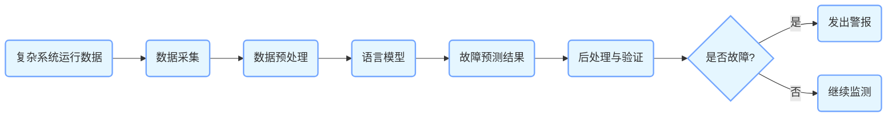

# 语言模型在复杂系统故障预测中的能力提升

> 关键词：语言模型、复杂系统、故障预测、能力提升、机器学习、深度学习、数据分析

> 摘要：本文聚焦于语言模型在复杂系统故障预测中的能力提升问题。首先介绍了研究的背景、目的、预期读者等内容，深入阐述了语言模型及复杂系统故障预测的核心概念与联系。详细讲解了相关核心算法原理并给出Python代码示例，通过数学模型和公式对其进行理论支持。接着通过项目实战展示代码实际案例及详细解释，探讨了语言模型在复杂系统故障预测中的实际应用场景。还推荐了相关的学习资源、开发工具框架以及论文著作。最后总结了未来发展趋势与挑战，并给出常见问题解答和参考资料，旨在全面深入地剖析如何提升语言模型在复杂系统故障预测中的能力。

## 1. 背景介绍 
### 1.1 目的和范围
随着现代科技的飞速发展，复杂系统在各个领域的应用日益广泛，如航空航天、电力系统、工业自动化等。这些复杂系统的正常运行对于保障生产生活的安全和高效至关重要。然而，复杂系统由于其结构复杂、组件众多、运行环境多变等特点，故障的发生具有不确定性和复杂性。准确预测复杂系统的故障，能够提前采取预防措施，减少故障带来的损失，提高系统的可靠性和稳定性。

语言模型作为人工智能领域的重要技术，近年来取得了显著的进展。它在自然语言处理、文本生成等方面表现出色。本研究的目的在于探索如何提升语言模型在复杂系统故障预测中的能力，使其能够更准确、更及时地预测故障的发生。研究范围涵盖了语言模型的基本原理、复杂系统故障预测的相关理论和方法，以及如何将语言模型应用于实际的复杂系统故障预测场景中。

### 1.2 预期读者
本文预期读者包括人工智能、机器学习、自动化控制等领域的研究人员和工程师，他们对语言模型和复杂系统故障预测有一定的了解，希望深入学习如何提升语言模型在故障预测中的能力。同时，也适合相关专业的研究生和高年级本科生，作为他们学习和研究的参考资料。

### 1.3 文档结构概述
本文共分为十个部分。第一部分为背景介绍，阐述研究的目的、范围、预期读者和文档结构概述，并给出术语表。第二部分介绍核心概念与联系，包括语言模型和复杂系统故障预测的原理和架构，并给出Mermaid流程图。第三部分讲解核心算法原理和具体操作步骤，通过Python源代码详细阐述。第四部分给出数学模型和公式，并进行详细讲解和举例说明。第五部分通过项目实战展示代码实际案例和详细解释说明。第六部分探讨实际应用场景。第七部分推荐工具和资源，包括学习资源、开发工具框架和相关论文著作。第八部分总结未来发展趋势与挑战。第九部分为附录，给出常见问题与解答。第十部分提供扩展阅读和参考资料。

### 1.4 术语表
#### 1.4.1 核心术语定义
- **语言模型**：是一种对自然语言进行建模的概率模型，用于预测一个句子或文本序列出现的概率。常见的语言模型包括基于统计的语言模型和基于深度学习的语言模型。
- **复杂系统**：由大量相互作用的组件组成，具有高度的非线性、不确定性和动态性的系统。例如，电力系统、交通系统、生态系统等。
- **故障预测**：根据系统的历史运行数据和当前状态，预测系统未来是否会发生故障以及故障发生的时间和类型。
- **机器学习**：是一门多领域交叉学科，涉及概率论、统计学、逼近论、凸分析、算法复杂度理论等多门学科。它专门研究计算机怎样模拟或实现人类的学习行为，以获取新的知识或技能，重新组织已有的知识结构使之不断改善自身的性能。
- **深度学习**：是机器学习的一个分支领域，它是一种基于对数据进行表征学习的方法。深度学习通过构建具有很多层的神经网络模型，自动从数据中学习特征和模式。

#### 1.4.2 相关概念解释
- **自然语言处理**：是计算机科学、人工智能和语言学的交叉领域，旨在让计算机理解、处理和生成自然语言。语言模型是自然语言处理中的重要工具。
- **数据挖掘**：是指从大量的数据中通过算法搜索隐藏于其中信息的过程。在复杂系统故障预测中，数据挖掘可以用于从系统的历史数据中发现故障模式和规律。
- **时间序列分析**：是一种统计方法，用于分析按时间顺序排列的数据序列。在复杂系统故障预测中，时间序列分析可以用于处理系统的实时运行数据，预测未来的状态。

#### 1.4.3 缩略词列表
- **NLP**：Natural Language Processing，自然语言处理
- **ML**：Machine Learning，机器学习
- **DL**：Deep Learning，深度学习
- **RNN**：Recurrent Neural Network，循环神经网络
- **LSTM**：Long Short - Term Memory，长短期记忆网络
- **GRU**：Gated Recurrent Unit，门控循环单元

## 2. 核心概念与联系 

### 2.1 语言模型原理
语言模型的基本任务是计算一个文本序列 $w_1, w_2, \cdots, w_n$ 出现的概率 $P(w_1, w_2, \cdots, w_n)$。根据链式法则，这个概率可以分解为：

$$P(w_1, w_2, \cdots, w_n) = P(w_1)P(w_2|w_1)P(w_3|w_1, w_2)\cdots P(w_n|w_1, w_2, \cdots, w_{n - 1})$$

基于统计的语言模型通过统计语料库中词语的共现频率来估计这些条件概率。例如，n - 元语法（n - gram）模型假设一个词的出现只依赖于它前面的 $n - 1$ 个词，即：

$$P(w_i|w_1, w_2, \cdots, w_{i - 1}) \approx P(w_i|w_{i - n + 1}, \cdots, w_{i - 1})$$

基于深度学习的语言模型，如循环神经网络（RNN）及其变体长短期记忆网络（LSTM）和门控循环单元（GRU），通过神经网络来学习文本序列的特征和模式，从而预测下一个词的概率。

### 2.2 复杂系统故障预测原理
复杂系统故障预测的基本思路是通过收集系统的历史运行数据，包括传感器数据、操作记录等，建立故障预测模型。这些数据可以看作是系统状态的表征。故障预测模型通过对历史数据的学习，发现系统正常运行和故障状态之间的模式和规律，从而对系统的未来状态进行预测。

常见的故障预测方法包括基于统计的方法、机器学习方法和深度学习方法。基于统计的方法如时间序列分析、回归分析等，通过对历史数据的统计分析来预测未来的状态。机器学习方法如决策树、支持向量机等，通过对数据进行分类和回归来预测故障的发生。深度学习方法如卷积神经网络（CNN）、循环神经网络（RNN）等，通过自动学习数据的特征和模式来提高故障预测的准确性。

### 2.3 语言模型与复杂系统故障预测的联系
语言模型和复杂系统故障预测看似是两个不同的领域，但实际上它们之间存在着紧密的联系。复杂系统的运行数据可以看作是一种特殊的“语言”，每个数据点可以看作是一个“词”，数据序列可以看作是一个“句子”。语言模型可以用于处理这种数据序列，学习其中的模式和规律，从而预测系统的故障。

例如，我们可以将系统的传感器数据按照时间顺序排列成一个序列，然后使用语言模型对这个序列进行建模。语言模型可以学习到不同传感器数据之间的关联和变化规律，当系统出现异常时，这些规律会发生变化，语言模型可以通过检测这些变化来预测故障的发生。

### 2.4 核心概念架构的文本示意图
语言模型与复杂系统故障预测的核心概念架构可以描述如下：

复杂系统的运行数据通过数据采集模块进行收集，然后经过数据预处理模块进行清洗、归一化等处理。处理后的数据输入到语言模型中，语言模型通过学习数据的特征和模式，输出对系统未来状态的预测。预测结果经过后处理模块进行评估和验证，如果预测到故障，则发出警报并采取相应的措施。

### 2.5 Mermaid 流程图


## 3. 核心算法原理 & 具体操作步骤 

### 3.1 基于 LSTM 的语言模型原理
长短期记忆网络（LSTM）是一种特殊的循环神经网络，它能够有效地处理长序列数据中的长期依赖问题。LSTM 单元由输入门、遗忘门、输出门和细胞状态组成。

遗忘门决定了上一时刻的细胞状态 $C_{t - 1}$ 有多少信息需要被遗忘：

$$f_t = \sigma(W_f[h_{t - 1}, x_t] + b_f)$$

输入门决定了当前输入 $x_t$ 有多少信息需要被加入到细胞状态中：

$$i_t = \sigma(W_i[h_{t - 1}, x_t] + b_i)$$

$$\tilde{C}_t = \tanh(W_C[h_{t - 1}, x_t] + b_C)$$

细胞状态的更新：

$$C_t = f_t \odot C_{t - 1} + i_t \odot \tilde{C}_t$$

输出门决定了当前细胞状态 $C_t$ 有多少信息需要被输出：

$$o_t = \sigma(W_o[h_{t - 1}, x_t] + b_o)$$

$$h_t = o_t \odot \tanh(C_t)$$

其中，$\sigma$ 是 sigmoid 函数，$\tanh$ 是双曲正切函数，$W$ 是权重矩阵，$b$ 是偏置向量，$\odot$ 表示逐元素相乘。

### 3.2 具体操作步骤
1. **数据准备**：收集复杂系统的历史运行数据，并进行清洗和预处理。将数据按照时间顺序排列成序列，划分训练集、验证集和测试集。
2. **模型构建**：使用深度学习框架（如 TensorFlow 或 PyTorch）构建 LSTM 语言模型。定义模型的层数、神经元数量等参数。
3. **模型训练**：使用训练集对模型进行训练，调整模型的参数，使模型的损失函数最小化。
4. **模型评估**：使用验证集和测试集对模型进行评估，计算模型的准确率、召回率等指标。
5. **故障预测**：使用训练好的模型对系统的实时运行数据进行预测，判断系统是否会发生故障。

### 3.3 Python 源代码详细阐述
以下是一个使用 PyTorch 实现基于 LSTM 的语言模型进行复杂系统故障预测的示例代码：

```python
import torch
import torch.nn as nn
import torch.optim as optim
import numpy as np
from sklearn.model_selection import train_test_split

# 定义 LSTM 模型
class LSTMModel(nn.Module):
    def __init__(self, input_size, hidden_size, num_layers, output_size):
        super(LSTMModel, self).__init__()
        self.hidden_size = hidden_size
        self.num_layers = num_layers
        self.lstm = nn.LSTM(input_size, hidden_size, num_layers, batch_first=True)
        self.fc = nn.Linear(hidden_size, output_size)

    def forward(self, x):
        h0 = torch.zeros(self.num_layers, x.size(0), self.hidden_size).to(x.device)
        c0 = torch.zeros(self.num_layers, x.size(0), self.hidden_size).to(x.device)
        out, _ = self.lstm(x, (h0, c0))
        out = self.fc(out[:, -1, :])
        return out

# 数据准备
# 假设我们有一个包含 1000 个样本的数据集，每个样本有 10 个特征
data = np.random.randn(1000, 10)
labels = np.random.randint(0, 2, 1000)

# 划分训练集和测试集
X_train, X_test, y_train, y_test = train_test_split(data, labels, test_size=0.2, random_state=42)

# 将数据转换为 PyTorch 张量
X_train = torch.FloatTensor(X_train).unsqueeze(1)
y_train = torch.LongTensor(y_train)
X_test = torch.FloatTensor(X_test).unsqueeze(1)
y_test = torch.LongTensor(y_test)

# 定义模型参数
input_size = 10
hidden_size = 32
num_layers = 2
output_size = 2

# 初始化模型
model = LSTMModel(input_size, hidden_size, num_layers, output_size)

# 定义损失函数和优化器
criterion = nn.CrossEntropyLoss()
optimizer = optim.Adam(model.parameters(), lr=0.001)

# 训练模型
num_epochs = 100
for epoch in range(num_epochs):
    outputs = model(X_train)
    loss = criterion(outputs, y_train)

    optimizer.zero_grad()
    loss.backward()
    optimizer.step()

    if (epoch + 1) % 10 == 0:
        print(f'Epoch [{epoch + 1}/{num_epochs}], Loss: {loss.item():.4f}')

# 评估模型
with torch.no_grad():
    outputs = model(X_test)
    _, predicted = torch.max(outputs.data, 1)
    accuracy = (predicted == y_test).sum().item() / y_test.size(0)
    print(f'Accuracy: {accuracy * 100:.2f}%')
```

## 4. 数学模型和公式 & 详细讲解 & 举例说明 

### 4.1 损失函数
在复杂系统故障预测中，常用的损失函数是交叉熵损失函数。对于一个二分类问题，交叉熵损失函数的定义如下：

$$L = -\frac{1}{N}\sum_{i = 1}^{N}[y_i\log(p_i)+(1 - y_i)\log(1 - p_i)]$$

其中，$N$ 是样本数量，$y_i$ 是第 $i$ 个样本的真实标签（0 或 1），$p_i$ 是模型对第 $i$ 个样本预测为正类的概率。

详细讲解：交叉熵损失函数衡量了模型预测的概率分布与真实标签的概率分布之间的差异。当模型的预测结果与真实标签完全一致时，损失函数的值为 0；当模型的预测结果与真实标签完全相反时，损失函数的值趋近于无穷大。因此，通过最小化交叉熵损失函数，可以使模型的预测结果尽可能接近真实标签。

举例说明：假设我们有一个二分类问题，有两个样本，真实标签分别为 $y_1 = 1$ 和 $y_2 = 0$，模型的预测概率分别为 $p_1 = 0.8$ 和 $p_2 = 0.2$。则交叉熵损失函数的值为：

$$L = -\frac{1}{2}[(1\times\log(0.8)+(1 - 1)\log(1 - 0.8))+(0\times\log(0.2)+(1 - 0)\log(1 - 0.2))]$$

$$L = -\frac{1}{2}[\log(0.8)+\log(0.8)] = -\log(0.8) \approx 0.223$$

### 4.2 评估指标
在复杂系统故障预测中，常用的评估指标包括准确率、召回率、F1 值等。

- **准确率（Accuracy）**：表示模型预测正确的样本数占总样本数的比例。

$$Accuracy=\frac{TP + TN}{TP + TN+FP + FN}$$

其中，$TP$ 是真正例（模型预测为正类且真实标签为正类）的数量，$TN$ 是真反例（模型预测为反类且真实标签为反类）的数量，$FP$ 是假正例（模型预测为正类但真实标签为反类）的数量，$FN$ 是假反例（模型预测为反类但真实标签为正类）的数量。

- **召回率（Recall）**：表示模型预测正确的正类样本数占真实正类样本数的比例。

$$Recall=\frac{TP}{TP + FN}$$

- **F1 值（F1 - score）**：是准确率和召回率的调和平均数，用于综合衡量模型的性能。

$$F1=\frac{2\times Accuracy\times Recall}{Accuracy + Recall}$$

详细讲解：准确率是一个直观的评估指标，但在不平衡数据集上可能会产生误导。例如，在一个故障预测问题中，故障样本的比例可能非常小，如果模型总是预测为非故障，准确率可能会很高，但实际上模型并没有真正预测出故障。召回率更关注模型对正类样本的预测能力，而 F1 值综合考虑了准确率和召回率，能够更全面地评估模型的性能。

举例说明：假设我们有一个故障预测问题，总样本数为 100，其中故障样本数为 10，非故障样本数为 90。模型预测出 8 个故障样本，其中 6 个是真正的故障样本，2 个是误判的。则：

$$TP = 6, TN = 88, FP = 2, FN = 4$$

$$Accuracy=\frac{6 + 88}{100}=0.94$$

$$Recall=\frac{6}{6 + 4}=0.6$$

$$F1=\frac{2\times0.94\times0.6}{0.94 + 0.6}\approx0.73$$

### 4.3 梯度下降算法
梯度下降算法是一种常用的优化算法，用于最小化损失函数。对于一个损失函数 $L(\theta)$，其中 $\theta$ 是模型的参数，梯度下降算法的更新公式如下：

$$\theta_{t + 1}=\theta_t-\alpha\nabla L(\theta_t)$$

其中，$\alpha$ 是学习率，$\nabla L(\theta_t)$ 是损失函数在 $\theta_t$ 处的梯度。

详细讲解：梯度下降算法的基本思想是沿着损失函数的负梯度方向更新模型的参数，使得损失函数的值不断减小。学习率 $\alpha$ 控制了每次更新的步长，如果学习率过大，可能会导致模型无法收敛；如果学习率过小，模型的收敛速度会很慢。

举例说明：假设我们有一个简单的损失函数 $L(\theta)=\theta^2$，其梯度为 $\nabla L(\theta)=2\theta$。初始参数 $\theta_0 = 1$，学习率 $\alpha = 0.1$。则第一次更新后的参数为：

$$\theta_1=\theta_0-\alpha\nabla L(\theta_0)=1 - 0.1\times2\times1 = 0.8$$

第二次更新后的参数为：

$$\theta_2=\theta_1-\alpha\nabla L(\theta_1)=0.8 - 0.1\times2\times0.8 = 0.64$$

随着更新次数的增加，$\theta$ 的值会逐渐趋近于 0，损失函数的值也会逐渐减小。

## 5. 项目实战：代码实际案例和详细解释说明 

### 5.1  开发环境搭建
本项目使用 Python 作为开发语言，需要安装以下库：
- **PyTorch**：用于构建和训练深度学习模型。
- **NumPy**：用于处理数值计算。
- **Scikit - learn**：用于数据预处理和模型评估。

可以使用以下命令安装这些库：

```sh
pip install torch numpy scikit-learn
```

### 5.2  源代码详细实现和代码解读
以下是一个完整的基于 LSTM 语言模型的复杂系统故障预测项目的源代码：

```python
import torch
import torch.nn as nn
import torch.optim as optim
import numpy as np
from sklearn.model_selection import train_test_split
from sklearn.preprocessing import StandardScaler
from sklearn.metrics import accuracy_score, recall_score, f1_score

# 定义 LSTM 模型
class LSTMModel(nn.Module):
    def __init__(self, input_size, hidden_size, num_layers, output_size):
        super(LSTMModel, self).__init__()
        self.hidden_size = hidden_size
        self.num_layers = num_layers
        self.lstm = nn.LSTM(input_size, hidden_size, num_layers, batch_first=True)
        self.fc = nn.Linear(hidden_size, output_size)

    def forward(self, x):
        h0 = torch.zeros(self.num_layers, x.size(0), self.hidden_size).to(x.device)
        c0 = torch.zeros(self.num_layers, x.size(0), self.hidden_size).to(x.device)
        out, _ = self.lstm(x, (h0, c0))
        out = self.fc(out[:, -1, :])
        return out

# 数据准备
# 假设我们有一个包含 1000 个样本的数据集，每个样本有 10 个特征
data = np.random.randn(1000, 10)
labels = np.random.randint(0, 2, 1000)

# 数据预处理
scaler = StandardScaler()
data = scaler.fit_transform(data)

# 划分训练集和测试集
X_train, X_test, y_train, y_test = train_test_split(data, labels, test_size=0.2, random_state=42)

# 将数据转换为 PyTorch 张量
X_train = torch.FloatTensor(X_train).unsqueeze(1)
y_train = torch.LongTensor(y_train)
X_test = torch.FloatTensor(X_test).unsqueeze(1)
y_test = torch.LongTensor(y_test)

# 定义模型参数
input_size = 10
hidden_size = 32
num_layers = 2
output_size = 2

# 初始化模型
model = LSTMModel(input_size, hidden_size, num_layers, output_size)

# 定义损失函数和优化器
criterion = nn.CrossEntropyLoss()
optimizer = optim.Adam(model.parameters(), lr=0.001)

# 训练模型
num_epochs = 100
for epoch in range(num_epochs):
    outputs = model(X_train)
    loss = criterion(outputs, y_train)

    optimizer.zero_grad()
    loss.backward()
    optimizer.step()

    if (epoch + 1) % 10 == 0:
        print(f'Epoch [{epoch + 1}/{num_epochs}], Loss: {loss.item():.4f}')

# 评估模型
with torch.no_grad():
    outputs = model(X_test)
    _, predicted = torch.max(outputs.data, 1)
    accuracy = accuracy_score(y_test, predicted)
    recall = recall_score(y_test, predicted)
    f1 = f1_score(y_test, predicted)
    print(f'Accuracy: {accuracy * 100:.2f}%')
    print(f'Recall: {recall * 100:.2f}%')
    print(f'F1 - score: {f1 * 100:.2f}%')
```

### 5.3  代码解读与分析
1. **数据准备**：首先生成一个包含 1000 个样本，每个样本有 10 个特征的随机数据集，并生成对应的标签。然后使用 `StandardScaler` 对数据进行标准化处理，使得数据的均值为 0，标准差为 1。最后将数据划分为训练集和测试集。
2. **模型定义**：定义了一个基于 LSTM 的语言模型 `LSTMModel`，包含一个 LSTM 层和一个全连接层。
3. **训练模型**：使用交叉熵损失函数和 Adam 优化器对模型进行训练，训练 100 个 epoch，每 10 个 epoch 打印一次损失值。
4. **评估模型**：使用测试集对模型进行评估，计算准确率、召回率和 F1 值，并打印评估结果。

通过这个项目实战，我们可以看到如何使用 LSTM 语言模型进行复杂系统故障预测，以及如何评估模型的性能。

## 6. 实际应用场景 

### 6.1 电力系统故障预测
在电力系统中，包含大量的发电机、变压器、输电线路等组件，这些组件的运行状态直接影响电力系统的安全和稳定。通过安装在各个组件上的传感器，可以实时收集电压、电流、温度等运行数据。将这些数据按照时间顺序排列成序列，使用语言模型对其进行建模，可以学习到电力系统正常运行和故障状态之间的模式和规律。当模型检测到数据序列的模式发生变化时，就可以预测可能的故障发生，提前采取维护措施，避免停电事故的发生。

### 6.2 航空航天系统故障预测
航空航天系统是一个高度复杂的系统，涉及到多个子系统和大量的设备。在飞行过程中，飞机的发动机、航电系统、液压系统等的运行状态至关重要。通过收集飞机的飞行数据、发动机参数、传感器数据等，使用语言模型进行故障预测，可以及时发现潜在的故障隐患，提高飞行安全性。例如，当发动机的振动数据、温度数据等出现异常变化时，语言模型可以快速识别并发出警报，提醒飞行员采取相应的措施。

### 6.3 工业自动化生产线故障预测
在工业自动化生产线中，包含多个生产设备和工艺流程。设备的故障可能会导致生产线停机，影响生产效率和产品质量。通过收集生产设备的运行数据，如电机转速、压力、流量等，使用语言模型进行故障预测，可以提前发现设备的故障趋势，安排维修计划，减少生产线的停机时间。例如，当某台设备的振动频率出现异常波动时，语言模型可以预测该设备可能即将发生故障，及时通知维修人员进行检查和维修。

### 6.4 医疗设备故障预测
医疗设备的正常运行对于患者的治疗和生命安全至关重要。例如，心脏起搏器、呼吸机等设备，如果出现故障可能会导致严重的后果。通过收集医疗设备的运行数据，如工作时间、参数设置、故障记录等，使用语言模型进行故障预测，可以提前发现设备的潜在故障，及时进行维护和更换，确保医疗设备的可靠性和安全性。

## 7. 工具和资源推荐
### 7.1 学习资源推荐
#### 7.1.1 书籍推荐
- 《深度学习》（Deep Learning）：由 Ian Goodfellow、Yoshua Bengio 和 Aaron Courville 合著，是深度学习领域的经典教材，全面介绍了深度学习的基本原理、算法和应用。
- 《Python 深度学习》（Deep Learning with Python）：由 Francois Chollet 著，通过大量的代码示例和实际案例，介绍了如何使用 Python 和 Keras 进行深度学习开发。
- 《自然语言处理入门》：由何晗著，系统介绍了自然语言处理的基本概念、方法和技术，适合初学者学习。

#### 7.1.2 在线课程
- Coursera 上的“深度学习专项课程”（Deep Learning Specialization）：由 Andrew Ng 教授授课，包括神经网络和深度学习、改善深层神经网络、结构化机器学习项目、卷积神经网络、序列模型等多个课程，全面覆盖深度学习的各个方面。
- edX 上的“自然语言处理”（Natural Language Processing）：由哥伦比亚大学的教授授课，介绍了自然语言处理的基本原理和算法，以及如何使用 Python 进行自然语言处理任务。
- 哔哩哔哩（B 站）上有很多关于深度学习和自然语言处理的教程视频，如“李宏毅机器学习”系列视频，讲解生动易懂，适合初学者学习。

#### 7.1.3 技术博客和网站
- Medium：是一个技术博客平台，上面有很多关于人工智能、深度学习、自然语言处理等领域的优秀文章，作者来自世界各地的专业人士和研究人员。
- arXiv：是一个预印本数据库，收录了大量的学术论文，包括人工智能、机器学习、计算机科学等领域的最新研究成果。
- 机器之心：是一个专注于人工智能领域的科技媒体，提供人工智能的最新资讯、技术文章、研究报告等内容。

### 7.2 开发工具框架推荐
#### 7.2.1 IDE和编辑器
- PyCharm：是一款专门为 Python 开发设计的集成开发环境（IDE），具有代码自动补全、调试、版本控制等功能，适合专业的 Python 开发者使用。
- Jupyter Notebook：是一个交互式的开发环境，支持 Python、R 等多种编程语言。它可以将代码、文本、图表等内容整合在一个文档中，方便进行数据分析和模型开发。
- Visual Studio Code：是一款轻量级的代码编辑器，支持多种编程语言和插件扩展。它具有丰富的插件生态系统，可以方便地进行 Python 开发。

#### 7.2.2 调试和性能分析工具
- PyTorch Profiler：是 PyTorch 提供的性能分析工具，可以帮助开发者分析模型的性能瓶颈，优化模型的训练和推理速度。
- TensorBoard：是 TensorFlow 提供的可视化工具，可以帮助开发者可视化模型的训练过程、损失函数、准确率等指标，方便进行模型调试和优化。
- cProfile：是 Python 内置的性能分析工具，可以帮助开发者分析 Python 代码的性能瓶颈，找出耗时较长的函数和代码段。

#### 7.2.3 相关框架和库
- PyTorch：是一个开源的深度学习框架，具有动态图、自动求导等特性，方便开发者进行模型开发和训练。
- TensorFlow：是另一个广泛使用的开源深度学习框架，具有强大的分布式训练和部署能力，适合大规模的深度学习应用。
- Transformers：是 Hugging Face 开发的一个自然语言处理库，提供了大量的预训练语言模型，如 BERT、GPT - 2 等，方便开发者进行自然语言处理任务。

### 7.3 相关论文著作推荐
#### 7.3.1 经典论文
- “Long Short - Term Memory”：由 Sepp Hochreiter 和 Jürgen Schmidhuber 发表，介绍了长短期记忆网络（LSTM）的基本原理和结构，是深度学习领域的经典论文之一。
- “Attention Is All You Need”：由 Ashish Vaswani 等人发表，提出了 Transformer 模型，是自然语言处理领域的重要突破，为后续的预训练语言模型奠定了基础。
- “Deep Residual Learning for Image Recognition”：由 Kaiming He 等人发表，提出了残差网络（ResNet），解决了深度学习中的梯度消失和梯度爆炸问题，提高了模型的训练效率和性能。

#### 7.3.2 最新研究成果
- 在 arXiv 上可以找到很多关于语言模型和复杂系统故障预测的最新研究成果。例如，一些研究尝试将预训练语言模型应用于复杂系统故障预测中，通过迁移学习提高模型的性能；另一些研究则探索了如何结合多种数据源和特征工程方法，提高故障预测的准确性。
- 国际顶级学术会议，如 NeurIPS（神经信息处理系统大会）、ICML（国际机器学习会议）、ACL（计算语言学协会年会）等，会收录很多相关领域的最新研究论文。

#### 7.3.3 应用案例分析
- 一些工业界的案例分析报告可以帮助我们了解语言模型在实际复杂系统故障预测中的应用情况。例如，一些电力公司、航空公司等会发布关于故障预测系统的应用案例，介绍他们如何使用人工智能技术提高系统的可靠性和安全性。
- 一些开源项目也提供了相关的应用案例，如一些基于工业物联网平台的故障预测项目，展示了如何使用语言模型处理传感器数据，实现故障预测功能。

## 8. 总结：未来发展趋势与挑战
### 8.1 未来发展趋势
- **多模态融合**：未来的语言模型在复杂系统故障预测中可能会融合多种模态的数据，如文本、图像、音频、传感器数据等。通过多模态融合，可以更全面地获取系统的状态信息，提高故障预测的准确性。例如，在电力系统故障预测中，除了传感器数据外，还可以结合设备的图像信息，检测设备的外观是否有损坏。
- **预训练语言模型的应用**：预训练语言模型在自然语言处理领域取得了巨大的成功，未来可能会被广泛应用于复杂系统故障预测中。通过迁移学习，将预训练语言模型的知识迁移到故障预测任务中，可以减少模型的训练时间和数据需求，提高模型的性能。
- **实时在线学习**：随着复杂系统的实时性要求越来越高，未来的语言模型需要具备实时在线学习的能力。能够根据系统的实时运行数据不断更新模型的参数，及时发现新的故障模式和规律，提高故障预测的及时性和准确性。
- **人机协作**：未来的故障预测系统可能会实现人机协作，语言模型可以为人类专家提供故障预测的建议和参考，人类专家可以根据自己的经验和知识对模型的预测结果进行验证和修正。通过人机协作，可以充分发挥人类和机器的优势，提高故障预测的可靠性。

### 8.2 挑战
- **数据质量和隐私问题**：复杂系统的运行数据往往来自不同的数据源，数据质量参差不齐。同时，一些数据可能涉及到隐私和安全问题，如医疗设备的运行数据、航空航天系统的敏感数据等。如何保证数据的质量和隐私安全，是语言模型在复杂系统故障预测中面临的一个重要挑战。
- **模型可解释性**：深度学习模型，特别是基于神经网络的语言模型，往往是一个黑盒模型，难以解释模型的决策过程和预测结果。在复杂系统故障预测中，模型的可解释性非常重要，因为人类需要理解模型为什么做出这样的预测，以便采取相应的措施。如何提高模型的可解释性，是未来研究的一个重要方向。
- **复杂系统的动态性和不确定性**：复杂系统具有高度的动态性和不确定性，系统的运行状态会随着时间和环境的变化而变化。语言模型需要能够适应这种动态性和不确定性，及时调整模型的参数和结构，以保证故障预测的准确性。
- **计算资源和效率问题**：语言模型，特别是大规模的预训练语言模型，需要大量的计算资源和时间进行训练和推理。在实际应用中，如何在有限的计算资源下提高模型的训练和推理效率，是一个亟待解决的问题。

## 9. 附录：常见问题与解答
### 9.1 问题：语言模型在复杂系统故障预测中的优势是什么？
解答：语言模型可以学习到复杂系统运行数据中的模式和规律，能够处理序列数据，捕捉数据之间的时间依赖关系。通过对大量历史数据的学习，语言模型可以发现人类难以察觉的故障模式，提高故障预测的准确性。同时，语言模型具有一定的泛化能力，可以适应不同的复杂系统和故障场景。

### 9.2 问题：如何选择合适的语言模型用于复杂系统故障预测？
解答：选择合适的语言模型需要考虑多个因素，如数据的特点、系统的复杂性、计算资源等。如果数据是时间序列数据，且需要处理长期依赖关系，可以选择基于 RNN、LSTM 或 GRU 的语言模型。如果数据量较大，可以考虑使用预训练语言模型，通过迁移学习来提高模型的性能。同时，还需要根据计算资源的情况选择合适的模型规模，避免计算资源不足导致训练和推理速度过慢。

### 9.3 问题：如何处理复杂系统故障预测中的不平衡数据集？
解答：在复杂系统故障预测中，故障样本的比例往往较小，导致数据集不平衡。处理不平衡数据集的方法有很多，如数据增强、采样方法（过采样、欠采样）、调整损失函数等。数据增强可以通过对故障样本进行变换和扩充来增加故障样本的数量。过采样可以复制故障样本，欠采样可以减少非故障样本的数量。调整损失函数可以增加故障样本的权重，使得模型更加关注故障样本的分类。

### 9.4 问题：如何评估语言模型在复杂系统故障预测中的性能？
解答：评估语言模型在复杂系统故障预测中的性能可以使用多种指标，如准确率、召回率、F1 值、ROC 曲线、AUC 值等。准确率可以反映模型预测正确的样本数占总样本数的比例，但在不平衡数据集上可能会产生误导。召回率可以反映模型对故障样本的预测能力，F1 值综合考虑了准确率和召回率。ROC 曲线和 AUC 值可以直观地展示模型的分类性能。同时，还可以结合实际应用场景，考虑模型的预测及时性、误报率等指标。

### 9.5 问题：语言模型在复杂系统故障预测中的应用有哪些局限性？
解答：语言模型在复杂系统故障预测中的应用存在一些局限性。首先，语言模型是基于历史数据进行学习的，如果系统出现了新的故障模式或情况，模型可能无法准确预测。其次，语言模型的可解释性较差，难以解释模型的决策过程和预测结果，这在一些对安全性要求较高的领域可能会受到限制。此外，语言模型的训练和推理需要大量的计算资源和时间，对于一些实时性要求较高的应用场景，可能无法满足需求。

## 10. 扩展阅读 & 参考资料
### 10.1 扩展阅读
- 《人工智能：一种现代的方法》（Artificial Intelligence: A Modern Approach）：全面介绍了人工智能的基本概念、方法和技术，是人工智能领域的经典教材。
- 《统计学习方法》：由李航著，系统介绍了统计学习的基本理论和方法，包括感知机、支持向量机、决策树等，适合深入学习机器学习的读者阅读。
- 《神经网络与深度学习》：由邱锡鹏著，详细介绍了神经网络和深度学习的基本原理、算法和应用，是深度学习领域的优秀教材。

### 10.2 参考资料
- 相关学术论文：在学术数据库，如 IEEE Xplore、ACM Digital Library、ScienceDirect 等，可以查找关于语言模型、复杂系统故障预测等领域的学术论文，了解最新的研究成果和技术方法。
- 开源项目：在 GitHub 等开源代码托管平台上，可以找到很多关于语言模型和复杂系统故障预测的开源项目，学习和参考他人的代码实现和实践经验。
- 行业报告：一些行业组织和研究机构会发布关于复杂系统故障预测的行业报告，分析行业的发展趋势、应用案例和技术挑战等，为我们的研究和实践提供参考。