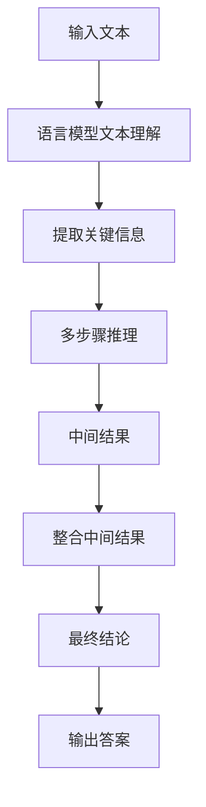

# 语言模型在多步骤推理任务中的表现提升

> 关键词：语言模型、多步骤推理任务、表现提升、推理机制、自然语言处理

> 摘要：本文聚焦于语言模型在多步骤推理任务中的表现提升这一核心主题。首先介绍了相关背景知识，包括目的、预期读者、文档结构等。接着阐述了语言模型和多步骤推理任务的核心概念及联系，通过文本示意图和 Mermaid 流程图进行直观展示。详细讲解了核心算法原理和具体操作步骤，并给出 Python 源代码示例。对涉及的数学模型和公式进行深入分析，辅以举例说明。通过项目实战，从开发环境搭建到源代码实现和解读，全面展示如何提升语言模型在多步骤推理任务中的性能。探讨了实际应用场景，推荐了相关的学习资源、开发工具框架以及论文著作。最后总结了未来发展趋势与挑战，提供常见问题解答和扩展阅读参考资料，旨在为研究者和开发者在该领域的探索提供全面而深入的指导。

## 1. 背景介绍 
### 1.1 目的和范围
在自然语言处理（NLP）领域，语言模型的发展取得了显著成就。然而，在处理多步骤推理任务时，现有的语言模型仍面临诸多挑战，如推理过程不准确、逻辑不连贯等。本文章的目的在于深入探讨如何提升语言模型在多步骤推理任务中的表现，通过研究相关理论、算法和技术，为解决实际问题提供有效的方法和策略。范围涵盖了从语言模型的基本原理到多步骤推理任务的具体实现，涉及算法优化、模型训练、实际应用等多个方面。

### 1.2 预期读者
本文预期读者包括自然语言处理领域的研究者、人工智能和机器学习的开发者、相关专业的学生以及对语言模型和多步骤推理任务感兴趣的技术爱好者。无论是希望深入了解该领域理论知识的学者，还是想要在实际项目中应用相关技术的开发者，都能从本文中获得有价值的信息。

### 1.3 文档结构概述
本文将按照以下结构展开：首先介绍语言模型和多步骤推理任务的背景知识，包括相关术语和概念；接着阐述核心概念与联系，通过示意图和流程图进行直观展示；详细讲解核心算法原理和具体操作步骤，并给出 Python 代码示例；对涉及的数学模型和公式进行深入分析和举例说明；通过项目实战展示如何提升语言模型在多步骤推理任务中的性能；探讨实际应用场景；推荐相关的学习资源、开发工具框架和论文著作；最后总结未来发展趋势与挑战，提供常见问题解答和扩展阅读参考资料。

### 1.4 术语表
#### 1.4.1 核心术语定义
- **语言模型**：是一种对自然语言文本进行概率建模的模型，用于预测文本中下一个词或字符的概率分布。常见的语言模型包括循环神经网络（RNN）、长短期记忆网络（LSTM）、门控循环单元（GRU）以及基于 Transformer 架构的模型，如 BERT、GPT 等。
- **多步骤推理任务**：指需要经过多个步骤的逻辑推理才能得出最终答案的自然语言处理任务，例如数学问题求解、逻辑谜题解答、复杂文本理解等。这些任务通常涉及多个前提条件和推理规则，需要语言模型能够逐步推导和整合信息。
- **推理机制**：是语言模型在处理多步骤推理任务时所采用的方法和策略，包括如何根据输入信息进行推理、如何处理中间结果以及如何得出最终结论等。

#### 1.4.2 相关概念解释
- **注意力机制**：是一种在自然语言处理中广泛应用的技术，用于捕捉文本中不同位置之间的相关性。通过注意力机制，语言模型可以更加聚焦于重要的信息，提高推理的准确性。
- **强化学习**：是一种机器学习方法，通过智能体与环境的交互来学习最优策略。在语言模型的多步骤推理任务中，可以使用强化学习来优化推理过程，提高模型的性能。

#### 1.4.3 缩略词列表
- **NLP**：Natural Language Processing，自然语言处理
- **RNN**：Recurrent Neural Network，循环神经网络
- **LSTM**：Long Short-Term Memory，长短期记忆网络
- **GRU**：Gated Recurrent Unit，门控循环单元
- **GPT**：Generative Pretrained Transformer，生成式预训练 Transformer
- **BERT**：Bidirectional Encoder Representations from Transformers，基于 Transformer 的双向编码器表示

## 2. 核心概念与联系 
### 语言模型概述
语言模型是自然语言处理中的核心组件，其主要目标是学习自然语言的统计规律，从而能够对文本进行预测和生成。传统的语言模型基于统计方法，如 n-gram 模型，通过计算文本中相邻 n 个词的共现概率来进行预测。然而，这种方法存在数据稀疏和长距离依赖的问题。

随着深度学习的发展，基于神经网络的语言模型逐渐成为主流。循环神经网络（RNN）及其变体 LSTM 和 GRU 能够处理序列数据，通过递归的方式捕捉文本中的上下文信息。但 RNN 仍然存在梯度消失和梯度爆炸的问题，难以处理长序列。

基于 Transformer 架构的语言模型，如 BERT 和 GPT，通过自注意力机制能够有效地捕捉文本中不同位置之间的依赖关系，大大提高了语言模型的性能。这些模型通常采用预训练 - 微调的方式，在大规模无监督数据上进行预训练，然后在特定任务上进行微调。

### 多步骤推理任务的特点
多步骤推理任务与普通的自然语言处理任务不同，它需要语言模型能够进行复杂的逻辑推理。这些任务通常具有以下特点：
- **多个前提条件**：需要语言模型同时考虑多个相关的信息，才能进行正确的推理。
- **推理步骤的顺序性**：推理过程通常是按照一定的顺序进行的，前一个步骤的结果可能会影响后续的推理。
- **逻辑复杂性**：可能涉及多种逻辑关系，如因果关系、条件关系、比较关系等。

### 语言模型与多步骤推理任务的联系
语言模型为多步骤推理任务提供了基础的文本处理能力，能够理解和生成自然语言文本。然而，要在多步骤推理任务中取得良好的表现，语言模型需要具备以下能力：
- **逻辑推理能力**：能够根据输入的前提条件进行合理的推理，得出中间结果和最终结论。
- **信息整合能力**：能够将多个前提条件和中间结果进行整合，形成完整的推理链条。
- **上下文感知能力**：能够理解文本的上下文信息，根据不同的语境进行推理。

### 文本示意图
语言模型在多步骤推理任务中的工作流程可以用以下文本示意图表示：

输入文本（包含多个前提条件） -> 语言模型进行文本理解 -> 提取关键信息 -> 基于推理机制进行多步骤推理 -> 得出中间结果 -> 整合中间结果 -> 得出最终结论 -> 输出答案

### Mermaid 流程图


## 3. 核心算法原理 & 具体操作步骤 
### 基于强化学习的推理优化算法
强化学习是一种通过智能体与环境的交互来学习最优策略的方法。在语言模型的多步骤推理任务中，可以将推理过程看作是智能体在环境中的一系列决策过程。智能体的目标是通过不断地尝试和学习，找到最优的推理策略，使得最终的推理结果最接近正确答案。

#### 算法原理
强化学习的核心是定义智能体的状态、动作和奖励函数。在多步骤推理任务中，状态可以表示为当前的推理进度和已有的中间结果，动作可以表示为下一步的推理操作，奖励函数可以根据最终的推理结果与正确答案的相似度来定义。

智能体通过与环境的交互，不断地选择动作并接收奖励反馈。根据奖励反馈，智能体可以更新自己的策略，使得在未来的推理过程中能够选择更优的动作。

#### 具体操作步骤
1. **定义状态**：状态可以用一个向量来表示，包含当前的推理步骤、已有的中间结果和剩余的前提条件等信息。
2. **定义动作**：动作可以表示为不同的推理规则或操作，如应用某个逻辑规则、查询某个知识库等。
3. **定义奖励函数**：奖励函数可以根据最终的推理结果与正确答案的相似度来计算。如果推理结果正确，则给予正奖励；如果推理结果错误，则给予负奖励。
4. **初始化智能体策略**：可以使用随机策略或基于启发式的策略来初始化智能体。
5. **智能体与环境交互**：智能体根据当前状态选择动作，环境根据动作给出奖励反馈和下一个状态。
6. **更新智能体策略**：根据奖励反馈，使用强化学习算法（如 Q-learning、Policy Gradient 等）更新智能体的策略。
7. **重复步骤 5 和 6**：直到智能体的策略收敛或达到预定的训练次数。

#### Python 源代码示例
```python
import numpy as np

# 定义状态空间和动作空间
state_space_size = 10
action_space_size = 5

# 初始化 Q 表
q_table = np.zeros((state_space_size, action_space_size))

# 定义超参数
learning_rate = 0.1
discount_factor = 0.9
epsilon = 0.1
num_episodes = 1000

# 定义环境交互函数
def env_step(state, action):
    # 这里简单模拟环境的反馈，实际应用中需要根据具体任务实现
    next_state = np.random.randint(0, state_space_size)
    reward = np.random.randint(-1, 2)
    return next_state, reward

# 训练智能体
for episode in range(num_episodes):
    state = np.random.randint(0, state_space_size)
    done = False
    while not done:
        if np.random.uniform(0, 1) < epsilon:
            action = np.random.randint(0, action_space_size)
        else:
            action = np.argmax(q_table[state, :])
        
        next_state, reward = env_step(state, action)
        
        # 更新 Q 表
        q_table[state, action] = q_table[state, action] + learning_rate * (reward + discount_factor * np.max(q_table[next_state, :]) - q_table[state, action])
        
        state = next_state
        
        if np.random.uniform(0, 1) < 0.1:
            done = True
```

### 基于注意力机制的信息整合算法
注意力机制可以帮助语言模型更好地捕捉文本中不同位置之间的相关性，从而提高信息整合的能力。在多步骤推理任务中，注意力机制可以用于聚焦于重要的前提条件和中间结果，提高推理的准确性。

#### 算法原理
注意力机制通过计算输入序列中每个元素与其他元素之间的相关性，得到一个注意力分布。然后，根据注意力分布对输入序列进行加权求和，得到一个加权表示。在多步骤推理任务中，可以使用多头注意力机制来捕捉不同类型的相关性。

#### 具体操作步骤
1. **计算注意力分数**：对于输入序列中的每个元素，计算其与其他元素之间的相关性分数。可以使用点积注意力、加性注意力等方法来计算分数。
2. **计算注意力分布**：将注意力分数通过 softmax 函数进行归一化，得到注意力分布。
3. **加权求和**：根据注意力分布对输入序列进行加权求和，得到加权表示。
4. **多头注意力**：可以使用多个注意力头来捕捉不同类型的相关性，然后将多个头的输出进行拼接和线性变换。

#### Python 源代码示例
```python
import torch
import torch.nn as nn

class MultiHeadAttention(nn.Module):
    def __init__(self, input_dim, num_heads):
        super(MultiHeadAttention, self).__init__()
        self.input_dim = input_dim
        self.num_heads = num_heads
        self.head_dim = input_dim // num_heads
        
        self.query = nn.Linear(input_dim, input_dim)
        self.key = nn.Linear(input_dim, input_dim)
        self.value = nn.Linear(input_dim, input_dim)
        self.out = nn.Linear(input_dim, input_dim)
        
    def forward(self, x):
        batch_size = x.size(0)
        
        Q = self.query(x)
        K = self.key(x)
        V = self.value(x)
        
        Q = Q.view(batch_size, -1, self.num_heads, self.head_dim).transpose(1, 2)
        K = K.view(batch_size, -1, self.num_heads, self.head_dim).transpose(1, 2)
        V = V.view(batch_size, -1, self.num_heads, self.head_dim).transpose(1, 2)
        
        scores = torch.matmul(Q, K.transpose(-2, -1)) / (self.head_dim ** 0.5)
        attention = torch.softmax(scores, dim=-1)
        
        out = torch.matmul(attention, V)
        out = out.transpose(1, 2).contiguous().view(batch_size, -1, self.input_dim)
        out = self.out(out)
        
        return out
```

## 4. 数学模型和公式 & 详细讲解 & 举例说明 
### 强化学习的数学模型
强化学习的数学模型可以用马尔可夫决策过程（MDP）来描述。MDP 是一个五元组 $(S, A, P, R, \gamma)$，其中：
- $S$ 是状态空间，表示智能体可能处于的所有状态。
- $A$ 是动作空间，表示智能体可以采取的所有动作。
- $P(s'|s, a)$ 是状态转移概率，表示在状态 $s$ 采取动作 $a$ 后转移到状态 $s'$ 的概率。
- $R(s, a, s')$ 是奖励函数，表示在状态 $s$ 采取动作 $a$ 转移到状态 $s'$ 后获得的奖励。
- $\gamma$ 是折扣因子，用于平衡即时奖励和未来奖励的重要性。

智能体的目标是找到一个最优策略 $\pi^*(s)$，使得长期累积奖励的期望最大：
$$
V^*(s) = \max_{\pi} \mathbb{E}\left[\sum_{t=0}^{\infty} \gamma^t R(s_t, a_t, s_{t+1}) | s_0 = s, \pi\right]
$$
其中 $V^*(s)$ 是最优状态价值函数，表示在状态 $s$ 下采取最优策略时的长期累积奖励的期望。

### Q-learning 算法的数学公式
Q-learning 是一种基于值函数的强化学习算法，通过更新 Q 表来学习最优策略。Q 表 $Q(s, a)$ 表示在状态 $s$ 采取动作 $a$ 时的期望累积奖励。

Q-learning 的更新公式为：
$$
Q(s_t, a_t) \leftarrow Q(s_t, a_t) + \alpha \left[R(s_t, a_t, s_{t+1}) + \gamma \max_{a} Q(s_{t+1}, a) - Q(s_t, a_t)\right]
$$
其中 $\alpha$ 是学习率，控制每次更新的步长。

### 举例说明
假设我们有一个简单的多步骤推理任务，智能体需要在一个二维网格中找到目标位置。状态可以表示为智能体在网格中的坐标，动作可以表示为上下左右四个方向的移动。奖励函数可以定义为：如果智能体到达目标位置，则给予正奖励；如果智能体撞到墙壁，则给予负奖励。

初始时，Q 表中的所有值都为 0。智能体根据当前状态选择动作，根据动作更新状态并获得奖励。然后，根据 Q-learning 的更新公式更新 Q 表。随着训练的进行，Q 表中的值会逐渐收敛到最优值，智能体也会学习到最优的移动策略。

### 注意力机制的数学模型
注意力机制的核心是计算注意力分数和注意力分布。对于输入序列 $x = [x_1, x_2, \cdots, x_n]$，其中 $x_i \in \mathbb{R}^d$，注意力分数可以通过以下公式计算：
$$
e_{ij} = \text{score}(x_i, x_j)
$$
其中 $\text{score}$ 可以是点积注意力、加性注意力等函数。

注意力分布可以通过 softmax 函数计算：
$$
\alpha_{ij} = \frac{\exp(e_{ij})}{\sum_{k=1}^{n} \exp(e_{ik})}
$$

加权表示可以通过以下公式计算：
$$
\mathbf{c}_i = \sum_{j=1}^{n} \alpha_{ij} x_j
$$

### 多头注意力的数学公式
多头注意力通过多个注意力头来捕捉不同类型的相关性。对于输入序列 $x$，多头注意力的输出可以表示为：
$$
\text{MultiHead}(Q, K, V) = \text{Concat}(\text{head}_1, \cdots, \text{head}_h) W^O
$$
其中 $\text{head}_i = \text{Attention}(QW_i^Q, KW_i^K, VW_i^V)$，$W_i^Q, W_i^K, W_i^V$ 是线性变换矩阵，$W^O$ 是输出的线性变换矩阵。

### 举例说明
假设我们有一个文本序列 $x = [\text{"The"}, \text{"cat"}, \text{"runs"}]$，每个词的向量表示为 10 维。我们使用 2 个注意力头，每个头的维度为 5 维。通过计算注意力分数和注意力分布，我们可以得到每个词的加权表示。最后，将两个头的输出进行拼接和线性变换，得到多头注意力的输出。

## 5. 项目实战：代码实际案例和详细解释说明 
### 5.1  开发环境搭建
#### 硬件环境
- 处理器：Intel Core i7 及以上
- 内存：16GB 及以上
- 显卡：NVIDIA GPU（如 GeForce GTX 1080 及以上）

#### 软件环境
- 操作系统：Ubuntu 18.04 及以上或 Windows 10
- Python 版本：3.7 及以上
- 深度学习框架：PyTorch 1.7 及以上

#### 安装依赖库
```bash
pip install torch torchvision numpy pandas tqdm
```

### 5.2  源代码详细实现和代码解读
#### 数据集准备
我们使用一个简单的数学推理任务数据集，包含多个数学问题和对应的答案。数据集的格式为 CSV 文件，包含两列：问题和答案。

```python
import pandas as pd

# 读取数据集
data = pd.read_csv('math_dataset.csv')
questions = data['question'].tolist()
answers = data['answer'].tolist()
```

#### 数据预处理
对问题和答案进行分词和编码，将其转换为模型可以处理的格式。

```python
from torch.utils.data import Dataset, DataLoader
from transformers import AutoTokenizer

# 加载预训练的分词器
tokenizer = AutoTokenizer.from_pretrained('bert-base-uncased')

class MathDataset(Dataset):
    def __init__(self, questions, answers, tokenizer, max_length):
        self.questions = questions
        self.answers = answers
        self.tokenizer = tokenizer
        self.max_length = max_length
        
    def __len__(self):
        return len(self.questions)
    
    def __getitem__(self, idx):
        question = self.questions[idx]
        answer = self.answers[idx]
        
        encoding = self.tokenizer(question, return_tensors='pt', padding='max_length', truncation=True, max_length=self.max_length)
        input_ids = encoding['input_ids'].flatten()
        attention_mask = encoding['attention_mask'].flatten()
        
        answer_encoding = self.tokenizer(answer, return_tensors='pt', padding='max_length', truncation=True, max_length=self.max_length)
        answer_ids = answer_encoding['input_ids'].flatten()
        
        return {
            'input_ids': input_ids,
            'attention_mask': attention_mask,
            'answer_ids': answer_ids
        }

# 创建数据集和数据加载器
max_length = 128
dataset = MathDataset(questions, answers, tokenizer, max_length)
dataloader = DataLoader(dataset, batch_size=16, shuffle=True)
```

#### 模型定义
我们使用基于 BERT 的模型，并在其基础上添加一个全连接层来输出答案。

```python
from transformers import AutoModel
import torch.nn as nn

class MathModel(nn.Module):
    def __init__(self, model_name):
        super(MathModel, self).__init__()
        self.bert = AutoModel.from_pretrained(model_name)
        self.fc = nn.Linear(self.bert.config.hidden_size, max_length)
        
    def forward(self, input_ids, attention_mask):
        outputs = self.bert(input_ids=input_ids, attention_mask=attention_mask)
        last_hidden_state = outputs.last_hidden_state
        pooled_output = last_hidden_state[:, 0, :]
        logits = self.fc(pooled_output)
        return logits
```

#### 训练模型
使用交叉熵损失函数和 Adam 优化器来训练模型。

```python
import torch.optim as optim
from tqdm import tqdm

# 初始化模型
model = MathModel('bert-base-uncased')

# 定义损失函数和优化器
criterion = nn.CrossEntropyLoss()
optimizer = optim.Adam(model.parameters(), lr=1e-5)

# 训练模型
num_epochs = 10
device = torch.device('cuda' if torch.cuda.is_available() else 'cpu')
model.to(device)

for epoch in range(num_epochs):
    running_loss = 0.0
    for batch in tqdm(dataloader):
        input_ids = batch['input_ids'].to(device)
        attention_mask = batch['attention_mask'].to(device)
        answer_ids = batch['answer_ids'].to(device)
        
        optimizer.zero_grad()
        
        logits = model(input_ids, attention_mask)
        loss = criterion(logits, answer_ids)
        
        loss.backward()
        optimizer.step()
        
        running_loss += loss.item()
    
    print(f'Epoch {epoch+1}/{num_epochs}, Loss: {running_loss/len(dataloader)}')
```

### 5.3  代码解读与分析
#### 数据集准备
使用 Pandas 库读取 CSV 文件，将问题和答案分别存储在列表中。

#### 数据预处理
使用预训练的 BERT 分词器对问题和答案进行分词和编码，将其转换为模型可以处理的输入格式。创建自定义的数据集类 `MathDataset`，并使用 `DataLoader` 进行批量加载。

#### 模型定义
基于 BERT 模型，添加一个全连接层来输出答案。`forward` 方法定义了模型的前向传播过程，首先通过 BERT 模型获取最后一层的隐藏状态，然后取第一个位置的向量作为池化输出，最后通过全连接层得到预测的答案。

#### 训练模型
使用交叉熵损失函数计算预测答案和真实答案之间的损失，使用 Adam 优化器更新模型的参数。在每个 epoch 中，遍历数据加载器中的所有批次，进行前向传播、计算损失、反向传播和参数更新。

## 6. 实际应用场景 
### 智能客服
在智能客服系统中，用户的问题往往需要经过多步骤的推理才能得到准确的答案。例如，用户咨询某产品的价格、优惠活动和购买流程等问题，智能客服需要根据用户的问题和历史对话记录进行多步骤推理，才能提供全面而准确的回答。通过提升语言模型在多步骤推理任务中的表现，可以提高智能客服的服务质量和用户满意度。

### 智能教育
在智能教育领域，语言模型可以用于辅助学生解决复杂的数学问题、逻辑推理题等。通过多步骤推理，语言模型可以逐步引导学生思考，提供详细的解题思路和步骤。例如，在数学解题中，语言模型可以分析题目条件，推导中间步骤，最终得出正确答案，并向学生解释推理过程，帮助学生更好地理解和掌握知识。

### 金融风险评估
在金融领域，风险评估需要综合考虑多个因素，进行多步骤的推理和分析。语言模型可以处理大量的金融文本数据，如新闻报道、公司财报等，通过多步骤推理来评估金融风险。例如，分析公司的财务状况、市场趋势、行业竞争等因素，预测公司的违约风险，为投资者和金融机构提供决策支持。

### 法律智能助手
在法律领域，律师需要处理复杂的法律条文和案例，进行多步骤的推理和分析。语言模型可以作为法律智能助手，帮助律师理解法律条文、分析案例、进行法律推理。例如，根据案件的事实和相关法律条文，推理出可能的法律后果和解决方案，提高律师的工作效率和准确性。

## 7. 工具和资源推荐
### 7.1 学习资源推荐
#### 7.1.1 书籍推荐
- 《自然语言处理入门》：作者何晗，本书系统地介绍了自然语言处理的基本概念、方法和技术，适合初学者入门。
- 《深度学习》：作者 Ian Goodfellow、Yoshua Bengio 和 Aaron Courville，这是深度学习领域的经典著作，涵盖了深度学习的理论和实践，对于理解语言模型的原理有很大帮助。
- 《Python 自然语言处理》：作者 Steven Bird、Ewan Klein 和 Edward Loper，本书通过 Python 代码示例介绍了自然语言处理的各种技术和应用，是学习自然语言处理的实用指南。

#### 7.1.2 在线课程
- Coursera 上的 “Natural Language Processing Specialization”：由斯坦福大学的教授授课，系统地介绍了自然语言处理的各个方面，包括语言模型、文本分类、情感分析等。
- edX 上的 “Deep Learning for Natural Language Processing”：该课程深入介绍了深度学习在自然语言处理中的应用，包括基于 Transformer 架构的模型和多步骤推理任务的处理方法。
- 哔哩哔哩上的 “自然语言处理从入门到精通”：由国内的专家录制，内容通俗易懂，适合初学者学习。

#### 7.1.3 技术博客和网站
- Hugging Face Blog：提供了关于自然语言处理和语言模型的最新研究成果和技术应用，包括模型介绍、数据集发布等。
- Towards Data Science：是一个数据科学和机器学习领域的技术博客，有很多关于自然语言处理和多步骤推理任务的优秀文章。
- ACL Anthology：是自然语言处理领域的学术文献库，包含了大量的研究论文和会议记录，可以了解该领域的最新研究动态。

### 7.2 开发工具框架推荐
#### 7.2.1 IDE和编辑器
- PyCharm：是一款专门为 Python 开发设计的集成开发环境，具有代码编辑、调试、版本控制等功能，适合开发自然语言处理项目。
- Visual Studio Code：是一款轻量级的代码编辑器，支持多种编程语言和插件扩展，通过安装相关插件可以方便地进行自然语言处理开发。
- Jupyter Notebook：是一个交互式的开发环境，适合进行数据分析、模型训练和实验验证，可以将代码、文本和可视化结果整合在一起。

#### 7.2.2 调试和性能分析工具
- TensorBoard：是 TensorFlow 提供的可视化工具，可以用于可视化模型的训练过程、损失曲线、准确率等指标，帮助开发者调试和优化模型。
- PyTorch Profiler：是 PyTorch 提供的性能分析工具，可以分析模型的运行时间、内存使用情况等，帮助开发者找出性能瓶颈。
- cProfile：是 Python 内置的性能分析工具，可以分析 Python 代码的运行时间和函数调用情况，帮助开发者优化代码性能。

#### 7.2.3 相关框架和库
- PyTorch：是一个开源的深度学习框架，提供了丰富的神经网络模块和优化算法，支持 GPU 加速，适合开发语言模型和多步骤推理任务。
- Hugging Face Transformers：是一个开源的自然语言处理库，提供了预训练的语言模型和相关工具，方便开发者进行模型的加载、微调和解码。
- NLTK：是一个自然语言处理工具包，提供了各种文本处理功能，如分词、词性标注、命名实体识别等，适合进行自然语言处理的基础任务。

### 7.3 相关论文著作推荐
#### 7.3.1 经典论文
- “Attention Is All You Need”：提出了 Transformer 架构，为语言模型的发展带来了革命性的变化，是自然语言处理领域的经典论文。
- “BERT: Pre-training of Deep Bidirectional Transformers for Language Understanding”：介绍了 BERT 模型的预训练和微调方法，在多个自然语言处理任务中取得了优异的成绩。
- “Generative Pretrained Transformer 3”：介绍了 GPT-3 模型，展示了生成式预训练语言模型的强大能力。

#### 7.3.2 最新研究成果
- 关注 ACL（Association for Computational Linguistics）、EMNLP（Conference on Empirical Methods in Natural Language Processing）等自然语言处理领域的顶级会议，这些会议上的研究论文通常代表了该领域的最新研究成果。
- 关注 ArXiv 等预印本平台，很多最新的研究成果会首先在这些平台上发布。

#### 7.3.3 应用案例分析
- 参考一些实际应用案例的研究论文，如智能客服、智能教育、金融风险评估等领域的应用案例，了解语言模型在多步骤推理任务中的实际应用方法和效果。

## 8. 总结：未来发展趋势与挑战
### 未来发展趋势
#### 更强的推理能力
未来的语言模型将不断提升其多步骤推理能力，能够处理更加复杂和抽象的推理任务。例如，在数学定理证明、科学研究等领域，语言模型可以作为辅助工具，帮助科学家进行推理和发现。

#### 多模态融合
语言模型将与图像、音频等多模态信息进行融合，实现更加全面和深入的理解。例如，在智能驾驶中，语言模型可以结合图像和传感器数据进行多步骤推理，做出更加准确的决策。

#### 个性化推理
根据用户的偏好、知识背景和历史记录，语言模型可以提供个性化的推理服务。例如，在智能教育中，根据学生的学习情况和能力水平，提供适合的解题思路和学习建议。

### 挑战
#### 数据质量和规模
高质量的多步骤推理任务数据难以获取，并且数据的规模也有限。如何收集、标注和利用大规模的高质量数据，是提升语言模型推理能力的关键挑战之一。

#### 计算资源需求
训练和运行强大的语言模型需要大量的计算资源，如 GPU 集群等。如何降低计算成本，提高计算效率，是语言模型发展面临的重要挑战。

#### 可解释性和可靠性
语言模型的推理过程往往是黑盒的，难以解释其决策依据。在一些关键领域，如医疗、金融等，需要语言模型具有可解释性和可靠性，以确保其决策的正确性和安全性。

## 9. 附录：常见问题与解答
### 问题 1：如何选择合适的语言模型来处理多步骤推理任务？
解答：选择合适的语言模型需要考虑任务的复杂度、数据的规模和特点等因素。对于简单的任务，可以选择轻量级的预训练模型，如 DistilBERT；对于复杂的任务，可以选择强大的模型，如 GPT-3。同时，还可以根据任务的需求对模型进行微调。

### 问题 2：如何评估语言模型在多步骤推理任务中的表现？
解答：可以使用准确率、召回率、F1 值等指标来评估语言模型在多步骤推理任务中的表现。此外，还可以通过人工评估的方式，检查模型的推理过程和结果的合理性。

### 问题 3：如何解决语言模型在多步骤推理任务中的逻辑错误？
解答：可以通过优化推理机制、引入外部知识、进行数据增强等方法来解决语言模型在多步骤推理任务中的逻辑错误。同时，还可以使用强化学习等方法来训练模型，提高其推理的准确性。

### 问题 4：如何处理多步骤推理任务中的长文本输入？
解答：可以使用分块处理、注意力机制等方法来处理多步骤推理任务中的长文本输入。分块处理可以将长文本分成多个小块，分别进行处理；注意力机制可以帮助模型聚焦于重要的信息，提高处理效率。

## 10. 扩展阅读 & 参考资料
- 《自然语言处理：理论与实战》
- 《人工智能：一种现代的方法》
- “Improving Language Understanding by Generative Pre-Training”
- “XLNet: Generalized Autoregressive Pretraining for Language Understanding”
- Hugging Face 官方文档：https://huggingface.co/docs
- PyTorch 官方文档：https://pytorch.org/docs/stable/index.html
- ACL 官方网站：https://www.aclweb.org/