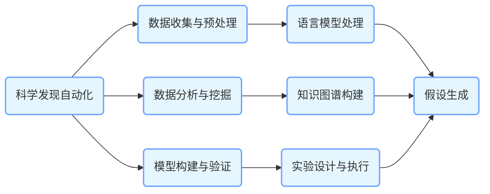

# 语言模型在科学发现过程自动化与假设生成中的前沿探索

> 关键词：语言模型、科学发现自动化、假设生成、自然语言处理、机器学习、人工智能、科研创新

> 摘要：本文聚焦于语言模型在科学发现过程自动化与假设生成中的前沿应用。首先介绍了相关背景，包括目的、预期读者等内容。接着阐述了语言模型、科学发现自动化和假设生成的核心概念及其联系，并给出相应的文本示意图和 Mermaid 流程图。详细讲解了核心算法原理，通过 Python 源代码进行说明，同时介绍了相关数学模型和公式。以实际项目为例，展示了语言模型在科学发现和假设生成中的代码实现与解读。探讨了其实际应用场景，推荐了相关学习资源、开发工具框架和论文著作。最后总结了未来发展趋势与挑战，解答常见问题并提供扩展阅读和参考资料，旨在全面深入地剖析语言模型在科学研究领域的重要作用和发展潜力。

## 1. 背景介绍 
### 1.1 目的和范围
科学研究是推动人类知识进步的重要力量，但传统的科学发现过程往往依赖于科研人员的个人经验和手动分析，效率较低且存在一定的局限性。本研究的目的在于探索语言模型如何助力科学发现过程的自动化以及高效的假设生成，从而加速科学研究的进程。范围涵盖了多个科学领域，如物理学、生物学、化学等，研究语言模型在不同领域数据处理和知识挖掘方面的应用，以及如何利用语言模型从海量的科学文献和实验数据中提取有价值的信息，形成合理的科学假设。

### 1.2 预期读者
本文预期读者包括科研工作者，他们可以了解如何借助语言模型改进现有的研究方法，提高研究效率和质量；计算机科学领域的专业人士，如人工智能工程师、自然语言处理专家等，他们可以从技术层面深入了解语言模型在科学研究中的应用和挑战；以及对科学发现和人工智能交叉领域感兴趣的爱好者，通过本文可以拓宽对该领域的认知和理解。

### 1.3 文档结构概述
本文首先介绍相关背景知识，让读者了解研究的目的、受众和整体结构。接着阐述核心概念及其联系，帮助读者建立起基本的理论框架。通过详细讲解核心算法原理和数学模型，使读者深入理解语言模型在科学发现和假设生成中的工作机制。以实际项目为例，展示代码实现和解读，让读者能够将理论知识应用到实践中。探讨实际应用场景，说明其在不同领域的具体作用。推荐相关的学习资源、开发工具框架和论文著作，为读者提供进一步学习和研究的途径。最后总结未来发展趋势与挑战，解答常见问题并提供扩展阅读和参考资料，使读者对整个研究有一个全面的认识。

### 1.4 术语表
#### 1.4.1 核心术语定义
- **语言模型**：是一种概率模型，用于计算一个句子或一段文本出现的概率，能够根据输入的文本预测下一个可能出现的词或字符。常见的语言模型有基于统计的语言模型和基于深度学习的语言模型，如 Transformer 架构的语言模型。
- **科学发现自动化**：指利用计算机技术和算法，自动处理科学研究中的数据收集、分析、推理等过程，减少人工干预，提高科学发现的效率和准确性。
- **假设生成**：在科学研究中，根据已有的数据、理论和观察结果，提出可能的解释或预测，作为进一步研究和验证的起点。

#### 1.4.2 相关概念解释
- **自然语言处理（NLP）**：是计算机科学与语言学的交叉领域，主要研究如何让计算机理解和处理人类语言。语言模型是自然语言处理中的重要组成部分，用于文本生成、机器翻译、信息提取等任务。
- **机器学习**：是一门多领域交叉学科，涉及概率论、统计学、逼近论、凸分析、算法复杂度理论等多门学科。它专门研究计算机怎样模拟或实现人类的学习行为，以获取新的知识或技能，重新组织已有的知识结构使之不断改善自身的性能。语言模型的训练通常基于机器学习算法。

#### 1.4.3 缩略词列表
- **NLP**：自然语言处理（Natural Language Processing）
- **ML**：机器学习（Machine Learning）
- **GPT**：生成式预训练变换器（Generative Pretrained Transformer）

## 2. 核心概念与联系 

### 核心概念原理
#### 语言模型
语言模型的核心原理是基于概率统计，通过学习大量的文本数据，计算文本中词与词之间的联合概率分布。对于一个长度为 $n$ 的句子 $w_1, w_2, \cdots, w_n$，语言模型的目标是计算其出现的概率 $P(w_1, w_2, \cdots, w_n)$。根据链式法则，这个概率可以分解为：

$$P(w_1, w_2, \cdots, w_n) = P(w_1)P(w_2|w_1)P(w_3|w_1, w_2) \cdots P(w_n|w_1, w_2, \cdots, w_{n - 1})$$

在实际应用中，由于计算复杂度的问题，通常采用 $n$ - 元语法模型进行近似计算。例如，二元语法模型（bigram model）假设当前词的出现只依赖于前一个词，即：

$$P(w_i|w_1, w_2, \cdots, w_{i - 1}) \approx P(w_i|w_{i - 1})$$

近年来，基于深度学习的语言模型，如 Transformer 架构的模型，通过自注意力机制能够捕捉到更复杂的文本上下文信息，取得了更好的性能。

#### 科学发现自动化
科学发现自动化的原理是将科学研究过程中的各个环节，如数据收集、数据预处理、数据分析、模型构建和验证等，进行形式化和算法化。通过计算机程序自动执行这些步骤，减少人工干预，提高研究效率和准确性。例如，利用数据挖掘算法从海量的科学数据中发现潜在的规律和模式，利用机器学习算法构建预测模型，对实验结果进行预测和验证。

#### 假设生成
假设生成的原理是基于已有的科学知识和数据，通过推理和归纳的方法，提出可能的解释或预测。在语言模型的帮助下，可以从大量的科学文献中提取相关的信息，利用自然语言处理技术对这些信息进行分析和整合，从而生成合理的科学假设。例如，通过对某一领域的研究文献进行主题建模，发现其中的研究热点和空白点，进而提出新的研究假设。

### 架构的文本示意图
```plaintext
                          科学发现自动化
                              |
         ┌────────────────────┼────────────────────┐
         │                    │                    │
  数据收集与预处理     数据分析与挖掘     模型构建与验证
         │                    │                    │
         ├────────────────────┼────────────────────┤
         │                    │                    │
  语言模型处理        知识图谱构建        实验设计与执行
         │                    │                    │
         └────────────────────┼────────────────────┘
                              │
                           假设生成
```

### Mermaid 流程图


## 3. 核心算法原理 & 具体操作步骤 

### 语言模型训练算法原理
以基于 Transformer 架构的语言模型为例，其核心是自注意力机制（Self - Attention）。自注意力机制允许模型在处理每个输入词时，能够关注到输入序列中的其他词，从而捕捉到长距离的依赖关系。

#### 自注意力机制的 Python 实现
```python
import torch
import torch.nn as nn
import torch.nn.functional as F

class SelfAttention(nn.Module):
    def __init__(self, input_dim, output_dim, num_heads):
        super(SelfAttention, self).__init__()
        self.input_dim = input_dim
        self.output_dim = output_dim
        self.num_heads = num_heads
        self.head_dim = output_dim // num_heads

        self.query = nn.Linear(input_dim, output_dim)
        self.key = nn.Linear(input_dim, output_dim)
        self.value = nn.Linear(input_dim, output_dim)
        self.out = nn.Linear(output_dim, output_dim)

    def forward(self, x):
        batch_size, seq_len, _ = x.size()

        Q = self.query(x).view(batch_size, seq_len, self.num_heads, self.head_dim).transpose(1, 2)
        K = self.key(x).view(batch_size, seq_len, self.num_heads, self.head_dim).transpose(1, 2)
        V = self.value(x).view(batch_size, seq_len, self.num_heads, self.head_dim).transpose(1, 2)

        scores = torch.matmul(Q, K.transpose(-2, -1)) / (self.head_dim ** 0.5)
        attention_weights = F.softmax(scores, dim=-1)
        out = torch.matmul(attention_weights, V)
        out = out.transpose(1, 2).contiguous().view(batch_size, seq_len, self.output_dim)
        out = self.out(out)
        return out
```

### 科学发现自动化中的数据挖掘算法
在科学发现自动化中，经常使用关联规则挖掘算法来发现数据中的潜在关系。以 Apriori 算法为例，其基本思想是通过逐层搜索的迭代方法，从单个项集开始，不断生成更大的项集，直到无法生成满足最小支持度的项集为止。

#### Apriori 算法的 Python 实现
```python
from itertools import chain, combinations

def powerset(iterable):
    s = list(iterable)
    return chain.from_iterable(combinations(s, r) for r in range(len(s)+1))

def get_support(itemset, transactions):
    count = 0
    for transaction in transactions:
        if itemset.issubset(transaction):
            count += 1
    return count / len(transactions)

def apriori(transactions, min_support):
    items = set(chain(*transactions))
    frequent_itemsets = []
    k = 1
    while True:
        itemsets = [frozenset(itemset) for itemset in combinations(items, k)]
        frequent_k_itemsets = []
        for itemset in itemsets:
            support = get_support(itemset, transactions)
            if support >= min_support:
                frequent_k_itemsets.append(itemset)
        if not frequent_k_itemsets:
            break
        frequent_itemsets.extend(frequent_k_itemsets)
        k += 1
    return frequent_itemsets
```

### 假设生成的操作步骤
1. **数据收集**：收集相关领域的科学文献、实验数据等。
2. **数据预处理**：对收集到的数据进行清洗、分词、去除停用词等操作。
3. **语言模型处理**：使用训练好的语言模型对预处理后的数据进行编码，提取文本特征。
4. **知识图谱构建**：根据提取的文本特征，构建知识图谱，表示科学概念之间的关系。
5. **关联分析**：利用数据挖掘算法，如 Apriori 算法，在知识图谱中发现潜在的关联关系。
6. **假设生成**：根据关联分析的结果，结合领域知识，生成合理的科学假设。

## 4. 数学模型和公式 & 详细讲解 & 举例说明 

### 语言模型的数学模型
#### 基于最大似然估计的语言模型训练
在训练语言模型时，通常使用最大似然估计（Maximum Likelihood Estimation, MLE）来估计模型的参数。对于一个语料库 $D = \{s_1, s_2, \cdots, s_N\}$，其中 $s_i$ 是一个句子，语言模型的目标是最大化语料库的似然函数：

$$L(\theta|D) = \prod_{i = 1}^{N} P(s_i|\theta)$$

为了方便计算，通常对似然函数取对数，得到对数似然函数：

$$\log L(\theta|D) = \sum_{i = 1}^{N} \log P(s_i|\theta)$$

通过最大化对数似然函数，可以得到模型的最优参数 $\theta$。

#### 举例说明
假设我们有一个简单的语料库 $D = \{"I like apples", "He likes bananas"\}$，使用二元语法模型进行训练。对于句子 "I like apples"，其概率可以表示为：

$$P("I like apples") = P("I")P("like"|"I")P("apples"|"like")$$

通过统计语料库中各个词和词对的出现频率，可以计算出相应的概率。例如，假设在语料库中 "I" 出现了 1 次，总词数为 6 次，则 $P("I") = \frac{1}{6}$；"I like" 出现了 1 次，"I" 出现了 1 次，则 $P("like"|"I") = \frac{1}{1} = 1$；"like apples" 出现了 1 次，"like" 出现了 1 次，则 $P("apples"|"like") = \frac{1}{1} = 1$。因此，$P("I like apples") = \frac{1}{6} \times 1 \times 1 = \frac{1}{6}$。

### 科学发现自动化中的数学模型
#### 关联规则挖掘的支持度和置信度
在关联规则挖掘中，支持度（Support）和置信度（Confidence）是两个重要的指标。对于一个关联规则 $X \Rightarrow Y$，其中 $X$ 和 $Y$ 是项集，支持度表示同时包含 $X$ 和 $Y$ 的事务在所有事务中所占的比例，置信度表示包含 $X$ 的事务中同时包含 $Y$ 的比例。

支持度的计算公式为：

$$\text{Support}(X \Rightarrow Y) = \frac{\text{Count}(X \cup Y)}{\text{Total Transactions}}$$

置信度的计算公式为：

$$\text{Confidence}(X \Rightarrow Y) = \frac{\text{Count}(X \cup Y)}{\text{Count}(X)}$$

#### 举例说明
假设我们有一个购物篮数据集，包含以下事务：

| 事务 ID | 商品列表 |
| ---- | ---- |
| 1 | {苹果, 香蕉, 牛奶} |
| 2 | {苹果, 面包} |
| 3 | {香蕉, 牛奶} |
| 4 | {苹果, 香蕉, 面包} |

对于关联规则 "苹果 $\Rightarrow$ 香蕉"，支持度为：

$$\text{Support}(\text{苹果} \Rightarrow \text{香蕉}) = \frac{\text{Count}(\{\text{苹果}, \text{香蕉}\})}{\text{Total Transactions}} = \frac{2}{4} = 0.5$$

置信度为：

$$\text{Confidence}(\text{苹果} \Rightarrow \text{香蕉}) = \frac{\text{Count}(\{\text{苹果}, \text{香蕉}\})}{\text{Count}(\{\text{苹果}\})} = \frac{2}{3} \approx 0.67$$

## 5. 项目实战：代码实际案例和详细解释说明 

### 5.1  开发环境搭建
#### 安装 Python
首先需要安装 Python 环境，建议使用 Python 3.7 及以上版本。可以从 Python 官方网站（https://www.python.org/downloads/） 下载并安装。

#### 安装必要的库
使用以下命令安装项目所需的库：
```sh
pip install torch
pip install numpy
pip install pandas
```

### 5.2  源代码详细实现和代码解读
#### 数据收集与预处理
```python
import pandas as pd
import nltk
from nltk.corpus import stopwords
from nltk.tokenize import word_tokenize
nltk.download('stopwords')
nltk.download('punkt')

# 读取科学文献数据
data = pd.read_csv('scientific_papers.csv')

# 数据预处理函数
def preprocess_text(text):
    # 转换为小写
    text = text.lower()
    # 分词
    tokens = word_tokenize(text)
    # 去除停用词
    stop_words = set(stopwords.words('english'))
    filtered_tokens = [token for token in tokens if token.isalnum() and token not in stop_words]
    return ' '.join(filtered_tokens)

# 对文献摘要进行预处理
data['abstract'] = data['abstract'].apply(preprocess_text)
```
代码解读：首先使用 `pandas` 库读取科学文献数据。然后定义了一个 `preprocess_text` 函数，该函数将文本转换为小写，进行分词，并去除停用词。最后对文献摘要列应用该预处理函数。

#### 语言模型处理
```python
from transformers import AutoTokenizer, AutoModel

# 加载预训练的语言模型和分词器
tokenizer = AutoTokenizer.from_pretrained('bert-base-uncased')
model = AutoModel.from_pretrained('bert-base-uncased')

# 对预处理后的文本进行编码
encoded_input = tokenizer(data['abstract'].tolist(), padding=True, truncation=True, return_tensors='pt')

# 获取模型输出
with torch.no_grad():
    outputs = model(**encoded_input)
    embeddings = outputs.last_hidden_state.mean(dim=1).numpy()
```
代码解读：使用 `transformers` 库加载预训练的 BERT 语言模型和分词器。对预处理后的文本进行编码，将其转换为模型可以接受的输入格式。通过模型获取文本的嵌入表示，这里取最后一层隐藏状态的平均值作为文本的特征向量。

#### 关联规则挖掘
```python
from mlxtend.preprocessing import TransactionEncoder
from mlxtend.frequent_patterns import apriori, association_rules

# 将文本转换为事务列表
transactions = [text.split() for text in data['abstract']]

# 编码事务列表
te = TransactionEncoder()
te_ary = te.fit(transactions).transform(transactions)
df = pd.DataFrame(te_ary, columns=te.columns_)

# 挖掘频繁项集
frequent_itemsets = apriori(df, min_support=0.1, use_colnames=True)

# 生成关联规则
rules = association_rules(frequent_itemsets, metric="confidence", min_threshold=0.7)
```
代码解读：将预处理后的文本转换为事务列表，每个事务是一个词的集合。使用 `TransactionEncoder` 对事务列表进行编码，将其转换为布尔矩阵。使用 `apriori` 算法挖掘频繁项集，设置最小支持度为 0.1。最后使用 `association_rules` 函数生成关联规则，设置最小置信度为 0.7。

### 5.3  代码解读与分析
通过上述代码，我们完成了从数据收集、预处理、语言模型处理到关联规则挖掘的整个流程。数据预处理步骤可以去除噪声，提高数据质量。语言模型处理可以将文本转换为数值特征，便于后续的数据分析。关联规则挖掘可以发现文本中潜在的关联关系，为假设生成提供依据。

在实际应用中，可以根据具体需求调整代码中的参数，如语言模型的选择、最小支持度和置信度的阈值等。同时，还可以结合领域知识对关联规则进行筛选和分析，生成更有价值的科学假设。

## 6. 实际应用场景 
### 物理学领域
在物理学研究中，语言模型可以帮助科学家快速浏览大量的研究文献，提取关键信息。例如，在粒子物理学中，通过对实验数据和理论文献的分析，语言模型可以发现不同粒子之间的潜在关联，生成关于新粒子存在或相互作用的假设。同时，语言模型还可以辅助物理学家进行理论推导，根据已有的理论知识生成可能的理论模型。

### 生物学领域
在生物学领域，语言模型可以用于基因序列分析、蛋白质结构预测等任务。通过对大量的生物数据和研究文献的学习，语言模型可以发现基因与疾病之间的潜在关系，生成关于疾病发病机制和治疗方法的假设。例如，在癌症研究中，语言模型可以分析癌症患者的基因数据和临床信息，发现可能的致癌基因和治疗靶点。

### 化学领域
在化学研究中，语言模型可以帮助化学家设计新的化学反应和合成路线。通过对化学文献和实验数据的分析，语言模型可以发现不同化学物质之间的反应规律，生成关于新化合物合成和性质预测的假设。例如，在药物研发中，语言模型可以分析药物分子的结构和活性数据，设计出更有效的药物分子。

## 7. 工具和资源推荐
### 7.1 学习资源推荐
#### 7.1.1 书籍推荐
- 《自然语言处理入门》：由何晗编写，本书系统地介绍了自然语言处理的基本概念、算法和应用，适合初学者入门。
- 《深度学习》：由 Ian Goodfellow、Yoshua Bengio 和 Aaron Courville 编写，本书全面介绍了深度学习的理论和实践，对于理解语言模型的原理有很大帮助。
- 《机器学习》：由周志华编写，本书详细介绍了机器学习的基本算法和模型，是机器学习领域的经典教材。

#### 7.1.2 在线课程
- Coursera 上的 “Natural Language Processing Specialization”：由斯坦福大学的教授授课，系统地介绍了自然语言处理的各个方面，包括语言模型、机器翻译、信息提取等。
- edX 上的 “Deep Learning Specialization”：由 Andrew Ng 教授授课，深入讲解了深度学习的理论和实践，对于学习语言模型的训练和优化有很大帮助。

#### 7.1.3 技术博客和网站
- Medium：上面有很多关于自然语言处理和人工智能的技术博客，作者来自世界各地的研究人员和工程师，可以了解到最新的研究成果和技术趋势。
- arXiv：是一个预印本数据库，包含了大量的科学研究论文，其中有很多关于语言模型和科学发现自动化的研究成果。

### 7.2 开发工具框架推荐
#### 7.2.1 IDE和编辑器
- PyCharm：是一款专门为 Python 开发设计的集成开发环境，具有强大的代码编辑、调试和分析功能，适合开发语言模型相关的项目。
- Jupyter Notebook：是一个交互式的开发环境，支持多种编程语言，适合进行数据探索和模型实验。

#### 7.2.2 调试和性能分析工具
- TensorBoard：是 TensorFlow 提供的一个可视化工具，可以帮助用户监控模型的训练过程，分析模型的性能和参数。
- PyTorch Profiler：是 PyTorch 提供的一个性能分析工具，可以帮助用户找出代码中的性能瓶颈，优化模型的训练和推理速度。

#### 7.2.3 相关框架和库
- Transformers：是 Hugging Face 开发的一个自然语言处理框架，提供了大量的预训练语言模型和工具，方便用户进行语言模型的开发和应用。
- Scikit - learn：是一个机器学习库，提供了各种机器学习算法和工具，适合进行数据挖掘和模型训练。

### 7.3 相关论文著作推荐
#### 7.3.1 经典论文
- “Attention Is All You Need”：提出了 Transformer 架构，是现代语言模型的基础。
- “BERT: Pre - training of Deep Bidirectional Transformers for Language Understanding”：介绍了 BERT 语言模型，开创了预训练语言模型的先河。

#### 7.3.2 最新研究成果
- 关注 arXiv 上关于语言模型在科学发现自动化和假设生成方面的最新研究论文，了解该领域的前沿进展。

#### 7.3.3 应用案例分析
- 可以在学术数据库中查找关于语言模型在不同科学领域应用的案例分析论文，学习如何将语言模型应用到实际的科学研究中。

## 8. 总结：未来发展趋势与挑战
### 未来发展趋势
- **多模态融合**：未来的语言模型将不仅仅局限于文本数据，还会融合图像、音频、视频等多模态数据，从而更全面地理解科学研究中的信息，生成更准确的假设。
- **跨学科应用**：语言模型将在更多的学科领域得到应用，促进不同学科之间的交叉融合，推动科学研究的创新发展。
- **自主学习和进化**：语言模型将具备更强的自主学习能力，能够自动从新的数据中学习知识，不断进化和优化自身的性能。

### 挑战
- **数据质量和隐私问题**：科学研究数据通常具有专业性强、质量参差不齐的特点，同时还涉及到数据隐私和安全问题。如何处理这些数据，保证数据的质量和隐私，是语言模型应用面临的一个重要挑战。
- **可解释性问题**：目前的语言模型大多是基于深度学习的黑盒模型，其决策过程难以解释。在科学研究中，需要模型能够提供可解释的结果，以便科学家理解和验证假设。
- **计算资源和效率问题**：训练和运行大规模的语言模型需要大量的计算资源和时间，如何提高模型的训练和推理效率，降低计算成本，是一个亟待解决的问题。

## 9. 附录：常见问题与解答
### 问题 1：语言模型在科学发现自动化中的准确性如何保证？
解答：可以通过以下几个方面保证语言模型的准确性：使用高质量的科学数据进行训练，对数据进行严格的预处理和清洗；选择合适的语言模型架构和训练算法，进行充分的模型调优；结合领域知识对模型的输出进行筛选和验证，确保生成的假设具有合理性和可靠性。

### 问题 2：如何将语言模型生成的假设应用到实际的科学研究中？
解答：首先，需要对生成的假设进行评估和筛选，选择具有较高可信度和研究价值的假设。然后，根据假设设计相应的实验或研究方案，进行实验验证。在验证过程中，不断收集数据，对假设进行修正和完善。

### 问题 3：语言模型在不同科学领域的应用有哪些差异？
解答：不同科学领域的数据特点和研究方法不同，语言模型在应用时也会有所差异。例如，在物理学领域，可能更关注对理论文献和实验数据的分析；在生物学领域，可能更关注基因序列和蛋白质结构数据的处理。同时，不同领域的专业术语和知识体系也不同，需要对语言模型进行针对性的训练和调整。

## 10. 扩展阅读 & 参考资料
### 扩展阅读
- 《科学发现的逻辑》：卡尔·波普尔的经典著作，探讨了科学发现的方法和逻辑。
- 《人工智能时代的科学革命》：介绍了人工智能在科学研究中的应用和影响，对理解语言模型在科学发现中的作用有很大帮助。

### 参考资料
- Hugging Face 官方文档：https://huggingface.co/docs
- TensorFlow 官方文档：https://www.tensorflow.org/api_docs
- PyTorch 官方文档：https://pytorch.org/docs/stable/index.html