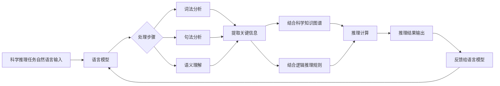

# 语言模型在科学推理任务中的能力提升

> 关键词：语言模型、科学推理任务、能力提升、自然语言处理、机器学习、认知推理、模型优化

> 摘要：本文围绕语言模型在科学推理任务中的能力提升展开深入探讨。首先介绍了研究的背景、目的、预期读者等基础信息，阐述了语言模型和科学推理任务的核心概念及联系。详细讲解了相关核心算法原理，通过 Python 源代码进行了具体操作步骤的说明，并给出了对应的数学模型和公式。结合项目实战，给出代码实际案例并进行详细解释。分析了语言模型在科学推理任务中的实际应用场景，推荐了相关的学习资源、开发工具框架和论文著作。最后总结了未来发展趋势与挑战，解答常见问题并提供扩展阅读和参考资料，旨在全面深入地研究如何提升语言模型在科学推理任务中的表现，推动该领域的发展。

## 1. 背景介绍 
### 1.1 目的和范围
语言模型在自然语言处理领域取得了显著进展，但在科学推理任务方面仍面临诸多挑战。本研究的目的在于深入探究如何提升语言模型在科学推理任务中的能力，范围涵盖从基础的语言模型原理到具体的科学推理任务实现，包括算法优化、数学模型构建以及实际项目应用等多个方面。通过全面的研究和实践，为语言模型在科学推理领域的发展提供理论支持和实践指导。

### 1.2 预期读者
本文预期读者包括自然语言处理领域的研究人员、人工智能开发者、对科学推理与语言模型结合感兴趣的学者、相关专业的学生以及致力于推动语言模型应用于科学领域的技术爱好者。这些读者具有一定的计算机科学、数学和人工智能基础，希望通过本文深入了解语言模型在科学推理任务中的能力提升方法和技术。

### 1.3 文档结构概述
本文首先介绍背景信息，让读者了解研究的目的和范围。接着阐述语言模型和科学推理任务的核心概念及联系，为后续的算法和模型讲解奠定基础。核心算法原理部分通过 Python 代码详细说明具体操作步骤。数学模型和公式部分给出理论支持并举例说明。项目实战部分展示代码实际案例并进行详细解读。实际应用场景部分分析语言模型在科学推理中的具体应用。工具和资源推荐部分为读者提供学习和开发的相关资源。最后总结未来发展趋势与挑战，解答常见问题并提供扩展阅读和参考资料。

### 1.4 术语表
#### 1.4.1 核心术语定义
- **语言模型**：是一种对自然语言文本进行概率建模的模型，它能够计算出一个句子或一段文本出现的概率，根据已有的文本预测下一个可能出现的词。
- **科学推理任务**：指利用科学知识和逻辑规则，对科学领域的问题进行分析、判断、推理和解决的任务，涉及到对科学概念、理论、实验结果等的理解和应用。
- **认知推理**：是指基于认知心理学和人工智能的方法，模拟人类的认知过程，对信息进行理解、分析和推理的能力。

#### 1.4.2 相关概念解释
- **自然语言处理（NLP）**：是计算机科学、人工智能和语言学的交叉领域，主要研究如何让计算机理解、处理和生成自然语言，包括文本分类、机器翻译、信息抽取等多个任务。
- **机器学习**：是一门多领域交叉学科，涉及概率论、统计学、逼近论、凸分析、算法复杂度理论等多门学科。它专门研究计算机怎样模拟或实现人类的学习行为，以获取新的知识或技能，重新组织已有的知识结构使之不断改善自身的性能。

#### 1.4.3 缩略词列表
- **NLP**：自然语言处理（Natural Language Processing）
- **AI**：人工智能（Artificial Intelligence）
- **ML**：机器学习（Machine Learning）

## 2. 核心概念与联系 

### 语言模型原理
语言模型的基本原理是基于概率分布来对语言进行建模。给定一个词序列 $w_1, w_2, \cdots, w_n$，语言模型的目标是计算该序列的概率 $P(w_1, w_2, \cdots, w_n)$。根据链式法则，这个概率可以分解为：

$$P(w_1, w_2, \cdots, w_n) = P(w_1)P(w_2|w_1)P(w_3|w_1, w_2) \cdots P(w_n|w_1, w_2, \cdots, w_{n - 1})$$

在实际应用中，由于计算 $P(w_i|w_1, w_2, \cdots, w_{i - 1})$ 的复杂度较高，通常会采用一些简化假设，如 n - gram 模型，假设当前词的概率只依赖于前 $n - 1$ 个词，即：

$$P(w_i|w_1, w_2, \cdots, w_{i - 1}) \approx P(w_i|w_{i - n + 1}, \cdots, w_{i - 1})$$

现代的语言模型，如基于神经网络的 Transformer 架构的模型，通过自注意力机制能够捕捉长距离的依赖关系，从而更准确地计算词序列的概率。

### 科学推理任务的本质
科学推理任务需要对科学知识进行理解、整合和应用。它涉及到对科学概念的语义理解，例如对物理定律、化学原理、生物现象等的准确把握；还需要进行逻辑推理，如演绎推理、归纳推理和类比推理等。例如，在物理问题中，根据已知的物理定律和条件，通过演绎推理得出结论；在生物研究中，通过对大量实验数据的归纳总结发现新的规律。

### 两者的联系
语言模型为科学推理任务提供了处理自然语言文本的能力。科学推理任务中的问题描述、知识表示等通常以自然语言的形式存在，语言模型可以对这些文本进行理解和分析。同时，科学推理任务的需求也推动了语言模型的发展，促使语言模型不断提升其语义理解和逻辑推理能力。例如，在科学文献的阅读理解任务中，语言模型需要理解科学术语和复杂的句子结构，同时运用科学知识进行推理，以回答相关问题。

### 文本示意图
语言模型和科学推理任务的关系可以用以下示意图表示：

语言模型接收科学推理任务的自然语言输入，经过一系列处理步骤，包括词法分析、句法分析、语义理解等，提取出关键信息。然后，结合科学知识图谱和逻辑推理规则，进行推理计算，最终输出推理结果。推理结果又可以反馈给语言模型，用于进一步的训练和优化，以提升语言模型在科学推理任务中的性能。

### Mermaid 流程图


## 3. 核心算法原理 & 具体操作步骤 

### 基于 Transformer 的语言模型
Transformer 是一种基于自注意力机制的神经网络架构，在自然语言处理领域取得了巨大成功。下面我们通过 Python 代码详细阐述其原理和具体操作步骤。

```python
import torch
import torch.nn as nn
import torch.nn.functional as F

# 定义多头注意力机制
class MultiHeadAttention(nn.Module):
    def __init__(self, num_heads, d_model):
        super(MultiHeadAttention, self).__init__()
        self.num_heads = num_heads
        self.d_model = d_model
        self.d_k = d_model // num_heads

        self.W_q = nn.Linear(d_model, d_model)
        self.W_k = nn.Linear(d_model, d_model)
        self.W_v = nn.Linear(d_model, d_model)
        self.W_o = nn.Linear(d_model, d_model)

    def scaled_dot_product_attention(self, Q, K, V, mask=None):
        attn_scores = torch.matmul(Q, K.transpose(-2, -1)) / torch.sqrt(torch.tensor(self.d_k, dtype=torch.float32))
        if mask is not None:
            attn_scores = attn_scores.masked_fill(mask == 0, -1e9)
        attn_probs = F.softmax(attn_scores, dim=-1)
        output = torch.matmul(attn_probs, V)
        return output

    def split_heads(self, x):
        batch_size, seq_length, d_model = x.size()
        return x.view(batch_size, seq_length, self.num_heads, self.d_k).transpose(1, 2)

    def combine_heads(self, x):
        batch_size, num_heads, seq_length, d_k = x.size()
        return x.transpose(1, 2).contiguous().view(batch_size, seq_length, self.d_model)

    def forward(self, Q, K, V, mask=None):
        Q = self.split_heads(self.W_q(Q))
        K = self.split_heads(self.W_k(K))
        V = self.split_heads(self.W_v(V))

        attn_output = self.scaled_dot_product_attention(Q, K, V, mask)
        output = self.W_o(self.combine_heads(attn_output))
        return output

# 定义前馈神经网络
class PositionwiseFeedForward(nn.Module):
    def __init__(self, d_model, d_ff):
        super(PositionwiseFeedForward, self).__init__()
        self.fc1 = nn.Linear(d_model, d_ff)
        self.fc2 = nn.Linear(d_ff, d_model)
        self.relu = nn.ReLU()

    def forward(self, x):
        return self.fc2(self.relu(self.fc1(x)))

# 定义编码器层
class EncoderLayer(nn.Module):
    def __init__(self, num_heads, d_model, d_ff, dropout):
        super(EncoderLayer, self).__init__()
        self.self_attn = MultiHeadAttention(num_heads, d_model)
        self.feed_forward = PositionwiseFeedForward(d_model, d_ff)
        self.norm1 = nn.LayerNorm(d_model)
        self.norm2 = nn.LayerNorm(d_model)
        self.dropout = nn.Dropout(dropout)

    def forward(self, x, mask):
        attn_output = self.self_attn(x, x, x, mask)
        x = self.norm1(x + self.dropout(attn_output))
        ff_output = self.feed_forward(x)
        x = self.norm2(x + self.dropout(ff_output))
        return x

# 定义编码器
class Encoder(nn.Module):
    def __init__(self, num_layers, num_heads, d_model, d_ff, dropout):
        super(Encoder, self).__init__()
        self.layers = nn.ModuleList([EncoderLayer(num_heads, d_model, d_ff, dropout) for _ in range(num_layers)])

    def forward(self, x, mask):
        for layer in self.layers:
            x = layer(x, mask)
        return x

# 示例使用
num_layers = 6
num_heads = 8
d_model = 512
d_ff = 2048
dropout = 0.1

encoder = Encoder(num_layers, num_heads, d_model, d_ff, dropout)
input_tensor = torch.randn(1, 10, d_model)
mask = torch.ones(1, 1, 10)
output = encoder(input_tensor, mask)
print(output.shape)
```

### 具体操作步骤
1. **输入表示**：将自然语言文本转换为词向量表示，通常使用预训练的词嵌入模型，如 Word2Vec 或 GloVe。
2. **多头注意力机制**：通过多头注意力机制，模型可以同时关注输入序列的不同部分，捕捉长距离的依赖关系。
3. **前馈神经网络**：对多头注意力机制的输出进行非线性变换，增加模型的表达能力。
4. **编码器层**：将多头注意力机制和前馈神经网络组合成编码器层，通过堆叠多个编码器层构建编码器。
5. **输出**：编码器的输出可以用于后续的任务，如分类、生成等。

## 4. 数学模型和公式 & 详细讲解 & 举例说明 

### 多头注意力机制的数学模型
多头注意力机制的数学模型可以表示为：

$$\text{MultiHead}(Q, K, V) = \text{Concat}(\text{head}_1, \cdots, \text{head}_h)W^O$$

其中，$\text{head}_i = \text{Attention}(QW_i^Q, KW_i^K, VW_i^V)$，$W_i^Q \in \mathbb{R}^{d_{\text{model}} \times d_k}$，$W_i^K \in \mathbb{R}^{d_{\text{model}} \times d_k}$，$W_i^V \in \mathbb{R}^{d_{\text{model}} \times d_v}$，$W^O \in \mathbb{R}^{hd_v \times d_{\text{model}}}$。

$\text{Attention}(Q, K, V) = \text{softmax}\left(\frac{QK^T}{\sqrt{d_k}}\right)V$

### 详细讲解
- **$Q$、$K$、$V$**：分别是查询（Query）、键（Key）和值（Value）矩阵，通过对输入进行线性变换得到。
- **$d_k$**：键向量的维度，用于缩放点积，防止点积结果过大。
- **$\text{softmax}$**：用于将注意力分数转换为概率分布。
- **$W^O$**：用于将多个头的输出拼接后进行线性变换，得到最终的多头注意力输出。

### 举例说明
假设输入序列的长度为 $n$，词向量的维度为 $d_{\text{model}}$，头的数量为 $h$，键向量的维度为 $d_k$，值向量的维度为 $d_v$。

- **输入**：$X \in \mathbb{R}^{n \times d_{\text{model}}}$
- **计算 $Q$、$K$、$V$**：$Q = XW^Q$，$K = XW^K$，$V = XW^V$，其中 $W^Q \in \mathbb{R}^{d_{\text{model}} \times d_k}$，$W^K \in \mathbb{R}^{d_{\text{model}} \times d_k}$，$W^V \in \mathbb{R}^{d_{\text{model}} \times d_v}$。
- **计算注意力分数**：$S = \frac{QK^T}{\sqrt{d_k}} \in \mathbb{R}^{n \times n}$
- **计算注意力概率**：$P = \text{softmax}(S) \in \mathbb{R}^{n \times n}$
- **计算注意力输出**：$A = PV \in \mathbb{R}^{n \times d_v}$
- **多头注意力**：重复上述步骤 $h$ 次，得到 $h$ 个头的输出，然后将它们拼接并进行线性变换得到最终的多头注意力输出。

## 5. 项目实战：代码实际案例和详细解释说明 

### 5.1  开发环境搭建
- **Python 环境**：建议使用 Python 3.7 及以上版本。
- **深度学习框架**：使用 PyTorch 深度学习框架，可通过以下命令安装：
```bash
pip install torch torchvision
```
- **其他依赖库**：安装 numpy、tqdm 等常用库：
```bash
pip install numpy tqdm
```

### 5.2  源代码详细实现和代码解读
以下是一个基于 PyTorch 的简单科学推理任务示例，使用一个简单的文本分类任务来模拟科学推理中的问题判断。

```python
import torch
import torch.nn as nn
import torch.optim as optim
from torch.utils.data import Dataset, DataLoader
from sklearn.model_selection import train_test_split
import numpy as np
import tqdm

# 定义数据集类
class ScienceReasoningDataset(Dataset):
    def __init__(self, texts, labels):
        self.texts = texts
        self.labels = labels

    def __len__(self):
        return len(self.texts)

    def __getitem__(self, idx):
        text = self.texts[idx]
        label = self.labels[idx]
        return text, label

# 定义简单的文本分类模型
class SimpleTextClassifier(nn.Module):
    def __init__(self, vocab_size, embedding_dim, hidden_dim, num_classes):
        super(SimpleTextClassifier, self).__init__()
        self.embedding = nn.Embedding(vocab_size, embedding_dim)
        self.fc1 = nn.Linear(embedding_dim, hidden_dim)
        self.relu = nn.ReLU()
        self.fc2 = nn.Linear(hidden_dim, num_classes)

    def forward(self, x):
        embedded = self.embedding(x)
        pooled = torch.mean(embedded, dim=1)
        hidden = self.relu(self.fc1(pooled))
        output = self.fc2(hidden)
        return output

# 生成示例数据
texts = ["This is a physics problem.", "This is a chemistry experiment.", "This is a biology question."]
labels = [0, 1, 2]

# 构建词汇表
vocab = set()
for text in texts:
    for word in text.split():
        vocab.add(word)
vocab_size = len(vocab)
word2idx = {word: idx for idx, word in enumerate(vocab)}

# 将文本转换为数字序列
texts_idx = []
for text in texts:
    text_idx = [word2idx[word] for word in text.split()]
    texts_idx.append(text_idx)

# 填充序列
max_length = max([len(text) for text in texts_idx])
texts_padded = []
for text in texts_idx:
    padded_text = text + [0] * (max_length - len(text))
    texts_padded.append(padded_text)

# 划分训练集和测试集
train_texts, test_texts, train_labels, test_labels = train_test_split(texts_padded, labels, test_size=0.2, random_state=42)

# 创建数据集和数据加载器
train_dataset = ScienceReasoningDataset(train_texts, train_labels)
test_dataset = ScienceReasoningDataset(test_texts, test_labels)

train_loader = DataLoader(train_dataset, batch_size=2, shuffle=True)
test_loader = DataLoader(test_dataset, batch_size=2, shuffle=False)

# 初始化模型、损失函数和优化器
embedding_dim = 100
hidden_dim = 64
num_classes = 3

model = SimpleTextClassifier(vocab_size, embedding_dim, hidden_dim, num_classes)
criterion = nn.CrossEntropyLoss()
optimizer = optim.Adam(model.parameters(), lr=0.001)

# 训练模型
num_epochs = 10
for epoch in range(num_epochs):
    model.train()
    running_loss = 0.0
    for texts, labels in tqdm.tqdm(train_loader):
        texts = torch.tensor(texts, dtype=torch.long)
        labels = torch.tensor(labels, dtype=torch.long)

        optimizer.zero_grad()
        outputs = model(texts)
        loss = criterion(outputs, labels)
        loss.backward()
        optimizer.step()

        running_loss += loss.item()

    print(f'Epoch {epoch + 1}/{num_epochs}, Loss: {running_loss / len(train_loader)}')

# 测试模型
model.eval()
correct = 0
total = 0
with torch.no_grad():
    for texts, labels in test_loader:
        texts = torch.tensor(texts, dtype=torch.long)
        labels = torch.tensor(labels, dtype=torch.long)

        outputs = model(texts)
        _, predicted = torch.max(outputs.data, 1)
        total += labels.size(0)
        correct += (predicted == labels).sum().item()

print(f'Accuracy: {100 * correct / total}%')
```

### 5.3  代码解读与分析
- **数据集类**：`ScienceReasoningDataset` 类用于封装文本数据和对应的标签，方便数据的加载和处理。
- **文本分类模型**：`SimpleTextClassifier` 类定义了一个简单的文本分类模型，包括嵌入层、全连接层和激活函数。
- **数据预处理**：将文本转换为数字序列，并进行填充，以确保所有输入序列的长度一致。
- **训练过程**：使用交叉熵损失函数和 Adam 优化器进行模型训练，通过反向传播更新模型参数。
- **测试过程**：在测试集上评估模型的准确率。

## 6. 实际应用场景 
### 科学文献理解与摘要生成
语言模型可以帮助研究人员快速理解大量的科学文献，提取关键信息并生成文献摘要。通过对科学文献中的专业术语和复杂句子结构的理解，语言模型能够准确地把握文献的核心内容，为研究人员节省时间和精力。

### 科学问题解答系统
构建基于语言模型的科学问题解答系统，用户可以输入科学领域的问题，系统利用语言模型的理解和推理能力，结合科学知识图谱，给出准确的答案。这对于学生学习科学知识、科研人员解决研究中的问题都具有重要意义。

### 科学实验设计辅助
在科学实验设计过程中，语言模型可以根据已有的科学知识和实验数据，为研究人员提供实验方案的建议和优化方案。例如，在化学实验中，语言模型可以根据化学反应原理和实验条件，推荐合适的实验试剂和操作步骤。

### 科学知识发现与创新
语言模型可以对大量的科学数据和文献进行分析和挖掘，发现潜在的科学规律和知识。通过对不同领域的科学知识进行整合和推理，为科学研究的创新提供思路和方向。

## 7. 工具和资源推荐
### 7.1 学习资源推荐
#### 7.1.1 书籍推荐
- 《深度学习》（Deep Learning）：由 Ian Goodfellow、Yoshua Bengio 和 Aaron Courville 所著，是深度学习领域的经典教材，涵盖了神经网络、优化算法、概率模型等多个方面的内容。
- 《自然语言处理入门》（Natural Language Processing in Action）：详细介绍了自然语言处理的基本概念、算法和应用，通过实际案例帮助读者快速入门。
- 《人工智能：一种现代的方法》（Artificial Intelligence: A Modern Approach）：全面介绍了人工智能的各个领域，包括搜索算法、知识表示、推理技术等，是人工智能领域的权威教材。

#### 7.1.2 在线课程
- Coursera 上的《深度学习专项课程》（Deep Learning Specialization）：由 Andrew Ng 教授授课，包括神经网络、卷积神经网络、循环神经网络等多个方面的内容，是学习深度学习的优质课程。
- edX 上的《自然语言处理基础》（Foundations of Natural Language Processing）：系统介绍了自然语言处理的基本理论和方法，适合初学者学习。
- Udemy 上的《Python 自然语言处理实战》（Natural Language Processing in Python）：通过实际项目讲解自然语言处理的应用，帮助读者提高实践能力。

#### 7.1.3 技术博客和网站
- Medium 上的 Towards Data Science：汇聚了大量关于数据科学、机器学习、自然语言处理等领域的优质文章，由全球的专业人士分享最新的技术和研究成果。
- arXiv：是一个预印本平台，提供了大量的科学研究论文，包括人工智能、自然语言处理等领域的最新研究成果。
- Hugging Face Blog：专注于自然语言处理和深度学习领域，提供了关于语言模型、Transformer 架构等方面的详细介绍和技术文章。

### 7.2 开发工具框架推荐
#### 7.2.1 IDE和编辑器
- PyCharm：是一款专业的 Python 集成开发环境，提供了代码编辑、调试、版本控制等一系列功能，方便开发者进行 Python 项目的开发。
- Visual Studio Code：是一款轻量级的代码编辑器，支持多种编程语言和插件扩展，具有丰富的功能和良好的用户体验。
- Jupyter Notebook：是一个交互式的开发环境，适合进行数据探索、模型训练和结果展示，方便开发者进行快速迭代和实验。

#### 7.2.2 调试和性能分析工具
- TensorBoard：是 TensorFlow 提供的可视化工具，可以帮助开发者监控模型的训练过程，查看损失函数、准确率等指标的变化情况，还可以进行模型结构的可视化。
- PyTorch Profiler：是 PyTorch 提供的性能分析工具，可以帮助开发者分析模型的性能瓶颈，找出耗时较长的操作和内存占用较大的部分，以便进行优化。
- cProfile：是 Python 内置的性能分析工具，可以对 Python 代码进行性能分析，找出代码中的性能瓶颈。

#### 7.2.3 相关框架和库
- PyTorch：是一个开源的深度学习框架，提供了丰富的神经网络模块和优化算法，具有良好的灵活性和性能，广泛应用于自然语言处理、计算机视觉等领域。
- Hugging Face Transformers：是一个基于 PyTorch 和 TensorFlow 的自然语言处理库，提供了多种预训练的语言模型，如 BERT、GPT - 2 等，方便开发者进行自然语言处理任务的开发。
- NLTK：是一个自然语言处理工具包，提供了丰富的语料库和工具，如词法分析、句法分析、语义理解等，适合初学者学习和实践。

### 7.3 相关论文著作推荐
#### 7.3.1 经典论文
- "Attention Is All You Need"：提出了 Transformer 架构，是自然语言处理领域的重要突破，为后续的语言模型发展奠定了基础。
- "BERT: Pre - training of Deep Bidirectional Transformers for Language Understanding"：介绍了 BERT 模型，通过预训练和微调的方式，在多个自然语言处理任务中取得了优异的成绩。
- "Generative Pretrained Transformer 3"：介绍了 GPT - 3 模型，展示了大规模语言模型在自然语言生成任务中的强大能力。

#### 7.3.2 最新研究成果
- 关注 arXiv 上的最新论文，了解语言模型在科学推理任务中的最新研究进展，包括新的算法、模型架构和应用案例。
- 参加自然语言处理领域的国际会议，如 ACL（Association for Computational Linguistics）、EMNLP（Conference on Empirical Methods in Natural Language Processing）等，获取最新的研究成果和前沿技术。

#### 7.3.3 应用案例分析
- 查看相关的学术期刊和会议论文，了解语言模型在科学文献理解、科学问题解答、科学实验设计等实际应用场景中的案例分析和效果评估。
- 参考开源项目和企业的技术博客，了解他们在语言模型应用方面的实践经验和创新思路。

## 8. 总结：未来发展趋势与挑战
### 未来发展趋势
- **多模态融合**：将语言模型与图像、音频等多模态信息融合，提高语言模型在科学推理任务中的能力。例如，在生物科学中，结合图像和文本信息可以更准确地理解生物现象和进行推理。
- **知识增强**：将外部知识图谱和科学知识库与语言模型相结合，使语言模型能够更好地利用科学知识进行推理。通过知识注入和知识推理，提升语言模型在科学领域的准确性和可靠性。
- **强化学习与语言模型的结合**：利用强化学习的方法对语言模型进行训练，使语言模型能够在与环境的交互中不断优化推理策略，提高在科学推理任务中的性能。
- **跨领域应用**：语言模型在科学推理任务中的应用将逐渐扩展到更多的领域，如医学、物理学、化学等，为不同领域的科学研究和实践提供支持。

### 挑战
- **科学知识的表示和整合**：科学知识具有复杂性和多样性，如何将科学知识有效地表示和整合到语言模型中是一个挑战。需要研究合适的知识表示方法和知识融合技术，确保语言模型能够准确地理解和应用科学知识。
- **推理能力的提升**：目前的语言模型在逻辑推理和认知推理方面还存在不足，需要进一步研究和开发新的算法和模型架构，提高语言模型的推理能力。例如，如何实现更复杂的演绎推理、归纳推理和类比推理等。
- **数据的质量和多样性**：科学推理任务需要大量高质量、多样性的数据进行训练，但科学数据往往具有专业性和稀缺性，获取和标注数据的成本较高。如何解决数据的质量和多样性问题是提升语言模型在科学推理任务中能力的关键。
- **可解释性和可靠性**：语言模型在科学推理任务中的决策过程往往缺乏可解释性，这在一些关键领域的应用中是一个重要问题。需要研究可解释的语言模型和推理方法，提高语言模型的可靠性和可信度。

## 9. 附录：常见问题与解答
### 问题 1：语言模型在科学推理任务中与传统的专家系统有什么区别？
**解答**：传统的专家系统是基于规则和知识库的系统，通过显式的规则进行推理，具有较强的逻辑性和可解释性，但需要人工编写大量的规则，知识更新和扩展较为困难。语言模型是基于数据驱动的，通过对大量文本数据的学习来进行推理，具有较强的泛化能力和语言理解能力，但推理过程的可解释性较差。语言模型可以处理自然语言文本，更适合处理复杂的科学问题描述和知识表示。

### 问题 2：如何评估语言模型在科学推理任务中的性能？
**解答**：可以从多个方面评估语言模型在科学推理任务中的性能。例如，在科学问题解答任务中，可以使用准确率、召回率、F1 值等指标来评估模型的答案正确性；在科学文献理解任务中，可以使用摘要的质量评估指标，如 ROUGE 分数等；还可以通过人工评估的方式，让专业的科学人员对模型的推理结果进行评价，评估其合理性和可靠性。

### 问题 3：语言模型在科学推理任务中需要多少数据进行训练？
**解答**：语言模型在科学推理任务中需要的数据量取决于多个因素，如模型的复杂度、任务的难度、数据的质量等。一般来说，数据量越大，模型的性能越好。但对于一些专业性较强的科学领域，数据往往比较稀缺，此时可以采用迁移学习、数据增强等方法来提高模型的性能。同时，还需要注意数据的质量，确保数据的准确性和一致性。

### 问题 4：如何解决语言模型在科学推理任务中的可解释性问题？
**解答**：目前有多种方法可以尝试解决语言模型的可解释性问题。例如，可以采用基于规则的方法，将语言模型的推理过程与规则相结合，使推理过程更加透明；可以使用注意力机制可视化的方法，展示模型在推理过程中关注的重点部分；还可以通过生成解释文本的方式，对模型的推理结果进行解释和说明。

## 10. 扩展阅读 & 参考资料
### 扩展阅读
- 《知识图谱：方法、实践与应用》：深入介绍了知识图谱的构建、表示和应用，对于理解如何将知识图谱与语言模型结合用于科学推理任务具有重要参考价值。
- 《深度学习中的注意力机制》：详细介绍了注意力机制的原理和应用，有助于深入理解 Transformer 架构和语言模型中的注意力机制。
- 《科学推理的逻辑》：从哲学和逻辑学的角度探讨了科学推理的方法和原则，对于提升语言模型的科学推理能力提供了理论基础。

### 参考资料
- Goodfellow, I., Bengio, Y., & Courville, A. (2016). Deep Learning. MIT Press.
- Vaswani, A., Shazeer, N., Parmar, N., Uszkoreit, J., Jones, L., Gomez, A. N., ... & Polosukhin, I. (2017). Attention is all you need. In Advances in neural information processing systems (pp. 5998 - 6008).
- Devlin, J., Chang, M. W., Lee, K., & Toutanova, K. (2018). Bert: Pre - training of deep bidirectional transformers for language understanding. arXiv preprint arXiv:1810.04805.
- Brown, T. B., Mann, B., Ryder, N., Subbiah, M., Kaplan, J. D., Dhariwal, P., ... & Amodei, D. (2020). Language models are few - shot learners. arXiv preprint arXiv:2005.14165.