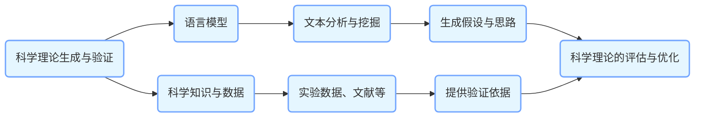

# 语言模型在科学理论生成与验证中的应用

> 关键词：语言模型、科学理论生成、科学理论验证、自然语言处理、人工智能、机器学习、科学研究方法

> 摘要：本文深入探讨了语言模型在科学理论生成与验证中的应用。首先介绍了相关背景，包括目的、预期读者、文档结构和术语表。接着阐述了语言模型、科学理论生成与验证的核心概念及它们之间的联系，并给出相应的文本示意图和 Mermaid 流程图。详细讲解了核心算法原理，通过 Python 源代码进行了具体说明，同时介绍了相关的数学模型和公式。在项目实战部分，给出了开发环境搭建、源代码实现及解读。分析了语言模型在不同科学领域的实际应用场景，推荐了学习资源、开发工具框架以及相关论文著作。最后总结了未来发展趋势与挑战，提供了常见问题解答和扩展阅读参考资料，旨在全面展现语言模型在科学理论研究中的重要作用和应用前景。

## 1. 背景介绍 
### 1.1 目的和范围
在当今科学研究领域，面对海量的科研文献和复杂的理论体系，如何高效地生成新的科学理论并对其进行验证成为了关键问题。语言模型作为人工智能领域的重要技术，具有强大的自然语言处理能力。本文章的目的在于深入探讨语言模型在科学理论生成与验证中的具体应用，分析其原理、方法和实际效果。范围涵盖了不同学科领域的科学理论研究，包括物理学、化学、生物学等，以及多种类型的语言模型，如基于深度学习的预训练语言模型等。

### 1.2 预期读者
本文预期读者包括科研工作者，他们可以通过了解语言模型的应用，为自己的科学研究提供新的思路和方法；人工智能和自然语言处理领域的专业人员，能够从技术层面深入探讨语言模型在科学研究中的应用细节；以及对科学研究和人工智能交叉领域感兴趣的学生和爱好者，帮助他们拓宽知识面和视野。

### 1.3 文档结构概述
本文首先介绍语言模型在科学理论生成与验证中的背景信息，包括目的、读者和术语表。接着阐述核心概念及它们之间的联系，通过文本示意图和 Mermaid 流程图进行直观展示。详细讲解核心算法原理和具体操作步骤，结合 Python 源代码进行说明。介绍相关的数学模型和公式，并举例说明。在项目实战部分，给出开发环境搭建、源代码实现和代码解读。分析语言模型在实际科学研究中的应用场景，推荐学习资源、开发工具框架和相关论文著作。最后总结未来发展趋势与挑战，提供常见问题解答和扩展阅读参考资料。

### 1.4 术语表
#### 1.4.1 核心术语定义
- **语言模型**：是一种对自然语言进行建模的概率模型，用于预测文本序列中下一个词或字符的概率分布。例如，在给定前面的“今天天气”，语言模型可以预测下一个词可能是“很好”“晴朗”等的概率。
- **科学理论生成**：指通过一定的方法和手段，从已有的科学知识、实验数据等信息中推导出新的科学理论的过程。
- **科学理论验证**：对生成的科学理论进行检验和证明，判断其是否符合客观事实和科学规律的过程。

#### 1.4.2 相关概念解释
- **自然语言处理（NLP）**：是计算机科学与人工智能领域中的一个重要方向，旨在让计算机能够理解、处理和生成自然语言。语言模型是自然语言处理中的核心技术之一。
- **深度学习**：是一种基于人工神经网络的机器学习方法，通过多层神经网络自动学习数据中的特征和模式。许多先进的语言模型都是基于深度学习技术构建的。

#### 1.4.3 缩略词列表
- **NLP**：Natural Language Processing（自然语言处理）
- **BERT**：Bidirectional Encoder Representations from Transformers（基于变换器的双向编码器表示）
- **GPT**：Generative Pretrained Transformer（生成式预训练变换器）

## 2. 核心概念与联系 

### 核心概念原理
#### 语言模型原理
语言模型的基本原理是基于概率统计。给定一个文本序列 $w_1, w_2, \cdots, w_n$，语言模型的目标是计算该序列出现的概率 $P(w_1, w_2, \cdots, w_n)$。根据链式法则，这个概率可以分解为：

$$P(w_1, w_2, \cdots, w_n) = P(w_1)P(w_2|w_1)P(w_3|w_1, w_2) \cdots P(w_n|w_1, w_2, \cdots, w_{n - 1})$$

为了简化计算，通常采用 $n$ - 元语法（$n$ - gram）模型，假设当前词的概率只依赖于前面的 $n - 1$ 个词。例如，在二元语法（bigram）模型中：

$$P(w_i|w_1, w_2, \cdots, w_{i - 1}) \approx P(w_i|w_{i - 1})$$

现代的基于深度学习的语言模型，如 BERT 和 GPT，采用了变换器（Transformer）架构。变换器通过自注意力机制（Self - Attention）来捕捉文本中的长距离依赖关系，能够更好地学习语言的语义和上下文信息。

#### 科学理论生成原理
科学理论生成通常基于已有的科学知识、实验数据和逻辑推理。科学家通过对大量的观测数据进行分析和归纳，提出假设，然后通过演绎推理来构建理论体系。在这个过程中，语言模型可以帮助挖掘数据中的潜在规律和模式，提供新的思路和假设。例如，语言模型可以对科研文献进行分析，提取关键信息和知识，为理论生成提供基础。

#### 科学理论验证原理
科学理论验证是通过实验、观测和逻辑推理来检验理论的正确性。语言模型可以辅助验证过程，例如对实验数据进行文本分析，检查理论预测与实际观测结果是否一致。语言模型还可以对理论的逻辑结构进行分析，检查是否存在矛盾和不合理之处。

### 架构的文本示意图
```plaintext
                      科学理论生成与验证
                            |
               +---------------------------+
               |                           |
          语言模型                   科学知识与数据
               |                           |
               |                           |
        文本分析与挖掘               实验数据、文献等
               |                           |
               |                           |
        生成假设与思路             提供验证依据
               |                           |
               |                           |
               +---------------------------+
                            |
                      科学理论的评估与优化
```

### Mermaid 流程图


## 3. 核心算法原理 & 具体操作步骤 

### 语言模型的核心算法原理
以 GPT 系列的语言模型为例，其核心是基于变换器的解码器架构。变换器的解码器由多个相同的层组成，每个层包含自注意力机制和前馈神经网络。

#### 自注意力机制
自注意力机制允许模型在处理一个词时，关注输入序列中的其他词。对于输入序列 $X = [x_1, x_2, \cdots, x_n]$，首先通过线性变换得到查询（Query）矩阵 $Q$、键（Key）矩阵 $K$ 和值（Value）矩阵 $V$：

$$Q = XW_Q$$
$$K = XW_K$$
$$V = XW_V$$

其中 $W_Q$、$W_K$ 和 $W_V$ 是可学习的权重矩阵。然后计算注意力分数：

$$Attention(Q, K, V) = \text{softmax}\left(\frac{QK^T}{\sqrt{d_k}}\right)V$$

其中 $d_k$ 是查询和键的维度。

#### 前馈神经网络
在自注意力机制之后，通过前馈神经网络对输出进行进一步的处理。前馈神经网络通常由两个线性层和一个激活函数（如 ReLU）组成：

$$FFN(x) = \text{max}(0, xW_1 + b_1)W_2 + b_2$$

### Python 源代码实现
以下是一个简单的基于 PyTorch 实现的自注意力机制的示例代码：

```python
import torch
import torch.nn as nn

class SelfAttention(nn.Module):
    def __init__(self, input_dim, d_k):
        super(SelfAttention, self).__init__()
        self.W_q = nn.Linear(input_dim, d_k)
        self.W_k = nn.Linear(input_dim, d_k)
        self.W_v = nn.Linear(input_dim, d_k)

    def forward(self, x):
        Q = self.W_q(x)
        K = self.W_k(x)
        V = self.W_v(x)

        attention_scores = torch.matmul(Q, K.transpose(-2, -1)) / torch.sqrt(torch.tensor(Q.size(-1), dtype=torch.float32))
        attention_probs = torch.softmax(attention_scores, dim=-1)
        output = torch.matmul(attention_probs, V)
        return output
```

### 具体操作步骤
1. **数据准备**：收集和整理科学研究相关的文本数据，如科研文献、实验报告等。对数据进行清洗和预处理，包括去除噪声、分词、标注等。
2. **语言模型训练**：选择合适的语言模型架构，如 GPT 或 BERT。使用准备好的数据对语言模型进行训练，调整模型的参数以提高性能。
3. **科学理论生成**：利用训练好的语言模型对科研数据进行分析和挖掘，提取关键信息和知识。根据这些信息生成新的科学假设和思路。
4. **科学理论验证**：将生成的理论与实验数据、已有科学知识进行对比和验证。使用语言模型对验证结果进行分析和评估，检查理论的合理性和正确性。

## 4. 数学模型和公式 & 详细讲解 & 举例说明 

### 语言模型的数学模型
如前面所述，语言模型的基本数学模型是基于概率的。以最大似然估计为例，给定训练数据 $D = \{w_1, w_2, \cdots, w_N\}$，语言模型的目标是最大化数据的似然函数：

$$L(\theta) = \prod_{i = 1}^{N} P(w_i|\theta)$$

其中 $\theta$ 是模型的参数。通常为了方便计算，会对似然函数取对数，得到对数似然函数：

$$\log L(\theta) = \sum_{i = 1}^{N} \log P(w_i|\theta)$$

模型训练的目标就是找到使对数似然函数最大的参数 $\theta$。

### 科学理论生成中的数学模型
在科学理论生成中，常常使用归纳推理和演绎推理的数学模型。例如，在统计学中，通过对样本数据的分析和归纳，可以得到总体的分布模型。假设我们有一组样本数据 $x_1, x_2, \cdots, x_n$，我们可以通过最大似然估计来估计总体分布的参数。

以正态分布为例，总体分布的概率密度函数为：

$$f(x|\mu, \sigma^2) = \frac{1}{\sqrt{2\pi\sigma^2}} \exp\left(-\frac{(x - \mu)^2}{2\sigma^2}\right)$$

其中 $\mu$ 是均值，$\sigma^2$ 是方差。通过最大似然估计，我们可以得到 $\mu$ 和 $\sigma^2$ 的估计值：

$$\hat{\mu} = \frac{1}{n} \sum_{i = 1}^{n} x_i$$
$$\hat{\sigma}^2 = \frac{1}{n} \sum_{i = 1}^{n} (x_i - \hat{\mu})^2$$

### 科学理论验证中的数学模型
在科学理论验证中，常用的数学模型包括假设检验和置信区间估计。假设检验是通过样本数据来判断一个假设是否成立。例如，我们要检验一个新的药物是否有效，我们可以提出原假设 $H_0$ 和备择假设 $H_1$。

假设我们要检验总体均值 $\mu$ 是否等于某个值 $\mu_0$，原假设 $H_0: \mu = \mu_0$，备择假设 $H_1: \mu \neq \mu_0$。我们可以使用 $t$ - 检验统计量：

$$t = \frac{\bar{x} - \mu_0}{s / \sqrt{n}}$$

其中 $\bar{x}$ 是样本均值，$s$ 是样本标准差，$n$ 是样本容量。根据 $t$ 分布的临界值，我们可以判断是否拒绝原假设。

### 举例说明
假设我们有一组关于某种物质的实验数据，其质量测量值分别为 $x = [10.1, 10.3, 10.2, 10.4, 10.0]$。我们要估计该物质质量的总体均值和方差。

```python
import numpy as np

x = np.array([10.1, 10.3, 10.2, 10.4, 10.0])

# 计算样本均值
mu_hat = np.mean(x)
# 计算样本方差
sigma2_hat = np.var(x)

print(f"样本均值: {mu_hat}")
print(f"样本方差: {sigma2_hat}")
```

假设我们要检验该物质质量的总体均值是否等于 10.0，我们可以进行 $t$ - 检验。

```python
from scipy import stats

mu_0 = 10.0
t_stat, p_value = stats.ttest_1samp(x, mu_0)

print(f"t 统计量: {t_stat}")
print(f"p 值: {p_value}")

if p_value < 0.05:
    print("拒绝原假设，总体均值不等于 10.0")
else:
    print("接受原假设，总体均值等于 10.0")
```

## 5. 项目实战：代码实际案例和详细解释说明 

### 5.1  开发环境搭建
#### 安装 Python
首先需要安装 Python 环境，建议使用 Python 3.7 及以上版本。可以从 Python 官方网站（https://www.python.org/downloads/）下载并安装。

#### 安装必要的库
使用 `pip` 安装以下必要的库：
- `torch`：用于深度学习模型的开发。
- `transformers`：提供预训练的语言模型。
- `numpy`：用于数值计算。
- `pandas`：用于数据处理。

```bash
pip install torch transformers numpy pandas
```

### 5.2  源代码详细实现和代码解读
以下是一个使用预训练的 GPT - 2 模型进行科学文本生成的示例代码：

```python
from transformers import GPT2LMHeadModel, GPT2Tokenizer

# 加载预训练的 GPT - 2 模型和分词器
tokenizer = GPT2Tokenizer.from_pretrained('gpt2')
model = GPT2LMHeadModel.from_pretrained('gpt2')

# 输入的科学相关文本
input_text = "在物理学中，量子力学的"

# 对输入文本进行分词
input_ids = tokenizer.encode(input_text, return_tensors='pt')

# 生成文本
output = model.generate(input_ids, max_length=100, num_beams=5, no_repeat_ngram_size=2, early_stopping=True)

# 将生成的文本解码
generated_text = tokenizer.decode(output[0], skip_special_tokens=True)

print(generated_text)
```

### 代码解读与分析
1. **加载模型和分词器**：使用 `transformers` 库中的 `GPT2Tokenizer` 和 `GPT2LMHeadModel` 分别加载 GPT - 2 的分词器和语言模型。
2. **输入文本处理**：将输入的科学相关文本使用分词器进行分词，得到输入的词 ID 序列。
3. **文本生成**：使用 `model.generate` 方法生成文本。`max_length` 参数指定生成文本的最大长度，`num_beams` 参数用于束搜索的束宽，`no_repeat_ngram_size` 参数用于避免生成重复的 $n$ - 元语法，`early_stopping` 参数用于在生成完成后提前停止。
4. **文本解码**：将生成的词 ID 序列使用分词器解码为文本。

## 6. 实际应用场景 
### 物理学领域
在物理学中，语言模型可以帮助物理学家分析大量的科研文献，提取关键信息和知识。例如，对量子力学、相对论等领域的文献进行分析，挖掘潜在的理论和研究方向。语言模型还可以辅助物理学家生成新的理论假设，通过对已有理论和实验数据的分析，提出创新性的想法。

### 化学领域
在化学领域，语言模型可以用于化学结构的预测和分析。例如，根据化学反应的条件和反应物，预测可能的产物结构。语言模型还可以对化学实验报告进行分析，提取实验数据和结果，帮助化学家验证和优化化学反应的条件和过程。

### 生物学领域
在生物学中，语言模型可以对基因序列、蛋白质结构等生物信息进行分析和解读。例如，预测基因的功能和调控机制，分析蛋白质的相互作用。语言模型还可以辅助生物学家生成新的生物学理论和假设，促进生物学研究的发展。

### 医学领域
在医学领域，语言模型可以帮助医生分析病历、医学文献等信息，提供诊断建议和治疗方案。例如，对疾病的症状、诊断结果和治疗过程进行分析，预测疾病的发展趋势和治疗效果。语言模型还可以辅助医学研究人员进行药物研发，筛选潜在的药物靶点和药物分子。

## 7. 工具和资源推荐
### 7.1 学习资源推荐
#### 7.1.1 书籍推荐
- 《深度学习》（Deep Learning）：由 Ian Goodfellow、Yoshua Bengio 和 Aaron Courville 编写，是深度学习领域的经典教材，介绍了深度学习的基本原理和算法。
- 《自然语言处理入门》：帮助读者了解自然语言处理的基本概念和技术，包括语言模型、分词、词性标注等。
- 《科学研究方法》：介绍了科学研究的基本方法和流程，对于理解科学理论生成与验证的过程有很大帮助。

#### 7.1.2 在线课程
- Coursera 上的“深度学习专项课程”：由 Andrew Ng 教授授课，系统地介绍了深度学习的各个方面，包括神经网络、卷积神经网络、循环神经网络等。
- edX 上的“自然语言处理”课程：深入讲解了自然语言处理的技术和应用，包括语言模型、机器翻译、文本分类等。

#### 7.1.3 技术博客和网站
- Medium 上的 AI 相关博客：有很多关于语言模型、人工智能等领域的最新研究成果和技术分享。
- arXiv 网站：提供了大量的学术论文，包括自然语言处理、科学研究方法等方面的论文。

### 7.2 开发工具框架推荐
#### 7.2.1 IDE和编辑器
- PyCharm：是一款专门为 Python 开发设计的集成开发环境，提供了丰富的功能，如代码编辑、调试、版本控制等。
- Visual Studio Code：是一款轻量级的代码编辑器，支持多种编程语言，具有丰富的插件扩展功能。

#### 7.2.2 调试和性能分析工具
- TensorBoard：是 TensorFlow 提供的可视化工具，可以用于查看模型的训练过程、性能指标等。
- PyTorch Profiler：可以帮助开发者分析 PyTorch 模型的性能瓶颈，优化代码性能。

#### 7.2.3 相关框架和库
- Transformers：由 Hugging Face 开发的库，提供了多种预训练的语言模型，如 BERT、GPT 等，方便开发者进行自然语言处理任务。
- NLTK：自然语言处理工具包，提供了丰富的自然语言处理功能，如分词、词性标注、命名实体识别等。

### 7.3 相关论文著作推荐
#### 7.3.1 经典论文
- “Attention Is All You Need”：介绍了变换器（Transformer）架构，是现代语言模型的基础。
- “BERT: Pre - training of Deep Bidirectional Transformers for Language Understanding”：提出了 BERT 模型，开创了预训练语言模型的新时代。

#### 7.3.2 最新研究成果
- 关注 ACL（Association for Computational Linguistics）、EMNLP（Conference on Empirical Methods in Natural Language Processing）等自然语言处理领域的顶级会议，获取最新的研究成果。

#### 7.3.3 应用案例分析
- 查阅相关的学术期刊和会议论文，了解语言模型在不同科学领域的实际应用案例，学习其方法和经验。

## 8. 总结：未来发展趋势与挑战
### 未来发展趋势
- **多模态融合**：未来的语言模型将不仅仅处理文本信息，还会融合图像、音频等多模态信息，为科学理论生成与验证提供更全面的信息支持。例如，在生物学研究中，结合基因序列的文本信息和蛋白质结构的图像信息，进行更深入的分析和研究。
- **跨学科应用**：语言模型将在更多的跨学科领域得到应用，促进不同学科之间的交叉融合。例如，在环境科学与经济学的交叉领域，利用语言模型分析环境政策和经济数据，提出可持续发展的策略和理论。
- **个性化和自适应**：语言模型将能够根据不同用户的需求和偏好，提供个性化的科学理论生成与验证服务。例如，为不同专业背景的科研工作者提供定制化的知识推荐和理论生成建议。

### 挑战
- **数据质量和隐私问题**：科学研究数据通常具有高度的专业性和敏感性，数据质量和隐私保护是一个重要的挑战。如何在保证数据质量的前提下，保护数据的隐私和安全，是需要解决的问题。
- **模型可解释性**：目前的语言模型大多是基于深度学习的黑盒模型，其决策过程和推理机制难以解释。在科学理论生成与验证中，需要模型具有良好的可解释性，以便科学家能够理解和信任模型的输出结果。
- **理论创新与验证的准确性**：虽然语言模型可以提供新的思路和假设，但如何确保生成的科学理论具有创新性和准确性，以及如何有效地验证这些理论，仍然是一个挑战。

## 9. 附录：常见问题与解答
### 语言模型生成的科学理论一定正确吗？
不一定。语言模型生成的科学理论只是基于已有的数据和模式进行的推测和假设，需要通过实验、观测和逻辑推理等方法进行验证。生成的理论可能存在不合理或错误的地方，需要科学家进行进一步的分析和判断。

### 如何选择合适的语言模型用于科学理论生成与验证？
需要考虑多个因素，如模型的性能、适用领域、可解释性等。对于不同的科学领域，可以选择在该领域有较好表现的预训练语言模型，或者根据具体需求对模型进行微调。同时，模型的可解释性也很重要，以便科学家能够理解模型的决策过程。

### 语言模型在科学研究中的应用会取代科学家吗？
不会。语言模型只是一种工具，它可以辅助科学家进行科学理论生成与验证，但不能取代科学家的创造性思维和专业知识。科学家在提出创新性的理论、设计实验和进行科学判断等方面仍然起着关键作用。

## 10. 扩展阅读 & 参考资料
- Goodfellow, I., Bengio, Y., & Courville, A. (2016). Deep Learning. MIT Press.
- Jurafsky, D., & Martin, J. H. (2021). Speech and Language Processing. Pearson.
- 相关的学术期刊和会议论文，如 ACL Anthology、IEEE Transactions on Pattern Analysis and Machine Intelligence 等。
- 相关的技术博客和网站，如 Towards Data Science、Hugging Face Blog 等。