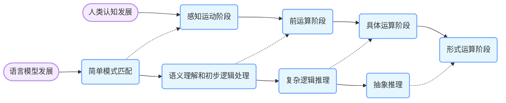

# 语言模型推理能力的认知发展阶段相关性研究

> 关键词：语言模型、推理能力、认知发展阶段、相关性、人工智能

> 摘要：本文旨在深入探究语言模型推理能力与认知发展阶段之间的相关性。通过对语言模型推理能力的原理剖析、认知发展阶段理论的介绍，运用数学模型、算法原理以及项目实战等多方面的研究方法，揭示两者之间潜在的联系。这不仅有助于理解语言模型的发展现状和局限性，也能为语言模型的优化和发展提供新的思路，同时为认知发展理论在人工智能领域的应用提供实证支持。

## 1. 背景介绍 
### 1.1 目的和范围
本研究的主要目的是全面且深入地探讨语言模型推理能力和认知发展阶段之间的相关性。范围涵盖了多种常见的语言模型，如基于Transformer架构的GPT系列、BERT等，以及经典的认知发展阶段理论，包括皮亚杰的认知发展阶段理论、维果茨基的社会文化发展理论等。通过对这些模型和理论的研究，分析语言模型在不同推理任务中的表现与人类认知发展阶段特征的相似性和差异性。

### 1.2 预期读者
本文预期读者包括人工智能领域的研究人员、学者，对语言模型和认知科学交叉领域感兴趣的学生，以及从事自然语言处理相关工作的工程师和技术人员。对于希望深入了解语言模型内部机制和认知发展理论在人工智能中应用的人士，本文将提供有价值的参考。

### 1.3 文档结构概述
本文首先介绍研究的背景信息，包括目的、预期读者和文档结构。接着阐述核心概念，即语言模型推理能力和认知发展阶段的原理与联系。然后详细讲解核心算法原理和具体操作步骤，运用Python代码进行说明。之后介绍相关的数学模型和公式，并举例说明。通过项目实战，展示代码实现和解读。再探讨实际应用场景，推荐相关的工具和资源。最后总结未来发展趋势与挑战，提供常见问题解答和扩展阅读参考资料。

### 1.4 术语表
#### 1.4.1 核心术语定义
- **语言模型**：是一种概率模型，用于计算自然语言中一系列单词出现的概率分布。它可以根据已有的文本预测下一个可能出现的单词，从而生成自然语言文本。
- **推理能力**：在语言模型中，推理能力指的是模型根据给定的文本信息，进行逻辑推导、知识运用和问题解决的能力。
- **认知发展阶段**：是指个体在认知能力发展过程中所经历的不同阶段，每个阶段具有独特的认知特征和能力水平。

#### 1.4.2 相关概念解释
- **Transformer架构**：是一种基于自注意力机制的深度学习架构，广泛应用于语言模型中。它能够有效地处理序列数据，捕捉长距离依赖关系。
- **自注意力机制**：是Transformer架构中的核心组件，它允许模型在处理序列数据时，根据不同位置的元素之间的相关性，动态地分配注意力权重，从而更好地理解序列的语义信息。

#### 1.4.3 缩略词列表
- **GPT**：Generative Pretrained Transformer，生成式预训练Transformer。
- **BERT**：Bidirectional Encoder Representations from Transformers，基于Transformer的双向编码器表示。
- **NLP**：Natural Language Processing，自然语言处理。

## 2. 核心概念与联系 
### 2.1 语言模型推理能力原理
语言模型的推理能力基于其对大量文本数据的学习和建模。通过在大规模语料库上进行预训练，语言模型学习到了语言的统计规律和语义信息。在推理过程中，模型根据输入的文本，结合自身学习到的知识，预测下一个可能的单词或生成相应的回答。

例如，在问答系统中，语言模型会根据问题文本，在其知识图谱或预训练的语言表示中查找相关信息，然后进行推理和生成答案。其推理过程可以看作是一个概率计算的过程，模型会选择概率最大的输出作为最终结果。

### 2.2 认知发展阶段理论
#### 2.2.1 皮亚杰的认知发展阶段理论
皮亚杰将儿童的认知发展分为四个阶段：
- **感知运动阶段（0 - 2岁）**：儿童主要通过感知和动作来认识世界，逐渐形成客体永久性的概念。
- **前运算阶段（2 - 7岁）**：儿童开始使用符号和语言来表征事物，但思维具有自我中心性和不可逆性。
- **具体运算阶段（7 - 11岁）**：儿童能够进行具体的逻辑运算，但需要具体事物的支持。
- **形式运算阶段（11岁及以上）**：儿童能够进行抽象的逻辑推理和假设演绎思维。

#### 2.2.2 维果茨基的社会文化发展理论
维果茨基强调社会文化因素在认知发展中的重要作用。他认为儿童的认知发展是在与他人的互动和社会文化环境的影响下进行的。儿童通过与成人或更有能力的同伴的合作学习，逐渐掌握高级的认知技能。

### 2.3 语言模型推理能力与认知发展阶段的联系
语言模型的推理能力发展可以类比于人类认知发展阶段。在早期的语言模型中，其推理能力类似于儿童的感知运动阶段，主要基于简单的模式匹配和统计信息进行预测。随着模型的不断发展和改进，其推理能力逐渐提高，类似于儿童进入前运算阶段和具体运算阶段，能够处理更复杂的语义信息和逻辑关系。而一些先进的语言模型，如GPT - 3等，在某些方面表现出了类似于形式运算阶段的抽象推理能力，但仍然存在一定的局限性。

### 2.4 文本示意图
```plaintext
语言模型推理能力与认知发展阶段联系

| 语言模型推理能力阶段 | 认知发展阶段 | 特征 |
| --- | --- | --- |
| 简单模式匹配 | 感知运动阶段 | 基于统计信息预测，依赖输入数据 |
| 语义理解和初步逻辑处理 | 前运算阶段 | 开始处理语义信息，存在一定局限性 |
| 复杂逻辑推理 | 具体运算阶段 | 能够处理复杂逻辑关系，需要具体信息支持 |
| 抽象推理 | 形式运算阶段 | 具备一定抽象推理能力，但不完全成熟 |
```

### 2.5 Mermaid流程图


## 3. 核心算法原理 & 具体操作步骤 
### 3.1 语言模型推理算法原理
以基于Transformer架构的语言模型为例，其核心算法原理主要包括自注意力机制和前馈神经网络。

#### 3.1.1 自注意力机制
自注意力机制允许模型在处理输入序列时，根据不同位置的元素之间的相关性，动态地分配注意力权重。具体来说，对于输入序列 $X = [x_1, x_2, ..., x_n]$，自注意力机制会计算每个位置的查询（Query）、键（Key）和值（Value）向量，然后通过计算查询和键之间的相似度来得到注意力权重，最后将注意力权重与值向量加权求和得到输出。

以下是Python代码实现自注意力机制的示例：
```python
import torch
import torch.nn as nn
import torch.nn.functional as F

class SelfAttention(nn.Module):
    def __init__(self, input_dim, d_k, d_v):
        super(SelfAttention, self).__init__()
        self.W_q = nn.Linear(input_dim, d_k)
        self.W_k = nn.Linear(input_dim, d_k)
        self.W_v = nn.Linear(input_dim, d_v)

    def forward(self, X):
        Q = self.W_q(X)
        K = self.W_k(X)
        V = self.W_v(X)

        attn_scores = torch.matmul(Q, K.transpose(-2, -1)) / torch.sqrt(torch.tensor(Q.size(-1), dtype=torch.float32))
        attn_probs = F.softmax(attn_scores, dim=-1)
        output = torch.matmul(attn_probs, V)
        return output
```

#### 3.1.2 前馈神经网络
前馈神经网络是Transformer架构中的另一个重要组件，它由两个线性层和一个激活函数组成。其作用是对自注意力机制的输出进行非线性变换，增强模型的表达能力。

以下是Python代码实现前馈神经网络的示例：
```python
class FeedForward(nn.Module):
    def __init__(self, input_dim, hidden_dim):
        super(FeedForward, self).__init__()
        self.fc1 = nn.Linear(input_dim, hidden_dim)
        self.fc2 = nn.Linear(hidden_dim, input_dim)
        self.relu = nn.ReLU()

    def forward(self, x):
        x = self.fc1(x)
        x = self.relu(x)
        x = self.fc2(x)
        return x
```

### 3.2 具体操作步骤
#### 3.2.1 数据预处理
首先，需要对输入的文本数据进行预处理，包括分词、词嵌入等操作。分词是将文本拆分成单个的单词或子词，词嵌入是将每个单词或子词转换为对应的向量表示。

```python
import torch
from transformers import AutoTokenizer

tokenizer = AutoTokenizer.from_pretrained('bert-base-uncased')
text = "This is an example sentence."
tokens = tokenizer(text, return_tensors='pt')
```

#### 3.2.2 模型推理
将预处理后的输入数据输入到语言模型中进行推理。模型会根据输入数据生成相应的输出，如预测的下一个单词或生成的回答。

```python
from transformers import AutoModelForCausalLM

model = AutoModelForCausalLM.from_pretrained('gpt2')
output = model(**tokens)
```

#### 3.2.3 后处理
对模型的输出进行后处理，如解码生成的单词序列，将其转换为自然语言文本。

```python
generated_ids = output.logits.argmax(dim=-1)
generated_text = tokenizer.decode(generated_ids[0])
print(generated_text)
```

## 4. 数学模型和公式 & 详细讲解 & 举例说明 
### 4.1 自注意力机制数学模型
自注意力机制的核心是计算注意力权重和加权求和。假设输入序列 $X = [x_1, x_2, ..., x_n]$，其中 $x_i \in \mathbb{R}^d$ 表示第 $i$ 个位置的输入向量。查询（Query）、键（Key）和值（Value）向量分别通过线性变换得到：

$$Q = XW_q$$
$$K = XW_k$$
$$V = XW_v$$

其中 $W_q \in \mathbb{R}^{d \times d_k}$，$W_k \in \mathbb{R}^{d \times d_k}$，$W_v \in \mathbb{R}^{d \times d_v}$ 是可学习的权重矩阵。

注意力分数计算如下：

$$\text{Attention}(Q, K, V) = \text{softmax}\left(\frac{QK^T}{\sqrt{d_k}}\right)V$$

### 4.2 详细讲解
- **查询、键和值向量**：查询向量用于表示当前位置的信息，键向量用于表示其他位置的信息，值向量用于表示其他位置的特征。
- **注意力分数**：通过计算查询和键之间的点积来得到注意力分数，点积越大表示两个位置之间的相关性越强。
- **缩放因子**：$\sqrt{d_k}$ 是缩放因子，用于防止点积过大，避免梯度消失或爆炸问题。
- **Softmax函数**：将注意力分数进行归一化处理，得到注意力权重，使得所有位置的注意力权重之和为1。

### 4.3 举例说明
假设输入序列 $X = \begin{bmatrix}1 & 2 \\ 3 & 4 \\ 5 & 6\end{bmatrix}$，$d = 2$，$d_k = d_v = 2$。

$$W_q = \begin{bmatrix}0.1 & 0.2 \\ 0.3 & 0.4\end{bmatrix}$$
$$W_k = \begin{bmatrix}0.5 & 0.6 \\ 0.7 & 0.8\end{bmatrix}$$
$$W_v = \begin{bmatrix}0.9 & 1.0 \\ 1.1 & 1.2\end{bmatrix}$$

计算查询、键和值向量：

$$Q = XW_q = \begin{bmatrix}1 & 2 \\ 3 & 4 \\ 5 & 6\end{bmatrix}\begin{bmatrix}0.1 & 0.2 \\ 0.3 & 0.4\end{bmatrix} = \begin{bmatrix}0.7 & 1.0 \\ 1.5 & 2.2 \\ 2.3 & 3.4\end{bmatrix}$$

$$K = XW_k = \begin{bmatrix}1 & 2 \\ 3 & 4 \\ 5 & 6\end{bmatrix}\begin{bmatrix}0.5 & 0.6 \\ 0.7 & 0.8\end{bmatrix} = \begin{bmatrix}1.9 & 2.2 \\ 4.3 & 5.0 \\ 6.7 & 7.8\end{bmatrix}$$

$$V = XW_v = \begin{bmatrix}1 & 2 \\ 3 & 4 \\ 5 & 6\end{bmatrix}\begin{bmatrix}0.9 & 1.0 \\ 1.1 & 1.2\end{bmatrix} = \begin{bmatrix}3.1 & 3.4 \\ 7.1 & 7.8 \\ 11.1 & 12.2\end{bmatrix}$$

计算注意力分数：

$$QK^T = \begin{bmatrix}0.7 & 1.0 \\ 1.5 & 2.2 \\ 2.3 & 3.4\end{bmatrix}\begin{bmatrix}1.9 & 4.3 & 6.7 \\ 2.2 & 5.0 & 7.8\end{bmatrix} = \begin{bmatrix}3.53 & 8.11 & 12.19 \\ 7.79 & 17.95 & 27.01 \\ 11.95 & 27.79 & 42.01\end{bmatrix}$$

$$\frac{QK^T}{\sqrt{d_k}} = \begin{bmatrix}2.50 & 5.73 & 8.62 \\ 5.51 & 12.70 & 19.09 \\ 8.45 & 19.65 & 29.69\end{bmatrix}$$

计算注意力权重：

$$\text{softmax}\left(\frac{QK^T}{\sqrt{d_k}}\right) = \begin{bmatrix}0.00 & 0.03 & 0.97 \\ 0.00 & 0.07 & 0.93 \\ 0.00 & 0.10 & 0.90\end{bmatrix}$$

计算加权求和：

$$\text{Attention}(Q, K, V) = \begin{bmatrix}0.00 & 0.03 & 0.97 \\ 0.00 & 0.07 & 0.93 \\ 0.00 & 0.10 & 0.90\end{bmatrix}\begin{bmatrix}3.1 & 3.4 \\ 7.1 & 7.8 \\ 11.1 & 12.2\end{bmatrix} = \begin{bmatrix}10.8 & 11.9 \\ 10.8 & 11.9 \\ 10.8 & 11.9\end{bmatrix}$$

## 5. 项目实战：代码实际案例和详细解释说明 
### 5.1  开发环境搭建
#### 5.1.1 安装Python
首先，确保你已经安装了Python 3.6或更高版本。可以从Python官方网站（https://www.python.org/downloads/） 下载并安装。

#### 5.1.2 安装深度学习框架
我们使用PyTorch作为深度学习框架，可以通过以下命令安装：
```sh
pip install torch torchvision
```

#### 5.1.3 安装自然语言处理库
安装Hugging Face的transformers库，它提供了许多预训练的语言模型和工具：
```sh
pip install transformers
```

### 5.2  源代码详细实现和代码解读
#### 5.2.1 文本生成任务
以下是一个使用GPT - 2模型进行文本生成的示例代码：
```python
from transformers import AutoTokenizer, AutoModelForCausalLM

# 加载预训练的tokenizer和模型
tokenizer = AutoTokenizer.from_pretrained('gpt2')
model = AutoModelForCausalLM.from_pretrained('gpt2')

# 输入文本
input_text = "Once upon a time"

# 对输入文本进行编码
input_ids = tokenizer.encode(input_text, return_tensors='pt')

# 生成文本
output = model.generate(input_ids, max_length=100, num_return_sequences=1)

# 解码生成的文本
generated_text = tokenizer.decode(output[0], skip_special_tokens=True)

print(generated_text)
```

#### 5.2.2 代码解读
- **加载预训练的tokenizer和模型**：使用 `AutoTokenizer.from_pretrained` 和 `AutoModelForCausalLM.from_pretrained` 函数加载预训练的GPT - 2 tokenizer和模型。
- **输入文本编码**：使用 `tokenizer.encode` 函数将输入文本转换为模型可以接受的输入ID序列。
- **文本生成**：使用 `model.generate` 函数生成文本，`max_length` 参数指定生成文本的最大长度，`num_return_sequences` 参数指定生成的文本序列数量。
- **解码生成的文本**：使用 `tokenizer.decode` 函数将生成的ID序列解码为自然语言文本。

### 5.3  代码解读与分析
#### 5.3.1 模型选择
选择GPT - 2模型是因为它是一个强大的生成式语言模型，能够生成高质量的自然语言文本。不同的语言模型具有不同的特点和适用场景，可以根据具体需求选择合适的模型。

#### 5.3.2 超参数调整
`max_length` 和 `num_return_sequences` 是两个重要的超参数。`max_length` 影响生成文本的长度，`num_return_sequences` 影响生成的文本序列数量。可以根据具体任务和需求调整这些超参数。

#### 5.3.3 性能优化
在实际应用中，可以通过使用GPU加速、批量处理等方法来提高模型的推理速度和性能。

## 6. 实际应用场景 
### 6.1 智能客服
语言模型的推理能力可以应用于智能客服系统中。当用户提出问题时，智能客服可以利用语言模型的推理能力理解用户的意图，从知识库中查找相关信息，并生成准确的回答。例如，在电商平台的智能客服中，用户询问商品的价格、规格等问题，智能客服可以根据用户的问题进行推理和回答。

### 6.2 智能写作辅助
语言模型可以为写作人员提供智能写作辅助。在写作过程中，语言模型可以根据上下文信息，为写作人员提供词汇、句子结构、段落组织等方面的建议。例如，在撰写论文时，语言模型可以帮助作者查找相关的文献资料，提供论证思路和语言表达的优化建议。

### 6.3 机器翻译
在机器翻译中，语言模型的推理能力可以帮助翻译系统更好地理解源语言的语义和语法结构，从而生成更准确、自然的目标语言翻译结果。例如，在翻译一篇科技文章时，语言模型可以根据科技领域的专业知识和上下文信息，准确翻译专业术语和复杂句子。

### 6.4 教育领域
在教育领域，语言模型可以作为智能辅导工具，帮助学生解决学习中的问题。例如，在数学、物理等学科的学习中，语言模型可以根据学生提出的问题，进行推理和解答，提供解题思路和步骤。

## 7. 工具和资源推荐
### 7.1 学习资源推荐
#### 7.1.1 书籍推荐
- 《深度学习》（Deep Learning）：由Ian Goodfellow、Yoshua Bengio和Aaron Courville合著，是深度学习领域的经典教材，涵盖了深度学习的基本原理、算法和应用。
- 《自然语言处理入门》：作者何晗，适合初学者了解自然语言处理的基本概念和方法。
- 《人工智能：一种现代的方法》（Artificial Intelligence: A Modern Approach）：由Stuart Russell和Peter Norvig合著，是人工智能领域的权威教材，全面介绍了人工智能的各个方面。

#### 7.1.2 在线课程
- Coursera上的“深度学习专项课程”（Deep Learning Specialization）：由Andrew Ng教授授课，系统地介绍了深度学习的理论和实践。
- edX上的“自然语言处理基础”（Foundations of Natural Language Processing）：提供了自然语言处理的基础知识和技术。
- 哔哩哔哩（Bilibili）上有许多关于语言模型和人工智能的教学视频，可以帮助学习者快速入门。

#### 7.1.3 技术博客和网站
- Hugging Face博客（https://huggingface.co/blog）：提供了关于语言模型和自然语言处理的最新研究成果和技术分享。
- arXiv（https://arxiv.org/）：是一个预印本论文库，包含了大量关于人工智能和自然语言处理的研究论文。
- Medium上的人工智能和自然语言处理相关专栏：有许多专业人士分享的技术文章和实践经验。

### 7.2 开发工具框架推荐
#### 7.2.1 IDE和编辑器
- PyCharm：是一款功能强大的Python集成开发环境，提供了代码编辑、调试、版本控制等功能。
- Visual Studio Code：是一款轻量级的代码编辑器，支持多种编程语言和插件扩展，适合快速开发和调试。

#### 7.2.2 调试和性能分析工具
- TensorBoard：是TensorFlow的可视化工具，可以帮助用户可视化模型的训练过程、性能指标等。
- PyTorch Profiler：是PyTorch的性能分析工具，可以帮助用户分析模型的性能瓶颈和优化方向。

#### 7.2.3 相关框架和库
- Hugging Face Transformers：提供了许多预训练的语言模型和工具，方便用户进行自然语言处理任务的开发。
- AllenNLP：是一个深度学习框架，专注于自然语言处理任务，提供了许多预训练的模型和工具。
- spaCy：是一个高效的自然语言处理库，提供了分词、词性标注、命名实体识别等功能。

### 7.3 相关论文著作推荐
#### 7.3.1 经典论文
- “Attention Is All You Need”：提出了Transformer架构，是自然语言处理领域的重要里程碑。
- “BERT: Pre-training of Deep Bidirectional Transformers for Language Understanding”：介绍了BERT模型，开创了预训练语言模型的先河。
- “Generative Pretrained Transformer 3 (GPT - 3): Language Models are Few - Shot Learners”：介绍了GPT - 3模型，展示了语言模型在少样本学习方面的强大能力。

#### 7.3.2 最新研究成果
- 关注arXiv上关于语言模型推理能力和认知发展阶段相关性的最新研究论文，了解该领域的前沿动态。
- 参加国际人工智能和自然语言处理领域的学术会议，如ACL（Association for Computational Linguistics）、EMNLP（Conference on Empirical Methods in Natural Language Processing）等，获取最新的研究成果。

#### 7.3.3 应用案例分析
- 研究工业界和学术界的语言模型应用案例，了解语言模型在不同领域的实际应用和效果。
- 分析一些开源的语言模型项目，学习其实现思路和技术细节。

## 8. 总结：未来发展趋势与挑战
### 8.1 未来发展趋势
#### 8.1.1 更强的推理能力
未来的语言模型将不断提高其推理能力，能够处理更复杂的逻辑关系和抽象问题。例如，在科学研究、法律推理等领域，语言模型将能够提供更准确、深入的推理和分析。

#### 8.1.2 与认知科学的深度融合
语言模型的发展将与认知科学更加紧密地结合，借鉴人类认知发展的规律和机制，优化语言模型的架构和算法。例如，通过模拟人类的注意力机制、记忆机制等，提高语言模型的学习效率和推理能力。

#### 8.1.3 多模态融合
未来的语言模型将不仅仅局限于文本处理，还将与图像、音频等多模态数据进行融合。例如，在智能客服系统中，用户可以通过语音或图像提出问题，语言模型能够综合处理多模态信息，提供更准确的回答。

### 8.2 挑战
#### 8.2.1 数据质量和多样性
语言模型的性能高度依赖于训练数据的质量和多样性。如何获取高质量、多样化的训练数据，以及如何处理数据中的噪声和偏差，是当前面临的挑战之一。

#### 8.2.2 可解释性和透明度
语言模型的推理过程往往是黑盒的，难以理解其决策依据。提高语言模型的可解释性和透明度，使其推理过程能够被人类理解和信任，是未来需要解决的重要问题。

#### 8.2.3 伦理和安全问题
随着语言模型的广泛应用，伦理和安全问题也日益凸显。例如，语言模型可能生成虚假信息、歧视性内容等，如何确保语言模型的应用符合伦理和法律要求，是亟待解决的问题。

## 9. 附录：常见问题与解答
### 9.1 语言模型的推理能力与人类的推理能力有哪些区别？
语言模型的推理能力主要基于其对大量文本数据的学习和统计规律，缺乏真正的理解和认知能力。而人类的推理能力是基于对世界的感知、理解和知识的积累，具有主观意识和创造性。

### 9.2 如何评估语言模型的推理能力？
可以通过一些基准测试数据集和任务来评估语言模型的推理能力，如GLUE（General Language Understanding Evaluation）、SuperGLUE等。这些数据集包含了多种类型的推理任务，如文本分类、自然语言推理等。

### 9.3 语言模型的推理能力可以通过训练不断提高吗？
是的，语言模型的推理能力可以通过不断扩大训练数据规模、改进训练算法和模型架构等方式来提高。但同时也受到计算资源、数据质量等因素的限制。

### 9.4 语言模型的推理能力在不同领域的应用效果如何？
语言模型的推理能力在不同领域的应用效果有所差异。在一些规则明确、数据丰富的领域，如智能客服、机器翻译等，语言模型的应用效果较好；而在一些复杂、专业的领域，如科学研究、法律推理等，还需要进一步提高语言模型的推理能力和专业知识。

## 10. 扩展阅读 & 参考资料
### 10.1 扩展阅读
- 《思考，快与慢》（Thinking, Fast and Slow）：作者Daniel Kahneman，介绍了人类的两种思维模式，对理解人类的认知和推理过程有很大帮助。
- 《人类认知与机器学习》（Human Cognition and Machine Learning）：探讨了人类认知和机器学习之间的关系，为语言模型的发展提供了新的思路。

### 10.2 参考资料
- Hugging Face官方文档（https://huggingface.co/docs）
- PyTorch官方文档（https://pytorch.org/docs/stable/index.html）
- 相关学术论文和研究报告

通过以上对语言模型推理能力的认知发展阶段相关性的研究，我们深入了解了两者之间的联系和潜在的应用价值。未来，随着技术的不断发展和研究的深入，语言模型的推理能力将不断提高，为人工智能的发展和应用带来更多的可能性。同时，我们也需要关注语言模型发展过程中面临的挑战，确保其健康、可持续地发展。