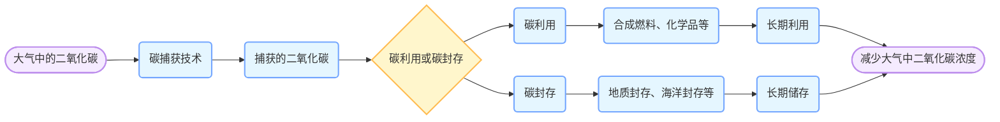

# 负碳技术的发展前景与投资风险分析

> 关键词：负碳技术、发展前景、投资风险、气候变化、碳捕获、碳封存

> 摘要：本文聚焦于负碳技术的发展前景与投资风险。随着全球对气候变化问题的日益关注，负碳技术作为实现碳中和目标的关键手段，具有巨大的发展潜力。文章首先介绍负碳技术的背景，包括目的、预期读者、文档结构和相关术语。接着阐述负碳技术的核心概念与联系，详细讲解核心算法原理和操作步骤，运用数学模型和公式进行深入分析，并结合实际案例说明。随后探讨负碳技术的实际应用场景，推荐相关学习资源、开发工具和论文著作。最后总结负碳技术的未来发展趋势与挑战，解答常见问题，并提供扩展阅读和参考资料，旨在为读者全面呈现负碳技术的多方面信息，为相关投资者和研究人员提供决策依据。

## 1. 背景介绍 
### 1.1 目的和范围
在全球气候变暖的大背景下，减少温室气体排放、实现碳中和已成为国际社会的共识。负碳技术作为一种能够从大气中去除二氧化碳并将其永久储存的技术，对于应对气候变化具有至关重要的意义。本文的目的在于全面分析负碳技术的发展前景以及投资该领域可能面临的风险，涵盖了负碳技术的多个方面，包括技术原理、应用场景、市场潜力以及投资环境等，旨在为投资者、政策制定者和相关研究人员提供有价值的参考。

### 1.2 预期读者
本文的预期读者包括但不限于以下几类人群：
- **投资者**：对新兴技术领域有投资意向，希望了解负碳技术投资机会和风险的个人或机构投资者。
- **政策制定者**：负责制定能源、环境和气候政策的政府官员和相关决策人员，以便更好地引导和支持负碳技术的发展。
- **科研人员**：从事气候变化、能源环境等领域研究的科研工作者，有助于他们了解负碳技术的最新发展动态和研究方向。
- **企业管理者**：能源、化工、环保等行业的企业管理者，关注负碳技术对企业战略和运营的影响。

### 1.3 文档结构概述
本文将按照以下结构进行阐述：
- 核心概念与联系：介绍负碳技术的基本概念、原理和架构，通过文本示意图和 Mermaid 流程图进行直观展示。
- 核心算法原理 & 具体操作步骤：详细讲解负碳技术的核心算法原理，并给出具体的操作步骤，同时使用 Python 源代码进行阐述。
- 数学模型和公式 & 详细讲解 & 举例说明：运用数学模型和公式对负碳技术进行深入分析，并结合实际例子进行说明。
- 项目实战：代码实际案例和详细解释说明，包括开发环境搭建、源代码实现和代码解读。
- 实际应用场景：探讨负碳技术在不同领域的实际应用场景。
- 工具和资源推荐：推荐相关的学习资源、开发工具和论文著作。
- 总结：未来发展趋势与挑战：总结负碳技术的未来发展趋势和可能面临的挑战。
- 附录：常见问题与解答：解答读者可能关心的常见问题。
- 扩展阅读 & 参考资料：提供相关的扩展阅读材料和参考资料。

### 1.4 术语表
#### 1.4.1 核心术语定义
- **负碳技术**：指从大气中去除二氧化碳并将其永久储存，从而实现净碳移除的技术。
- **碳捕获**：指将二氧化碳从工业或其他排放源中分离和收集的过程。
- **碳封存**：指将捕获的二氧化碳安全地储存于地下或其他长期储存场所的过程。
- **碳中和**：指企业、团体或个人测算在一定时间内直接或间接产生的温室气体排放总量，通过植树造林、节能减排等形式，以抵消自身产生的二氧化碳排放量，实现二氧化碳“零排放”。

#### 1.4.2 相关概念解释
- **生物能源与碳捕获和封存（BECCS）**：将生物质能发电与碳捕获和封存技术相结合，在生产能源的同时实现碳的负排放。
- **直接空气捕获（DAC）**：通过化学或物理方法直接从大气中捕获二氧化碳的技术。
- **增强风化**：通过加速岩石的自然风化过程，使岩石中的矿物质与二氧化碳发生反应，从而将二氧化碳固定在岩石中。

#### 1.4.3 缩略词列表
- **CCS**：碳捕获与封存（Carbon Capture and Storage）
- **BECCS**：生物能源与碳捕获和封存（Bioenergy with Carbon Capture and Storage）
- **DAC**：直接空气捕获（Direct Air Capture）

## 2. 核心概念与联系 
负碳技术的核心目标是减少大气中的二氧化碳浓度，实现净碳移除。其主要原理基于碳捕获、碳利用和碳封存三个关键环节。

### 文本示意图
负碳技术的核心概念可以用以下文本示意图表示：

大气中的二氧化碳 -> 碳捕获技术（如直接空气捕获、工业源捕获等） -> 捕获的二氧化碳 -> 碳利用（如合成燃料、化学品等）或碳封存（如地质封存、海洋封存等） -> 长期储存或利用，减少大气中二氧化碳浓度

### Mermaid 流程图


### 核心概念原理
- **碳捕获**：通过物理、化学或生物方法，将二氧化碳从排放源或大气中分离和捕获。常见的碳捕获技术包括吸收法、吸附法、膜分离法等。吸收法是利用化学吸收剂与二氧化碳发生化学反应，将其从气体混合物中分离出来；吸附法是利用吸附剂对二氧化碳的吸附作用进行分离；膜分离法是利用特殊的膜材料对二氧化碳的选择性透过性进行分离。
- **碳利用**：将捕获的二氧化碳转化为有价值的产品或材料，实现二氧化碳的资源化利用。常见的碳利用方式包括合成燃料（如甲醇、甲烷等）、化学品（如尿素、碳酸酯等）、建筑材料（如混凝土）等。
- **碳封存**：将捕获的二氧化碳安全地储存于地下或其他长期储存场所，防止其重新释放到大气中。常见的碳封存方式包括地质封存（如深部咸水层、枯竭油气田等）、海洋封存（如深海储存）等。

这些核心概念之间相互关联，形成一个完整的负碳技术体系。碳捕获是负碳技术的基础，为后续的碳利用和碳封存提供原料；碳利用可以实现二氧化碳的资源化利用，降低负碳技术的成本；碳封存则是实现二氧化碳长期储存和减排的关键环节。

## 3. 核心算法原理 & 具体操作步骤 
### 碳捕获算法原理及 Python 实现
以吸收法碳捕获为例，其基本原理是利用化学吸收剂（如胺类溶液）与二氧化碳发生化学反应，将其从气体混合物中吸收。反应方程式如下：

$CO_2 + 2RNH_2 \rightleftharpoons RNHCOO^- + RNH_3^+$

其中，$RNH_2$ 表示胺类吸收剂。

下面是一个简单的 Python 代码示例，用于模拟吸收法碳捕获过程中的二氧化碳吸收量计算：

```python
# 定义吸收剂的相关参数
amine_concentration = 1.0  # 胺类吸收剂的浓度，单位：mol/L
absorber_volume = 10.0  # 吸收器的体积，单位：m^3
gas_flow_rate = 100.0  # 气体的流量，单位：m^3/h
co2_initial_concentration = 0.1  # 气体中二氧化碳的初始浓度，单位：mol/m^3
reaction_rate_constant = 0.1  # 反应速率常数，单位：L/(mol*h)

# 计算吸收剂的物质的量
amine_amount = amine_concentration * absorber_volume

# 模拟吸收过程，计算不同时间的二氧化碳吸收量
time_points = [i for i in range(0, 10, 1)]  # 时间点，单位：h
co2_absorbed_amounts = []

for time in time_points:
    # 根据反应速率方程计算二氧化碳的吸收量
    co2_absorbed_amount = gas_flow_rate * co2_initial_concentration * (1 - math.exp(-reaction_rate_constant * time))
    co2_absorbed_amounts.append(co2_absorbed_amount)

# 输出结果
for i in range(len(time_points)):
    print(f"时间: {time_points[i]} h, 二氧化碳吸收量: {co2_absorbed_amounts[i]} mol")
```

### 具体操作步骤
1. **气体预处理**：对含有二氧化碳的气体进行预处理，去除其中的杂质和有害物质，以提高碳捕获的效率和吸收剂的使用寿命。
2. **吸收过程**：将预处理后的气体通入吸收器中，与吸收剂充分接触，使二氧化碳与吸收剂发生化学反应，被吸收到吸收剂中。
3. **解吸过程**：将吸收了二氧化碳的吸收剂送入解吸器中，通过加热或减压等方式使二氧化碳从吸收剂中解吸出来，实现吸收剂的再生。
4. **二氧化碳处理**：对解吸出的二氧化碳进行进一步处理，如压缩、净化等，以便进行后续的碳利用或碳封存。

### 碳利用算法原理及 Python 实现
以二氧化碳合成甲醇为例，其基本反应方程式如下：

$CO_2 + 3H_2 \rightleftharpoons CH_3OH + H_2O$

下面是一个简单的 Python 代码示例，用于模拟二氧化碳合成甲醇过程中的甲醇产量计算：

```python
# 定义反应的相关参数
co2_amount = 10.0  # 二氧化碳的物质的量，单位：mol
h2_amount = 30.0  # 氢气的物质的量，单位：mol
reaction_yield = 0.8  # 反应的产率

# 计算理论上甲醇的产量
if co2_amount / 1 < h2_amount / 3:
    theoretical_methanol_amount = co2_amount
else:
    theoretical_methanol_amount = h2_amount / 3

# 计算实际甲醇的产量
actual_methanol_amount = theoretical_methanol_amount * reaction_yield

print(f"实际甲醇产量: {actual_methanol_amount} mol")
```

### 具体操作步骤
1. **原料准备**：准备好二氧化碳和氢气等原料，并对其进行净化和预处理，以保证反应的顺利进行。
2. **反应过程**：将二氧化碳和氢气按一定比例通入反应器中，在催化剂的作用下发生反应，生成甲醇。
3. **产物分离**：对反应后的产物进行分离和提纯，得到高纯度的甲醇产品。
4. **催化剂再生**：对使用后的催化剂进行再生处理，以延长其使用寿命和提高反应效率。

### 碳封存算法原理及 Python 实现
以地质封存为例，其基本原理是将二氧化碳注入地下深部咸水层或枯竭油气田中，利用岩石的孔隙结构和密封性将其长期储存。

下面是一个简单的 Python 代码示例，用于模拟地质封存过程中二氧化碳的注入量和储存量计算：

```python
# 定义地质封存的相关参数
formation_volume = 1000.0  # 地质储层的体积，单位：m^3
porosity = 0.2  # 地质储层的孔隙度
injection_rate = 10.0  # 二氧化碳的注入速率，单位：m^3/h
time = 10.0  # 注入时间，单位：h

# 计算地质储层的有效储存体积
effective_storage_volume = formation_volume * porosity

# 计算二氧化碳的注入量
injection_amount = injection_rate * time

# 计算二氧化碳的储存量
if injection_amount <= effective_storage_volume:
    storage_amount = injection_amount
else:
    storage_amount = effective_storage_volume

print(f"二氧化碳注入量: {injection_amount} m^3, 二氧化碳储存量: {storage_amount} m^3")
```

### 具体操作步骤
1. **储层评估**：对地质储层进行详细的评估和勘探，确定其储存能力、密封性和稳定性等参数。
2. **井的建设**：在选定的地质储层上建设注入井和监测井，用于二氧化碳的注入和监测。
3. **二氧化碳注入**：将经过处理的二氧化碳通过注入井注入地质储层中，控制注入速率和压力，确保二氧化碳能够安全、有效地储存。
4. **监测与管理**：对地质储层进行长期的监测和管理，实时监测二氧化碳的储存情况和地质环境的变化，及时发现和处理可能出现的问题。

## 4. 数学模型和公式 & 详细讲解 & 举例说明 
### 碳捕获数学模型
#### 吸收法碳捕获模型
吸收法碳捕获过程可以用传质和反应动力学模型来描述。以气液吸收过程为例，二氧化碳从气相向液相的传质速率可以用双膜理论来描述：

$N_{CO_2} = k_g (p_{CO_2} - p_{CO_2}^*) = k_l (C_{CO_2}^* - C_{CO_2})$

其中，$N_{CO_2}$ 是二氧化碳的传质速率，$k_g$ 和 $k_l$ 分别是气膜和液膜的传质系数，$p_{CO_2}$ 是气相中二氧化碳的分压，$p_{CO_2}^*$ 是与液相中二氧化碳浓度平衡的气相分压，$C_{CO_2}^*$ 是与气相中二氧化碳分压平衡的液相中二氧化碳浓度，$C_{CO_2}$ 是液相中二氧化碳的实际浓度。

反应动力学方程可以表示为：

$\frac{dC_{CO_2}}{dt} = -r = -kC_{CO_2}^m C_{amine}^n$

其中，$r$ 是反应速率，$k$ 是反应速率常数，$m$ 和 $n$ 分别是二氧化碳和胺类吸收剂的反应级数，$C_{amine}$ 是胺类吸收剂的浓度。

#### 举例说明
假设在一个吸收塔中，气相中二氧化碳的分压为 $0.1$ atm，气膜传质系数 $k_g = 0.01$ mol/(m²·s·atm)，液膜传质系数 $k_l = 0.001$ m/s，与液相中二氧化碳浓度平衡的气相分压 $p_{CO_2}^* = 0.01$ atm，与气相中二氧化碳分压平衡的液相中二氧化碳浓度 $C_{CO_2}^* = 0.1$ mol/m³，液相中二氧化碳的实际浓度 $C_{CO_2} = 0.01$ mol/m³。

则二氧化碳的传质速率为：

$N_{CO_2} = k_g (p_{CO_2} - p_{CO_2}^*) = 0.01 \times (0.1 - 0.01) = 9 \times 10^{-4}$ mol/(m²·s)

### 碳利用数学模型
#### 二氧化碳合成甲醇模型
二氧化碳合成甲醇的反应可以用化学平衡和反应动力学模型来描述。化学平衡常数 $K_p$ 可以表示为：

$K_p = \frac{p_{CH_3OH} p_{H_2O}}{p_{CO_2} p_{H_2}^3}$

其中，$p_{CH_3OH}$、$p_{H_2O}$、$p_{CO_2}$ 和 $p_{H_2}$ 分别是甲醇、水、二氧化碳和氢气的分压。

反应动力学方程可以表示为：

$\frac{dC_{CH_3OH}}{dt} = r = kC_{CO_2} C_{H_2}^3$

其中，$r$ 是反应速率，$k$ 是反应速率常数，$C_{CO_2}$ 和 $C_{H_2}$ 分别是二氧化碳和氢气的浓度。

#### 举例说明
假设在一个反应器中，二氧化碳的初始分压为 $1$ atm，氢气的初始分压为 $3$ atm，反应温度为 $500$ K，化学平衡常数 $K_p = 10^{-3}$。

根据化学平衡方程，可以计算出反应达到平衡时各物质的分压。设反应达到平衡时二氧化碳的分压变化量为 $x$ atm，则有：

$K_p = \frac{x \cdot x}{(1 - x) \cdot (3 - 3x)^3} = 10^{-3}$

通过求解这个方程，可以得到反应达到平衡时各物质的分压。

### 碳封存数学模型
#### 地质封存模型
地质封存过程可以用多孔介质中的流体流动和传质模型来描述。二氧化碳在地质储层中的流动可以用达西定律来描述：

$q = -\frac{K}{\mu} \nabla p$

其中，$q$ 是流体的流量，$K$ 是地质储层的渗透率，$\mu$ 是流体的粘度，$\nabla p$ 是压力梯度。

二氧化碳在地质储层中的传质可以用扩散和对流方程来描述：

$\frac{\partial C_{CO_2}}{\partial t} = D \nabla^2 C_{CO_2} - \mathbf{v} \cdot \nabla C_{CO_2}$

其中，$C_{CO_2}$ 是二氧化碳的浓度，$D$ 是扩散系数，$\mathbf{v}$ 是流体的流速。

#### 举例说明
假设在一个地质储层中，渗透率 $K = 10^{-12}$ m²，流体粘度 $\mu = 10^{-3}$ Pa·s，压力梯度 $\nabla p = 10^5$ Pa/m。

则流体的流量为：

$q = -\frac{K}{\mu} \nabla p = -\frac{10^{-12}}{10^{-3}} \times 10^5 = -10^{-4}$ m³/(m²·s)

负号表示流体的流动方向与压力梯度方向相反。

## 5. 项目实战：代码实际案例和详细解释说明 
### 5.1  开发环境搭建
本项目实战将使用 Python 进行开发，以下是开发环境搭建的步骤：
1. **安装 Python**：从 Python 官方网站（https://www.python.org/downloads/）下载并安装 Python 3.x 版本。
2. **安装必要的库**：使用 pip 安装以下必要的库：
    - `numpy`：用于数值计算。
    - `matplotlib`：用于数据可视化。
    - `scipy`：用于科学计算和优化。

可以使用以下命令进行安装：

```sh
pip install numpy matplotlib scipy
```

### 5.2  源代码详细实现和代码解读
#### 碳捕获模拟代码
```python
import numpy as np
import matplotlib.pyplot as plt
from scipy.integrate import odeint

# 定义吸收法碳捕获的参数
amine_concentration = 1.0  # 胺类吸收剂的浓度，单位：mol/L
absorber_volume = 10.0  # 吸收器的体积，单位：m^3
gas_flow_rate = 100.0  # 气体的流量，单位：m^3/h
co2_initial_concentration = 0.1  # 气体中二氧化碳的初始浓度，单位：mol/m^3
reaction_rate_constant = 0.1  # 反应速率常数，单位：L/(mol*h)

# 定义反应动力学方程
def reaction_kinetics(C, t):
    co2_concentration = C[0]
    # 根据反应速率方程计算二氧化碳的反应速率
    reaction_rate = reaction_rate_constant * co2_concentration * amine_concentration
    # 计算二氧化碳浓度的变化率
    dCdt = -gas_flow_rate * co2_concentration / absorber_volume - reaction_rate
    return [dCdt]

# 初始条件
initial_conditions = [co2_initial_concentration]

# 时间点
time_points = np.linspace(0, 10, 100)

# 求解微分方程
solution = odeint(reaction_kinetics, initial_conditions, time_points)

# 提取二氧化碳浓度随时间的变化
co2_concentrations = solution[:, 0]

# 绘制二氧化碳浓度随时间的变化曲线
plt.plot(time_points, co2_concentrations)
plt.xlabel('时间 (h)')
plt.ylabel('二氧化碳浓度 (mol/m^3)')
plt.title('吸收法碳捕获过程中二氧化碳浓度的变化')
plt.grid(True)
plt.show()
```

**代码解读**：
- 首先，定义了吸收法碳捕获的相关参数，包括胺类吸收剂的浓度、吸收器的体积、气体的流量、二氧化碳的初始浓度和反应速率常数。
- 然后，定义了反应动力学方程 `reaction_kinetics`，该方程描述了二氧化碳浓度随时间的变化率。
- 接着，设置了初始条件和时间点，并使用 `odeint` 函数求解微分方程。
- 最后，提取二氧化碳浓度随时间的变化，并使用 `matplotlib` 库绘制变化曲线。

#### 碳利用模拟代码
```python
import numpy as np

# 定义二氧化碳合成甲醇的参数
co2_amount = 10.0  # 二氧化碳的物质的量，单位：mol
h2_amount = 30.0  # 氢气的物质的量，单位：mol
reaction_yield = 0.8  # 反应的产率

# 计算理论上甲醇的产量
if co2_amount / 1 < h2_amount / 3:
    theoretical_methanol_amount = co2_amount
else:
    theoretical_methanol_amount = h2_amount / 3

# 计算实际甲醇的产量
actual_methanol_amount = theoretical_methanol_amount * reaction_yield

print(f"理论甲醇产量: {theoretical_methanol_amount} mol")
print(f"实际甲醇产量: {actual_methanol_amount} mol")
```

**代码解读**：
- 首先，定义了二氧化碳合成甲醇的相关参数，包括二氧化碳和氢气的物质的量以及反应的产率。
- 然后，根据化学计量关系计算理论上甲醇的产量。
- 最后，根据反应产率计算实际甲醇的产量，并输出结果。

#### 碳封存模拟代码
```python
import numpy as np

# 定义地质封存的相关参数
formation_volume = 1000.0  # 地质储层的体积，单位：m^3
porosity = 0.2  # 地质储层的孔隙度
injection_rate = 10.0  # 二氧化碳的注入速率，单位：m^3/h
time = 10.0  # 注入时间，单位：h

# 计算地质储层的有效储存体积
effective_storage_volume = formation_volume * porosity

# 计算二氧化碳的注入量
injection_amount = injection_rate * time

# 计算二氧化碳的储存量
if injection_amount <= effective_storage_volume:
    storage_amount = injection_amount
else:
    storage_amount = effective_storage_volume

print(f"二氧化碳注入量: {injection_amount} m^3")
print(f"二氧化碳储存量: {storage_amount} m^3")
```

**代码解读**：
- 首先，定义了地质封存的相关参数，包括地质储层的体积、孔隙度、二氧化碳的注入速率和注入时间。
- 然后，计算地质储层的有效储存体积和二氧化碳的注入量。
- 最后，根据注入量和有效储存体积的关系计算二氧化碳的储存量，并输出结果。

### 5.3  代码解读与分析
通过上述代码，我们可以对负碳技术的三个关键环节（碳捕获、碳利用和碳封存）进行模拟和分析。

#### 碳捕获代码分析
- 该代码模拟了吸收法碳捕获过程中二氧化碳浓度随时间的变化。通过求解反应动力学方程，我们可以得到二氧化碳浓度的变化曲线，从而了解碳捕获的效率和过程。
- 从代码中可以看出，二氧化碳的浓度随着时间的增加而逐渐降低，这表明吸收剂在不断地吸收二氧化碳。反应速率常数和吸收剂浓度等参数会影响碳捕获的效率。

#### 碳利用代码分析
- 该代码计算了二氧化碳合成甲醇过程中理论和实际的甲醇产量。通过比较理论产量和实际产量，我们可以了解反应的产率和效率。
- 从代码中可以看出，反应的产率会影响实际甲醇的产量。提高反应的产率可以增加甲醇的产量，从而提高碳利用的效率。

#### 碳封存代码分析
- 该代码计算了地质封存过程中二氧化碳的注入量和储存量。通过比较注入量和有效储存体积，我们可以了解地质储层的储存能力和二氧化碳的储存情况。
- 从代码中可以看出，地质储层的孔隙度和体积等参数会影响其有效储存体积，从而影响二氧化碳的储存量。在进行地质封存时，需要选择合适的地质储层，以确保二氧化碳能够安全、有效地储存。

## 6. 实际应用场景 
负碳技术在多个领域具有广泛的实际应用场景，以下是一些主要的应用场景：

### 能源领域
- **生物能源与碳捕获和封存（BECCS）**：将生物质能发电与碳捕获和封存技术相结合，在生产能源的同时实现碳的负排放。生物质能是一种可再生能源，通过燃烧生物质发电会产生二氧化碳，但通过碳捕获和封存技术可以将这些二氧化碳捕获并储存起来，从而实现净碳移除。
- **直接空气捕获与合成燃料**：利用直接空气捕获技术从大气中捕获二氧化碳，然后将其与氢气反应合成燃料（如甲醇、甲烷等）。这种方法可以将大气中的二氧化碳转化为可利用的能源，减少对传统化石能源的依赖，同时实现碳的负排放。

### 工业领域
- **水泥行业**：水泥生产是二氧化碳排放的主要来源之一。通过在水泥生产过程中采用碳捕获和利用技术，可以将水泥窑尾气中的二氧化碳捕获并转化为有用的产品，如建筑材料、化学品等，从而减少水泥行业的二氧化碳排放。
- **钢铁行业**：钢铁生产过程中也会产生大量的二氧化碳。采用负碳技术，如碳捕获和封存技术，可以将钢铁厂排放的二氧化碳捕获并储存起来，降低钢铁行业的碳排放强度。

### 农业领域
- **土壤碳封存**：通过改善农业管理措施，如增加有机肥料的使用、采用免耕技术、种植覆盖作物等，可以增加土壤中的有机碳含量，实现土壤碳封存。土壤碳封存不仅可以减少大气中的二氧化碳浓度，还可以改善土壤质量，提高农业生产效率。
- **生物质炭化**：将生物质（如农作物秸秆、木材废料等）进行炭化处理，制成生物质炭。生物质炭具有稳定的碳结构，可以长期储存于土壤中，同时还可以改善土壤的物理、化学和生物学性质，促进植物生长。

### 生态环境领域
- **海洋碳封存**：海洋是地球上最大的碳库之一。通过一些技术手段，如海洋施肥、海洋碱化等，可以促进海洋生物的生长和光合作用，增加海洋对二氧化碳的吸收和储存能力，实现海洋碳封存。
- **森林碳汇**：森林是重要的碳汇，通过植树造林、森林保护和森林经营管理等措施，可以增加森林的碳储量，吸收大气中的二氧化碳。同时，森林还具有调节气候、保持水土、提供生态服务等多种功能。

## 7. 工具和资源推荐
### 7.1 学习资源推荐
#### 7.1.1 书籍推荐
- 《气候变化经济学：斯特恩报告》：该报告全面分析了气候变化的经济影响和应对措施，对负碳技术的发展具有重要的指导意义。
- 《碳捕获与封存技术》：详细介绍了碳捕获与封存技术的原理、方法和应用，是学习负碳技术的经典书籍。
- 《可再生能源与可持续发展》：探讨了可再生能源的发展现状和未来趋势，以及与负碳技术的关系，有助于读者全面了解能源领域的可持续发展。

#### 7.1.2 在线课程
- Coursera 平台上的 “Climate Change Science”：该课程由知名大学的教授授课，系统地介绍了气候变化的科学原理和应对策略，包括负碳技术的相关内容。
- edX 平台上的 “Carbon Capture, Utilization, and Storage”：专门讲解碳捕获、利用和封存技术的课程，内容涵盖技术原理、工程实践和政策法规等方面。
- Udemy 平台上的 “Renewable Energy and Sustainable Development”：提供了关于可再生能源和可持续发展的全面知识，包括负碳技术在能源领域的应用。

#### 7.1.3 技术博客和网站
- CarbonBrief.org：专注于气候变化和能源领域的新闻和分析，提供了关于负碳技术的最新研究成果和政策动态。
- IEA.org（国际能源署官网）：发布能源领域的权威数据和报告，包括负碳技术的发展趋势和市场前景等信息。
- Nature.com：国际著名的科学期刊网站，发表了许多关于负碳技术的前沿研究论文，有助于读者了解该领域的最新研究进展。

### 7.2 开发工具框架推荐
#### 7.2.1 IDE和编辑器
- PyCharm：一款功能强大的 Python 集成开发环境，提供了代码编辑、调试、版本控制等一系列功能，适合开发负碳技术相关的 Python 代码。
- Jupyter Notebook：一种交互式的开发环境，支持多种编程语言，尤其适合数据处理、分析和可视化，可用于负碳技术的模拟和实验。
- Visual Studio Code：一款轻量级的代码编辑器，具有丰富的插件生态系统，可用于开发多种编程语言的负碳技术项目。

#### 7.2.2 调试和性能分析工具
- Python Debugger（pdb）：Python 内置的调试工具，可以帮助开发者逐行调试代码，查找和解决代码中的问题。
- Profiler 工具（如 cProfile）：用于分析 Python 代码的性能，找出代码中的性能瓶颈，优化代码的执行效率。
- GNU Debugger（GDB）：一款通用的调试器，可用于调试 C、C++ 等语言编写的负碳技术相关程序。

#### 7.2.3 相关框架和库
- NumPy：Python 中用于科学计算的基础库，提供了高效的数组操作和数学函数，可用于负碳技术的数值计算和模拟。
- SciPy：基于 NumPy 的科学计算库，提供了优化、积分、插值等多种科学计算功能，可用于负碳技术的模型求解和数据分析。
- Matplotlib：Python 中常用的数据可视化库，可用于绘制负碳技术模拟结果的图表和曲线，直观展示数据和分析结果。

### 7.3 相关论文著作推荐
#### 7.3.1 经典论文
- “IPCC Special Report on Global Warming of 1.5°C”：政府间气候变化专门委员会（IPCC）发布的关于全球升温 1.5°C 的特别报告，强调了负碳技术在实现气候目标中的重要作用。
- “A Review of Carbon Capture and Storage Technologies”：对碳捕获和封存技术进行了全面的综述，介绍了该技术的发展历程、现状和未来趋势。
- “The Potential of Bioenergy with Carbon Capture and Storage (BECCS) for Climate Change Mitigation”：探讨了生物能源与碳捕获和封存技术（BECCS）在减缓气候变化方面的潜力和挑战。

#### 7.3.2 最新研究成果
- 关注《Nature》、《Science》、《Energy & Environmental Science》等国际顶级学术期刊上发表的关于负碳技术的最新研究论文，了解该领域的前沿研究进展。
- 参加国际学术会议，如国际能源署（IEA）组织的碳捕获、利用和封存会议（CCS Conference），获取最新的研究成果和行业动态。

#### 7.3.3 应用案例分析
- 研究实际的负碳技术项目案例，如挪威的 Sleipner 碳封存项目、加拿大的 Boundary Dam 碳捕获项目等，了解这些项目的技术方案、实施过程和运行效果，为自己的项目提供参考和借鉴。

## 8. 总结：未来发展趋势与挑战
### 未来发展趋势
#### 技术创新与突破
未来，负碳技术将不断进行技术创新和突破。在碳捕获方面，将开发出更高效、低成本的碳捕获技术，如新型吸收剂、吸附材料和膜分离技术等；在碳利用方面，将拓展更多的二氧化碳利用途径，提高二氧化碳的利用效率和附加值；在碳封存方面，将加强地质封存技术的研究和应用，提高地质储层的储存安全性和稳定性。

#### 规模化应用
随着技术的不断成熟和成本的降低，负碳技术将逐渐实现规模化应用。各国政府和企业将加大对负碳技术的投资和支持力度，建设更多的负碳技术示范项目和商业项目，推动负碳技术的产业化发展。

#### 与其他技术的融合
负碳技术将与其他技术进行深度融合，如可再生能源技术、人工智能技术、大数据技术等。与可再生能源技术融合，可以实现能源的清洁生产和碳的负排放；与人工智能技术和大数据技术融合，可以提高负碳技术的运行效率和管理水平。

#### 国际合作与交流
应对气候变化是全球性的挑战，需要各国共同努力。未来，国际社会将加强在负碳技术领域的合作与交流，共享技术和经验，共同推动负碳技术的发展和应用。

### 挑战
#### 技术成本
目前，负碳技术的成本仍然较高，限制了其大规模应用。碳捕获、碳利用和碳封存等环节都需要大量的资金投入，包括设备采购、运行维护、研发等方面的成本。降低负碳技术的成本是未来发展的关键挑战之一。

#### 技术可靠性和安全性
负碳技术的可靠性和安全性是人们关注的重点。碳捕获设备的长期稳定运行、碳封存过程中二氧化碳的泄漏风险等都需要得到有效解决。确保负碳技术的可靠性和安全性是其大规模应用的前提条件。

#### 政策和法规支持
负碳技术的发展需要政策和法规的支持。目前，各国在负碳技术方面的政策和法规还不够完善，缺乏明确的激励机制和监管措施。制定和完善相关的政策和法规，为负碳技术的发展创造良好的政策环境是当务之急。

#### 社会认知和接受度
负碳技术作为一种新兴技术，社会认知和接受度还相对较低。一些人对负碳技术的原理、效果和安全性存在疑虑，这可能会影响负碳技术的推广和应用。提高社会对负碳技术的认知和接受度，加强宣传和科普工作是非常必要的。

## 9. 附录：常见问题与解答
### 负碳技术是否能够完全解决气候变化问题？
负碳技术是应对气候变化的重要手段之一，但不能完全解决气候变化问题。气候变化是一个复杂的全球性问题，需要综合采取多种措施，包括减少温室气体排放、提高能源效率、发展可再生能源、加强森林保护等。负碳技术可以作为一种补充手段，帮助实现碳中和目标，但不能替代其他减排措施。

### 负碳技术的成本是否会随着时间的推移而降低？
随着技术的不断进步和规模化应用，负碳技术的成本有望逐渐降低。一方面，技术创新可以提高负碳技术的效率和性能，降低设备和运行成本；另一方面，规模化应用可以实现规模经济，降低单位成本。许多研究表明，随着负碳技术的发展，其成本将呈现下降趋势。

### 碳封存是否存在泄漏风险？
碳封存存在一定的泄漏风险，但通过科学的选址、设计和监测等措施，可以将泄漏风险控制在可接受的范围内。在进行碳封存项目之前，需要对地质储层进行详细的评估和勘探，选择合适的储存地点；在封存过程中，需要采用先进的技术和设备，确保二氧化碳的安全注入和储存；同时，需要建立长期的监测系统，实时监测二氧化碳的储存情况和地质环境的变化，及时发现和处理可能出现的泄漏问题。

### 负碳技术对环境是否有负面影响？
负碳技术的主要目的是减少大气中的二氧化碳浓度，对环境具有积极的影响。但在负碳技术的实施过程中，也可能会对环境产生一些负面影响。例如，碳捕获过程中可能会消耗大量的能源和水资源，产生一定的废弃物；碳封存过程中可能会对地质环境和地下水造成一定的影响。因此，在发展负碳技术的过程中，需要充分考虑其环境影响，采取相应的措施减少负面影响，实现环境效益和经济效益的双赢。

## 10. 扩展阅读 & 参考资料
### 扩展阅读
- 《全球能源转型：前景与挑战》：探讨了全球能源转型的趋势和挑战，以及负碳技术在能源转型中的作用。
- 《可持续发展的未来：能源与环境》：介绍了可持续发展的理念和目标，以及负碳技术在实现可持续发展中的重要意义。
- 《气候变化与人类未来》：分析了气候变化对人类社会的影响，以及应对气候变化的策略和措施，包括负碳技术的应用。

### 参考资料
- 政府间气候变化专门委员会（IPCC）发布的相关报告，如《气候变化 2021：自然科学基础》、《气候变化 2022：影响、适应和脆弱性》等。
- 国际能源署（IEA）发布的能源统计数据和报告，如《世界能源展望》、《碳捕获、利用和封存技术路线图》等。
- 相关学术期刊上发表的研究论文，如《Nature》、《Science》、《Energy & Environmental Science》、《Journal of Cleaner Production》等。