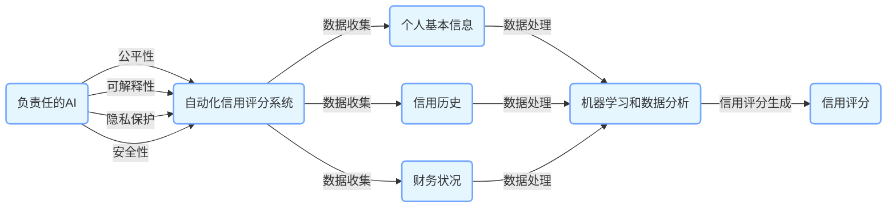

# 负责任的AI在自动化信用评分系统中的实践

> 关键词：负责任的AI、自动化信用评分系统、公平性、可解释性、隐私保护、算法伦理、风险评估

> 摘要：本文聚焦于负责任的AI在自动化信用评分系统中的实践。随着人工智能技术在金融领域的广泛应用，自动化信用评分系统凭借其高效、准确的特点逐渐成为主流。然而，该系统在运行过程中也面临诸多挑战，如公平性缺失、缺乏可解释性以及隐私安全等问题。负责任的AI旨在确保人工智能系统在开发、部署和使用过程中遵循伦理道德和法律规范，保障系统的公平、透明、可解释和安全。本文将深入探讨负责任的AI相关核心概念，剖析其在自动化信用评分系统中的算法原理和操作步骤，通过数学模型和公式进行理论阐释，并结合项目实战案例详细说明。同时，分析其实际应用场景，推荐相关的工具和资源，最后总结未来发展趋势与挑战，为解决自动化信用评分系统中的问题提供全面且深入的技术参考和实践指导。

## 1. 背景介绍 
### 1.1 目的和范围
目的：本研究旨在探讨如何将负责任的AI理念融入自动化信用评分系统，解决现有系统存在的公平性、可解释性和隐私保护等问题，提高信用评分系统的可靠性和可信度，促进金融行业的健康发展。
范围：涵盖负责任的AI的相关理论和概念，自动化信用评分系统的原理和架构，以及负责任的AI在该系统中的具体应用，包括算法设计、模型优化、实际案例分析等方面。同时，涉及相关的工具、资源和未来发展趋势的研究。

### 1.2 预期读者
本文预期读者包括金融行业从业者，如银行信贷人员、风险评估专家等，他们可以通过本文了解如何利用负责任的AI改进现有的信用评分系统，提高信贷决策的质量和效率；人工智能领域的研究人员和开发者，可从中获取关于负责任的AI在实际应用中的技术思路和方法；政策制定者和监管机构人员，有助于他们制定相关的政策和法规，规范自动化信用评分系统的发展。

### 1.3 文档结构概述
本文首先介绍背景信息，包括目的、预期读者和文档结构。接着阐述负责任的AI和自动化信用评分系统的核心概念与联系，包括原理和架构的文本示意图及Mermaid流程图。然后详细讲解核心算法原理和具体操作步骤，并用Python源代码进行说明。之后介绍数学模型和公式，并举例说明。通过项目实战案例展示代码实现和详细解释。分析实际应用场景，推荐相关的工具和资源。最后总结未来发展趋势与挑战，提供常见问题与解答和扩展阅读及参考资料。

### 1.4 术语表
#### 1.4.1 核心术语定义
- **负责任的AI（Responsible AI）**：指在人工智能系统的整个生命周期中，包括设计、开发、部署和使用过程中，遵循伦理道德、法律规范和社会价值，确保系统的公平性、可解释性、安全性和可靠性的理念和实践。
- **自动化信用评分系统（Automated Credit Scoring System）**：利用机器学习和数据分析技术，对借款人的信用风险进行自动评估和评分的系统，帮助金融机构做出信贷决策。
- **公平性（Fairness）**：在信用评分系统中，公平性指系统不会因为借款人的种族、性别、年龄等敏感特征而产生歧视性的评分结果，确保所有借款人在同等条件下得到公平的对待。
- **可解释性（Explainability）**：指信用评分系统能够清晰地解释其评分结果是如何得出的，让用户和监管机构能够理解系统的决策过程和依据。
- **隐私保护（Privacy Protection）**：在信用评分系统中，隐私保护指确保借款人的个人敏感信息不被泄露和滥用，采取必要的技术和管理措施保障数据的安全性和保密性。

#### 1.4.2 相关概念解释
- **算法偏见（Algorithm Bias）**：指由于数据偏差、算法设计不合理等原因，导致人工智能系统在决策过程中产生不公平的结果，对某些群体造成不利影响。
- **黑盒模型（Black - Box Model）**：指那些输入和输出可以被观察到，但内部决策过程难以理解和解释的模型，如一些复杂的深度学习模型。
- **白盒模型（White - Box Model）**：指内部决策过程可以被清晰理解和解释的模型，如决策树模型。

#### 1.4.3 缩略词列表
- **AI**：Artificial Intelligence（人工智能）
- **ML**：Machine Learning（机器学习）
- **DL**：Deep Learning（深度学习）
- **FICO**：Fair Isaac Corporation（费埃哲公司，一家知名的信用评分机构）

## 2. 核心概念与联系 
### 负责任的AI核心概念
负责任的AI强调在人工智能系统的整个生命周期中，充分考虑伦理道德、法律规范和社会价值。其核心要素包括公平性、可解释性、隐私保护和安全性。公平性要求系统避免对不同群体的歧视，确保所有用户在系统中得到平等的对待。可解释性则是指系统能够以人类可理解的方式解释其决策过程和结果，增强用户对系统的信任。隐私保护致力于保护用户的个人信息不被泄露和滥用。安全性确保系统在面对各种攻击和异常情况时能够正常运行，保护用户的利益。

### 自动化信用评分系统核心概念
自动化信用评分系统是金融机构用于评估借款人信用风险的重要工具。它通过收集借款人的各种信息，如个人基本信息、信用历史、财务状况等，利用机器学习和数据分析技术对这些信息进行处理和分析，最终生成一个信用评分。这个评分反映了借款人的信用风险程度，金融机构可以根据评分来决定是否给予贷款以及贷款的额度和利率。

### 两者的联系
负责任的AI与自动化信用评分系统密切相关。在自动化信用评分系统中应用负责任的AI理念，可以解决系统存在的诸多问题。例如，通过确保公平性，可以避免因算法偏见导致的对某些群体的不公平待遇，提高系统的社会公信力。可解释性的要求促使信用评分系统采用更透明的算法和模型，让金融机构和借款人都能理解评分的依据，增强用户对系统的信任。隐私保护措施可以保障借款人的个人信息安全，防止信息泄露和滥用。安全性则确保信用评分系统的稳定运行，防止恶意攻击和数据篡改，保护金融机构和借款人的利益。

### 文本示意图
```plaintext
负责任的AI
├── 公平性
│   └── 避免算法偏见，保障不同群体公平
├── 可解释性
│   └── 清晰解释决策过程和结果
├── 隐私保护
│   └── 保护个人信息不被泄露
└── 安全性
    └── 确保系统稳定运行

自动化信用评分系统
├── 数据收集
│   ├── 个人基本信息
│   ├── 信用历史
│   └── 财务状况
├── 数据处理
│   └── 机器学习和数据分析
└── 信用评分生成
    └── 反映信用风险程度

联系：负责任的AI理念贯穿自动化信用评分系统的各个环节，确保系统公平、透明、安全和可靠
```

### Mermaid流程图


## 3. 核心算法原理 & 具体操作步骤 
### 核心算法原理
在自动化信用评分系统中，常用的算法包括逻辑回归、决策树、随机森林和支持向量机等。这里以逻辑回归算法为例进行详细讲解。

逻辑回归是一种广义线性模型，用于处理二分类问题。在信用评分系统中，我们可以将借款人分为违约和不违约两类。逻辑回归的基本原理是通过对输入特征进行线性组合，然后通过逻辑函数（也称为Sigmoid函数）将线性组合的结果映射到[0, 1]区间，得到一个概率值。这个概率值表示借款人违约的可能性。

逻辑回归的数学表达式为：

$$P(y = 1|x)=\frac{1}{1 + e^{-(w_0+w_1x_1+w_2x_2+\cdots+w_nx_n)}}$$

其中，$P(y = 1|x)$ 表示在给定输入特征 $x=(x_1,x_2,\cdots,x_n)$ 的情况下，借款人违约的概率；$w_0,w_1,\cdots,w_n$ 是模型的参数，需要通过训练数据进行学习。

### 具体操作步骤
#### 步骤1：数据收集
收集借款人的各种信息，包括个人基本信息（如年龄、性别、职业等）、信用历史（如逾期次数、欠款金额等）和财务状况（如收入、资产等）。

#### 步骤2：数据预处理
- **数据清洗**：去除数据中的缺失值、重复值和异常值。
- **特征选择**：选择与信用风险相关的特征，去除无关或冗余的特征。
- **数据标准化**：将特征值进行标准化处理，使不同特征具有相同的尺度。

#### 步骤3：模型训练
- **划分训练集和测试集**：将收集到的数据按照一定比例（如70%训练集，30%测试集）划分为训练集和测试集。
- **模型训练**：使用训练集数据对逻辑回归模型进行训练，通过优化算法（如梯度下降法）学习模型的参数 $w_0,w_1,\cdots,w_n$。

#### 步骤4：模型评估
使用测试集数据对训练好的模型进行评估，常用的评估指标包括准确率、召回率、F1值等。

#### 步骤5：信用评分生成
使用训练好的模型对新的借款人数据进行预测，得到借款人违约的概率，根据概率生成信用评分。

### Python源代码实现
```python
import pandas as pd
from sklearn.model_selection import train_test_split
from sklearn.linear_model import LogisticRegression
from sklearn.preprocessing import StandardScaler
from sklearn.metrics import accuracy_score, recall_score, f1_score

# 步骤1：数据收集
# 假设数据存储在一个CSV文件中
data = pd.read_csv('credit_data.csv')

# 步骤2：数据预处理
# 分离特征和标签
X = data.drop('default', axis=1)
y = data['default']

# 数据标准化
scaler = StandardScaler()
X_scaled = scaler.fit_transform(X)

# 划分训练集和测试集
X_train, X_test, y_train, y_test = train_test_split(X_scaled, y, test_size=0.3, random_state=42)

# 步骤3：模型训练
model = LogisticRegression()
model.fit(X_train, y_train)

# 步骤4：模型评估
y_pred = model.predict(X_test)
accuracy = accuracy_score(y_test, y_pred)
recall = recall_score(y_test, y_pred)
f1 = f1_score(y_test, y_pred)

print(f"Accuracy: {accuracy}")
print(f"Recall: {recall}")
print(f"F1 Score: {f1}")

# 步骤5：信用评分生成
new_data = pd.read_csv('new_credit_data.csv')
new_data_scaled = scaler.transform(new_data)
probabilities = model.predict_proba(new_data_scaled)[:, 1]
credit_scores = [int(p * 100) for p in probabilities]
print(f"Credit Scores: {credit_scores}")
```

## 4. 数学模型和公式 & 详细讲解 & 举例说明 
### 逻辑回归模型的数学基础
逻辑回归模型基于逻辑函数（Sigmoid函数），其数学表达式为：

$$\sigma(z)=\frac{1}{1 + e^{-z}}$$

其中，$z$ 是一个线性组合：

$$z = w_0+w_1x_1+w_2x_2+\cdots+w_nx_n=\mathbf{w}^T\mathbf{x}$$

这里，$\mathbf{w}=(w_0,w_1,\cdots,w_n)^T$ 是模型的参数向量，$\mathbf{x}=(1,x_1,x_2,\cdots,x_n)^T$ 是输入特征向量。

Sigmoid函数的图像是一个S形曲线，其值域在[0, 1]之间。当 $z$ 趋近于正无穷时，$\sigma(z)$ 趋近于1；当 $z$ 趋近于负无穷时，$\sigma(z)$ 趋近于0。

### 损失函数
在逻辑回归中，常用的损失函数是对数损失函数（也称为交叉熵损失函数）。对于单个样本 $(\mathbf{x}_i,y_i)$，其对数损失函数为：

$$L(y_i,\hat{y}_i)=-y_i\log(\hat{y}_i)-(1 - y_i)\log(1-\hat{y}_i)$$

其中，$y_i$ 是真实标签（0或1），$\hat{y}_i=\sigma(\mathbf{w}^T\mathbf{x}_i)$ 是模型预测的概率。

对于整个训练集，损失函数为所有样本损失的平均值：

$$J(\mathbf{w})=\frac{1}{m}\sum_{i = 1}^{m}L(y_i,\hat{y}_i)=-\frac{1}{m}\sum_{i = 1}^{m}[y_i\log(\sigma(\mathbf{w}^T\mathbf{x}_i))+(1 - y_i)\log(1-\sigma(\mathbf{w}^T\mathbf{x}_i))]$$

其中，$m$ 是训练集的样本数量。

### 优化算法
为了找到使损失函数 $J(\mathbf{w})$ 最小的参数 $\mathbf{w}$，常用的优化算法是梯度下降法。梯度下降法的基本思想是沿着损失函数的负梯度方向更新参数，每次更新的步长由学习率 $\alpha$ 控制。

参数更新公式为：

$$\mathbf{w}=\mathbf{w}-\alpha\nabla J(\mathbf{w})$$

其中，$\nabla J(\mathbf{w})$ 是损失函数 $J(\mathbf{w})$ 关于参数 $\mathbf{w}$ 的梯度。

### 举例说明
假设我们有一个简单的信用评分问题，只有两个特征：$x_1$ 表示借款人的收入，$x_2$ 表示借款人的年龄。我们有一个训练集，包含5个样本：

| 收入 $x_1$ | 年龄 $x_2$ | 违约标签 $y$ |
|---|---|---|
| 5000 | 30 | 0 |
| 8000 | 35 | 0 |
| 3000 | 25 | 1 |
| 6000 | 40 | 0 |
| 4000 | 28 | 1 |

我们可以使用逻辑回归模型对这个问题进行建模。首先，我们需要初始化模型的参数 $\mathbf{w}=(w_0,w_1,w_2)^T$，例如 $\mathbf{w}=(0,0,0)^T$。然后，我们可以使用梯度下降法迭代更新参数，直到损失函数收敛。

以下是使用Python实现的示例代码：

```python
import numpy as np

# 训练数据
X = np.array([[1, 5000, 30], [1, 8000, 35], [1, 3000, 25], [1, 6000, 40], [1, 4000, 28]])
y = np.array([0, 0, 1, 0, 1])

# 初始化参数
w = np.zeros(X.shape[1])

# 学习率
alpha = 0.000001

# 迭代次数
num_iterations = 1000

# 梯度下降
for i in range(num_iterations):
    z = np.dot(X, w)
    y_pred = 1 / (1 + np.exp(-z))
    gradient = np.dot(X.T, (y_pred - y)) / len(y)
    w = w - alpha * gradient

# 预测新样本
new_x = np.array([1, 7000, 38])
probability = 1 / (1 + np.exp(-np.dot(new_x, w)))
print(f"Probability of default: {probability}")
```

在这个示例中，我们使用梯度下降法迭代更新参数1000次，最终得到一个逻辑回归模型。我们可以使用这个模型对新的借款人数据进行预测，得到借款人违约的概率。

## 5. 项目实战：代码实际案例和详细解释说明 
### 5.1  开发环境搭建
#### 安装Python
首先，确保你已经安装了Python。建议使用Python 3.7及以上版本。你可以从Python官方网站（https://www.python.org/downloads/） 下载并安装Python。

#### 安装必要的库
在项目中，我们需要使用一些Python库，如`pandas`、`numpy`、`scikit - learn`等。可以使用`pip`命令进行安装：

```sh
pip install pandas numpy scikit-learn
```

#### 准备数据
假设我们有一个包含借款人信息的CSV文件`credit_data.csv`，文件中包含以下列：`age`（年龄）、`income`（收入）、`credit_history`（信用历史）、`default`（违约标签，0表示不违约，1表示违约）等。

### 5.2  源代码详细实现和代码解读
```python
import pandas as pd
from sklearn.model_selection import train_test_split
from sklearn.linear_model import LogisticRegression
from sklearn.preprocessing import StandardScaler
from sklearn.metrics import accuracy_score, recall_score, f1_score

# 步骤1：数据收集
# 读取CSV文件
data = pd.read_csv('credit_data.csv')

# 步骤2：数据预处理
# 分离特征和标签
X = data.drop('default', axis=1)
y = data['default']

# 数据标准化
scaler = StandardScaler()
X_scaled = scaler.fit_transform(X)

# 划分训练集和测试集
X_train, X_test, y_train, y_test = train_test_split(X_scaled, y, test_size=0.3, random_state=42)

# 步骤3：模型训练
model = LogisticRegression()
model.fit(X_train, y_train)

# 步骤4：模型评估
y_pred = model.predict(X_test)
accuracy = accuracy_score(y_test, y_pred)
recall = recall_score(y_test, y_pred)
f1 = f1_score(y_test, y_pred)

print(f"Accuracy: {accuracy}")
print(f"Recall: {recall}")
print(f"F1 Score: {f1}")

# 步骤5：信用评分生成
new_data = pd.read_csv('new_credit_data.csv')
new_data_scaled = scaler.transform(new_data)
probabilities = model.predict_proba(new_data_scaled)[:, 1]
credit_scores = [int(p * 100) for p in probabilities]
print(f"Credit Scores: {credit_scores}")
```

### 代码解读与分析
#### 数据收集
使用`pandas`库的`read_csv`函数读取CSV文件，将数据加载到DataFrame中。

#### 数据预处理
- **分离特征和标签**：使用`drop`方法从DataFrame中移除`default`列，得到特征矩阵`X`；将`default`列作为标签向量`y`。
- **数据标准化**：使用`StandardScaler`类对特征矩阵`X`进行标准化处理，使不同特征具有相同的尺度，有助于模型的训练。
- **划分训练集和测试集**：使用`train_test_split`函数将标准化后的特征矩阵`X_scaled`和标签向量`y`按照70%训练集，30%测试集的比例进行划分。

#### 模型训练
使用`LogisticRegression`类创建一个逻辑回归模型，并使用训练集数据`X_train`和`y_train`对模型进行训练。

#### 模型评估
使用训练好的模型对测试集数据`X_test`进行预测，得到预测标签`y_pred`。然后使用`accuracy_score`、`recall_score`和`f1_score`函数计算模型的准确率、召回率和F1值，评估模型的性能。

#### 信用评分生成
读取新的借款人数据`new_credit_data.csv`，使用之前训练好的`StandardScaler`对象对新数据进行标准化处理。然后使用训练好的模型对标准化后的新数据进行预测，得到借款人违约的概率。最后将概率乘以100并转换为整数，得到信用评分。

## 6. 实际应用场景 
### 银行信贷决策
在银行的信贷业务中，自动化信用评分系统可以帮助银行快速、准确地评估借款人的信用风险。银行可以根据信用评分决定是否给予贷款、贷款的额度和利率等。负责任的AI在其中的应用可以确保信用评分系统的公平性，避免对某些群体的歧视，同时提供可解释的评分结果，让银行和借款人都能理解评分的依据，增强用户对系统的信任。

### 金融科技公司风险评估
金融科技公司通常处理大量的小额贷款业务，需要高效的信用评分系统来评估风险。负责任的AI可以帮助金融科技公司构建更可靠的信用评分系统，保护借款人的隐私，提高系统的安全性，降低风险。

### 消费金融行业
在消费金融行业，如信用卡发行、分期付款等业务中，信用评分系统可以帮助企业评估客户的信用风险，控制风险敞口。负责任的AI可以确保信用评分系统的公平性和可解释性，保障消费者的权益，促进消费金融行业的健康发展。

### 保险行业
保险行业也可以利用信用评分系统来评估投保人的风险。例如，在汽车保险中，保险公司可以根据投保人的信用评分来确定保险费率。负责任的AI可以确保信用评分系统在保险行业的应用中遵循公平、透明的原则，保护投保人的利益。

## 7. 工具和资源推荐
### 7.1 学习资源推荐
#### 7.1.1 书籍推荐
- 《Python机器学习》（Sebastian Raschka著）：这本书详细介绍了Python在机器学习中的应用，包括各种机器学习算法的原理和实现，适合初学者和有一定基础的开发者。
- 《人工智能：现代方法》（Stuart Russell和Peter Norvig著）：这是一本经典的人工智能教材，涵盖了人工智能的各个领域，包括机器学习、自然语言处理、计算机视觉等，对于深入理解人工智能的原理和方法非常有帮助。
- 《信用评分工具与技术》（Naeem Siddiqi著）：这本书专门介绍了信用评分的相关知识和技术，包括信用评分模型的构建、评估和优化等，对于从事信用评分工作的人员非常有参考价值。

#### 7.1.2 在线课程
- Coursera上的“机器学习”课程（Andrew Ng教授）：这是一门非常经典的机器学习课程，由斯坦福大学的Andrew Ng教授授课，内容涵盖了机器学习的基本概念、算法和应用，适合初学者。
- edX上的“人工智能基础”课程：该课程介绍了人工智能的基本原理和方法，包括搜索算法、知识表示、机器学习等，对于想要了解人工智能的人员非常有帮助。
- Kaggle上的“信用风险评估”课程：这是一门专门针对信用风险评估的课程，通过实际案例介绍了信用评分模型的构建和评估方法，适合有一定机器学习基础的人员。

#### 7.1.3 技术博客和网站
- Towards Data Science：这是一个专注于数据科学和机器学习的博客平台，上面有很多关于人工智能和信用评分的优秀文章和教程。
- Medium：Medium上有很多技术领域的优秀文章，包括人工智能、机器学习、金融科技等，对于了解最新的技术动态和研究成果非常有帮助。
- Kaggle：Kaggle是一个数据科学竞赛平台，上面有很多关于信用评分和风险评估的数据集和竞赛项目，可以通过参与竞赛来提高自己的技术水平。

### 7.2 开发工具框架推荐
#### 7.2.1 IDE和编辑器
- PyCharm：这是一款专门为Python开发设计的集成开发环境（IDE），具有强大的代码编辑、调试和项目管理功能，适合开发Python项目。
- Jupyter Notebook：Jupyter Notebook是一个交互式的开发环境，支持多种编程语言，如Python、R等。它非常适合进行数据分析和机器学习实验，可以实时显示代码的运行结果和可视化图表。
- Visual Studio Code：Visual Studio Code是一款轻量级的代码编辑器，支持多种编程语言和插件扩展。它具有丰富的功能和良好的用户体验，适合开发各种类型的项目。

#### 7.2.2 调试和性能分析工具
- PDB：PDB是Python自带的调试工具，可以帮助开发者调试Python代码，定位和解决代码中的问题。
- cProfile：cProfile是Python的性能分析工具，可以分析代码的运行时间和函数调用情况，帮助开发者优化代码性能。
- Scikit - learn中的`GridSearchCV`：`GridSearchCV`是Scikit - learn库中的一个工具，可以帮助开发者进行模型参数调优，找到最优的模型参数组合，提高模型的性能。

#### 7.2.3 相关框架和库
- Scikit - learn：Scikit - learn是一个强大的Python机器学习库，提供了各种机器学习算法和工具，如分类、回归、聚类等，非常适合用于信用评分模型的开发。
- TensorFlow：TensorFlow是一个开源的深度学习框架，由Google开发。它提供了丰富的深度学习模型和工具，如神经网络、卷积神经网络等，适合处理复杂的信用评分问题。
- PyTorch：PyTorch是另一个流行的深度学习框架，由Facebook开发。它具有动态计算图的特点，非常适合进行深度学习模型的研究和开发。

### 7.3 相关论文著作推荐
#### 7.3.1 经典论文
- “The Elements of Statistical Learning”（Trevor Hastie、Robert Tibshirani和Jerome Friedman著）：这是一本关于统计学习的经典著作，介绍了各种统计学习方法和算法，对于理解机器学习的理论基础非常有帮助。
- “Credit Scoring and Its Applications”（Naeem Siddiqi著）：这篇论文系统地介绍了信用评分的原理、方法和应用，是信用评分领域的经典文献。
- “Fairness in Machine Learning”（Moritz Hardt、Eric Price和Nati Srebro著）：这篇论文探讨了机器学习中的公平性问题，提出了一些衡量和解决公平性问题的方法，对于在信用评分系统中应用负责任的AI非常有参考价值。

#### 7.3.2 最新研究成果
- 关注顶级学术会议和期刊，如NeurIPS（神经信息处理系统大会）、ICML（国际机器学习会议）、Journal of Machine Learning Research（机器学习研究杂志）等，这些会议和期刊上发表了很多关于人工智能和信用评分的最新研究成果。
- 关注知名研究机构和学者的研究动态，如斯坦福大学、麻省理工学院、卡内基梅隆大学等的相关研究团队，他们在人工智能和信用评分领域有很多前沿的研究工作。

#### 7.3.3 应用案例分析
- 可以参考一些金融机构和科技公司的公开报告和案例分析，了解他们在自动化信用评分系统中应用负责任的AI的实践经验和成果。例如，一些银行会发布关于信用风险管理和信用评分系统优化的报告，从中可以学习到很多实际应用的经验。

## 8. 总结：未来发展趋势与挑战
### 未来发展趋势
#### 融合多源数据
未来的自动化信用评分系统将融合更多类型的数据，如社交媒体数据、物联网数据等。这些多源数据可以提供更全面的借款人信息，帮助更准确地评估信用风险。同时，负责任的AI需要确保在融合多源数据的过程中，保护用户的隐私和数据安全，避免因数据滥用导致的问题。

#### 可解释性增强
随着对人工智能系统可解释性的要求越来越高，未来的信用评分系统将采用更具可解释性的模型和算法。例如，一些新型的可解释机器学习模型，如决策树集成模型、基于规则的模型等，将在信用评分系统中得到更广泛的应用。同时，还将发展一些专门的可解释性技术，如特征重要性分析、决策路径解释等，帮助用户更好地理解信用评分的依据。

#### 联邦学习的应用
联邦学习是一种新兴的机器学习技术，它可以在不共享原始数据的情况下，实现多个参与方之间的模型训练。在信用评分系统中，联邦学习可以应用于多个金融机构之间的数据共享和模型训练，既保护了用户的隐私，又提高了信用评分的准确性。未来，联邦学习在信用评分系统中的应用将越来越广泛。

#### 人工智能与区块链的结合
区块链技术具有去中心化、不可篡改、可追溯等特点，可以为信用评分系统提供更安全、可靠的环境。未来，人工智能与区块链的结合将成为信用评分系统的一个重要发展方向。例如，利用区块链技术记录借款人的信用历史和交易信息，确保信息的真实性和完整性；同时，利用人工智能技术对区块链上的数据进行分析和挖掘，提高信用评分的准确性。

### 挑战
#### 数据质量和隐私保护
随着数据来源的多样化，数据质量问题将成为一个挑战。低质量的数据可能导致信用评分系统的准确性下降，甚至产生错误的决策。同时，隐私保护也是一个重要的问题。在收集和使用多源数据的过程中，需要采取有效的措施保护用户的隐私，避免数据泄露和滥用。

#### 算法偏见和公平性问题
尽管负责任的AI强调公平性，但算法偏见仍然是一个难以完全解决的问题。由于数据偏差、算法设计不合理等原因，信用评分系统可能会对某些群体产生歧视性的结果。解决算法偏见和公平性问题需要不断改进算法和数据处理方法，同时加强监管和评估。

#### 技术复杂性和可解释性矛盾
一些复杂的机器学习模型，如深度学习模型，虽然在性能上表现出色，但往往缺乏可解释性。在追求更高的信用评分准确性的同时，如何平衡技术复杂性和可解释性之间的矛盾，是一个需要解决的挑战。

#### 法律法规和伦理道德问题
随着人工智能技术在信用评分系统中的广泛应用，相关的法律法规和伦理道德问题也日益凸显。例如，如何界定人工智能系统的责任和义务，如何确保人工智能系统的决策符合伦理道德标准等。需要制定相应的法律法规和伦理准则，规范人工智能在信用评分系统中的应用。

## 9. 附录：常见问题与解答
### 问题1：什么是负责任的AI？
答：负责任的AI指在人工智能系统的整个生命周期中，包括设计、开发、部署和使用过程中，遵循伦理道德、法律规范和社会价值，确保系统的公平性、可解释性、安全性和可靠性的理念和实践。

### 问题2：自动化信用评分系统存在哪些问题？
答：自动化信用评分系统存在公平性缺失、缺乏可解释性、隐私安全等问题。例如，由于数据偏差和算法设计不合理，可能会对某些群体产生歧视性的评分结果；一些复杂的模型难以解释评分的依据；在数据收集和使用过程中，可能存在隐私泄露的风险。

### 问题3：如何确保信用评分系统的公平性？
答：可以从以下几个方面确保信用评分系统的公平性：选择无偏的数据，避免使用可能导致歧视的特征；采用公平性评估指标对模型进行评估和优化；进行模型的敏感性分析，检查模型对不同群体的影响是否存在差异。

### 问题4：什么是可解释性，为什么信用评分系统需要可解释性？
答：可解释性指系统能够以人类可理解的方式解释其决策过程和结果。信用评分系统需要可解释性是因为它涉及到借款人的利益和金融机构的决策。可解释的信用评分系统可以让借款人了解评分的依据，增强用户对系统的信任；同时，也便于金融机构和监管机构进行监督和管理。

### 问题5：如何保护信用评分系统中的用户隐私？
答：可以采取以下措施保护用户隐私：采用数据加密技术对用户的敏感信息进行加密存储和传输；进行数据匿名化处理，去除数据中的个人标识信息；建立严格的数据访问控制机制，限制对用户数据的访问权限；遵循相关的法律法规和隐私政策，确保数据的合法使用。

## 10. 扩展阅读 & 参考资料
### 扩展阅读
- 《AI 3.0》（梅拉妮·米歇尔著）：这本书探讨了人工智能的发展现状和未来趋势，对于理解人工智能的本质和挑战非常有帮助。
- 《The Book of Why: The New Science of Cause and Effect》（朱迪亚·珀尔著）：这本书介绍了因果推理的相关知识和方法，对于深入理解人工智能系统的决策机制和可解释性有很大的启发。
- 《Automating Inequality: How High - Tech Tools Profile, Police, and Punish the Poor》（Virginia Eubanks著）：这本书探讨了人工智能技术在社会中的应用可能带来的不平等问题，对于思考负责任的AI在各个领域的应用具有重要的参考价值。

### 参考资料
- Scikit - learn官方文档（https://scikit - learn.org/）：提供了Scikit - learn库的详细文档和教程，对于学习和使用Scikit - learn进行机器学习开发非常有帮助。
- TensorFlow官方文档（https://www.tensorflow.org/）：提供了TensorFlow框架的详细文档和教程，对于学习和使用TensorFlow进行深度学习开发非常有帮助。
- PyTorch官方文档（https://pytorch.org/）：提供了PyTorch框架的详细文档和教程，对于学习和使用PyTorch进行深度学习开发非常有帮助。
- 金融行业相关报告和研究论文：可以参考一些金融机构和研究机构发布的关于信用评分和风险管理的报告和研究论文，了解行业的最新动态和实践经验。