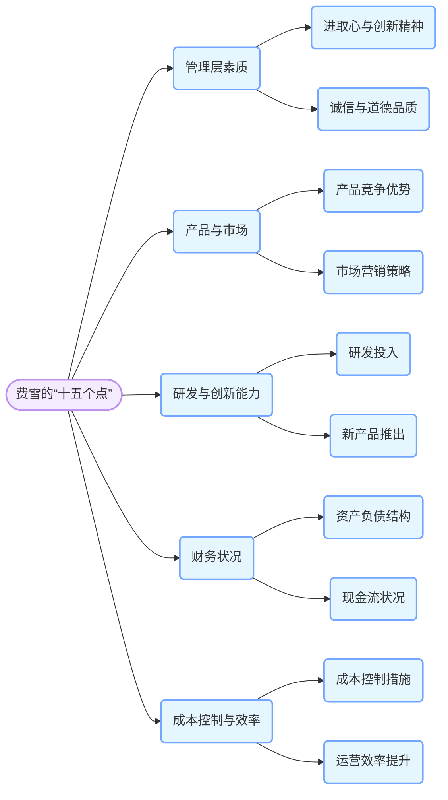

# 费雪的“十五个点”在当代投资中的应用与调整

> 关键词：费雪、十五个点、当代投资、应用、调整

> 摘要：本文聚焦于费雪的“十五个点”投资原则在当代投资环境中的应用与调整。首先介绍了费雪及其“十五个点”的背景，深入剖析了“十五个点”的核心概念及相互联系。通过具体的数学模型和公式阐释其原理，并结合Python代码给出核心算法及操作步骤。接着以实际项目为例，详细解读代码实现过程。探讨了“十五个点”在当代不同投资场景中的应用，推荐了相关的学习资源、开发工具和研究论文。最后总结了其未来发展趋势与挑战，解答常见问题并提供扩展阅读和参考资料，旨在为投资者更好地运用这一经典投资原则提供全面且深入的指导。

## 1. 背景介绍 
### 1.1 目的和范围
本研究的目的在于全面探讨费雪的“十五个点”投资原则在当代投资领域的实际应用情况以及需要做出的调整。费雪的“十五个点”作为一种经典的投资分析框架，在过去几十年中为众多投资者提供了决策依据。然而，随着时代的发展，金融市场环境发生了巨大变化，包括技术创新、全球化进程加速、监管政策调整等。因此，研究其在当代的应用与调整具有重要的现实意义。

本研究的范围涵盖了股票、债券、基金等多种金融投资领域，以及不同规模和行业的企业。通过对理论和实践案例的分析，深入挖掘“十五个点”在当代投资中的价值和局限性，并提出相应的调整建议。

### 1.2 预期读者
本文预期读者包括专业投资者、金融分析师、投资顾问、对投资领域感兴趣的学生以及企业管理者等。专业投资者可以通过本文深入了解“十五个点”在当代投资中的应用技巧，优化投资决策；金融分析师和投资顾问可以将其作为研究和服务客户的参考依据；学生可以借此系统学习经典投资理论及其在现实中的应用；企业管理者可以从投资者的角度审视企业自身的发展战略和运营管理。

### 1.3 文档结构概述
本文将按照以下结构展开：首先介绍费雪及其“十五个点”的相关背景知识，包括术语定义和概念解释；接着深入剖析“十五个点”的核心概念及其相互联系，并通过流程图直观展示；然后阐述核心算法原理，结合Python代码给出具体操作步骤；通过数学模型和公式详细讲解其内在逻辑，并举例说明；以实际项目为例，展示代码实现过程并进行详细解读；探讨“十五个点”在当代不同投资场景中的应用；推荐相关的学习资源、开发工具和研究论文；总结其未来发展趋势与挑战；解答常见问题；最后提供扩展阅读和参考资料。

### 1.4 术语表
#### 1.4.1 核心术语定义
- **费雪的“十五个点”**：由菲利普·费雪（Philip A. Fisher）提出的一套用于评估企业投资价值的原则，包括对企业管理层、产品、市场、研发等多个方面的考察要点。
- **投资价值**：指资产在特定市场环境下，对投资者所具有的潜在经济价值，通常通过预期收益、风险水平等因素来衡量。
- **成长型企业**：指在较长时期内，具有持续挖掘未利用资源的能力，不同程度地呈现整体扩张态势，能带来高效益的企业。

#### 1.4.2 相关概念解释
- **基本面分析**：通过对宏观经济、行业和企业基本情况的分析，评估企业的内在价值和投资价值的方法。费雪的“十五个点”属于基本面分析的范畴。
- **定性分析**：主要基于对事物性质、特征、发展趋势等方面的主观判断和分析，与定量分析相对。“十五个点”中很多要点涉及定性分析，如对企业管理层素质的评估。

#### 1.4.3 缩略词列表
- **ROE**：Return on Equity，净资产收益率，反映股东权益的收益水平。
- **EPS**：Earnings Per Share，每股收益，是测定股票投资价值的重要指标之一。

## 2. 核心概念与联系 

### 费雪“十五个点”的核心概念原理
费雪的“十五个点”主要围绕企业的各个关键方面展开，旨在全面评估企业的投资价值。这十五个点可以大致分为以下几类：

1. **管理层素质**
    - 管理层是否具备强烈的进取心和创新精神，能够不断推动企业发展。
    - 管理层的诚信和道德品质是否可靠，这关系到企业的长期声誉和稳定发展。
2. **产品与市场**
    - 企业的产品或服务是否具有独特的竞争优势，能够满足市场需求并保持市场份额。
    - 企业是否具有有效的市场营销策略，能够将产品或服务推向市场并获得客户认可。
3. **研发与创新能力**
    - 企业是否重视研发投入，不断推出新产品或改进现有产品，以适应市场变化和竞争需求。
4. **财务状况**
    - 企业的财务状况是否稳健，包括资产负债结构、现金流状况等，这是企业持续经营的基础。
5. **成本控制与效率**
    - 企业是否能够有效控制成本，提高生产和运营效率，从而提高盈利能力。

### 架构的文本示意图
```plaintext
费雪的“十五个点”
|-- 管理层素质
|   |-- 进取心与创新精神
|   |-- 诚信与道德品质
|-- 产品与市场
|   |-- 产品竞争优势
|   |-- 市场营销策略
|-- 研发与创新能力
|   |-- 研发投入
|   |-- 新产品推出
|-- 财务状况
|   |-- 资产负债结构
|   |-- 现金流状况
|-- 成本控制与效率
|   |-- 成本控制措施
|   |-- 运营效率提升
```

### Mermaid流程图


## 3. 核心算法原理 & 具体操作步骤 

### 核心算法原理
费雪的“十五个点”本身并不是一个严格意义上的数学算法，但可以通过量化和加权的方式来进行综合评估。我们可以为每个点设定一个权重，根据企业在每个点上的表现进行打分，最后将各项得分乘以相应权重并求和，得到企业的综合得分。

### 具体操作步骤
1. **确定权重**：根据投资者的偏好和市场环境，为每个点设定相应的权重，权重之和为1。
2. **打分**：对企业在每个点上的表现进行评估，给出0 - 10分的分数。
3. **计算得分**：将每个点的得分乘以相应的权重，然后求和得到企业的综合得分。

### Python源代码实现
```python
# 定义十五个点及其权重
points = {
    "管理层进取心与创新精神": 0.1,
    "管理层诚信与道德品质": 0.1,
    "产品竞争优势": 0.1,
    "市场营销策略": 0.1,
    "研发投入": 0.1,
    "新产品推出": 0.1,
    "资产负债结构": 0.1,
    "现金流状况": 0.1,
    "成本控制措施": 0.05,
    "运营效率提升": 0.05,
    # 其他五个点可根据实际情况添加
}

# 定义企业在每个点上的得分
company_scores = {
    "管理层进取心与创新精神": 8,
    "管理层诚信与道德品质": 9,
    "产品竞争优势": 7,
    "市场营销策略": 6,
    "研发投入": 7,
    "新产品推出": 6,
    "资产负债结构": 8,
    "现金流状况": 7,
    "成本控制措施": 6,
    "运营效率提升": 7,
    # 其他五个点的得分可根据实际情况添加
}

# 计算综合得分
total_score = 0
for point, weight in points.items():
    score = company_scores[point]
    total_score += score * weight

print(f"企业的综合得分: {total_score}")
```

### 代码解释
1. **定义权重**：使用字典 `points` 存储每个点及其对应的权重。
2. **定义得分**：使用字典 `company_scores` 存储企业在每个点上的得分。
3. **计算综合得分**：通过遍历 `points` 字典，将每个点的得分乘以相应的权重并累加，得到企业的综合得分。

## 4. 数学模型和公式 & 详细讲解 & 举例说明 

### 数学模型和公式
设费雪的“十五个点”分别为 $x_1, x_2, \cdots, x_{15}$，对应的权重分别为 $w_1, w_2, \cdots, w_{15}$，企业在每个点上的得分分别为 $s_1, s_2, \cdots, s_{15}$，则企业的综合得分 $S$ 可以用以下公式表示：

$$S = \sum_{i=1}^{15} w_i s_i$$

其中，$\sum_{i=1}^{15} w_i = 1$，$0 \leq s_i \leq 10$。

### 详细讲解
这个公式的核心思想是将企业在各个点上的表现进行量化，并根据每个点的重要程度进行加权求和。权重 $w_i$ 反映了每个点在综合评估中的相对重要性，得分 $s_i$ 反映了企业在该点上的实际表现。通过加权求和，得到一个综合得分 $S$，可以直观地反映企业的整体投资价值。

### 举例说明
假设我们只考虑上述代码中的十个点，权重和得分如下：

| 点 | 权重 $w_i$ | 得分 $s_i$ |
|---|---|---|
| 管理层进取心与创新精神 | 0.1 | 8 |
| 管理层诚信与道德品质 | 0.1 | 9 |
| 产品竞争优势 | 0.1 | 7 |
| 市场营销策略 | 0.1 | 6 |
| 研发投入 | 0.1 | 7 |
| 新产品推出 | 0.1 | 6 |
| 资产负债结构 | 0.1 | 8 |
| 现金流状况 | 0.1 | 7 |
| 成本控制措施 | 0.05 | 6 |
| 运营效率提升 | 0.05 | 7 |

根据公式 $S = \sum_{i=1}^{10} w_i s_i$，计算综合得分：

\[
\begin{align*}
S &= 0.1 \times 8 + 0.1 \times 9 + 0.1 \times 7 + 0.1 \times 6 + 0.1 \times 7 + 0.1 \times 6 + 0.1 \times 8 + 0.1 \times 7 + 0.05 \times 6 + 0.05 \times 7\\
&= 0.8 + 0.9 + 0.7 + 0.6 + 0.7 + 0.6 + 0.8 + 0.7 + 0.3 + 0.35\\
&= 6.45
\end{align*}
\]

所以，该企业的综合得分为6.45分。

## 5. 项目实战：代码实际案例和详细解释说明 

### 5.1  开发环境搭建
1. **安装Python**：从Python官方网站（https://www.python.org/downloads/）下载并安装Python 3.x版本。
2. **安装开发工具**：推荐使用PyCharm或Jupyter Notebook作为开发工具。
    - **PyCharm**：从JetBrains官方网站（https://www.jetbrains.com/pycharm/download/）下载并安装。
    - **Jupyter Notebook**：可以通过Anaconda（https://www.anaconda.com/products/individual）进行安装，安装完成后在命令行中输入 `jupyter notebook` 启动。

### 5.2  源代码详细实现和代码解读
以下是一个更完整的代码示例，包括用户输入企业得分和计算综合得分的功能：

```python
# 定义十五个点及其权重
points = {
    "管理层进取心与创新精神": 0.1,
    "管理层诚信与道德品质": 0.1,
    "产品竞争优势": 0.1,
    "市场营销策略": 0.1,
    "研发投入": 0.1,
    "新产品推出": 0.1,
    "资产负债结构": 0.1,
    "现金流状况": 0.1,
    "成本控制措施": 0.05,
    "运营效率提升": 0.05,
    # 其他五个点可根据实际情况添加
}

# 初始化企业得分字典
company_scores = {}

# 获取用户输入的企业得分
for point in points.keys():
    while True:
        try:
            score = float(input(f"请输入企业在 {point} 方面的得分 (0 - 10): "))
            if 0 <= score <= 10:
                company_scores[point] = score
                break
            else:
                print("得分必须在0 - 10之间，请重新输入。")
        except ValueError:
            print("输入无效，请输入一个有效的数字。")

# 计算综合得分
total_score = 0
for point, weight in points.items():
    score = company_scores[point]
    total_score += score * weight

print(f"企业的综合得分: {total_score}")
```

### 代码解读与分析
1. **定义权重**：使用字典 `points` 存储每个点及其对应的权重。
2. **获取用户输入**：通过 `input()` 函数获取用户输入的企业在每个点上的得分，并进行有效性检查，确保得分在0 - 10之间。
3. **计算综合得分**：遍历 `points` 字典，将每个点的得分乘以相应的权重并累加，得到企业的综合得分。
4. **输出结果**：使用 `print()` 函数输出企业的综合得分。

## 6. 实际应用场景 
### 股票投资
在股票投资中，费雪的“十五个点”可以帮助投资者筛选出具有投资价值的企业。投资者可以通过分析企业的管理层素质、产品与市场、研发与创新能力等方面，评估企业的长期发展潜力和竞争优势。例如，一家具有创新精神的管理层、独特产品竞争优势和持续研发投入的企业，往往具有较高的投资价值。投资者可以根据企业的综合得分，选择得分较高的企业进行投资。

### 基金投资
对于基金投资者来说，“十五个点”可以用于评估基金所投资的企业组合。基金经理在选择投资标的时，也会考虑企业的各个方面。投资者可以通过分析基金的持仓情况，结合“十五个点”原则，评估基金的投资质量和风险水平。例如，如果一只基金持仓的企业大多在管理层素质、财务状况等方面表现良好，那么该基金的投资价值可能较高。

### 企业并购与重组
在企业并购与重组过程中，“十五个点”可以作为评估目标企业价值的重要依据。收购方可以通过对目标企业的各个方面进行详细分析，了解目标企业的优势和劣势，从而确定合理的收购价格和整合策略。例如，如果目标企业在产品与市场方面具有独特优势，但在成本控制方面存在不足，收购方可以在收购后采取相应措施进行改进，提高企业的整体效益。

### 风险投资
风险投资机构在选择投资项目时，通常会关注企业的创新能力和成长潜力。费雪的“十五个点”可以帮助风险投资机构全面评估创业企业的价值。例如，一家具有创新技术和强大研发团队的创业企业，即使目前财务状况不佳，但如果其在其他方面表现出色，也可能具有较高的投资价值。风险投资机构可以根据“十五个点”的评估结果，决定是否投资以及投资的金额和方式。

## 7. 工具和资源推荐
### 7.1 学习资源推荐
#### 7.1.1 书籍推荐
- 《怎样选择成长股》（*Common Stocks and Uncommon Profits*）：菲利普·费雪的经典著作，详细阐述了“十五个点”投资原则及其应用。
- 《聪明的投资者》（*The Intelligent Investor*）：本杰明·格雷厄姆（Benjamin Graham）的著作，介绍了价值投资的基本理念和方法，与费雪的投资思想相互补充。
- 《财务报表分析与证券定价》（*Financial Statement Analysis and Security Valuation*）：帮助读者深入了解企业的财务报表，为运用“十五个点”进行投资分析提供财务知识支持。

#### 7.1.2 在线课程
- Coursera平台上的“投资学原理”课程：由知名高校教授授课，系统介绍投资学的基本理论和方法，包括基本面分析等内容。
- edX平台上的“财务分析与决策”课程：讲解财务分析的技巧和方法，有助于理解企业的财务状况，与“十五个点”中的财务评估要点相关。

#### 7.1.3 技术博客和网站
- 雪球网：一个专注于投资交流的社区，投资者可以在上面分享投资经验和对企业的分析，包括运用“十五个点”进行的分析。
- 东方财富网：提供丰富的金融资讯和企业数据，投资者可以获取相关信息进行“十五个点”的评估。

### 7.2 开发工具框架推荐
#### 7.2.1 IDE和编辑器
- PyCharm：功能强大的Python集成开发环境，提供代码编辑、调试、版本控制等功能，适合开发和调试与“十五个点”评估相关的Python代码。
- Jupyter Notebook：交互式的开发环境，方便进行数据探索和分析，适合进行“十五个点”评估的实验和演示。

#### 7.2.2 调试和性能分析工具
- PyCharm自带的调试器：可以帮助开发者逐步执行代码，检查变量的值和程序的执行流程，方便调试与“十五个点”评估相关的代码。
- cProfile：Python的性能分析工具，可以分析代码的运行时间和函数调用情况，优化代码性能。

#### 7.2.3 相关框架和库
- Pandas：用于数据处理和分析的Python库，可以方便地读取、处理和分析企业的财务数据和其他相关数据，为“十五个点”评估提供数据支持。
- NumPy：用于科学计算的Python库，提供高效的数组操作和数学函数，可用于“十五个点”评估中的数值计算。

### 7.3 相关论文著作推荐
#### 7.3.1 经典论文
- “The Theory of Investment Value” by John Burr Williams：阐述了投资价值的基本理论，为费雪的“十五个点”投资原则提供了理论基础。
- “Security Analysis” by Benjamin Graham and David Dodd：经典的证券分析著作，对基本面分析方法进行了深入探讨，与“十五个点”的分析思路相关。

#### 7.3.2 最新研究成果
- 关注《金融研究》《管理世界》等国内权威金融和管理期刊，以及《Journal of Finance》《Review of Financial Studies》等国际知名金融期刊上的相关研究论文，了解关于投资分析和企业评估的最新研究成果。

#### 7.3.3 应用案例分析
- 阅读一些专业的投资研究报告和案例集，了解其他投资者如何运用“十五个点”原则进行投资决策和企业评估，从中获取实践经验和启示。

## 8. 总结：未来发展趋势与挑战
### 未来发展趋势
1. **数字化与智能化应用**：随着信息技术的发展，大数据、人工智能等技术将在“十五个点”的应用中发挥越来越重要的作用。通过对海量数据的分析和挖掘，可以更准确地评估企业在各个点上的表现，提高投资决策的科学性和准确性。
2. **跨领域融合**：“十五个点”的应用将不再局限于传统的金融投资领域，而是与科技、医疗、环保等领域深度融合。投资者需要综合考虑不同领域的因素，评估企业的综合竞争力和发展潜力。
3. **国际化视角**：在全球化的背景下，投资者需要从国际化的视角运用“十五个点”原则。考虑企业在国际市场的竞争力、国际政策环境等因素，扩大投资视野，寻找更多的投资机会。

### 挑战
1. **数据质量与获取难度**：准确评估企业在“十五个点”上的表现需要大量高质量的数据。然而，数据的质量和获取难度是一个挑战。部分企业的数据可能存在不完整、不准确的情况，而且一些关键数据可能难以获取。
2. **定性因素评估的主观性**：“十五个点”中很多要点涉及定性因素，如管理层素质、企业文化等。对这些因素的评估具有较强的主观性，不同的投资者可能会得出不同的结论。
3. **市场变化的快速性**：金融市场和企业环境变化迅速，“十五个点”的评估结果可能很快过时。投资者需要及时更新信息，调整评估结果，以适应市场变化。

## 9. 附录：常见问题与解答
### 问题1：如何确定“十五个点”的权重？
确定“十五个点”的权重需要考虑投资者的投资目标、风险偏好和市场环境等因素。一般来说，对于注重长期价值投资的投资者，可以适当提高管理层素质、研发与创新能力等方面的权重；对于注重短期收益的投资者，可以适当提高财务状况、成本控制与效率等方面的权重。投资者也可以参考历史数据和行业经验，结合自己的判断来确定权重。

### 问题2：“十五个点”是否适用于所有类型的企业？
“十五个点”是一种通用的投资分析框架，适用于大多数类型的企业。但不同行业的企业具有不同的特点，在应用“十五个点”时需要进行适当调整。例如，对于科技企业，研发与创新能力可能更为重要；对于传统制造业企业，成本控制与效率可能更为关键。

### 问题3：如何评估企业在定性因素方面的表现？
评估企业在定性因素方面的表现需要综合考虑多个方面的信息。可以通过查阅企业的年报、新闻报道、行业研究报告等资料，了解企业的管理层背景、企业文化、市场口碑等情况。也可以与企业的员工、客户、供应商等进行交流，获取第一手信息。此外，还可以参考专业机构的评级和分析报告。

### 问题4：“十五个点”与其他投资分析方法有什么关系？
“十五个点”属于基本面分析的范畴，与其他投资分析方法如技术分析、量化分析等相互补充。基本面分析关注企业的内在价值，技术分析关注市场价格和成交量的变化，量化分析则通过数学模型和算法进行投资决策。投资者可以结合多种分析方法，提高投资决策的准确性和可靠性。

## 10. 扩展阅读 & 参考资料
### 扩展阅读
- 《投资中最简单的事》：介绍了投资的基本理念和方法，帮助投资者建立正确的投资思维。
- 《金融炼金术》（*The Alchemy of Finance*）：乔治·索罗斯（George Soros）的著作，阐述了他的投资哲学和市场理论。

### 参考资料
- 菲利普·费雪. 《怎样选择成长股》. 海南出版社.
- 本杰明·格雷厄姆. 《聪明的投资者》. 人民邮电出版社.
- John Burr Williams. “The Theory of Investment Value”. Harvard University Press.
- Benjamin Graham and David Dodd. “Security Analysis”. McGraw-Hill Education.