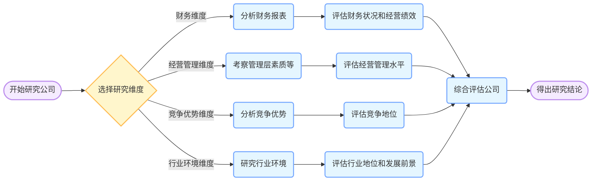

# 费雪的探照灯理论：深入研究公司的方法

> 关键词：费雪的探照灯理论、公司研究、基本面分析、投资决策、企业评估、财务分析、竞争优势

> 摘要：本文围绕费雪的探照灯理论展开，深入探讨如何运用这一理论来全面、深入地研究公司。首先介绍了该理论的背景及相关概念，接着阐述其核心原理和架构，详细讲解核心算法原理及操作步骤，并通过数学模型和公式进行进一步说明。通过项目实战展示实际代码案例及解读，分析该理论在实际应用场景中的作用。同时推荐了相关的学习资源、开发工具和论文著作。最后总结未来发展趋势与挑战，解答常见问题并提供扩展阅读和参考资料，旨在为投资者和研究人员提供系统、有效的公司研究方法。

## 1. 背景介绍 
### 1.1 目的和范围
费雪的探照灯理论为投资者和研究人员提供了一种全面、深入地研究公司的方法。其目的在于帮助人们更准确地评估公司的价值和潜力，以便做出更明智的投资决策或商业判断。本文章的范围涵盖了费雪的探照灯理论的各个方面，包括理论基础、核心概念、具体操作方法、实际应用案例以及相关的工具和资源推荐等。

### 1.2 预期读者
本文预期读者主要包括投资者，无论是个人投资者还是机构投资者，他们希望通过深入研究公司来优化投资组合，提高投资回报率；企业管理者，他们可以借助该理论来评估自身企业的优势和不足，制定更有效的发展战略；以及对公司研究和投资分析感兴趣的学者和研究人员，他们可以从理论和实践的角度深入探讨公司研究的方法和技术。

### 1.3 文档结构概述
本文首先介绍费雪的探照灯理论的背景信息，包括目的、预期读者和文档结构概述等。接着阐述核心概念与联系，通过文本示意图和 Mermaid 流程图展示其原理和架构。然后详细讲解核心算法原理和具体操作步骤，并结合数学模型和公式进行说明。通过项目实战展示实际代码案例和详细解释。分析该理论在实际应用场景中的作用。推荐相关的学习资源、开发工具和论文著作。最后总结未来发展趋势与挑战，解答常见问题并提供扩展阅读和参考资料。

### 1.4 术语表
#### 1.4.1 核心术语定义
- **费雪的探照灯理论**：是一种通过多维度分析来深入研究公司的方法，强调全面、深入地了解公司的各个方面，包括财务状况、经营管理、竞争优势等。
- **基本面分析**：是指对公司的基本情况进行分析，包括财务报表、行业地位、管理层素质等，以评估公司的内在价值。
- **竞争优势**：是指公司在市场竞争中相对于竞争对手所具有的优势，如成本优势、技术优势、品牌优势等。
- **投资回报率**：是指投资所获得的收益与投资成本的比率，是衡量投资绩效的重要指标。

#### 1.4.2 相关概念解释
- **财务分析**：是指对公司的财务报表进行分析，包括资产负债表、利润表、现金流量表等，以评估公司的财务状况和经营绩效。
- **行业分析**：是指对公司所处的行业进行分析，包括行业发展趋势、市场规模、竞争格局等，以评估公司的行业地位和发展前景。
- **企业估值**：是指对公司的价值进行评估，包括绝对估值法和相对估值法等，以确定公司的合理价值。

#### 1.4.3 缩略词列表
- **ROE**：Return on Equity，净资产收益率
- **EPS**：Earnings Per Share，每股收益
- **P/E**：Price-to-Earnings Ratio，市盈率
- **DCF**：Discounted Cash Flow，现金流折现法

## 2. 核心概念与联系 

### 费雪的探照灯理论原理
费雪的探照灯理论的核心思想是将公司看作一个复杂的系统，需要从多个维度进行全面、深入的研究。就像用探照灯照亮一个物体一样，需要从不同的角度、不同的层面去观察和分析，才能全面了解公司的真实情况。

该理论主要从以下几个维度对公司进行研究：
- **财务维度**：通过分析公司的财务报表，了解公司的财务状况和经营绩效，包括盈利能力、偿债能力、营运能力等。
- **经营管理维度**：考察公司的管理层素质、经营策略、企业文化等，评估公司的经营管理水平。
- **竞争优势维度**：分析公司在市场竞争中相对于竞争对手所具有的优势，如成本优势、技术优势、品牌优势等。
- **行业环境维度**：研究公司所处的行业发展趋势、市场规模、竞争格局等，了解公司的行业地位和发展前景。

### 架构的文本示意图
```plaintext
费雪的探照灯理论
|-- 财务维度
|   |-- 盈利能力
|   |-- 偿债能力
|   |-- 营运能力
|-- 经营管理维度
|   |-- 管理层素质
|   |-- 经营策略
|   |-- 企业文化
|-- 竞争优势维度
|   |-- 成本优势
|   |-- 技术优势
|   |-- 品牌优势
|-- 行业环境维度
|   |-- 行业发展趋势
|   |-- 市场规模
|   |-- 竞争格局
```

### Mermaid 流程图


## 3. 核心算法原理 & 具体操作步骤 

### 核心算法原理
费雪的探照灯理论并没有一个固定的、统一的算法，而是一种综合分析的方法。在实际应用中，可以结合各种财务分析方法、行业分析方法和企业估值方法来进行研究。下面以财务分析为例，介绍一些常用的算法原理。

#### 盈利能力分析
- **净资产收益率（ROE）**：反映股东权益的收益水平，用以衡量公司运用自有资本的效率。计算公式为：
$$ROE = \frac{净利润}{平均净资产} \times 100\%$$
- **每股收益（EPS）**：指税后利润与股本总数的比率，是普通股股东每持有一股所能享有的企业净利润或需承担的企业净亏损。计算公式为：
$$EPS = \frac{净利润 - 优先股股息}{发行在外的普通股加权平均数}$$

#### 偿债能力分析
- **资产负债率**：反映在总资产中有多大比例是通过借债来筹资的，也可以衡量企业在清算时保护债权人利益的程度。计算公式为：
$$资产负债率 = \frac{负债总额}{资产总额} \times 100\%$$
- **流动比率**：反映企业流动资产在短期债务到期以前，可以变为现金用于偿还负债的能力。计算公式为：
$$流动比率 = \frac{流动资产}{流动负债}$$

#### 营运能力分析
- **存货周转率**：衡量企业销售能力和存货管理水平的指标。计算公式为：
$$存货周转率 = \frac{营业成本}{平均存货余额}$$
- **应收账款周转率**：反映应收账款周转速度的指标，它说明一定期间内公司应收账款转为现金的平均次数。计算公式为：
$$应收账款周转率 = \frac{营业收入}{平均应收账款余额}$$

### 具体操作步骤

#### 步骤 1：收集数据
收集公司的财务报表、行业报告、新闻资讯等相关数据。可以通过公司官网、证券交易所网站、金融数据提供商等渠道获取数据。

#### 步骤 2：财务分析
运用上述财务分析方法，对公司的财务报表进行分析，评估公司的盈利能力、偿债能力和营运能力。以下是一个简单的 Python 代码示例：
```python
import pandas as pd

# 假设已经读取了公司的财务报表数据到 DataFrame 中
# 这里简单模拟数据
data = {
    '净利润': [1000, 1200, 1500],
    '平均净资产': [5000, 6000, 7000],
    '负债总额': [2000, 2500, 3000],
    '资产总额': [8000, 9000, 10000],
    '流动资产': [3000, 3500, 4000],
    '流动负债': [1500, 1800, 2000],
    '营业成本': [5000, 6000, 7000],
    '平均存货余额': [1000, 1200, 1500],
    '营业收入': [8000, 9000, 10000],
    '平均应收账款余额': [1000, 1200, 1500]
}
df = pd.DataFrame(data)

# 计算 ROE
df['ROE'] = df['净利润'] / df['平均净资产'] * 100

# 计算资产负债率
df['资产负债率'] = df['负债总额'] / df['资产总额'] * 100

# 计算流动比率
df['流动比率'] = df['流动资产'] / df['流动负债']

# 计算存货周转率
df['存货周转率'] = df['营业成本'] / df['平均存货余额']

# 计算应收账款周转率
df['应收账款周转率'] = df['营业收入'] / df['平均应收账款余额']

print(df)
```

#### 步骤 3：经营管理分析
考察公司的管理层素质、经营策略、企业文化等方面。可以通过阅读公司年报、管理层访谈、新闻报道等方式获取相关信息。

#### 步骤 4：竞争优势分析
分析公司在市场竞争中相对于竞争对手所具有的优势。可以通过对比公司与竞争对手的产品、价格、技术、品牌等方面的差异来评估竞争优势。

#### 步骤 5：行业环境分析
研究公司所处的行业发展趋势、市场规模、竞争格局等。可以通过查阅行业报告、市场调研数据等方式获取相关信息。

#### 步骤 6：综合评估
综合考虑以上各个维度的分析结果，对公司进行全面、深入的评估，得出研究结论。

## 4. 数学模型和公式 & 详细讲解 & 举例说明 

### 财务分析数学模型和公式

#### 净资产收益率（ROE）
$$ROE = \frac{净利润}{平均净资产} \times 100\%$$
详细讲解：ROE 是衡量公司盈利能力的重要指标之一，它反映了股东权益的收益水平。ROE 越高，说明公司运用自有资本的效率越高，股东获得的回报也就越高。

举例说明：假设公司 A 的净利润为 1000 万元，平均净资产为 5000 万元，则其 ROE 为：
$$ROE = \frac{1000}{5000} \times 100\% = 20\%$$

#### 每股收益（EPS）
$$EPS = \frac{净利润 - 优先股股息}{发行在外的普通股加权平均数}$$
详细讲解：EPS 是普通股股东每持有一股所能享有的企业净利润或需承担的企业净亏损。EPS 越高，说明公司的盈利能力越强，股东获得的收益也就越高。

举例说明：假设公司 B 的净利润为 1500 万元，优先股股息为 100 万元，发行在外的普通股加权平均数为 1000 万股，则其 EPS 为：
$$EPS = \frac{1500 - 100}{1000} = 1.4 元/股$$

#### 资产负债率
$$资产负债率 = \frac{负债总额}{资产总额} \times 100\%$$
详细讲解：资产负债率反映了在总资产中有多大比例是通过借债来筹资的，也可以衡量企业在清算时保护债权人利益的程度。资产负债率越高，说明企业的负债水平越高，财务风险也就越大。

举例说明：假设公司 C 的负债总额为 3000 万元，资产总额为 10000 万元，则其资产负债率为：
$$资产负债率 = \frac{3000}{10000} \times 100\% = 30\%$$

#### 流动比率
$$流动比率 = \frac{流动资产}{流动负债}$$
详细讲解：流动比率反映了企业流动资产在短期债务到期以前，可以变为现金用于偿还负债的能力。流动比率越高，说明企业的短期偿债能力越强。

举例说明：假设公司 D 的流动资产为 4000 万元，流动负债为 2000 万元，则其流动比率为：
$$流动比率 = \frac{4000}{2000} = 2$$

#### 存货周转率
$$存货周转率 = \frac{营业成本}{平均存货余额}$$
详细讲解：存货周转率衡量了企业销售能力和存货管理水平的指标。存货周转率越高，说明企业的存货周转速度越快，存货管理效率越高。

举例说明：假设公司 E 的营业成本为 7000 万元，平均存货余额为 1500 万元，则其存货周转率为：
$$存货周转率 = \frac{7000}{1500} \approx 4.67$$

#### 应收账款周转率
$$应收账款周转率 = \frac{营业收入}{平均应收账款余额}$$
详细讲解：应收账款周转率反映了应收账款周转速度的指标，它说明一定期间内公司应收账款转为现金的平均次数。应收账款周转率越高，说明企业的应收账款回收速度越快，资金使用效率越高。

举例说明：假设公司 F 的营业收入为 10000 万元，平均应收账款余额为 1500 万元，则其应收账款周转率为：
$$应收账款周转率 = \frac{10000}{1500} \approx 6.67$$

### 企业估值数学模型和公式

#### 市盈率（P/E）估值法
$$P/E = \frac{股价}{每股收益}$$
详细讲解：市盈率是最常用的估值指标之一，它反映了市场对公司盈利能力的预期。市盈率越高，说明市场对公司的未来发展前景越看好。

举例说明：假设公司 G 的股价为 20 元/股，每股收益为 2 元，则其市盈率为：
$$P/E = \frac{20}{2} = 10$$

#### 现金流折现法（DCF）
$$V = \sum_{t=1}^{n} \frac{CF_t}{(1 + r)^t} + \frac{TV}{(1 + r)^n}$$
其中，$V$ 表示企业的价值，$CF_t$ 表示第 $t$ 期的自由现金流，$r$ 表示折现率，$TV$ 表示终值，$n$ 表示预测期数。

详细讲解：现金流折现法是一种基于未来现金流的估值方法，它通过将未来的现金流折现到当前来评估企业的价值。该方法考虑了货币的时间价值和企业的长期发展前景。

举例说明：假设公司 H 在未来 5 年的自由现金流分别为 100 万元、120 万元、150 万元、180 万元、200 万元，折现率为 10%，终值为 2000 万元，则其企业价值为：
$$V = \frac{100}{(1 + 0.1)^1} + \frac{120}{(1 + 0.1)^2} + \frac{150}{(1 + 0.1)^3} + \frac{180}{(1 + 0.1)^4} + \frac{200}{(1 + 0.1)^5} + \frac{2000}{(1 + 0.1)^5} \approx 1723.64 万元$$

## 5. 项目实战：代码实际案例和详细解释说明 

### 5.1  开发环境搭建
- **Python 环境**：推荐使用 Python 3.7 及以上版本。可以从 Python 官方网站（https://www.python.org/downloads/）下载并安装。
- **开发工具**：推荐使用 PyCharm 或 Jupyter Notebook。PyCharm 是一款功能强大的 Python 集成开发环境，Jupyter Notebook 则适合交互式编程和数据分析。
- **相关库**：需要安装 pandas、numpy 等库，用于数据处理和分析。可以使用以下命令进行安装：
```sh
pip install pandas numpy
```

### 5.2  源代码详细实现和代码解读

以下是一个完整的项目实战代码示例，用于分析公司的财务数据并进行简单的估值：

```python
import pandas as pd
import numpy as np

# 模拟公司财务数据
data = {
    '年份': [2018, 2019, 2020, 2021, 2022],
    '净利润': [1000, 1200, 1500, 1800, 2000],
    '平均净资产': [5000, 6000, 7000, 8000, 9000],
    '负债总额': [2000, 2500, 3000, 3500, 4000],
    '资产总额': [8000, 9000, 10000, 11000, 12000],
    '流动资产': [3000, 3500, 4000, 4500, 5000],
    '流动负债': [1500, 1800, 2000, 2200, 2500],
    '营业成本': [5000, 6000, 7000, 8000, 9000],
    '平均存货余额': [1000, 1200, 1500, 1800, 2000],
    '营业收入': [8000, 9000, 10000, 11000, 12000],
    '平均应收账款余额': [1000, 1200, 1500, 1800, 2000]
}
df = pd.DataFrame(data)

# 计算财务指标
df['ROE'] = df['净利润'] / df['平均净资产'] * 100
df['资产负债率'] = df['负债总额'] / df['资产总额'] * 100
df['流动比率'] = df['流动资产'] / df['流动负债']
df['存货周转率'] = df['营业成本'] / df['平均存货余额']
df['应收账款周转率'] = df['营业收入'] / df['平均应收账款余额']

# 简单的市盈率估值
# 假设当前股价为 20 元/股，计算每股收益
df['每股收益'] = df['净利润'] / 1000  # 假设总股本为 1000 万股
df['市盈率'] = 20 / df['每股收益']

# 打印财务指标和估值结果
print('财务指标和估值结果：')
print(df[['年份', 'ROE', '资产负债率', '流动比率', '存货周转率', '应收账款周转率', '每股收益', '市盈率']])

# 现金流折现法估值
# 假设未来 5 年的自由现金流增长率为 10%，折现率为 10%，终值倍数为 10
last_fcf = df['净利润'].iloc[-1]  # 以最后一年的净利润作为初始自由现金流
fcf_growth_rate = 0.1
discount_rate = 0.1
terminal_value_multiple = 10
n_years = 5

# 预测未来 5 年的自由现金流
fcf_forecast = [last_fcf * (1 + fcf_growth_rate) ** i for i in range(1, n_years + 1)]

# 计算终值
terminal_value = fcf_forecast[-1] * terminal_value_multiple

# 计算现金流折现值
discounted_fcfs = [fcf / (1 + discount_rate) ** (i + 1) for i, fcf in enumerate(fcf_forecast)]
discounted_terminal_value = terminal_value / (1 + discount_rate) ** n_years

# 计算企业价值
enterprise_value = sum(discounted_fcfs) + discounted_terminal_value

print('\n现金流折现法估值结果：')
print(f'企业价值：{enterprise_value:.2f} 万元')
```

### 5.3  代码解读与分析

#### 数据模拟
```python
data = {
    '年份': [2018, 2019, 2020, 2021, 2022],
    '净利润': [1000, 1200, 1500, 1800, 2000],
    '平均净资产': [5000, 6000, 7000, 8000, 9000],
    '负债总额': [2000, 2500, 3000, 3500, 4000],
    '资产总额': [8000, 9000, 10000, 11000, 12000],
    '流动资产': [3000, 3500, 4000, 4500, 5000],
    '流动负债': [1500, 1800, 2000, 2200, 2500],
    '营业成本': [5000, 6000, 7000, 8000, 9000],
    '平均存货余额': [1000, 1200, 1500, 1800, 2000],
    '营业收入': [8000, 9000, 10000, 11000, 12000]
}
df = pd.DataFrame(data)
```
这段代码模拟了公司 2018 - 2022 年的财务数据，并将其存储在一个 Pandas 的 DataFrame 中。

#### 财务指标计算
```python
df['ROE'] = df['净利润'] / df['平均净资产'] * 100
df['资产负债率'] = df['负债总额'] / df['资产总额'] * 100
df['流动比率'] = df['流动资产'] / df['流动负债']
df['存货周转率'] = df['营业成本'] / df['平均存货余额']
df['应收账款周转率'] = df['营业收入'] / df['平均应收账款余额']
```
这段代码根据前面介绍的财务分析公式，计算了公司的 ROE、资产负债率、流动比率、存货周转率和应收账款周转率等财务指标。

#### 市盈率估值
```python
df['每股收益'] = df['净利润'] / 1000  # 假设总股本为 1000 万股
df['市盈率'] = 20 / df['每股收益']
```
这段代码计算了公司的每股收益和市盈率，假设当前股价为 20 元/股，总股本为 1000 万股。

#### 现金流折现法估值
```python
last_fcf = df['净利润'].iloc[-1]  # 以最后一年的净利润作为初始自由现金流
fcf_growth_rate = 0.1
discount_rate = 0.1
terminal_value_multiple = 10
n_years = 5

# 预测未来 5 年的自由现金流
fcf_forecast = [last_fcf * (1 + fcf_growth_rate) ** i for i in range(1, n_years + 1)]

# 计算终值
terminal_value = fcf_forecast[-1] * terminal_value_multiple

# 计算现金流折现值
discounted_fcfs = [fcf / (1 + discount_rate) ** (i + 1) for i, fcf in enumerate(fcf_forecast)]
discounted_terminal_value = terminal_value / (1 + discount_rate) ** n_years

# 计算企业价值
enterprise_value = sum(discounted_fcfs) + discounted_terminal_value
```
这段代码使用现金流折现法对公司进行估值。首先，以最后一年的净利润作为初始自由现金流，预测未来 5 年的自由现金流。然后，计算终值并将其折现到当前。最后，将所有现金流的折现值相加得到企业价值。

## 6. 实际应用场景 

### 投资决策
投资者可以运用费雪的探照灯理论深入研究公司，评估公司的价值和潜力，从而做出更明智的投资决策。通过对公司的财务状况、经营管理、竞争优势和行业环境等方面的分析，投资者可以筛选出具有投资价值的公司，并确定合理的投资时机和投资金额。

### 企业战略规划
企业管理者可以借助该理论评估自身企业的优势和不足，制定更有效的发展战略。通过分析公司在市场竞争中的地位和发展前景，管理者可以明确企业的核心竞争力，制定针对性的发展策略，提高企业的市场竞争力和盈利能力。

### 并购重组
在企业并购重组过程中，运用费雪的探照灯理论可以全面、深入地了解目标企业的情况，评估目标企业的价值和风险，为并购重组决策提供依据。通过对目标企业的财务状况、经营管理、竞争优势和行业环境等方面的分析，企业可以确定合理的并购价格和并购方式，降低并购风险，提高并购成功率。

### 行业研究
研究人员可以运用该理论对整个行业进行研究，了解行业的发展趋势、市场规模、竞争格局等情况，为行业发展提供参考。通过对行业内主要企业的分析，研究人员可以发现行业的发展规律和趋势，预测行业的未来发展方向，为政府部门和企业提供决策支持。

## 7. 工具和资源推荐
### 7.1 学习资源推荐
#### 7.1.1 书籍推荐
- 《怎样选择成长股》（菲利普·费雪著）：这本书是费雪的经典著作，详细介绍了他的投资理念和选股方法，是学习费雪的探照灯理论的必读之书。
- 《财务报表分析与证券定价》（斯蒂芬·佩因曼著）：这本书系统地介绍了财务报表分析的方法和技术，以及如何运用财务报表分析进行证券定价，对于深入理解公司财务分析非常有帮助。
- 《竞争战略》（迈克尔·波特著）：这本书是竞争战略领域的经典著作，介绍了企业如何通过制定竞争战略来获取竞争优势，对于理解公司的竞争优势分析具有重要的指导意义。

#### 7.1.2 在线课程
- Coursera 上的“Financial Markets”（金融市场）课程：由耶鲁大学教授罗伯特·席勒（Robert Shiller）授课，系统地介绍了金融市场的基本原理和投资分析方法。
- edX 上的“Introduction to Corporate Finance”（公司金融导论）课程：由麻省理工学院（MIT）教授授课，介绍了公司金融的基本概念和方法，包括财务报表分析、资本预算、融资决策等。
- 中国大学 MOOC 上的“投资学”课程：由国内知名高校的教授授课，介绍了投资学的基本理论和方法，包括证券投资、基金投资、风险管理等。

#### 7.1.3 技术博客和网站
- Seeking Alpha（https://seekingalpha.com/）：是一个专业的投资研究网站，提供大量的公司分析报告、投资策略和市场评论。
- Bloomberg（https://www.bloomberg.com/）：是全球知名的金融资讯提供商，提供实时的金融市场数据、新闻报道和分析评论。
- 雪球（https://xueqiu.com/）：是国内知名的投资社区，提供股票、基金、债券等金融产品的行情数据、分析评论和投资交流平台。

### 7.2 开发工具框架推荐
#### 7.2.1 IDE和编辑器
- PyCharm：是一款功能强大的 Python 集成开发环境，提供代码编辑、调试、版本控制等功能，适合专业的 Python 开发人员。
- Jupyter Notebook：是一个交互式编程环境，支持多种编程语言，适合数据分析和科学计算。
- Visual Studio Code：是一款轻量级的代码编辑器，支持多种编程语言和插件扩展，适合快速开发和调试。

#### 7.2.2 调试和性能分析工具
- PySnooper：是一个简单易用的 Python 调试工具，可以自动记录函数的执行过程和变量的值，方便调试和排查问题。
- cProfile：是 Python 内置的性能分析工具，可以分析代码的性能瓶颈，找出耗时较长的函数和代码段。
- Memory Profiler：是一个 Python 内存分析工具，可以分析代码的内存使用情况，找出内存泄漏和高内存占用的问题。

#### 7.2.3 相关框架和库
- Pandas：是一个强大的数据处理和分析库，提供了 DataFrame 和 Series 等数据结构，方便进行数据清洗、转换和分析。
- Numpy：是一个用于科学计算的 Python 库，提供了高效的数组和矩阵运算功能，是很多数据分析和机器学习库的基础。
- Scikit-learn：是一个常用的机器学习库，提供了各种机器学习算法和工具，包括分类、回归、聚类、降维等。

### 7.3 相关论文著作推荐
#### 7.3.1 经典论文
- “The Theory of Investment Value”（投资价值理论）by John Burr Williams：该论文提出了现金流折现法的基本思想，是企业估值领域的经典论文。
- “Common Stocks and Uncommon Profits”（普通股和不普通的利润）by Philip A. Fisher：这是菲利普·费雪的经典论文，阐述了他的投资理念和选股方法。
- “Competitive Advantage: Creating and Sustaining Superior Performance”（竞争优势：创造和维持卓越绩效）by Michael E. Porter：该论文介绍了企业如何通过制定竞争战略来获取竞争优势，是竞争战略领域的经典之作。

#### 7.3.2 最新研究成果
- 可以关注《Journal of Financial Economics》（金融经济学杂志）、《Review of Financial Studies》（金融研究评论）等顶级金融学术期刊，了解公司研究和投资分析领域的最新研究成果。
- 可以关注各大高校和研究机构的学术论文库，如 SSRN（https://papers.ssrn.com/sol3/）、arXiv（https://arxiv.org/）等，获取最新的研究论文。

#### 7.3.3 应用案例分析
- 可以参考一些知名投资机构的研究报告和案例分析，如高盛、摩根大通、瑞银等，了解他们在公司研究和投资决策中的实际应用案例。
- 可以关注一些知名企业的年报和财务报告，了解他们的经营管理和发展战略，以及如何应对市场竞争和挑战。

## 8. 总结：未来发展趋势与挑战

### 未来发展趋势

#### 数据驱动的分析方法
随着信息技术的不断发展和数据的大量积累，未来公司研究将越来越依赖于数据驱动的分析方法。通过运用大数据、人工智能和机器学习等技术，可以更全面、深入地分析公司的各种数据，挖掘潜在的信息和价值，提高研究的准确性和效率。

#### 跨学科研究的融合
公司研究涉及到财务、经济、管理、法律等多个学科领域，未来将越来越注重跨学科研究的融合。通过综合运用不同学科的理论和方法，可以更全面、深入地了解公司的本质和发展规律，为公司研究提供更有力的支持。

#### 可持续发展的关注
随着社会对可持续发展的关注度不断提高，未来公司研究将越来越注重对公司可持续发展能力的评估。除了关注公司的财务状况和经营绩效外，还将关注公司的环境、社会和治理（ESG）表现，评估公司在可持续发展方面的风险和机遇。

### 挑战

#### 数据质量和安全问题
数据是公司研究的基础，但数据质量和安全问题一直是困扰研究人员的难题。数据的准确性、完整性和一致性直接影响研究结果的可靠性，而数据的安全和隐私问题则关系到研究人员和公司的利益。因此，如何提高数据质量和保障数据安全是未来公司研究面临的重要挑战之一。

#### 模型和方法的有效性和适用性
随着公司研究的不断发展，各种模型和方法层出不穷。但不同的模型和方法适用于不同的情况和问题，如何选择合适的模型和方法进行研究是一个挑战。此外，模型和方法的有效性也需要不断验证和改进，以适应不断变化的市场环境和公司情况。

#### 复杂多变的市场环境
市场环境是复杂多变的，受到宏观经济、政策法规、行业竞争等多种因素的影响。公司研究需要及时、准确地把握市场环境的变化，调整研究方法和策略。但市场环境的变化往往是难以预测的，这给公司研究带来了很大的挑战。

## 9. 附录：常见问题与解答

### 问题 1：费雪的探照灯理论适用于所有类型的公司吗？
答：费雪的探照灯理论是一种通用的公司研究方法，适用于大多数类型的公司。但不同类型的公司在财务状况、经营管理、竞争优势和行业环境等方面可能存在差异，因此在应用该理论时需要根据公司的具体情况进行调整和优化。

### 问题 2：如何获取公司的财务数据和其他相关信息？
答：可以通过以下渠道获取公司的财务数据和其他相关信息：
- 公司官网：大多数公司都会在其官网公布年度报告、财务报表等信息。
- 证券交易所网站：上市公司需要按照规定披露财务信息，可以在证券交易所网站上查询相关信息。
- 金融数据提供商：如 Wind、东方财富等，提供大量的金融数据和分析工具。
- 新闻媒体和行业报告：可以通过新闻媒体和行业报告了解公司的最新动态和行业发展趋势。

### 问题 3：在进行公司研究时，如何平衡各个维度的分析？
答：在进行公司研究时，需要综合考虑各个维度的分析结果，不能只关注某一个维度而忽略其他维度。可以根据研究的目的和重点，对不同维度的分析结果进行加权和综合评估。例如，如果研究的目的是评估公司的投资价值，可以更注重财务维度和竞争优势维度的分析；如果研究的目的是评估公司的发展战略，可以更注重经营管理维度和行业环境维度的分析。

### 问题 4：现金流折现法估值的准确性如何保证？
答：现金流折现法估值的准确性受到多种因素的影响，如自由现金流的预测、折现率的选择、终值的计算等。为了保证估值的准确性，需要注意以下几点：
- 合理预测自由现金流：需要对公司的经营状况、市场环境、行业发展趋势等进行深入分析，合理预测未来的自由现金流。
- 选择合适的折现率：折现率反映了资金的时间价值和风险水平，需要根据公司的风险特征和市场情况选择合适的折现率。
- 谨慎计算终值：终值在现金流折现法估值中占有较大比重，需要谨慎计算。可以采用多种方法进行终值计算，并进行敏感性分析，评估终值对估值结果的影响。

### 问题 5：如何运用费雪的探照灯理论进行投资决策？
答：运用费雪的探照灯理论进行投资决策可以按照以下步骤进行：
- 筛选投资标的：根据自己的投资目标和风险偏好，筛选出符合条件的投资标的。
- 深入研究公司：运用费雪的探照灯理论，从财务维度、经营管理维度、竞争优势维度和行业环境维度等方面深入研究公司，评估公司的价值和潜力。
- 制定投资策略：根据研究结果，制定合理的投资策略，包括投资时机、投资金额、投资组合等。
- 跟踪和调整：投资后需要持续跟踪公司的发展情况，根据市场环境和公司情况的变化，及时调整投资策略。

## 10. 扩展阅读 & 参考资料

### 扩展阅读
- 《聪明的投资者》（本杰明·格雷厄姆著）：这本书是价值投资领域的经典著作，介绍了价值投资的基本理念和方法，与费雪的投资理念相互补充。
- 《穷查理宝典：查理·芒格的智慧箴言录》（彼得·考夫曼编著）：这本书收录了查理·芒格的演讲和文章，介绍了他的投资理念、思维方式和人生哲学，对于投资者和研究人员具有重要的启示意义。
- 《创新者的窘境》（克莱顿·克里斯坦森著）：这本书介绍了创新者在面对市场变化和技术创新时所面临的困境和挑战，以及如何通过创新来实现企业的可持续发展，对于理解公司的竞争优势和发展战略具有重要的参考价值。

### 参考资料
- 菲利普·费雪的相关著作和论文
- 各大金融学术期刊和研究报告
- 证券交易所和金融数据提供商的官方网站
- 相关的行业协会和研究机构的报告和资料