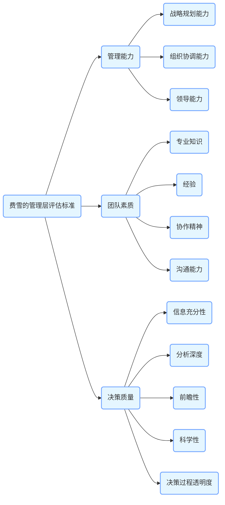

# 费雪的管理层评估标准

> 关键词：费雪、管理层评估、企业管理、投资分析、管理能力、团队素质、决策质量

> 摘要：本文深入探讨费雪的管理层评估标准。在企业投资与发展过程中，管理层的能力和素质起着至关重要的作用。费雪提出的一系列评估标准为我们提供了全面、系统地考量管理层的方法。文章首先介绍费雪管理层评估标准提出的背景及相关基本信息，接着阐述其核心概念与内在联系，详细讲解核心算法原理及具体操作步骤，通过数学模型和公式进一步剖析其逻辑，结合项目实战案例进行代码实现与解读，探讨其实际应用场景，推荐相关学习资源、开发工具和论文著作，最后总结未来发展趋势与挑战，并对常见问题进行解答，还提供扩展阅读与参考资料，旨在帮助读者深入理解和运用费雪的管理层评估标准。

## 1. 背景介绍 
### 1.1 目的和范围
在投资领域，投资者需要判断一家企业是否具有投资价值，而管理层的优劣是影响企业未来发展的关键因素之一。费雪的管理层评估标准旨在提供一套科学、合理的方法，帮助投资者、企业所有者、研究人员等从多个维度评估企业管理层的能力和素质，从而更准确地判断企业的发展潜力和投资价值。该标准的应用范围广泛，涵盖了各种规模、各种行业的企业，无论是新兴的创业公司还是成熟的大型企业，都可以借助这套标准对管理层进行评估。

### 1.2 预期读者
本文预期读者包括投资者，他们希望通过对管理层的评估来筛选更有价值的投资标的；企业所有者和股东，他们需要了解管理层的工作表现和能力，以便更好地进行企业治理和决策；企业管理研究人员，他们可以从理论和实践的角度深入研究管理层评估的方法和标准；企业管理者自身，他们可以通过这套标准进行自我评估和提升，以提高管理水平和团队绩效。

### 1.3 文档结构概述
本文将按照以下结构展开：首先介绍费雪管理层评估标准的背景信息，包括目的、预期读者和文档结构概述等；接着阐述核心概念与联系，通过文本示意图和 Mermaid 流程图展示其原理和架构；然后详细讲解核心算法原理和具体操作步骤，并使用 Python 源代码进行阐述；再通过数学模型和公式进一步说明其逻辑，并举例说明；之后结合项目实战案例，介绍开发环境搭建、源代码实现和代码解读；探讨其实际应用场景；推荐相关的学习资源、开发工具和论文著作；最后总结未来发展趋势与挑战，解答常见问题，并提供扩展阅读与参考资料。

### 1.4 术语表
#### 1.4.1 核心术语定义
- **费雪的管理层评估标准**：由投资大师菲利普·费雪提出的一套用于评估企业管理层能力和素质的标准体系，涵盖多个方面的评估指标和方法。
- **管理层**：指企业中负责制定战略、组织资源、领导团队和做出决策的核心人员群体，通常包括企业的高级管理人员，如 CEO、CFO、COO 等。
- **管理能力**：管理层在计划、组织、领导、控制等管理职能方面所具备的技能和水平，包括战略规划能力、资源配置能力、团队领导能力等。
- **团队素质**：管理层团队成员的整体素质，包括专业知识、经验、创新能力、协作精神等。

#### 1.4.2 相关概念解释
- **投资价值**：企业对于投资者而言所具有的潜在经济价值，取决于企业的盈利能力、成长潜力、管理水平等多个因素。
- **企业治理**：通过一套包括正式或非正式的、内部或外部的制度或机制来协调企业与所有利益相关者之间的利益关系，以保证企业决策的科学性和公正性，从而维护企业各方面的利益。
- **决策质量**：管理层做出决策的科学性、合理性和有效性，直接影响企业的发展方向和绩效。

#### 1.4.3 缩略词列表
- **CEO**：Chief Executive Officer，首席执行官
- **CFO**：Chief Financial Officer，首席财务官
- **COO**：Chief Operating Officer，首席运营官

## 2. 核心概念与联系 
费雪的管理层评估标准主要围绕管理层的能力、素质、决策质量等多个核心概念展开。其核心思想是全面、综合地评估管理层的各个方面，以判断其是否能够带领企业实现长期的发展和盈利。

### 核心概念原理
- **管理能力**：包括战略规划能力，管理层需要能够准确把握市场趋势和行业动态，制定出符合企业实际情况的长期发展战略；组织协调能力，能够合理配置企业的人力、物力和财力资源，确保各项工作的顺利进行；领导能力，激励和引导团队成员为实现企业目标而努力工作。
- **团队素质**：管理层团队成员应具备丰富的专业知识和经验，能够在各自的领域发挥专业优势。同时，团队成员之间应具有良好的协作精神和沟通能力，能够形成强大的团队合力。
- **决策质量**：管理层的决策应基于充分的信息和深入的分析，具有前瞻性和科学性。决策过程应透明、民主，充分考虑企业的长远利益和各方面的利益关系。

### 架构的文本示意图
```plaintext
费雪的管理层评估标准
|-- 管理能力
|   |-- 战略规划能力
|   |-- 组织协调能力
|   |-- 领导能力
|-- 团队素质
|   |-- 专业知识
|   |-- 经验
|   |-- 协作精神
|   |-- 沟通能力
|-- 决策质量
|   |-- 信息充分性
|   |-- 分析深度
|   |-- 前瞻性
|   |-- 科学性
|   |-- 决策过程透明度
```

### Mermaid 流程图


## 3. 核心算法原理 & 具体操作步骤 
### 核心算法原理
费雪的管理层评估标准可以看作是一个多维度的综合评估模型。每个维度都有相应的评估指标和权重，通过对各个指标的打分和加权求和，得到管理层的综合评估得分。具体来说，我们可以将管理能力、团队素质、决策质量等维度分别设置不同的权重，每个维度下的具体指标也有相应的权重。例如，管理能力的权重可以设为 0.4，团队素质的权重设为 0.3，决策质量的权重设为 0.3。

### 具体操作步骤
1. **确定评估指标和权重**：根据费雪的管理层评估标准，确定各个维度和指标，并为其分配相应的权重。
2. **收集数据**：通过多种渠道收集与管理层相关的数据，如企业的财务报表、年度报告、管理层的履历、员工的反馈等。
3. **指标打分**：根据收集到的数据，对每个指标进行打分，打分范围可以设定为 1 - 10 分。
4. **加权求和**：将每个指标的得分乘以其相应的权重，然后将各个维度的得分相加，得到管理层的综合评估得分。

### Python 源代码实现
```python
# 定义评估指标和权重
weights = {
    "管理能力": 0.4,
    "团队素质": 0.3,
    "决策质量": 0.3
}

sub_weights = {
    "管理能力": {
        "战略规划能力": 0.4,
        "组织协调能力": 0.3,
        "领导能力": 0.3
    },
    "团队素质": {
        "专业知识": 0.3,
        "经验": 0.3,
        "协作精神": 0.2,
        "沟通能力": 0.2
    },
    "决策质量": {
        "信息充分性": 0.3,
        "分析深度": 0.2,
        "前瞻性": 0.2,
        "科学性": 0.2,
        "决策过程透明度": 0.1
    }
}

# 定义打分函数
def score_management(management_scores):
    total_score = 0
    for dimension, sub_scores in management_scores.items():
        dimension_score = 0
        for sub_dimension, score in sub_scores.items():
            dimension_score += score * sub_weights[dimension][sub_dimension]
        total_score += dimension_score * weights[dimension]
    return total_score

# 示例数据
management_scores = {
    "管理能力": {
        "战略规划能力": 8,
        "组织协调能力": 7,
        "领导能力": 8
    },
    "团队素质": {
        "专业知识": 7,
        "经验": 8,
        "协作精神": 8,
        "沟通能力": 7
    },
    "决策质量": {
        "信息充分性": 7,
        "分析深度": 7,
        "前瞻性": 8,
        "科学性": 7,
        "决策过程透明度": 6
    }
}

# 计算综合得分
final_score = score_management(management_scores)
print(f"管理层综合评估得分: {final_score}")
```

### 代码解释
1. **权重定义**：`weights` 字典定义了管理能力、团队素质、决策质量三个维度的权重。`sub_weights` 字典定义了每个维度下具体指标的权重。
2. **打分函数**：`score_management` 函数接受一个包含各个指标得分的字典作为输入，通过加权求和的方式计算管理层的综合评估得分。
3. **示例数据**：`management_scores` 字典包含了各个指标的示例得分。
4. **计算综合得分**：调用 `score_management` 函数计算管理层的综合评估得分，并打印输出。

## 4. 数学模型和公式 & 详细讲解 & 举例说明 
### 数学模型和公式
设管理层的综合评估得分为 $S$，管理能力、团队素质、决策质量三个维度的权重分别为 $w_1$、$w_2$、$w_3$，且 $w_1 + w_2 + w_3 = 1$。每个维度下的具体指标得分分别为 $x_{ij}$，其对应的权重为 $w_{ij}$，其中 $i$ 表示维度，$j$ 表示该维度下的指标。则综合评估得分的计算公式为：

$$S = w_1 \sum_{j=1}^{n_1} w_{1j} x_{1j} + w_2 \sum_{j=1}^{n_2} w_{2j} x_{2j} + w_3 \sum_{j=1}^{n_3} w_{3j} x_{3j}$$

其中，$n_1$、$n_2$、$n_3$ 分别表示管理能力、团队素质、决策质量三个维度下的指标数量。

### 详细讲解
- **权重的作用**：权重体现了各个维度和指标在综合评估中的重要程度。权重的分配需要根据实际情况进行合理调整，以反映不同因素对管理层评估的影响。
- **指标得分的计算**：每个指标的得分是根据收集到的数据和评估标准进行打分得到的。得分的高低反映了管理层在该指标方面的表现。
- **加权求和的意义**：通过加权求和的方式，将各个指标的得分综合起来，得到管理层的综合评估得分。这样可以更全面、客观地评估管理层的能力和素质。

### 举例说明
假设 $w_1 = 0.4$，$w_2 = 0.3$，$w_3 = 0.3$，管理能力维度下有三个指标，权重分别为 $w_{11} = 0.4$，$w_{12} = 0.3$，$w_{13} = 0.3$，得分分别为 $x_{11} = 8$，$x_{12} = 7$，$x_{13} = 8$；团队素质维度下有四个指标，权重分别为 $w_{21} = 0.3$，$w_{22} = 0.3$，$w_{23} = 0.2$，$w_{24} = 0.2$，得分分别为 $x_{21} = 7$，$x_{22} = 8$，$x_{23} = 8$，$x_{24} = 7$；决策质量维度下有五个指标，权重分别为 $w_{31} = 0.3$，$w_{32} = 0.2$，$w_{33} = 0.2$，$w_{34} = 0.2$，$w_{35} = 0.1$，得分分别为 $x_{31} = 7$，$x_{32} = 7$，$x_{33} = 8$，$x_{34} = 7$，$x_{35} = 6$。

首先计算管理能力维度的得分：

$$\sum_{j=1}^{3} w_{1j} x_{1j} = 0.4 \times 8 + 0.3 \times 7 + 0.3 \times 8 = 3.2 + 2.1 + 2.4 = 7.7$$

然后计算团队素质维度的得分：

$$\sum_{j=1}^{4} w_{2j} x_{2j} = 0.3 \times 7 + 0.3 \times 8 + 0.2 \times 8 + 0.2 \times 7 = 2.1 + 2.4 + 1.6 + 1.4 = 7.5$$

接着计算决策质量维度的得分：

$$\sum_{j=1}^{5} w_{3j} x_{3j} = 0.3 \times 7 + 0.2 \times 7 + 0.2 \times 8 + 0.2 \times 7 + 0.1 \times 6 = 2.1 + 1.4 + 1.6 + 1.4 + 0.6 = 7.1$$

最后计算综合评估得分：

$$S = 0.4 \times 7.7 + 0.3 \times 7.5 + 0.3 \times 7.1 = 3.08 + 2.25 + 2.13 = 7.46$$

## 5. 项目实战：代码实际案例和详细解释说明 
### 5.1  开发环境搭建
- **Python 安装**：从 Python 官方网站（https://www.python.org/downloads/）下载并安装 Python 3.x 版本。
- **开发工具**：可以使用 PyCharm、VS Code 等集成开发环境（IDE）进行代码编写和调试。
- **依赖库安装**：本项目只需要使用 Python 内置的库，无需额外安装其他依赖库。

### 5.2  源代码详细实现和代码解读
```python
# 定义评估指标和权重
weights = {
    "管理能力": 0.4,
    "团队素质": 0.3,
    "决策质量": 0.3
}

sub_weights = {
    "管理能力": {
        "战略规划能力": 0.4,
        "组织协调能力": 0.3,
        "领导能力": 0.3
    },
    "团队素质": {
        "专业知识": 0.3,
        "经验": 0.3,
        "协作精神": 0.2,
        "沟通能力": 0.2
    },
    "决策质量": {
        "信息充分性": 0.3,
        "分析深度": 0.2,
        "前瞻性": 0.2,
        "科学性": 0.2,
        "决策过程透明度": 0.1
    }
}

# 定义打分函数
def score_management(management_scores):
    total_score = 0
    for dimension, sub_scores in management_scores.items():
        dimension_score = 0
        for sub_dimension, score in sub_scores.items():
            dimension_score += score * sub_weights[dimension][sub_dimension]
        total_score += dimension_score * weights[dimension]
    return total_score

# 从文件中读取数据
def read_scores_from_file(file_path):
    scores = {}
    with open(file_path, 'r') as file:
        for line in file:
            parts = line.strip().split(',')
            dimension = parts[0]
            sub_dimension = parts[1]
            score = float(parts[2])
            if dimension not in scores:
                scores[dimension] = {}
            scores[dimension][sub_dimension] = score
    return scores

# 主函数
def main():
    file_path = 'management_scores.txt'
    management_scores = read_scores_from_file(file_path)
    final_score = score_management(management_scores)
    print(f"管理层综合评估得分: {final_score}")

if __name__ == "__main__":
    main()
```

### 5.3  代码解读与分析
1. **权重定义**：与前面的代码相同，定义了各个维度和指标的权重。
2. **打分函数**：`score_management` 函数用于计算管理层的综合评估得分，通过加权求和的方式将各个指标的得分综合起来。
3. **数据读取函数**：`read_scores_from_file` 函数用于从文件中读取各个指标的得分数据。文件格式为每行包含维度、子维度和得分，用逗号分隔。
4. **主函数**：`main` 函数负责读取数据文件，调用打分函数计算综合评估得分，并打印输出结果。

### 文件示例（management_scores.txt）
```plaintext
管理能力,战略规划能力,8
管理能力,组织协调能力,7
管理能力,领导能力,8
团队素质,专业知识,7
团队素质,经验,8
团队素质,协作精神,8
团队素质,沟通能力,7
决策质量,信息充分性,7
决策质量,分析深度,7
决策质量,前瞻性,8
决策质量,科学性,7
决策质量,决策过程透明度,6
```

## 6. 实际应用场景 
### 投资决策
投资者在选择投资标的时，可以使用费雪的管理层评估标准对企业的管理层进行评估。一个优秀的管理层能够带领企业实现长期的增长和盈利，提高企业的投资价值。通过评估管理层的能力和素质，投资者可以筛选出更有潜力的企业，降低投资风险。

### 企业治理
企业所有者和股东可以借助该标准评估管理层的工作表现，以便更好地进行企业治理。如果管理层的评估得分较低，企业所有者可以考虑采取相应的措施，如更换管理层、加强培训和监督等，以提高企业的管理水平和绩效。

### 管理层自我评估
企业管理层自身也可以使用该标准进行自我评估，发现自己在管理能力、团队素质和决策质量等方面的不足之处，从而有针对性地进行改进和提升。这有助于提高管理层的管理水平和团队绩效，促进企业的发展。

### 人力资源管理
在企业的人力资源管理中，该标准可以作为招聘、选拔和培养管理层人才的参考依据。通过评估候选人的管理能力、团队素质和决策质量等方面的能力，可以选拔出更适合企业发展的管理层人才。

## 7. 工具和资源推荐
### 7.1 学习资源推荐
#### 7.1.1 书籍推荐
- 《怎样选择成长股》（菲利普·费雪著）：这是费雪的经典著作，书中详细阐述了他的投资理念和方法，包括对企业管理层的评估标准，是学习费雪投资思想的必读之书。
- 《卓有成效的管理者》（彼得·德鲁克著）：这本书从管理的基本原理和实践出发，探讨了管理者如何提高工作效率和成效，对于理解管理层的职责和能力要求具有重要的参考价值。
- 《管理的实践》（彼得·德鲁克著）：该书是德鲁克的代表作之一，全面阐述了管理的本质、任务和方法，对于深入理解企业管理和管理层的作用具有重要意义。

#### 7.1.2 在线课程
- Coursera 上的“Management and Leadership Specialization”：该课程由知名教授授课，涵盖了管理和领导力的各个方面，包括战略规划、团队管理、决策制定等内容，对于学习管理层评估标准的相关知识具有很大的帮助。
- edX 上的“Leadership Principles and Practices”：该课程介绍了领导力的基本原理和实践方法，通过案例分析和互动讨论，帮助学习者提高领导力和管理能力。

#### 7.1.3 技术博客和网站
- 雪球网：这是一个专注于投资领域的社区，有很多投资者和专家分享关于企业分析和管理层评估的经验和观点，可以从中获取有价值的信息。
- 36氪：该网站关注科技、商业等领域的最新动态，经常发布关于企业管理和创业的文章，对于了解企业管理层的最新趋势和实践具有一定的参考价值。

### 7.2 开发工具框架推荐
#### 7.2.1 IDE和编辑器
- PyCharm：这是一款专业的 Python 集成开发环境，具有代码编辑、调试、版本控制等功能，适合用于开发和调试与管理层评估标准相关的 Python 代码。
- VS Code：一款轻量级的代码编辑器，支持多种编程语言和插件扩展，可以通过安装相关插件来提高开发效率。

#### 7.2.2 调试和性能分析工具
- pdb：Python 内置的调试工具，可以帮助开发者定位和解决代码中的问题。
- cProfile：Python 内置的性能分析工具，可以分析代码的执行时间和性能瓶颈，帮助开发者优化代码。

#### 7.2.3 相关框架和库
- Pandas：一个强大的数据分析库，可以用于数据的读取、处理和分析，在处理管理层评估数据时非常有用。
- NumPy：一个用于科学计算的库，提供了高效的数组操作和数学函数，对于实现管理层评估的数学模型和公式具有重要作用。

### 7.3 相关论文著作推荐
#### 7.3.1 经典论文
- “The Role of Top Management in Strategic Decision Making”（Hambrick and Mason, 1984）：该论文提出了“高层梯队理论”，探讨了高层管理者的特征和价值观对企业战略决策的影响，对于理解管理层的决策行为具有重要的理论意义。
- “Managerial Discretion and Organizational Outcomes”（Finkelstein and Hambrick, 1990）：这篇论文研究了管理层的自主权和组织绩效之间的关系，为评估管理层的决策质量和管理能力提供了理论依据。

#### 7.3.2 最新研究成果
- 可以通过学术数据库（如 IEEE Xplore、ACM Digital Library、ScienceDirect 等）搜索关于管理层评估、企业管理、领导力等方面的最新研究论文，了解该领域的前沿动态和研究成果。

#### 7.3.3 应用案例分析
- 可以参考一些知名企业的案例分析，了解它们在管理层评估和企业管理方面的实践经验和成功做法。例如，苹果公司的管理层如何通过创新和卓越的管理带领公司取得巨大的成功；华为公司的管理层如何通过战略规划和团队协作实现企业的快速发展等。

## 8. 总结：未来发展趋势与挑战
### 未来发展趋势
- **数字化和智能化**：随着信息技术的不断发展，管理层评估将越来越多地借助数字化和智能化工具。例如，利用大数据分析技术可以更全面、准确地收集和分析管理层的相关数据；利用人工智能算法可以实现对管理层的自动评估和预测，提高评估的效率和准确性。
- **多元化和个性化**：不同行业、不同企业的管理层需求和特点各不相同，未来的管理层评估标准将更加多元化和个性化。评估指标和方法将根据企业的具体情况进行定制化设计，以更好地适应企业的发展需求。
- **注重长期价值**：在投资和企业发展中，越来越注重长期价值的创造。未来的管理层评估将更加关注管理层的战略眼光、创新能力和可持续发展能力，以确保企业能够实现长期的稳定增长。

### 挑战
- **数据质量和安全性**：数字化和智能化的管理层评估需要大量的数据支持，但数据的质量和安全性是一个重要的挑战。如果数据不准确、不完整或存在安全漏洞，将影响评估结果的准确性和可靠性。
- **评估标准的主观性**：尽管费雪的管理层评估标准提供了一套较为系统的方法，但在实际评估过程中，仍然存在一定的主观性。不同的评估者对同一管理层的评价可能存在差异，如何减少主观性的影响是一个需要解决的问题。
- **快速变化的市场环境**：市场环境变化迅速，企业面临的挑战和机遇也在不断变化。管理层需要具备快速适应变化的能力，而现有的评估标准可能无法及时反映管理层在应对变化方面的能力。如何更新和完善评估标准，以适应快速变化的市场环境是一个挑战。

## 9. 附录：常见问题与解答
### 问题 1：费雪的管理层评估标准适用于所有企业吗？
答：费雪的管理层评估标准具有一定的通用性，但不同行业、不同规模的企业在管理模式和需求上可能存在差异。因此，在实际应用中，需要根据企业的具体情况对评估标准进行适当的调整和补充，以确保评估结果的准确性和有效性。

### 问题 2：如何确定评估指标的权重？
答：评估指标的权重需要根据企业的战略目标、行业特点和实际情况进行合理确定。一般来说，可以通过专家咨询、历史数据分析、企业内部讨论等方式来确定权重。同时，权重也可以根据企业的发展阶段和市场环境的变化进行动态调整。

### 问题 3：评估结果如何应用？
答：评估结果可以应用于多个方面，如投资决策、企业治理、管理层自我评估、人力资源管理等。在投资决策中，评估结果可以作为筛选投资标的的参考依据；在企业治理中，评估结果可以帮助企业所有者和股东了解管理层的工作表现，采取相应的措施进行改进；在管理层自我评估中，评估结果可以帮助管理层发现自身的不足之处，有针对性地进行提升；在人力资源管理中，评估结果可以作为招聘、选拔和培养管理层人才的参考标准。

### 问题 4：如何保证评估过程的公正性和客观性？
答：为了保证评估过程的公正性和客观性，可以采取以下措施：一是制定明确的评估标准和流程，确保评估过程有章可循；二是选择专业、中立的评估人员，避免主观偏见的影响；三是收集多方面的数据和信息，进行全面、深入的分析；四是对评估结果进行审核和验证，确保结果的准确性和可靠性。

## 10. 扩展阅读 & 参考资料
### 扩展阅读
- 《竞争战略》（迈克尔·波特著）：这本书介绍了企业竞争战略的基本理论和方法，对于理解企业管理层在市场竞争中的决策和战略制定具有重要的参考价值。
- 《创新者的窘境》（克莱顿·克里斯坦森著）：该书探讨了创新对企业发展的影响，以及企业管理层如何应对创新带来的挑战，对于提高管理层的创新能力和战略眼光具有一定的启示作用。

### 参考资料
- 菲利普·费雪的相关著作和论文。
- 彼得·德鲁克的相关著作和论文。
- 学术数据库（如 IEEE Xplore、ACM Digital Library、ScienceDirect 等）中关于管理层评估、企业管理、领导力等方面的研究论文。
- 雪球网、36氪等网站上的相关文章和案例分析。