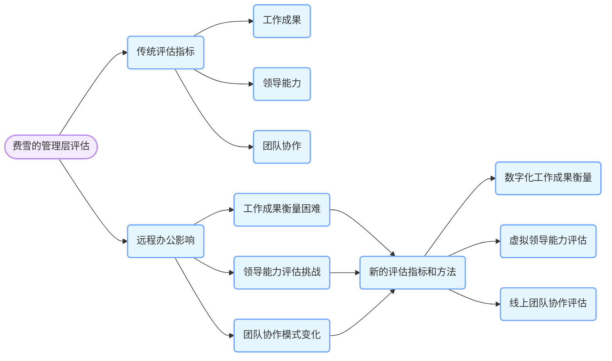

# 费雪的管理层评估：远程办公时代的新挑战

> 关键词：费雪的管理层评估、远程办公、新挑战、评估指标、管理策略

> 摘要：本文聚焦于费雪的管理层评估在远程办公时代所面临的新挑战。首先介绍了费雪管理层评估的背景知识以及远程办公兴起的大环境，接着阐述了远程办公给管理层评估带来的核心概念变化与联系，详细分析了相关的评估算法原理与操作步骤，通过数学模型和公式进一步解释评估逻辑。以实际项目案例展示如何在远程办公场景下进行管理层评估，探讨其在不同领域的实际应用场景。同时推荐了学习、开发相关的工具和资源，最后总结了未来发展趋势与挑战，并对常见问题进行解答，为远程办公时代的管理层评估提供全面且深入的参考。

## 1. 背景介绍 
### 1.1 目的和范围
在当今数字化和全球化的时代，远程办公模式逐渐成为企业运营的重要组成部分。费雪的管理层评估作为一种经典的评估体系，在传统办公模式下已被广泛应用并取得了一定的成效。然而，远程办公的兴起改变了工作的时空结构、沟通方式和协作模式，使得原有的管理层评估体系面临新的挑战。本文旨在探讨费雪的管理层评估在远程办公时代所面临的问题，并提出相应的应对策略，范围涵盖评估指标的调整、评估方法的优化以及管理策略的转变等方面。

### 1.2 预期读者
本文预期读者包括企业管理人员、人力资源专家、管理咨询顾问以及对远程办公和管理层评估感兴趣的研究人员。这些读者希望通过本文了解远程办公对管理层评估的影响，以及如何在新的工作模式下进行有效的管理层评估，以提升企业的管理效率和竞争力。

### 1.3 文档结构概述
本文首先介绍相关背景知识，包括费雪的管理层评估体系和远程办公的发展现状。接着阐述远程办公时代费雪管理层评估的核心概念与联系，分析评估算法原理和操作步骤，通过数学模型和公式进行理论解释。然后通过实际项目案例展示评估过程，探讨其在不同场景下的应用。随后推荐相关的学习、开发工具和资源，最后总结未来发展趋势与挑战，解答常见问题并提供扩展阅读和参考资料。

### 1.4 术语表
#### 1.4.1 核心术语定义
- **费雪的管理层评估**：是一种基于多维度指标对管理层人员的能力、绩效和潜力进行综合评估的体系，旨在为企业选拔、晋升和激励管理层提供科学依据。
- **远程办公**：指员工在传统办公场所之外的地点，借助信息技术手段进行工作的一种工作模式。

#### 1.4.2 相关概念解释
- **评估指标**：用于衡量管理层人员工作表现和能力的具体标准，包括工作成果、领导能力、团队协作等方面。
- **评估方法**：对管理层人员进行评估的具体方式，如问卷调查、绩效评估、360 度反馈等。

#### 1.4.3 缩略词列表
- **HR**：Human Resources，人力资源
- **KPI**：Key Performance Indicator，关键绩效指标

## 2. 核心概念与联系 

### 费雪的管理层评估核心原理
费雪的管理层评估体系基于多个维度的指标对管理层人员进行全面评估。其核心思想是通过综合考虑管理层的工作成果、领导能力、团队协作、决策能力等多个方面，来准确衡量其在组织中的价值和贡献。

传统的费雪管理层评估通常采用定量和定性相结合的方法。定量指标包括销售额、利润增长率、市场份额等具体的业绩数据，而定性指标则涉及领导风格、团队凝聚力、员工满意度等方面。通过对这些指标的综合分析，可以得出管理层人员的综合评估得分，为企业的决策提供依据。

### 远程办公带来的变化
远程办公模式的出现改变了传统的工作环境和工作方式，对费雪的管理层评估产生了多方面的影响。

- **工作成果衡量的挑战**：在远程办公环境下，工作成果的衡量变得更加复杂。由于工作地点的分散和工作时间的灵活性，传统的基于时间和地点的工作成果衡量方式不再适用。例如，一些项目的完成可能需要团队成员在不同的时间和地点进行协作，难以准确界定每个成员的贡献。
- **领导能力评估的困难**：领导能力的评估在远程办公中也面临挑战。传统的面对面交流和团队互动减少，管理者的领导风格和影响力难以直接观察和评估。例如，管理者在远程环境下如何有效地激励团队成员、协调团队工作等方面的能力，需要新的评估方法来衡量。
- **团队协作的新问题**：远程办公使得团队成员之间的沟通和协作方式发生了变化。虚拟团队的协作需要更多地依赖信息技术工具，如视频会议、即时通讯软件等。因此，团队协作的评估指标也需要相应调整，以适应新的协作模式。

### 核心概念联系的文本示意图
```plaintext
费雪的管理层评估
|
|-- 传统评估指标
|   |-- 工作成果（销售额、利润等）
|   |-- 领导能力（决策、激励等）
|   |-- 团队协作（沟通、合作等）
|
|-- 远程办公影响
|   |-- 工作成果衡量困难
|   |-- 领导能力评估挑战
|   |-- 团队协作模式变化
|
|-- 新的评估指标和方法
|   |-- 数字化工作成果衡量
|   |-- 虚拟领导能力评估
|   |-- 线上团队协作评估
```

### Mermaid 流程图


## 3. 核心算法原理 & 具体操作步骤 

### 传统费雪管理层评估算法原理
传统的费雪管理层评估通常采用加权平均法。假设存在 $n$ 个评估指标 $x_1, x_2, \cdots, x_n$，每个指标对应的权重为 $w_1, w_2, \cdots, w_n$，且 $\sum_{i=1}^{n} w_i = 1$。则管理层人员的综合评估得分 $S$ 可以通过以下公式计算：

$S = \sum_{i=1}^{n} w_i x_i$

以下是一个简单的 Python 代码示例，演示如何使用加权平均法进行传统的费雪管理层评估：

```python
# 评估指标得分
scores = [80, 90, 75, 85]
# 对应指标的权重
weights = [0.2, 0.3, 0.25, 0.25]

# 计算综合评估得分
total_score = 0
for i in range(len(scores)):
    total_score += scores[i] * weights[i]

print("综合评估得分:", total_score)
```

### 远程办公时代的评估算法调整
在远程办公时代，需要对传统的评估算法进行调整，以适应新的评估需求。例如，对于工作成果的评估，可以引入新的指标，如数字化交付成果的质量和效率；对于领导能力的评估，可以考虑管理者在虚拟团队中的沟通效果和协调能力。

以下是一个调整后的评估算法的 Python 代码示例：

```python
# 新的评估指标得分：数字化工作成果、虚拟领导能力、线上团队协作、其他传统指标
scores = [70, 85, 80, 82]
# 对应指标的权重
weights = [0.25, 0.25, 0.25, 0.25]

# 计算综合评估得分
total_score = 0
for i in range(len(scores)):
    total_score += scores[i] * weights[i]

print("调整后的综合评估得分:", total_score)
```

### 具体操作步骤
1. **确定评估指标**：根据远程办公的特点，重新确定评估指标，包括数字化工作成果、虚拟领导能力、线上团队协作等方面。
2. **设定指标权重**：根据企业的战略目标和管理需求，为每个评估指标设定合理的权重。
3. **收集数据**：通过问卷调查、绩效评估、员工反馈等方式收集管理层人员的相关数据。
4. **计算得分**：根据调整后的评估算法，计算管理层人员的综合评估得分。
5. **反馈与改进**：将评估结果反馈给管理层人员，帮助他们了解自己的优势和不足，并制定相应的改进计划。

## 4. 数学模型和公式 & 详细讲解 & 举例说明 

### 传统费雪管理层评估数学模型
传统的费雪管理层评估数学模型基于加权平均法，如前文所述，综合评估得分 $S$ 的计算公式为：

$S = \sum_{i=1}^{n} w_i x_i$

其中，$x_i$ 表示第 $i$ 个评估指标的得分，$w_i$ 表示第 $i$ 个评估指标的权重，$n$ 表示评估指标的总数。

**详细讲解**：这个公式的核心思想是将每个评估指标的得分乘以其对应的权重，然后将所有指标的加权得分相加，得到管理层人员的综合评估得分。权重的设定反映了每个指标在整体评估中的重要性。

**举例说明**：假设某企业对管理层人员的评估指标包括工作业绩（权重 0.4）、领导能力（权重 0.3）、团队协作（权重 0.2）和创新能力（权重 0.1）。某管理层人员在这些指标上的得分分别为 85、90、75 和 80。则其综合评估得分计算如下：

$S = 0.4 \times 85 + 0.3 \times 90 + 0.2 \times 75 + 0.1 \times 80$

$S = 34 + 27 + 15 + 8$

$S = 84$

### 远程办公时代的评估数学模型调整
在远程办公时代，为了更准确地评估管理层人员的表现，需要对评估数学模型进行调整。例如，可以引入新的指标和权重，或者对原有指标的权重进行调整。

假设在远程办公环境下，新增了数字化工作成果（权重 0.2）和虚拟领导能力（权重 0.2）两个指标，原有的工作业绩、领导能力、团队协作和创新能力的权重分别调整为 0.3、0.2、0.1 和 0.1。某管理层人员在这些指标上的得分分别为 80、85、70、75、88 和 90。则其综合评估得分计算如下：

$S = 0.3 \times 80 + 0.2 \times 85 + 0.1 \times 70 + 0.1 \times 75 + 0.2 \times 88 + 0.1 \times 90$

$S = 24 + 17 + 7 + 7.5 + 17.6 + 9$

$S = 82.1$

### 考虑指标相关性的数学模型
在实际评估中，某些评估指标之间可能存在相关性。为了更准确地反映管理层人员的表现，可以考虑使用多元线性回归模型来进行评估。

假设存在 $m$ 个评估指标 $x_1, x_2, \cdots, x_m$，综合评估得分 $y$ 可以表示为：

$y = \beta_0 + \beta_1 x_1 + \beta_2 x_2 + \cdots + \beta_m x_m + \epsilon$

其中，$\beta_0$ 是截距，$\beta_1, \beta_2, \cdots, \beta_m$ 是回归系数，$\epsilon$ 是误差项。

通过收集大量的评估数据，可以使用最小二乘法来估计回归系数 $\beta_0, \beta_1, \cdots, \beta_m$，从而得到更准确的评估模型。

## 5. 项目实战：代码实际案例和详细解释说明 

### 5.1  开发环境搭建
本项目实战使用 Python 语言进行开发，所需的开发环境和库如下：

- **Python 3.x**：可以从 Python 官方网站（https://www.python.org/downloads/）下载并安装。
- **NumPy**：用于数值计算，可以使用 `pip install numpy` 进行安装。
- **Pandas**：用于数据处理和分析，可以使用 `pip install pandas` 进行安装。

### 5.2  源代码详细实现和代码解读
以下是一个完整的 Python 代码示例，用于实现远程办公时代的费雪管理层评估：

```python
import numpy as np
import pandas as pd

# 定义评估指标和权重
# 评估指标：数字化工作成果、虚拟领导能力、线上团队协作、工作业绩、领导能力、团队协作、创新能力
evaluation_metrics = ['digital_work_result', 'virtual_leadership', 'online_team_collaboration', 'work_performance', 'leadership', 'team_collaboration', 'innovation_ability']
weights = np.array([0.2, 0.2, 0.1, 0.3, 0.1, 0.05, 0.05])

# 模拟管理层人员的评估数据
data = {
    'manager_id': [1, 2, 3, 4, 5],
    'digital_work_result': [80, 85, 75, 90, 78],
    'virtual_leadership': [85, 90, 82, 88, 80],
    'online_team_collaboration': [75, 80, 78, 85, 72],
    'work_performance': [88, 92, 85, 95, 82],
    'leadership': [82, 88, 80, 90, 78],
    'team_collaboration': [78, 82, 75, 85, 70],
    'innovation_ability': [80, 85, 78, 90, 75]
}

# 创建 DataFrame
df = pd.DataFrame(data)

# 提取评估指标数据
scores = df[evaluation_metrics].values

# 计算综合评估得分
total_scores = np.dot(scores, weights)

# 将综合评估得分添加到 DataFrame 中
df['total_score'] = total_scores

# 输出评估结果
print("管理层人员评估结果：")
print(df[['manager_id', 'total_score']])
```

### 5.3  代码解读与分析
1. **定义评估指标和权重**：首先定义了评估指标和对应的权重，这些指标和权重是根据远程办公时代的特点进行调整的。
2. **模拟管理层人员的评估数据**：使用字典 `data` 模拟了 5 位管理层人员的评估数据，包括各个评估指标的得分。
3. **创建 DataFrame**：使用 Pandas 的 `DataFrame` 来存储和处理评估数据。
4. **提取评估指标数据**：从 `DataFrame` 中提取评估指标的数据，存储在 `scores` 数组中。
5. **计算综合评估得分**：使用 `np.dot` 函数计算每个管理层人员的综合评估得分，即评估指标得分与权重的点积。
6. **添加综合评估得分到 DataFrame**：将计算得到的综合评估得分添加到 `DataFrame` 中。
7. **输出评估结果**：输出每个管理层人员的 ID 和综合评估得分。

通过这个代码示例，可以看到如何在远程办公时代使用 Python 实现费雪的管理层评估，并且可以根据实际需求对评估指标和权重进行调整。

## 6. 实际应用场景 

### 企业人力资源管理
在企业的人力资源管理中，费雪的管理层评估在远程办公时代具有重要的应用价值。通过对管理层人员的综合评估，可以为企业的人才选拔、晋升、培训和激励提供科学依据。例如，企业可以根据评估结果选拔出具有优秀虚拟领导能力和数字化工作能力的管理层人员，为企业的数字化转型和远程办公模式的发展提供支持。

### 项目管理
在项目管理中，远程办公模式下的管理层评估可以帮助项目管理者更好地了解团队成员的工作表现和能力，及时调整项目计划和资源分配。例如，通过评估管理层人员的线上团队协作能力，可以优化团队协作流程，提高项目的执行效率。

### 行业研究
在行业研究中，费雪的管理层评估在远程办公时代的应用可以为行业发展趋势的研究提供数据支持。通过对不同企业管理层人员的评估数据进行分析，可以了解远程办公模式对企业管理的影响，为行业的发展提供参考。

## 7. 工具和资源推荐
### 7.1 学习资源推荐
#### 7.1.1 书籍推荐
- 《人力资源管理概论》：全面介绍了人力资源管理的各个方面，包括人员评估、招聘、培训等内容，对理解管理层评估的基本原理和方法有很大帮助。
- 《远程工作：如何实现高效协作与管理》：深入探讨了远程办公模式下的工作管理和协作问题，提供了很多实用的管理策略和方法。

#### 7.1.2 在线课程
- Coursera 上的“人力资源管理基础”课程：由知名大学的教授授课，系统地介绍了人力资源管理的理论和实践。
- edX 上的“远程团队管理”课程：专门针对远程办公团队的管理问题进行讲解，包括团队协作、沟通技巧、绩效评估等方面的内容。

#### 7.1.3 技术博客和网站
- 人力资源管理专业网站：如 HRoot、中人网等，提供了丰富的人力资源管理资讯和案例分析。
- 技术博客：如 Medium 上的一些关于远程工作和管理的博客文章，分享了很多实践经验和最新的研究成果。

### 7.2 开发工具框架推荐
#### 7.2.1 IDE和编辑器
- PyCharm：一款专业的 Python 集成开发环境，提供了丰富的代码编辑、调试和分析功能。
- Visual Studio Code：一款轻量级的代码编辑器，支持多种编程语言，并且有丰富的插件扩展功能。

#### 7.2.2 调试和性能分析工具
- PDB：Python 自带的调试工具，可以帮助开发者快速定位和解决代码中的问题。
- cProfile：Python 的性能分析工具，可以分析代码的执行时间和资源占用情况，帮助优化代码性能。

#### 7.2.3 相关框架和库
- NumPy：用于数值计算的 Python 库，提供了高效的数组操作和数学函数。
- Pandas：用于数据处理和分析的 Python 库，提供了丰富的数据结构和数据处理方法。

### 7.3 相关论文著作推荐
#### 7.3.1 经典论文
- 《The Impact of Remote Work on Organizational Performance》：探讨了远程办公对组织绩效的影响，为远程办公时代的管理研究提供了理论基础。
- 《A Comprehensive Framework for Evaluating Managerial Competencies》：提出了一个全面的管理层能力评估框架，对费雪的管理层评估体系有重要的参考价值。

#### 7.3.2 最新研究成果
- 一些学术期刊上发表的关于远程办公和管理层评估的最新研究论文，如《Journal of Management》、《Human Resource Management Journal》等。

#### 7.3.3 应用案例分析
- 一些企业的案例分析报告，介绍了它们在远程办公时代如何进行管理层评估和管理的实践经验，如谷歌、微软等公司的相关案例。

## 8. 总结：未来发展趋势与挑战

### 未来发展趋势
- **数字化评估工具的广泛应用**：随着信息技术的不断发展，数字化评估工具将在管理层评估中得到更广泛的应用。例如，利用大数据分析、人工智能等技术，可以更准确地收集和分析评估数据，提高评估的效率和准确性。
- **更加注重员工体验**：在远程办公时代，员工的体验和满意度将成为管理层评估的重要内容。企业将更加关注员工的工作感受、职业发展需求等方面，以提高员工的忠诚度和工作积极性。
- **跨文化管理能力的评估**：随着全球化的发展，企业的远程办公团队可能来自不同的国家和文化背景。因此，跨文化管理能力将成为管理层评估的重要指标之一，以确保团队的有效协作和沟通。

### 挑战
- **数据安全和隐私问题**：在数字化评估过程中，大量的员工数据需要被收集和处理，这可能会带来数据安全和隐私问题。企业需要采取有效的措施来保护员工的数据安全和隐私。
- **评估标准的一致性和公正性**：由于远程办公模式下工作环境和工作方式的多样性，制定统一的评估标准并确保评估的公正性是一个挑战。企业需要不断优化评估指标和方法，以确保评估结果的一致性和公正性。
- **管理者的适应能力**：远程办公模式对管理者的管理能力和适应能力提出了更高的要求。管理者需要学会如何在虚拟环境下有效地领导和管理团队，这需要一定的时间和培训。

## 9. 附录：常见问题与解答

### 问题 1：在远程办公时代，如何确保评估指标的合理性？
解答：要确保评估指标的合理性，需要综合考虑远程办公的特点和企业的战略目标。可以通过与员工和管理层进行沟通，了解他们对评估指标的看法和建议。同时，参考行业内的最佳实践和研究成果，不断优化评估指标体系。

### 问题 2：如何处理远程办公中评估数据的真实性和可靠性？
解答：可以采用多种方式来确保评估数据的真实性和可靠性。例如，通过多渠道收集数据，包括员工自评、同事评价、上级评价等；对数据进行验证和审核，确保数据的准确性；建立数据反馈机制，让员工对评估数据有异议时可以进行申诉和解释。

### 问题 3：在远程办公环境下，如何激励管理层人员？
解答：可以采用多样化的激励方式。除了传统的物质激励，如奖金、晋升等，还可以注重精神激励，如公开表扬、颁发荣誉证书等。同时，为管理层人员提供更多的职业发展机会，如培训、学习交流等，以满足他们的自我实现需求。

## 10. 扩展阅读 & 参考资料

### 扩展阅读
- 《数字化转型：企业如何实现远程办公的高效管理》
- 《远程团队的领导力培养》

### 参考资料
- 相关学术期刊论文和研究报告
- 企业的人力资源管理手册和相关政策文件
- 在线课程的课件和学习资料