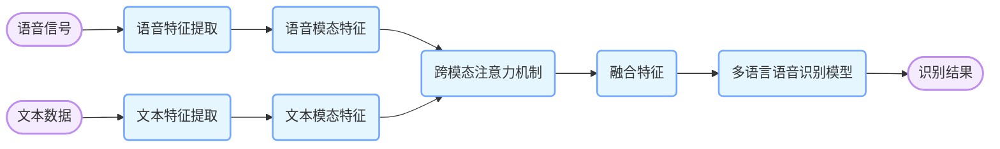

# 跨模态注意力在多语言语音识别中的创新

> 关键词：跨模态注意力、多语言语音识别、深度学习、特征融合、语音技术

> 摘要：本文聚焦于跨模态注意力在多语言语音识别中的创新应用。首先介绍了多语言语音识别的背景和面临的挑战，阐述了跨模态注意力机制的核心概念及其与多语言语音识别的联系。深入剖析了跨模态注意力的核心算法原理，并给出Python代码实现。通过数学模型和公式详细讲解其工作机制，结合实际案例展示跨模态注意力在多语言语音识别中的具体应用。探讨了其实际应用场景，推荐了相关的学习资源、开发工具和论文著作。最后对跨模态注意力在多语言语音识别领域的未来发展趋势与挑战进行总结，旨在为该领域的研究和实践提供全面且深入的参考。

## 1. 背景介绍 
### 1.1 目的和范围
多语言语音识别技术旨在将不同语言的语音信号准确地转换为文本，这对于打破语言障碍、促进信息交流具有重要意义。然而，多语言语音识别面临着语言多样性、口音差异、语义理解等诸多挑战。跨模态注意力作为一种新兴的技术手段，能够融合多种模态信息，如语音、文本、图像等，为多语言语音识别带来新的突破。本文的目的在于深入探讨跨模态注意力在多语言语音识别中的创新应用，分析其原理、算法和实际应用效果，范围涵盖理论研究、算法实现、项目实战以及应用场景等多个方面。

### 1.2 预期读者
本文预期读者包括对语音技术、深度学习、自然语言处理等领域感兴趣的研究人员、工程师、学生以及相关从业人员。无论是想要深入了解跨模态注意力和多语言语音识别技术的初学者，还是希望在该领域进行创新研究和开发的专业人士，都能从本文中获取有价值的信息和参考。

### 1.3 文档结构概述
本文将按照以下结构进行组织：首先介绍背景知识，包括目的、预期读者和文档结构概述；接着阐述跨模态注意力和多语言语音识别的核心概念及其联系；详细讲解跨模态注意力的核心算法原理和具体操作步骤，并给出Python代码实现；通过数学模型和公式深入剖析其工作机制，并举例说明；展示跨模态注意力在多语言语音识别中的项目实战案例，包括开发环境搭建、源代码实现和代码解读；探讨其实际应用场景；推荐相关的学习资源、开发工具和论文著作；最后总结跨模态注意力在多语言语音识别领域的未来发展趋势与挑战，并提供常见问题解答和扩展阅读参考资料。

### 1.4 术语表
#### 1.4.1 核心术语定义
- **跨模态注意力**：一种能够关注不同模态信息之间关联和重要性的机制，通过对不同模态特征的加权处理，实现多模态信息的有效融合。
- **多语言语音识别**：将多种不同语言的语音信号转换为对应文本的技术，需要处理不同语言的语音特点、语法规则和语义信息。
- **深度学习**：一类基于人工神经网络的机器学习方法，通过多层神经网络自动学习数据中的复杂模式和特征。
- **特征融合**：将来自不同模态或不同来源的特征进行整合，以获取更全面、更具代表性的特征表示。
- **语音信号**：由声音振动产生的电信号，包含了语音的声学特征和语义信息。

#### 1.4.2 相关概念解释
- **模态**：指信息的不同表现形式，如语音、文本、图像、视频等。不同模态的信息具有不同的特征和表示方式。
- **注意力机制**：一种模拟人类注意力分配的机制，能够在大量信息中自动选择重要的部分进行重点处理，提高模型的性能和效率。
- **语音特征提取**：从语音信号中提取出能够反映语音本质特征的参数，如梅尔频率倒谱系数（MFCC）、线性预测倒谱系数（LPCC）等。
- **语言模型**：用于描述语言的概率分布，对语音识别结果进行后处理和优化，提高识别的准确性和自然度。

#### 1.4.3 缩略词列表
- **MFCC**：Mel Frequency Cepstral Coefficients，梅尔频率倒谱系数
- **LPCC**：Linear Predictive Cepstral Coefficients，线性预测倒谱系数
- **RNN**：Recurrent Neural Network，循环神经网络
- **LSTM**：Long Short-Term Memory，长短期记忆网络
- **GRU**：Gated Recurrent Unit，门控循环单元
- **Transformer**：一种基于注意力机制的深度学习模型架构

## 2. 核心概念与联系 

### 2.1 跨模态注意力机制原理
跨模态注意力机制的核心思想是在不同模态的信息之间建立关联，通过注意力权重来衡量不同模态特征的重要性，从而实现多模态信息的有效融合。在多语言语音识别中，常见的模态包括语音模态和文本模态。语音模态包含了语音的声学特征，而文本模态则包含了语言的语义信息。跨模态注意力机制能够在这两种模态之间进行信息交互，提高语音识别的准确性和语义理解能力。

跨模态注意力机制通常包括以下几个步骤：
1. **特征提取**：从不同模态的数据中提取出相应的特征表示。例如，对于语音数据，可以使用MFCC等方法提取声学特征；对于文本数据，可以使用词嵌入等方法提取语义特征。
2. **注意力计算**：计算不同模态特征之间的注意力权重。注意力权重反映了不同模态特征之间的关联程度和重要性。
3. **特征融合**：根据注意力权重，对不同模态的特征进行加权融合，得到综合的特征表示。
4. **后续处理**：将融合后的特征输入到后续的模型中进行语音识别或其他任务。

### 2.2 多语言语音识别原理
多语言语音识别系统通常由语音特征提取、声学模型、语言模型和解码器等部分组成。其工作流程如下：
1. **语音特征提取**：将输入的语音信号转换为一系列的声学特征向量，如MFCC、LPCC等。这些特征向量能够反映语音的声学特性。
2. **声学模型**：声学模型用于描述语音特征和语音单元（如音素、音节等）之间的概率关系。常见的声学模型包括隐马尔可夫模型（HMM）、深度神经网络（DNN）等。
3. **语言模型**：语言模型用于描述语言的概率分布，对语音识别结果进行后处理和优化。语言模型可以根据上下文信息，提高识别结果的准确性和自然度。
4. **解码器**：解码器根据声学模型和语言模型的输出，搜索最优的语音识别结果。常见的解码算法包括维特比算法、束搜索算法等。

### 2.3 跨模态注意力与多语言语音识别的联系
跨模态注意力机制可以为多语言语音识别带来以下几个方面的改进：
1. **提高语义理解能力**：通过融合语音和文本模态的信息，跨模态注意力机制能够更好地理解语音的语义信息，从而提高语音识别的准确性和自然度。
2. **处理语言多样性**：不同语言具有不同的语音特点和语法规则，跨模态注意力机制能够自适应地处理这些差异，提高多语言语音识别的性能。
3. **增强抗噪能力**：文本模态的信息可以为语音识别提供额外的上下文信息，帮助模型更好地抵抗噪声干扰，提高在嘈杂环境下的语音识别性能。

### 2.4 文本示意图
```plaintext
跨模态注意力在多语言语音识别中的应用架构

语音信号  ---->  语音特征提取  ---->  语音模态特征
文本数据  ---->  文本特征提取  ---->  文本模态特征

语音模态特征  ---\
                   -->  跨模态注意力机制  --->  融合特征  --->  多语言语音识别模型  --->  识别结果
文本模态特征  ---/
```

### 2.5 Mermaid 流程图


## 3. 核心算法原理 & 具体操作步骤 

### 3.1 跨模态注意力算法原理
跨模态注意力算法的核心是计算不同模态特征之间的注意力权重。常见的跨模态注意力计算方法包括点积注意力、缩放点积注意力等。下面以缩放点积注意力为例，详细介绍其原理。

缩放点积注意力的计算公式如下：
$$Attention(Q, K, V) = softmax(\frac{QK^T}{\sqrt{d_k}})V$$
其中，$Q$ 是查询矩阵，$K$ 是键矩阵，$V$ 是值矩阵，$d_k$ 是键矩阵的维度。

在跨模态注意力中，$Q$ 通常来自一个模态的特征，$K$ 和 $V$ 来自另一个模态的特征。通过计算 $Q$ 和 $K$ 的点积，得到不同模态特征之间的相似度得分。然后，将得分除以 $\sqrt{d_k}$ 进行缩放，以避免点积值过大导致梯度消失或爆炸。最后，使用 softmax 函数将得分转换为注意力权重，对 $V$ 进行加权求和，得到融合后的特征。

### 3.2 具体操作步骤
1. **特征提取**：从语音信号和文本数据中分别提取语音模态特征和文本模态特征。可以使用预训练的模型或自定义的特征提取方法。
2. **定义查询、键和值矩阵**：将语音模态特征作为查询矩阵 $Q$，文本模态特征作为键矩阵 $K$ 和值矩阵 $V$。
3. **计算注意力权重**：根据缩放点积注意力公式，计算 $Q$ 和 $K$ 的点积，并进行缩放和 softmax 操作，得到注意力权重。
4. **特征融合**：根据注意力权重，对值矩阵 $V$ 进行加权求和，得到融合后的特征。
5. **后续处理**：将融合后的特征输入到多语言语音识别模型中进行识别。

### 3.3 Python 源代码实现
```python
import torch
import torch.nn as nn
import torch.nn.functional as F

class ScaledDotProductAttention(nn.Module):
    def __init__(self, d_k):
        super(ScaledDotProductAttention, self).__init__()
        self.d_k = d_k

    def forward(self, q, k, v):
        # 计算 Q 和 K 的点积
        attn_scores = torch.matmul(q, k.transpose(-2, -1))
        # 缩放点积
        attn_scores = attn_scores / torch.sqrt(torch.tensor(self.d_k, dtype=torch.float32))
        # 计算注意力权重
        attn_weights = F.softmax(attn_scores, dim=-1)
        # 加权求和得到融合特征
        output = torch.matmul(attn_weights, v)
        return output, attn_weights

# 示例使用
# 假设语音模态特征维度为 64，文本模态特征维度也为 64
d_k = 64
batch_size = 32
seq_len_q = 10
seq_len_kv = 15

# 生成随机的语音模态特征和文本模态特征
q = torch.randn(batch_size, seq_len_q, d_k)
k = torch.randn(batch_size, seq_len_kv, d_k)
v = torch.randn(batch_size, seq_len_kv, d_k)

# 创建缩放点积注意力模块
attention = ScaledDotProductAttention(d_k)
# 计算融合特征和注意力权重
output, attn_weights = attention(q, k, v)

print("融合特征形状:", output.shape)
print("注意力权重形状:", attn_weights.shape)
```

### 3.4 代码解释
1. **ScaledDotProductAttention 类**：定义了缩放点积注意力模块，包含一个 `__init__` 方法和一个 `forward` 方法。
2. **`__init__` 方法**：初始化模块，接收键矩阵的维度 $d_k$ 作为参数。
3. **`forward` 方法**：实现了缩放点积注意力的计算过程，包括点积计算、缩放、softmax 操作和加权求和。
4. **示例使用**：生成随机的语音模态特征和文本模态特征，创建缩放点积注意力模块，计算融合特征和注意力权重，并打印其形状。

## 4. 数学模型和公式 & 详细讲解 & 举例说明 

### 4.1 缩放点积注意力的数学模型
缩放点积注意力的数学模型可以用以下公式表示：
$$Attention(Q, K, V) = softmax(\frac{QK^T}{\sqrt{d_k}})V$$
其中：
- $Q \in \mathbb{R}^{n_q \times d_k}$ 是查询矩阵，$n_q$ 是查询的数量，$d_k$ 是键的维度。
- $K \in \mathbb{R}^{n_k \times d_k}$ 是键矩阵，$n_k$ 是键的数量。
- $V \in \mathbb{R}^{n_k \times d_v}$ 是值矩阵，$d_v$ 是值的维度。
- $QK^T \in \mathbb{R}^{n_q \times n_k}$ 是查询和键的点积矩阵，反映了不同查询和键之间的相似度得分。
- $\frac{QK^T}{\sqrt{d_k}}$ 是缩放后的点积矩阵，通过除以 $\sqrt{d_k}$ 来避免点积值过大。
- $softmax(\frac{QK^T}{\sqrt{d_k}}) \in \mathbb{R}^{n_q \times n_k}$ 是注意力权重矩阵，每个元素表示对应查询对不同键的注意力程度。
- $softmax(\frac{QK^T}{\sqrt{d_k}})V \in \mathbb{R}^{n_q \times d_v}$ 是融合后的特征矩阵，通过对值矩阵进行加权求和得到。

### 4.2 详细讲解
1. **点积计算**：$QK^T$ 计算了查询和键之间的相似度得分。每个查询向量与所有键向量进行点积运算，得到一个相似度得分。相似度得分越高，表示查询和键之间的相关性越强。
2. **缩放操作**：除以 $\sqrt{d_k}$ 是为了避免点积值过大。当 $d_k$ 较大时，点积值可能会变得非常大，导致 softmax 函数的梯度变得非常小，从而影响模型的训练效果。
3. **softmax 操作**：softmax 函数将缩放后的点积矩阵转换为注意力权重矩阵。softmax 函数的作用是将所有得分转换为概率分布，使得每个查询的注意力权重之和为 1。
4. **加权求和**：将注意力权重矩阵与值矩阵相乘，得到融合后的特征矩阵。每个查询对应的融合特征是通过对所有值向量进行加权求和得到的，权重为该查询对不同键的注意力权重。

### 4.3 举例说明
假设我们有以下查询、键和值矩阵：
$$Q = \begin{bmatrix}
1 & 2 \\
3 & 4
\end{bmatrix}, K = \begin{bmatrix}
5 & 6 \\
7 & 8
\end{bmatrix}, V = \begin{bmatrix}
9 & 10 \\
11 & 12
\end{bmatrix}$$
其中，$d_k = 2$。

1. **计算点积**：
$$QK^T = \begin{bmatrix}
1 & 2 \\
3 & 4
\end{bmatrix} \begin{bmatrix}
5 & 7 \\
6 & 8
\end{bmatrix} = \begin{bmatrix}
1\times5 + 2\times6 & 1\times7 + 2\times8 \\
3\times5 + 4\times6 & 3\times7 + 4\times8
\end{bmatrix} = \begin{bmatrix}
17 & 23 \\
39 & 53
\end{bmatrix}$$
2. **缩放点积**：
$$\frac{QK^T}{\sqrt{d_k}} = \frac{1}{\sqrt{2}} \begin{bmatrix}
17 & 23 \\
39 & 53
\end{bmatrix} \approx \begin{bmatrix}
12.02 & 16.26 \\
27.6 & 37.47
\end{bmatrix}$$
3. **计算注意力权重**：
$$softmax(\frac{QK^T}{\sqrt{d_k}}) = \begin{bmatrix}
\frac{e^{12.02}}{e^{12.02} + e^{16.26}} & \frac{e^{16.26}}{e^{12.02} + e^{16.26}} \\
\frac{e^{27.6}}{e^{27.6} + e^{37.47}} & \frac{e^{37.47}}{e^{27.6} + e^{37.47}}
\end{bmatrix} \approx \begin{bmatrix}
0.01 & 0.99 \\
0.00 & 1.00
\end{bmatrix}$$
4. **加权求和**：
$$softmax(\frac{QK^T}{\sqrt{d_k}})V = \begin{bmatrix}
0.01 & 0.99 \\
0.00 & 1.00
\end{bmatrix} \begin{bmatrix}
9 & 10 \\
11 & 12
\end{bmatrix} \approx \begin{bmatrix}
10.98 & 11.98 \\
11 & 12
\end{bmatrix}$$

通过以上步骤，我们得到了融合后的特征矩阵。

## 5. 项目实战：代码实际案例和详细解释说明 

### 5.1 开发环境搭建
1. **操作系统**：推荐使用 Linux 或 macOS 操作系统，也可以使用 Windows 操作系统。
2. **Python 环境**：建议使用 Python 3.7 及以上版本。可以使用 Anaconda 或 Miniconda 来管理 Python 环境。
3. **深度学习框架**：使用 PyTorch 作为深度学习框架。可以通过以下命令安装 PyTorch：
```bash
pip install torch torchvision
```
4. **其他依赖库**：安装必要的依赖库，如 NumPy、Matplotlib 等。可以使用以下命令安装：
```bash
pip install numpy matplotlib
```

### 5.2 源代码详细实现和代码解读
以下是一个简单的跨模态注意力在多语言语音识别中的项目实战示例。假设我们有语音特征和文本特征，我们将使用跨模态注意力机制将这两种特征融合，然后输入到一个简单的神经网络中进行语音识别。

```python
import torch
import torch.nn as nn
import torch.nn.functional as F

# 缩放点积注意力模块
class ScaledDotProductAttention(nn.Module):
    def __init__(self, d_k):
        super(ScaledDotProductAttention, self).__init__()
        self.d_k = d_k

    def forward(self, q, k, v):
        attn_scores = torch.matmul(q, k.transpose(-2, -1))
        attn_scores = attn_scores / torch.sqrt(torch.tensor(self.d_k, dtype=torch.float32))
        attn_weights = F.softmax(attn_scores, dim=-1)
        output = torch.matmul(attn_weights, v)
        return output, attn_weights

# 跨模态注意力模块
class CrossModalAttention(nn.Module):
    def __init__(self, d_model):
        super(CrossModalAttention, self).__init__()
        self.attention = ScaledDotProductAttention(d_model)

    def forward(self, speech_features, text_features):
        # 将语音特征作为查询，文本特征作为键和值
        output, attn_weights = self.attention(speech_features, text_features, text_features)
        return output, attn_weights

# 简单的多语言语音识别模型
class MultilingualSpeechRecognitionModel(nn.Module):
    def __init__(self, d_model, num_classes):
        super(MultilingualSpeechRecognitionModel, self).__init__()
        self.cross_modal_attention = CrossModalAttention(d_model)
        self.fc = nn.Linear(d_model, num_classes)

    def forward(self, speech_features, text_features):
        # 跨模态注意力融合特征
        fused_features, _ = self.cross_modal_attention(speech_features, text_features)
        # 平均池化
        pooled_features = torch.mean(fused_features, dim=1)
        # 全连接层进行分类
        logits = self.fc(pooled_features)
        return logits

# 示例使用
# 假设语音特征维度为 64，文本特征维度也为 64，类别数为 10
d_model = 64
num_classes = 10
batch_size = 32
seq_len_speech = 10
seq_len_text = 15

# 生成随机的语音特征和文本特征
speech_features = torch.randn(batch_size, seq_len_speech, d_model)
text_features = torch.randn(batch_size, seq_len_text, d_model)

# 创建模型
model = MultilingualSpeechRecognitionModel(d_model, num_classes)

# 前向传播
logits = model(speech_features, text_features)

print("模型输出形状:", logits.shape)
```

### 5.3 代码解读与分析
1. **ScaledDotProductAttention 类**：实现了缩放点积注意力机制，计算查询和键之间的注意力权重，并对值进行加权求和。
2. **CrossModalAttention 类**：封装了缩放点积注意力模块，将语音特征作为查询，文本特征作为键和值，进行跨模态注意力融合。
3. **MultilingualSpeechRecognitionModel 类**：定义了一个简单的多语言语音识别模型，包含跨模态注意力模块和一个全连接层。首先使用跨模态注意力融合语音和文本特征，然后进行平均池化，最后通过全连接层进行分类。
4. **示例使用**：生成随机的语音特征和文本特征，创建模型并进行前向传播，打印模型输出的形状。

通过这个示例，我们可以看到如何使用跨模态注意力机制将语音和文本特征融合，并应用于多语言语音识别任务中。

## 6. 实际应用场景 
### 6.1 智能语音助手
智能语音助手如 Siri、小爱同学等需要支持多语言语音识别，以满足不同用户的需求。跨模态注意力可以融合语音和文本信息，提高智能语音助手的语义理解能力和语音识别准确性，使其能够更好地理解用户的意图，提供更加准确和智能的服务。

### 6.2 会议翻译
在国际会议、商务谈判等场景中，需要实时进行多语言语音翻译。跨模态注意力可以结合语音和文本信息，提高语音识别和翻译的准确性，帮助参会人员更好地理解不同语言的发言内容，促进信息交流和沟通。

### 6.3 教育领域
在在线教育、语言学习等领域，多语言语音识别技术可以用于语音作业批改、口语评测等。跨模态注意力可以融合语音和文本信息，提高语音识别的准确性和语义理解能力，为学生提供更加准确的反馈和指导，提高学习效果。

### 6.4 智能家居
智能家居系统可以通过语音控制实现设备的自动化操作。跨模态注意力可以提高多语言语音识别的准确性，使智能家居系统能够更好地理解不同用户的语音指令，提供更加便捷和智能的家居服务。

### 6.5 客服系统
客服系统可以通过语音识别技术实现自动客服功能。跨模态注意力可以融合语音和文本信息，提高语音识别的准确性和语义理解能力，使客服系统能够更好地理解用户的问题，提供更加准确和高效的服务。

## 7. 工具和资源推荐
### 7.1 学习资源推荐
#### 7.1.1 书籍推荐
- 《深度学习》（Deep Learning）：由 Ian Goodfellow、Yoshua Bengio 和 Aaron Courville 所著，是深度学习领域的经典教材，涵盖了深度学习的基本概念、算法和应用。
- 《动手学深度学习》（Dive into Deep Learning）：由 Aston Zhang、Zachary C. Lipton、Mu Li 和 Alexander J. Smola 所著，是一本基于代码实践的深度学习教材，适合初学者快速上手。
- 《自然语言处理入门》：由何晗所著，介绍了自然语言处理的基本概念、算法和应用，对语音识别和跨模态学习有一定的涉及。

#### 7.1.2 在线课程
- Coursera 上的“深度学习专项课程”（Deep Learning Specialization）：由 Andrew Ng 教授授课，是深度学习领域的经典在线课程，涵盖了神经网络、卷积神经网络、循环神经网络等多个方面的内容。
- edX 上的“语音技术基础”（Fundamentals of Speech Technology）：介绍了语音技术的基本原理和算法，包括语音识别、语音合成等内容。
- B 站（哔哩哔哩）上有许多关于深度学习和语音技术的教学视频，可以根据自己的需求进行学习。

#### 7.1.3 技术博客和网站
- Medium 上有许多关于深度学习和语音技术的优秀博客文章，可以关注一些知名博主，如 Andrej Karpathy、Jeremy Howard 等。
- arXiv.org 是一个预印本论文平台，可以及时了解到最新的研究成果和技术进展。
- Kaggle 是一个数据科学竞赛平台，上面有许多关于语音识别和跨模态学习的竞赛和开源代码，可以参考学习。

### 7.2 开发工具框架推荐
#### 7.2.1 IDE和编辑器
- PyCharm：是一款专门为 Python 开发设计的集成开发环境（IDE），具有强大的代码编辑、调试和项目管理功能。
- Jupyter Notebook：是一个交互式的开发环境，适合进行数据探索、模型实验和代码演示。
- Visual Studio Code：是一款轻量级的代码编辑器，支持多种编程语言和插件扩展，非常适合快速开发和调试。

#### 7.2.2 调试和性能分析工具
- PyTorch 自带的调试工具：PyTorch 提供了一些调试工具，如 `torch.utils.bottleneck` 可以帮助分析代码的性能瓶颈。
- TensorBoard：是一个可视化工具，可以用于可视化模型的训练过程、损失曲线、准确率等指标，帮助调试和优化模型。
- NVIDIA Nsight Systems：是一款性能分析工具，可以对 GPU 加速的代码进行性能分析，找出性能瓶颈和优化点。

#### 7.2.3 相关框架和库
- PyTorch：是一个开源的深度学习框架，具有动态图、自动求导等优点，广泛应用于语音识别、自然语言处理等领域。
- TorchAudio：是 PyTorch 的音频处理库，提供了语音特征提取、音频数据加载等功能，方便进行语音识别任务的开发。
- Transformers：是一个基于 PyTorch 的自然语言处理库，提供了许多预训练的模型，如 BERT、GPT 等，可以用于文本特征提取和语义理解。

### 7.3 相关论文著作推荐
#### 7.3.1 经典论文
- “Attention Is All You Need”：提出了 Transformer 模型，引入了注意力机制，是深度学习领域的经典论文，对跨模态注意力的发展产生了重要影响。
- “Deep Speech 2: End-to-End Speech Recognition in English and Mandarin”：介绍了 Deep Speech 2 模型，是端到端语音识别的经典论文，为多语言语音识别提供了重要的思路和方法。
- “Multimodal Machine Learning: A Survey and Taxonomy”：对多模态机器学习进行了全面的综述和分类，为跨模态注意力的研究提供了理论基础。

#### 7.3.2 最新研究成果
- 可以通过 arXiv.org、ACM Digital Library、IEEE Xplore 等学术数据库搜索最新的关于跨模态注意力和多语言语音识别的研究论文，了解该领域的最新技术进展和研究成果。

#### 7.3.3 应用案例分析
- 一些顶级学术会议如 ACL（Association for Computational Linguistics）、ICASSP（International Conference on Acoustics, Speech and Signal Processing）等会收录一些关于跨模态注意力和多语言语音识别的应用案例，可以通过这些会议的论文集了解实际应用中的技术和方法。

## 8. 总结：未来发展趋势与挑战
### 8.1 未来发展趋势
1. **多模态融合的深度和广度不断拓展**：未来，跨模态注意力将不仅仅局限于语音和文本的融合，还将涉及到图像、视频、触觉等更多模态的信息融合，实现更加全面和深入的多模态学习。
2. **个性化和自适应的多语言语音识别**：随着用户需求的不断个性化，多语言语音识别系统将能够根据用户的语言习惯、口音特点等进行自适应调整，提供更加个性化的语音识别服务。
3. **与其他技术的融合创新**：跨模态注意力将与区块链、物联网、云计算等技术进行融合创新，拓展多语言语音识别的应用场景和服务模式。
4. **端到端的多语言语音识别系统**：未来的多语言语音识别系统将朝着端到端的方向发展，减少中间环节，提高系统的整体性能和效率。

### 8.2 挑战
1. **数据稀缺性**：多语言语音识别需要大量的标注数据，而不同语言的数据资源分布不均衡，一些小语种的数据非常稀缺，这给模型的训练和优化带来了很大的挑战。
2. **计算资源需求**：跨模态注意力模型通常比较复杂，需要大量的计算资源进行训练和推理。在资源受限的设备上，如何提高模型的效率和性能是一个亟待解决的问题。
3. **语义理解的局限性**：虽然跨模态注意力可以融合多种模态的信息，但在语义理解方面仍然存在一定的局限性，如何更好地理解语言的语义和语境，提高语音识别的准确性和自然度，是未来需要研究的重点。
4. **隐私和安全问题**：多语言语音识别涉及到用户的语音数据和个人信息，如何保障数据的隐私和安全，防止数据泄露和滥用，是一个重要的挑战。

## 9. 附录：常见问题与解答
### 9.1 跨模态注意力与传统注意力机制有什么区别？
传统注意力机制通常关注同一模态内的信息，而跨模态注意力机制能够关注不同模态信息之间的关联和重要性，实现多模态信息的有效融合。

### 9.2 跨模态注意力在多语言语音识别中的优势是什么？
跨模态注意力可以融合语音和文本等多种模态的信息，提高语音识别的准确性和语义理解能力，处理语言多样性和口音差异，增强抗噪能力等。

### 9.3 如何选择合适的特征提取方法？
选择合适的特征提取方法需要考虑数据的特点、任务的需求和模型的性能等因素。对于语音数据，可以选择 MFCC、LPCC 等经典的特征提取方法；对于文本数据，可以选择词嵌入、预训练模型等方法。

### 9.4 跨模态注意力模型的训练需要注意什么？
跨模态注意力模型的训练需要注意数据的质量和数量、模型的复杂度、学习率的调整、训练的稳定性等问题。可以采用数据增强、正则化等方法来提高模型的性能和泛化能力。

### 9.5 如何评估跨模态注意力在多语言语音识别中的性能？
可以使用准确率、召回率、F1 值、字错误率（WER）、句错误率（SER）等指标来评估跨模态注意力在多语言语音识别中的性能。同时，还可以进行主观评价，如用户满意度调查等。

## 10. 扩展阅读 & 参考资料
1. Goodfellow, I., Bengio, Y., & Courville, A. (2016). Deep Learning. MIT Press.
2. Zhang, A., Lipton, Z. C., Li, M., & Smola, A. J. (2020). Dive into Deep Learning.
3. Vaswani, A., Shazeer, N., Parmar, N., Uszkoreit, J., Jones, L., Gomez, A. N., ... & Polosukhin, I. (2017). Attention is all you need. In Advances in neural information processing systems (pp. 5998-6008).
4. Amodei, D., Ananthanarayanan, S., Anubhai, R., Bai, J., Battenberg, E., Case, C., ... & Wu, Y. (2016). Deep speech 2: End-to-end speech recognition in english and mandarin. In International conference on machine learning (pp. 173-182).
5. Baltrušaitis, T., Ahuja, C., & Morency, L. P. (2018). Multimodal machine learning: A survey and taxonomy. IEEE transactions on pattern analysis and machine intelligence, 41(2), 423-443.
6. PyTorch 官方文档：https://pytorch.org/docs/stable/index.html
7. TorchAudio 官方文档：https://pytorch.org/audio/stable/index.html
8. Transformers 官方文档：https://huggingface.co/docs/transformers/index
9. arXiv.org：https://arxiv.org/
10. ACM Digital Library：https://dl.acm.org/
11. IEEE Xplore：https://ieeexplore.ieee.org/