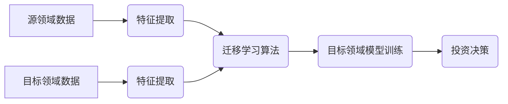

# 迁移学习在跨市场投资模型中的应用

> 关键词：迁移学习、跨市场投资模型、金融市场、模型泛化、知识迁移

> 摘要：本文深入探讨了迁移学习在跨市场投资模型中的应用。首先介绍了研究的背景和相关概念，包括迁移学习的原理、跨市场投资的特点等。接着详细阐述了迁移学习的核心算法原理，并用Python代码进行了具体实现。同时，给出了相关的数学模型和公式，并结合实例进行说明。通过项目实战展示了如何在实际中搭建基于迁移学习的跨市场投资模型，包括开发环境搭建、源代码实现及解读。还分析了该技术在实际金融市场中的应用场景，推荐了相关的学习资源、开发工具和论文著作。最后对迁移学习在跨市场投资模型中的未来发展趋势与挑战进行了总结，并提供了常见问题的解答和扩展阅读资料，旨在为金融投资领域的研究者和从业者提供全面且深入的技术参考。

## 1. 背景介绍 
### 1.1 目的和范围
在金融投资领域，不同的金融市场如股票市场、债券市场、期货市场等具有各自独特的特征和规律。传统的投资模型往往是针对单一市场进行开发和训练的，然而，随着全球金融市场的日益互联互通，投资者希望能够利用不同市场之间的关联信息来构建更有效的投资策略。迁移学习作为一种机器学习技术，旨在将一个领域（源领域）的知识迁移到另一个领域（目标领域），从而提高目标领域模型的性能。本研究的目的在于探索迁移学习在跨市场投资模型中的应用，通过将一个市场的知识迁移到另一个市场，提升投资模型的泛化能力和预测准确性。研究范围涵盖了常见的金融市场，包括股票、债券、期货等，以及多种迁移学习算法在这些市场投资模型中的应用。

### 1.2 预期读者
本文预期读者包括金融投资领域的从业者，如投资经理、交易员、金融分析师等，他们希望借助先进的机器学习技术提升投资决策的准确性和效率；机器学习和人工智能领域的研究者，对将迁移学习应用于金融领域感兴趣；以及相关专业的学生，希望通过学习了解迁移学习在实际金融场景中的应用案例。

### 1.3 文档结构概述
本文首先介绍迁移学习和跨市场投资的相关背景知识，包括术语定义和概念解释。接着详细阐述迁移学习的核心概念、算法原理和数学模型。通过项目实战展示如何在实际中应用迁移学习构建跨市场投资模型，包括开发环境搭建、代码实现和解读。然后分析迁移学习在跨市场投资中的实际应用场景。推荐相关的学习资源、开发工具和论文著作。最后总结迁移学习在跨市场投资模型中的未来发展趋势与挑战，并提供常见问题的解答和扩展阅读资料。

### 1.4 术语表
#### 1.4.1 核心术语定义
- **迁移学习**：是一种机器学习技术，旨在将从一个或多个源领域学习到的知识迁移到目标领域，以提高目标领域模型的性能。
- **跨市场投资**：指投资者同时参与多个不同的金融市场进行投资活动，以实现资产的多元化配置和风险分散。
- **源领域**：在迁移学习中，是指知识的来源领域，通常具有较多的标注数据和先验知识。
- **目标领域**：在迁移学习中，是指需要应用迁移知识的领域，通常数据量较少或缺乏足够的标注信息。

#### 1.4.2 相关概念解释
- **领域自适应**：是迁移学习中的一种常见方法，旨在通过调整源领域和目标领域的数据分布，使得模型能够在不同领域之间更好地泛化。
- **特征迁移**：是指将源领域的特征表示迁移到目标领域，以帮助目标领域模型更好地学习和分类。
- **模型微调**：在迁移学习中，通常先在源领域上预训练一个模型，然后在目标领域上对该模型进行微调，以适应目标领域的任务。

#### 1.4.3 缩略词列表
- **ML**：Machine Learning，机器学习
- **TL**：Transfer Learning，迁移学习
- **SVM**：Support Vector Machine，支持向量机
- **CNN**：Convolutional Neural Network，卷积神经网络

## 2. 核心概念与联系 

### 2.1 迁移学习的原理
迁移学习的核心思想是利用不同领域之间的相似性，将源领域的知识迁移到目标领域，从而提高目标领域模型的性能。在金融市场中，不同市场可能受到相似的宏观经济因素、政策环境等影响，因此存在一定的相似性，可以利用迁移学习来挖掘这些相似性并应用到投资模型中。

迁移学习主要包括以下几种类型：
- **基于实例的迁移学习**：直接从源领域中选择一些与目标领域相似的实例，将其作为额外的训练数据添加到目标领域的训练集中。
- **基于特征的迁移学习**：通过对源领域和目标领域的数据进行特征变换，使得两个领域的数据在特征空间中具有相似的分布，从而实现知识的迁移。
- **基于模型的迁移学习**：先在源领域上训练一个模型，然后将该模型的部分或全部参数作为目标领域模型的初始参数，再在目标领域上进行微调。

### 2.2 跨市场投资的特点
跨市场投资具有以下特点：
- **多元化**：投资者可以通过参与多个不同的金融市场，实现资产的多元化配置，降低单一市场波动带来的风险。
- **复杂性**：不同市场具有各自独特的交易规则、市场机制和风险特征，增加了投资决策的复杂性。
- **关联性**：不同市场之间存在一定的关联性，如股票市场和债券市场在宏观经济环境变化时可能呈现出相反的走势。

### 2.3 迁移学习与跨市场投资的联系
迁移学习可以帮助跨市场投资者更好地利用不同市场之间的关联信息，提高投资模型的泛化能力和预测准确性。例如，通过将股票市场的知识迁移到期货市场，可以在期货市场数据较少的情况下，构建更有效的投资模型。同时，迁移学习还可以帮助投资者更好地理解不同市场之间的相似性和差异性，从而制定更合理的投资策略。

### 2.4 文本示意图
迁移学习在跨市场投资中的应用可以用以下示意图表示：

源领域（如股票市场） -- 知识提取 -- 迁移学习算法 -- 目标领域（如期货市场） -- 投资模型 -- 投资决策

### 2.5 Mermaid 流程图


## 3. 核心算法原理 & 具体操作步骤 

### 3.1 基于模型微调的迁移学习算法原理
基于模型微调的迁移学习算法是一种常见的迁移学习方法，其基本原理如下：
1. **预训练模型**：在源领域上使用大量的数据训练一个模型，这个模型可以是神经网络、支持向量机等。
2. **初始化目标领域模型**：将预训练模型的部分或全部参数作为目标领域模型的初始参数。
3. **微调模型**：在目标领域上使用少量的数据对目标领域模型进行微调，更新模型的参数，使其适应目标领域的任务。

### 3.2 Python 代码实现
以下是一个基于 PyTorch 实现的简单的基于模型微调的迁移学习示例，假设我们要将在股票市场数据上预训练的模型迁移到期货市场数据上：

```python
import torch
import torch.nn as nn
import torch.optim as optim
from torch.utils.data import DataLoader, Dataset

# 定义一个简单的神经网络模型
class SimpleNet(nn.Module):
    def __init__(self, input_size, hidden_size, output_size):
        super(SimpleNet, self).__init__()
        self.fc1 = nn.Linear(input_size, hidden_size)
        self.relu = nn.ReLU()
        self.fc2 = nn.Linear(hidden_size, output_size)

    def forward(self, x):
        out = self.fc1(x)
        out = self.relu(out)
        out = self.fc2(out)
        return out

# 定义自定义数据集类
class CustomDataset(Dataset):
    def __init__(self, data, labels):
        self.data = data
        self.labels = labels

    def __len__(self):
        return len(self.data)

    def __getitem__(self, idx):
        return self.data[idx], self.labels[idx]

# 生成模拟的股票市场数据（源领域数据）
stock_data = torch.randn(1000, 10)
stock_labels = torch.randint(0, 2, (1000,))

# 生成模拟的期货市场数据（目标领域数据）
futures_data = torch.randn(200, 10)
futures_labels = torch.randint(0, 2, (200,))

# 创建数据集和数据加载器
stock_dataset = CustomDataset(stock_data, stock_labels)
stock_dataloader = DataLoader(stock_dataset, batch_size=32, shuffle=True)

futures_dataset = CustomDataset(futures_data, futures_labels)
futures_dataloader = DataLoader(futures_dataset, batch_size=32, shuffle=True)

# 预训练模型
input_size = 10
hidden_size = 20
output_size = 2
model = SimpleNet(input_size, hidden_size, output_size)
criterion = nn.CrossEntropyLoss()
optimizer = optim.Adam(model.parameters(), lr=0.001)

# 在股票市场数据上预训练模型
num_epochs = 10
for epoch in range(num_epochs):
    for inputs, labels in stock_dataloader:
        optimizer.zero_grad()
        outputs = model(inputs)
        loss = criterion(outputs, labels)
        loss.backward()
        optimizer.step()
    print(f'Epoch {epoch+1}/{num_epochs}, Loss: {loss.item()}')

# 迁移学习：在期货市场数据上微调模型
# 冻结预训练模型的部分参数
for param in model.fc1.parameters():
    param.requires_grad = False

# 重新定义优化器，只更新可训练的参数
optimizer = optim.Adam(filter(lambda p: p.requires_grad, model.parameters()), lr=0.001)

# 在期货市场数据上微调模型
num_epochs = 5
for epoch in range(num_epochs):
    for inputs, labels in futures_dataloader:
        optimizer.zero_grad()
        outputs = model(inputs)
        loss = criterion(outputs, labels)
        loss.backward()
        optimizer.step()
    print(f'Epoch {epoch+1}/{num_epochs}, Loss: {loss.item()}')
```

### 3.3 具体操作步骤
1. **数据准备**：收集源领域（如股票市场）和目标领域（如期货市场）的数据，并进行预处理，包括数据清洗、特征提取等。
2. **预训练模型**：在源领域数据上训练一个模型，可以使用常见的机器学习或深度学习算法。
3. **初始化目标领域模型**：将预训练模型的参数作为目标领域模型的初始参数。
4. **微调模型**：在目标领域数据上对目标领域模型进行微调，更新模型的参数，使其适应目标领域的任务。
5. **模型评估**：使用目标领域的测试数据对微调后的模型进行评估，计算模型的性能指标，如准确率、召回率等。

## 4. 数学模型和公式 & 详细讲解 & 举例说明 

### 4.1 基于模型微调的迁移学习数学模型
假设我们有一个源领域数据集 $D_s = \{(x_{s1}, y_{s1}), (x_{s2}, y_{s2}), \cdots, (x_{sn_s}, y_{sn_s})\}$ 和一个目标领域数据集 $D_t = \{(x_{t1}, y_{t1}), (x_{t2}, y_{t2}), \cdots, (x_{tn_t}, y_{tn_t})\}$，其中 $x_{si}$ 和 $x_{tj}$ 分别是源领域和目标领域的特征向量，$y_{si}$ 和 $y_{tj}$ 分别是对应的标签。

我们首先在源领域数据集 $D_s$ 上训练一个模型 $f_s$，使得损失函数 $L_s(f_s, D_s)$ 最小化：

$$\min_{f_s} L_s(f_s, D_s) = \frac{1}{n_s} \sum_{i=1}^{n_s} l(f_s(x_{si}), y_{si})$$

其中 $l$ 是损失函数，如交叉熵损失函数。

然后，我们将模型 $f_s$ 的参数 $\theta_s$ 作为目标领域模型 $f_t$ 的初始参数 $\theta_t^0$，即 $\theta_t^0 = \theta_s$。

接着，在目标领域数据集 $D_t$ 上对模型 $f_t$ 进行微调，使得损失函数 $L_t(f_t, D_t)$ 最小化：

$$\min_{\theta_t} L_t(f_t, D_t) = \frac{1}{n_t} \sum_{j=1}^{n_t} l(f_t(x_{tj}), y_{tj})$$

在微调过程中，我们可以冻结部分预训练模型的参数，只更新部分可训练的参数。

### 4.2 举例说明
假设我们有一个简单的线性回归模型 $f(x) = \theta_0 + \theta_1 x$，在源领域数据集 $D_s$ 上训练得到的参数为 $\theta_s = (\theta_{s0}, \theta_{s1})$。

我们将 $\theta_s$ 作为目标领域模型的初始参数 $\theta_t^0 = \theta_s$，然后在目标领域数据集 $D_t$ 上进行微调。假设目标领域数据集 $D_t$ 有两个样本 $(x_{t1}, y_{t1})$ 和 $(x_{t2}, y_{t2})$，损失函数为均方误差损失函数 $l(f(x), y) = (f(x) - y)^2$。

则目标领域的损失函数为：

$$L_t(f_t, D_t) = \frac{1}{2} \left[(f_t(x_{t1}) - y_{t1})^2 + (f_t(x_{t2}) - y_{t2})^2\right]$$

我们通过梯度下降法更新模型的参数 $\theta_t$，使得 $L_t(f_t, D_t)$ 最小化。

## 5. 项目实战：代码实际案例和详细解释说明 

### 5.1  开发环境搭建
1. **安装 Python**：建议使用 Python 3.7 及以上版本，可以从 Python 官方网站下载安装。
2. **安装 PyTorch**：根据自己的系统和 CUDA 版本选择合适的 PyTorch 版本进行安装，可以使用以下命令安装：
```sh
pip install torch torchvision
```
3. **安装其他依赖库**：如 numpy、pandas 等，可以使用以下命令安装：
```sh
pip install numpy pandas
```

### 5.2  源代码详细实现和代码解读
以下是一个完整的基于迁移学习的跨市场投资模型的代码示例，我们将使用真实的股票和期货市场数据进行实验：

```python
import torch
import torch.nn as nn
import torch.optim as optim
from torch.utils.data import DataLoader, Dataset
import numpy as np
import pandas as pd

# 定义一个简单的神经网络模型
class SimpleNet(nn.Module):
    def __init__(self, input_size, hidden_size, output_size):
        super(SimpleNet, self).__init__()
        self.fc1 = nn.Linear(input_size, hidden_size)
        self.relu = nn.ReLU()
        self.fc2 = nn.Linear(hidden_size, output_size)

    def forward(self, x):
        out = self.fc1(x)
        out = self.relu(out)
        out = self.fc2(out)
        return out

# 定义自定义数据集类
class CustomDataset(Dataset):
    def __init__(self, data, labels):
        self.data = torch.tensor(data, dtype=torch.float32)
        self.labels = torch.tensor(labels, dtype=torch.long)

    def __len__(self):
        return len(self.data)

    def __getitem__(self, idx):
        return self.data[idx], self.labels[idx]

# 加载股票市场数据（源领域数据）
stock_data = pd.read_csv('stock_data.csv')
stock_features = stock_data.drop('label', axis=1).values
stock_labels = stock_data['label'].values

# 加载期货市场数据（目标领域数据）
futures_data = pd.read_csv('futures_data.csv')
futures_features = futures_data.drop('label', axis=1).values
futures_labels = futures_data['label'].values

# 创建数据集和数据加载器
stock_dataset = CustomDataset(stock_features, stock_labels)
stock_dataloader = DataLoader(stock_dataset, batch_size=32, shuffle=True)

futures_dataset = CustomDataset(futures_features, futures_labels)
futures_dataloader = DataLoader(futures_dataset, batch_size=32, shuffle=True)

# 预训练模型
input_size = stock_features.shape[1]
hidden_size = 20
output_size = len(np.unique(stock_labels))
model = SimpleNet(input_size, hidden_size, output_size)
criterion = nn.CrossEntropyLoss()
optimizer = optim.Adam(model.parameters(), lr=0.001)

# 在股票市场数据上预训练模型
num_epochs = 10
for epoch in range(num_epochs):
    for inputs, labels in stock_dataloader:
        optimizer.zero_grad()
        outputs = model(inputs)
        loss = criterion(outputs, labels)
        loss.backward()
        optimizer.step()
    print(f'Epoch {epoch+1}/{num_epochs}, Loss: {loss.item()}')

# 迁移学习：在期货市场数据上微调模型
# 冻结预训练模型的部分参数
for param in model.fc1.parameters():
    param.requires_grad = False

# 重新定义优化器，只更新可训练的参数
optimizer = optim.Adam(filter(lambda p: p.requires_grad, model.parameters()), lr=0.001)

# 在期货市场数据上微调模型
num_epochs = 5
for epoch in range(num_epochs):
    for inputs, labels in futures_dataloader:
        optimizer.zero_grad()
        outputs = model(inputs)
        loss = criterion(outputs, labels)
        loss.backward()
        optimizer.step()
    print(f'Epoch {epoch+1}/{num_epochs}, Loss: {loss.item()}')
```

### 5.3  代码解读与分析
1. **数据加载**：使用 `pandas` 库加载股票市场和期货市场的数据，并将其转换为 `numpy` 数组。
2. **数据集和数据加载器**：定义自定义数据集类 `CustomDataset`，并使用 `torch.utils.data.DataLoader` 创建数据加载器，方便批量加载数据。
3. **模型定义**：定义一个简单的神经网络模型 `SimpleNet`，包含一个全连接层、一个 ReLU 激活函数和另一个全连接层。
4. **预训练模型**：在股票市场数据上训练模型，使用交叉熵损失函数和 Adam 优化器。
5. **迁移学习**：将预训练模型的部分参数冻结，只更新部分可训练的参数，然后在期货市场数据上对模型进行微调。

通过这种方式，我们可以利用股票市场的知识来提升期货市场投资模型的性能。

## 6. 实际应用场景 
### 6.1 跨市场资产配置
投资者可以利用迁移学习技术，将一个市场的投资知识迁移到另一个市场，从而实现跨市场的资产配置。例如，将股票市场的投资策略迁移到债券市场，根据股票市场的走势和规律来调整债券市场的投资组合，以实现风险分散和收益最大化。

### 6.2 市场趋势预测
通过迁移学习，可以将一个市场的趋势预测模型迁移到另一个市场，提高目标市场趋势预测的准确性。例如，将股票市场的趋势预测模型迁移到期货市场，利用股票市场的历史数据和特征来预测期货市场的走势，为投资者提供决策依据。

### 6.3 风险评估
在跨市场投资中，不同市场的风险特征可能存在一定的关联。迁移学习可以帮助投资者将一个市场的风险评估模型迁移到另一个市场，更全面地评估投资组合的风险。例如，将股票市场的风险评估模型迁移到外汇市场，考虑股票市场的波动对外汇市场的影响，从而制定更合理的风险管理策略。

## 7. 工具和资源推荐
### 7.1 学习资源推荐
#### 7.1.1 书籍推荐
- 《机器学习》（周志华）：全面介绍了机器学习的基本概念、算法和应用，是机器学习领域的经典教材。
- 《深度学习》（Ian Goodfellow、Yoshua Bengio 和 Aaron Courville）：深入介绍了深度学习的理论和实践，适合有一定机器学习基础的读者。
- 《迁移学习》（Qiang Yang、Yang Liu）：专门介绍迁移学习的理论和方法，是迁移学习领域的权威著作。

#### 7.1.2 在线课程
- Coursera 上的 “Machine Learning” 课程（Andrew Ng 教授）：经典的机器学习入门课程，讲解详细，适合初学者。
- edX 上的 “Deep Learning Specialization” 课程（Andrew Ng 教授）：深入介绍深度学习的各个方面，包括卷积神经网络、循环神经网络等。
- 中国大学 MOOC 上的 “机器学习基础” 课程：由国内知名高校的教授授课，内容丰富，适合国内读者学习。

#### 7.1.3 技术博客和网站
- Medium 上的 “Towards Data Science”：有大量关于机器学习、深度学习和数据科学的文章，涵盖了最新的研究成果和实践经验。
- arXiv 网站：提供了大量的学术论文，包括机器学习、迁移学习等领域的最新研究成果。
- 开源中国：国内知名的技术社区，有很多关于机器学习和人工智能的技术文章和经验分享。

### 7.2 开发工具框架推荐
#### 7.2.1 IDE和编辑器
- PyCharm：功能强大的 Python 集成开发环境，提供了代码编辑、调试、版本控制等功能，适合开发机器学习和深度学习项目。
- Jupyter Notebook：交互式的开发环境，适合进行数据探索、模型训练和结果可视化，在机器学习和数据科学领域广泛使用。
- Visual Studio Code：轻量级的代码编辑器，支持多种编程语言和插件，适合快速开发和调试。

#### 7.2.2 调试和性能分析工具
- TensorBoard：TensorFlow 提供的可视化工具，可以帮助用户可视化模型的训练过程、损失函数变化、模型结构等，方便调试和优化模型。
- PyTorch Profiler：PyTorch 提供的性能分析工具，可以帮助用户分析模型的性能瓶颈，优化代码性能。
- cProfile：Python 内置的性能分析工具，可以帮助用户分析代码的运行时间和函数调用情况，找出性能瓶颈。

#### 7.2.3 相关框架和库
- PyTorch：开源的深度学习框架，提供了丰富的神经网络模块和优化算法，易于使用和扩展。
- TensorFlow：另一个流行的深度学习框架，具有强大的分布式训练和部署能力，广泛应用于工业界和学术界。
- Scikit-learn：简单易用的机器学习库，提供了各种机器学习算法和工具，适合快速开发和实验。

### 7.3 相关论文著作推荐
#### 7.3.1 经典论文
- “Transfer Learning for Cross-Domain Classification with Hierarchical Class Structures”：提出了一种基于层次分类结构的跨领域分类迁移学习方法。
- “Domain Adaptation via Transfer Component Analysis”：介绍了一种基于迁移成分分析的领域自适应方法，用于解决不同领域数据分布不一致的问题。
- “Learning Transferable Features with Deep Adaptation Networks”：提出了深度自适应网络，用于在深度学习中实现迁移学习。

#### 7.3.2 最新研究成果
- 关注 arXiv 网站上关于迁移学习和金融领域的最新研究论文，了解该领域的前沿技术和发展趋势。
- 参加国际机器学习会议（ICML）、神经信息处理系统大会（NeurIPS）等学术会议，获取最新的研究成果和学术动态。

#### 7.3.3 应用案例分析
- 阅读相关的金融研究报告和案例分析，了解迁移学习在实际金融市场中的应用效果和经验教训。
- 关注金融科技公司的官方博客和技术分享，获取他们在跨市场投资模型中应用迁移学习的实践经验。

## 8. 总结：未来发展趋势与挑战
### 8.1 未来发展趋势
- **多领域融合**：迁移学习将与更多的领域进行融合，如量子计算、区块链等，为跨市场投资模型带来更多的创新和发展机遇。
- **强化学习结合**：将迁移学习与强化学习相结合，可以更好地处理动态的金融市场环境，实现更智能的投资决策。
- **自动化迁移学习**：开发自动化的迁移学习工具和框架，降低迁移学习的使用门槛，使得更多的投资者和金融从业者能够应用该技术。

### 8.2 挑战
- **数据隐私和安全**：在跨市场投资中，涉及到大量的敏感金融数据，如何保证数据的隐私和安全是一个重要的挑战。
- **领域差异处理**：不同金融市场之间存在较大的领域差异，如何有效地处理这些差异，提高迁移学习的效果是一个亟待解决的问题。
- **模型解释性**：迁移学习模型通常比较复杂，如何解释模型的决策过程和结果，让投资者和监管机构理解和信任模型是一个重要的挑战。

## 9. 附录：常见问题与解答
### 9.1 迁移学习在跨市场投资中一定能提高模型性能吗？
不一定。迁移学习的效果取决于源领域和目标领域之间的相似性、数据质量、迁移学习算法的选择等因素。如果源领域和目标领域之间的差异较大，或者数据质量较差，迁移学习可能无法提高模型性能，甚至可能降低模型性能。

### 9.2 如何选择合适的迁移学习算法？
选择合适的迁移学习算法需要考虑多个因素，如数据的特点、领域之间的差异、模型的复杂度等。一般来说，可以先尝试一些简单的迁移学习算法，如基于模型微调的方法，然后根据实验结果选择更合适的算法。

### 9.3 迁移学习在跨市场投资中需要注意哪些问题？
在跨市场投资中应用迁移学习需要注意以下问题：
- **数据预处理**：确保源领域和目标领域的数据具有相同的特征表示和数据格式，进行必要的数据清洗和特征工程。
- **模型评估**：使用合适的评估指标对迁移学习模型进行评估，确保模型在目标领域具有良好的性能。
- **风险管理**：尽管迁移学习可以提高模型性能，但仍然存在一定的风险，需要进行有效的风险管理。

## 10. 扩展阅读 & 参考资料
- 《金融机器学习》（Lopez de Prado）：介绍了机器学习在金融领域的应用，包括投资组合优化、风险评估等。
- 《人工智能与金融》（黄益平、杨涛）：探讨了人工智能在金融领域的应用和发展趋势。
- 相关学术期刊：如《Journal of Financial Economics》、《Review of Financial Studies》等，发表了很多关于金融投资和机器学习的研究论文。

以上是关于迁移学习在跨市场投资模型中的应用的详细介绍，希望对读者有所帮助。