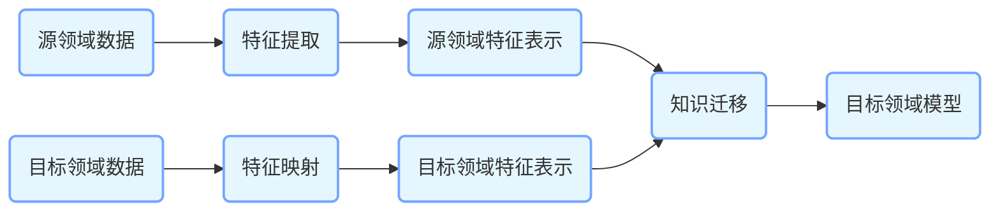

# 迁移学习：快速适应新领域的AI Agent

> 关键词：迁移学习、AI Agent、领域适应、知识迁移、深度学习、机器学习、模型泛化

> 摘要：本文围绕迁移学习这一核心技术，深入探讨其如何助力AI Agent快速适应新领域。首先介绍迁移学习的背景，包括目的、预期读者等内容。接着阐述核心概念与联系，剖析其原理和架构。通过Python代码详细讲解核心算法原理与具体操作步骤，并辅以数学模型和公式进行理论支持。在项目实战部分，给出代码实际案例及详细解释。随后探讨迁移学习的实际应用场景，推荐相关工具和资源。最后总结未来发展趋势与挑战，解答常见问题并提供扩展阅读和参考资料，旨在帮助读者全面了解迁移学习以及其在AI Agent领域的重要作用。

## 1. 背景介绍 
### 1.1 目的和范围
迁移学习的主要目的在于解决传统机器学习和深度学习中数据稀缺、训练成本高以及模型泛化能力不足等问题。在现实世界的众多应用场景中，收集大规模有标注的数据是一项耗时、耗力且成本高昂的任务。迁移学习通过将在一个或多个源领域中学习到的知识迁移到目标领域，能够显著减少目标领域所需的数据量和训练时间，提高模型的性能和效率。

本文的范围涵盖迁移学习的基本概念、核心算法、数学模型、实际应用以及相关工具和资源等方面。旨在为读者提供一个全面、深入的迁移学习知识体系，帮助读者理解迁移学习的原理和实现方法，并能够将其应用到实际项目中。

### 1.2 预期读者
本文预期读者包括但不限于以下几类人群：
- 机器学习和深度学习领域的研究人员，希望深入了解迁移学习的最新研究成果和技术趋势。
- 人工智能开发人员，希望掌握迁移学习的算法和实现方法，以提高模型的性能和效率。
- 数据科学家，希望利用迁移学习解决实际项目中数据稀缺和模型泛化的问题。
- 对人工智能和机器学习感兴趣的学生和爱好者，希望通过本文了解迁移学习的基本概念和应用场景。

### 1.3 文档结构概述
本文将按照以下结构进行组织：
- 核心概念与联系：介绍迁移学习的基本概念、原理和架构，通过文本示意图和Mermaid流程图进行直观展示。
- 核心算法原理 & 具体操作步骤：详细讲解迁移学习的核心算法原理，并使用Python源代码进行具体实现。
- 数学模型和公式 & 详细讲解 & 举例说明：介绍迁移学习的数学模型和公式，并通过具体例子进行详细讲解。
- 项目实战：代码实际案例和详细解释说明：给出迁移学习的实际项目案例，包括开发环境搭建、源代码实现和代码解读。
- 实际应用场景：探讨迁移学习在不同领域的实际应用场景。
- 工具和资源推荐：推荐与迁移学习相关的学习资源、开发工具框架和论文著作。
- 总结：未来发展趋势与挑战：总结迁移学习的未来发展趋势和面临的挑战。
- 附录：常见问题与解答：解答读者在学习和应用迁移学习过程中常见的问题。
- 扩展阅读 & 参考资料：提供与迁移学习相关的扩展阅读和参考资料。

### 1.4 术语表
#### 1.4.1 核心术语定义
- **迁移学习（Transfer Learning）**：是一种机器学习技术，旨在将在一个或多个源领域中学习到的知识迁移到目标领域，以提高目标领域的学习效果。
- **源领域（Source Domain）**：是指已经有大量标注数据的领域，从中可以学习到有用的知识。
- **目标领域（Target Domain）**：是指需要应用迁移学习的领域，通常数据量较少或标注成本较高。
- **知识迁移（Knowledge Transfer）**：是指将源领域中的知识（如特征表示、模型参数等）迁移到目标领域的过程。
- **AI Agent（人工智能智能体）**：是指能够感知环境、做出决策并采取行动的智能实体，迁移学习可以帮助AI Agent快速适应新的环境和任务。

#### 1.4.2 相关概念解释
- **领域适应（Domain Adaptation）**：是迁移学习的一种特殊情况，主要关注源领域和目标领域之间的数据分布差异，通过调整模型或数据来减少这种差异，从而提高模型在目标领域的性能。
- **多源迁移学习（Multi - Source Transfer Learning）**：是指从多个源领域中迁移知识到目标领域，以充分利用不同源领域的信息。
- **零样本学习（Zero - Shot Learning）**：是迁移学习的一种极端情况，在目标领域没有任何标注数据的情况下，通过利用源领域的知识和语义信息来进行预测。

#### 1.4.3 缩略词列表
- **CNN（Convolutional Neural Network）**：卷积神经网络
- **DNN（Deep Neural Network）**：深度神经网络
- **SVM（Support Vector Machine）**：支持向量机
- **MLP（Multi - Layer Perceptron）**：多层感知机

## 2. 核心概念与联系 
迁移学习的核心思想是利用源领域和目标领域之间的相关性，将源领域中学习到的知识迁移到目标领域，从而提高目标领域的学习效果。其基本原理可以通过以下几个方面来理解：

### 特征表示的迁移
在不同领域的数据中，可能存在一些共同的特征表示。通过学习源领域中有用的特征表示，并将其应用到目标领域，可以减少目标领域所需的训练数据量。例如，在图像识别任务中，不同类型的图像可能具有一些共同的边缘、纹理等特征，这些特征可以在不同的图像领域中进行迁移。

### 模型参数的迁移
可以将在源领域中训练好的模型参数作为目标领域模型的初始参数，然后在目标领域的少量数据上进行微调。这样可以利用源领域的先验知识，加快目标领域模型的收敛速度，提高模型的性能。

### 任务之间的相关性
如果源领域和目标领域的任务具有一定的相关性，那么在源领域中学习到的任务解决方法可以为目标领域的任务提供参考。例如，在自然语言处理中，情感分析和文本分类任务具有一定的相关性，可以将在情感分析任务中学习到的知识迁移到文本分类任务中。

### 核心概念的文本示意图
```plaintext
源领域数据  -- 特征提取 -->  源领域特征表示
                                          |
                                          v
目标领域数据  -- 特征映射 -->  目标领域特征表示  -- 知识迁移 -->  目标领域模型
```

### Mermaid流程图


## 3. 核心算法原理 & 具体操作步骤 
### 基于特征迁移的算法原理
基于特征迁移的算法主要是通过学习源领域和目标领域的共同特征表示，来实现知识的迁移。一种常见的方法是使用自动编码器（Autoencoder）。

自动编码器是一种无监督学习模型，其目标是将输入数据编码为低维的特征表示，然后再将这些特征表示解码为原始输入数据。在迁移学习中，可以先在源领域的数据上训练一个自动编码器，得到源领域的特征表示。然后，将目标领域的数据输入到训练好的自动编码器中，得到目标领域的特征表示。最后，使用这些特征表示在目标领域上训练一个分类器或回归器。

### Python源代码实现
```python
import numpy as np
import tensorflow as tf
from tensorflow.keras import layers, models

# 生成模拟的源领域和目标领域数据
# 源领域数据
source_data = np.random.rand(1000, 10)
# 目标领域数据
target_data = np.random.rand(200, 10)

# 定义自动编码器模型
input_dim = 10
encoding_dim = 5

input_layer = layers.Input(shape=(input_dim,))
encoded = layers.Dense(encoding_dim, activation='relu')(input_layer)
decoded = layers.Dense(input_dim, activation='sigmoid')(encoded)

autoencoder = models.Model(input_layer, decoded)
encoder = models.Model(input_layer, encoded)

autoencoder.compile(optimizer='adam', loss='binary_crossentropy')

# 在源领域数据上训练自动编码器
autoencoder.fit(source_data, source_data, epochs=50, batch_size=32)

# 获取目标领域数据的特征表示
target_features = encoder.predict(target_data)

# 示例：在目标领域特征上训练一个简单的分类器
# 生成模拟的目标领域标签
target_labels = np.random.randint(0, 2, 200)

# 定义分类器模型
classifier = models.Sequential([
    layers.Dense(10, activation='relu', input_shape=(encoding_dim,)),
    layers.Dense(1, activation='sigmoid')
])

classifier.compile(optimizer='adam', loss='binary_crossentropy', metrics=['accuracy'])

# 训练分类器
classifier.fit(target_features, target_labels, epochs=20, batch_size=16)
```

### 具体操作步骤
1. **数据准备**：收集源领域和目标领域的数据，并进行预处理，如归一化、标准化等。
2. **自动编码器训练**：在源领域的数据上训练一个自动编码器，得到源领域的特征表示。
3. **特征提取**：将目标领域的数据输入到训练好的自动编码器中，得到目标领域的特征表示。
4. **目标领域模型训练**：使用目标领域的特征表示训练一个分类器或回归器，以完成目标领域的任务。

## 4. 数学模型和公式 & 详细讲解 & 举例说明 
### 自动编码器的数学模型
自动编码器的目标是最小化输入数据 $x$ 和重构数据 $\hat{x}$ 之间的误差。通常使用均方误差（Mean Squared Error，MSE）或交叉熵损失（Cross - Entropy Loss）作为损失函数。

均方误差损失函数的定义为：
$$
L(x, \hat{x})=\frac{1}{n}\sum_{i = 1}^{n}(x_i-\hat{x}_i)^2
$$
其中，$n$ 是数据的维度，$x_i$ 和 $\hat{x}_i$ 分别是输入数据和重构数据的第 $i$ 个维度。

交叉熵损失函数的定义为：
$$
L(x, \hat{x})=-\frac{1}{n}\sum_{i = 1}^{n}[x_i\log(\hat{x}_i)+(1 - x_i)\log(1-\hat{x}_i)]
$$

### 详细讲解
自动编码器由编码器和解码器两部分组成。编码器将输入数据 $x$ 映射到低维的特征表示 $z$，可以表示为：
$$
z = f(x; \theta_e)
$$
其中，$f$ 是编码器的映射函数，$\theta_e$ 是编码器的参数。

解码器将特征表示 $z$ 映射回原始输入空间，得到重构数据 $\hat{x}$，可以表示为：
$$
\hat{x}=g(z; \theta_d)
$$
其中，$g$ 是解码器的映射函数，$\theta_d$ 是解码器的参数。

自动编码器的训练过程就是通过最小化损失函数 $L(x, \hat{x})$ 来学习编码器和解码器的参数 $\theta_e$ 和 $\theta_d$。

### 举例说明
假设我们有一个二维的输入数据 $x=(x_1, x_2)$，编码器将其映射到一维的特征表示 $z$，解码器将 $z$ 映射回二维的重构数据 $\hat{x}=(\hat{x}_1, \hat{x}_2)$。

编码器的映射函数可以表示为：
$$
z = w_1x_1 + w_2x_2 + b_1
$$
其中，$w_1$ 和 $w_2$ 是编码器的权重，$b_1$ 是编码器的偏置。

解码器的映射函数可以表示为：
$$
\hat{x}_1 = w_3z + b_2 \\
\hat{x}_2 = w_4z + b_3
$$
其中，$w_3$ 和 $w_4$ 是解码器的权重，$b_2$ 和 $b_3$ 是解码器的偏置。

我们的目标是通过最小化均方误差损失函数 $L(x, \hat{x})=(x_1-\hat{x}_1)^2+(x_2-\hat{x}_2)^2$ 来学习编码器和解码器的参数 $w_1, w_2, w_3, w_4, b_1, b_2, b_3$。

## 5. 项目实战：代码实际案例和详细解释说明 
### 5.1  开发环境搭建
本项目使用Python进行开发，需要安装以下主要库：
- **TensorFlow**：用于构建和训练深度学习模型。
- **NumPy**：用于处理数值计算。

可以使用以下命令安装所需的库：
```sh
pip install tensorflow numpy
```

### 5.2  源代码详细实现和代码解读
```python
import numpy as np
import tensorflow as tf
from tensorflow.keras import layers, models
from sklearn.datasets import make_classification
from sklearn.model_selection import train_test_split

# 生成模拟的源领域和目标领域数据
# 源领域数据
source_X, source_y = make_classification(n_samples=1000, n_features=20, n_informative=10, n_classes=2, random_state=42)
source_X_train, source_X_test, source_y_train, source_y_test = train_test_split(source_X, source_y, test_size=0.2, random_state=42)

# 目标领域数据
target_X, target_y = make_classification(n_samples=200, n_features=20, n_informative=10, n_classes=2, random_state=43)
target_X_train, target_X_test, target_y_train, target_y_test = train_test_split(target_X, target_y, test_size=0.2, random_state=43)

# 定义源领域模型
source_model = models.Sequential([
    layers.Dense(10, activation='relu', input_shape=(20,)),
    layers.Dense(1, activation='sigmoid')
])

source_model.compile(optimizer='adam', loss='binary_crossentropy', metrics=['accuracy'])

# 在源领域数据上训练模型
source_model.fit(source_X_train, source_y_train, epochs=50, batch_size=32, validation_data=(source_X_test, source_y_test))

# 迁移学习：将源领域模型的参数迁移到目标领域模型
target_model = models.Sequential([
    layers.Dense(10, activation='relu', input_shape=(20,)),
    layers.Dense(1, activation='sigmoid')
])

# 复制源领域模型的参数到目标领域模型
target_model.set_weights(source_model.get_weights())

# 在目标领域数据上微调模型
target_model.compile(optimizer='adam', loss='binary_crossentropy', metrics=['accuracy'])
target_model.fit(target_X_train, target_y_train, epochs=20, batch_size=16, validation_data=(target_X_test, target_y_test))

# 评估目标领域模型的性能
loss, accuracy = target_model.evaluate(target_X_test, target_y_test)
print(f"Target model accuracy: {accuracy}")
```

### 5.3  代码解读与分析
1. **数据生成**：使用 `sklearn.datasets.make_classification` 函数生成模拟的源领域和目标领域数据，并将其划分为训练集和测试集。
2. **源领域模型训练**：定义一个简单的神经网络模型 `source_model`，并在源领域的训练数据上进行训练。
3. **参数迁移**：定义目标领域模型 `target_model`，并将源领域模型的参数复制到目标领域模型中。
4. **目标领域模型微调**：在目标领域的训练数据上对目标领域模型进行微调，以适应目标领域的任务。
5. **性能评估**：使用目标领域的测试数据评估目标领域模型的性能。

通过这种方式，我们利用了源领域的知识，减少了目标领域所需的训练数据量和训练时间，提高了目标领域模型的性能。

## 6. 实际应用场景 
### 图像识别
在图像识别领域，迁移学习可以帮助模型快速适应新的图像类别。例如，在一个已经训练好的图像分类模型的基础上，可以通过迁移学习将其应用到新的图像分类任务中，如识别不同品种的宠物。由于不同图像类别之间可能存在一些共同的特征，如边缘、纹理等，因此可以将在源领域（如通用图像分类）中学习到的特征表示迁移到目标领域（如宠物图像分类）中，从而减少目标领域所需的训练数据量和训练时间。

### 自然语言处理
在自然语言处理中，迁移学习可以用于文本分类、情感分析、机器翻译等任务。例如，在一个已经训练好的语言模型（如BERT）的基础上，可以通过微调将其应用到特定的文本分类任务中。由于语言模型已经学习到了大量的语言知识，因此可以将这些知识迁移到目标任务中，提高模型的性能。

### 医疗领域
在医疗领域，数据的收集和标注通常比较困难，因此迁移学习具有很大的应用潜力。例如，在医学图像诊断中，可以将在公共医学图像数据集上训练好的模型迁移到特定医院的医学图像数据集上，以提高诊断的准确性。此外，在疾病预测和药物研发等领域，迁移学习也可以帮助利用已有的医学知识和数据，加快研究进程。

### 机器人领域
在机器人领域，迁移学习可以帮助机器人快速适应新的环境和任务。例如，在一个已经训练好的机器人导航模型的基础上，可以通过迁移学习将其应用到新的环境中，如不同的室内场景或室外地形。机器人可以利用在源环境中学习到的运动策略和环境感知能力，快速适应目标环境，提高导航的效率和准确性。

## 7. 工具和资源推荐
### 7.1 学习资源推荐
#### 7.1.1 书籍推荐
- 《深度学习》（Deep Learning）：由Ian Goodfellow、Yoshua Bengio和Aaron Courville所著，是深度学习领域的经典教材，涵盖了迁移学习等多个方面的内容。
- 《机器学习》（Machine Learning）：由Tom M. Mitchell所著，是机器学习领域的经典教材，对迁移学习的基本概念和算法有详细的介绍。
- 《迁移学习简明教程》（A Short Introduction to Transfer Learning）：专门介绍迁移学习的书籍，内容系统全面，适合初学者和研究人员阅读。

#### 7.1.2 在线课程
- Coursera上的“深度学习专项课程”（Deep Learning Specialization）：由Andrew Ng教授授课，包含了深度学习的多个方面，包括迁移学习的相关内容。
- edX上的“人工智能基础”（Foundations of Artificial Intelligence）：介绍了人工智能的基本概念和方法，其中涉及到迁移学习的原理和应用。
- 哔哩哔哩（Bilibili）上有许多关于迁移学习的视频教程，由不同的博主分享，内容生动易懂，适合初学者学习。

#### 7.1.3 技术博客和网站
- Medium上有许多关于迁移学习的技术博客文章，作者来自不同的领域和公司，分享了他们在迁移学习方面的实践经验和研究成果。
- arXiv.org是一个预印本服务器，上面有许多关于迁移学习的最新研究论文，可以及时了解迁移学习的前沿动态。
- 开源中国（OSChina）上有许多关于人工智能和机器学习的技术文章，其中也包含了一些关于迁移学习的实践案例和技术分享。

### 7.2 开发工具框架推荐
#### 7.2.1 IDE和编辑器
- PyCharm：是一款专门为Python开发设计的集成开发环境（IDE），具有强大的代码编辑、调试和项目管理功能，适合开发迁移学习相关的Python代码。
- Jupyter Notebook：是一个交互式的开发环境，支持Python等多种编程语言。它可以将代码、文本、图像等内容整合在一起，方便进行数据探索、模型训练和结果展示，非常适合进行迁移学习的实验和研究。
- Visual Studio Code：是一款轻量级的代码编辑器，支持多种编程语言和插件扩展。它具有丰富的代码高亮、自动补全和调试功能，并且可以通过安装相关插件来支持深度学习开发，是开发迁移学习项目的不错选择。

#### 7.2.2 调试和性能分析工具
- TensorBoard：是TensorFlow自带的可视化工具，可以用于可视化模型的训练过程、损失函数变化、模型结构等信息。通过TensorBoard可以方便地调试和优化迁移学习模型。
- PyTorch Profiler：是PyTorch提供的性能分析工具，可以帮助用户分析模型的计算性能、内存使用情况等，从而找出性能瓶颈并进行优化。
- NVIDIA Nsight Systems：是一款针对GPU加速应用的性能分析工具，可以帮助用户深入了解迁移学习模型在GPU上的运行情况，优化GPU资源的使用。

#### 7.2.3 相关框架和库
- TensorFlow：是一个开源的深度学习框架，提供了丰富的深度学习模型和工具，支持迁移学习的实现。它具有高度的灵活性和可扩展性，适合开发各种规模的迁移学习项目。
- PyTorch：是另一个流行的深度学习框架，具有简洁的API和动态计算图的特点，易于使用和调试。PyTorch也提供了许多支持迁移学习的工具和模型。
- Scikit - learn：是一个开源的机器学习库，提供了多种机器学习算法和工具，包括特征提取、模型选择、评估等。在迁移学习中，可以使用Scikit - learn进行数据预处理和模型评估。

### 7.3 相关论文著作推荐
#### 7.3.1 经典论文
- “A Survey on Transfer Learning”：由Sinno Jialin Pan和Qiang Yang所著，是迁移学习领域的经典综述论文，对迁移学习的基本概念、算法和应用进行了系统的介绍。
- “How transferable are features in deep neural networks?”：探讨了深度神经网络中特征的可迁移性问题，为迁移学习在深度学习中的应用提供了理论基础。
- “Domain Adaptation via Transfer Component Analysis”：提出了一种基于迁移成分分析（Transfer Component Analysis，TCA）的领域适应方法，是领域适应领域的经典论文。

#### 7.3.2 最新研究成果
- 在NeurIPS（神经信息处理系统大会）、ICML（国际机器学习会议）、CVPR（计算机视觉与模式识别会议）等顶级学术会议上，每年都会有许多关于迁移学习的最新研究成果发表。可以通过这些会议的官方网站或论文数据库获取相关论文。
- 一些顶级学术期刊，如Journal of Artificial Intelligence Research（JAIR）、Artificial Intelligence等，也会发表迁移学习领域的前沿研究论文。

#### 7.3.3 应用案例分析
- 许多公司和研究机构会在其官方博客或技术报告中分享迁移学习的应用案例，如Google、Facebook、Microsoft等。这些案例可以帮助读者了解迁移学习在实际项目中的应用场景和实现方法。
- Kaggle是一个数据科学竞赛平台，上面有许多关于迁移学习的竞赛和项目。通过参与这些竞赛和项目，可以学习到其他数据科学家的实践经验和技巧。

## 8. 总结：未来发展趋势与挑战
### 未来发展趋势
- **跨领域迁移学习**：未来的迁移学习将更加注重跨领域的知识迁移，例如将图像领域的知识迁移到自然语言处理领域，或者将医疗领域的知识迁移到金融领域。这将进一步拓展迁移学习的应用范围，提高模型的泛化能力。
- **深度迁移学习**：随着深度学习的不断发展，深度迁移学习将成为研究的热点。深度迁移学习将结合深度学习的强大表示能力和迁移学习的知识迁移能力，实现更高效、更准确的模型训练。
- **自适应迁移学习**：自适应迁移学习将能够自动调整迁移的策略和参数，根据源领域和目标领域的差异动态地进行知识迁移。这将提高迁移学习的灵活性和鲁棒性。
- **迁移学习与强化学习的结合**：迁移学习与强化学习的结合将为智能体的学习和决策提供更强大的支持。通过迁移学习，智能体可以快速适应新的环境和任务，提高学习效率和性能。

### 挑战
- **领域差异的处理**：源领域和目标领域之间的差异是迁移学习面临的主要挑战之一。如何有效地处理领域差异，减少领域间的分布不匹配，是提高迁移学习性能的关键。
- **知识的选择和迁移**：在迁移学习中，如何选择合适的知识进行迁移，以及如何将这些知识有效地迁移到目标领域，是一个具有挑战性的问题。不当的知识迁移可能会导致负迁移，降低目标领域的性能。
- **数据隐私和安全**：在迁移学习中，可能需要使用来自不同领域的数据，这涉及到数据隐私和安全的问题。如何在保证数据隐私和安全的前提下进行知识迁移，是一个亟待解决的问题。
- **可解释性**：迁移学习模型的可解释性是一个重要的问题。由于迁移学习涉及到知识的迁移和模型的调整，模型的决策过程往往比较复杂，难以解释。提高迁移学习模型的可解释性，将有助于用户更好地理解和信任模型的决策结果。

## 9. 附录：常见问题与解答
### 1. 迁移学习一定能提高目标领域的性能吗？
不一定。迁移学习的效果取决于源领域和目标领域之间的相关性、迁移的方法和参数等因素。如果源领域和目标领域之间的差异较大，或者迁移的方法和参数选择不当，可能会导致负迁移，降低目标领域的性能。

### 2. 如何选择合适的源领域？
选择合适的源领域需要考虑以下几个因素：
- **领域相关性**：源领域和目标领域应该具有一定的相关性，例如相同的任务类型、相似的数据分布等。
- **数据量**：源领域应该有足够多的标注数据，以便学习到有用的知识。
- **模型性能**：源领域的模型应该具有较好的性能，这样才能保证迁移的知识是有效的。

### 3. 迁移学习需要对源领域和目标领域的数据进行预处理吗？
需要。对源领域和目标领域的数据进行预处理可以提高数据的质量和一致性，减少领域间的差异。常见的预处理方法包括归一化、标准化、特征选择等。

### 4. 如何评估迁移学习的效果？
可以使用以下几种方法评估迁移学习的效果：
- **准确率、召回率、F1值等**：在目标领域的测试数据上计算模型的准确率、召回率、F1值等指标，评估模型的分类性能。
- **均方误差、平均绝对误差等**：在目标领域的测试数据上计算模型的均方误差、平均绝对误差等指标，评估模型的回归性能。
- **可视化分析**：通过可视化源领域和目标领域的数据分布、特征表示等，直观地观察迁移学习的效果。

## 10. 扩展阅读 & 参考资料
### 扩展阅读
- 《人工智能：一种现代的方法》（Artificial Intelligence: A Modern Approach）：对人工智能的各个方面进行了全面的介绍，包括机器学习、深度学习、迁移学习等内容。
- 《动手学深度学习》（Dive into Deep Learning）：通过实际案例和代码讲解深度学习的原理和应用，其中也涉及到迁移学习的相关内容。
- 《数据挖掘：概念与技术》（Data Mining: Concepts and Techniques）：介绍了数据挖掘的基本概念、算法和应用，对迁移学习在数据挖掘中的应用有一定的参考价值。

### 参考资料
- 各种学术论文和研究报告，如前面提到的经典论文和最新研究成果。
- 开源代码库，如GitHub上的相关项目，可以参考其中的代码实现和文档说明。
- 相关的技术博客和网站，如Medium、arXiv.org等，可以获取最新的技术动态和实践经验。