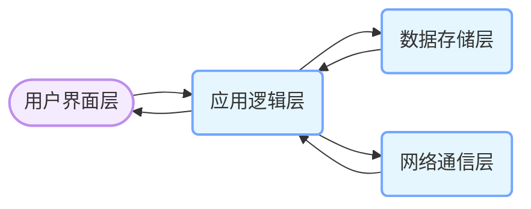

# 远程协作平台：效率提升工具

> 关键词：远程协作平台、效率提升、团队协作、沟通工具、项目管理

> 摘要：随着互联网技术的飞速发展和全球工作模式的转变，远程协作变得越来越普遍。远程协作平台作为支持远程工作的重要工具，能够显著提升团队的协作效率。本文将深入探讨远程协作平台的相关内容，包括其背景、核心概念、算法原理、数学模型、项目实战案例、实际应用场景等，同时推荐相关的工具和资源，最后对其未来发展趋势与挑战进行总结，旨在帮助读者全面了解远程协作平台并更好地利用其提升工作效率。

## 1. 背景介绍 
### 1.1 目的和范围
在当今数字化时代，远程工作已经成为一种趋势。企业和团队面临着如何在不同地理位置的成员之间实现高效协作的挑战。本文的目的在于全面介绍远程协作平台，探讨其如何成为提升工作效率的有效工具。范围涵盖远程协作平台的基本概念、技术原理、实际应用以及未来发展等多个方面。

### 1.2 预期读者
本文预期读者包括企业管理者、团队领导者、远程工作者、软件开发人员、对远程协作技术感兴趣的研究人员以及相关专业的学生等。无论是希望提升团队协作效率的管理者，还是想要深入了解远程协作技术的技术人员，都能从本文中获取有价值的信息。

### 1.3 文档结构概述
本文首先介绍远程协作平台的背景信息，包括目的、预期读者和文档结构概述等。接着阐述核心概念与联系，包括其原理和架构。然后详细讲解核心算法原理和具体操作步骤，并给出数学模型和公式。通过项目实战案例展示代码实现和详细解释。介绍实际应用场景和推荐相关的工具和资源。最后总结未来发展趋势与挑战，并提供常见问题与解答以及扩展阅读和参考资料。

### 1.4 术语表
#### 1.4.1 核心术语定义
- **远程协作平台**：一种基于互联网技术，支持不同地理位置的团队成员进行沟通、协作和项目管理的软件系统或平台。
- **实时通信**：指信息能够在发送和接收方之间几乎同时传递的通信方式，如视频会议、即时消息等。
- **版本控制**：用于管理和跟踪文件或项目的不同版本，记录文件的修改历史，方便团队成员协作开发和回溯历史版本。
- **工作流管理**：对业务流程进行建模、执行、监控和优化的过程，确保工作按照预定的规则和流程进行。

#### 1.4.2 相关概念解释
- **云存储**：通过互联网将数据存储在远程服务器上，用户可以通过网络随时随地访问和管理自己的数据。在远程协作平台中，云存储用于存储团队的文档、文件等资料，方便团队成员共享和协作。
- **协同编辑**：多个用户可以同时对同一个文档进行编辑和修改，系统会实时更新文档内容，保证团队成员之间的协作效率。

#### 1.4.3 缩略词列表
- **API**：Application Programming Interface（应用程序编程接口），用于不同软件系统之间进行交互和数据共享的接口。
- **SaaS**：Software as a Service（软件即服务），一种通过互联网提供软件服务的模式，用户无需安装和维护软件，只需通过浏览器即可使用。

## 2. 核心概念与联系 
### 核心概念原理
远程协作平台的核心原理是利用互联网技术，将不同地理位置的团队成员连接起来，实现信息的实时共享和交互。它主要基于以下几个方面的技术：
- **网络通信技术**：包括即时通信、视频会议等，确保团队成员之间能够及时、高效地沟通。
- **数据存储和管理技术**：采用云存储等技术，实现团队文档和数据的集中存储和管理，方便成员共享和访问。
- **工作流管理技术**：对团队的工作流程进行建模和管理，确保任务能够按照预定的规则和流程进行，提高工作效率。

### 架构的文本示意图
远程协作平台的架构通常包括以下几个层次：
- **用户界面层**：提供用户与平台交互的界面，如网页界面、桌面客户端、移动应用等。用户可以通过这些界面进行沟通、协作和项目管理等操作。
- **应用逻辑层**：实现平台的核心业务逻辑，如即时通信、文件共享、任务管理等功能。该层负责处理用户的请求，并与数据存储层和网络通信层进行交互。
- **数据存储层**：存储团队的各种数据，如文档、任务信息、用户信息等。通常采用数据库管理系统和云存储技术，确保数据的安全性和可靠性。
- **网络通信层**：负责实现用户之间的通信和数据传输，如即时消息、视频会议等。采用多种网络协议和技术，确保通信的稳定性和实时性。

### Mermaid 流程图


## 3. 核心算法原理 & 具体操作步骤 
### 核心算法原理
以远程协作平台中的文件版本控制算法为例，常见的版本控制算法基于差异比较和合并的思想。下面以Python代码详细阐述其原理。

```python
import difflib

def get_file_diff(file1, file2):
    """
    获取两个文件的差异
    :param file1: 第一个文件的内容列表
    :param file2: 第二个文件的内容列表
    :return: 差异内容列表
    """
    diff = difflib.unified_diff(file1, file2)
    return list(diff)

def merge_file_changes(base_file, diff):
    """
    合并文件的更改
    :param base_file: 基础文件的内容列表
    :param diff: 差异内容列表
    :return: 合并后的文件内容列表
    """
    new_file = base_file.copy()
    line_num = 0
    for line in diff:
        if line.startswith('+'):
            new_file.insert(line_num, line[1:])
            line_num += 1
        elif line.startswith('-'):
            new_file.pop(line_num)
        else:
            line_num += 1
    return new_file

# 示例使用
file1 = ['line 1', 'line 2', 'line 3']
file2 = ['line 1', 'new line', 'line 3']

diff = get_file_diff(file1, file2)
print("文件差异:")
for line in diff:
    print(line)

merged_file = merge_file_changes(file1, diff)
print("合并后的文件内容:")
for line in merged_file:
    print(line)
```

### 具体操作步骤
1. **获取文件差异**：使用`get_file_diff`函数比较两个文件的内容，返回差异内容列表。
2. **合并文件更改**：使用`merge_file_changes`函数将差异内容合并到基础文件中，得到合并后的文件内容。

## 4. 数学模型和公式 & 详细讲解 & 举例说明 
### 数学模型
在远程协作平台中，任务分配和调度可以使用线性规划模型进行优化。假设一个团队有 $n$ 个成员，有 $m$ 个任务需要完成。每个任务 $j$ 有一个工作量 $w_j$，每个成员 $i$ 有一个工作能力 $c_i$。目标是合理分配任务，使得总工作量最小。

### 数学公式
设 $x_{ij}$ 为一个二进制变量，表示成员 $i$ 是否分配到任务 $j$（$x_{ij} = 1$ 表示分配，$x_{ij} = 0$ 表示不分配）。则线性规划模型可以表示为：

$$
\min \sum_{i=1}^{n} \sum_{j=1}^{m} x_{ij} w_j
$$

约束条件：
- 每个任务必须由一个成员完成：$\sum_{i=1}^{n} x_{ij} = 1, \forall j = 1, \cdots, m$
- 每个成员的工作量不能超过其工作能力：$\sum_{j=1}^{m} x_{ij} w_j \leq c_i, \forall i = 1, \cdots, n$
- $x_{ij} \in \{0, 1\}, \forall i = 1, \cdots, n, \forall j = 1, \cdots, m$

### 详细讲解
目标函数 $\min \sum_{i=1}^{n} \sum_{j=1}^{m} x_{ij} w_j$ 表示最小化总工作量。第一个约束条件保证每个任务都有一个成员负责，第二个约束条件保证每个成员的工作量不超过其工作能力，第三个约束条件限定 $x_{ij}$ 为二进制变量。

### 举例说明
假设有 2 个成员（$n = 2$）和 3 个任务（$m = 3$），任务的工作量分别为 $w_1 = 5, w_2 = 3, w_3 = 4$，成员的工作能力分别为 $c_1 = 6, c_2 = 7$。

设 $x_{11}, x_{12}, x_{13}$ 表示成员 1 分配到任务 1、2、3 的情况，$x_{21}, x_{22}, x_{23}$ 表示成员 2 分配到任务 1、2、3 的情况。

目标函数为：$\min x_{11} \times 5 + x_{12} \times 3 + x_{13} \times 4 + x_{21} \times 5 + x_{22} \times 3 + x_{23} \times 4$

约束条件：
- $x_{11} + x_{21} = 1$
- $x_{12} + x_{22} = 1$
- $x_{13} + x_{23} = 1$
- $x_{11} \times 5 + x_{12} \times 3 + x_{13} \times 4 \leq 6$
- $x_{21} \times 5 + x_{22} \times 3 + x_{23} \times 4 \leq 7$
- $x_{ij} \in \{0, 1\}, i = 1, 2, j = 1, 2, 3$

通过求解这个线性规划问题，可以得到最优的任务分配方案。

## 5. 项目实战：代码实际案例和详细解释说明 
### 5.1  开发环境搭建
我们以一个简单的基于 Flask 的远程协作任务管理系统为例，介绍开发环境的搭建。

1. **安装 Python**：从 Python 官方网站（https://www.python.org/downloads/）下载并安装 Python 3.x 版本。
2. **创建虚拟环境**：打开命令行工具，进入项目目录，执行以下命令创建虚拟环境：
```bash
python -m venv venv
```
3. **激活虚拟环境**：
- 在 Windows 上：
```bash
venv\Scripts\activate
```
- 在 Linux 或 macOS 上：
```bash
source venv/bin/activate
```
4. **安装 Flask**：在激活的虚拟环境中，执行以下命令安装 Flask：
```bash
pip install flask
```

### 5.2  源代码详细实现和代码解读
```python
from flask import Flask, request, jsonify

app = Flask(__name__)

# 模拟任务列表
tasks = []

@app.route('/tasks', methods=['GET'])
def get_tasks():
    """
    获取所有任务
    :return: 任务列表的 JSON 格式数据
    """
    return jsonify(tasks)

@app.route('/tasks', methods=['POST'])
def add_task():
    """
    添加新任务
    :return: 新任务的 JSON 格式数据和状态码 201
    """
    data = request.get_json()
    if 'title' in data and 'description' in data:
        task = {
            'id': len(tasks) + 1,
            'title': data['title'],
            'description': data['description'],
            'completed': False
        }
        tasks.append(task)
        return jsonify(task), 201
    else:
        return jsonify({'error': 'Missing required fields'}), 400

@app.route('/tasks/<int:task_id>', methods=['PUT'])
def update_task(task_id):
    """
    更新任务信息
    :param task_id: 任务的 ID
    :return: 更新后的任务的 JSON 格式数据或错误信息
    """
    for task in tasks:
        if task['id'] == task_id:
            data = request.get_json()
            if 'title' in data:
                task['title'] = data['title']
            if 'description' in data:
                task['description'] = data['description']
            if 'completed' in data:
                task['completed'] = data['completed']
            return jsonify(task)
    return jsonify({'error': 'Task not found'}), 404

@app.route('/tasks/<int:task_id>', methods=['DELETE'])
def delete_task(task_id):
    """
    删除任务
    :param task_id: 任务的 ID
    :return: 空响应和状态码 204 或错误信息
    """
    for task in tasks:
        if task['id'] == task_id:
            tasks.remove(task)
            return '', 204
    return jsonify({'error': 'Task not found'}), 404

if __name__ == '__main__':
    app.run(debug=True)
```

### 5.3  代码解读与分析
- **`get_tasks` 函数**：处理 GET 请求，返回所有任务的列表。
- **`add_task` 函数**：处理 POST 请求，添加新任务。需要确保请求的 JSON 数据中包含 `title` 和 `description` 字段。
- **`update_task` 函数**：处理 PUT 请求，根据任务的 ID 更新任务信息。可以更新任务的 `title`、`description` 和 `completed` 字段。
- **`delete_task` 函数**：处理 DELETE 请求，根据任务的 ID 删除任务。

这个简单的任务管理系统实现了基本的任务增删改查功能，通过 Flask 框架提供了 RESTful API 接口，方便与其他系统进行集成。

## 6. 实际应用场景 
### 软件开发团队
在软件开发项目中，团队成员可能分布在不同的地区。远程协作平台可以用于团队成员之间的沟通、代码共享、版本控制和任务管理。例如，使用 Git 进行代码版本控制，通过 Slack 进行即时通信，使用 Jira 进行项目管理和任务跟踪。

### 教育领域
在远程教育中，教师和学生可以通过远程协作平台进行在线教学、学习讨论和作业提交。例如，使用 Zoom 进行视频教学，使用 Google Docs 进行协同编辑作业和文档。

### 设计团队
设计团队的成员可以通过远程协作平台共享设计稿、进行实时评论和反馈。例如，使用 InVision 进行设计稿的展示和评论，使用 Figma 进行协同设计。

### 跨国企业
跨国企业的不同部门和分支机构之间可以通过远程协作平台进行信息共享和业务协作。例如，使用 Microsoft Teams 进行跨部门沟通和项目协作，使用 SharePoint 进行文档管理和共享。

## 7. 工具和资源推荐
### 7.1 学习资源推荐
#### 7.1.1 书籍推荐
- 《Remote: Office Not Required》：这本书探讨了远程工作的各种问题和解决方案，提供了很多实用的建议和案例。
- 《The Lean Startup》：虽然主要是关于创业和产品开发的书籍，但其中的一些原则和方法也适用于远程协作项目的管理。

#### 7.1.2 在线课程
- Coursera 上的“Remote Work: Finding Success Anywhere”课程：介绍了远程工作的技能和策略，帮助学习者更好地适应远程工作环境。
- Udemy 上的“Remote Team Management”课程：专注于远程团队的管理和协作，提供了实用的管理技巧和方法。

#### 7.1.3 技术博客和网站
- Medium 上有很多关于远程协作和远程工作的技术博客，如“Remote Work Hub”等。
- Atlassian 官方博客：提供了很多关于团队协作和项目管理的文章和案例。

### 7.2 开发工具框架推荐
#### 7.2.1 IDE和编辑器
- Visual Studio Code：功能强大的开源代码编辑器，支持多种编程语言和插件扩展，适合远程开发和协作。
- PyCharm：专门为 Python 开发设计的集成开发环境，提供了丰富的代码编辑、调试和版本控制功能。

#### 7.2.2 调试和性能分析工具
- Chrome DevTools：用于调试和分析 Web 应用程序的性能和功能，支持远程调试。
- Sentry：用于监控和报告应用程序的错误和异常，方便及时发现和解决问题。

#### 7.2.3 相关框架和库
- Flask：轻量级的 Python Web 框架，适合快速开发小型的远程协作应用程序。
- React：用于构建用户界面的 JavaScript 库，提供了高效的组件化开发方式，适合开发远程协作平台的前端界面。

### 7.3 相关论文著作推荐
#### 7.3.1 经典论文
- “The Future of Work: Remote Work and the Digital Nomad Lifestyle”：探讨了远程工作的发展趋势和影响。
- “Collaborative Software Development in Distributed Teams”：研究了分布式团队中软件开发的协作模式和技术。

#### 7.3.2 最新研究成果
- 关注 ACM SIGGROUP 等学术会议上的最新研究成果，了解远程协作领域的前沿技术和研究方向。

#### 7.3.3 应用案例分析
- 一些知名企业的远程协作案例分析，如 GitHub 的远程工作模式和 Google 的团队协作实践等。

## 8. 总结：未来发展趋势与挑战
### 未来发展趋势
- **智能化**：远程协作平台将越来越智能化，例如通过人工智能技术实现自动任务分配、智能提醒和智能分析等功能，提高团队协作的效率和质量。
- **移动化**：随着移动设备的普及，远程协作平台将更加注重移动应用的开发和优化，方便团队成员随时随地进行协作。
- **集成化**：远程协作平台将与更多的工具和系统进行集成，如企业资源规划（ERP）系统、客户关系管理（CRM）系统等，实现数据的共享和业务流程的整合。
- **安全性增强**：随着远程工作的增加，数据安全和隐私保护将变得更加重要。远程协作平台将不断加强安全措施，如加密技术、身份验证和访问控制等。

### 挑战
- **网络问题**：远程协作依赖于网络，网络不稳定或带宽不足可能会影响团队成员之间的沟通和协作效率。
- **文化差异**：在跨国或跨地区的团队中，文化差异可能会导致沟通障碍和协作困难。需要加强文化培训和沟通技巧的培养。
- **团队凝聚力**：远程工作使得团队成员之间的面对面交流减少，可能会影响团队的凝聚力和归属感。需要通过各种方式加强团队建设和沟通。
- **数据安全**：远程协作涉及大量的敏感数据，数据安全和隐私保护面临着严峻的挑战。需要采取有效的安全措施来保障数据的安全。

## 9. 附录：常见问题与解答
### 1. 远程协作平台是否安全？
大多数远程协作平台都采取了多种安全措施来保障数据的安全，如加密技术、身份验证和访问控制等。但用户在选择平台时，也需要注意平台的安全性能和信誉度。

### 2. 如何选择适合的远程协作平台？
需要考虑团队的需求、功能、易用性、安全性、成本等因素。可以根据团队的具体情况进行评估和选择。

### 3. 远程协作平台是否支持多人同时在线协作？
大多数远程协作平台都支持多人同时在线协作，如视频会议、协同编辑等功能。

### 4. 如何提高远程团队的协作效率？
可以通过建立有效的沟通机制、明确任务和职责、加强团队建设和培训等方式来提高远程团队的协作效率。

## 10. 扩展阅读 & 参考资料
- 《Effective Remote Work: Strategies for Success in a Virtual Workplace》
- 各远程协作平台的官方文档和帮助中心
- 相关的技术论坛和社区，如 Stack Overflow、Reddit 等
- 行业报告和研究机构的分析文章，如 Gartner、Forrester 等发布的报告。