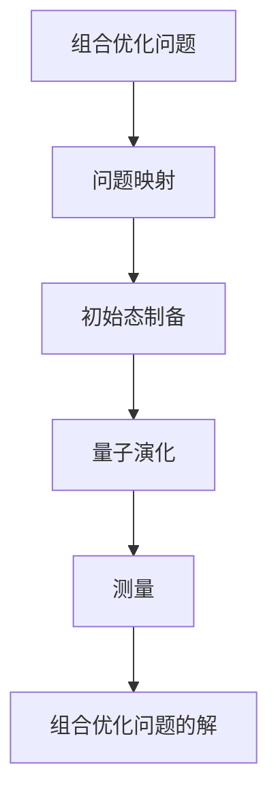

# 量子退火算法在组合优化问题中的应用

> 关键词：量子退火算法、组合优化问题、量子计算、绝热量子计算、优化算法

> 摘要：本文围绕量子退火算法在组合优化问题中的应用展开深入探讨。首先介绍了量子退火算法的背景，包括其目的、适用读者、文档结构和相关术语。接着阐述了量子退火算法的核心概念与联系，通过文本示意图和 Mermaid 流程图清晰呈现其原理和架构。详细讲解了核心算法原理，并用 Python 源代码进行具体阐述，同时给出了相关数学模型和公式，并举例说明。通过项目实战展示了代码实际案例及详细解释。分析了量子退火算法在不同领域的实际应用场景。推荐了学习量子退火算法的相关工具和资源，包括书籍、在线课程、技术博客、开发工具、框架和相关论文著作。最后总结了量子退火算法的未来发展趋势与挑战，还设置了附录解答常见问题，并提供扩展阅读和参考资料，旨在为读者全面深入地了解量子退火算法在组合优化问题中的应用提供有力参考。

## 1. 背景介绍 
### 1.1 目的和范围
组合优化问题在众多领域，如物流配送、金融投资、电路设计等都广泛存在。这些问题通常具有复杂的约束条件和庞大的解空间，传统的优化算法在处理大规模组合优化问题时往往面临计算复杂度高、求解时间长等挑战。量子退火算法作为一种新兴的优化算法，利用量子力学原理来探索解空间，有望为组合优化问题提供更高效的解决方案。本文的目的就是深入研究量子退火算法在组合优化问题中的应用，探讨其原理、实现方法和实际应用效果，范围涵盖量子退火算法的基本概念、核心算法、数学模型、项目实战以及实际应用场景等方面。

### 1.2 预期读者
本文预期读者包括对量子计算、优化算法感兴趣的科研人员、高校学生，从事相关领域研究的专业人士，以及希望了解新兴技术在组合优化问题中应用的技术爱好者。对于有一定编程基础和数学知识的读者，能够更好地理解本文中关于算法原理和代码实现的部分，但即使是初学者，也可以通过本文初步了解量子退火算法及其在组合优化问题中的应用。

### 1.3 文档结构概述
本文首先介绍量子退火算法的背景知识，包括目的、读者对象和文档结构等。接着阐述量子退火算法的核心概念与联系，通过示意图和流程图展示其原理和架构。然后详细讲解核心算法原理，并给出 Python 源代码进行说明，同时介绍相关的数学模型和公式。通过项目实战部分展示代码的实际应用和详细解释。分析量子退火算法在不同领域的实际应用场景。推荐学习量子退火算法的相关工具和资源，包括书籍、在线课程、开发工具等。最后总结量子退火算法的未来发展趋势与挑战，设置附录解答常见问题，并提供扩展阅读和参考资料。

### 1.4 术语表
#### 1.4.1 核心术语定义
- **量子退火算法**：一种基于量子力学原理的优化算法，通过模拟量子系统的演化过程来寻找组合优化问题的最优解。
- **组合优化问题**：在有限个离散的可行解中寻找满足特定约束条件且使目标函数达到最优值的问题，如旅行商问题、背包问题等。
- **量子比特**：量子计算中的基本信息单位，类似于经典计算中的比特，但具有量子叠加和纠缠等特性。
- **绝热量子计算**：量子退火算法的理论基础，通过缓慢改变量子系统的哈密顿量，使系统始终处于基态，从而找到问题的最优解。

#### 1.4.2 相关概念解释
- **量子叠加**：量子比特可以同时处于多个状态的叠加态，这使得量子计算能够并行处理多个信息，大大提高了计算效率。
- **量子纠缠**：多个量子比特之间存在一种特殊的关联，一个量子比特的状态改变会瞬间影响其他与之纠缠的量子比特的状态。
- **基态**：量子系统的能量最低状态，在绝热量子计算中，系统最终会演化到基态，对应组合优化问题的最优解。

#### 1.4.3 缩略词列表
- **QUBO**：Quadratic Unconstrained Binary Optimization，二次无约束二进制优化问题，是组合优化问题的一种常见形式。
- **DWave**：一家专注于量子计算技术的公司，其开发的量子退火设备在实际应用中得到了广泛关注。

## 2. 核心概念与联系 
### 核心概念原理
量子退火算法的核心思想是基于绝热量子计算。绝热量子计算的基本原理是将组合优化问题映射到一个量子系统的哈密顿量上。哈密顿量描述了量子系统的能量，系统的基态对应着组合优化问题的最优解。

具体来说，首先构造一个初始哈密顿量 $H_0$，其基态容易制备。然后，缓慢地将初始哈密顿量 $H_0$ 演化到目标哈密顿量 $H_P$，目标哈密顿量 $H_P$ 的基态就是组合优化问题的最优解。在演化过程中，只要演化速度足够缓慢，量子系统就会始终处于基态，最终得到目标哈密顿量的基态，即组合优化问题的最优解。

### 架构的文本示意图
量子退火算法的架构可以分为以下几个部分：
1. **问题映射**：将组合优化问题转化为量子系统的哈密顿量。例如，对于 QUBO 问题，可以将其转化为一个二次型的哈密顿量。
2. **初始态制备**：制备初始哈密顿量 $H_0$ 的基态。这个基态通常是一个简单的量子态，容易通过实验手段制备。
3. **量子演化**：缓慢地改变哈密顿量，从初始哈密顿量 $H_0$ 演化到目标哈密顿量 $H_P$。在演化过程中，量子系统始终保持在基态。
4. **测量**：对演化后的量子系统进行测量，得到量子比特的状态，从而得到组合优化问题的解。

### Mermaid 流程图


## 3. 核心算法原理 & 具体操作步骤 
### 算法原理讲解
量子退火算法的核心是通过量子系统的演化来寻找组合优化问题的最优解。下面我们以一个简单的 QUBO 问题为例，详细讲解算法原理。

QUBO 问题可以表示为：
$$
\min_{x \in \{0, 1\}^n} x^T Q x
$$
其中 $x$ 是一个 $n$ 维的二进制向量，$Q$ 是一个 $n \times n$ 的矩阵。

量子退火算法将 QUBO 问题映射到一个量子系统的哈密顿量上。对于 QUBO 问题，目标哈密顿量可以表示为：
$$
H_P = \sum_{i,j} Q_{ij} \sigma_i^z \sigma_j^z
$$
其中 $\sigma_i^z$ 是第 $i$ 个量子比特的 Pauli-Z 算符。

初始哈密顿量通常选择为：
$$
H_0 = -\sum_{i} \sigma_i^x
$$
其中 $\sigma_i^x$ 是第 $i$ 个量子比特的 Pauli-X 算符。

在演化过程中，哈密顿量随时间 $t$ 的变化可以表示为：
$$
H(t) = (1 - s(t)) H_0 + s(t) H_P
$$
其中 $s(t)$ 是一个随时间单调递增的函数，$s(0) = 0$，$s(T) = 1$，$T$ 是演化的总时间。

### Python 源代码实现
```python
import numpy as np
from scipy.linalg import expm

# 定义 Pauli 矩阵
sigma_x = np.array([[0, 1], [1, 0]])
sigma_z = np.array([[1, 0], [0, -1]])

def tensor_product(matrices):
    """
    计算多个矩阵的张量积
    """
    result = matrices[0]
    for matrix in matrices[1:]:
        result = np.kron(result, matrix)
    return result

def qubo_to_hamiltonian(Q):
    """
    将 QUBO 问题的矩阵 Q 转换为目标哈密顿量 H_P
    """
    n = Q.shape[0]
    H_P = np.zeros((2**n, 2**n))
    for i in range(n):
        for j in range(n):
            if Q[i, j] != 0:
                matrices = [np.eye(2)] * n
                matrices[i] = sigma_z
                matrices[j] = sigma_z
                H_P += Q[i, j] * tensor_product(matrices)
    return H_P

def initial_hamiltonian(n):
    """
    生成初始哈密顿量 H_0
    """
    H_0 = np.zeros((2**n, 2**n))
    for i in range(n):
        matrices = [np.eye(2)] * n
        matrices[i] = sigma_x
        H_0 -= tensor_product(matrices)
    return H_0

def quantum_annealing(Q, T, num_steps):
    """
    量子退火算法实现
    """
    n = Q.shape[0]
    H_0 = initial_hamiltonian(n)
    H_P = qubo_to_hamiltonian(Q)
    dt = T / num_steps

    # 制备初始态
    initial_state = np.ones(2**n) / np.sqrt(2**n)

    for step in range(num_steps):
        s = (step + 1) / num_steps
        H_t = (1 - s) * H_0 + s * H_P
        U_t = expm(-1j * H_t * dt)
        initial_state = np.dot(U_t, initial_state)

    # 测量
    probabilities = np.abs(initial_state)**2
    state_index = np.random.choice(2**n, p=probabilities)
    binary_state = np.binary_repr(state_index, width=n)
    solution = np.array([int(bit) for bit in binary_state])

    return solution

# 示例 QUBO 矩阵
Q = np.array([[1, -1], [-1, 2]])
T = 10
num_steps = 100
solution = quantum_annealing(Q, T, num_steps)
print("组合优化问题的解:", solution)
```

### 具体操作步骤
1. **问题定义**：确定组合优化问题的目标函数和约束条件，将其转化为 QUBO 问题的矩阵 $Q$。
2. **参数设置**：设置演化的总时间 $T$ 和演化的步数 $num\_steps$。
3. **哈密顿量生成**：根据 QUBO 矩阵 $Q$ 生成目标哈密顿量 $H_P$ 和初始哈密顿量 $H_0$。
4. **初始态制备**：制备初始哈密顿量 $H_0$ 的基态。
5. **量子演化**：按照时间步长 $dt$ 逐步改变哈密顿量，进行量子演化。
6. **测量**：对演化后的量子系统进行测量，得到组合优化问题的解。

## 4. 数学模型和公式 & 详细讲解 & 举例说明 
### 数学模型
量子退火算法的数学模型基于量子力学的薛定谔方程。薛定谔方程描述了量子系统的状态随时间的演化：
$$
i\hbar \frac{d}{dt} \vert \psi(t) \rangle = H(t) \vert \psi(t) \rangle
$$
其中 $\vert \psi(t) \rangle$ 是量子系统在时间 $t$ 的状态向量，$H(t)$ 是随时间变化的哈密顿量，$\hbar$ 是约化普朗克常数。

在量子退火算法中，我们通过求解薛定谔方程来模拟量子系统的演化。由于薛定谔方程一般难以解析求解，我们通常采用数值方法进行求解，如上述代码中使用的指数矩阵运算。

### 公式详细讲解
- **哈密顿量的演化**：哈密顿量 $H(t)$ 随时间 $t$ 的变化由公式 $H(t) = (1 - s(t)) H_0 + s(t) H_P$ 描述。其中 $s(t)$ 是一个随时间单调递增的函数，控制着从初始哈密顿量 $H_0$ 到目标哈密顿量 $H_P$ 的演化过程。当 $t = 0$ 时，$s(0) = 0$，$H(0) = H_0$；当 $t = T$ 时，$s(T) = 1$，$H(T) = H_P$。
- **量子态的演化**：量子态 $\vert \psi(t) \rangle$ 的演化可以通过求解薛定谔方程得到。在数值计算中，我们可以使用离散时间步长 $dt$ 来近似求解。在每个时间步长内，量子态的演化可以表示为 $\vert \psi(t + dt) \rangle = U(t) \vert \psi(t) \rangle$，其中 $U(t) = \exp(-i H(t) dt)$ 是时间演化算符。

### 举例说明
考虑一个简单的 QUBO 问题，目标函数为 $f(x_1, x_2) = x_1^2 - 2x_1x_2 + 2x_2^2$，其中 $x_1, x_2 \in \{0, 1\}$。将其转化为 QUBO 矩阵 $Q$：
$$
Q = \begin{bmatrix}
1 & -1 \\
-1 & 2
\end{bmatrix}
$$
根据上述量子退火算法的实现，我们可以求解该 QUBO 问题的最优解。通过设置演化时间 $T = 10$ 和演化步数 $num\_steps = 100$，运行量子退火算法，最终得到组合优化问题的解。

## 5. 项目实战：代码实际案例和详细解释说明 
### 5.1  开发环境搭建
- **Python 环境**：建议使用 Python 3.6 及以上版本。可以从 Python 官方网站（https://www.python.org/downloads/） 下载并安装。
- **依赖库**：需要安装 `numpy` 和 `scipy` 库。可以使用 `pip` 命令进行安装：
```sh
pip install numpy scipy
```

### 5.2  源代码详细实现和代码解读
```python
import numpy as np
from scipy.linalg import expm

# 定义 Pauli 矩阵
sigma_x = np.array([[0, 1], [1, 0]])
sigma_z = np.array([[1, 0], [0, -1]])

def tensor_product(matrices):
    """
    计算多个矩阵的张量积
    """
    result = matrices[0]
    for matrix in matrices[1:]:
        result = np.kron(result, matrix)
    return result

def qubo_to_hamiltonian(Q):
    """
    将 QUBO 问题的矩阵 Q 转换为目标哈密顿量 H_P
    """
    n = Q.shape[0]
    H_P = np.zeros((2**n, 2**n))
    for i in range(n):
        for j in range(n):
            if Q[i, j] != 0:
                matrices = [np.eye(2)] * n
                matrices[i] = sigma_z
                matrices[j] = sigma_z
                H_P += Q[i, j] * tensor_product(matrices)
    return H_P

def initial_hamiltonian(n):
    """
    生成初始哈密顿量 H_0
    """
    H_0 = np.zeros((2**n, 2**n))
    for i in range(n):
        matrices = [np.eye(2)] * n
        matrices[i] = sigma_x
        H_0 -= tensor_product(matrices)
    return H_0

def quantum_annealing(Q, T, num_steps):
    """
    量子退火算法实现
    """
    n = Q.shape[0]
    H_0 = initial_hamiltonian(n)
    H_P = qubo_to_hamiltonian(Q)
    dt = T / num_steps

    # 制备初始态
    initial_state = np.ones(2**n) / np.sqrt(2**n)

    for step in range(num_steps):
        s = (step + 1) / num_steps
        H_t = (1 - s) * H_0 + s * H_P
        U_t = expm(-1j * H_t * dt)
        initial_state = np.dot(U_t, initial_state)

    # 测量
    probabilities = np.abs(initial_state)**2
    state_index = np.random.choice(2**n, p=probabilities)
    binary_state = np.binary_repr(state_index, width=n)
    solution = np.array([int(bit) for bit in binary_state])

    return solution

# 示例 QUBO 矩阵
Q = np.array([[1, -1], [-1, 2]])
T = 10
num_steps = 100
solution = quantum_annealing(Q, T, num_steps)
print("组合优化问题的解:", solution)
```
### 代码解读与分析
- **Pauli 矩阵定义**：`sigma_x` 和 `sigma_z` 分别定义了 Pauli-X 矩阵和 Pauli-Z 矩阵，它们是量子计算中常用的算符。
- **张量积计算**：`tensor_product` 函数用于计算多个矩阵的张量积，在生成哈密顿量时会用到。
- **QUBO 矩阵转换**：`qubo_to_hamiltonian` 函数将 QUBO 问题的矩阵 $Q$ 转换为目标哈密顿量 $H_P$。
- **初始哈密顿量生成**：`initial_hamiltonian` 函数生成初始哈密顿量 $H_0$。
- **量子退火算法实现**：`quantum_annealing` 函数实现了量子退火算法的核心逻辑，包括初始态制备、量子演化和测量。
- **示例运行**：定义了一个示例 QUBO 矩阵 $Q$，设置演化时间 $T$ 和演化步数 $num\_steps$，调用 `quantum_annealing` 函数求解组合优化问题的解。

## 6. 实际应用场景 
### 物流配送
在物流配送中，需要合理安排车辆的行驶路线，以最小化运输成本和时间。这可以看作是一个组合优化问题，如旅行商问题（TSP）。量子退火算法可以通过快速搜索解空间，找到近似最优的配送路线，提高物流效率。

### 金融投资
在金融投资中，需要根据不同的投资产品和风险偏好，选择最优的投资组合。这涉及到在多个投资选项中进行组合优化，以最大化投资回报和最小化风险。量子退火算法可以帮助投资者快速找到最优的投资组合，提高投资效益。

### 电路设计
在电路设计中，需要合理布局电路元件，以最小化电路的功耗和延迟。这是一个复杂的组合优化问题，量子退火算法可以通过优化元件的布局，提高电路的性能。

### 机器学习
在机器学习中，一些问题，如特征选择、模型参数优化等，也可以看作是组合优化问题。量子退火算法可以用于加速这些优化过程，提高机器学习模型的训练效率和性能。

## 7. 工具和资源推荐
### 7.1 学习资源推荐
#### 7.1.1 书籍推荐
- 《量子计算与量子信息》：这本书是量子计算领域的经典教材，全面介绍了量子计算的基本原理、算法和应用，对于深入理解量子退火算法有很大帮助。
- 《优化算法》：介绍了各种优化算法的原理和实现，包括传统优化算法和新兴的量子优化算法，可以帮助读者对比量子退火算法与其他算法的优缺点。

#### 7.1.2 在线课程
- Coursera 上的“量子计算基础”课程：由知名高校的教授授课，系统地介绍了量子计算的基础知识和量子退火算法的原理。
- edX 上的“优化算法与应用”课程：涵盖了组合优化问题的各种求解方法，包括量子退火算法的应用案例。

#### 7.1.3 技术博客和网站
- Quantum Computing Report：提供最新的量子计算技术资讯和研究成果，包括量子退火算法的最新进展。
- Medium 上的量子计算相关博客：有很多技术专家分享量子退火算法的实现经验和应用案例。

### 7.2 开发工具框架推荐
#### 7.2.1 IDE和编辑器
- PyCharm：一款功能强大的 Python 集成开发环境，提供代码编辑、调试、版本控制等功能，方便开发量子退火算法的 Python 代码。
- Jupyter Notebook：一种交互式的开发环境，可以实时显示代码的运行结果，适合进行算法的实验和验证。

#### 7.2.2 调试和性能分析工具
- cProfile：Python 内置的性能分析工具，可以帮助开发者分析量子退火算法的运行时间和性能瓶颈。
- Numba：一个即时编译器，可以加速 Python 代码的运行速度，对于量子退火算法中复杂的矩阵运算有很好的加速效果。

#### 7.2.3 相关框架和库
- D-Wave Ocean SDK：D-Wave 公司开发的量子退火算法开发工具包，提供了一系列的工具和库，方便开发者在 D-Wave 量子退火设备上运行和测试算法。
- Qiskit：IBM 开发的量子计算框架，虽然主要侧重于通用量子计算，但也提供了一些与量子退火算法相关的工具和接口。

### 7.3 相关论文著作推荐
#### 7.3.1 经典论文
- “Quantum annealing in the transverse Ising model”：该论文首次提出了量子退火算法的基本原理，是量子退火算法领域的经典文献。
- “Adiabatic quantum computation”：介绍了绝热量子计算的理论基础，对于理解量子退火算法的原理有重要意义。

#### 7.3.2 最新研究成果
- 关注 arXiv 预印本平台上关于量子退火算法的最新研究论文，了解该领域的最新进展和技术突破。

#### 7.3.3 应用案例分析
- 查阅相关学术期刊和会议论文，了解量子退火算法在不同领域的实际应用案例，学习如何将量子退火算法应用到实际问题中。

## 8. 总结：未来发展趋势与挑战
### 未来发展趋势
- **硬件技术的提升**：随着量子计算硬件技术的不断发展，量子退火设备的性能将不断提高，量子比特的数量和相干时间将不断增加，这将使得量子退火算法能够处理更复杂的组合优化问题。
- **与其他技术的融合**：量子退火算法可能会与机器学习、人工智能等技术进行深度融合，创造出更强大的计算和优化能力。例如，利用量子退火算法加速机器学习模型的训练过程，提高模型的性能。
- **应用领域的拓展**：量子退火算法将在更多领域得到应用，如生物信息学、能源管理、社会科学等。通过解决这些领域中的组合优化问题，为社会发展带来更大的价值。

### 挑战
- **量子噪声和误差**：量子系统容易受到外界环境的干扰，产生量子噪声和误差。这些噪声和误差会影响量子退火算法的计算结果，降低算法的准确性和可靠性。如何有效地抑制量子噪声和误差是量子退火算法面临的一个重要挑战。
- **问题映射的复杂性**：将实际的组合优化问题映射到量子系统的哈密顿量上是一个复杂的过程，需要深入理解问题的本质和量子力学原理。对于一些复杂的组合优化问题，如何找到合适的映射方法是一个挑战。
- **计算资源的限制**：量子退火算法的实现需要大量的计算资源，包括量子比特的数量、计算时间等。目前，量子计算硬件的发展还不能满足大规模组合优化问题的需求，如何在有限的计算资源下提高算法的效率是一个亟待解决的问题。

## 9. 附录：常见问题与解答
### 量子退火算法与传统优化算法有什么区别？
量子退火算法利用量子力学原理，通过量子系统的演化来寻找组合优化问题的最优解。与传统优化算法相比，量子退火算法具有并行计算的能力，可以在更短的时间内搜索更大的解空间，从而有可能找到更优的解。但量子退火算法需要特殊的量子计算硬件，目前还处于发展阶段，而传统优化算法可以在普通计算机上运行。

### 量子退火算法一定能找到组合优化问题的最优解吗？
量子退火算法并不能保证一定能找到组合优化问题的最优解。由于量子噪声和误差的存在，以及演化过程中可能出现的能级交叉等问题，量子退火算法可能会得到近似最优解。但在一些情况下，量子退火算法可以在较短的时间内找到比传统优化算法更好的解。

### 如何选择量子退火算法的参数？
量子退火算法的参数，如演化时间 $T$ 和演化步数 $num\_steps$，需要根据具体的组合优化问题和量子计算硬件的性能来选择。一般来说，演化时间越长，算法有更多的时间进行搜索，找到最优解的概率可能会增加，但计算时间也会相应增加。演化步数的选择也需要在计算效率和搜索精度之间进行平衡。可以通过实验和调参的方法来选择合适的参数。

## 10. 扩展阅读 & 参考资料
### 扩展阅读
- 《量子计算：从基础到应用》：进一步深入探讨量子计算的理论和应用，包括量子退火算法的高级内容。
- 《组合优化：理论与算法》：详细介绍组合优化问题的各种求解方法和理论，对于理解量子退火算法在组合优化问题中的应用有很大帮助。

### 参考资料
- D-Wave 官方网站：https://www.dwavesys.com/
- IBM Quantum 官方网站：https://quantum-computing.ibm.com/
- arXiv 预印本平台：https://arxiv.org/