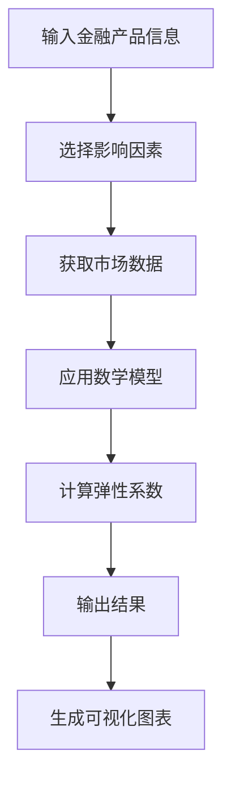

# 金融产品定价弹性分析工具

> 关键词：金融产品、定价弹性、分析工具、数学模型、市场敏感性

> 摘要：本文深入探讨了金融产品定价弹性分析工具的相关内容。首先介绍了该工具的背景，包括目的范围、预期读者等，让读者对其有初步了解。接着阐述了核心概念与联系，构建了相应的原理和架构示意图及流程图。详细讲解了核心算法原理，通过Python源代码展示具体操作步骤，并给出了相关数学模型和公式。通过项目实战，给出代码实际案例并进行详细解释。还探讨了该工具的实际应用场景，推荐了学习、开发工具和相关论文著作。最后总结了未来发展趋势与挑战，给出常见问题解答和参考资料，旨在帮助读者全面了解和掌握金融产品定价弹性分析工具。

## 1. 背景介绍 
### 1.1 目的和范围
金融产品定价弹性分析工具的主要目的是帮助金融机构、投资者以及相关研究人员深入了解金融产品价格对各种因素变化的敏感程度。在金融市场中，产品价格受到多种因素的影响，如市场利率、宏观经济数据、行业动态等。通过该工具，可以量化这些因素对金融产品定价的影响，从而为产品定价决策、风险管理以及投资策略制定提供有力支持。

其范围涵盖了多种金融产品，包括但不限于股票、债券、期货、期权等。不同类型的金融产品具有不同的特点和定价机制，该工具能够根据具体产品的特性进行针对性的弹性分析。

### 1.2 预期读者
- **金融机构从业者**：银行、证券、基金等金融机构的产品定价人员、风险管理师、投资经理等，他们可以利用该工具优化产品定价策略，降低风险，提高投资回报率。
- **投资者**：个人投资者和机构投资者可以借助该工具更好地理解金融产品价格的波动规律，从而做出更明智的投资决策。
- **研究人员**：金融领域的学者和研究人员可以使用该工具进行学术研究，探索金融产品定价的内在机制和影响因素。

### 1.3 文档结构概述
本文将按照以下结构展开：首先介绍金融产品定价弹性分析工具的背景信息，包括目的、预期读者等。接着阐述核心概念与联系，构建其原理和架构。然后详细讲解核心算法原理和具体操作步骤，通过Python代码实现。随后给出相关的数学模型和公式，并进行举例说明。通过项目实战，展示代码实际案例并进行详细解读。探讨该工具的实际应用场景，推荐相关的学习资源、开发工具和论文著作。最后总结未来发展趋势与挑战，给出常见问题解答和参考资料。

### 1.4 术语表
#### 1.4.1 核心术语定义
- **金融产品定价弹性**：指金融产品价格对某一因素变化的敏感程度，通常用弹性系数来衡量。弹性系数越大，说明产品价格对该因素的变化越敏感。
- **基础资产**：金融产品所依赖的资产，如股票、债券等。基础资产的价格波动会直接影响金融产品的价格。
- **市场敏感性**：反映金融产品价格对市场整体环境变化的响应程度。

#### 1.4.2 相关概念解释
- **风险中性定价**：一种在金融定价中常用的方法，假设市场参与者是风险中性的，即不考虑风险偏好，只关注预期收益。在风险中性世界中，金融产品的价格等于其未来现金流的预期现值。
- **无套利定价原理**：指在没有套利机会的市场中，金融产品的价格应该等于其复制组合的成本。如果存在套利机会，市场参与者会通过套利行为使价格回归到均衡水平。

#### 1.4.3 缩略词列表
- **NPV**：Net Present Value，净现值
- **IRR**：Internal Rate of Return，内部收益率
- **BSM**：Black - Scholes - Merton，布莱克 - 斯科尔斯 - 默顿模型

## 2. 核心概念与联系 
金融产品定价弹性分析工具的核心在于理解金融产品价格与各种影响因素之间的关系。其基本原理是通过建立数学模型，模拟不同因素变化对金融产品价格的影响，从而计算出弹性系数。

### 核心概念原理
金融产品的价格通常是由多个因素决定的，这些因素可以分为内部因素和外部因素。内部因素包括产品的基本面信息，如公司的财务状况、盈利能力等；外部因素包括市场利率、宏观经济数据、行业竞争等。

定价弹性分析的基本思路是，假设其他因素不变，单独改变某一个因素，观察金融产品价格的变化情况。通过多次模拟和计算，可以得到该因素对产品价格的弹性系数。

### 架构的文本示意图
```plaintext
金融产品定价弹性分析工具架构

输入层：
- 金融产品信息（类型、基本面数据等）
- 市场数据（利率、宏观经济指标等）
- 影响因素设置（选择要分析的因素）

处理层：
- 数学模型（如BSM模型、二叉树模型等）
- 弹性计算模块（根据模型计算弹性系数）

输出层：
- 弹性系数结果
- 可视化图表（展示价格与因素的关系）
```

### Mermaid流程图


## 3. 核心算法原理 & 具体操作步骤 
### 核心算法原理
这里以期权定价为例，介绍布莱克 - 斯科尔斯 - 默顿（BSM）模型的核心算法原理。BSM模型是一种用于期权定价的经典模型，其基本假设包括市场无摩擦、资产价格遵循几何布朗运动等。

期权的价格可以通过以下公式计算：

对于欧式看涨期权：

$$C = S_tN(d_1) - Ke^{-r(T - t)}N(d_2)$$

对于欧式看跌期权：

$$P = Ke^{-r(T - t)}N(-d_2) - S_tN(-d_1)$$

其中：

$$d_1=\frac{\ln(\frac{S_t}{K})+(r + \frac{\sigma^2}{2})(T - t)}{\sigma\sqrt{T - t}}$$

$$d_2 = d_1-\sigma\sqrt{T - t}$$

- $C$ 和 $P$ 分别为欧式看涨期权和看跌期权的价格
- $S_t$ 为标的资产在时间 $t$ 的价格
- $K$ 为期权的执行价格
- $r$ 为无风险利率
- $T - t$ 为期权的剩余到期时间
- $\sigma$ 为标的资产的波动率
- $N(x)$ 为标准正态分布的累积分布函数

### 具体操作步骤及Python源代码
以下是使用Python实现基于BSM模型的期权定价及弹性分析的代码：

```python
import numpy as np
from scipy.stats import norm

def bsm_option_price(S, K, r, T, sigma, option_type='call'):
    """
    计算欧式期权的价格
    :param S: 标的资产价格
    :param K: 执行价格
    :param r: 无风险利率
    :param T: 到期时间
    :param sigma: 波动率
    :param option_type: 期权类型，'call' 或 'put'
    :return: 期权价格
    """
    d1 = (np.log(S / K) + (r + 0.5 * sigma ** 2) * T) / (sigma * np.sqrt(T))
    d2 = d1 - sigma * np.sqrt(T)
    if option_type == 'call':
        return S * norm.cdf(d1) - K * np.exp(-r * T) * norm.cdf(d2)
    elif option_type == 'put':
        return K * np.exp(-r * T) * norm.cdf(-d2) - S * norm.cdf(-d1)
    else:
        raise ValueError("Option type must be 'call' or 'put'")

def option_price_elasticity(S, K, r, T, sigma, option_type='call', factor='S'):
    """
    计算期权价格对某一因素的弹性
    :param S: 标的资产价格
    :param K: 执行价格
    :param r: 无风险利率
    :param T: 到期时间
    :param sigma: 波动率
    :param option_type: 期权类型，'call' 或 'put'
    :param factor: 要分析的因素，如 'S'（标的资产价格）、'r'（无风险利率）等
    :return: 弹性系数
    """
    epsilon = 0.0001  # 微小变化量
    price_base = bsm_option_price(S, K, r, T, sigma, option_type)
    if factor == 'S':
        price_perturbed = bsm_option_price(S * (1 + epsilon), K, r, T, sigma, option_type)
        elasticity = ((price_perturbed - price_base) / price_base) / epsilon
    elif factor == 'r':
        price_perturbed = bsm_option_price(S, K, r * (1 + epsilon), T, sigma, option_type)
        elasticity = ((price_perturbed - price_base) / price_base) / epsilon
    elif factor == 'sigma':
        price_perturbed = bsm_option_price(S, K, r, T, sigma * (1 + epsilon), option_type)
        elasticity = ((price_perturbed - price_base) / price_base) / epsilon
    else:
        raise ValueError("Factor must be 'S', 'r' or 'sigma'")
    return elasticity

# 示例参数
S = 100  # 标的资产价格
K = 105  # 执行价格
r = 0.05  # 无风险利率
T = 1  # 到期时间
sigma = 0.2  # 波动率

# 计算期权价格
call_price = bsm_option_price(S, K, r, T, sigma, option_type='call')
print(f"欧式看涨期权价格: {call_price}")

# 计算期权价格对标的资产价格的弹性
elasticity_S = option_price_elasticity(S, K, r, T, sigma, option_type='call', factor='S')
print(f"期权价格对标的资产价格的弹性: {elasticity_S}")
```

### 代码解释
1. **`bsm_option_price` 函数**：该函数实现了BSM模型的期权定价公式，根据输入的参数计算欧式看涨期权或看跌期权的价格。
2. **`option_price_elasticity` 函数**：该函数用于计算期权价格对某一因素的弹性。通过对该因素进行微小的扰动，计算价格的变化率，从而得到弹性系数。
3. **示例参数和计算**：定义了一组示例参数，调用上述两个函数计算欧式看涨期权的价格和期权价格对标的资产价格的弹性，并打印结果。

## 4. 数学模型和公式 & 详细讲解 & 举例说明 
### 数学模型和公式
#### 弹性系数公式
弹性系数用于衡量金融产品价格对某一因素变化的敏感程度，其一般公式为：

$$E=\frac{\%\Delta P}{\%\Delta X}$$

其中：
- $E$ 为弹性系数
- $\%\Delta P$ 为金融产品价格的变化百分比
- $\%\Delta X$ 为影响因素的变化百分比

#### BSM模型公式
如前面所述，BSM模型的欧式看涨期权和看跌期权定价公式分别为：

$$C = S_tN(d_1) - Ke^{-r(T - t)}N(d_2)$$

$$P = Ke^{-r(T - t)}N(-d_2) - S_tN(-d_1)$$

其中：

$$d_1=\frac{\ln(\frac{S_t}{K})+(r + \frac{\sigma^2}{2})(T - t)}{\sigma\sqrt{T - t}}$$

$$d_2 = d_1-\sigma\sqrt{T - t}$$

### 详细讲解
- **弹性系数公式**：弹性系数反映了金融产品价格对某一因素变化的相对敏感度。当 $|E|>1$ 时，说明产品价格对该因素变化比较敏感，因素的微小变化会导致产品价格较大的变化；当 $|E|<1$ 时，说明产品价格对该因素变化不太敏感；当 $|E| = 1$ 时，说明产品价格与该因素的变化成比例。
- **BSM模型公式**：BSM模型基于一系列假设，通过对标的资产价格的随机过程进行建模，得到了期权价格的解析解。其中，$N(x)$ 是标准正态分布的累积分布函数，用于计算期权在不同情况下的价值。$d_1$ 和 $d_2$ 是中间变量，反映了标的资产价格、执行价格、无风险利率、到期时间和波动率等因素的综合影响。

### 举例说明
假设某欧式看涨期权的标的资产价格 $S_t = 100$，执行价格 $K = 105$，无风险利率 $r = 0.05$，到期时间 $T - t = 1$ 年，波动率 $\sigma = 0.2$。

首先计算 $d_1$ 和 $d_2$：

$$d_1=\frac{\ln(\frac{100}{105})+(0.05 + \frac{0.2^2}{2})\times1}{0.2\times\sqrt{1}}\approx -0.044$$

$$d_2 = d_1 - 0.2\times\sqrt{1}\approx -0.244$$

然后计算 $N(d_1)$ 和 $N(d_2)$：

$N(d_1)=N(-0.044)\approx0.482$

$N(d_2)=N(-0.244)\approx0.404$

最后计算欧式看涨期权的价格：

$$C = 100\times0.482 - 105\times e^{-0.05\times1}\times0.404\approx 8.02$$

现在假设标的资产价格上涨 $1\%$，即 $S_t' = 100\times(1 + 0.01)=101$，重新计算期权价格 $C'$：

$$d_1'=\frac{\ln(\frac{101}{105})+(0.05 + \frac{0.2^2}{2})\times1}{0.2\times\sqrt{1}}\approx -0.004$$

$$d_2' = d_1' - 0.2\times\sqrt{1}\approx -0.204$$

$N(d_1')=N(-0.004)\approx0.498$

$N(d_2')=N(-0.204)\approx0.420$

$$C' = 101\times0.498 - 105\times e^{-0.05\times1}\times0.420\approx 8.44$$

则期权价格对标的资产价格的弹性系数为：

$$E=\frac{\frac{C' - C}{C}}{\frac{S_t' - S_t}{S_t}}=\frac{\frac{8.44 - 8.02}{8.02}}{0.01}\approx 5.24$$

这表明期权价格对标的资产价格比较敏感，标的资产价格每上涨 $1\%$，期权价格大约上涨 $5.24\%$。

## 5. 项目实战：代码实际案例和详细解释说明 
### 5.1  开发环境搭建
- **Python环境**：建议使用Python 3.7及以上版本。可以从Python官方网站（https://www.python.org/downloads/）下载安装。
- **依赖库安装**：使用`pip`命令安装所需的库，主要包括`numpy`、`scipy`等。

```bash
pip install numpy scipy
```

### 5.2  源代码详细实现和代码解读
以下是一个完整的项目实战代码示例，用于对多个金融产品的定价弹性进行分析：

```python
import numpy as np
from scipy.stats import norm

def bsm_option_price(S, K, r, T, sigma, option_type='call'):
    """
    计算欧式期权的价格
    :param S: 标的资产价格
    :param K: 执行价格
    :param r: 无风险利率
    :param T: 到期时间
    :param sigma: 波动率
    :param option_type: 期权类型，'call' 或 'put'
    :return: 期权价格
    """
    d1 = (np.log(S / K) + (r + 0.5 * sigma ** 2) * T) / (sigma * np.sqrt(T))
    d2 = d1 - sigma * np.sqrt(T)
    if option_type == 'call':
        return S * norm.cdf(d1) - K * np.exp(-r * T) * norm.cdf(d2)
    elif option_type == 'put':
        return K * np.exp(-r * T) * norm.cdf(-d2) - S * norm.cdf(-d1)
    else:
        raise ValueError("Option type must be 'call' or 'put'")

def option_price_elasticity(S, K, r, T, sigma, option_type='call', factor='S'):
    """
    计算期权价格对某一因素的弹性
    :param S: 标的资产价格
    :param K: 执行价格
    :param r: 无风险利率
    :param T: 到期时间
    :param sigma: 波动率
    :param option_type: 期权类型，'call' 或 'put'
    :param factor: 要分析的因素，如 'S'（标的资产价格）、'r'（无风险利率）等
    :return: 弹性系数
    """
    epsilon = 0.0001  # 微小变化量
    price_base = bsm_option_price(S, K, r, T, sigma, option_type)
    if factor == 'S':
        price_perturbed = bsm_option_price(S * (1 + epsilon), K, r, T, sigma, option_type)
        elasticity = ((price_perturbed - price_base) / price_base) / epsilon
    elif factor == 'r':
        price_perturbed = bsm_option_price(S, K, r * (1 + epsilon), T, sigma, option_type)
        elasticity = ((price_perturbed - price_base) / price_base) / epsilon
    elif factor == 'sigma':
        price_perturbed = bsm_option_price(S, K, r, T, sigma * (1 + epsilon), option_type)
        elasticity = ((price_perturbed - price_base) / price_base) / epsilon
    else:
        raise ValueError("Factor must be 'S', 'r' or 'sigma'")
    return elasticity

def analyze_multiple_options(options_data):
    """
    分析多个期权的定价弹性
    :param options_data: 期权数据列表，每个元素为一个字典，包含 'S', 'K', 'r', 'T', 'sigma', 'option_type' 等信息
    :return: 弹性分析结果列表
    """
    results = []
    for option in options_data:
        S = option['S']
        K = option['K']
        r = option['r']
        T = option['T']
        sigma = option['sigma']
        option_type = option['option_type']
        price = bsm_option_price(S, K, r, T, sigma, option_type)
        elasticity_S = option_price_elasticity(S, K, r, T, sigma, option_type, factor='S')
        elasticity_r = option_price_elasticity(S, K, r, T, sigma, option_type, factor='r')
        elasticity_sigma = option_price_elasticity(S, K, r, T, sigma, option_type, factor='sigma')
        result = {
            'option_type': option_type,
            'price': price,
            'elasticity_S': elasticity_S,
            'elasticity_r': elasticity_r,
            'elasticity_sigma': elasticity_sigma
        }
        results.append(result)
    return results

# 示例期权数据
options_data = [
    {
        'S': 100,
        'K': 105,
        'r': 0.05,
        'T': 1,
        'sigma': 0.2,
        'option_type': 'call'
    },
    {
        'S': 90,
        'K': 95,
        'r': 0.04,
        'T': 0.5,
        'sigma': 0.15,
        'option_type': 'put'
    }
]

# 进行弹性分析
results = analyze_multiple_options(options_data)

# 打印结果
for i, result in enumerate(results):
    print(f"期权 {i + 1} 分析结果:")
    print(f"期权类型: {result['option_type']}")
    print(f"期权价格: {result['price']}")
    print(f"对标的资产价格的弹性: {result['elasticity_S']}")
    print(f"对无风险利率的弹性: {result['elasticity_r']}")
    print(f"对波动率的弹性: {result['elasticity_sigma']}")
    print()
```

### 5.3  代码解读与分析
1. **`bsm_option_price` 函数**：该函数实现了BSM模型的期权定价公式，根据输入的参数计算欧式看涨期权或看跌期权的价格。
2. **`option_price_elasticity` 函数**：该函数用于计算期权价格对某一因素的弹性。通过对该因素进行微小的扰动，计算价格的变化率，从而得到弹性系数。
3. **`analyze_multiple_options` 函数**：该函数用于分析多个期权的定价弹性。它接受一个期权数据列表作为输入，对每个期权计算其价格和对标的资产价格、无风险利率、波动率的弹性，并将结果存储在一个列表中返回。
4. **示例期权数据和分析**：定义了一组示例期权数据，调用`analyze_multiple_options` 函数进行弹性分析，并打印出每个期权的分析结果。

通过这个项目实战，我们可以对多个金融产品的定价弹性进行系统的分析，为投资决策和风险管理提供有力支持。

## 6. 实际应用场景 
### 产品定价决策
金融机构在推出新的金融产品时，需要确定合理的价格。通过使用定价弹性分析工具，可以了解产品价格对各种因素的敏感程度，从而根据市场情况和自身目标制定出更具竞争力的价格策略。例如，在期权定价中，如果发现期权价格对标的资产价格的弹性较大，那么在定价时需要更加谨慎地考虑标的资产价格的波动风险。

### 风险管理
金融机构和投资者面临着各种风险，如市场风险、利率风险等。定价弹性分析工具可以帮助他们量化这些风险对金融产品价格的影响，从而采取相应的风险管理措施。例如，如果某债券价格对市场利率的弹性较大，当市场利率上升时，债券价格可能会大幅下跌。投资者可以通过调整投资组合，减少对利率敏感的债券的持有，降低利率风险。

### 投资策略制定
投资者可以利用定价弹性分析工具来评估不同金融产品的投资价值和风险。对于弹性较大的产品，虽然可能带来较高的收益，但也伴随着较大的风险；而弹性较小的产品，收益相对稳定，但可能较低。投资者可以根据自己的风险偏好和投资目标，选择合适的金融产品构建投资组合。例如，风险偏好较高的投资者可以适当增加对弹性较大的期权产品的投资，以获取更高的收益；而风险偏好较低的投资者则可以选择弹性较小的债券产品。

### 市场趋势分析
通过对金融产品定价弹性的长期监测和分析，可以了解市场的变化趋势。如果某一类金融产品的定价弹性发生了明显变化，可能预示着市场环境、投资者情绪或宏观经济状况的改变。金融机构和投资者可以根据这些变化及时调整自己的策略，以适应市场的变化。

## 7. 工具和资源推荐
### 7.1 学习资源推荐
#### 7.1.1 书籍推荐
- 《期权、期货及其他衍生品》（Options, Futures, and Other Derivatives），作者：John C. Hull。这本书是金融衍生品领域的经典教材，详细介绍了各种金融衍生品的定价模型和风险管理方法，包括BSM模型等。
- 《金融数学：金融衍生品定价引论》（Financial Mathematics: A Derivative Pricing Primer），作者：Mark S. Joshi。该书系统地介绍了金融数学的基本理论和方法，适合初学者深入学习金融产品定价的数学原理。

#### 7.1.2 在线课程
- Coursera平台上的“Financial Engineering and Risk Management”课程，由哥伦比亚大学教授授课，涵盖了金融工程的基本概念、金融产品定价和风险管理等内容。
- edX平台上的“Introduction to Computational Finance and Financial Econometrics”课程，介绍了计算金融和金融计量学的基本方法，包括金融产品定价的数值计算方法。

#### 7.1.3 技术博客和网站
- QuantNet（https://www.quantnet.com/）：一个专注于量化金融领域的社区，提供了丰富的学习资源、技术文章和讨论论坛，适合金融和技术领域的专业人士交流和学习。
- Investopedia（https://www.investopedia.com/）：一个综合性的金融教育网站，提供了各种金融概念、产品和策略的详细解释和案例分析，对初学者非常友好。

### 7.2 开发工具框架推荐
#### 7.2.1 IDE和编辑器
- PyCharm：一款功能强大的Python集成开发环境，提供了代码编辑、调试、版本控制等一系列功能，适合开发Python项目。
- Jupyter Notebook：一种交互式的开发环境，支持代码、文本、图表等多种元素的混合展示，非常适合进行数据分析和模型验证。

#### 7.2.2 调试和性能分析工具
- PDB：Python自带的调试工具，可以帮助开发者逐步执行代码，查看变量值和程序执行流程，方便调试代码中的错误。
- cProfile：Python的性能分析工具，可以统计代码中各个函数的执行时间和调用次数，帮助开发者找出性能瓶颈。

#### 7.2.3 相关框架和库
- NumPy：Python的科学计算库，提供了高效的数组操作和数学函数，是进行金融产品定价和弹性分析的基础库。
- SciPy：基于NumPy的科学计算库，提供了更多的数学和科学计算功能，如优化算法、统计分布函数等，可用于金融模型的求解和分析。
- Pandas：Python的数据处理和分析库，提供了高效的数据结构和数据操作方法，方便对金融数据进行处理和分析。

### 7.3 相关论文著作推荐
#### 7.3.1 经典论文
- “The Pricing of Options and Corporate Liabilities”，作者：Fischer Black和Myron Scholes。这篇论文提出了著名的布莱克 - 斯科尔斯期权定价模型，开创了金融衍生品定价的新时代。
- “Theory of Rational Option Pricing”，作者：Robert C. Merton。该论文对布莱克 - 斯科尔斯模型进行了扩展和完善，奠定了现代金融期权定价理论的基础。

#### 7.3.2 最新研究成果
- 可以关注《Journal of Financial Economics》、《Review of Financial Studies》等顶级金融学术期刊，了解金融产品定价和弹性分析领域的最新研究成果。

#### 7.3.3 应用案例分析
- 一些金融机构和研究机构会发布关于金融产品定价和风险管理的应用案例分析报告，可以通过它们的官方网站或相关数据库获取，学习实际应用中的经验和方法。

## 8. 总结：未来发展趋势与挑战
### 未来发展趋势
- **智能化与自动化**：随着人工智能和机器学习技术的不断发展，金融产品定价弹性分析工具将越来越智能化和自动化。例如，利用深度学习算法可以自动识别和分析大量的金融数据，快速准确地计算定价弹性，提高分析效率和精度。
- **多因素综合分析**：未来的分析工具将不再局限于单一因素的弹性分析，而是会综合考虑多个因素之间的相互作用和影响。例如，同时考虑市场利率、宏观经济数据、行业竞争等多个因素对金融产品价格的影响，提供更全面、准确的分析结果。
- **实时分析与动态调整**：在金融市场快速变化的背景下，实时分析和动态调整将成为定价弹性分析工具的重要发展方向。工具可以实时获取市场数据，及时更新分析结果，并根据市场变化动态调整金融产品的定价策略和风险管理措施。

### 挑战
- **数据质量与可用性**：金融产品定价弹性分析需要大量准确、及时的金融数据支持。然而，数据质量和可用性往往受到多种因素的影响，如数据来源的可靠性、数据的完整性和一致性等。如何获取高质量的数据并进行有效的处理和分析，是一个重要的挑战。
- **模型复杂性与适应性**：随着金融市场的不断创新和发展，金融产品的种类和结构越来越复杂，传统的定价模型可能无法准确描述其价格行为。需要不断开发和完善更复杂、更适应性强的定价模型，以满足实际应用的需求。
- **监管与合规要求**：金融行业受到严格的监管，定价弹性分析工具的开发和应用需要符合相关的监管和合规要求。例如，在数据使用、模型透明度、风险披露等方面，需要满足监管机构的规定，这增加了工具开发和应用的难度。

## 9. 附录：常见问题与解答
### 问题1：如何选择合适的数学模型进行金融产品定价弹性分析？
解答：选择合适的数学模型需要考虑多个因素，如金融产品的类型、市场环境、数据可用性等。对于简单的金融产品，如欧式期权，可以使用经典的BSM模型；对于复杂的金融产品，可能需要使用更高级的模型，如二叉树模型、蒙特卡罗模拟模型等。同时，还需要根据实际数据对模型进行验证和调整，以确保模型的准确性和适用性。

### 问题2：定价弹性分析结果的准确性受哪些因素影响？
解答：定价弹性分析结果的准确性受多种因素影响，主要包括数据质量、模型选择、参数估计等。数据质量直接影响模型的输入，不准确或不完整的数据可能导致分析结果偏差较大。模型选择不当可能无法准确描述金融产品的价格行为。参数估计的误差也会对分析结果产生影响，例如波动率的估计不准确可能导致期权定价和弹性计算出现偏差。

### 问题3：如何将定价弹性分析结果应用到实际决策中？
解答：定价弹性分析结果可以为产品定价决策、风险管理和投资策略制定等提供参考。在产品定价决策中，可以根据弹性分析结果调整产品价格，以提高产品的竞争力和盈利能力。在风险管理中，可以根据弹性分析结果识别和评估风险，采取相应的风险管理措施，如对冲、分散投资等。在投资策略制定中，可以根据弹性分析结果选择合适的金融产品和投资组合，以实现投资目标和风险控制。

## 10. 扩展阅读 & 参考资料
### 扩展阅读
- 《金融市场与金融机构基础》（Fundamentals of Financial Markets and Institutions），作者：Frank J. Fabozzi等。该书介绍了金融市场和金融机构的基本概念和运作机制，有助于深入理解金融产品定价的背景和环境。
- 《量化投资：策略与技术》（Quantitative Investment: Strategies and Techniques），作者：丁鹏。本书介绍了量化投资的基本理论和方法，包括金融产品定价和风险管理的量化技术，适合对量化投资感兴趣的读者阅读。

### 参考资料
- Hull, John C. Options, Futures, and Other Derivatives. Pearson, 2018.
- Black, Fischer, and Myron Scholes. "The Pricing of Options and Corporate Liabilities." Journal of Political Economy 81.3 (1973): 637 - 654.
- Merton, Robert C. "Theory of Rational Option Pricing." Bell Journal of Economics and Management Science 4.1 (1973): 141 - 183.