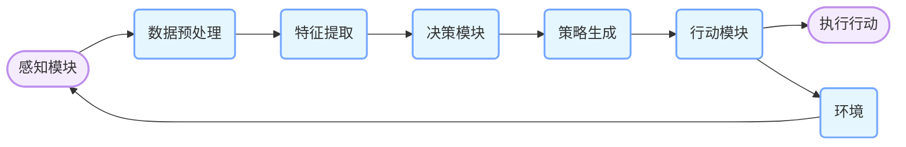

# 金融市场分析的AI Agent决策支持

> 关键词：金融市场分析、AI Agent、决策支持、人工智能、机器学习、量化交易、风险评估

> 摘要：本文聚焦于金融市场分析中AI Agent决策支持这一前沿领域。首先介绍了研究的背景、目的和预期读者等内容，接着阐述了AI Agent、金融市场分析等核心概念及其联系，深入探讨了相关核心算法原理并给出Python代码示例，同时介绍了数学模型和公式。通过项目实战展示了代码的具体实现和解读，分析了其在不同金融场景中的实际应用。还推荐了学习资源、开发工具框架以及相关论文著作。最后总结了未来发展趋势与挑战，并提供常见问题解答和参考资料，旨在为读者全面呈现金融市场分析中AI Agent决策支持的技术全貌和应用前景。

## 1. 背景介绍 
### 1.1 目的和范围
金融市场是一个复杂且充满不确定性的领域，传统的金融分析方法在处理海量数据和复杂市场动态时面临诸多挑战。本研究的目的在于探索如何利用AI Agent为金融市场分析提供有效的决策支持，以提高投资决策的准确性和效率，降低风险。范围涵盖了股票市场、债券市场、期货市场等主要金融市场，涉及市场趋势预测、资产定价、风险评估等多个方面的决策问题。

### 1.2 预期读者
本文预期读者包括金融从业者，如投资经理、交易员、风险分析师等，他们可以通过了解AI Agent决策支持技术，提升自己在金融市场分析和决策中的能力；计算机科学和人工智能领域的研究人员和开发者，他们可以从中获取在金融领域应用AI技术的思路和方法；以及对金融科技感兴趣的学生和爱好者，为他们提供一个深入了解金融市场与AI结合的学习资源。

### 1.3 文档结构概述
本文首先介绍背景信息，包括目的、预期读者和文档结构。接着阐述核心概念与联系，为后续内容奠定基础。然后详细讲解核心算法原理和具体操作步骤，并给出数学模型和公式。通过项目实战展示代码实现和解读，分析实际应用场景。推荐相关的学习资源、开发工具框架和论文著作。最后总结未来发展趋势与挑战，提供常见问题解答和参考资料。

### 1.4 术语表
#### 1.4.1 核心术语定义
- **AI Agent（人工智能智能体）**：是一种能够感知环境、根据感知信息进行决策并采取行动的智能实体。在金融市场中，AI Agent可以收集市场数据、分析数据并生成投资决策建议。
- **金融市场分析**：对金融市场中的各种数据和信息进行收集、整理、分析和解读，以了解市场趋势、资产价值和风险状况，为投资决策提供依据。
- **决策支持系统（DSS）**：是一种基于计算机技术的信息系统，通过对数据的分析和处理，为决策者提供支持和建议，帮助他们做出更明智的决策。

#### 1.4.2 相关概念解释
- **机器学习**：是AI的一个重要分支，通过让计算机从数据中学习模式和规律，从而实现预测和决策。在金融市场分析中，机器学习算法可以用于预测股票价格、识别市场趋势等。
- **量化交易**：是指利用数学模型和计算机算法进行交易决策的一种交易方式。AI Agent可以为量化交易提供决策支持，提高交易的效率和准确性。
- **风险评估**：是指对投资过程中可能面临的风险进行识别、衡量和评价的过程。AI Agent可以通过分析市场数据和历史信息，对投资风险进行评估和预警。

#### 1.4.3 缩略词列表
- **AI**：Artificial Intelligence（人工智能）
- **DSS**：Decision Support System（决策支持系统）
- **ML**：Machine Learning（机器学习）
- **QTrading**：Quantitative Trading（量化交易）

## 2. 核心概念与联系 

### 2.1 AI Agent的原理和架构
AI Agent通常由感知模块、决策模块和行动模块组成。感知模块负责收集环境信息，如金融市场的价格数据、新闻资讯等；决策模块根据感知到的信息进行分析和推理，生成决策方案；行动模块根据决策方案采取相应的行动，如买卖股票、调整投资组合等。

其原理基于智能体的理性决策原则，即通过最大化预期效用函数来选择最优的行动方案。智能体的决策过程可以用马尔可夫决策过程（MDP）来描述，MDP是一个五元组 $(S, A, P, R, \gamma)$，其中 $S$ 是状态空间，$A$ 是行动空间，$P$ 是状态转移概率，$R$ 是奖励函数，$\gamma$ 是折扣因子。

以下是AI Agent的架构示意图：



### 2.2 金融市场分析的要素
金融市场分析主要包括基本面分析、技术分析和市场情绪分析三个方面。基本面分析关注宏观经济数据、公司财务状况等因素，以评估资产的内在价值；技术分析通过研究市场价格和交易量等历史数据，预测市场趋势；市场情绪分析则关注投资者的情绪和心理因素，如恐慌、贪婪等，以了解市场的短期波动。

### 2.3 AI Agent与金融市场分析的联系
AI Agent可以为金融市场分析提供强大的支持。通过感知模块，AI Agent可以实时收集金融市场的各种数据，包括价格数据、新闻资讯、社交媒体数据等；决策模块可以利用机器学习和深度学习算法对这些数据进行分析和处理，挖掘市场规律和趋势；行动模块可以根据分析结果生成投资决策建议，帮助投资者做出更明智的决策。同时，金融市场的反馈信息又可以作为新的数据输入到AI Agent中，不断优化其决策模型。

## 3. 核心算法原理 & 具体操作步骤 

### 3.1 机器学习算法在AI Agent决策中的应用
#### 3.1.1 支持向量机（SVM）
支持向量机是一种常用的监督学习算法，用于分类和回归分析。在金融市场分析中，SVM可以用于预测股票价格的涨跌、识别市场趋势等。

SVM的基本思想是在特征空间中找到一个最优的超平面，使得不同类别的样本能够被最大程度地分开。对于线性可分的数据集，SVM的目标是求解以下优化问题：

$$\min_{w,b} \frac{1}{2} \|w\|^2$$
$$s.t. \quad y_i(w^T x_i + b) \geq 1, \quad i = 1,2,\cdots,n$$

其中 $w$ 是超平面的法向量，$b$ 是偏置，$x_i$ 是样本数据，$y_i$ 是样本标签。

以下是使用Python实现SVM进行股票价格涨跌预测的示例代码：

```python
import numpy as np
from sklearn import svm
from sklearn.model_selection import train_test_split
from sklearn.metrics import accuracy_score

# 生成示例数据
X = np.random.rand(100, 5)  # 特征数据
y = np.random.randint(0, 2, 100)  # 标签数据

# 划分训练集和测试集
X_train, X_test, y_train, y_test = train_test_split(X, y, test_size=0.2, random_state=42)

# 创建SVM模型
clf = svm.SVC(kernel='linear')

# 训练模型
clf.fit(X_train, y_train)

# 预测
y_pred = clf.predict(X_test)

# 计算准确率
accuracy = accuracy_score(y_test, y_pred)
print(f"Accuracy: {accuracy}")
```

#### 3.1.2 随机森林（Random Forest）
随机森林是一种集成学习算法，由多个决策树组成。在金融市场分析中，随机森林可以用于特征选择、风险评估等。

随机森林的基本思想是通过对多个决策树的结果进行综合，提高模型的泛化能力和稳定性。每个决策树在训练时使用不同的样本子集和特征子集，从而减少模型的过拟合风险。

以下是使用Python实现随机森林进行股票风险评估的示例代码：

```python
from sklearn.ensemble import RandomForestClassifier
from sklearn.datasets import make_classification
from sklearn.model_selection import train_test_split
from sklearn.metrics import accuracy_score

# 生成示例数据
X, y = make_classification(n_samples=1000, n_features=10, n_informative=5, n_redundant=0, random_state=42)

# 划分训练集和测试集
X_train, X_test, y_train, y_test = train_test_split(X, y, test_size=0.2, random_state=42)

# 创建随机森林模型
rf = RandomForestClassifier(n_estimators=100, random_state=42)

# 训练模型
rf.fit(X_train, y_train)

# 预测
y_pred = rf.predict(X_test)

# 计算准确率
accuracy = accuracy_score(y_test, y_pred)
print(f"Accuracy: {accuracy}")
```

### 3.2 深度学习算法在AI Agent决策中的应用
#### 3.2.1 长短期记忆网络（LSTM）
长短期记忆网络是一种特殊的循环神经网络（RNN），能够处理序列数据中的长期依赖关系。在金融市场分析中，LSTM可以用于预测股票价格的时间序列数据。

LSTM的核心是记忆单元，通过输入门、遗忘门和输出门来控制信息的流动。以下是LSTM的基本公式：

输入门：
$$i_t = \sigma(W_i x_t + U_i h_{t-1} + b_i)$$

遗忘门：
$$f_t = \sigma(W_f x_t + U_f h_{t-1} + b_f)$$

输出门：
$$o_t = \sigma(W_o x_t + U_o h_{t-1} + b_o)$$

细胞状态更新：
$$C_t = f_t \odot C_{t-1} + i_t \odot \tanh(W_c x_t + U_c h_{t-1} + b_c)$$

隐藏状态更新：
$$h_t = o_t \odot \tanh(C_t)$$

其中 $\sigma$ 是sigmoid函数，$\odot$ 是逐元素乘法，$x_t$ 是输入，$h_{t-1}$ 是上一时刻的隐藏状态，$C_{t-1}$ 是上一时刻的细胞状态。

以下是使用Python和Keras实现LSTM进行股票价格预测的示例代码：

```python
import numpy as np
from keras.models import Sequential
from keras.layers import LSTM, Dense
from sklearn.preprocessing import MinMaxScaler
import matplotlib.pyplot as plt

# 生成示例数据
data = np.array([i for i in range(100)])
data = data.reshape(-1, 1)

# 数据归一化
scaler = MinMaxScaler(feature_range=(0, 1))
data = scaler.fit_transform(data)

# 划分训练集和测试集
train_size = int(len(data) * 0.8)
train_data = data[:train_size]
test_data = data[train_size:]

# 准备训练数据
def create_dataset(dataset, look_back=1):
    dataX, dataY = [], []
    for i in range(len(dataset)-look_back-1):
        a = dataset[i:(i+look_back), 0]
        dataX.append(a)
        dataY.append(dataset[i + look_back, 0])
    return np.array(dataX), np.array(dataY)

look_back = 3
trainX, trainY = create_dataset(train_data, look_back)
testX, testY = create_dataset(test_data, look_back)

# 调整数据形状以适应LSTM输入
trainX = np.reshape(trainX, (trainX.shape[0], trainX.shape[1], 1))
testX = np.reshape(testX, (testX.shape[0], testX.shape[1], 1))

# 创建LSTM模型
model = Sequential()
model.add(LSTM(50, input_shape=(look_back, 1)))
model.add(Dense(1))
model.compile(loss='mean_squared_error', optimizer='adam')

# 训练模型
model.fit(trainX, trainY, epochs=100, batch_size=1, verbose=2)

# 预测
trainPredict = model.predict(trainX)
testPredict = model.predict(testX)

# 反归一化
trainPredict = scaler.inverse_transform(trainPredict)
trainY = scaler.inverse_transform([trainY])
testPredict = scaler.inverse_transform(testPredict)
testY = scaler.inverse_transform([testY])

# 绘制结果
plt.plot(trainY[0], label='Train Actual')
plt.plot(trainPredict[:, 0], label='Train Predict')
plt.plot(np.arange(train_size, train_size + len(testY[0])), testY[0], label='Test Actual')
plt.plot(np.arange(train_size, train_size + len(testPredict)), testPredict[:, 0], label='Test Predict')
plt.legend()
plt.show()
```

### 3.3 强化学习算法在AI Agent决策中的应用
#### 3.3.1 Q学习（Q-Learning）
Q学习是一种无模型的强化学习算法，用于学习最优策略。在金融市场中，Q学习可以用于优化投资组合、制定交易策略等。

Q学习的核心是Q值函数 $Q(s,a)$，表示在状态 $s$ 下采取行动 $a$ 的预期累积奖励。Q学习的更新公式如下：

$$Q(s_t, a_t) \leftarrow Q(s_t, a_t) + \alpha [r_{t+1} + \gamma \max_{a} Q(s_{t+1}, a) - Q(s_t, a_t)]$$

其中 $\alpha$ 是学习率，$\gamma$ 是折扣因子，$r_{t+1}$ 是即时奖励。

以下是使用Python实现Q学习进行简单交易策略优化的示例代码：

```python
import numpy as np

# 定义环境
class TradingEnv:
    def __init__(self):
        self.state = 0  # 初始状态
        self.reward = 0
        self.done = False
        self.action_space = [0, 1]  # 0: 不交易，1: 交易

    def step(self, action):
        if action == 1:
            self.reward = np.random.randint(-1, 2)  # 随机奖励
        else:
            self.reward = 0
        self.state += 1
        if self.state >= 10:
            self.done = True
        return self.state, self.reward, self.done

    def reset(self):
        self.state = 0
        self.reward = 0
        self.done = False
        return self.state

# 定义Q学习算法
class QLearningAgent:
    def __init__(self, state_space, action_space, alpha=0.1, gamma=0.9):
        self.state_space = state_space
        self.action_space = action_space
        self.alpha = alpha
        self.gamma = gamma
        self.Q = np.zeros((state_space, len(action_space)))

    def choose_action(self, state):
        if np.random.uniform(0, 1) < 0.1:  # 探索率
            action = np.random.choice(self.action_space)
        else:
            action = np.argmax(self.Q[state, :])
        return action

    def update(self, state, action, reward, next_state):
        max_q_next = np.max(self.Q[next_state, :])
        self.Q[state, action] += self.alpha * (reward + self.gamma * max_q_next - self.Q[state, action])

# 训练过程
env = TradingEnv()
agent = QLearningAgent(10, [0, 1])

for episode in range(100):
    state = env.reset()
    done = False
    while not done:
        action = agent.choose_action(state)
        next_state, reward, done = env.step(action)
        agent.update(state, action, reward, next_state)
        state = next_state
```

## 4. 数学模型和公式 & 详细讲解 & 举例说明 

### 4.1 马尔可夫决策过程（MDP）
马尔可夫决策过程是一个五元组 $(S, A, P, R, \gamma)$，其中：
- $S$ 是有限的状态空间，表示环境的所有可能状态。
- $A$ 是有限的行动空间，表示智能体可以采取的所有行动。
- $P$ 是状态转移概率，$P(s'|s,a)$ 表示在状态 $s$ 下采取行动 $a$ 后转移到状态 $s'$ 的概率。
- $R$ 是奖励函数，$R(s,a,s')$ 表示在状态 $s$ 下采取行动 $a$ 转移到状态 $s'$ 时获得的奖励。
- $\gamma$ 是折扣因子，$0 \leq \gamma \leq 1$，用于权衡即时奖励和未来奖励的重要性。

MDP的目标是找到一个最优策略 $\pi^*$，使得智能体在每个状态下采取的行动能够最大化预期累积奖励。最优策略可以通过求解贝尔曼方程得到：

$$V^*(s) = \max_{a \in A} \left[ R(s,a) + \gamma \sum_{s' \in S} P(s'|s,a) V^*(s') \right]$$

其中 $V^*(s)$ 是最优状态价值函数，表示从状态 $s$ 开始遵循最优策略所能获得的最大预期累积奖励。

举例说明：假设一个简单的金融市场环境，状态 $s$ 表示股票的价格水平（高、中、低），行动 $a$ 表示买入、卖出或持有。状态转移概率 $P(s'|s,a)$ 可以根据历史数据统计得到，奖励函数 $R(s,a,s')$ 可以根据交易的盈亏情况定义。通过求解贝尔曼方程，可以得到在每个状态下的最优行动策略。

### 4.2 资本资产定价模型（CAPM）
资本资产定价模型是一种用于计算资产预期收益率的模型，其公式为：

$$E(R_i) = R_f + \beta_i (E(R_m) - R_f)$$

其中：
- $E(R_i)$ 是资产 $i$ 的预期收益率。
- $R_f$ 是无风险利率，通常用国债收益率表示。
- $\beta_i$ 是资产 $i$ 的贝塔系数，表示资产 $i$ 的收益率相对于市场收益率的波动程度。
- $E(R_m)$ 是市场组合的预期收益率。

举例说明：假设无风险利率 $R_f = 3\%$，市场组合的预期收益率 $E(R_m) = 10\%$，某股票的贝塔系数 $\beta = 1.2$，则该股票的预期收益率为：

$$E(R_i) = 0.03 + 1.2 \times (0.1 - 0.03) = 0.114 = 11.4\%$$

### 4.3 风险价值（VaR）
风险价值是一种常用的风险度量方法，用于衡量在一定置信水平下，某一投资组合在未来一定时间内可能遭受的最大损失。其数学定义为：

$$P(\Delta V \leq -VaR) = 1 - c$$

其中：
- $\Delta V$ 是投资组合的价值变化。
- $VaR$ 是风险价值。
- $c$ 是置信水平，通常取95%或99%。

举例说明：假设某投资组合的价值变化服从正态分布，均值为 $\mu$，标准差为 $\sigma$，在95%的置信水平下，$VaR$ 的计算公式为：

$$VaR = \mu - 1.645 \sigma$$

## 5. 项目实战：代码实际案例和详细解释说明 

### 5.1  开发环境搭建
#### 5.1.1 安装Python
首先需要安装Python环境，建议使用Python 3.7及以上版本。可以从Python官方网站（https://www.python.org/downloads/） 下载安装包进行安装。

#### 5.1.2 安装必要的库
使用pip命令安装以下必要的库：
```sh
pip install numpy pandas scikit-learn keras tensorflow matplotlib
```

### 5.2  源代码详细实现和代码解读
#### 5.2.1 数据获取和预处理
```python
import pandas as pd
from sklearn.preprocessing import MinMaxScaler

# 读取数据
data = pd.read_csv('stock_prices.csv')

# 提取特征和标签
features = data[['open', 'high', 'low', 'volume']]
labels = data['close']

# 数据归一化
scaler = MinMaxScaler()
features = scaler.fit_transform(features)
```
代码解读：首先使用pandas库读取股票价格数据文件。然后提取需要的特征（开盘价、最高价、最低价、成交量）和标签（收盘价）。最后使用MinMaxScaler对特征数据进行归一化处理，将数据缩放到0到1的范围内。

#### 5.2.2 模型训练和预测
```python
from sklearn.model_selection import train_test_split
from sklearn.ensemble import RandomForestRegressor
from sklearn.metrics import mean_squared_error

# 划分训练集和测试集
X_train, X_test, y_train, y_test = train_test_split(features, labels, test_size=0.2, random_state=42)

# 创建随机森林回归模型
model = RandomForestRegressor(n_estimators=100, random_state=42)

# 训练模型
model.fit(X_train, y_train)

# 预测
y_pred = model.predict(X_test)

# 计算均方误差
mse = mean_squared_error(y_test, y_pred)
print(f"Mean Squared Error: {mse}")
```
代码解读：使用train_test_split函数将数据划分为训练集和测试集，测试集占比20%。创建随机森林回归模型，设置树的数量为100。使用训练集数据对模型进行训练，然后使用测试集数据进行预测。最后计算预测结果的均方误差，评估模型的性能。

### 5.3  代码解读与分析
#### 5.3.1 数据预处理的重要性
数据预处理是机器学习中非常重要的一步，它可以提高模型的训练效率和性能。在本案例中，使用MinMaxScaler对特征数据进行归一化处理，使得不同特征的数据具有相同的尺度，避免了因特征尺度不同而导致的模型训练不稳定问题。

#### 5.3.2 模型选择和参数调优
随机森林是一种强大的集成学习算法，具有较好的泛化能力和抗过拟合能力。在本案例中，选择随机森林回归模型进行股票价格预测。同时，通过调整树的数量（n_estimators）等参数，可以进一步优化模型的性能。

#### 5.3.3 模型评估指标
均方误差（MSE）是一种常用的回归模型评估指标，它衡量了预测值与真实值之间的平均误差。在本案例中，通过计算均方误差来评估随机森林回归模型的性能，均方误差越小，说明模型的预测效果越好。

## 6. 实际应用场景 
### 6.1 股票投资决策
AI Agent可以通过分析股票的基本面数据、技术指标和市场情绪等信息，预测股票价格的走势，为投资者提供买入、卖出或持有的决策建议。例如，当AI Agent预测某股票价格将上涨时，建议投资者买入；当预测价格将下跌时，建议投资者卖出。

### 6.2 投资组合优化
AI Agent可以根据投资者的风险偏好和投资目标，对投资组合进行优化。通过分析不同资产之间的相关性和风险收益特征，AI Agent可以选择最优的资产配置方案，以实现投资组合的风险最小化和收益最大化。

### 6.3 风险管理
AI Agent可以实时监测金融市场的风险状况，对投资组合的风险进行评估和预警。例如，当市场出现剧烈波动时，AI Agent可以及时调整投资组合，降低风险暴露；当某资产的风险超过设定的阈值时，AI Agent可以发出风险预警，提醒投资者采取相应的措施。

### 6.4 量化交易
AI Agent可以为量化交易提供决策支持，自动执行交易策略。通过分析市场数据和历史交易记录，AI Agent可以生成最优的交易策略，并根据实时市场情况进行调整。例如，当市场出现某种特定的交易信号时，AI Agent可以自动买入或卖出相应的资产。

## 7. 工具和资源推荐
### 7.1 学习资源推荐
#### 7.1.1 书籍推荐
- 《人工智能：一种现代的方法》：全面介绍了人工智能的基本概念、算法和应用，是人工智能领域的经典教材。
- 《Python机器学习》：详细介绍了使用Python进行机器学习的方法和技巧，适合初学者入门。
- 《金融市场技术分析》：系统讲解了金融市场的技术分析方法和工具，是金融市场分析的经典著作。

#### 7.1.2 在线课程
- Coursera上的“机器学习”课程：由斯坦福大学教授Andrew Ng主讲，是机器学习领域的经典课程。
- edX上的“人工智能基础”课程：介绍了人工智能的基本概念和算法，适合初学者学习。
- 中国大学MOOC上的“金融市场学”课程：系统讲解了金融市场的基本理论和实践，是金融领域的优质课程。

#### 7.1.3 技术博客和网站
- Towards Data Science：一个专注于数据科学和机器学习的技术博客，提供了大量的技术文章和案例分析。
- Medium：一个综合性的技术博客平台，有很多关于人工智能和金融科技的优质文章。
- 金融界网站：提供了丰富的金融市场资讯和数据分析工具，是金融从业者和投资者的重要信息来源。

### 7.2 开发工具框架推荐
#### 7.2.1 IDE和编辑器
- PyCharm：一款功能强大的Python集成开发环境，提供了代码编辑、调试、版本控制等功能。
- Jupyter Notebook：一个交互式的开发环境，适合进行数据探索和模型实验。
- Visual Studio Code：一款轻量级的代码编辑器，支持多种编程语言和插件扩展。

#### 7.2.2 调试和性能分析工具
- TensorBoard：一个用于可视化深度学习模型训练过程和性能的工具，集成在TensorFlow中。
- Py-Spy：一个用于分析Python代码性能的工具，可以帮助开发者找出性能瓶颈。
- cProfile：Python内置的性能分析工具，可以统计函数调用的时间和次数。

#### 7.2.3 相关框架和库
- TensorFlow：一个开源的深度学习框架，提供了丰富的深度学习模型和工具。
- PyTorch：另一个流行的深度学习框架，具有简洁易用的特点。
- Scikit-learn：一个用于机器学习的Python库，提供了各种机器学习算法和工具。

### 7.3 相关论文著作推荐
#### 7.3.1 经典论文
- “A Machine Learning Approach to Stock Price Prediction”：介绍了使用机器学习算法进行股票价格预测的方法和实验结果。
- “Deep Reinforcement Learning for Automated Stock Trading: An Ensemble Strategy”：探讨了使用深度强化学习进行自动化股票交易的策略和模型。
- “Quantitative Trading Strategies Using Machine Learning”：研究了使用机器学习算法开发量化交易策略的方法和应用。

#### 7.3.2 最新研究成果
- 关注顶级学术会议如NeurIPS、ICML、KDD等上关于金融市场分析和AI Agent的最新研究论文。
- 查阅相关学术期刊如《Journal of Financial Economics》、《Review of Financial Studies》等上的最新研究成果。

#### 7.3.3 应用案例分析
- 研究国内外知名金融机构和科技公司在金融市场分析中应用AI Agent的实际案例，了解其技术方案和应用效果。

## 8. 总结：未来发展趋势与挑战
### 8.1 未来发展趋势
#### 8.1.1 多模态数据融合
未来的AI Agent将不仅仅依赖于传统的金融数据，还将融合新闻资讯、社交媒体数据、图像数据等多模态数据，以更全面地了解金融市场的动态和投资者的情绪。

#### 8.1.2 深度强化学习的应用
深度强化学习将在金融市场分析中发挥越来越重要的作用。通过深度强化学习，AI Agent可以在复杂的金融环境中自动学习最优的决策策略，实现更加智能的投资决策和交易执行。

#### 8.1.3 与区块链技术的结合
区块链技术的去中心化、不可篡改等特点与金融市场的需求高度契合。未来的AI Agent可能会与区块链技术相结合，实现更加安全、透明的金融交易和决策过程。

#### 8.1.4 智能投顾的普及
随着AI技术的不断发展，智能投顾将越来越普及。AI Agent可以根据投资者的个性化需求和风险偏好，为其提供定制化的投资建议和资产配置方案，降低投资门槛，提高投资效率。

### 8.2 挑战
#### 8.2.1 数据质量和隐私问题
金融市场数据的质量和隐私是一个重要的挑战。数据的不准确、不完整可能会影响AI Agent的决策效果，而数据的隐私泄露则可能会导致投资者的利益受损。

#### 8.2.2 模型的可解释性
深度学习模型等复杂的AI模型往往具有较高的预测性能，但缺乏可解释性。在金融市场分析中，模型的可解释性非常重要，因为投资者需要了解模型的决策依据和风险。

#### 8.2.3 市场的不确定性
金融市场是一个高度不确定的系统，受到多种因素的影响。AI Agent在面对市场的不确定性时，可能会出现决策失误的情况。如何提高AI Agent在不确定环境下的决策能力是一个亟待解决的问题。

#### 8.2.4 法律法规和监管问题
AI Agent在金融市场中的应用涉及到一系列的法律法规和监管问题。如何确保AI Agent的决策过程符合法律法规的要求，避免潜在的法律风险，是一个需要关注的问题。

## 9. 附录：常见问题与解答
### 9.1 AI Agent在金融市场分析中的准确性如何保证？
AI Agent的准确性可以通过以下几个方面来保证：
- 高质量的数据：确保输入的数据准确、完整、及时。
- 合适的算法和模型：选择适合金融市场分析的算法和模型，并进行合理的参数调优。
- 模型评估和验证：使用多种评估指标对模型进行评估和验证，不断优化模型的性能。
- 实时监测和调整：实时监测市场动态，根据市场变化及时调整模型和决策策略。

### 9.2 AI Agent能否完全替代人类进行金融决策？
目前AI Agent还不能完全替代人类进行金融决策。虽然AI Agent在处理海量数据和复杂计算方面具有优势，但金融决策不仅仅是基于数据和算法，还涉及到人类的经验、直觉、判断力和风险管理能力等因素。AI Agent可以作为人类决策的辅助工具，为人类提供决策建议和支持。

### 9.3 如何选择适合的AI算法和模型进行金融市场分析？
选择适合的AI算法和模型需要考虑以下几个因素：
- 数据类型和特点：不同的算法和模型适用于不同类型的数据，如时间序列数据、结构化数据、非结构化数据等。
- 问题类型：根据金融市场分析的具体问题，如预测、分类、优化等，选择合适的算法和模型。
- 模型性能和复杂度：在保证模型性能的前提下，尽量选择复杂度较低的模型，以提高模型的可解释性和计算效率。
- 实际应用场景：考虑实际应用场景的需求和限制，如实时性要求、计算资源限制等。

### 9.4 AI Agent在金融市场分析中面临的最大挑战是什么？
AI Agent在金融市场分析中面临的最大挑战包括数据质量和隐私问题、模型的可解释性、市场的不确定性以及法律法规和监管问题等。这些挑战需要通过技术创新、数据治理、法规制定等多方面的努力来解决。

## 10. 扩展阅读 & 参考资料
### 10.1 扩展阅读
- 《智能金融：科技重塑金融未来》：介绍了人工智能、区块链等新兴技术在金融领域的应用和发展趋势。
- 《金融科技前沿：技术驱动的金融创新》：探讨了金融科技的前沿技术和应用案例，为读者提供了深入了解金融科技的视角。

### 10.2 参考资料
- 相关学术论文和研究报告，如IEEE、ACM等学术组织发表的关于人工智能和金融市场分析的论文。
- 金融机构和科技公司的官方网站和技术博客，如高盛、摩根大通、谷歌、微软等公司发布的关于金融科技的研究成果和应用案例。
- 行业标准和规范，如金融行业的风险管理标准、数据安全规范等。