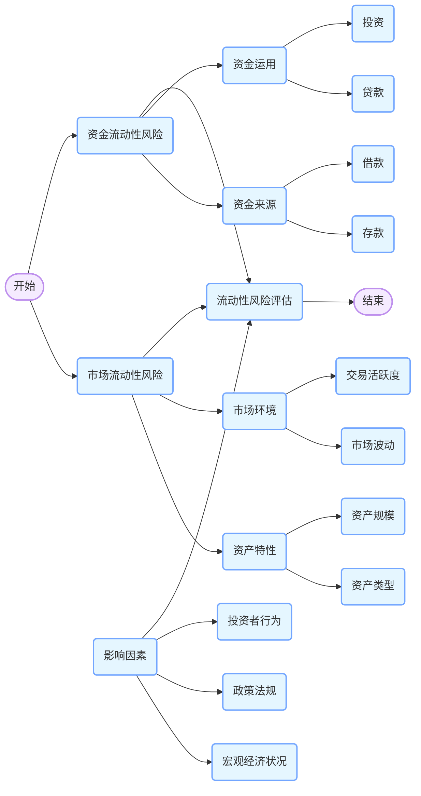

# 金融市场流动性风险评估

> 关键词：金融市场、流动性风险、风险评估、评估模型、量化分析

> 摘要：本文聚焦于金融市场流动性风险评估这一关键议题。首先介绍了金融市场流动性风险评估的背景，包括目的、预期读者、文档结构和相关术语。接着阐述了流动性风险的核心概念及其联系，给出相应的原理和架构示意图与流程图。详细讲解了核心算法原理及具体操作步骤，通过Python源代码进行阐述。探讨了相关的数学模型和公式，并举例说明。通过项目实战展示了代码实际案例及详细解释。分析了流动性风险评估在实际金融场景中的应用。推荐了学习资源、开发工具框架以及相关论文著作。最后总结了未来发展趋势与挑战，提供常见问题解答和扩展阅读参考资料，旨在为金融从业者和研究者提供全面深入的流动性风险评估知识体系。

## 1. 背景介绍 
### 1.1 目的和范围
金融市场的稳定运行对于全球经济的健康发展至关重要。流动性风险作为金融市场中关键的风险类型之一，可能引发金融机构的危机甚至系统性金融风险。本文章的目的在于深入探讨金融市场流动性风险评估的理论与实践方法，为金融机构、监管部门以及投资者提供全面、科学的评估框架和技术手段。

文章的范围涵盖了流动性风险的基本概念、评估的核心算法、数学模型，通过实际项目案例展示评估的具体操作，分析其在不同金融场景中的应用，同时提供相关的学习资源、工具和研究成果，以帮助读者全面理解和掌握金融市场流动性风险评估的知识和技能。

### 1.2 预期读者
本文预期读者包括金融领域的专业人士，如银行家、基金经理、风险管理人员等，他们需要深入了解流动性风险评估方法以进行有效的风险管理和投资决策。同时，也适合金融监管部门的工作人员，帮助他们制定合理的监管政策。此外，对于金融专业的学生和研究人员，本文提供了丰富的理论和实践知识，有助于他们深入研究金融市场流动性风险相关课题。

### 1.3 文档结构概述
本文将按照以下结构展开：首先介绍金融市场流动性风险评估的背景信息，包括目的、读者群体和文档结构等。接着阐述流动性风险的核心概念及其相互联系，给出原理和架构示意图与流程图。详细讲解核心算法原理及具体操作步骤，通过Python代码进行说明。介绍相关的数学模型和公式，并举例解释。通过项目实战展示代码案例和详细解读。分析流动性风险评估在实际金融场景中的应用。推荐学习资源、开发工具框架和相关论文著作。最后总结未来发展趋势与挑战，提供常见问题解答和扩展阅读参考资料。

### 1.4 术语表
#### 1.4.1 核心术语定义
- **流动性风险**：指金融资产持有者无法以合理价格及时变现资产而遭受损失的可能性，或金融机构无法及时以合理成本满足资金需求的风险。
- **市场流动性**：反映金融市场中资产能够以合理价格迅速买卖的能力。
- **资金流动性**：指金融机构满足短期资金需求的能力，包括存款提取、债务偿还等。
- **流动性覆盖率（LCR）**：衡量金融机构在短期严重压力情景下，可用的优质流动性资产能否满足未来30天的流动性需求。
- **净稳定资金比率（NSFR）**：用于评估金融机构在较长时期内，稳定资金来源能否支持其资产业务发展的能力。

#### 1.4.2 相关概念解释
- **买卖价差**：指金融资产买入价和卖出价之间的差额，是衡量市场流动性的重要指标之一。较小的买卖价差通常表示市场流动性较好。
- **成交量**：在一定时间内金融资产的交易数量，反映了市场的活跃程度和资产的流动性。较高的成交量通常意味着较好的流动性。
- **流动性黑洞**：指在市场极端情况下，由于投资者的恐慌性抛售和市场参与者的撤离，导致市场流动性迅速枯竭，资产价格暴跌的现象。

#### 1.4.3 缩略词列表
- **LCR**：流动性覆盖率（Liquidity Coverage Ratio）
- **NSFR**：净稳定资金比率（Net Stable Funding Ratio）
- **VaR**：风险价值（Value at Risk）
- **CVaR**：条件风险价值（Conditional Value at Risk）

## 2. 核心概念与联系 

### 流动性风险的分类
流动性风险主要分为市场流动性风险和资金流动性风险。市场流动性风险与金融资产在市场上的交易特性相关，而资金流动性风险则侧重于金融机构的资金来源和运用情况。

### 流动性风险的影响因素
影响流动性风险的因素众多，包括市场环境、宏观经济状况、政策法规、投资者行为等。市场环境的变化，如市场波动加剧、交易活跃度下降等，会直接影响资产的流动性。宏观经济状况不佳可能导致投资者信心下降，进而引发资金撤离，增加流动性风险。政策法规的调整，如监管要求的提高，可能对金融机构的资金配置和流动性管理产生影响。投资者的恐慌性抛售或非理性行为也会加剧流动性风险。

### 核心概念原理和架构的文本示意图
```plaintext
金融市场流动性风险评估
|-- 市场流动性风险
|   |-- 资产特性
|   |   |-- 资产类型
|   |   |-- 资产规模
|   |-- 市场环境
|   |   |-- 市场波动
|   |   |-- 交易活跃度
|-- 资金流动性风险
|   |-- 资金来源
|   |   |-- 存款
|   |   |-- 借款
|   |-- 资金运用
|   |   |-- 贷款
|   |   |-- 投资
|-- 影响因素
|   |-- 宏观经济状况
|   |-- 政策法规
|   |-- 投资者行为
```

### Mermaid 流程图


## 3. 核心算法原理 & 具体操作步骤 

### 基于历史数据的流动性风险评估算法
该算法通过分析金融资产的历史交易数据，计算相关的流动性指标，如买卖价差、成交量等，来评估资产的流动性风险。

#### 算法原理
- 收集金融资产的历史交易数据，包括交易价格、成交量、买卖价差等。
- 对数据进行清洗和预处理，去除异常值和缺失值。
- 计算流动性指标，如平均买卖价差、日均成交量等。
- 根据流动性指标的变化趋势和分布情况，评估资产的流动性风险。

#### Python 源代码实现
```python
import pandas as pd
import numpy as np

# 读取历史交易数据
def read_data(file_path):
    data = pd.read_csv(file_path)
    return data

# 数据清洗和预处理
def preprocess_data(data):
    # 去除缺失值
    data = data.dropna()
    # 去除异常值（这里简单假设价格和成交量的异常值为超过均值3倍标准差的值）
    price_mean = data['price'].mean()
    price_std = data['price'].std()
    volume_mean = data['volume'].mean()
    volume_std = data['volume'].std()
    data = data[(data['price'] < price_mean + 3 * price_std) & (data['price'] > price_mean - 3 * price_std)]
    data = data[(data['volume'] < volume_mean + 3 * volume_std) & (data['volume'] > volume_mean - 3 * volume_std)]
    return data

# 计算流动性指标
def calculate_liquidity_metrics(data):
    # 平均买卖价差
    avg_spread = data['spread'].mean()
    # 日均成交量
    daily_avg_volume = data['volume'].mean()
    return avg_spread, daily_avg_volume

# 评估流动性风险
def assess_liquidity_risk(avg_spread, daily_avg_volume):
    if avg_spread > 0.5 and daily_avg_volume < 1000:
        return '高流动性风险'
    elif avg_spread > 0.3 and daily_avg_volume < 5000:
        return '中流动性风险'
    else:
        return '低流动性风险'

# 主函数
def main():
    file_path = 'historical_data.csv'
    data = read_data(file_path)
    data = preprocess_data(data)
    avg_spread, daily_avg_volume = calculate_liquidity_metrics(data)
    risk_level = assess_liquidity_risk(avg_spread, daily_avg_volume)
    print(f'平均买卖价差: {avg_spread}')
    print(f'日均成交量: {daily_avg_volume}')
    print(f'流动性风险等级: {risk_level}')

if __name__ == '__main__':
    main()
```

### 具体操作步骤
1. **数据收集**：从金融数据提供商、交易所或其他可靠数据源获取金融资产的历史交易数据。
2. **数据清洗和预处理**：使用上述Python代码中的`preprocess_data`函数对数据进行清洗，去除缺失值和异常值。
3. **计算流动性指标**：调用`calculate_liquidity_metrics`函数计算平均买卖价差和日均成交量等流动性指标。
4. **评估流动性风险**：根据计算得到的流动性指标，使用`assess_liquidity_risk`函数评估资产的流动性风险等级。

## 4. 数学模型和公式 & 详细讲解 & 举例说明 

### 流动性覆盖率（LCR）模型
#### 数学公式
$$LCR = \frac{HQLA}{NCOF}$$
其中，$HQLA$ 表示优质流动性资产，$NCOF$ 表示未来30天的净现金流出。

#### 详细讲解
流动性覆盖率模型的目的是确保金融机构在短期严重压力情景下，拥有足够的优质流动性资产来满足未来30天的流动性需求。优质流动性资产是指能够在市场上迅速变现且价值相对稳定的资产，如现金、国债等。净现金流出是指在压力情景下，金融机构预计的现金流出减去预计的现金流入。

#### 举例说明
假设某银行的优质流动性资产为1000亿元，未来30天的净现金流出为800亿元，则该银行的流动性覆盖率为：
$$LCR = \frac{1000}{800} = 1.25$$
根据监管要求，流动性覆盖率应不低于100%，因此该银行的流动性状况较好。

### 净稳定资金比率（NSFR）模型
#### 数学公式
$$NSFR = \frac{ASF}{RSF}$$
其中，$ASF$ 表示可用的稳定资金，$RSF$ 表示所需的稳定资金。

#### 详细讲解
净稳定资金比率模型用于评估金融机构在较长时期内，稳定资金来源能否支持其资产业务发展的能力。可用的稳定资金是指金融机构在未来一年中能够持续获得的资金，如长期存款、权益资本等。所需的稳定资金是指金融机构的资产和表外业务在未来一年中所需的稳定资金支持。

#### 举例说明
假设某金融机构的可用稳定资金为1500亿元，所需稳定资金为1200亿元，则该金融机构的净稳定资金比率为：
$$NSFR = \frac{1500}{1200} = 1.25$$
监管要求净稳定资金比率应不低于100%，该金融机构的稳定资金状况良好。

### 风险价值（VaR）模型在流动性风险评估中的应用
#### 数学公式
在一定置信水平 $\alpha$ 下，$VaR$ 表示在未来一定时间内，资产组合可能遭受的最大损失。对于单个资产，$VaR$ 的计算公式为：
$$VaR = z_{\alpha} \sigma \sqrt{\Delta t}$$
其中，$z_{\alpha}$ 是标准正态分布的分位数，对应置信水平 $\alpha$；$\sigma$ 是资产收益率的标准差；$\Delta t$ 是时间间隔。

#### 详细讲解
$VaR$ 模型通过统计分析方法，衡量资产在一定置信水平下的潜在损失。在流动性风险评估中，$VaR$ 可以帮助投资者和金融机构了解在市场流动性紧张情况下，资产可能遭受的最大损失，从而合理配置资产和管理风险。

#### 举例说明
假设某资产的收益率标准差为0.05，时间间隔为1天，置信水平为95%（对应的 $z_{\alpha} = 1.645$），则该资产的 $VaR$ 为：
$$VaR = 1.645 \times 0.05 \times \sqrt{1} = 0.08225$$
这意味着在95%的置信水平下，该资产在未来1天内可能遭受的最大损失为8.225%。

## 5. 项目实战：代码实际案例和详细解释说明 

### 5.1  开发环境搭建
- **操作系统**：Windows、Linux 或 macOS 均可。
- **Python 版本**：建议使用 Python 3.7 及以上版本。
- **开发工具**：推荐使用 PyCharm 或 Jupyter Notebook 作为开发环境。
- **所需库**：`pandas`、`numpy` 等，可以使用以下命令进行安装：
```sh
pip install pandas numpy
```

### 5.2  源代码详细实现和代码解读
```python
import pandas as pd
import numpy as np

# 读取历史交易数据
def read_data(file_path):
    """
    该函数用于读取历史交易数据，将数据存储在 Pandas 的 DataFrame 中。
    :param file_path: 数据文件的路径
    :return: 包含历史交易数据的 DataFrame
    """
    data = pd.read_csv(file_path)
    return data

# 数据清洗和预处理
def preprocess_data(data):
    """
    该函数对读取的数据进行清洗和预处理，去除缺失值和异常值。
    :param data: 包含历史交易数据的 DataFrame
    :return: 清洗和预处理后的 DataFrame
    """
    # 去除缺失值
    data = data.dropna()
    # 去除异常值（这里简单假设价格和成交量的异常值为超过均值3倍标准差的值）
    price_mean = data['price'].mean()
    price_std = data['price'].std()
    volume_mean = data['volume'].mean()
    volume_std = data['volume'].std()
    data = data[(data['price'] < price_mean + 3 * price_std) & (data['price'] > price_mean - 3 * price_std)]
    data = data[(data['volume'] < volume_mean + 3 * volume_std) & (data['volume'] > volume_mean - 3 * volume_std)]
    return data

# 计算流动性指标
def calculate_liquidity_metrics(data):
    """
    该函数计算流动性指标，如平均买卖价差和日均成交量。
    :param data: 清洗和预处理后的 DataFrame
    :return: 平均买卖价差和日均成交量
    """
    # 平均买卖价差
    avg_spread = data['spread'].mean()
    # 日均成交量
    daily_avg_volume = data['volume'].mean()
    return avg_spread, daily_avg_volume

# 评估流动性风险
def assess_liquidity_risk(avg_spread, daily_avg_volume):
    """
    该函数根据计算得到的流动性指标评估流动性风险等级。
    :param avg_spread: 平均买卖价差
    :param daily_avg_volume: 日均成交量
    :return: 流动性风险等级
    """
    if avg_spread > 0.5 and daily_avg_volume < 1000:
        return '高流动性风险'
    elif avg_spread > 0.3 and daily_avg_volume < 5000:
        return '中流动性风险'
    else:
        return '低流动性风险'

# 主函数
def main():
    """
    主函数，调用上述函数完成数据读取、预处理、指标计算和风险评估。
    """
    file_path = 'historical_data.csv'
    data = read_data(file_path)
    data = preprocess_data(data)
    avg_spread, daily_avg_volume = calculate_liquidity_metrics(data)
    risk_level = assess_liquidity_risk(avg_spread, daily_avg_volume)
    print(f'平均买卖价差: {avg_spread}')
    print(f'日均成交量: {daily_avg_volume}')
    print(f'流动性风险等级: {risk_level}')

if __name__ == '__main__':
    main()
```

### 5.3  代码解读与分析
- **`read_data` 函数**：使用 `pandas` 库的 `read_csv` 函数读取历史交易数据文件，并将其存储在 DataFrame 中。
- **`preprocess_data` 函数**：首先使用 `dropna` 方法去除数据中的缺失值。然后计算价格和成交量的均值和标准差，通过筛选条件去除超过均值3倍标准差的异常值。
- **`calculate_liquidity_metrics` 函数**：计算平均买卖价差和日均成交量，分别使用 `mean` 方法对 `spread` 和 `volume` 列进行计算。
- **`assess_liquidity_risk` 函数**：根据平均买卖价差和日均成交量的阈值判断流动性风险等级，返回相应的风险等级字符串。
- **`main` 函数**：调用上述函数完成整个流程，包括数据读取、预处理、指标计算和风险评估，并打印出结果。

## 6. 实际应用场景 
### 金融机构的风险管理
金融机构，如银行、证券公司等，需要对自身的流动性风险进行评估和管理。通过评估流动性风险，金融机构可以合理配置资产，确保有足够的流动性来满足客户的资金需求和应对突发情况。例如，银行可以根据流动性覆盖率和净稳定资金比率等指标，调整资产负债结构，提高自身的流动性管理水平。

### 投资者的投资决策
投资者在进行投资决策时，需要考虑投资资产的流动性风险。流动性较差的资产在市场波动时可能难以变现，导致投资者遭受损失。因此，投资者可以通过评估资产的流动性指标，如买卖价差、成交量等，选择流动性较好的资产进行投资，降低投资风险。

### 监管部门的市场监管
监管部门需要对金融市场的流动性风险进行监测和监管，以维护金融市场的稳定。监管部门可以制定相关的监管政策和指标要求，如流动性覆盖率和净稳定资金比率的最低标准，要求金融机构遵守。同时，监管部门可以通过对金融机构的流动性风险评估结果进行分析，及时发现潜在的风险隐患，采取相应的监管措施。

### 金融产品的设计和定价
在金融产品的设计和定价过程中，需要考虑产品的流动性风险。流动性较差的金融产品可能需要给予投资者更高的回报，以补偿其承担的流动性风险。因此，金融机构在设计和定价金融产品时，需要对产品的流动性风险进行评估，合理确定产品的价格和收益率。

## 7. 工具和资源推荐
### 7.1 学习资源推荐
#### 7.1.1 书籍推荐
- 《金融风险管理师（FRM）考试手册》：全面介绍了金融风险管理的理论和实践，包括流动性风险评估的相关内容。
- 《流动性黑洞：理解、度量与应对金融市场的流动性危机》：深入探讨了流动性黑洞的形成机制、度量方法和应对策略。
- 《金融市场与金融机构基础》：系统介绍了金融市场和金融机构的基本知识，包括流动性风险的概念和影响。

#### 7.1.2 在线课程
- Coursera 上的“Financial Risk Management”课程：由知名大学的教授授课，讲解金融风险管理的理论和实践，包括流动性风险评估的方法和技术。
- edX 上的“Risk Management in Financial Institutions”课程：重点介绍金融机构的风险管理，包括流动性风险的识别、评估和控制。

#### 7.1.3 技术博客和网站
- 金融界网站：提供金融市场的最新资讯和分析，包括流动性风险的相关报道和研究成果。
- 中国金融四十人论坛：汇聚了金融领域的专家和学者，发布关于金融市场和风险管理的前沿观点和研究报告。

### 7.2 开发工具框架推荐
#### 7.2.1 IDE和编辑器
- PyCharm：一款专业的 Python 集成开发环境，提供代码编辑、调试、版本控制等功能，适合开发金融数据分析和风险评估相关的 Python 程序。
- Jupyter Notebook：一个交互式的开发环境，支持 Python、R 等多种编程语言，方便进行数据探索、模型开发和结果展示。

#### 7.2.2 调试和性能分析工具
- PDB：Python 内置的调试器，用于调试 Python 程序，帮助开发者定位和解决代码中的问题。
- cProfile：Python 标准库中的性能分析工具，用于分析 Python 程序的性能瓶颈，找出执行时间较长的代码段。

#### 7.2.3 相关框架和库
- Pandas：用于数据处理和分析的 Python 库，提供了高效的数据结构和数据操作方法，适用于金融数据的清洗、预处理和分析。
- NumPy：用于科学计算的 Python 库，提供了高效的数组和矩阵运算功能，在金融模型的实现中广泛应用。
- Scikit-learn：用于机器学习的 Python 库，提供了丰富的机器学习算法和工具，可用于构建流动性风险评估模型。

### 7.3 相关论文著作推荐
#### 7.3.1 经典论文
- Brunnermeier, M. K., & Pedersen, L. H. (2009). Market liquidity and funding liquidity. The Review of Financial Studies, 22(6), 2201-2238. 该论文深入探讨了市场流动性和资金流动性之间的关系，提出了流动性螺旋的概念。
- Acharya, V. V., & Pedersen, L. H. (2005). Asset pricing with liquidity risk. Journal of Financial Economics, 77(2), 375-410. 该论文研究了流动性风险对资产定价的影响，建立了包含流动性风险的资产定价模型。

#### 7.3.2 最新研究成果
- 关注《Journal of Financial Economics》、《The Review of Financial Studies》等金融领域顶级学术期刊，获取关于流动性风险评估的最新研究成果。

#### 7.3.3 应用案例分析
- 国际货币基金组织（IMF）发布的《全球金融稳定报告》，包含了全球金融市场的流动性风险评估和案例分析。
- 各国金融监管部门发布的金融稳定报告，提供了本国金融市场的流动性风险状况和监管措施案例。

## 8. 总结：未来发展趋势与挑战
### 未来发展趋势
- **数字化和智能化**：随着金融科技的发展，数字化和智能化将在流动性风险评估中发挥越来越重要的作用。利用大数据、人工智能和机器学习等技术，可以更准确地收集和分析金融数据，提高流动性风险评估的效率和准确性。
- **宏观审慎监管**：监管部门将更加注重宏观审慎监管，从整个金融体系的角度评估和管理流动性风险。通过建立宏观审慎监管框架，监测和防范系统性金融风险，维护金融市场的稳定。
- **跨市场和跨境流动性风险评估**：金融市场的全球化和互联互通使得跨市场和跨境流动性风险日益凸显。未来的流动性风险评估将更加关注不同市场和国家之间的流动性传导机制，加强国际合作和协调。

### 挑战
- **数据质量和可得性**：准确的流动性风险评估需要大量高质量的数据支持。然而，金融数据的质量和可得性存在一定的问题，如数据缺失、数据不准确等，这给流动性风险评估带来了挑战。
- **模型的复杂性和不确定性**：随着金融市场的不断发展和创新，流动性风险评估模型越来越复杂。复杂的模型可能存在参数估计不准确、模型假设不合理等问题，导致评估结果的不确定性增加。
- **市场的不确定性和波动性**：金融市场的不确定性和波动性较大，突发事件和市场异常情况可能导致流动性风险急剧上升。如何在不确定的市场环境中准确评估和管理流动性风险，是未来面临的重要挑战。

## 9. 附录：常见问题与解答
### 1. 什么是流动性风险？
流动性风险是指金融资产持有者无法以合理价格及时变现资产而遭受损失的可能性，或金融机构无法及时以合理成本满足资金需求的风险。

### 2. 如何衡量流动性风险？
可以通过多种指标来衡量流动性风险，如买卖价差、成交量、流动性覆盖率、净稳定资金比率等。

### 3. 流动性风险评估有哪些方法？
常见的流动性风险评估方法包括基于历史数据的分析方法、压力测试方法、风险价值模型等。

### 4. 金融机构如何管理流动性风险？
金融机构可以通过合理配置资产、优化负债结构、建立流动性储备、加强流动性监测和预警等措施来管理流动性风险。

### 5. 流动性风险评估模型的准确性如何保证？
为保证流动性风险评估模型的准确性，需要使用高质量的数据，合理选择模型和参数，进行模型验证和回测，同时结合专家判断和市场经验。

## 10. 扩展阅读 & 参考资料
### 扩展阅读
- 《金融科技时代的风险管理》：探讨了金融科技对风险管理的影响和挑战，包括流动性风险评估的新方法和技术。
- 《系统性金融风险防范与化解》：研究了系统性金融风险的形成机制和防范措施，对理解流动性风险与系统性金融风险的关系有帮助。

### 参考资料
- 巴塞尔银行监管委员会发布的相关文件和指引，如《流动性覆盖率和流动性风险监测标准》、《净稳定资金比率》等。
- 各国金融监管部门发布的法律法规和监管政策，如中国银保监会发布的《商业银行流动性风险管理办法》等。